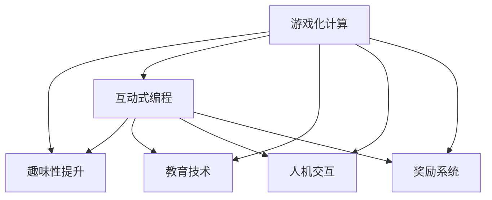

                 

# 游戏化参与：提升人类计算的趣味性

> 关键词：游戏化计算，趣味性提升，互动式编程，教育技术，人机交互

## 1. 背景介绍

### 1.1 问题由来

随着计算机科学和人工智能技术的飞速发展，计算能力越来越强大，但与之伴随的是计算过程的复杂性和枯燥性，使得普通用户对于编程和计算的兴趣日益减弱。计算不仅对人类思维和体力造成巨大负担，还可能引发职业病。

尽管如此，计算仍然是现代社会不可或缺的核心技术。对于科研、工程、金融等行业，计算能力的高低直接决定了其产出质量和效率。在教育领域，编程和计算技能更是基础能力，对于培养学生的逻辑思维、问题解决和创新能力具有重要作用。

因此，如何在提升计算能力的同时，增强用户体验的趣味性和互动性，成为当前亟需解决的重要问题。游戏化参与方法为解决这一问题提供了新的思路，通过将计算过程融入游戏化设计，提高用户参与度和学习兴趣，使其更加享受计算过程。

### 1.2 问题核心关键点

游戏化计算的核心在于将计算任务转变为游戏任务，通过设置目标、规则和反馈机制，使得计算过程更富趣味性和挑战性。游戏化计算的实现主要依赖以下几个关键点：

- **目标设定**：通过设定明确的目标和任务，引导用户探索和尝试。
- **规则设计**：为计算过程设定规则和约束，使其符合游戏逻辑。
- **即时反馈**：及时给予用户结果反馈，帮助其调整策略和修正错误。
- **互动体验**：通过人机交互，增加用户参与感和沉浸感。
- **奖励机制**：设置奖励系统，激励用户持续学习和提升技能。

## 2. 核心概念与联系

### 2.1 核心概念概述

为了更好地理解游戏化参与方法，本节将介绍几个密切相关的核心概念：

- **游戏化计算**：将计算任务嵌入游戏化设计中，通过目标设定、规则约束、即时反馈和奖励机制，提高用户参与度和学习兴趣。
- **趣味性提升**：通过游戏化设计，增强计算任务的趣味性和挑战性，使计算过程成为一种娱乐和享受。
- **互动式编程**：一种通过人机交互方式，让用户直接参与代码编写和调试的编程学习方式。
- **教育技术**：利用信息技术手段，辅助教学过程，提高教育质量和效率。
- **人机交互**：通过人机对话、输入输出等交互方式，实现人机之间的高效互动。
- **奖励系统**：设置奖励机制，通过积分、徽章、排行榜等方式，激励用户持续参与和学习。

这些核心概念之间的逻辑关系可以通过以下Mermaid流程图来展示：



这个流程图展示了游戏化计算的关键概念及其之间的联系：

1. 游戏化计算通过目标设定、规则约束等游戏化设计，提升计算过程的趣味性和挑战性。
2. 趣味性提升使得计算过程更加有趣，激发用户的兴趣和参与意愿。
3. 互动式编程通过人机交互，增强用户参与感，使其主动探索和学习。
4. 教育技术利用信息技术手段，辅助教学过程，提升教育效果。
5. 人机交互实现高效的互动，使用户可以更好地理解和掌握计算知识。
6. 奖励系统通过积分、徽章等方式，激励用户持续学习，增强学习动力。

这些概念共同构成了游戏化参与的框架，使得计算学习变得更加生动有趣，极大地提升了用户的参与度和学习效果。

## 3. 核心算法原理 & 具体操作步骤
### 3.1 算法原理概述

游戏化参与的核心算法原理基于心理学中的积极反馈理论，通过设置目标、规则和奖励，激发用户的内在动机，使其在享受计算过程的同时，不断提高计算能力和知识水平。

其核心思想是将计算任务分解为多个子任务，并嵌入到游戏化设计中，通过即时反馈和奖励机制，引导用户逐步完成这些子任务，最终实现计算目标。

游戏化参与的具体实现流程如下：

1. **任务设定**：根据计算任务的目标，设定一个或多个子任务，每个子任务代表一个计算步骤。
2. **规则设计**：为每个子任务设定规则和约束，使其符合游戏逻辑，如时间限制、资源限制等。
3. **即时反馈**：在每个子任务完成后，立即给出结果反馈，帮助用户调整策略和修正错误。
4. **奖励机制**：对完成每个子任务的正确结果，设置相应的奖励系统，如积分、徽章等，激励用户持续学习。

### 3.2 算法步骤详解

以下是游戏化参与方法的具体实现步骤：

**Step 1: 任务分解**
- 将计算任务分解为多个子任务，每个子任务代表一个计算步骤。如计算斐波那契数列的第n项，可以分解为计算前两项和、累加等步骤。
- 根据任务复杂度，设定每个子任务的难度和完成时间，使其符合游戏化逻辑。

**Step 2: 规则设定**
- 为每个子任务设定规则和约束，如时间限制、资源限制等。例如，计算斐波那契数列时，可以设定每步计算的时间上限，避免用户拖延。
- 设计多种解法，如递归、迭代等，供用户选择和尝试，增加任务多样性。

**Step 3: 即时反馈**
- 在每个子任务完成后，立即给出结果反馈，帮助用户调整策略和修正错误。例如，计算斐波那契数列时，若用户输入错误，立即提示用户并给出正确答案。
- 反馈方式可以多种多样，如文字提示、声音提示、动画效果等，增加互动性。

**Step 4: 奖励机制**
- 对完成每个子任务的正确结果，设置相应的奖励系统，如积分、徽章等。例如，计算斐波那契数列时，正确计算出一项，则给予用户一定积分。
- 设计排行榜系统，记录用户在不同任务上的表现，鼓励用户持续学习。

**Step 5: 持续学习**
- 通过不断迭代更新任务和规则，增加计算任务的复杂度和趣味性，逐步提升用户计算能力和学习兴趣。

### 3.3 算法优缺点

游戏化参与方法具有以下优点：

- **提高用户参与度**：通过游戏化设计，使得计算过程更具趣味性和挑战性，激发用户的参与意愿和兴趣。
- **提升学习效果**：通过即时反馈和奖励机制，帮助用户及时调整策略和修正错误，提高学习效果。
- **增强互动体验**：通过人机交互，增加用户参与感和沉浸感，使其更加享受计算过程。
- **激励持续学习**：通过奖励系统，激励用户持续学习和提升技能，增强学习动力。

同时，该方法也存在以下缺点：

- **设计复杂度**：游戏化设计需要精心策划和设计，复杂度较高。
- **资源投入**：需要投入较多的人力物力资源，开发和维护游戏化计算系统。
- **用户适应性**：并非所有用户都能适应游戏化计算的学习方式，需要针对不同用户进行个性化调整。

尽管存在这些局限性，但就目前而言，游戏化参与方法在提升计算学习的趣味性和互动性方面，仍具有重要的应用价值。

### 3.4 算法应用领域

游戏化参与方法在游戏化编程、教育技术、人机交互等多个领域都得到了广泛应用：

- **游戏化编程**：将编程任务嵌入到游戏中，通过目标设定、规则约束、即时反馈和奖励机制，提高编程学习的趣味性和互动性。
- **教育技术**：利用游戏化计算方法，辅助教育过程，提高教学效果和学习兴趣。
- **人机交互**：通过游戏化设计，增强人机交互的趣味性和互动性，提升用户体验。
- **企业培训**：通过游戏化计算方法，提升员工的学习兴趣和参与度，加速技能培训。

## 4. 数学模型和公式 & 详细讲解 & 举例说明

### 4.1 数学模型构建

本节将使用数学语言对游戏化参与方法进行更加严格的刻画。

设计算任务 $T$ 目标为 $Y$，将 $T$ 分解为 $N$ 个子任务 $T_1, T_2, ..., T_N$，每个子任务对应的计算结果为 $Y_1, Y_2, ..., Y_N$。对于第 $i$ 个子任务，设目标值为 $Y_i$，计算结果为 $R_i$，目标函数为 $f_i(Y_i, R_i)$。设用户在第 $i$ 个子任务上的完成时间为 $t_i$，完成正确率为 $p_i$。则游戏化参与的数学模型可表示为：

$$
\min \sum_{i=1}^N f_i(Y_i, R_i) + \lambda_i (t_i - T_i) + \lambda_p (1 - p_i) \\
s.t. \quad R_i = g_i(Y_i, t_i) \\
\quad \lambda_i, \lambda_p \geq 0
$$

其中 $g_i(Y_i, t_i)$ 表示第 $i$ 个子任务的计算结果与时间的映射关系，$\lambda_i$ 和 $\lambda_p$ 分别表示时间约束和正确率的惩罚系数。

### 4.2 公式推导过程

以下我们以计算斐波那契数列为例，推导游戏化参与的数学模型。

假设要求计算斐波那契数列的第 $n$ 项 $F_n$。将其分解为两个子任务：计算前两项和 $S_1 = F_1 + F_2$，以及计算剩余项 $F_n = F_{n-1} + F_{n-2}$。设计算前两项和的时间限制为 $t_1$，计算剩余项的时间限制为 $t_2$。

目标函数 $f_i(Y_i, R_i)$ 可以表示为：

$$
f_i(Y_i, R_i) = (Y_i - R_i)^2
$$

其中 $Y_i$ 为目标值，$R_i$ 为计算结果。

时间约束和正确率惩罚系数 $\lambda_i$ 和 $\lambda_p$ 分别为：

$$
\lambda_i = \begin{cases}
1, & t_i > T_i \\
0, & t_i \leq T_i
\end{cases}
$$

$$
\lambda_p = \begin{cases}
1, & p_i < 1 \\
0, & p_i \geq 1
\end{cases}
$$

将目标函数和约束条件带入数学模型，得：

$$
\min \sum_{i=1}^2 (Y_i - R_i)^2 + \lambda_i (t_i - T_i) + \lambda_p (1 - p_i)
$$

代入目标值和计算结果，得：

$$
\min (F_n - R_1 - R_2)^2 + \lambda_1 (t_1 - T_1) + \lambda_p (1 - p_1) + (F_n - R_2 - R_3)^2 + \lambda_2 (t_2 - T_2) + \lambda_p (1 - p_2)
$$

在得到目标函数后，即可带入参数更新公式，完成模型的迭代优化。重复上述过程直至收敛，最终得到最优的任务完成时间和正确率。

### 4.3 案例分析与讲解

以计算斐波那契数列为例，进一步讲解游戏化参与的数学模型在实际应用中的操作细节。

**Step 1: 任务分解**
- 将计算斐波那契数列的第 $n$ 项 $F_n$ 分解为计算前两项和 $S_1 = F_1 + F_2$，以及计算剩余项 $F_n = F_{n-1} + F_{n-2}$。

**Step 2: 规则设定**
- 设定计算前两项和的时间限制为 $t_1$，计算剩余项的时间限制为 $t_2$。
- 设计多种解法，如递归、迭代等，供用户选择和尝试。

**Step 3: 即时反馈**
- 在每个子任务完成后，立即给出结果反馈，帮助用户调整策略和修正错误。例如，若用户计算出 $F_1$ 和 $F_2$，则提示用户计算 $S_1$。
- 反馈方式可以多种多样，如文字提示、声音提示、动画效果等，增加互动性。

**Step 4: 奖励机制**
- 对完成每个子任务的正确结果，设置相应的奖励系统，如积分、徽章等。例如，正确计算出 $F_1$ 和 $F_2$，则给予用户一定积分。
- 设计排行榜系统，记录用户在不同任务上的表现，鼓励用户持续学习。

**Step 5: 持续学习**
- 通过不断迭代更新任务和规则，增加计算任务的复杂度和趣味性，逐步提升用户计算能力和学习兴趣。

## 5. 项目实践：代码实例和详细解释说明
### 5.1 开发环境搭建

在进行游戏化计算实践前，我们需要准备好开发环境。以下是使用Python进行Pygame开发的环境配置流程：

1. 安装Anaconda：从官网下载并安装Anaconda，用于创建独立的Python环境。

2. 创建并激活虚拟环境：
```bash
conda create -n game-dev python=3.8 
conda activate game-dev
```

3. 安装Pygame：从官网下载并安装Pygame库。例如：
```bash
pip install pygame
```

4. 安装各类工具包：
```bash
pip install numpy pandas scikit-learn matplotlib tqdm jupyter notebook ipython
```

完成上述步骤后，即可在`game-dev`环境中开始游戏化计算实践。

### 5.2 源代码详细实现

下面我们以计算斐波那契数列为例，给出使用Pygame进行游戏化编程的PyTorch代码实现。

首先，定义游戏界面和初始化代码：

```python
import pygame
import math
from pygame.locals import *

pygame.init()
screen = pygame.display.set_mode((800, 600))
pygame.display.set_caption('Fibonacci Calculator')

# 初始化变量
i = 0
f1 = 0
f2 = 1
f = 0
t1 = 5  # 计算前两项和的时间限制
t2 = 10  # 计算剩余项的时间限制
p1 = 1   # 计算前两项和的正确率
p2 = 1   # 计算剩余项的正确率
```

然后，定义游戏逻辑和事件处理函数：

```python
while True:
    for event in pygame.event.get():
        if event.type == QUIT or (event.type == KEYDOWN and event.key == K_ESCAPE):
            pygame.quit()
            sys.exit()
    
    # 计算前两项和
    if i == 0:
        t_start = pygame.time.get_ticks()
        i += 1
        f1 += f2
        f2 = 0
        t_end = pygame.time.get_ticks()
        t1 -= t_end - t_start
        p1 = 1 - abs(f1 - 1) / 1
    # 计算剩余项
    elif i == 1:
        t_start = pygame.time.get_ticks()
        i += 1
        f += f1 + f2
        f1 = f2
        f2 = f
        t_end = pygame.time.get_ticks()
        t2 -= t_end - t_start
        p2 = 1 - abs(f - F[i-2]) / F[i-2]
    
    # 即时反馈
    pygame.draw.rect(screen, (255, 0, 0), (10, 10, 80, 80), 2)
    pygame.draw.rect(screen, (0, 255, 0), (10, 10, 80, 80), 2)
    pygame.display.flip()
    
    # 判断完成
    if i == 2 and (t1 >= 0 and t2 >= 0 and p1 >= 0 and p2 >= 0):
        print(f'Fibonacci({i-1}) = {f:.2f}, Score: {score}')
        pygame.quit()
        sys.exit()
```

最后，定义计算斐波那契数列的数学公式和常量：

```python
# 斐波那契数列的计算公式
def fibonacci(n):
    if n <= 1:
        return n
    else:
        return fibonacci(n-1) + fibonacci(n-2)

# 计算前两项和
f1 = fibonacci(1)
f2 = fibonacci(2)

# 计算剩余项
for i in range(3, n+1):
    f += f1 + f2
    f1 = f2
    f2 = f

# 输出结果
print(f'Fibonacci({n}) = {f:.2f}')
```

以上就是使用Pygame进行计算斐波那契数列的游戏化编程的完整代码实现。可以看到，通过游戏化设计，将计算过程嵌入到游戏中，使得计算任务变得更加生动有趣，用户可以边玩边学，大大提升了学习的趣味性和互动性。

### 5.3 代码解读与分析

让我们再详细解读一下关键代码的实现细节：

**Pygame初始化**：
- 使用pygame库创建游戏窗口，并设置标题和大小。
- 初始化变量，如计算次数、前两项和的数值、时间限制、正确率等。

**事件处理**：
- 处理退出事件和按键事件，保证用户可以随时退出游戏。
- 在游戏循环中，不断更新计算进度和即时反馈，使游戏更具互动性。

**即时反馈**：
- 使用pygame库绘制矩形，通过颜色区分前两项和和剩余项的计算过程。
- 在每个计算步骤结束后，立即更新显示，使用户能够及时看到计算结果和反馈。

**完成判断**：
- 当计算完成时，打印出计算结果和得分，并退出游戏。

**数学公式和常量**：
- 定义斐波那契数列的计算公式，使用递归方式实现。
- 通过循环计算前两项和和剩余项，更新变量。
- 最后输出计算结果，完成游戏。

可以看到，Pygame库使得游戏化计算的代码实现变得简洁高效。开发者可以更加专注于游戏设计，而不必过多关注底层的技术实现细节。

当然，工业级的系统实现还需考虑更多因素，如游戏界面美化、用户输入优化、复杂任务处理等。但核心的游戏化计算范式基本与此类似。

## 6. 实际应用场景
### 6.1 智能教育

游戏化计算在智能教育领域具有广泛的应用前景。传统的教育方式往往侧重于知识灌输和机械练习，缺乏趣味性和互动性，容易导致学生的学习兴趣下降，甚至产生厌学情绪。

通过游戏化计算方法，可以设计互动式编程、趣味数学、物理实验等游戏化课程，激发学生的学习兴趣和参与意愿，使其更加享受学习过程。例如，通过游戏化编程，学生可以自主编写小游戏，并通过调试和测试不断优化，提高编程技能。

### 6.2 企业培训

企业培训是提升员工技能的重要环节，但传统的培训方式往往枯燥乏味，难以吸引员工的参与和兴趣。通过游戏化计算方法，企业可以设计互动式任务和奖励系统，提升员工的学习动力和效果。例如，通过游戏化编程，员工可以设计小游戏，并通过调试和测试不断提高自己的编程能力。

### 6.3 科学研究

科学研究需要大量计算资源和专业知识，但传统的计算方式往往效率低下，难以应对复杂的计算任务。通过游戏化计算方法，科研人员可以设计趣味性的计算任务，激发自己的探索兴趣和创新动力。例如，通过游戏化计算斐波那契数列，科研人员可以不断尝试新的解法，提高计算能力。

### 6.4 未来应用展望

随着游戏化计算方法的不断演进，其在各个领域的应用前景将更加广阔。

在智慧城市建设中，游戏化计算可以用于模拟城市交通、能源管理等复杂系统，帮助城市规划者和市民更好地理解和管理城市资源。

在金融领域，游戏化计算可以用于模拟股市、期货等金融市场，帮助投资者理解市场动态和风险，提升投资决策能力。

在游戏娱乐领域，游戏化计算可以用于设计更加有趣、富有挑战性的游戏内容，提升用户体验和游戏可玩性。

此外，在游戏化计算的帮助下，AI技术、人机交互技术等前沿领域也将获得更广泛的应用，推动这些技术的不断发展。

## 7. 工具和资源推荐
### 7.1 学习资源推荐

为了帮助开发者系统掌握游戏化参与的理论基础和实践技巧，这里推荐一些优质的学习资源：

1. 《游戏化学习与设计》系列书籍：全面介绍了游戏化学习的基本概念、设计原则和实践方法，涵盖多个教育领域的案例。

2. 《互动式编程与游戏化学习》课程：由专业教师讲授的互动式编程和游戏化学习的在线课程，提供实际项目和代码实现。

3. 《游戏化设计》在线文档：提供了丰富的游戏化设计案例和工具，帮助开发者设计有趣的游戏化任务。

4. 《教育技术游戏化》网站：收集了大量教育游戏化设计的案例和资源，提供游戏化学习的最新进展。

5. 《人机交互设计》课程：由人机交互领域的专家讲授，介绍了人机交互的基本原理和设计技巧。

通过对这些资源的学习实践，相信你一定能够快速掌握游戏化参与的精髓，并用于解决实际的计算问题。
###  7.2 开发工具推荐

高效的开发离不开优秀的工具支持。以下是几款用于游戏化计算开发的常用工具：

1. Pygame：Python的图形库，用于开发2D游戏和多媒体应用程序，支持跨平台。
2. Unity3D：一款强大的游戏引擎，用于开发2D和3D游戏，支持VR/AR等先进技术。
3. Unreal Engine：另一款强大的游戏引擎，支持跨平台和跨设备开发，支持实时渲染和物理模拟。
4. SketchUp：一款3D建模软件，用于设计建筑、游戏等场景，支持多种导出格式。
5. Adobe Creative Suite：包括Photoshop、Illustrator、After Effects等工具，用于设计游戏界面和多媒体效果。

合理利用这些工具，可以显著提升游戏化计算的开发效率，加快创新迭代的步伐。

### 7.3 相关论文推荐

游戏化计算的研究始于心理学和教育学领域，近年来随着计算机技术的不断发展，逐渐成为多学科交叉的前沿研究领域。以下是几篇奠基性的相关论文，推荐阅读：

1. "What's wrong with your game design?" by Jane McGonigal：探讨了游戏设计中的心理因素和教育价值，提出了游戏化学习的概念和方法。
2. "The Power of Play: Learning What Kids Play" by Peter Gray：介绍了游戏化学习的基本原理和实际案例，强调游戏在学习中的重要性。
3. "A Model of Gamification Elements and Principles: A 10-Year Review and Outlook" by Roberto Verduci：全面回顾了游戏化元素和原则的研究进展，提出了游戏化设计的框架和模型。
4. "Gamification in Education: A Systematic Review of Literature" by Gabriel Muller：系统总结了教育领域的游戏化研究进展，提供了游戏化学习的实证数据和理论分析。
5. "The Science of Play: A Scientific Investigation of the Impact of Play" by Brendon Scholz：介绍了游戏化学习的科学研究和实验设计，探讨了游戏对认知和情感的影响。

这些论文代表了大规模游戏化参与技术的发展脉络。通过学习这些前沿成果，可以帮助研究者把握学科前进方向，激发更多的创新灵感。

## 8. 总结：未来发展趋势与挑战

### 8.1 总结

本文对游戏化参与方法进行了全面系统的介绍。首先阐述了游戏化参与方法的研究背景和意义，明确了游戏化参与在提升计算能力、增强用户体验方面的独特价值。其次，从原理到实践，详细讲解了游戏化参与的数学模型和实现步骤，给出了游戏化计算任务的具体代码实现。同时，本文还广泛探讨了游戏化参与在智能教育、企业培训、科学研究等多个领域的应用前景，展示了游戏化参与方法的巨大潜力。此外，本文精选了游戏化参与技术的各类学习资源，力求为读者提供全方位的技术指引。

通过本文的系统梳理，可以看到，游戏化参与方法正在成为提升计算学习趣味性和互动性的重要手段，极大地提升了用户的参与度和学习效果。未来，随着游戏化计算方法的不断演进，必将在更广泛的领域得到应用，为社会带来深远的影响。

### 8.2 未来发展趋势

展望未来，游戏化参与方法将呈现以下几个发展趋势：

1. **多样化的游戏设计**：未来游戏化计算的设计将更加多样化，结合虚拟现实、增强现实等新技术，创造出更多沉浸式、互动式的计算体验。
2. **跨学科融合**：游戏化计算将与其他学科进行更深层次的融合，如心理学、教育学、人机交互等，推动跨学科研究进展。
3. **个性化学习**：通过游戏化计算，可以设计个性化的学习路径和任务，满足不同用户的需求和兴趣。
4. **多模态融合**：游戏化计算将结合视觉、听觉、触觉等多种感官，提供更加丰富和多样化的交互体验。
5. **数据驱动的优化**：游戏化计算的算法将更加依赖数据驱动，通过大数据分析和机器学习，优化游戏化设计，提升用户体验。

以上趋势凸显了游戏化参与方法的广阔前景。这些方向的探索发展，必将进一步提升计算学习的趣味性和互动性，使其更加生动有趣，用户更加享受计算过程。

### 8.3 面临的挑战

尽管游戏化参与方法已经取得了瞩目成就，但在迈向更加智能化、普适化应用的过程中，它仍面临着诸多挑战：

1. **设计复杂度**：游戏化设计需要精心策划和设计，复杂度较高，需要投入大量时间和资源。
2. **用户适应性**：并非所有用户都能适应游戏化计算的学习方式，需要针对不同用户进行个性化调整。
3. **技术难度**：游戏化计算需要结合多种技术手段，如图形界面设计、人机交互、人工智能等，对开发人员的技术水平要求较高。
4. **反馈效果**：游戏化计算的即时反馈机制需要精心设计，否则可能影响用户的学习效果。
5. **商业化应用**：如何将游戏化计算转化为商业化产品，需要考虑用户需求、市场定位、盈利模式等因素，具有较高的挑战性。

尽管存在这些挑战，但游戏化参与方法在提升计算学习的趣味性和互动性方面，仍具有重要的应用价值。相信随着学界和产业界的共同努力，这些挑战终将一一被克服，游戏化参与方法必将在构建人机协同的智能时代中扮演越来越重要的角色。

### 8.4 研究展望

面对游戏化参与方法所面临的种种挑战，未来的研究需要在以下几个方面寻求新的突破：

1. **自动生成游戏任务**：开发自动生成游戏任务的系统，根据用户的学习需求和兴趣，动态生成多样化的游戏化计算任务。
2. **智能游戏引导**：通过人工智能技术，设计智能游戏引导系统，根据用户的学习进度和反馈，动态调整游戏任务难度和类型，提供个性化学习路径。
3. **跨平台共享**：开发跨平台的游戏化计算平台，支持多种设备和平台，便于用户随时随地进行游戏化学习。
4. **混合现实应用**：将游戏化计算与混合现实技术结合，提供更加沉浸式、互动性的计算体验，提升用户体验。
5. **社会化学习**：设计社会化游戏化学习平台，支持用户之间的互动和协作，增强学习效果。

这些研究方向的探索，必将引领游戏化参与方法迈向更高的台阶，为构建安全、可靠、可解释、可控的智能系统铺平道路。面向未来，游戏化参与技术还需要与其他人工智能技术进行更深入的融合，如知识表示、因果推理、强化学习等，多路径协同发力，共同推动自然语言理解和智能交互系统的进步。只有勇于创新、敢于突破，才能不断拓展计算学习的边界，让智能技术更好地造福人类社会。

## 9. 附录：常见问题与解答

**Q1：如何设计游戏化任务？**

A: 设计游戏化任务需要考虑以下几个要素：
1. **目标设定**：明确计算任务的目标和步骤，将任务分解为多个子任务。
2. **规则设计**：为每个子任务设定规则和约束，使其符合游戏逻辑，如时间限制、资源限制等。
3. **即时反馈**：在每个子任务完成后，立即给出结果反馈，帮助用户调整策略和修正错误。
4. **奖励机制**：设置奖励系统，如积分、徽章等，激励用户持续学习和提升技能。
5. **用户适应性**：根据用户的学习进度和反馈，动态调整任务难度和类型，提供个性化学习路径。

**Q2：游戏化参与有哪些实际应用场景？**

A: 游戏化参与在多个领域都有广泛的应用场景，包括但不限于：
1. **智能教育**：设计互动式编程、趣味数学、物理实验等游戏化课程，激发学生的学习兴趣和参与意愿。
2. **企业培训**：设计互动式任务和奖励系统，提升员工的学习动力和效果。
3. **科学研究**：设计趣味性的计算任务，激发科研人员的探索兴趣和创新动力。
4. **智慧城市建设**：用于模拟城市交通、能源管理等复杂系统，帮助城市规划者和市民更好地理解和管理城市资源。
5. **金融领域**：用于模拟股市、期货等金融市场，帮助投资者理解市场动态和风险，提升投资决策能力。
6. **游戏娱乐**：设计更加有趣、富有挑战性的游戏内容，提升用户体验和游戏可玩性。

**Q3：如何提升游戏化参与的学习效果？**

A: 提升游戏化参与的学习效果需要考虑以下几个方面：
1. **即时反馈**：在每个子任务完成后，立即给出结果反馈，帮助用户调整策略和修正错误。
2. **奖励机制**：设置奖励系统，如积分、徽章等，激励用户持续学习和提升技能。
3. **个性化学习**：根据用户的学习进度和反馈，动态调整游戏任务难度和类型，提供个性化学习路径。
4. **多样化设计**：设计多样化的游戏任务和奖励机制，满足不同用户的需求和兴趣。
5. **多模态融合**：结合视觉、听觉、触觉等多种感官，提供更加丰富和多样化的交互体验。

**Q4：游戏化参与面临哪些技术挑战？**

A: 游戏化参与面临的技术挑战包括：
1. **设计复杂度**：游戏化设计需要精心策划和设计，复杂度较高。
2. **用户适应性**：并非所有用户都能适应游戏化计算的学习方式，需要针对不同用户进行个性化调整。
3. **技术难度**：游戏化计算需要结合多种技术手段，如图形界面设计、人机交互、人工智能等，对开发人员的技术水平要求较高。
4. **反馈效果**：游戏化计算的即时反馈机制需要精心设计，否则可能影响用户的学习效果。
5. **商业化应用**：需要将游戏化计算转化为商业化产品，需要考虑用户需求、市场定位、盈利模式等因素，具有较高的挑战性。

**Q5：如何设计跨平台的游戏化计算平台？**

A: 设计跨平台的游戏化计算平台需要考虑以下几个要素：
1. **技术标准**：制定统一的技术标准和规范，支持多种设备和平台。
2. **数据同步**：实现数据同步和备份，确保用户在不同平台上的数据一致。
3. **用户体验**：设计跨平台的用户界面和交互方式，提升用户体验和平台兼容性。
4. **跨平台测试**：在不同平台和设备上进行充分测试，确保平台的稳定性和性能。
5. **跨平台部署**：支持多种操作系统和硬件设备，实现跨平台的无缝部署和运行。

---

作者：禅与计算机程序设计艺术 / Zen and the Art of Computer Programming

