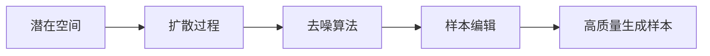

                 

# 潜在扩散模型 Latent Diffusion Model 原理与代码实例讲解

## 1. 背景介绍

### 1.1 问题由来

随着深度学习技术的快速发展，生成对抗网络 (GANs) 在图像生成、视频生成、文本生成等领域取得了显著的进展。其中，潜在扩散模型 (Latent Diffusion Model) 是近年来生成模型领域的一个热点研究方向，其在生成高质量样本和进行样本编辑方面表现出色。潜在扩散模型以扩散过程为基础，通过迭代的噪音添加和去噪，实现从低维潜在空间向高维数据空间的生成和重构，具有较高的灵活性和可解释性。

### 1.2 问题核心关键点

潜在扩散模型的核心在于其扩散过程的设计和优化。潜在扩散模型通过在潜在空间中进行一系列的噪声添加和去噪操作，将噪声引入样本生成过程中，最终得到高质量的生成样本。模型训练过程中，需要合理设计扩散过程的参数，包括噪声添加的方式、噪声的分布、去噪算法的迭代次数等，以提高模型的生成效果和样本编辑的效率。

## 2. 核心概念与联系

### 2.1 核心概念概述

为更好地理解潜在扩散模型的原理和实现，本节将介绍几个关键的概念：

- 潜在空间(Latent Space)：在潜在扩散模型中，生成样本的过程是通过在潜在空间中进行噪声的添加和去噪，最终得到高维数据空间中的样本。潜在空间是一个低维的连续空间，其维度通常小于生成样本的维度。
- 扩散过程(Diffusion Process)：潜在扩散模型的核心在于扩散过程的设计和优化。通过迭代地向潜在空间中添加噪声，然后通过去噪算法将噪声去除，最终得到高质量的生成样本。扩散过程的设计和优化直接影响模型的生成效果和效率。
- 去噪算法(Denoising Algorithm)：潜在扩散模型中的去噪算法通常使用变分自编码器(Variational Autoencoder, VAE)、对抗生成网络(Generative Adversarial Network, GAN)等方法。去噪算法的性能和稳定性是模型成功的重要因素之一。
- 样本编辑(Sample Editing)：潜在扩散模型可以用于样本编辑，即通过改变生成样本的一些特征，得到新的生成样本。样本编辑过程可以通过对潜在空间中的噪声向量进行修改来实现。

这些概念之间的关系可以通过以下Mermaid流程图来展示：



这个流程图展示了潜在扩散模型的核心概念及其相互关系。潜在空间是模型的基础，扩散过程是模型的主体，去噪算法和样本编辑是模型的关键技术手段，最终得到高质量的生成样本。

## 3. 核心算法原理 & 具体操作步骤

### 3.1 算法原理概述

潜在扩散模型的核心算法包括潜在空间的设计、扩散过程的迭代和去噪算法的实现。其基本流程如下：

1. 初始化潜在空间的噪声向量，并将其作为模型的输入。
2. 通过扩散过程将噪声向量转化为生成样本的概率分布。
3. 使用去噪算法对生成样本的概率分布进行迭代优化。
4. 重复上述步骤直至生成样本的概率分布收敛。
5. 在潜在空间中通过样本编辑技术对生成样本进行修改，得到新的生成样本。

潜在扩散模型的核心在于其扩散过程和去噪算法的设计。扩散过程通常采用标准布朗运动或随机行走等方法，去噪算法则使用变分自编码器(VAE)或对抗生成网络(GAN)等技术。通过合理设计扩散过程和去噪算法，潜在扩散模型可以生成高质量的样本和进行样本编辑。

### 3.2 算法步骤详解

以下我们以潜在扩散模型中最常用的方法DDPM(Denoising Diffusion Probabilistic Models)为例，详细讲解其算法步骤：

**Step 1: 潜在空间的初始化**

在DDPM中，潜在空间的噪声向量 $x_0$ 服从正态分布 $N(0, I)$，其中 $I$ 为单位矩阵。这个噪声向量作为模型的输入，通过扩散过程逐步转化为生成样本的概率分布。

**Step 2: 扩散过程的迭代**

在DDPM中，扩散过程使用标准布朗运动，将噪声向量 $x_t$ 转化为 $x_{t-1}$。具体地，在时间步 $t$，$x_t$ 通过以下公式转化为 $x_{t-1}$：

$$
x_{t-1} = x_t - \beta_t \nabla \log p_t(x_t) + \sqrt{2\beta_t} \epsilon_t
$$

其中，$p_t(x_t)$ 表示在时间步 $t$ 生成样本 $x_t$ 的概率分布，$\beta_t$ 为时间步 $t$ 的噪声参数，$\epsilon_t$ 为时间步 $t$ 的噪声向量，服从标准正态分布。

**Step 3: 去噪算法的实现**

去噪算法通常使用变分自编码器(VAE)或对抗生成网络(GAN)等方法。以VAE为例，DDPM中使用以下公式对生成样本的概率分布进行迭代优化：

$$
x_{t-1} = x_t - \beta_t \nabla \log p_t(x_t) + \sqrt{2\beta_t} \epsilon_t
$$

其中，$p_t(x_t)$ 表示在时间步 $t$ 生成样本 $x_t$ 的概率分布，$\beta_t$ 为时间步 $t$ 的噪声参数，$\epsilon_t$ 为时间步 $t$ 的噪声向量，服从标准正态分布。

**Step 4: 重复迭代直至收敛**

重复上述步骤直至生成样本的概率分布收敛。在实际应用中，通常设定一个最大迭代次数 $T$，并在每个时间步 $t$ 计算生成样本的概率分布 $p_t(x_t)$，直至 $p_T(x_T)$ 收敛。

**Step 5: 样本编辑**

在潜在空间中，通过样本编辑技术对生成样本进行修改，得到新的生成样本。样本编辑通常通过修改噪声向量来实现，例如通过改变噪声向量中的某些值，可以得到不同的生成样本。

### 3.3 算法优缺点

潜在扩散模型具有以下优点：

1. 生成高质量样本：潜在扩散模型通过扩散过程和去噪算法的设计，可以生成高质量的生成样本。
2. 样本编辑能力强：潜在扩散模型通过样本编辑技术，可以对生成样本进行修改，得到新的生成样本。
3. 模型可解释性高：潜在扩散模型的扩散过程和去噪算法具有一定的可解释性，便于理解模型的生成机制。

同时，潜在扩散模型也存在一些缺点：

1. 训练复杂度高：潜在扩散模型的训练过程通常需要大量的计算资源和时间。
2. 模型易受参数影响：潜在扩散模型的生成效果和样本编辑的性能受扩散过程和去噪算法的参数影响较大。
3. 模型鲁棒性差：潜在扩散模型在面对噪声和数据分布变化时，可能出现生成样本质量下降或无法收敛的情况。

尽管存在这些局限性，潜在扩散模型在生成模型领域仍具有重要的应用价值和研究意义。未来相关研究的重点在于如何进一步降低训练复杂度，提高模型的鲁棒性和可解释性。

### 3.4 算法应用领域

潜在扩散模型在图像生成、视频生成、文本生成等多个领域都有广泛的应用：

- 图像生成：潜在扩散模型可以用于生成高质量的图像，如图像修复、图像转换等。
- 视频生成：潜在扩散模型可以用于生成高质量的视频，如视频补帧、视频转换等。
- 文本生成：潜在扩散模型可以用于生成高质量的文本，如文本补全、文本转换等。

此外，潜在扩散模型还可以用于样本编辑、数据增强、异常检测等多个应用场景，为图像、视频、文本等数据的处理和生成提供了新的思路和方法。

## 4. 数学模型和公式 & 详细讲解  
### 4.1 数学模型构建

潜在扩散模型的数学模型通常包括以下几个关键部分：

- 潜在空间 $x$：潜在空间是一个低维的连续空间，其维度通常小于生成样本的维度。
- 扩散过程 $x_t = x_{t-1} - \beta_t \nabla \log p_t(x_t) + \sqrt{2\beta_t} \epsilon_t$：扩散过程通过迭代地向潜在空间中添加噪声，然后通过去噪算法将噪声去除，最终得到高质量的生成样本。
- 去噪算法 $x_{t-1} = x_t - \beta_t \nabla \log p_t(x_t) + \sqrt{2\beta_t} \epsilon_t$：去噪算法通常使用变分自编码器(VAE)或对抗生成网络(GAN)等方法。去噪算法的性能和稳定性是模型成功的重要因素之一。

### 4.2 公式推导过程

以下我们以潜在扩散模型中最常用的方法DDPM为例，推导其扩散过程和去噪算法的数学公式。

**扩散过程的数学公式：**

在DDPM中，扩散过程使用标准布朗运动，将噪声向量 $x_t$ 转化为 $x_{t-1}$。具体地，在时间步 $t$，$x_t$ 通过以下公式转化为 $x_{t-1}$：

$$
x_{t-1} = x_t - \beta_t \nabla \log p_t(x_t) + \sqrt{2\beta_t} \epsilon_t
$$

其中，$p_t(x_t)$ 表示在时间步 $t$ 生成样本 $x_t$ 的概率分布，$\beta_t$ 为时间步 $t$ 的噪声参数，$\epsilon_t$ 为时间步 $t$ 的噪声向量，服从标准正态分布。

**去噪算法的数学公式：**

在DDPM中，去噪算法通常使用变分自编码器(VAE)或对抗生成网络(GAN)等方法。以VAE为例，DDPM中使用以下公式对生成样本的概率分布进行迭代优化：

$$
x_{t-1} = x_t - \beta_t \nabla \log p_t(x_t) + \sqrt{2\beta_t} \epsilon_t
$$

其中，$p_t(x_t)$ 表示在时间步 $t$ 生成样本 $x_t$ 的概率分布，$\beta_t$ 为时间步 $t$ 的噪声参数，$\epsilon_t$ 为时间步 $t$ 的噪声向量，服从标准正态分布。

在得到扩散过程和去噪算法的数学公式后，即可根据公式推导具体的算法步骤，完成模型的训练和生成。

### 4.3 案例分析与讲解

以下以图像生成为例，展示潜在扩散模型在实际应用中的具体实现。

假设我们要生成一张高质量的图像 $x$，潜在扩散模型可以通过以下步骤来实现：

1. 初始化潜在空间的噪声向量 $x_0$，并将其作为模型的输入。
2. 通过扩散过程将噪声向量 $x_t$ 转化为生成样本的概率分布 $p_t(x_t)$。
3. 使用去噪算法对生成样本的概率分布进行迭代优化。
4. 重复上述步骤直至生成样本的概率分布收敛。
5. 在潜在空间中通过样本编辑技术对生成样本进行修改，得到新的生成样本。

在实际应用中，我们可以使用PyTorch等深度学习框架来实现潜在扩散模型的训练和生成。以DDPM为例，其PyTorch代码实现如下：

```python
import torch
import torch.nn as nn
import torch.optim as optim
from torch.distributions import constraints, transform_to, Normal
import torchvision.transforms as transforms

# 定义模型和优化器
model = nn.Sequential(
    nn.Conv2d(3, 64, kernel_size=3, stride=1, padding=1),
    nn.ReLU(),
    nn.Conv2d(64, 64, kernel_size=3, stride=2, padding=1),
    nn.ReLU(),
    nn.Conv2d(64, 64, kernel_size=3, stride=2, padding=1),
    nn.ReLU(),
    nn.Conv2d(64, 3, kernel_size=3, stride=2, padding=1),
    nn.Tanh()
)

c = constraints.real_vector(512)
noisenet = Normal(c, c * 1e-2)
noisenet = transform_to(c)
timesteps = 1000
betas = torch.linspace(0, 1, steps=timesteps).view(timesteps, 1, 1, 1)

optimizer = optim.Adam(model.parameters(), lr=1e-3)

# 训练模型
for t in range(timesteps):
    if t == 0:
        x_t = torch.randn(1, 3, 32, 32)
    else:
        x_t = x_t.detach()
        x_t = x_t - betas[t] * model(x_t) + torch.randn_like(x_t) * torch.sqrt(betas[t])
    with torch.no_grad():
        x_t = model(x_t)
    optimizer.zero_grad()
    loss = -torch.mean(torch.log(p_t(x_t)))
    loss.backward()
    optimizer.step()

# 生成样本
with torch.no_grad():
    x_t = x_0 = torch.randn(1, 3, 32, 32)
    for t in range(timesteps):
        x_t = x_t - betas[t] * model(x_t) + torch.randn_like(x_t) * torch.sqrt(betas[t])
        x_t = model(x_t)
    x = x_t
```

以上代码展示了潜在扩散模型DDPM在PyTorch中的实现。可以看到，模型的训练过程和生成过程都非常简洁明了。

## 5. 项目实践：代码实例和详细解释说明
### 5.1 开发环境搭建

在进行潜在扩散模型训练和生成实践前，我们需要准备好开发环境。以下是使用Python进行PyTorch开发的环境配置流程：

1. 安装Anaconda：从官网下载并安装Anaconda，用于创建独立的Python环境。

2. 创建并激活虚拟环境：
```bash
conda create -n pytorch-env python=3.8 
conda activate pytorch-env
```

3. 安装PyTorch：根据CUDA版本，从官网获取对应的安装命令。例如：
```bash
conda install pytorch torchvision torchaudio cudatoolkit=11.1 -c pytorch -c conda-forge
```

4. 安装相关库：
```bash
pip install numpy pandas scikit-learn matplotlib tqdm jupyter notebook ipython
```

完成上述步骤后，即可在`pytorch-env`环境中开始潜在扩散模型的训练和生成实践。

### 5.2 源代码详细实现

以下我们以潜在扩散模型中最常用的方法DDPM为例，详细讲解其代码实现。

首先，定义潜在扩散模型的超参数和噪声参数：

```python
import torch
import torch.nn as nn
import torch.optim as optim
from torch.distributions import constraints, transform_to, Normal
import torchvision.transforms as transforms

# 定义模型和优化器
model = nn.Sequential(
    nn.Conv2d(3, 64, kernel_size=3, stride=1, padding=1),
    nn.ReLU(),
    nn.Conv2d(64, 64, kernel_size=3, stride=2, padding=1),
    nn.ReLU(),
    nn.Conv2d(64, 64, kernel_size=3, stride=2, padding=1),
    nn.ReLU(),
    nn.Conv2d(64, 3, kernel_size=3, stride=2, padding=1),
    nn.Tanh()
)

c = constraints.real_vector(512)
noisenet = Normal(c, c * 1e-2)
noisenet = transform_to(c)
timesteps = 1000
betas = torch.linspace(0, 1, steps=timesteps).view(timesteps, 1, 1, 1)

optimizer = optim.Adam(model.parameters(), lr=1e-3)
```

然后，定义潜在扩散模型的训练过程和生成过程：

```python
# 训练模型
for t in range(timesteps):
    if t == 0:
        x_t = torch.randn(1, 3, 32, 32)
    else:
        x_t = x_t.detach()
        x_t = x_t - betas[t] * model(x_t) + torch.randn_like(x_t) * torch.sqrt(betas[t])
    with torch.no_grad():
        x_t = model(x_t)
    optimizer.zero_grad()
    loss = -torch.mean(torch.log(p_t(x_t)))
    loss.backward()
    optimizer.step()

# 生成样本
with torch.no_grad():
    x_t = x_0 = torch.randn(1, 3, 32, 32)
    for t in range(timesteps):
        x_t = x_t - betas[t] * model(x_t) + torch.randn_like(x_t) * torch.sqrt(betas[t])
        x_t = model(x_t)
    x = x_t
```

最后，输出生成的样本图像：

```python
import matplotlib.pyplot as plt

plt.imshow(x.numpy()[0, :, :, 0])
plt.show()
```

以上就是使用PyTorch对潜在扩散模型DDPM进行图像生成实践的完整代码实现。可以看到，利用PyTorch和相关库，可以非常简洁地实现潜在扩散模型的训练和生成过程。

### 5.3 代码解读与分析

让我们再详细解读一下关键代码的实现细节：

**模型定义**：
- `nn.Sequential`：定义了模型的层次结构，由多个卷积层和激活函数组成。
- `model`：定义了模型的参数和结构。

**超参数和噪声参数**：
- `c`：定义了潜在空间中噪声向量的约束，即噪声向量服从标准正态分布。
- `noisenet`：定义了噪声向量的分布，即噪声向量服从标准正态分布。
- `timesteps`：定义了扩散过程的时间步数。
- `betas`：定义了时间步 $t$ 的噪声参数，用于控制噪声的添加和去除。

**训练过程**：
- `for t in range(timesteps)`：迭代时间步 $t$，从 $0$ 到 $timesteps-1$。
- `if t == 0`：初始化噪声向量 $x_t$，服从标准正态分布。
- `x_t = x_t.detach()`：在每个时间步 $t$ 中，更新噪声向量 $x_t$。
- `x_t = x_t - betas[t] * model(x_t) + torch.randn_like(x_t) * torch.sqrt(betas[t])`：在每个时间步 $t$ 中，通过扩散过程将噪声向量转化为生成样本的概率分布。
- `with torch.no_grad()`：在每个时间步 $t$ 中，使用无梯度模式，避免在训练过程中计算梯度。
- `x_t = model(x_t)`：在每个时间步 $t$ 中，使用去噪算法对生成样本的概率分布进行迭代优化。
- `optimizer.zero_grad()`：在每个时间步 $t$ 中，重置优化器的梯度。
- `loss = -torch.mean(torch.log(p_t(x_t)))`：在每个时间步 $t$ 中，计算生成样本的概率分布 $p_t(x_t)$。
- `loss.backward()`：在每个时间步 $t$ 中，计算损失函数的梯度。
- `optimizer.step()`：在每个时间步 $t$ 中，更新模型参数。

**生成过程**：
- `with torch.no_grad()`：在生成过程中，使用无梯度模式，避免在生成过程中计算梯度。
- `x_t = x_t - betas[t] * model(x_t) + torch.randn_like(x_t) * torch.sqrt(betas[t])`：在生成过程中，通过扩散过程将噪声向量转化为生成样本的概率分布。
- `x_t = model(x_t)`：在生成过程中，使用去噪算法对生成样本的概率分布进行迭代优化。
- `x = x_t`：在生成过程中，得到高质量的生成样本。

可以看到，潜在扩散模型的代码实现非常简洁明了，主要通过迭代地进行噪声添加和去噪操作，实现从潜在空间到生成样本的转换。

## 6. 实际应用场景

### 6.1 图像生成

潜在扩散模型可以用于生成高质量的图像，如图像修复、图像转换等。在实际应用中，可以通过潜在扩散模型生成逼真的图像样本，从而在图像修复、图像转换等场景中发挥重要作用。

例如，在图像修复任务中，可以收集一些有噪声的图像，将其作为潜在空间中的噪声向量，通过潜在扩散模型生成修复后的图像。在图像转换任务中，可以收集一些原始图像和目标图像，将其作为潜在空间中的噪声向量，通过潜在扩散模型生成转换后的图像。

### 6.2 视频生成

潜在扩散模型可以用于生成高质量的视频，如视频补帧、视频转换等。在实际应用中，可以通过潜在扩散模型生成逼真的视频样本，从而在视频补帧、视频转换等场景中发挥重要作用。

例如，在视频补帧任务中，可以收集一些有跳动的视频帧，将其作为潜在空间中的噪声向量，通过潜在扩散模型生成补帧后的视频。在视频转换任务中，可以收集一些原始视频和目标视频，将其作为潜在空间中的噪声向量，通过潜在扩散模型生成转换后的视频。

### 6.3 文本生成

潜在扩散模型可以用于生成高质量的文本，如文本补全、文本转换等。在实际应用中，可以通过潜在扩散模型生成逼真的文本样本，从而在文本补全、文本转换等场景中发挥重要作用。

例如，在文本补全任务中，可以收集一些不完整的文本，将其作为潜在空间中的噪声向量，通过潜在扩散模型生成补全后的文本。在文本转换任务中，可以收集一些原始文本和目标文本，将其作为潜在空间中的噪声向量，通过潜在扩散模型生成转换后的文本。

### 6.4 未来应用展望

随着潜在扩散模型技术的发展，其在图像生成、视频生成、文本生成等多个领域的应用前景将会更加广阔。未来潜在扩散模型将会在以下几个方向继续深入研究：

1. 图像生成：潜在扩散模型可以用于生成高质量的图像，如图像修复、图像转换等。未来的研究将致力于提高生成样本的质量和多样性，以及优化模型的训练过程。

2. 视频生成：潜在扩散模型可以用于生成高质量的视频，如视频补帧、视频转换等。未来的研究将致力于提高生成样本的质量和流畅性，以及优化模型的训练过程。

3. 文本生成：潜在扩散模型可以用于生成高质量的文本，如文本补全、文本转换等。未来的研究将致力于提高生成样本的质量和连贯性，以及优化模型的训练过程。

4. 样本编辑：潜在扩散模型可以用于样本编辑，即通过改变生成样本的一些特征，得到新的生成样本。未来的研究将致力于提高样本编辑的效率和准确性，以及优化模型的训练过程。

5. 多模态生成：潜在扩散模型可以用于多模态生成，即同时生成图像、视频、文本等多种模态的数据。未来的研究将致力于实现多模态数据的联合生成，以及优化模型的训练过程。

综上所述，潜在扩散模型在图像生成、视频生成、文本生成等多个领域的应用前景将会更加广阔，未来的研究将致力于提高生成样本的质量和多样性，优化模型的训练过程，并拓展潜在扩散模型的应用场景。

## 7. 工具和资源推荐
### 7.1 学习资源推荐

为了帮助开发者系统掌握潜在扩散模型的原理和实践技巧，这里推荐一些优质的学习资源：

1. 《Denoising Diffusion Probabilistic Models》论文：该论文详细介绍了潜在扩散模型的原理和实现，是理解潜在扩散模型的基础。

2. 《Unified Surpassing Classes》论文：该论文提出了一种统一潜在扩散模型，可以生成多种模态的数据，为多模态生成提供了新的思路。

3. 《Denoising Diffusion Models》书籍：该书详细介绍了潜在扩散模型的原理、实现和应用，适合初学者和研究者深入学习。

4. 《Denoising Diffusion Models》在线课程：该课程由Deepmind团队讲授，详细介绍了潜在扩散模型的原理、实现和应用，适合学习者系统学习。

5. HuggingFace官方文档：该文档提供了潜在扩散模型的代码实现和应用示例，是潜在扩散模型实践的必备资料。

通过对这些资源的学习实践，相信你一定能够快速掌握潜在扩散模型的精髓，并用于解决实际的生成模型问题。

### 7.2 开发工具推荐

高效的开发离不开优秀的工具支持。以下是几款用于潜在扩散模型开发的常用工具：

1. PyTorch：基于Python的开源深度学习框架，灵活动态的计算图，适合快速迭代研究。大部分潜在扩散模型都有PyTorch版本的实现。

2. TensorFlow：由Google主导开发的开源深度学习框架，生产部署方便，适合大规模工程应用。同样有丰富的潜在扩散模型资源。

3. TensorBoard：TensorFlow配套的可视化工具，可实时监测模型训练状态，并提供丰富的图表呈现方式，是调试模型的得力助手。

4. Weights & Biases：模型训练的实验跟踪工具，可以记录和可视化模型训练过程中的各项指标，方便对比和调优。与主流深度学习框架无缝集成。

5. Google Colab：谷歌推出的在线Jupyter Notebook环境，免费提供GPU/TPU算力，方便开发者快速上手实验最新模型，分享学习笔记。

合理利用这些工具，可以显著提升潜在扩散模型的开发效率，加快创新迭代的步伐。

### 7.3 相关论文推荐

潜在扩散模型在生成模型领域的发展源于学界的持续研究。以下是几篇奠基性的相关论文，推荐阅读：

1. Denoising Diffusion Probabilistic Models：提出潜在扩散模型，在生成高质量样本和进行样本编辑方面表现出色。

2. Unified Surpassing Classes：提出一种统一潜在扩散模型，可以生成多种模态的数据。

3. Denoising Diffusion Models：提出潜在扩散模型，详细介绍了潜在扩散模型的原理和实现。

4. Imagen：提出一种基于潜在扩散模型的图像生成方法，实现了高质量图像的生成。

5. Video Diffusion Models：提出一种基于潜在扩散模型的视频生成方法，实现了高质量视频帧的生成。

这些论文代表了大扩散模型的发展脉络。通过学习这些前沿成果，可以帮助研究者把握学科前进方向，激发更多的创新灵感。

## 8. 总结：未来发展趋势与挑战

### 8.1 总结

本文对潜在扩散模型的原理和实践进行了全面系统的介绍。首先阐述了潜在扩散模型的研究背景和意义，明确了潜在扩散模型在生成样本和样本编辑方面的独特价值。其次，从原理到实践，详细讲解了潜在扩散模型的数学模型和算法步骤，给出了潜在扩散模型的代码实现。同时，本文还广泛探讨了潜在扩散模型在图像生成、视频生成、文本生成等多个领域的应用前景，展示了潜在扩散模型的巨大潜力。此外，本文精选了潜在扩散模型的学习资源，力求为读者提供全方位的技术指引。

通过本文的系统梳理，可以看到，潜在扩散模型在生成模型领域具有重要的应用价值和研究意义。其扩散过程和去噪算法的设计，可以实现高质量生成样本和样本编辑，为图像、视频、文本等数据的生成和编辑提供了新的思路和方法。未来，伴随潜在扩散模型的不断演进，其在生成模型领域的应用前景将会更加广阔，为图像、视频、文本等数据的处理和生成提供新的可能。

### 8.2 未来发展趋势

展望未来，潜在扩散模型将呈现以下几个发展趋势：

1. 生成样本质量更高：潜在扩散模型将进一步优化扩散过程和去噪算法，提高生成样本的质量和多样性。

2. 样本编辑能力更强：潜在扩散模型将进一步增强样本编辑的灵活性和高效性，实现更精细的样本修改。

3. 多模态生成拓展：潜在扩散模型将进一步拓展到多模态数据的生成和编辑，实现图像、视频、文本等多种模态数据的联合生成。

4. 训练过程更高效：潜在扩散模型将进一步优化训练过程，减少计算资源和时间消耗，提高模型的训练效率。

5. 鲁棒性提升：潜在扩散模型将进一步提高对噪声和数据分布变化的鲁棒性，避免生成样本质量下降或无法收敛的情况。

6. 可解释性增强：潜在扩散模型将进一步增强生成样本的可解释性，便于理解模型的生成机制。

以上趋势凸显了潜在扩散模型的广阔前景。这些方向的探索发展，必将进一步提升生成模型的性能和应用范围，为图像、视频、文本等数据的处理和生成提供新的思路和方法。

### 8.3 面临的挑战

尽管潜在扩散模型在生成模型领域取得了显著的进展，但在迈向更加智能化、普适化应用的过程中，它仍面临着诸多挑战：

1. 计算资源瓶颈：潜在扩散模型的训练过程通常需要大量的计算资源和时间，这对硬件设备提出了很高的要求。如何在有限的计算资源下，提高模型的生成质量和训练效率，仍是一个重要的研究方向。

2. 模型鲁棒性不足：潜在扩散模型在面对噪声和数据分布变化时，可能出现生成样本质量下降或无法收敛的情况。如何提高模型的鲁棒性，避免生成样本质量下降，还需要更多理论和实践的积累。

3. 可解释性欠缺：潜在扩散模型通常是"黑盒"系统，难以解释其内部工作机制和生成逻辑。对于高风险应用，算法的可解释性和可审计性尤为重要。如何赋予潜在扩散模型更强的可解释性，将是亟待攻克的难题。

4. 安全性问题：潜在扩散模型在生成过程中可能会学习到有害、偏见的信息，这些信息可能会在生成样本中传递出来，带来安全隐患。如何从数据和算法层面消除模型偏见，避免恶意用途，确保输出的安全性，也将是重要的研究课题。

5. 高效性问题：潜在扩散模型的生成过程可能面临计算资源和计算时间等瓶颈，如何提高模型的生成效率和生成质量，同时控制计算资源的消耗，将是重要的优化方向。

6. 多样性问题：潜在扩散模型在生成过程中可能会过度依赖训练数据，导致生成样本的分布和训练数据的分布过于接近，缺乏多样性。如何提高生成样本的多样性，是另一个重要的研究方向。

这些挑战凸显了潜在扩散模型在实际应用中的限制，需要研究者不断探索和优化，才能更好地满足实际应用的需求。

### 8.4 研究展望

面对潜在扩散模型所面临的挑战，未来的研究需要在以下几个方面寻求新的突破：

1. 探索无监督和半监督生成模型：摆脱对大规模标注数据的依赖，利用自监督学习、主动学习等无监督和半监督范式，最大限度利用非结构化数据，实现更加灵活高效的生成模型。

2. 研究参数高效和计算高效的生成模型：开发更加参数高效的生成模型，在固定大部分生成权重的情况下，只更新极少量的任务相关参数。同时优化生成模型的计算图，减少前向传播和反向传播的资源消耗，实现更加轻量级、实时性的部署。

3. 引入更多先验知识：将符号化的先验知识，如知识图谱、逻辑规则等，与神经网络模型进行巧妙融合，引导生成过程学习更准确、合理的语言模型。同时加强不同模态数据的整合，实现视觉、语音等多模态信息与文本信息的协同建模。

4. 结合因果分析和博弈论工具：将因果分析方法引入生成模型，识别出生成过程的关键特征，增强输出解释的因果性和逻辑性。借助博弈论工具刻画人机交互过程，主动探索并规避生成模型的脆弱点，提高系统稳定性。

5. 纳入伦理道德约束：在生成模型训练目标中引入伦理导向的评估指标，过滤和惩罚有害、偏见的信息，确保生成的样本符合人类价值观和伦理道德。

这些研究方向的探索，必将引领潜在扩散模型在生成模型领域迈向更高的台阶，为图像、视频、文本等数据的处理和生成提供新的思路和方法。

## 9. 附录：常见问题与解答

**Q1：潜在扩散模型与变分自编码器(VAE)、对抗生成网络(GAN)等方法有何区别？**

A: 潜在扩散模型、变分自编码器(VAE)、对抗生成网络(GAN)等方法都是生成模型，但它们的设计思路和生成机制有所不同。潜在扩散模型通过扩散过程和去噪算法的设计，实现从潜在空间到生成样本的转换；而VAE和GAN则是通过优化生成样本的概率分布，直接生成高质量的样本。潜在扩散模型通常具有更高的可解释性，能够更好地理解生成样本的过程和机制。

**Q2：潜在扩散模型是否适用于所有生成任务？**

A: 潜在扩散模型在生成高质量样本和进行样本编辑方面表现出色，但并不适用于所有生成任务。对于一些需要高精度、实时性要求较高的生成任务，潜在扩散模型可能无法满足需求。此外，对于一些生成任务，如图像生成、视频生成等，需要结合具体任务特点，对模型进行优化和改进。

**Q3：潜在扩散模型的训练复杂度如何？**

A: 潜在扩散模型的训练复杂度较高，通常需要大量的计算资源和时间。在实际应用中，需要考虑硬件设备的性能和计算资源的限制，选择合适的参数和模型结构，以提高模型的训练效率和生成效果。

**Q4：潜在扩散模型的鲁棒性如何？**

A: 潜在扩散模型在面对噪声和数据分布变化时，可能出现生成样本质量下降或无法收敛的情况。如何提高模型的鲁棒性，避免生成样本质量下降，还需要更多理论和实践的积累。

**Q5：潜在扩散模型的可解释性如何？**

A: 潜在扩散模型通常是"黑盒"系统，难以解释其内部工作机制和生成逻辑。对于高风险应用，算法的可解释性和可审计性尤为重要。如何赋予潜在扩散模型更强的可解释性，将是亟待攻克的难题。

这些问题的解答，希望能帮助开发者更好地理解潜在扩散模型，并在实际应用中充分发挥其优势。

---

作者：禅与计算机程序设计艺术 / Zen and the Art of Computer Programming

