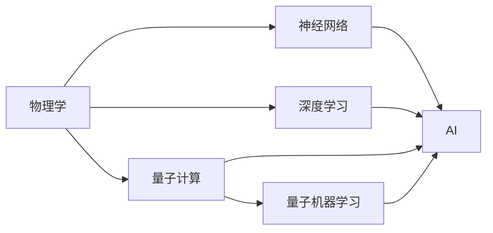

                 

## 1. 背景介绍

人工智能（AI）近年来取得了显著的进展，广泛应用于多个领域，从医疗、金融到自动驾驶，无不受益于AI技术的突破。然而，在享受AI带来的便利的同时，我们也应认识到物理基础在AI创新中的关键作用。物理学的原理和定律不仅为计算机算法和计算模型提供了基础，更在AI的新方向和新方法中发挥着不可或缺的作用。本文将探讨物理基础在AI中的作用，包括理论基础、应用实例和未来发展趋势。

## 2. 核心概念与联系

### 2.1 核心概念概述

在深入探讨物理基础在AI中的作用之前，我们需要明确几个核心概念：

- **物理学**：研究物质、能量及其相互作用的科学。
- **AI**：通过算法和模型，使计算机能够模拟人类智能行为的技术。
- **神经网络**：模拟人类神经系统结构和功能的计算模型。
- **深度学习**：一种基于神经网络的机器学习方法，能够从数据中自动学习特征和模式。
- **量子计算**：利用量子力学的原理，进行信息处理和计算的新型计算方式。
- **量子机器学习**：结合量子计算和机器学习的方法，解决传统计算方法难以解决的问题。

这些概念之间存在着密切的联系，共同构成了现代AI的基础。

### 2.2 核心概念原理和架构的 Mermaid 流程图



该流程图展示了物理学与其他AI相关概念之间的联系。物理学为神经网络和深度学习提供了理论基础，而量子计算和量子机器学习则拓展了AI的应用边界。

## 3. 核心算法原理 & 具体操作步骤

### 3.1 算法原理概述

物理学的原理和定律在AI中有着广泛的应用。以下是一些关键的原理和其对应的AI算法：

- **能量守恒定律**：在深度学习中，通过优化损失函数，使模型在不同层次的特征表示中保持能量守恒，以提高模型的泛化能力。
- **热力学定律**：量子计算和量子机器学习中的量子态演化，基于量子热力学的原理，使得模型能够在更复杂的计算环境中处理信息。
- **统计力学**：在AI中的优化算法中，如模拟退火、遗传算法等，都基于统计力学的原理，通过模拟自然界的进化过程，寻找最优解。

### 3.2 算法步骤详解

以下是基于物理原理的AI算法具体操作步骤：

1. **模型构建**：选择合适的物理模型作为AI算法的核心。例如，使用物理学中的哈密顿量构建深度学习模型的能量函数。
2. **参数优化**：使用物理方法，如拉格朗日乘子法、梯度下降等，优化模型参数，使其满足特定的物理约束。
3. **数据处理**：使用物理学中的统计模型和算法，处理和分析数据，提取有价值的信息。
4. **结果验证**：通过模拟实验和真实世界的测试，验证算法的正确性和有效性。

### 3.3 算法优缺点

基于物理原理的AI算法具有以下优点：

- **准确性**：物理原理提供了严格的数学基础，使得算法的正确性得到保证。
- **可解释性**：物理学的理论提供了清晰的解释，使得AI算法的行为更易于理解和解释。
- **普适性**：物理学的原理在多个领域中具有广泛的应用，能够适应不同的场景和问题。

缺点则包括：

- **复杂性**：物理原理的应用往往需要复杂的数学推导和计算，增加了算法的复杂度。
- **局限性**：物理原理在特定的场景和问题中可能并不适用，需要结合实际情况进行调整。

### 3.4 算法应用领域

基于物理原理的AI算法已经应用于多个领域：

- **物理学研究**：使用AI进行物理模拟和数据分析，提高研究效率和精度。
- **机器视觉**：利用物理学的光学原理，改进图像处理和计算机视觉算法。
- **量子计算**：基于量子力学的原理，开发量子机器学习算法，解决传统计算机难以处理的问题。
- **生物医学**：通过物理学的理论，优化生物信号处理和疾病预测算法。

## 4. 数学模型和公式 & 详细讲解 & 举例说明

### 4.1 数学模型构建

在AI中，数学模型是核心，而物理学的原理和定律为数学模型的构建提供了基础。以下是一些典型的物理数学模型：

- **经典力学模型**：描述物体的运动规律，例如牛顿第二定律 $F=ma$。
- **热力学模型**：描述系统内能和温度的关系，例如热力学第一定律 $\Delta U = Q - W$。
- **量子力学模型**：描述微观粒子的行为，例如薛定谔方程 $\hat{H}\psi = E\psi$。

### 4.2 公式推导过程

以经典力学的牛顿第二定律为例，其数学模型为 $F=ma$。以下是推导过程：

$$
\vec{F} = m\vec{a} \quad \Rightarrow \quad F = ma
$$

其中，$\vec{F}$ 表示力，$m$ 表示质量，$\vec{a}$ 表示加速度。

### 4.3 案例分析与讲解

以机器学习中的梯度下降算法为例，其基本原理基于物理学的最小势能原理。梯度下降算法通过最小化损失函数，使得模型参数收敛到最优解。这与物理学的最小势能原理相类似。

## 5. 项目实践：代码实例和详细解释说明

### 5.1 开发环境搭建

在进行物理基础在AI中的应用实践前，需要准备好开发环境。以下是Python开发环境的配置步骤：

1. 安装Anaconda：从官网下载并安装Anaconda，用于创建独立的Python环境。
2. 创建并激活虚拟环境：
```bash
conda create -n ai-env python=3.8 
conda activate ai-env
```

3. 安装必要的库：
```bash
conda install numpy scipy pandas matplotlib scikit-learn tensorflow
```

### 5.2 源代码详细实现

以下是一个使用Python和TensorFlow实现梯度下降算法的代码示例：

```python
import numpy as np
import tensorflow as tf

# 定义损失函数
def loss_function(x, y):
    return tf.reduce_mean(tf.square(x - y))

# 定义梯度下降函数
def gradient_descent(x, y, learning_rate, epochs):
    optimizer = tf.optimizers.SGD(learning_rate)
    for epoch in range(epochs):
        with tf.GradientTape() as tape:
            y_pred = np.dot(x, w) + b
            loss = loss_function(y_pred, y)
        gradients = tape.gradient(loss, [w, b])
        optimizer.apply_gradients(zip(gradients, [w, b]))
    return loss

# 初始化变量
x = np.array([1.0, 2.0, 3.0, 4.0, 5.0])
y = np.array([2.0, 4.0, 6.0, 8.0, 10.0])
w = np.random.randn(2)
b = np.random.randn()

# 调用梯度下降函数
loss = gradient_descent(x, y, learning_rate=0.01, epochs=1000)
print(f"Loss after {epochs} epochs: {loss:.4f}")
```

### 5.3 代码解读与分析

在这个代码示例中，我们使用了TensorFlow库实现了梯度下降算法。梯度下降是AI中常用的优化算法，基于物理学中的最小势能原理，通过迭代调整模型参数，最小化损失函数。

## 6. 实际应用场景

### 6.1 物理学研究

物理学的原理在AI中广泛应用于物理学研究，例如使用AI进行物理模拟和数据分析。通过AI算法，可以快速处理大量复杂的物理数据，提高研究效率。

### 6.2 机器视觉

利用物理学的光学原理，改进图像处理和计算机视觉算法。例如，使用物理模型来优化图像滤波和边缘检测算法。

### 6.3 量子计算

基于量子力学的原理，开发量子机器学习算法，解决传统计算机难以处理的问题。量子计算为AI提供了新的计算范式，可以处理更复杂的问题。

### 6.4 生物医学

通过物理学的理论，优化生物信号处理和疾病预测算法。例如，使用物理模型来处理生物医学图像，提高疾病诊断的准确性。

## 7. 工具和资源推荐

### 7.1 学习资源推荐

为了帮助开发者系统掌握物理基础在AI中的应用，以下是一些优质的学习资源：

1. 《深度学习》（Ian Goodfellow）：该书介绍了深度学习的基本原理和算法，包括物理学在其中的应用。
2. 《量子计算与量子信息》（Michael A. Nielsen）：该书介绍了量子计算的基本原理，包括量子力学的基本概念和量子算法。
3. Coursera课程《Quantum Computing》：由IBM开设的课程，介绍了量子计算的基本原理和应用。
4. Udacity课程《AI for Everyone》：该课程介绍了AI的基本原理和应用，包括物理学在其中的应用。

### 7.2 开发工具推荐

以下是一些常用的开发工具：

1. Python：开源的高级编程语言，适用于AI和物理学的研究和开发。
2. TensorFlow：由Google主导的开源机器学习框架，支持深度学习、量子计算等多种算法。
3. PyTorch：由Facebook主导的开源机器学习框架，支持深度学习、量子计算等多种算法。
4. Weights & Biases：模型训练的实验跟踪工具，用于记录和可视化模型训练过程。
5. TensorBoard：TensorFlow配套的可视化工具，用于实时监测模型训练状态。

### 7.3 相关论文推荐

以下是一些关于物理基础在AI中的应用的经典论文：

1. "The Unreasonable Effectiveness of Physics-Informed Machine Learning"：该论文探讨了物理学在机器学习中的应用，证明了物理学原理在优化机器学习算法中的有效性。
2. "Quantum Machine Learning"：该论文介绍了量子计算和量子机器学习的基本原理和应用。
3. "Physics-Informed Neural Networks"：该论文探讨了将物理学原理嵌入神经网络中的方法，提高了神经网络的泛化能力和精度。
4. "Physically-Informed Deep Learning"：该论文介绍了将物理学原理嵌入深度学习中的方法，提高了深度学习的性能和准确性。

## 8. 总结：未来发展趋势与挑战

### 8.1 研究成果总结

物理基础在AI中的应用已经成为研究热点，取得了许多重要的成果。这些成果为AI的发展提供了新的理论和方法，提高了AI算法的准确性和泛化能力。

### 8.2 未来发展趋势

未来，物理基础在AI中的应用将继续拓展，主要趋势包括：

1. **多学科融合**：物理学、数学、计算机科学等多学科的融合将推动AI的发展，解决更复杂的问题。
2. **量子计算**：基于量子力学的量子计算和量子机器学习将成为AI的重要方向，解决传统计算机难以处理的问题。
3. **跨领域应用**：物理基础在AI中的应用将拓展到更多领域，如生物医学、金融、环境科学等。
4. **新方法和新算法**：基于物理原理的新方法和算法将不断涌现，推动AI技术的发展。

### 8.3 面临的挑战

尽管物理基础在AI中具有重要应用，但也面临一些挑战：

1. **复杂性**：物理原理的应用往往需要复杂的数学推导和计算，增加了算法的复杂度。
2. **跨学科壁垒**：物理学家和AI研究者之间的交流和合作还不够充分，阻碍了物理基础在AI中的广泛应用。
3. **实用性**：一些物理理论在特定应用场景中的实用性有待验证，需要进一步研究和应用。

### 8.4 研究展望

未来，需要进一步探索物理基础在AI中的应用，主要方向包括：

1. **理论创新**：在物理学的理论基础上，进行新的创新和突破，推动AI的发展。
2. **跨学科合作**：促进物理学家和AI研究者之间的交流和合作，推动物理基础在AI中的应用。
3. **实际应用**：探索物理基础在AI中的应用场景，解决实际问题，提高AI技术的实用性。

## 9. 附录：常见问题与解答

**Q1：物理学在AI中的应用有哪些？**

A: 物理学在AI中的应用包括：

- 牛顿第二定律和最小势能原理在梯度下降算法中的应用。
- 热力学定律在优化算法中的应用，如模拟退火。
- 量子力学在量子计算和量子机器学习中的应用。

**Q2：物理基础在AI中应用的主要优势是什么？**

A: 物理基础在AI中应用的主要优势包括：

- 提供严格的数学基础，提高了算法的准确性和可靠性。
- 提供清晰的解释，使得AI算法的行为更易于理解和解释。
- 普适性强，适用于多个领域和问题。

**Q3：物理基础在AI中的局限性有哪些？**

A: 物理基础在AI中的局限性包括：

- 复杂度高，需要复杂的数学推导和计算。
- 跨学科壁垒，物理学家和AI研究者之间的合作不够充分。
- 实用性有待验证，一些物理理论在特定应用场景中的效果有限。

**Q4：物理基础在AI中的应用前景如何？**

A: 物理基础在AI中的应用前景广阔，包括：

- 物理学和AI的融合将推动新方法和新技术的发展。
- 量子计算和量子机器学习将拓展AI的应用边界。
- 跨学科合作将进一步促进物理基础在AI中的应用。

**Q5：如何克服物理基础在AI中应用的挑战？**

A: 克服物理基础在AI中应用的挑战需要：

- 推动跨学科合作，促进物理学家和AI研究者之间的交流。
- 进行理论创新，解决复杂数学推导和计算的问题。
- 实际应用验证，探索物理基础在AI中的适用性和实用性。

---

作者：禅与计算机程序设计艺术 / Zen and the Art of Computer Programming

