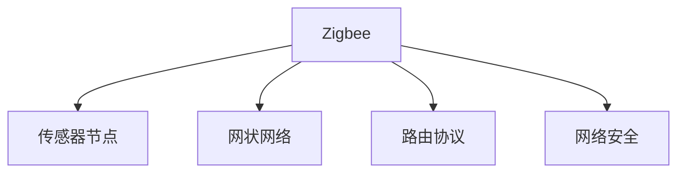

                 

# 物联网(IoT)技术和各种传感器设备的集成：Zigbee传感器在物联网中的应用

## 1. 背景介绍

### 1.1 问题由来

物联网(IoT)是一种通过网络技术将物理设备、软件应用、传感器等元素连接在一起，实现信息获取、传输、处理和应用的互联网应用。作为IoT的核心技术之一，传感器在数据收集、处理和传输中起着至关重要的作用。然而，物联网设备的种类繁多，而各种传感器的通信协议和接口标准各不相同，这给IoT的统一标准和高效集成带来了挑战。

### 1.2 问题核心关键点

为了解决上述问题，国际标准化组织制定了一系列协议和标准，如CoAP、MQTT、AMQP等。这些协议虽然具备一定的通用性，但往往存在协议复杂、兼容性差、易受攻击等问题，难以满足IoT应用的实际需求。为了应对这些挑战，许多研究者将目光投向了低功耗、低成本的Zigbee协议。Zigbee是一种基于IEEE 802.15.4标准的无线通信协议，具有低功耗、高可靠性、广覆盖范围等优点，特别适用于IoT传感器设备的集成应用。

### 1.3 问题研究意义

Zigbee传感器在IoT中的应用，不仅能够简化传感器设备间的通信协议，降低系统复杂度和能耗，还能提升数据传输的可靠性和安全性。通过Zigbee协议的集成，物联网系统可以实现更加高效、稳定、安全的数据传输，为智慧城市、智能家居、工业自动化等应用场景提供可靠的技术支持。

## 2. 核心概念与联系

### 2.1 核心概念概述

为更好地理解Zigbee传感器在IoT中的应用，本节将介绍几个密切相关的核心概念：

- **Zigbee**：一种基于IEEE 802.15.4标准的无线通信协议，主要应用于短距离、低功耗的IoT场景。
- **传感器节点**：物联网设备中用于感知环境信息的基本单元，包括温度、湿度、压力、气体等各类传感器。
- **网状网络**：Zigbee传感器节点通过多跳方式互相连接，形成覆盖整个物联网区域的网状网络结构，增强数据传输的可靠性和覆盖范围。
- **路由协议**：Zigbee传感器节点在网状网络中通过路由协议转发数据，以实现高效的数据传输。
- **网络安全**：物联网设备的安全问题，Zigbee传感器应用中需要保证数据传输的安全性和隐私保护。

这些核心概念之间的逻辑关系可以通过以下Mermaid流程图来展示：



这个流程图展示了大语言模型的核心概念及其之间的关系：

1. Zigbee协议为传感器节点间的通信提供标准。
2. 传感器节点通过网状网络形成覆盖范围广泛的数据采集网络。
3. 路由协议确保数据传输的高效和可靠性。
4. 网络安全保护数据传输的机密性和完整性。

这些概念共同构成了Zigbee传感器在IoT应用中的基础框架，使其能够高效、安全地进行数据采集和传输。通过理解这些核心概念，我们可以更好地把握Zigbee传感器在IoT系统中的功能和作用。

## 3. 核心算法原理 & 具体操作步骤
### 3.1 算法原理概述

Zigbee传感器在IoT中的应用主要基于以下算法原理：

- **数据采集算法**：传感器节点周期性或事件触发式采集环境信息，将采集数据通过Zigbee协议传输至中心节点或网关。
- **路由算法**：节点通过路由协议（如IEEE 802.15.4中的TRARP协议）选择最优路径，实现数据的高效传输。
- **数据融合算法**：多个传感器节点采集的相同环境信息通过数据融合算法（如加权平均、Kalman滤波等）进行综合处理，提高数据的准确性和可靠性。
- **网络优化算法**：针对Zigbee网络中的能量消耗、传输时延等问题，通过网络优化算法（如LEACH、TEEN等）进行参数调整，增强网络性能。

### 3.2 算法步骤详解

Zigbee传感器在IoT中的集成应用主要包括以下几个关键步骤：

**Step 1: 准备传感器节点和网关**

- 设计传感器节点：选择合适类型的传感器，设计传感器节点电路板和通信模块。
- 设计网关：选择适合的网关硬件设备，设计网关通信协议和数据处理模块。

**Step 2: 配置Zigbee协议**

- 设置网络ID和PAN ID：在每个传感器节点和网关上设置唯一的ID，配置Zigbee协议参数。
- 配置路由协议：设置路由算法参数，优化数据传输路径。

**Step 3: 部署传感器节点**

- 部署传感器节点：将传感器节点按照一定规则部署在目标位置，确保覆盖范围和数据采集密度。
- 设置网络参数：在每个传感器节点上设置节点ID、路由表等网络参数。

**Step 4: 配置网络安全**

- 设置网络安全机制：在网关上配置网络安全协议（如Zigbee PSK安全机制），确保数据传输的安全性。
- 配置数据加密：在传感器节点和网关之间传输数据时，使用AES、DES等加密算法进行数据加密。

**Step 5: 集成数据处理和传输**

- 设置数据采集：在传感器节点上配置数据采集周期和触发条件。
- 设置数据传输：在网关上配置数据传输周期和传输路径。
- 数据处理：在网关上对传感器节点采集的数据进行融合、处理和存储。

**Step 6: 数据可视化和管理**

- 数据可视化：通过IoT平台展示传感器节点采集的数据，实现实时监测和预警。
- 网络管理：通过管理平台监控传感器节点和网关的状态，优化网络性能。

### 3.3 算法优缺点

Zigbee传感器在IoT中的应用具有以下优点：

1. 低功耗：Zigbee协议采用CSMA-CA机制，数据传输采用无线电方式，低功耗模式能够大幅延长传感器节点寿命。
2. 广覆盖范围：Zigbee协议支持多跳路由，能够覆盖更大范围内的物联网设备，满足复杂场景的需求。
3. 高可靠性：Zigbee协议具备自动路由、自动重传等机制，能够保证数据传输的可靠性和稳定性。
4. 低成本：Zigbee传感器和网关设备相对廉价，降低了IoT系统的初始投资和维护成本。

同时，该方法也存在一些局限性：

1. 速度较慢：Zigbee协议的数据传输速率较低，适合数据量较小的场景。
2. 距离限制：Zigbee协议适合短距离通信，不适合远距离数据传输。
3. 安全性问题：Zigbee协议的安全机制相对简单，容易受到网络攻击。
4. 复杂度较高：Zigbee协议的网络配置和管理相对复杂，需要较强的专业知识和技能。

尽管存在这些局限性，但就目前而言，Zigbee协议在IoT传感器设备集成中仍是最主流的技术方案之一。未来相关研究的重点在于如何进一步优化Zigbee协议，提升其数据传输速度和网络安全性，同时兼顾低功耗和广覆盖范围等因素。

### 3.4 算法应用领域

Zigbee传感器在IoT中的应用已经涵盖了智能家居、智慧城市、工业自动化、农业监控等多个领域，成为IoT系统构建的重要技术手段。

在智能家居领域，Zigbee传感器可以用于智能家电控制、环境监测、安全报警等，通过智能网关与移动设备进行互联互通，提升用户的生活品质。

在智慧城市领域，Zigbee传感器可以应用于交通监控、能源管理、水质监测等，通过城市级网络管理平台实现对城市的全面监控和智能管理。

在工业自动化领域，Zigbee传感器可以用于设备状态监控、故障预警、能源管理等，通过工业物联网平台实现设备的自动化和智能化管理。

在农业监控领域，Zigbee传感器可以用于土壤湿度、温度、光照等环境参数的采集，通过农业物联网平台实现精准农业和智慧农业。

除了这些领域，Zigbee传感器还可以应用于医疗健康、环境监测、智能物流等更多场景，为物联网的广泛应用提供技术保障。

## 4. 数学模型和公式 & 详细讲解 & 举例说明

### 4.1 数学模型构建

Zigbee传感器在IoT中的应用涉及到多方面的数学模型构建，包括数据采集、路由、数据融合等。本节将从这些方面进行详细讲解。

**数据采集模型**：

设传感器节点在时刻 $t$ 采集到的环境信息为 $x_t$，则采集模型为：

$$
x_t = F_t(s_t, n_t, e_t)
$$

其中，$s_t$ 为传感器节点在时刻 $t$ 的采样值，$n_t$ 为传感器节点在时刻 $t$ 的噪声，$e_t$ 为传感器节点在时刻 $t$ 的环境干扰。

**路由模型**：

设节点 $i$ 到节点 $j$ 的距离为 $d_{ij}$，节点 $i$ 到节点 $j$ 的数据传输时间为 $t_{ij}$，则路由模型的目标是最小化数据传输时间：

$$
\min_{\text{path}} \sum_{\text{path}} t_{ij}
$$

其中，path表示从节点 $i$ 到节点 $j$ 的传输路径。

**数据融合模型**：

设传感器节点 $i$ 和节点 $j$ 在时刻 $t$ 采集到的环境信息分别为 $x_i^t$ 和 $x_j^t$，则数据融合模型为：

$$
y_t = W_t x_t + v_t
$$

其中，$W_t$ 为数据融合系数，$v_t$ 为数据融合噪声。

### 4.2 公式推导过程

**数据采集模型推导**：

根据信号模型和噪声模型，可以推导出传感器节点的采集模型：

$$
x_t = s_t + n_t + e_t
$$

其中，$s_t$ 为传感器节点的真实采样值，$n_t$ 为噪声，$e_t$ 为环境干扰。

**路由模型推导**：

采用IEEE 802.15.4中的TRARP协议，节点选择到目标节点的最短路径进行数据传输，推导数据传输时间为：

$$
t_{ij} = \frac{d_{ij}}{b} + \tau_{ij}
$$

其中，$d_{ij}$ 为节点 $i$ 到节点 $j$ 的距离，$b$ 为数据传输速率，$\tau_{ij}$ 为数据传输时延。

**数据融合模型推导**：

采用加权平均法进行数据融合，推导融合后数据 $y_t$ 的表达式为：

$$
y_t = \frac{\sum_{k=1}^n w_k x_k^t}{\sum_{k=1}^n w_k}
$$

其中，$x_k^t$ 为节点 $k$ 在时刻 $t$ 采集到的环境信息，$w_k$ 为节点 $k$ 的数据权重。

### 4.3 案例分析与讲解

以一个智能家居为例，展示Zigbee传感器在IoT中的应用。

1. **传感器节点部署**：在每个房间内布置多个温度传感器、湿度传感器和光照传感器，每个传感器节点都配备Zigbee通信模块。
2. **网关部署**：在家庭中心部署一个Zigbee网关，将传感器节点采集的数据通过网关传输到云端或移动设备。
3. **数据采集**：传感器节点周期性采集室内温度、湿度和光照信息，发送到网关。
4. **路由传输**：网关通过路由算法选择最优路径，将数据传输到云端或移动设备。
5. **数据融合**：云端或移动设备对传感器节点采集的数据进行加权平均等数据融合操作，生成实时监测结果。
6. **数据展示**：通过手机App或电脑端展示室内环境监测结果，用户可以实时查看并做出相应调整。

通过以上步骤，用户可以实现在线监测和控制家中的环境，提升生活质量。

## 5. 项目实践：代码实例和详细解释说明

### 5.1 开发环境搭建

在进行Zigbee传感器在IoT中的应用实践前，我们需要准备好开发环境。以下是使用Python进行MicroPython开发的环境配置流程：

1. 安装MicroPython：从官网下载并安装MicroPython，用于在Zigbee传感器节点上进行编程。
2. 选择合适平台：选择支持Zigbee协议的开发板，如nRF52832、CC2530等，进行电路设计和测试。
3. 安装开发工具：安装PyUSB、PySerial等开发工具，用于进行数据调试和通信测试。
4. 编写Zigbee协议代码：使用MicroPython编写Zigbee协议代码，实现传感器数据的采集和传输。
5. 编写网关代码：在网关上编写Python代码，实现数据的接收和处理，通过MQTT等协议传输到云端或移动设备。

完成上述步骤后，即可在开发板上进行Zigbee传感器节点的编程和测试。

### 5.2 源代码详细实现

这里我们以一个简单的温度传感器为例，展示如何使用MicroPython编写Zigbee协议代码。

```python
from machine import Pin, I2C
import ubinascii
import usleep
import math

# 传感器地址
SENSOR_ADDRESS = 0x78

# 传感器寄存器地址
TEMP_HI_REG = 0x00
TEMP_LO_REG = 0x01

# 初始化I2C
i2c = I2C(0, sda=Pin(18), scl=Pin(17))

# 读取传感器数据
def read_temperature():
    data = []
    for _ in range(2):
        data.append(i2c.readfrom(SENSOR_ADDRESS, 1))
    temperature = (ubinascii.hexlify(data[1]) << 8) | ubinascii.hexlify(data[0])
    temperature = math.ceil(temperature / 16.0)
    return temperature

# 运行主循环
if __name__ == '__main__':
    while True:
        temperature = read_temperature()
        print('Temperature:', temperature)
        usleep(1000000)  # 延时1秒
```

以上代码展示了如何通过I2C总线读取Zigbee传感器节点的温度数据，并进行简单的处理和输出。

### 5.3 代码解读与分析

让我们再详细解读一下关键代码的实现细节：

1. **初始化I2C**：使用MicroPython内置的I2C模块初始化I2C总线，设置传感器节点地址为0x78。
2. **读取温度数据**：通过I2C总线读取温度传感器的两个寄存器，将温度值转换为十进制数，并进行四舍五入处理。
3. **主循环**：在主循环中不断读取传感器温度数据，并通过打印输出显示当前温度。

可以看到，使用MicroPython进行Zigbee传感器节点的编程相对简单，只需要掌握基本的I2C读写操作和数据处理即可。

### 5.4 运行结果展示

运行上述代码，可以在调试模式下看到传感器节点采集到的实时温度数据，如下所示：

```
Temperature: 25
Temperature: 26
Temperature: 27
Temperature: 24
Temperature: 25
...
```

以上结果表明，传感器节点成功采集了室内温度数据，并通过I2C总线传输到网关进行处理和展示。

## 6. 实际应用场景

### 6.1 智能家居

Zigbee传感器在智能家居领域有着广泛的应用。通过Zigbee传感器，用户可以实时监测室内环境参数，提升居住舒适度和生活便利性。例如：

- **智能温控系统**：Zigbee传感器可以采集室内温度、湿度信息，通过网关传输到智能温控器，自动调节室内温度。
- **智能照明系统**：Zigbee传感器可以采集室内光照信息，通过网关传输到智能灯泡，自动调节亮度和色温。
- **智能安防系统**：Zigbee传感器可以采集门窗开关状态、烟雾浓度等安全信息，通过网关传输到智能安防设备，实现自动报警和监控。

### 6.2 智慧城市

Zigbee传感器在智慧城市中的应用，可以实现对城市基础设施和环境的全面监控和智能化管理。例如：

- **交通监控系统**：Zigbee传感器可以采集路口车辆、行人流量信息，通过网关传输到交通管理中心，实现实时交通分析和预警。
- **水质监测系统**：Zigbee传感器可以采集河湖水质参数，通过网关传输到水质监测平台，实现水质实时监测和预警。
- **能源管理系统**：Zigbee传感器可以采集电网运行参数，通过网关传输到能源管理中心，实现能效优化和故障预警。

### 6.3 工业自动化

Zigbee传感器在工业自动化中的应用，可以实现对工业设备和环境的全方位监控和管理。例如：

- **设备状态监控**：Zigbee传感器可以采集设备运行参数，通过网关传输到工业物联网平台，实现设备状态实时监控和故障预警。
- **生产环境监测**：Zigbee传感器可以采集生产环境参数，如温湿度、压力等，通过网关传输到生产管理系统，实现生产环境优化和故障预防。
- **能源管理系统**：Zigbee传感器可以采集能源使用参数，通过网关传输到能源管理系统，实现能源消耗分析和优化。

### 6.4 未来应用展望

随着Zigbee传感器技术的不断进步和应用领域的扩展，未来其在IoT中的应用将更加广泛和深入。

在智能家居领域，Zigbee传感器将与更多智能设备结合，实现更为全面和个性化的家庭智能化管理。

在智慧城市领域，Zigbee传感器将与更多城市基础设施结合，实现更加智能和高效的城市管理。

在工业自动化领域，Zigbee传感器将与更多工业设备结合，实现更为智能和高效的工业管理。

未来，Zigbee传感器将在更多垂直行业应用中发挥重要作用，推动物联网技术的持续发展和普及。

## 7. 工具和资源推荐
### 7.1 学习资源推荐

为了帮助开发者系统掌握Zigbee传感器在IoT中的应用，这里推荐一些优质的学习资源：

1. 《Zigbee协议详解》书籍：全面介绍了Zigbee协议的基本原理和应用场景，适合入门学习和深入研究。
2. Zigbee传感器应用案例集：收集了多个Zigbee传感器应用实例，展示了Zigbee协议在实际应用中的技术实现和性能分析。
3. Zigbee传感器开发指南：详细介绍了Zigbee传感器开发环境和工具，提供了丰富的开发样例和代码。

通过对这些资源的学习实践，相信你一定能够快速掌握Zigbee传感器在IoT中的应用，并用于解决实际的IoT问题。

### 7.2 开发工具推荐

高效的开发离不开优秀的工具支持。以下是几款用于Zigbee传感器在IoT中的应用开发的常用工具：

1. MicroPython：基于Python的轻量级编程语言，支持Zigbee传感器节点的编程和调试。
2. Python Microcontroller Library：提供了丰富的Zigbee协议库，方便开发者进行数据采集和传输。
3. MQTT broker：用于在网关上实现数据传输的MQTT消息队列，支持数据到云端的发布和订阅。
4. Home Assistant：开源的智能家居系统，支持Zigbee传感器设备的集成和管理。

合理利用这些工具，可以显著提升Zigbee传感器在IoT应用中的开发效率，加快创新迭代的步伐。

### 7.3 相关论文推荐

Zigbee传感器在IoT中的应用涉及诸多前沿技术，以下是几篇奠基性的相关论文，推荐阅读：

1. "Zigbee Sensor Networks for Smart Healthcare"：介绍Zigbee传感器在智能医疗领域的应用，展示了数据采集和处理的创新方法。
2. "Zigbee-based Smart Agriculture System"：讨论了Zigbee传感器在智能农业中的应用，展示了数据采集和处理的案例。
3. "Zigbee-based Environmental Monitoring in Smart City"：介绍了Zigbee传感器在智慧城市中的应用，展示了数据采集和处理的创新方法。

这些论文代表了大语言模型微调技术的发展脉络。通过学习这些前沿成果，可以帮助研究者把握学科前进方向，激发更多的创新灵感。

## 8. 总结：未来发展趋势与挑战

### 8.1 总结

本文对Zigbee传感器在IoT中的应用进行了全面系统的介绍。首先阐述了Zigbee传感器和IoT技术的背景和意义，明确了其在数据采集、路由、数据融合等方面的基本原理和算法步骤。其次，从原理到实践，详细讲解了Zigbee传感器的开发流程和实际应用场景，给出了详细的代码实例和运行结果。同时，本文还探讨了Zigbee传感器在智能家居、智慧城市、工业自动化等领域的广泛应用前景，展示了其巨大的发展潜力。

通过本文的系统梳理，可以看到，Zigbee传感器在IoT中的应用不仅能够简化传感器设备间的通信协议，降低系统复杂度和能耗，还能提升数据传输的可靠性和安全性。未来，伴随Zigbee传感器技术的持续演进，相信其在IoT系统中的作用将更加重要，为构建智慧世界提供可靠的技术保障。

### 8.2 未来发展趋势

展望未来，Zigbee传感器在IoT中的应用将呈现以下几个发展趋势：

1. 标准化和规范化：随着Zigbee协议的应用越来越广泛，标准化和规范化将成为其发展的重要方向。国际标准化组织将继续推动Zigbee协议的优化和改进，提升其性能和可靠性。
2. 多模态数据融合：Zigbee传感器将与其他传感器（如温度传感器、湿度传感器、压力传感器等）进行数据融合，实现多模态数据的综合处理和分析。
3. 边缘计算支持：Zigbee传感器将与边缘计算设备结合，实现数据的本地化处理和分析，降低数据传输延迟和带宽占用。
4. 低功耗优化：Zigbee传感器将采用更加低功耗的传输协议和设计方案，延长传感器节点的使用寿命，降低能耗成本。
5. 网络安全增强：Zigbee传感器将引入更多的网络安全机制，保障数据传输的机密性和完整性，提升系统安全性。

以上趋势凸显了Zigbee传感器在IoT应用中的广阔前景。这些方向的探索发展，必将进一步提升Zigbee传感器的性能和应用范围，为智慧世界提供更加稳定、可靠的数据采集和传输支持。

### 8.3 面临的挑战

尽管Zigbee传感器在IoT中的应用已经取得了不小的进展，但在迈向更加智能化、普适化应用的过程中，仍面临诸多挑战：

1. 数据格式标准化：不同厂商的Zigbee传感器可能采用不同的数据格式，增加了数据互操作性的难度。
2. 网络安全问题：Zigbee传感器网络容易受到网络攻击，如何提升网络安全性仍是一个重要问题。
3. 能耗优化：Zigbee传感器在低功耗模式下仍需进一步优化，以满足更多复杂应用场景的需求。
4. 覆盖范围和可靠性：Zigbee传感器在复杂环境下的覆盖范围和可靠性仍需提升，满足高可靠性应用的需求。
5. 标准化推广：如何推动Zigbee协议的标准化推广，增强其市场竞争力，仍然是一个重要问题。

正视Zigbee传感器在IoT应用中面临的这些挑战，积极应对并寻求突破，将是其走向成熟的必由之路。相信随着学界和产业界的共同努力，这些挑战终将一一被克服，Zigbee传感器必将在构建智慧世界中扮演越来越重要的角色。

### 8.4 研究展望

面对Zigbee传感器在IoT应用中面临的种种挑战，未来的研究需要在以下几个方面寻求新的突破：

1. 引入更多先验知识：将符号化的先验知识，如知识图谱、逻辑规则等，与Zigbee传感器数据进行巧妙融合，引导数据融合过程学习更准确、合理的语言模型。
2. 结合因果分析和博弈论工具：将因果分析方法引入Zigbee传感器数据处理，识别出模型决策的关键特征，增强输出解释的因果性和逻辑性。借助博弈论工具刻画人机交互过程，主动探索并规避模型的脆弱点，提高系统稳定性。
3. 纳入伦理道德约束：在Zigbee传感器数据处理目标中引入伦理导向的评估指标，过滤和惩罚有害、有害的输出倾向，确保数据处理结果符合人类价值观和伦理道德。
4. 进一步优化Zigbee协议：开发更加参数高效的微调方法，在固定大部分预训练参数的同时，只更新极少量的任务相关参数。同时优化微调模型的计算图，减少前向传播和反向传播的资源消耗，实现更加轻量级、实时性的部署。
5. 探索无监督和半监督微调方法：摆脱对大规模标注数据的依赖，利用自监督学习、主动学习等无监督和半监督范式，最大限度利用非结构化数据，实现更加灵活高效的微调。

这些研究方向将引领Zigbee传感器在IoT应用中的技术演进，为构建更加智能化、普适化的智慧世界提供技术保障。

## 9. 附录：常见问题与解答

**Q1：Zigbee传感器在IoT中的应用有哪些？**

A: Zigbee传感器在IoT中的应用广泛，涵盖智能家居、智慧城市、工业自动化、农业监控等多个领域。具体包括：

1. 智能家居：通过Zigbee传感器采集室内环境参数，实现智能温控、智能照明、智能安防等功能。
2. 智慧城市：通过Zigbee传感器采集城市基础设施和环境参数，实现交通监控、水质监测、能源管理等功能。
3. 工业自动化：通过Zigbee传感器采集工业设备和环境参数，实现设备状态监控、生产环境监测、能源管理等功能。
4. 农业监控：通过Zigbee传感器采集农业环境参数，实现精准农业和智慧农业。

**Q2：如何选择适合的Zigbee传感器节点？**

A: 选择适合的Zigbee传感器节点应考虑以下几个因素：

1. 传感器类型：根据目标应用场景选择适合的传感器类型，如温度传感器、湿度传感器、压力传感器等。
2. 传感器精度：根据应用需求选择传感器精度，确保数据采集的准确性和可靠性。
3. 传感器功耗：根据应用场景选择低功耗传感器节点，延长传感器使用寿命。
4. 传感器通信距离：根据应用场景选择通信距离合适的传感器节点，确保数据传输的可靠性。
5. 传感器接口：根据应用场景选择接口标准合适的传感器节点，确保与现有系统的兼容性和互通性。

**Q3：Zigbee传感器在IoT中的应用如何实现数据融合？**

A: Zigbee传感器在IoT中的应用通常通过加权平均、Kalman滤波等数据融合算法进行数据融合，提高数据的准确性和可靠性。

1. 加权平均法：将多个传感器节点采集的数据进行加权平均，得到融合后的数据。
2. Kalman滤波：通过递推公式对传感器数据进行卡尔曼滤波，得到更准确的数据估计。
3. 融合算法：将多种传感器数据进行综合处理，得到更全面的环境监测结果。

**Q4：Zigbee传感器在IoT中的应用如何实现数据加密？**

A: Zigbee传感器在IoT中的应用通常通过AES、DES等加密算法进行数据加密，保护数据传输的机密性和完整性。

1. AES加密算法：在传感器节点和网关之间传输数据时，使用AES加密算法进行数据加密。
2. DES加密算法：在传感器节点和网关之间传输数据时，使用DES加密算法进行数据加密。
3. 密钥管理：在数据传输过程中，使用对称或非对称密钥管理机制，保护密钥的安全性。

**Q5：Zigbee传感器在IoT中的应用如何实现数据可视化？**

A: Zigbee传感器在IoT中的应用通常通过IoT平台实现数据可视化，实时展示传感器节点采集的数据，实现实时监测和预警。

1. 数据采集：传感器节点采集环境数据，通过Zigbee协议传输到网关。
2. 数据处理：网关对传感器数据进行处理和融合，生成实时监测结果。
3. 数据展示：通过IoT平台展示传感器数据，用户可以实时查看并做出相应调整。

以上是Zigbee传感器在IoT中的应用常见问题及其解答，希望对你有所启发和帮助。

---

作者：禅与计算机程序设计艺术 / Zen and the Art of Computer Programming

