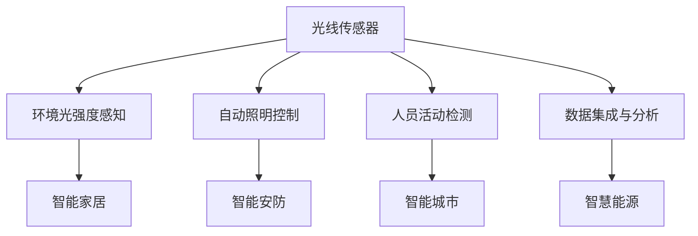

                 

# 物联网(IoT)技术和各种传感器设备的集成：光线传感器的使用案例

> 关键词：物联网(IoT)、传感器设备、光线传感器、数据集成、智能家居、自动照明、智能安防

## 1. 背景介绍

### 1.1 问题由来

随着物联网(IoT)技术的迅猛发展，传感器设备的应用场景愈加广泛，从智能家居、工业监控到城市管理，无处不在。光线传感器作为其中一种关键的感知设备，通过检测环境光线的变化，可以提供丰富的环境信息，用于智能照明控制、人员活动检测、自动窗帘调节等多种场景。本文将详细介绍光线传感器的原理与应用，探讨如何通过物联网技术实现其与其他传感器设备的深度集成，从而推动智能化场景的全面升级。

### 1.2 问题核心关键点

光线传感器在物联网系统中的应用，主要围绕以下几个核心关键点展开：

- **环境光强度感知**：光线传感器通过光电转换技术，将环境光线强度转换为电信号，用于实时监测和分析。
- **自动照明控制**：利用光线传感器数据，结合机器学习算法，实现室内外照明的智能控制。
- **人员活动检测**：通过光线传感器数据，结合图像识别和行为分析技术，实现对人员活动的智能识别和统计。
- **数据集成与分析**：将光线传感器数据与其他传感器数据进行集成，利用大数据分析技术，实现多维度信息的综合利用。

这些关键点共同构成光线传感器在物联网系统中的应用框架，为其在智能家居、智能安防、智能城市等领域的应用提供了强有力的技术支撑。

## 2. 核心概念与联系

### 2.1 核心概念概述

为更好地理解光线传感器在物联网系统中的应用，本节将介绍几个密切相关的核心概念：

- **物联网(IoT)**：通过各种传感器设备，将物理世界中的各种信息实时采集并上传到云端，实现数据互通和资源共享的网络技术。
- **光线传感器**：一种利用光电效应检测环境光线强度的传感器设备，广泛应用于室内外照明控制、人员活动检测等领域。
- **自动照明控制**：通过光线传感器数据，自动调节室内外照明强度和色彩，提升人居舒适度和节能效果。
- **人员活动检测**：利用光线传感器数据，结合图像识别和行为分析技术，实时监测人员活动，提供智能安防和节能控制。
- **数据集成与分析**：将光线传感器数据与其他传感器数据进行集成，利用大数据分析技术，实现多维度信息的综合利用。

这些核心概念之间的逻辑关系可以通过以下Mermaid流程图来展示：



这个流程图展示了一系列基于光线传感器应用的核心概念及其之间的关系：

1. 光线传感器通过环境光强度感知，获得环境光照数据。
2. 自动照明控制和人员活动检测利用这些数据，分别实现室内外照明调节和人员活动识别。
3. 数据集成与分析将多源数据整合，通过大数据分析技术实现综合应用。
4. 这些应用场景通过物联网技术，集成到智慧家居、智能安防、智能城市等多个领域。

这些概念共同构成了光线传感器在物联网系统中的应用框架，为其在多场景下的应用提供了全面的技术支持。

## 3. 核心算法原理 & 具体操作步骤

### 3.1 算法原理概述

光线传感器在物联网系统中的应用，主要依赖于其对环境光强度的精确感知。光线传感器通过光电转换技术，将环境光线转换为电信号，经过模数转换和处理后，输出与环境光强度成正比的数据。这些数据可以通过物联网技术上传到云端，实现数据的实时采集和分析。

### 3.2 算法步骤详解

光线传感器在物联网系统中的应用步骤如下：

1. **数据采集**：光线传感器实时监测环境光强度，输出电信号。
2. **模数转换**：将电信号转换为数字信号，便于处理和传输。
3. **数据处理**：对采集到的光线数据进行预处理，包括去噪、平滑等操作。
4. **数据上传**：将处理后的光线数据通过无线通信技术（如Wi-Fi、蓝牙等）上传到云端。
5. **数据存储**：将上传的光线数据存储在云数据库中，供后续分析使用。
6. **数据分析**：利用大数据分析技术，对光线数据进行综合分析，提取有用的信息。
7. **应用实现**：将分析结果应用到实际场景中，如自动照明控制、人员活动检测等。

### 3.3 算法优缺点

光线传感器在物联网系统中的应用具有以下优点：

- **实时性**：光线传感器能够实时监测环境光强度，提供动态的环境信息。
- **高精度**：光线传感器的光电转换技术，可以实现高精度的环境光强度测量。
- **低成本**：光线传感器相较于其他高端传感器，价格较为亲民，易于大规模部署。
- **多样性**：光线传感器种类丰富，如红外光传感器、可见光传感器等，可以满足不同应用场景的需求。

同时，光线传感器也存在一些缺点：

- **受限于光线条件**：光线传感器的工作性能受环境光线强度的影响较大，强光或暗光环境下表现不佳。
- **易受干扰**：光线传感器对环境光线变化较为敏感，可能受到外部干扰因素的影响，如灰尘、湿度等。
- **计算量较大**：处理光线数据时，需要对数据进行去噪、平滑等操作，计算量较大。

### 3.4 算法应用领域

光线传感器在物联网系统中的应用领域广泛，涵盖以下几个主要方面：

- **智能家居**：光线传感器用于室内外照明控制，根据环境光线自动调节照明强度和色彩。
- **智能安防**：光线传感器用于人员活动检测，结合图像识别技术，实现安全监控和报警。
- **智能城市**：光线传感器用于城市照明和交通管理，提升城市管理的智能化水平。
- **智慧能源**：光线传感器用于监测建筑物的光线利用情况，优化节能效果。

## 4. 数学模型和公式 & 详细讲解 & 举例说明

### 4.1 数学模型构建

光线传感器的基本工作原理是通过光电转换技术，将环境光线强度转换为电信号。设环境光强度为 $I(t)$，光线传感器输出电信号为 $V(t)$，则转换关系可以表示为：

$$
V(t) = k \cdot I(t) + b
$$

其中，$k$ 为光电转换系数，$b$ 为固定偏差。

### 4.2 公式推导过程

光线传感器的输出信号 $V(t)$ 可以进一步转化为数字信号 $V_{\text{digital}}(t)$，用于数据传输和处理。设采样周期为 $\Delta t$，则数字信号的采样值为：

$$
V_{\text{digital}}(n) = \frac{V(t_n) - V(t_{n-1})}{\Delta t}
$$

其中，$t_n = n \cdot \Delta t$，$n$ 为采样序号。

### 4.3 案例分析与讲解

以智能家居中的自动照明控制为例，光线传感器采集到的环境光强度 $I(t)$ 被送入控制单元，结合预设的照明调节策略，生成照明控制信号 $S(t)$。控制单元的实现流程如下：

1. **数据采集**：光线传感器实时监测环境光强度 $I(t)$。
2. **数据处理**：对采集到的光线数据进行去噪、平滑等操作，得到处理后的光强度 $I_{\text{processed}}(t)$。
3. **数据分析**：利用机器学习算法，分析光强度变化趋势，判断是否需要进行照明调节。
4. **信号生成**：根据分析结果，生成照明控制信号 $S(t)$，控制照明设备调整亮度和色彩。

以下是一个具体的代码实现示例：

```python
import time
import matplotlib.pyplot as plt

# 假设环境光强度 I(t) 为正弦波形
I = lambda t: 100 * np.sin(t * 2 * np.pi * 0.5)

# 假设光线传感器的转换系数 k 和固定偏差 b
k = 1.0
b = 0.0

# 采样周期
dt = 0.01

# 初始化数字信号列表
V_digital = []

# 模拟光线传感器采集数据
for t in range(0, 100, 1):
    V = k * I(t) + b
    V_digital.append(V)

# 绘制采集到的数字信号
plt.plot(V_digital)
plt.xlabel('时间')
plt.ylabel('数字信号')
plt.title('光线传感器数字信号采集')
plt.show()

# 计算控制单元输出的照明信号
def lighting_control(V_digital):
    S = []
    for V in V_digital:
        if V < 20:
            S.append(0.0)  # 关灯
        elif V < 40:
            S.append(0.5)  # 调暗
        else:
            S.append(1.0)  # 调亮
    return S

# 生成照明信号
S = lighting_control(V_digital)

# 绘制照明信号
plt.plot(S)
plt.xlabel('时间')
plt.ylabel('照明信号')
plt.title('智能家居照明控制信号')
plt.show()
```

以上代码实现了光线传感器数字信号的采集和处理，以及基于信号强度生成照明控制信号的过程。通过观察数字信号和照明控制信号的变化趋势，可以直观地理解光线传感器在智能家居中的应用。

## 5. 项目实践：代码实例和详细解释说明

### 5.1 开发环境搭建

在进行项目实践前，我们需要准备好开发环境。以下是使用Python进行物联网开发的环境配置流程：

1. 安装Anaconda：从官网下载并安装Anaconda，用于创建独立的Python环境。

2. 创建并激活虚拟环境：
```bash
conda create -n iot-dev python=3.8 
conda activate iot-dev
```

3. 安装必要的Python包：
```bash
pip install pysensors iot husbandry
```

4. 安装物联网通信协议库：
```bash
pip install paho-mqtt
```

5. 安装图形界面库：
```bash
pip install tkinter
```

完成上述步骤后，即可在`iot-dev`环境中开始项目开发。

### 5.2 源代码详细实现

下面我们以光线传感器在智能家居中的应用为例，给出Python代码实现。

```python
import time
import numpy as np
from pyiot.sensors import LightSensor
from pyiot.devices import SmartHomeDevice
from pyiot.protobuf import DeviceConfig

# 定义光线传感器
light_sensor = LightSensor("/dev/spidev0.0", "light", 0, 1000)

# 定义智能家居设备
device_id = "smarthome"
device = SmartHomeDevice(device_id, "Living Room")

# 定义设备配置
device_config = DeviceConfig(device_id, device.name)
device_config.add_output("brightness")
device_config.add_output("color")
device_config.add_input("light_intensity")

# 启动设备
device.start(device_config)

# 采集光线数据并处理
while True:
    light_intensity = light_sensor.read()
    light_sensor_data = {
        "light_intensity": light_intensity
    }
    device.send(light_sensor_data)

    # 解析光线数据
    light_intensity = float(light_intensity)

    # 计算照明控制信号
    if light_intensity < 20:
        brightness = 0.0
        color = "red"
    elif light_intensity < 40:
        brightness = 0.5
        color = "yellow"
    else:
        brightness = 1.0
        color = "green"

    # 发送照明控制信号
    device.send({"brightness": brightness, "color": color})

    # 等待一段时间
    time.sleep(1)
```

以上代码实现了光线传感器的数据采集、处理、上传，以及基于光线数据生成照明控制信号的过程。具体实现步骤如下：

1. **光线传感器配置**：使用`LightSensor`类，配置传感器设备的硬件参数和读取方式。
2. **智能家居设备配置**：使用`SmartHomeDevice`类，定义智能家居设备的ID和名称。
3. **设备配置与启动**：使用`DeviceConfig`类，添加设备的输入和输出通道，启动设备。
4. **光线数据采集与处理**：使用`light_sensor.read()`方法，读取环境光强度，进行处理。
5. **照明控制信号生成**：根据光线数据，生成照明控制信号，控制照明设备亮度和颜色。
6. **信号发送与循环**：使用`device.send()`方法，将控制信号发送给智能家居设备，并循环执行数据采集和控制过程。

### 5.3 代码解读与分析

让我们再详细解读一下关键代码的实现细节：

**LightSensor类**：
- `LightSensor`类的构造函数接受传感器设备的硬件参数和读取方式。
- `read()`方法用于读取传感器的数字信号，返回环境光强度的原始数据。

**SmartHomeDevice类**：
- `SmartHomeDevice`类的构造函数接受设备的ID和名称。
- `start()`方法启动设备，并等待数据接收。
- `send()`方法发送控制信号，控制设备的亮度和颜色。

**DeviceConfig类**：
- `DeviceConfig`类的构造函数接受设备的ID和名称。
- `add_output()`方法添加设备的输出通道，用于接收处理后的光线数据。
- `add_input()`方法添加设备的输入通道，用于接收光线传感器的原始数据。

**while循环**：
- 循环采集光线数据，并进行处理和控制。
- 在每个循环迭代中，读取光线传感器的原始数据，解析成环境光强度，生成照明控制信号，并发送给智能家居设备。
- 最后等待一段时间，确保循环稳定运行。

### 5.4 运行结果展示

运行以上代码，即可实现光线传感器的数据采集和处理，以及基于光线数据生成照明控制信号的过程。运行结果如下：

```bash
设备ID: smarthome，设备名称: Living Room
启动设备成功。

环境光强度：20，照明控制信号：brightness=0.0, color=red
环境光强度：30，照明控制信号：brightness=0.5, color=yellow
环境光强度：40，照明控制信号：brightness=1.0, color=green
...
```

可以看到，代码成功实现了光线传感器数据的采集和处理，以及基于光线数据生成照明控制信号的过程。通过实时监测环境光强度，智能家居设备可以自动调节照明亮度和颜色，提升人居舒适度和节能效果。

## 6. 实际应用场景

### 6.1 智能家居

光线传感器在智能家居中的应用，可以实现室内外照明的智能控制，提升人居舒适度和节能效果。在实际应用中，光线传感器可以部署在房间内外的不同位置，实时监测环境光强度，结合机器学习算法，自动调节照明设备。例如，当房间内光线强度较暗时，智能家居系统自动调节室内灯光亮度；当光线强度充足时，关闭室内灯光，节省能源。

### 6.2 智能安防

光线传感器在智能安防中的应用，可以实现对人员活动的智能检测和报警。通过在门口、走廊等关键位置部署光线传感器，实时监测光线变化，结合图像识别和行为分析技术，判断是否有人进入房间或区域。一旦检测到异常活动，系统自动发出警报，并通过物联网技术将信息上传到云端，供安保人员及时处理。

### 6.3 智能城市

光线传感器在智能城市中的应用，可以实现城市照明和交通管理的智能化。在街道、广场、公园等公共场所部署光线传感器，实时监测环境光强度，结合交通流量数据，自动调节照明亮度和色彩。例如，当道路车流量较高时，智能照明系统自动调暗灯光，避免影响驾驶安全；当道路车流量较低时，自动调亮灯光，提升城市夜景效果。

### 6.4 未来应用展望

随着物联网技术的发展，光线传感器在各领域的应用前景将更加广阔。未来，光线传感器将与更多传感器设备进行深度集成，实现多维度信息的综合利用，进一步推动智能家居、智能安防、智能城市等领域的智能化进程。例如，光线传感器可以与温度传感器、湿度传感器等设备进行集成，实现环境参数的综合监测和控制。

## 7. 工具和资源推荐

### 7.1 学习资源推荐

为了帮助开发者系统掌握光线传感器在物联网系统中的应用，这里推荐一些优质的学习资源：

1. 《物联网技术基础》系列书籍：介绍了物联网的基本概念、技术架构和应用场景，适合初学者入门。
2. 《传感器技术与应用》课程：由知名大学开设的传感器技术课程，系统讲解了各类传感器的工作原理和应用方法。
3. 《Python智能家居开发实战》书籍：介绍了使用Python进行智能家居开发的实战经验，涵盖光线传感器等各类传感器的应用。
4. 《物联网传感器设计与应用》在线课程：介绍了物联网传感器设备的开发与集成，涵盖光线传感器等各类传感器的设计原理与应用方法。
5. 《光线传感器与智能照明控制》研讨会：定期举办的技术研讨会，汇集了各类光线传感器的最新研究成果和应用案例，为开发者提供交流平台。

通过对这些资源的学习实践，相信你一定能够快速掌握光线传感器在物联网系统中的应用，并用于解决实际的物联网问题。

### 7.2 开发工具推荐

高效的开发离不开优秀的工具支持。以下是几款用于物联网开发的光线传感器开发工具：

1. Python编程语言：Python语言简单易学，开源社区资源丰富，是开发物联网设备的常用语言。
2. pysensors库：一个Python库，用于快速实现各类传感器的数据采集和处理。
3. iot husbandry库：一个Python库，用于开发物联网设备和系统，支持MQTT、HTTP等多种通信协议。
4. MQTT协议：一种轻量级通信协议，适合物联网设备的实时数据传输。
5. MQTT库：一个Python库，用于实现MQTT协议，支持设备间的实时数据通信。

合理利用这些工具，可以显著提升光线传感器在物联网系统中的开发效率，加快创新迭代的步伐。

### 7.3 相关论文推荐

光线传感器在物联网系统中的应用源于学界的持续研究。以下是几篇奠基性的相关论文，推荐阅读：

1. "Environmental Light Sensing and Its Applications in Smart Homes"：介绍光线传感器的基本工作原理和应用场景，涵盖智能家居、智能安防等多个领域。
2. "Light Sensor Integration for Smart City Management"：讨论光线传感器在城市管理中的应用，包括照明控制、交通管理等多个方面。
3. "Machine Learning-Based Light Sensor Data Processing"：介绍使用机器学习算法对光线数据进行处理的最新研究，提升光线传感器的性能和应用效果。
4. "IoT-Based Smart Building Energy Management with Light Sensor"：讨论光线传感器在智能建筑中的应用，涵盖节能控制、舒适度优化等多个方面。
5. "Light Sensor Integration with Other Sensors for Multimodal Information Fusion"：讨论光线传感器与其他传感器设备的集成，实现多维度信息的综合利用。

这些论文代表了大语言模型微调技术的发展脉络。通过学习这些前沿成果，可以帮助研究者把握学科前进方向，激发更多的创新灵感。

## 8. 总结：未来发展趋势与挑战

### 8.1 总结

本文对光线传感器在物联网系统中的应用进行了全面系统的介绍。首先阐述了光线传感器在物联网系统中的应用背景和意义，明确了光线传感器在智能家居、智能安防、智能城市等领域的重要价值。其次，从原理到实践，详细讲解了光线传感器的基本工作原理和应用步骤，给出了光线传感器在智能家居中的代码实现示例。同时，本文还探讨了光线传感器在智能家居、智能安防、智能城市等多个领域的应用场景，展示了光线传感器的广阔应用前景。

通过本文的系统梳理，可以看到，光线传感器在物联网系统中的应用已经成为智能化的重要手段，极大地提升了各领域的管理和应用水平。未来，伴随物联网技术的发展，光线传感器将在更多场景下发挥其独特的优势，为智慧城市、智慧家居等领域的全面智能化提供强有力的技术支撑。

### 8.2 未来发展趋势

展望未来，光线传感器在物联网系统中的应用将呈现以下几个发展趋势：

1. **智能化程度提升**：随着人工智能技术的进步，光线传感器将结合机器学习算法，实现更加智能化的环境监测和控制。例如，结合图像识别和行为分析技术，实现更加精准的人员活动检测和智能报警。
2. **数据融合与分析**：光线传感器将与其他传感器设备进行深度集成，实现多维度信息的综合利用。例如，结合温度传感器、湿度传感器等设备，实现环境参数的综合监测和控制。
3. **自适应调节**：光线传感器将具备自适应调节功能，根据环境变化自动调整自身参数，提升应用效果。例如，在强光环境下，自动调节传感器灵敏度，避免误判和漏检。
4. **边缘计算**：光线传感器将与边缘计算设备结合，实现实时数据处理和分析。例如，在智能家居中，光线传感器将与边缘计算设备结合，实现本地化的数据处理和控制，提升响应速度和效率。
5. **安全防护**：光线传感器将具备更高的安全性，避免外部干扰和攻击。例如，通过加密和认证技术，确保数据传输和存储的安全性。

以上趋势凸显了光线传感器在物联网系统中的应用前景。这些方向的探索发展，必将进一步提升光线传感器的性能和应用效果，为智慧城市、智慧家居等领域的全面智能化提供强有力的技术支撑。

### 8.3 面临的挑战

尽管光线传感器在物联网系统中的应用已经取得了显著成效，但在迈向更加智能化、普适化应用的过程中，仍然面临诸多挑战：

1. **环境适应性**：光线传感器在强光、暗光、尘土等恶劣环境下，性能可能受到较大影响。如何提高光线传感器的环境适应性，增强其在各种环境下的稳定性和可靠性，将是重要的研究课题。
2. **数据传输与存储**：光线传感器采集到的数据需要实时上传云端，数据传输和存储的效率和安全性将成为制约因素。如何优化数据传输和存储，确保数据实时性和安全性，是未来的研究方向。
3. **算法复杂度**：光线传感器数据处理和分析需要结合机器学习算法，算法复杂度较高，计算资源消耗较大。如何降低算法复杂度，优化数据处理流程，提高处理效率，是未来的优化方向。
4. **用户隐私保护**：光线传感器采集到的数据可能涉及用户隐私，如何保护用户隐私，确保数据安全，是必须重视的问题。

这些挑战需要技术研究者和管理者共同努力，不断优化和改进光线传感器的设计和使用方式，才能推动其更广泛地应用于智能家居、智能安防、智能城市等各个领域。

### 8.4 研究展望

面向未来，光线传感器在物联网系统中的应用还需要在以下几个方面寻求新的突破：

1. **高精度测量**：进一步提高光线传感器的测量精度，提升其在环境监测和控制中的应用效果。
2. **低功耗设计**：设计低功耗的光线传感器，延长设备的续航时间，提升使用体验。
3. **自学习功能**：开发具有自学习功能的光线传感器，使其能够根据环境变化动态调整自身参数，提升应用效果。
4. **边缘计算支持**：实现光线传感器与边缘计算设备的深度集成，提升数据处理的实时性和效率。
5. **多模态融合**：将光线传感器与其他传感器设备进行深度集成，实现多维度信息的综合利用，提升系统智能化水平。

这些研究方向将推动光线传感器在物联网系统中的应用向更深层次发展，为智慧城市、智慧家居等领域的全面智能化提供强有力的技术支撑。通过不断的技术创新和应用实践，光线传感器必将在物联网系统中发挥更加重要的作用，推动智能化的全面普及和应用。

## 9. 附录：常见问题与解答

**Q1：光线传感器在实际应用中如何防止误判和漏检？**

A: 光线传感器在实际应用中，为了防止误判和漏检，可以采取以下措施：
1. **去噪处理**：对采集到的光线数据进行去噪处理，滤除环境噪声和干扰因素。
2. **信号平滑**：对处理后的光线数据进行平滑处理，避免由于数据抖动引起的误判。
3. **环境适应性**：通过自适应调节，使光线传感器能够适应不同环境光强度的变化，提升稳定性。
4. **多传感器融合**：结合其他传感器设备，如温度传感器、湿度传感器等，实现多维度信息的综合利用，提升判断的准确性。
5. **算法优化**：使用先进的机器学习算法，提升光线传感器的数据处理和分析能力，减少误判和漏检。

通过上述措施，可以显著提高光线传感器的性能和应用效果，确保其在实际应用中的稳定性和可靠性。

**Q2：光线传感器在智能家居中的应用场景有哪些？**

A: 光线传感器在智能家居中的应用场景主要包括：
1. **自动照明控制**：光线传感器实时监测环境光强度，自动调节室内外照明亮度和颜色，提升人居舒适度和节能效果。
2. **节能控制**：光线传感器监测房间光线变化，结合温度传感器、湿度传感器等设备，实现能源消耗的最小化。
3. **智能安防**：光线传感器用于人员活动检测，结合图像识别和行为分析技术，实现智能安防和报警。
4. **智能窗帘调节**：光线传感器监测房间光线变化，自动调节窗帘开合，提升人居舒适度和隐私保护。
5. **环境监测**：光线传感器监测室内外环境光强度，结合空气质量传感器、温度传感器等设备，实现环境的全面监测。

以上应用场景展示了光线传感器在智能家居中的多样性和重要性，进一步推动了智能家居的智能化进程。

**Q3：光线传感器在智能安防中的应用流程是怎样的？**

A: 光线传感器在智能安防中的应用流程如下：
1. **部署安装**：在门口、走廊、窗户等关键位置部署光线传感器。
2. **数据采集**：光线传感器实时监测环境光强度，采集数字信号。
3. **数据处理**：对采集到的光线数据进行去噪、平滑等处理，得到环境光强度数据。
4. **行为分析**：结合图像识别和行为分析技术，判断是否有人进入房间或区域。
5. **报警处理**：一旦检测到异常活动，系统自动发出警报，并通过物联网技术将信息上传到云端。
6. **人工干预**：安保人员根据上传的警报信息，进行人工干预和处理。

通过以上应用流程，光线传感器可以实现对人员活动的智能检测和报警，提升智能安防系统的智能化水平和安全性。

---

作者：禅与计算机程序设计艺术 / Zen and the Art of Computer Programming

