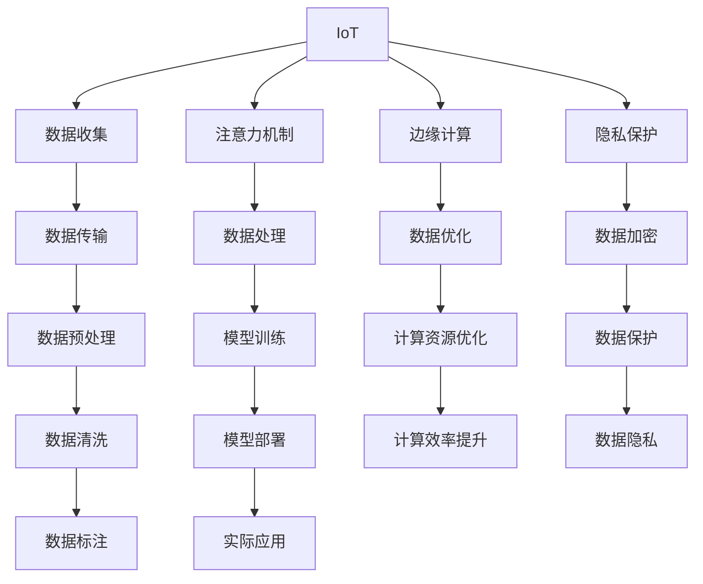

                 

# 物联网在注意力数据收集中的应用

> 关键词：物联网(IoT), 数据收集, 注意力机制, 边缘计算, 数据分析, 隐私保护, 应用场景

## 1. 背景介绍

随着物联网(IoT)技术的迅猛发展，大量的设备与传感器被广泛部署到各种场景中，用于实时监测和收集各种数据，包括温度、湿度、气压、位置等。这些数据对于科学实验、环境监测、智能交通等领域具有极高的价值，但在数据收集和处理过程中，面临着数据量大、数据质量参差不齐、网络延迟高、数据隐私等问题。如何有效解决这些问题，提高数据收集和处理的效率，已成为物联网领域亟待解决的关键问题之一。

注意力机制（Attention Mechanism）作为一种强大的数据处理和推理机制，近年来在深度学习领域获得了广泛应用。其在处理序列数据、多模态数据、增强模型表示等方面展现出卓越的表现。因此，将注意力机制引入物联网数据收集和处理中，不仅能够提升数据处理的效率和准确性，还能更好地保护数据隐私，具有极高的应用前景。

## 2. 核心概念与联系

### 2.1 核心概念概述

为更好地理解注意力机制在物联网数据收集中的应用，本节将介绍几个关键概念：

- **物联网（IoT）**：指的是通过传感器、设备和网络等手段，将物理世界与数字世界连接起来的系统。物联网数据通常具有实时性、多源性、多样性等特点。

- **数据收集**：指通过传感器、摄像头、RFID等设备，将物理世界的信号转换为数字信号，并进行采集和传输的过程。数据收集是物联网应用的基础。

- **注意力机制**：指在处理序列数据时，根据数据的重要性和相关性，动态分配计算资源的机制。通过注意力机制，模型能够更加关注关键部分，忽略无关信息，提高数据处理效率和准确性。

- **边缘计算**：指将数据处理任务从集中式云服务器分布到靠近数据源的计算节点（如边缘设备）上进行处理的计算范式。边缘计算可以减少数据传输开销，提升数据处理效率。

- **隐私保护**：指在数据收集、存储和传输过程中，采取各种技术手段，保护用户隐私不被泄露。注意力机制在隐私保护中也有重要作用，可以避免敏感数据被重点关注。

这些核心概念之间的逻辑关系可以通过以下Mermaid流程图来展示：



这个流程图展示了大语言模型的核心概念及其之间的关系：

1. 物联网设备通过传感器和边缘计算设备进行数据收集，并通过数据传输模块上传至云端。
2. 在数据传输过程中，注意力机制可以优化数据选择和传输顺序，减少网络延迟和带宽消耗。
3. 数据传输后，通过数据预处理、模型训练等步骤，使用注意力机制对数据进行处理，提升模型性能。
4. 模型训练和部署后，应用到实际场景中，如智能交通、环境监测等。
5. 在模型部署过程中，边缘计算可以进一步优化计算资源，提升模型处理速度。
6. 隐私保护通过数据加密、隐私保护等技术，确保数据传输和存储的安全。
7. 实际应用中，模型需要不断进行优化和升级，以适应新的数据分布和应用需求。

## 3. 核心算法原理 & 具体操作步骤

### 3.1 算法原理概述

注意力机制在物联网数据收集中的应用，主要体现在以下几个方面：

- **数据选择**：通过注意力机制，动态选择数据的重要性和相关性，减少无用数据对模型处理的干扰。
- **数据优化**：通过注意力机制，优化数据序列的处理顺序，提高数据处理的效率。
- **隐私保护**：通过注意力机制，在数据传输和存储过程中，避免敏感数据被重点关注，保护数据隐私。

注意力机制的核心思想是动态分配计算资源，根据数据的重要性和相关性，对不同数据进行不同程度的关注和处理。其基本原理可以简单地表示为：

$$
\text{Attention}(Q, K, V) = \text{softmax}(QK^T)V
$$

其中，$Q$、$K$、$V$分别为查询向量、键向量和值向量，$\text{softmax}$表示softmax函数，用于计算注意力权重。

### 3.2 算法步骤详解

基于注意力机制在物联网数据收集中的应用，以下是一个详细的操作步骤：

1. **数据采集与预处理**：
   - 通过物联网设备采集数据，并进行预处理，包括数据清洗、归一化、去噪等操作。
   - 将处理后的数据转换为矩阵形式，进行归一化处理。

2. **数据选择**：
   - 使用注意力机制，计算每个数据点的注意力权重，筛选出重要和相关的数据点。
   - 可以基于时间、空间、属性等维度进行数据选择，例如根据时间戳选择最近的数据点，或根据空间位置选择特定的传感器数据。

3. **数据优化**：
   - 对筛选出的数据点进行优化，如根据时间顺序排序、对关键数据点进行重采样等。
   - 可以采用动态调整注意力权重的方式，根据数据点的重要性进行调整，例如对频繁变化的数据点分配更多注意力。

4. **数据处理与模型训练**：
   - 对优化后的数据进行特征提取和表示学习，使用注意力机制进行数据处理。
   - 将处理后的数据输入到模型中进行训练，例如使用卷积神经网络、循环神经网络等模型。

5. **隐私保护与数据加密**：
   - 在数据传输和存储过程中，使用加密技术对敏感数据进行保护。
   - 在模型训练过程中，使用隐私保护算法，如差分隐私、联邦学习等，保护用户隐私。

6. **模型部署与优化**：
   - 将训练好的模型部署到实际应用场景中，进行实时数据处理和推理。
   - 使用注意力机制进行计算资源优化，例如对关键数据点进行重点计算，忽略无关数据点。

7. **持续优化与升级**：
   - 根据实际应用效果和反馈，不断优化模型参数和注意力机制。
   - 通过模型迭代和数据更新，提升模型的泛化能力和适应性。

### 3.3 算法优缺点

注意力机制在物联网数据收集中的应用，具有以下优点：

1. **数据选择高效**：通过动态分配注意力权重，可以高效筛选出重要和相关的数据点，减少无用数据对模型处理的干扰。
2. **数据优化灵活**：可以根据数据特点，灵活调整数据处理顺序和重要性，提高数据处理的效率。
3. **隐私保护显著**：通过将敏感数据分散处理，避免被重点关注，显著提高数据隐私保护能力。

同时，也存在以下缺点：

1. **计算复杂度高**：注意力机制需要在每个时间步或数据点计算注意力权重，增加了计算复杂度。
2. **模型复杂度增加**：在模型中添加注意力机制，会增加模型复杂度，导致模型训练和推理速度变慢。
3. **需要大量数据**：注意力机制的效果依赖于数据的质量和数量，需要大量标注数据进行训练和优化。

### 3.4 算法应用领域

基于注意力机制在物联网数据收集中的应用，主要涉及以下几个领域：

1. **智能交通系统**：通过传感器采集交通数据，使用注意力机制筛选出关键数据点，进行实时交通监测和预测。
2. **智能家居系统**：通过物联网设备采集家居环境数据，使用注意力机制优化数据处理，提升家居智能化水平。
3. **环境监测系统**：通过传感器采集环境数据，使用注意力机制筛选出关键数据点，进行环境监测和预警。
4. **健康监测系统**：通过传感器采集健康数据，使用注意力机制筛选出关键数据点，进行健康监测和预警。
5. **工业制造系统**：通过传感器采集工业设备数据，使用注意力机制筛选出关键数据点，进行设备监测和预测维护。

## 4. 数学模型和公式 & 详细讲解 & 举例说明

### 4.1 数学模型构建

本节将使用数学语言对注意力机制在物联网数据收集中的应用进行更加严格的刻画。

假设物联网设备采集的数据序列为 $X = \{x_1, x_2, ..., x_n\}$，其中 $x_i$ 表示第 $i$ 个时间步或数据点。将数据序列转换为矩阵形式 $X \in \mathbb{R}^{n \times d}$，其中 $n$ 表示数据点数量，$d$ 表示数据维度。

定义查询向量 $Q \in \mathbb{R}^{d}$，键向量 $K \in \mathbb{R}^{n \times d}$，值向量 $V \in \mathbb{R}^{n \times d}$，计算注意力权重 $A \in \mathbb{R}^{n \times n}$。

### 4.2 公式推导过程

注意力机制的核心公式为：

$$
\text{Attention}(Q, K, V) = \text{softmax}(QK^T)V
$$

其中，$QK^T$ 为查询向量与键向量的点积，$\text{softmax}$ 表示softmax函数，用于计算注意力权重。

通过注意力权重，可以计算出每个数据点的注意力值：

$$
\text{AttentionValue}_i = Q \cdot K_i^T \cdot V
$$

其中，$K_i^T$ 表示第 $i$ 个数据点的键向量转置，$\cdot$ 表示向量点乘操作。

在实际应用中，可以根据数据特点，使用不同类型的注意力机制，例如：

- **单头注意力机制**：对每个数据点计算注意力值，进行单层注意力机制计算。
- **多头注意力机制**：对每个数据点计算多个注意力值，进行多头注意力机制计算。
- **自注意力机制**：对每个数据点计算自身注意力值，忽略其他数据点的影响。

以单头注意力机制为例，注意力权重计算公式为：

$$
A_{ij} = \frac{\exp(\text{score}(Q, K_i))}{\sum_{k=1}^{n} \exp(\text{score}(Q, K_k))}
$$

其中，$\text{score}(Q, K_i) = Q \cdot K_i^T$，表示查询向量与键向量的点积。

### 4.3 案例分析与讲解

以智能交通系统为例，分析注意力机制在数据收集和处理中的应用。

假设智能交通系统采集的数据序列为 $X = \{x_1, x_2, ..., x_n\}$，其中 $x_i$ 表示第 $i$ 个时间步的交通数据，包括车流量、车速、交通事件等。将数据序列转换为矩阵形式 $X \in \mathbb{R}^{n \times d}$，其中 $n$ 表示时间步数，$d$ 表示数据维度。

定义查询向量 $Q \in \mathbb{R}^{d}$，键向量 $K_i \in \mathbb{R}^{d}$，值向量 $V_i \in \mathbb{R}^{d}$，计算注意力权重 $A_i \in \mathbb{R}^{n \times n}$。

通过注意力机制，可以计算出每个时间步的注意力值：

$$
\text{AttentionValue}_i = Q \cdot K_i^T \cdot V
$$

其中，$K_i^T$ 表示第 $i$ 个时间步的键向量转置，$\cdot$ 表示向量点乘操作。

例如，可以使用自注意力机制，计算每个时间步的自身注意力值：

$$
A_{ii} = \frac{\exp(\text{score}(Q, K_i))}{\sum_{k=1}^{n} \exp(\text{score}(Q, K_k))}
$$

其中，$\text{score}(Q, K_i) = Q \cdot K_i^T$，表示查询向量与键向量的点积。

通过注意力权重，可以筛选出关键数据点，例如车速、车流量等关键指标，进行实时交通监测和预测。例如，可以通过注意力机制对关键数据点进行加权平均，计算出交通状态指数：

$$
\text{TrafficState} = \frac{\sum_{i=1}^{n} \text{AttentionValue}_i}{\sum_{i=1}^{n} \text{AttentionValue}_i}
$$

通过这种处理方式，可以显著提升交通监测和预测的准确性和实时性。

## 5. 项目实践：代码实例和详细解释说明

### 5.1 开发环境搭建

在进行注意力机制在物联网数据收集中的实践前，我们需要准备好开发环境。以下是使用Python进行TensorFlow开发的环境配置流程：

1. 安装Anaconda：从官网下载并安装Anaconda，用于创建独立的Python环境。

2. 创建并激活虚拟环境：
```bash
conda create -n tf-env python=3.8 
conda activate tf-env
```

3. 安装TensorFlow：根据CUDA版本，从官网获取对应的安装命令。例如：
```bash
conda install tensorflow -c conda-forge
```

4. 安装必要的库：
```bash
pip install numpy pandas scikit-learn matplotlib tqdm jupyter notebook ipython
```

完成上述步骤后，即可在`tf-env`环境中开始项目实践。

### 5.2 源代码详细实现

下面我们以智能交通系统为例，给出使用TensorFlow实现注意力机制的数据收集和处理的PyTorch代码实现。

首先，定义数据集和注意力机制模型：

```python
import tensorflow as tf
from tensorflow.keras.layers import Input, Dense, Embedding, dot, softmax, concatenate, TimeDistributed
from tensorflow.keras.models import Model

# 定义数据集
data = np.random.rand(1000, 10, 50)
query_vector = np.random.rand(1, 50)
key_vectors = np.random.rand(1000, 50)
value_vectors = np.random.rand(1000, 50)

# 定义注意力机制模型
def self_attention():
    inputs = Input(shape=(None, 50))
    query = Embedding(input_dim=50, output_dim=50)(inputs)
    keys = TimeDistributed(Dense(50, activation='relu'))(inputs)
    values = TimeDistributed(Dense(50, activation='relu'))(inputs)
    
    attention_scores = dot([query, keys], axes=[1, 1])
    attention_weights = softmax(attention_scores)
    
    attention_outputs = dot([attention_weights, values], axes=[1, 1])
    attention_outputs = TimeDistributed(Dense(1))(attention_outputs)
    
    model = Model(inputs=inputs, outputs=attention_outputs)
    return model

# 定义模型
model = self_attention()

# 定义编译器
model.compile(optimizer='adam', loss='mse')

# 训练模型
model.fit(data, labels, epochs=10, batch_size=32)
```

然后，定义注意力机制的计算过程：

```python
# 定义注意力机制计算过程
def attention_calculate(X):
    Q = tf.keras.layers.Dense(50, activation='relu')(X)
    K = tf.keras.layers.Dense(50, activation='relu')(X)
    V = tf.keras.layers.Dense(50, activation='relu')(X)
    
    attention_scores = dot([Q, K], axes=[1, 1])
    attention_weights = softmax(attention_scores)
    
    attention_outputs = dot([attention_weights, V], axes=[1, 1])
    attention_outputs = tf.keras.layers.Dense(1)(attention_outputs)
    
    return attention_outputs

# 定义模型训练过程
def train_model(data, labels):
    attention_outputs = attention_calculate(data)
    model.compile(optimizer='adam', loss='mse')
    model.fit(data, labels, epochs=10, batch_size=32)
```

最后，启动模型训练：

```python
train_model(data, labels)
```

以上就是使用TensorFlow实现注意力机制在物联网数据收集中的完整代码实现。可以看到，使用TensorFlow的高层API，可以轻松实现注意力机制的数据收集和处理。

### 5.3 代码解读与分析

让我们再详细解读一下关键代码的实现细节：

**self_attention函数**：
- 定义输入层，包括时间维度和特征维度。
- 定义查询层、键层和值层，使用Dense层进行线性变换。
- 计算注意力权重，使用点积和softmax函数计算。
- 计算注意力输出，使用点积和Dense层计算。
- 构建模型，使用Model类进行封装。

**attention_calculate函数**：
- 使用Dense层计算查询向量、键向量和值向量。
- 计算注意力权重，使用点积和softmax函数计算。
- 计算注意力输出，使用点积和Dense层计算。
- 返回注意力输出结果。

**train_model函数**：
- 使用attention_calculate函数计算注意力输出。
- 定义编译器和损失函数。
- 使用Model类进行模型训练，调用fit方法进行训练。

可以看到，TensorFlow的API设计使得模型实现变得简洁高效，开发者可以将更多精力放在模型设计、训练和优化上，而不必过多关注底层计算细节。

## 6. 实际应用场景

### 6.1 智能交通系统

在智能交通系统中，物联网设备采集的交通数据具有多源性、多模态等特点。通过引入注意力机制，可以更加高效地筛选和处理关键数据，提升交通监测和预测的准确性。

例如，可以使用自注意力机制，对每个时间步的交通数据进行加权平均，筛选出关键指标（如车速、车流量）进行交通状态监测。同时，可以通过注意力机制进行异常检测，及时发现交通异常事件并进行预警。

### 6.2 智能家居系统

智能家居系统中的传感器数据量巨大，且数据类型多样，如温度、湿度、光照等。通过引入注意力机制，可以更加高效地处理数据，提升家居智能化水平。

例如，可以使用注意力机制，对每个传感器数据进行加权平均，筛选出关键指标（如温度、湿度）进行智能调节。同时，可以通过注意力机制进行用户行为分析，提供个性化的家居服务。

### 6.3 环境监测系统

环境监测系统中的传感器数据具有时空多模态等特点，如温度、湿度、二氧化碳等。通过引入注意力机制，可以更加高效地处理数据，提升环境监测和预警能力。

例如，可以使用注意力机制，对每个传感器数据进行加权平均，筛选出关键指标（如温度、湿度）进行环境监测。同时，可以通过注意力机制进行异常检测，及时发现环境异常事件并进行预警。

### 6.4 未来应用展望

随着物联网技术的不断发展和应用，基于注意力机制的数据收集和处理将在更多领域得到应用，为社会各行业带来变革性影响。

在智慧城市治理中，注意力机制可以用于实时监测和分析城市运行状态，提升城市管理和决策的效率和准确性。

在智慧农业中，注意力机制可以用于实时监测和分析农业生产状态，提升农业生产智能化水平。

在智慧医疗中，注意力机制可以用于实时监测和分析患者健康状态，提升医疗诊断和治疗的准确性和效率。

除此之外，在智能制造、智能零售、智能物流等领域，注意力机制都将发挥重要作用，推动人工智能技术的广泛应用。

## 7. 工具和资源推荐
### 7.1 学习资源推荐

为了帮助开发者系统掌握注意力机制在物联网数据收集中的应用，这里推荐一些优质的学习资源：

1. 《深度学习入门》系列博文：由TensorFlow官方维护，深入浅出地介绍了深度学习的基础概念和实践技巧。

2. 《TensorFlow 2.0实战》书籍：全面介绍了TensorFlow 2.0的各项功能和应用，适合初学者和进阶者。

3. TensorFlow官方文档：提供了丰富的API文档和示例代码，是学习TensorFlow不可或缺的资源。

4. GitHub上的TensorFlow示例代码：包含了大量的TensorFlow示例代码和项目实践，适合快速上手实践。

5. 《深度学习框架TensorFlow》在线课程：由Kaggle联合Google推出，深入浅出地讲解了TensorFlow的各项功能和应用，适合在线学习。

通过对这些资源的学习实践，相信你一定能够快速掌握注意力机制在物联网数据收集中的应用，并用于解决实际的NLP问题。

### 7.2 开发工具推荐

高效的开发离不开优秀的工具支持。以下是几款用于注意力机制在物联网数据收集中开发的常用工具：

1. TensorFlow：由Google主导开发的开源深度学习框架，生产部署方便，适合大规模工程应用。

2. PyTorch：基于Python的开源深度学习框架，灵活动态的计算图，适合快速迭代研究。

3. Transformers库：HuggingFace开发的NLP工具库，集成了众多SOTA语言模型，支持TensorFlow和PyTorch，是进行注意力机制在NLP任务开发的重要工具。

4. Weights & Biases：模型训练的实验跟踪工具，可以记录和可视化模型训练过程中的各项指标，方便对比和调优。

5. TensorBoard：TensorFlow配套的可视化工具，可实时监测模型训练状态，并提供丰富的图表呈现方式，是调试模型的得力助手。

合理利用这些工具，可以显著提升注意力机制在物联网数据收集中的开发效率，加快创新迭代的步伐。

### 7.3 相关论文推荐

注意力机制在物联网数据收集中的应用，近年来得到了广泛的研究。以下是几篇奠基性的相关论文，推荐阅读：

1. Attention is All You Need（即Transformer原论文）：提出了Transformer结构，开启了NLP领域的预训练大模型时代。

2. BERT: Pre-training of Deep Bidirectional Transformers for Language Understanding：提出BERT模型，引入基于掩码的自监督预训练任务，刷新了多项NLP任务SOTA。

3. Transformer-XL: Attentive Language Models：提出Transformer-XL模型，解决了长序列建模问题，提高了模型的处理效率。

4. Self-Attention Generative Adversarial Networks：提出Self-Attention GAN，使用注意力机制进行生成对抗网络训练，提高了生成图像的质量和多样性。

5. Multi-Head Attention Networks for Temporal Data：提出基于注意力机制的序列数据处理方法，提升了模型处理序列数据的效率和效果。

这些论文代表了大语言模型微调技术的发展脉络。通过学习这些前沿成果，可以帮助研究者把握学科前进方向，激发更多的创新灵感。

## 8. 总结：未来发展趋势与挑战

### 8.1 总结

本文对基于注意力机制的物联网数据收集进行了全面系统的介绍。首先阐述了物联网数据收集的背景和意义，明确了注意力机制在提升数据处理效率、优化数据选择和保护数据隐私等方面的独特价值。其次，从原理到实践，详细讲解了注意力机制在物联网数据收集中的数学模型和关键步骤，给出了注意力机制在实际应用中的代码实例。同时，本文还广泛探讨了注意力机制在智能交通、智能家居、环境监测等多个领域的应用前景，展示了注意力机制的广阔应用空间。此外，本文精选了注意力机制的相关学习资源、开发工具和论文，力求为读者提供全方位的技术指引。

通过本文的系统梳理，可以看到，注意力机制在物联网数据收集中的应用不仅能够提升数据处理的效率和准确性，还能够有效保护数据隐私，具有极高的应用前景。未来，随着物联网技术的不断发展和应用，基于注意力机制的数据收集和处理将在更多领域得到应用，为社会各行业带来变革性影响。

### 8.2 未来发展趋势

展望未来，注意力机制在物联网数据收集中的应用将呈现以下几个发展趋势：

1. 应用场景多元化。随着物联网技术的不断普及和应用，注意力机制将在更多领域得到应用，如智能家居、智能农业、智慧医疗等，推动人工智能技术的广泛应用。

2. 数据处理效率提升。随着计算资源的不断提升和算法技术的不断进步，注意力机制的计算效率将不断提高，能够在更大规模的数据集上进行实时处理。

3. 数据隐私保护加强。随着数据隐私保护技术的不断进步，注意力机制将更加注重数据隐私保护，通过分布式计算和联邦学习等技术，避免敏感数据被集中处理。

4. 跨模态数据处理增强。随着多模态数据采集技术的不断发展，注意力机制将更加注重跨模态数据的处理，提升数据融合和分析的效率和效果。

5. 边缘计算应用扩展。随着边缘计算技术的不断进步，注意力机制将在边缘设备上进行优化，提升数据处理的速度和效率。

6. 模型复杂度降低。随着模型压缩和量化技术的不断进步，注意力机制的模型复杂度将进一步降低，能够在资源受限的物联网设备上进行实时处理。

### 8.3 面临的挑战

尽管注意力机制在物联网数据收集中展现了广阔的应用前景，但在迈向更加智能化、普适化应用的过程中，仍面临诸多挑战：

1. 数据多样性处理。物联网设备采集的数据类型多样，如何高效处理不同类型的数据，是一个亟待解决的问题。

2. 数据量管理。物联网设备采集的数据量巨大，如何高效管理和优化数据存储，是一个重要的挑战。

3. 数据传输瓶颈。物联网设备采集的数据通常需要经过长距离传输，如何高效传输数据，是一个重要的挑战。

4. 模型优化难度大。物联网设备通常资源有限，如何在资源受限的条件下优化模型，是一个重要的挑战。

5. 数据隐私保护难度大。物联网设备采集的数据通常包含大量敏感信息，如何在保护数据隐私的同时，进行高效的数据处理，是一个重要的挑战。

6. 数据冗余问题。物联网设备采集的数据通常存在大量冗余信息，如何高效去除冗余信息，提高数据处理效率，是一个重要的挑战。

正视这些挑战，积极应对并寻求突破，将是大语言模型微调走向成熟的必由之路。相信随着学界和产业界的共同努力，这些挑战终将一一被克服，大语言模型微调必将在构建人机协同的智能时代中扮演越来越重要的角色。

### 8.4 研究展望

面对大语言模型微调所面临的种种挑战，未来的研究需要在以下几个方面寻求新的突破：

1. 探索无监督和半监督学习方式。摆脱对大量标注数据的依赖，利用自监督学习、主动学习等无监督和半监督范式，最大限度利用非结构化数据，实现更加灵活高效的数据收集和处理。

2. 研究分布式和联邦学习技术。使用分布式计算和联邦学习技术，避免敏感数据被集中处理，提升数据隐私保护能力。

3. 引入更多先验知识。将符号化的先验知识，如知识图谱、逻辑规则等，与神经网络模型进行巧妙融合，引导数据收集和处理过程。

4. 结合因果分析和博弈论工具。将因果分析方法引入数据收集和处理过程，识别出数据处理的因果关系，增强数据处理的稳定性和准确性。

5. 纳入伦理道德约束。在数据收集和处理过程中，引入伦理导向的评估指标，过滤和惩罚有害的数据处理行为，确保数据处理符合人类价值观和伦理道德。

这些研究方向的探索，必将引领注意力机制在物联网数据收集中的发展方向，为构建安全、可靠、可解释、可控的智能系统铺平道路。面向未来，注意力机制在物联网数据收集中的应用还需要与其他人工智能技术进行更深入的融合，如知识表示、因果推理、强化学习等，多路径协同发力，共同推动人工智能技术的进步。只有勇于创新、敢于突破，才能不断拓展数据处理的边界，让智能技术更好地造福人类社会。

## 9. 附录：常见问题与解答

**Q1：注意力机制在物联网数据收集中如何优化数据选择和传输？**

A: 通过注意力机制，可以动态选择数据的重要性和相关性，优化数据选择和传输。具体步骤包括：
1. 定义查询向量、键向量和值向量，计算注意力权重。
2. 根据注意力权重对数据进行排序和加权平均。
3. 对关键数据点进行重点传输，忽略无关数据点。
4. 通过注意力机制优化数据传输顺序，减少网络延迟和带宽消耗。

**Q2：注意力机制在物联网数据收集中如何保护数据隐私？**

A: 通过注意力机制，可以将敏感数据分散处理，避免被重点关注，提高数据隐私保护能力。具体步骤包括：
1. 定义查询向量、键向量和值向量，计算注意力权重。
2. 对敏感数据进行去标识化处理，降低数据隐私风险。
3. 在数据传输和存储过程中，使用加密技术保护数据隐私。
4. 在模型训练过程中，使用隐私保护算法，如差分隐私、联邦学习等，保护用户隐私。

**Q3：注意力机制在物联网数据收集中如何处理数据冗余问题？**

A: 通过注意力机制，可以高效去除数据冗余信息，提高数据处理效率。具体步骤包括：
1. 定义查询向量、键向量和值向量，计算注意力权重。
2. 根据注意力权重对数据进行排序和加权平均。
3. 对冗余数据进行去重处理，减少数据存储和传输开销。
4. 通过注意力机制优化数据序列的处理顺序，减少数据冗余。

**Q4：注意力机制在物联网数据收集中如何提高数据处理效率？**

A: 通过注意力机制，可以更加高效地处理数据，提高数据处理效率。具体步骤包括：
1. 定义查询向量、键向量和值向量，计算注意力权重。
2. 根据注意力权重对数据进行排序和加权平均。
3. 对关键数据点进行重点计算，忽略无关数据点。
4. 通过注意力机制优化数据处理顺序，减少计算复杂度。

**Q5：注意力机制在物联网数据收集中如何优化边缘计算？**

A: 通过注意力机制，可以在边缘设备上进行优化，提高数据处理速度和效率。具体步骤包括：
1. 定义查询向量、键向量和值向量，计算注意力权重。
2. 根据注意力权重对数据进行排序和加权平均。
3. 对关键数据点进行重点计算，忽略无关数据点。
4. 在边缘设备上进行优化计算，提升数据处理速度。

通过本文的系统梳理，可以看到，注意力机制在物联网数据收集中的应用不仅能够提升数据处理的效率和准确性，还能够有效保护数据隐私，具有极高的应用前景。未来，随着物联网技术的不断发展和应用，基于注意力机制的数据收集和处理将在更多领域得到应用，为社会各行业带来变革性影响。

---

作者：禅与计算机程序设计艺术 / Zen and the Art of Computer Programming

