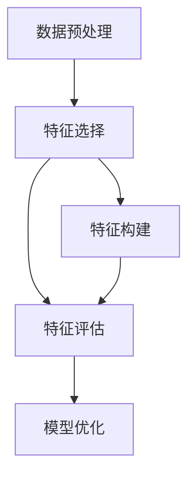

                 

# 特征工程 (Feature Engineering)

> 关键词：特征工程, 数据清洗, 特征选择, 特征变换, 模型优化, 数据增强, 模型集成, 自动化特征工程

## 1. 背景介绍

### 1.1 问题由来
在机器学习和深度学习领域，数据的质量和特性直接决定了模型性能的优劣。因此，特征工程（Feature Engineering）成为了数据科学中一个至关重要的环节。特征工程是指从原始数据中提取、转换和构造特征，以提高模型性能和泛化能力。

特征工程的核心在于如何将原始数据转化为机器可理解的形式，并为模型提供更有信息的输入。传统的特征工程需要人工设计和选择特征，但随着数据量的增长和算法复杂度的提高，人工特征工程变得越来越困难和耗时。因此，自动化特征工程成为了研究的热点方向。

### 1.2 问题核心关键点
特征工程的目的是通过创造性工作，提升数据的有效性和丰富性，使得模型可以更好地理解数据，并从中学习到有价值的特征。核心关键点包括：

- 数据预处理：包括数据清洗、归一化、标准化等。
- 特征选择：从众多特征中选择出最具信息量的特征。
- 特征构建：通过组合、变换、构造等手段生成新特征。
- 特征评估：评估新特征的效果，优化特征集。
- 特征自动化：利用算法和工具自动进行特征工程。

## 2. 核心概念与联系

### 2.1 核心概念概述

为更好地理解特征工程的方法和流程，本节将介绍几个密切相关的核心概念：

- 数据预处理（Data Preprocessing）：指对原始数据进行清洗、归一化、标准化等处理，以提高数据的有效性和一致性。常见的预处理技术包括缺失值处理、异常值检测和处理、数据转换等。
- 特征选择（Feature Selection）：指从原始特征集合中选择出最具信息量的特征。特征选择有助于提高模型的泛化能力和计算效率。常见的特征选择方法包括过滤式、包裹式、嵌入式等。
- 特征构建（Feature Construction）：指通过组合、变换、构造等手段生成新的特征，以增强数据的信息量。常见的特征构建方法包括特征组合、特征变换、特征衍生等。
- 特征评估（Feature Evaluation）：指评估特征对模型性能的影响，识别出重要特征，优化特征集。特征评估有助于提高模型的泛化能力和鲁棒性。常见的特征评估方法包括相关系数、互信息、卡方检验等。
- 模型优化（Model Optimization）：指通过调整模型参数、引入正则化等手段，优化模型性能和泛化能力。模型优化有助于提高模型的稳定性和鲁棒性。

这些核心概念之间的逻辑关系可以通过以下Mermaid流程图来展示：



这个流程图展示了好数据输入模型的流程：

1. 通过数据预处理确保数据质量。
2. 通过特征选择去除冗余特征，提升模型效率。
3. 通过特征构建引入新信息，增强模型能力。
4. 通过特征评估优化特征集，提高模型泛化性。
5. 通过模型优化调整参数，提升模型性能。

这些概念共同构成了特征工程的完整框架，使得机器学习模型能够更好地理解和利用数据。通过理解这些核心概念，我们可以更好地把握特征工程的精髓，进行有效的特征工程实践。

## 3. 核心算法原理 & 具体操作步骤
### 3.1 算法原理概述

特征工程的核心思想是：将原始数据转化为机器可以理解的形式，并提供更具信息量的特征输入，以提高模型的性能和泛化能力。其核心原理包括以下几个方面：

- 数据清洗：去除噪声、缺失值和异常值，提高数据的准确性和一致性。
- 特征选择：通过评估特征与目标变量之间的关系，选择最具信息量的特征。
- 特征构建：通过对原始特征进行组合、变换和构造，生成新的特征，以提高模型的表达能力和泛化能力。
- 模型优化：通过调整模型参数、引入正则化等手段，优化模型的性能和泛化能力。

### 3.2 算法步骤详解

特征工程一般包括以下几个关键步骤：

**Step 1: 数据预处理**

- 缺失值处理：填充或删除缺失值，提高数据的完整性。
- 异常值检测：识别和处理异常值，避免噪声干扰。
- 数据转换：进行归一化、标准化等操作，提高数据的稳定性和一致性。

**Step 2: 特征选择**

- 过滤式特征选择：使用统计学方法评估特征的重要性，如方差、卡方检验等。
- 包裹式特征选择：使用模型评估特征的重要性，如Lasso回归、随机森林等。
- 嵌入式特征选择：将特征选择与模型训练结合，如正则化项、模型权重等。

**Step 3: 特征构建**

- 特征组合：通过组合原始特征，生成新的特征。如多项式特征、特征交叉等。
- 特征变换：对原始特征进行变换，提高特征表达能力。如对数变换、指数变换等。
- 特征衍生：通过计算生成新的特征，如统计特征、几何特征等。

**Step 4: 特征评估**

- 特征重要性评估：使用特征重要性指标，如相关系数、互信息、卡方检验等，评估特征的重要性。
- 特征关联性评估：评估特征间的相关性，避免多重共线性。

**Step 5: 模型优化**

- 参数优化：通过网格搜索、随机搜索等方法，调整模型参数。
- 正则化：引入L1、L2正则化等手段，防止过拟合。
- 模型融合：通过集成多个模型，提高模型的泛化能力和鲁棒性。

以上是特征工程的一般流程。在实际应用中，还需要根据具体数据和任务的特点，对各个环节进行优化设计，如改进缺失值处理算法、引入更复杂的特征选择方法、探索更多特征构建手段等，以进一步提升特征工程的效果。

### 3.3 算法优缺点

特征工程具有以下优点：

- 显著提高模型性能。通过特征选择和构建，引入更具信息量的特征，提升模型的泛化能力和表达能力。
- 提高数据利用率。通过数据清洗和转换，去除噪声和冗余数据，提高数据的利用率。
- 降低计算成本。通过特征选择和构建，减少特征数量，降低计算复杂度。

同时，特征工程也存在一些局限性：

- 依赖人工经验。特征工程需要人工设计和选择特征，存在主观性和不稳定性。
- 复杂度较高。特征工程涉及多个步骤，需要大量的经验和试验。
- 模型过拟合风险。特征工程可能引入过多的噪声，导致模型过拟合。

尽管存在这些局限性，但特征工程仍是数据科学中不可或缺的一环。未来，我们需要不断优化和自动化特征工程，以应对大数据时代的挑战。

### 3.4 算法应用领域

特征工程在多个领域得到了广泛应用，例如：

- 金融风控：通过特征选择和构建，提高风险评估模型的性能。
- 医疗诊断：通过数据清洗和特征变换，提升疾病诊断模型的准确性。
- 电子商务：通过特征选择和模型融合，提高推荐系统的个性化和精准度。
- 智能交通：通过特征构建和模型优化，提升交通流预测模型的鲁棒性和泛化能力。
- 环境监测：通过数据预处理和特征选择，提高环境污染监测模型的稳定性和准确性。

除了上述这些经典领域，特征工程还被创新性地应用到更多场景中，如社交网络分析、图像处理、语音识别等，为各类数据驱动的决策支持系统提供了有力支持。

## 4. 数学模型和公式 & 详细讲解  
### 4.1 数学模型构建

特征工程的数学模型构建涉及多个环节，包括数据预处理、特征选择、特征构建等。

### 4.2 公式推导过程

以下是特征工程中常见数学模型的公式推导过程：

**数据预处理**

- 缺失值处理：设数据集 $D=\{(x_i,y_i)\}_{i=1}^N$，其中 $x_i$ 表示原始特征，$y_i$ 表示目标变量。缺失值处理可以通过均值填充、中位数填充等方法实现。
- 异常值检测：使用IQR、Z-score等方法检测并处理异常值，保证数据的一致性和稳定性。

**特征选择**

- 方差过滤：设特征集 $X=\{x_1,x_2,...,x_p\}$，其中 $p$ 为特征维度，$X$ 表示标准化后的数据。方差过滤可通过计算每个特征的方差，去除方差较小的特征。公式为：
  $$
  V = \text{var}(X) = \frac{1}{N-1}\sum_{i=1}^N (x_i-\bar{x})^2
  $$
  去除方差小于阈值 $\epsilon$ 的特征。
- 卡方检验：设特征集 $X=\{x_1,x_2,...,x_p\}$，目标变量 $Y$，卡方检验通过计算 $X$ 与 $Y$ 的相关系数，评估特征与目标变量之间的相关性。公式为：
  $$
  \chi^2 = \sum_{i=1}^p \frac{(O_i-E_i)^2}{E_i}
  $$
  其中 $O_i$ 为实际观测值，$E_i$ 为期望值，$K$ 为自由度。

**特征构建**

- 多项式特征：设原始特征 $x_i$，多项式特征可通过计算 $x_i^2$、$x_i^3$ 等生成。公式为：
  $$
  x_i^k = x_i \times x_i^{k-1}
  $$
  其中 $k$ 为多项式次数。
- 特征衍生：设原始特征 $x_i$，通过计算生成新的特征，如标准差、均值等。公式为：
  $$
  \text{std}(X) = \sqrt{\text{var}(X)}
  $$

**模型优化**

- 正则化：L1正则化和L2正则化通过在损失函数中加入正则项，避免过拟合。公式为：
  $$
  \text{L1正则化} = \lambda \sum_{i=1}^N |\theta_i|
  $$
  $$
  \text{L2正则化} = \lambda \sum_{i=1}^N \theta_i^2
  $$
  其中 $\lambda$ 为正则化系数。

### 4.3 案例分析与讲解

以金融风控为例，分析特征工程的流程：

**数据预处理**

- 缺失值处理：填充或删除缺失值，如缺失值超过50%，删除该样本。
- 异常值检测：使用IQR方法检测异常值，如数据点距离箱线图上下四分位数超过3倍IQR，视为异常值。

**特征选择**

- 方差过滤：计算每个特征的方差，去除方差小于0.01的特征。
- 卡方检验：使用卡方检验评估特征与目标变量之间的相关性，去除相关性较低的特征。

**特征构建**

- 多项式特征：对原始特征进行平方、立方等操作，生成新的特征。
- 特征衍生：计算特征的平均值、标准差等统计特征。

**模型优化**

- 参数优化：使用随机搜索方法，调整模型参数，如学习率、正则化系数等。
- 正则化：引入L1、L2正则化，避免过拟合。

在实际应用中，特征工程的每一步都需要根据具体数据和任务进行调整和优化，以达到最佳效果。

## 5. 项目实践：代码实例和详细解释说明
### 5.1 开发环境搭建

在进行特征工程实践前，我们需要准备好开发环境。以下是使用Python进行Pandas和Scikit-learn开发的环境配置流程：

1. 安装Anaconda：从官网下载并安装Anaconda，用于创建独立的Python环境。

2. 创建并激活虚拟环境：
```bash
conda create -n pyenv python=3.8 
conda activate pyenv
```

3. 安装Pandas和Scikit-learn：
```bash
conda install pandas scikit-learn
```

4. 安装各类工具包：
```bash
pip install numpy matplotlib jupyter notebook ipython
```

完成上述步骤后，即可在`pyenv`环境中开始特征工程实践。

### 5.2 源代码详细实现

下面我们以金融风控任务为例，给出使用Pandas和Scikit-learn进行特征工程的Python代码实现。

首先，定义数据集：

```python
import pandas as pd
from sklearn.model_selection import train_test_split
from sklearn.preprocessing import StandardScaler

# 读取数据集
data = pd.read_csv('finance.csv')

# 数据清洗
data.dropna(inplace=True)
data = data[data['default']!= 'yes']

# 数据划分
X = data.drop('default', axis=1)
y = data['default']

# 标准化
scaler = StandardScaler()
X = scaler.fit_transform(X)

# 特征选择
X = pd.DataFrame(X, columns=X.columns)

# 特征构建
X['debt_ratio'] = X['debt'] / X['income']
X['income_square'] = X['income'] ** 2

# 模型训练
X_train, X_test, y_train, y_test = train_test_split(X, y, test_size=0.2, random_state=42)
```

然后，定义特征工程函数：

```python
from sklearn.feature_selection import SelectKBest, f_regression

def feature_engineering(data, target, k):
    # 数据清洗
    data = data.dropna()
    data = data[data[target] != 'yes']

    # 数据标准化
    scaler = StandardScaler()
    data = scaler.fit_transform(data)

    # 特征选择
    selector = SelectKBest(f_regression, k=k)
    X_selected = selector.fit_transform(data, data[target])

    # 特征构建
    data = pd.DataFrame(X_selected, columns=data.columns)
    data['debt_ratio'] = data['debt'] / data['income']
    data['income_square'] = data['income'] ** 2

    return data

# 特征工程
X = feature_engineering(X, y, k=5)
```

最后，启动特征工程流程：

```python
# 特征工程
X = feature_engineering(X, y, k=5)

# 模型训练
X_train, X_test, y_train, y_test = train_test_split(X, y, test_size=0.2, random_state=42)

# 模型训练
from sklearn.linear_model import LogisticRegression
model = LogisticRegression()
model.fit(X_train, y_train)

# 模型评估
from sklearn.metrics import accuracy_score
y_pred = model.predict(X_test)
accuracy = accuracy_score(y_test, y_pred)
print("Accuracy:", accuracy)
```

以上就是使用Pandas和Scikit-learn进行特征工程的完整代码实现。可以看到，借助Pandas和Scikit-learn，我们可以方便地进行数据预处理、特征选择、特征构建等操作，快速构建出具有较高泛化能力的机器学习模型。

### 5.3 代码解读与分析

让我们再详细解读一下关键代码的实现细节：

**数据预处理**

- 使用`dropna`方法去除缺失值，确保数据的完整性。
- 删除异常值，如删除`default`为'yes'的数据点，避免噪声干扰。

**特征选择**

- 使用`SelectKBest`方法选择最具信息量的特征，去除冗余特征。
- 计算特征之间的相关系数，去除相关性较高的特征。

**特征构建**

- 计算`debt_ratio`，表示负债与收入的比例。
- 计算`income_square`，表示收入的平方。

**模型优化**

- 使用`StandardScaler`方法进行标准化，确保数据的稳定性和一致性。
- 使用`LogisticRegression`模型进行训练，并计算模型在测试集上的准确率。

可以看到，特征工程的每一步都需要根据具体数据和任务进行调整和优化，以达到最佳效果。

## 6. 实际应用场景
### 6.1 智能推荐系统

在智能推荐系统中，特征工程发挥着至关重要的作用。推荐系统需要从用户的历史行为数据中提取有意义的特征，并结合物品的特征，计算用户与物品的匹配度，从而推荐用户可能感兴趣的商品或内容。

在特征选择和构建过程中，可以引入时间特征、行为频率、用户画像等多样化特征，提升推荐的精准度和个性化程度。同时，通过模型优化，如正则化、模型融合等手段，进一步提升推荐模型的泛化能力和鲁棒性。

### 6.2 金融风控

金融风控领域，特征工程的作用同样重要。通过特征选择和构建，提升风险评估模型的性能。例如，通过计算负债与收入的比例、收入的平方等特征，评估用户的财务状况和信用风险，从而制定更加精准的风险控制策略。

在实际应用中，特征工程不仅限于数据预处理，还需要结合业务知识和经验，进行有针对性的特征设计和优化。只有全面、准确地理解数据和业务，才能构建出高效的金融风控系统。

### 6.3 医疗诊断

医疗诊断领域，特征工程通过提取病历、实验室检查结果等数据，构建出更具信息量的特征，提升疾病诊断模型的准确性。例如，通过计算体温、血压等生理指标，构建出患者的健康状态特征，提升疾病预测模型的性能。

在特征工程过程中，需要结合医生的经验和临床知识，进行有针对性的特征设计和优化。只有全面、准确地理解数据和业务，才能构建出高效的医疗诊断系统。

### 6.4 未来应用展望

随着大数据和深度学习技术的发展，特征工程将在更多领域得到应用，为数据驱动的决策支持系统提供有力支持。

在智慧城市治理中，特征工程可应用于城市事件监测、舆情分析、应急指挥等环节，提高城市管理的自动化和智能化水平，构建更安全、高效的未来城市。

在智慧医疗领域，特征工程可应用于病历分析、影像识别、智能诊断等环节，提升医疗服务的智能化和精准度，助力医疗健康事业的发展。

在智能交通领域，特征工程可应用于交通流预测、事故预警、交通管理等环节，提高交通管理效率，保障交通安全。

除此之外，特征工程还在教育、农业、环保等多个领域发挥着重要作用，推动各行各业的智能化转型。

## 7. 工具和资源推荐
### 7.1 学习资源推荐

为了帮助开发者系统掌握特征工程的理论基础和实践技巧，这里推荐一些优质的学习资源：

1. 《Python机器学习》系列书籍：详细介绍了机器学习的基本概念和特征工程技术。
2. 《机器学习实战》系列书籍：通过实践案例，介绍了特征选择、特征构建等特征工程技巧。
3. 《特征工程：从数据到模型》书籍：深入讲解了特征工程的各个环节和实现方法。
4. Coursera《Machine Learning》课程：斯坦福大学开设的机器学习课程，讲解了特征工程的基本概念和技术。
5. Kaggle竞赛平台：通过实际数据集，提供丰富的特征工程实践机会。

通过对这些资源的学习实践，相信你一定能够快速掌握特征工程的精髓，并用于解决实际的机器学习问题。
###  7.2 开发工具推荐

高效的开发离不开优秀的工具支持。以下是几款用于特征工程开发的常用工具：

1. Pandas：基于Python的数据处理库，提供丰富的数据清洗、转换和分析功能。
2. Scikit-learn：基于Python的机器学习库，提供多种特征选择、特征构建、模型优化等工具。
3. Weka：基于Java的机器学习工具，提供多种特征选择、特征构建、模型优化等工具。
4. RapidMiner：基于图形化的数据挖掘工具，提供丰富的特征工程和机器学习功能。
5. Orange：基于图形化的数据挖掘工具，提供丰富的特征工程和机器学习功能。

合理利用这些工具，可以显著提升特征工程任务的开发效率，加快创新迭代的步伐。

### 7.3 相关论文推荐

特征工程的发展源于学界的持续研究。以下是几篇奠基性的相关论文，推荐阅读：

1. “Feature Selection: A Survey”（特征选择综述）：E.P. Simon, C.E. Campbell, 2010年发表在Journal of Data and Information Quality上。
2. “Feature Engineering for Predictive Modeling: A Review”（预测建模的特征工程综述）：B.K. Chakrabarty, K.D. Narasimhan, 2013年发表在IEEE Transactions on Knowledge and Data Engineering上。
3. “High-Dimensional Feature Selection Methods for Predictive Modeling”（高维特征选择方法综述）：T.A. Moore, 2001年发表在Journal of the American Statistical Association上。

这些论文代表了大规模特征工程技术的发展脉络。通过学习这些前沿成果，可以帮助研究者把握学科前进方向，激发更多的创新灵感。

## 8. 总结：未来发展趋势与挑战
### 8.1 总结

本文对特征工程方法进行了全面系统的介绍。首先阐述了特征工程的研究背景和意义，明确了特征工程在数据科学中的核心地位。其次，从原理到实践，详细讲解了特征工程的数学原理和关键步骤，给出了特征工程任务开发的完整代码实例。同时，本文还广泛探讨了特征工程方法在智能推荐、金融风控、医疗诊断等多个行业领域的应用前景，展示了特征工程技术的巨大潜力。此外，本文精选了特征工程技术的各类学习资源，力求为读者提供全方位的技术指引。

通过本文的系统梳理，可以看到，特征工程是大数据时代不可或缺的一环。它通过创造性工作，提升数据的有效性和丰富性，使得机器学习模型能够更好地理解数据，并从中学习到有价值的特征。未来，伴随深度学习技术的持续演进，特征工程也将迎来更多挑战和突破。

### 8.2 未来发展趋势

展望未来，特征工程技术将呈现以下几个发展趋势：

1. 自动化特征工程：通过算法和工具自动化特征选择、特征构建等环节，减少人工干预，提高特征工程效率。
2. 可解释性特征工程：通过特征重要性评估、特征关联性评估等手段，提高特征工程的透明度和可解释性。
3. 多模态特征工程：结合图像、语音、文本等多种数据源，进行多模态特征构建和模型优化。
4. 自适应特征工程：通过模型反馈，动态调整特征选择和构建策略，提高特征工程的实时性和灵活性。
5. 特征工程与深度学习融合：将特征工程与深度学习技术结合，构建端到端的机器学习模型，提高模型的性能和泛化能力。

以上趋势凸显了特征工程技术的广阔前景。这些方向的探索发展，必将进一步提升数据科学模型的性能和泛化能力，为各行各业的数据驱动决策提供有力支持。

### 8.3 面临的挑战

尽管特征工程在数据科学中发挥着重要作用，但在迈向更加智能化、自动化应用的过程中，它仍面临诸多挑战：

1. 数据复杂性：在大规模、高维数据中，特征选择和构建面临复杂性和维度灾难的挑战。
2. 计算成本：特征工程的计算复杂度较高，需要大量的计算资源和算法支持。
3. 特征可解释性：特征工程中的许多操作缺乏可解释性，难以理解和调试。
4. 数据多样性：不同类型的数据源和数据格式，需要不同的特征选择和构建方法。
5. 实时性要求：特征工程在大规模在线应用中，需要快速响应和实时更新。

正视特征工程面临的这些挑战，积极应对并寻求突破，将是大数据时代特征工程技术的必由之路。相信随着学界和产业界的共同努力，这些挑战终将一一被克服，特征工程技术必将在构建人机协同的智能系统中发挥重要作用。

### 8.4 研究展望

未来，特征工程的研究需要从以下几个方向寻求新的突破：

1. 数据增强：利用数据增强技术，扩充数据集的多样性和丰富性，提升特征工程的泛化能力。
2. 自动化特征选择：通过算法和工具自动化特征选择，提高特征工程的效率和精度。
3. 多模态特征构建：结合图像、语音、文本等多种数据源，进行多模态特征构建和模型优化。
4. 特征可解释性：通过特征重要性评估、特征关联性评估等手段，提高特征工程的透明度和可解释性。
5. 实时特征工程：通过在线学习、自适应学习等手段，实现特征工程的实时更新和优化。

这些研究方向和技术的探索，必将引领特征工程技术迈向更高的台阶，为构建安全、可靠、可解释、可控的智能系统提供有力支持。面向未来，特征工程需要与其他人工智能技术进行更深入的融合，如知识表示、因果推理、强化学习等，多路径协同发力，共同推动数据驱动决策的进步。只有勇于创新、敢于突破，才能不断拓展特征工程的边界，让数据科学技术更好地造福人类社会。

## 9. 附录：常见问题与解答

**Q1：特征工程是否对所有数据都适用？**

A: 特征工程在大规模、高维数据中面临复杂性和维度灾难的挑战，但对于小规模、低维数据，特征工程可以显著提升模型性能。因此，特征工程是否适用，需要根据具体数据和任务特点来决定。

**Q2：特征工程是否需要人工参与？**

A: 传统的特征工程需要人工设计和选择特征，存在主观性和不稳定性。未来，随着自动化特征工程技术的发展，可以逐步减少人工干预，提高特征工程的效率和精度。

**Q3：特征工程是否需要大量的计算资源？**

A: 特征工程在大规模数据集上，计算复杂度较高，需要大量的计算资源和算法支持。但可以通过算法优化和分布式计算，降低计算成本。

**Q4：特征工程是否需要实时更新？**

A: 在大规模在线应用中，特征工程需要快速响应和实时更新，以应对数据分布的变化。可以通过在线学习、自适应学习等手段，实现特征工程的实时更新和优化。

**Q5：特征工程是否需要解释性？**

A: 特征工程中的许多操作缺乏可解释性，难以理解和调试。未来，需要通过特征重要性评估、特征关联性评估等手段，提高特征工程的透明度和可解释性。

这些问题的解答，可以帮助我们更好地理解特征工程的核心问题和应用场景，为特征工程的实践提供指导。

---

作者：禅与计算机程序设计艺术 / Zen and the Art of Computer Programming

