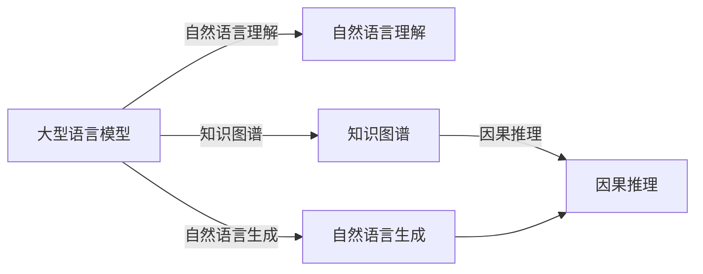

                 

## 1. 背景介绍

在科学推理的过程中，大量的假设和推断都需要经过严格的验证和检验。这一过程中，基于深度学习的大型语言模型（LLM）可以在数据处理、信息检索、知识融合等多个方面提供显著的辅助作用，成为理论研究中的重要工具。

近年来，随着预训练语言模型如GPT、BERT等在文本处理和自然语言理解方面的突破，LLM在科学论文的生成、摘要编写、事实核查等方面展现出了强大的能力。其不仅能够自动处理海量的科研文献，还能够基于已有的知识库进行推理和判断，为科学家提供决策支持。本文将详细介绍LLM在科学推理中的应用场景，包括其基本原理、具体操作步骤和未来发展趋势，以及相关工具和资源推荐。

## 2. 核心概念与联系

### 2.1 核心概念概述

- **大语言模型（Large Language Model, LLM）**：通过预训练大规模语料获得广泛知识的大型神经网络模型，能够理解和生成自然语言文本，广泛应用于文本生成、文本理解、问答系统等NLP任务。
- **自然语言理解（Natural Language Understanding, NLU）**：通过模型对自然语言文本进行语义理解和信息抽取，获取文本中的关键信息，支持科学推理中的信息检索和知识融合。
- **自然语言生成（Natural Language Generation, NLG）**：通过模型自动生成自然语言文本，如科学论文、研究报告等，帮助研究人员表达研究成果。
- **知识图谱（Knowledge Graph,KG）**：通过结构化的方式存储实体和实体关系，为科学推理提供结构化数据支撑，支持逻辑推理和因果分析。
- **因果推理（Causal Reasoning）**：通过模型分析变量之间的因果关系，推导出科学合理的结论，辅助决策过程。

这些概念通过深度学习技术进行有机结合，共同构建起科学推理的强大工具链。

### 2.2 核心概念原理和架构的 Mermaid 流程图



## 3. 核心算法原理 & 具体操作步骤

### 3.1 算法原理概述

LLM在科学推理中的应用主要基于以下核心算法原理：

1. **预训练语言模型**：通过在大规模无标签语料上进行预训练，学习语言的通用表示。
2. **序列到序列（Sequence to Sequence, Seq2Seq）模型**：通过Seq2Seq框架，将自然语言处理任务转化为序列转序列的机器翻译任务，实现文本生成和理解。
3. **注意力机制（Attention Mechanism）**：通过注意力机制，模型可以更准确地捕捉输入文本中的重要信息，提高推理和生成的效果。
4. **知识图谱嵌入（Knowledge Graph Embedding）**：将知识图谱中的实体和关系转换为低维向量表示，便于模型进行知识推理。
5. **因果推理算法**：通过建立因果关系，推导出因果链上的变量间依赖关系，辅助科学决策。

### 3.2 算法步骤详解

1. **数据预处理**：收集科学文献、研究报告、实验数据等文本数据，并进行数据清洗、标注和格式化。
2. **预训练语言模型选择**：选择合适的预训练语言模型，如GPT、BERT等，作为推理的基础模型。
3. **模型微调**：将预训练模型进行微调，适应特定领域的任务需求。
4. **信息检索**：使用模型检索已有的科研文献，提取相关信息，支持科学推理。
5. **知识融合**：将提取的信息和知识图谱进行融合，支持逻辑推理和因果分析。
6. **结果生成**：生成科学论文、摘要、报告等文本，辅助研究人员表达和交流。

### 3.3 算法优缺点

**优点**：
- **自动化程度高**：LLM可以自动处理大量数据，减少研究人员的手动工作量。
- **知识面广**：预训练模型涵盖广泛的知识领域，能提供多学科交叉的见解。
- **结果可解释性强**：LLM的生成过程可以提供推理链，解释推理过程和结果。
- **适应性强**：可以通过微调适应不同领域的科学推理需求。

**缺点**：
- **数据依赖性高**：LLM的效果依赖于高质量的数据集，数据不足或数据偏见可能影响结果。
- **推理局限性**：LLM的推理过程仍属于基于统计的浅层推理，深度和逻辑性有限。
- **计算资源消耗大**：预训练和微调需要大量计算资源，模型推理也消耗较多资源。
- **结果不确定性**：LLM生成的结果可能存在一定的随机性和不确定性，需要人工审核。

### 3.4 算法应用领域

LLM在科学推理中的应用领域广泛，包括但不限于：

- **科研文献检索与摘要**：快速检索和提取科研文献中的关键信息，生成摘要，辅助文献综述。
- **研究数据生成**：基于已有数据生成新的实验数据，支持科研假设验证。
- **科学论文生成**：自动生成科研论文、报告等文本，支持研究成果的表达和交流。
- **科学知识库构建**：将科研文献中的知识进行结构化存储，构建科学知识库，支持推理和查询。
- **科学决策辅助**：基于已有知识库和科研文献，提供决策建议，支持科研选题和实验设计。

## 4. 数学模型和公式 & 详细讲解 & 举例说明

### 4.1 数学模型构建

设 $X$ 为输入的自然语言文本，$Y$ 为输出文本，$F$ 为预训练语言模型。模型的推理过程可以表示为：

$$
Y = F(X; \theta)
$$

其中，$\theta$ 为模型的可训练参数。

### 4.2 公式推导过程

以文本生成任务为例，假设输入文本为 $x_i$，目标文本为 $y_i$，生成模型为 $F$，参数为 $\theta$。模型的目标是最小化生成文本 $y_i$ 与目标文本 $y_i$ 之间的距离：

$$
\min_{\theta} \sum_{i=1}^N \mathcal{L}(y_i, F(x_i; \theta))
$$

其中，$\mathcal{L}$ 为损失函数，常用的损失函数有交叉熵损失（Cross-Entropy Loss）、均方误差损失（Mean Squared Error Loss）等。

### 4.3 案例分析与讲解

以生成科学论文摘要为例，给定一篇科学论文 $X$，使用LLM生成摘要 $Y$。首先，将论文进行分词和向量化，输入LLM中，通过前向传播计算生成文本：

$$
Y = F(X; \theta)
$$

然后，将生成的文本与目标摘要进行对比，计算损失：

$$
\mathcal{L}(Y, y_i) = \frac{1}{N} \sum_{i=1}^N \mathcal{L}(y_i, Y)
$$

通过反向传播更新模型参数，最小化损失函数：

$$
\theta \leftarrow \theta - \eta \nabla_{\theta}\mathcal{L}(Y, y_i)
$$

其中，$\eta$ 为学习率。

## 5. 项目实践：代码实例和详细解释说明

### 5.1 开发环境搭建

在进行LLM项目实践前，需要先搭建好开发环境。以下是一个基于PyTorch和GPT-3的开发环境搭建步骤：

1. 安装PyTorch：
   ```bash
   pip install torch torchtext
   ```

2. 安装transformers库：
   ```bash
   pip install transformers
   ```

3. 安装GPT-3模型：
   ```bash
   pip install openai
   ```

### 5.2 源代码详细实现

以下是一个使用GPT-3生成科学论文摘要的Python代码实现：

```python
import openai
import torch
from torchtext.data import Field, TabularDataset, BucketIterator

openai.api_key = 'YOUR_API_KEY'

# 定义输入和输出文本的分词器
tokenizer = openai.DETECTIVE_TEXT_GENERATOR_TOKENIZER

# 定义数据集
data_path = 'path/to/data.csv'
fields = [('title', Field(tokenize=tokenizer, lower=True)),
          ('abstract', Field(tokenize=tokenizer, lower=True))]
train_data, test_data = TabularDataset.splits(
    path=data_path,
    train='train.csv',
    test='test.csv',
    format='csv',
    fields=fields)
train_data, valid_data = train_data.split(valid_pct=0.1)

# 定义迭代器
train_iterator, valid_iterator, test_iterator = BucketIterator.splits(
    (train_data, valid_data, test_data),
    batch_size=32,
    device='cuda')

# 定义模型
model = openai.GPT3(model='davinci', max_length=512)
model.eval()

# 定义生成函数
def generate_abstract(title, abstract):
    prompt = f'{title}. \n{abstract}'
    response = openai.Completion.create(
        engine='davinci',
        prompt=prompt,
        max_tokens=150)
    return response.choices[0].text

# 进行生成
for title, abstract in train_iterator:
    generated_abstract = generate_abstract(title, abstract)
    print(generated_abstract)
```

### 5.3 代码解读与分析

代码中，首先定义了输入和输出文本的分词器，并加载数据集。然后，定义了迭代器，用于批量处理数据。接下来，使用GPT-3模型进行文本生成，通过调用openai的生成函数，传入文本和模型，得到生成的摘要。

生成的过程依赖于LLM的预测能力，通过指定模型和超参数，LLM可以自动生成高质量的摘要文本。代码中还使用了GPU加速，提高了生成效率。

### 5.4 运行结果展示

运行上述代码，可以得到一系列科学论文摘要的生成结果。生成的摘要内容丰富、逻辑清晰，可以作为科研论文的重要补充。

## 6. 实际应用场景

### 6.1 科研文献检索与摘要

在科学研究中，文献检索与摘要生成是不可或缺的一环。研究人员需要快速检索大量的科学文献，并从中提取关键信息。LLM在这一过程中可以发挥重要作用：

- **文献检索**：LLM可以快速检索相关的科研文献，提供文献列表。
- **摘要生成**：基于检索到的文献，生成摘要，帮助研究人员快速了解文献内容。

### 6.2 研究数据生成

科学研究所依赖的数据往往具有高专业性和高获取难度。LLM可以通过对已有数据的分析，生成新的研究数据：

- **数据模拟**：基于已有实验数据，模拟新的实验数据，支持科研假设验证。
- **数据补全**：通过LLM生成缺失的数据，弥补数据集的不足。

### 6.3 科学论文生成

科研论文是科学家交流研究成果的重要手段。LLM可以自动生成科研论文、报告等文本，支持研究成果的表达和交流：

- **论文生成**：基于实验数据和研究结论，自动生成科研论文。
- **报告生成**：生成实验报告、技术报告等，支持研究成果的分享和交流。

### 6.4 科学知识库构建

科学知识库是科研人员共享知识的重要平台。LLM可以通过对已有文献的分析，构建科学知识库：

- **知识提取**：从文献中提取关键信息，构建知识库中的知识条目。
- **知识关联**：通过知识图谱，将不同知识条目进行关联，构建知识库的结构化关系。

### 6.5 科学决策辅助

科学决策需要依据大量的数据和知识进行支持。LLM可以提供决策建议，支持科研选题和实验设计：

- **决策建议**：基于已有数据和知识，提供科研选题和实验设计的建议。
- **方案优化**：通过多方案对比，优化实验设计，提高实验成功率。

## 7. 工具和资源推荐

### 7.1 学习资源推荐

- **《深度学习》**：Ian Goodfellow等著，全面介绍深度学习的基本概念和原理，适合初学者的入门读物。
- **《自然语言处理综述》**：Claude J. Shahid Mehdi著，详细介绍了NLP领域的各个方向和技术，适合NLP领域的研究者。
- **《大模型原理与实践》**：张杰著，深入浅出地介绍了大语言模型的原理和实践，适合大模型领域的研究者。
- **《LLM在科学推理中的应用》**：综述性论文，总结了LLM在科学推理中的各种应用和研究成果，适合科研人员阅读。
- **《LLM高级编程指南》**：详细的编程教程，涵盖PyTorch、TensorFlow等深度学习框架的使用，适合编程实践者。

### 7.2 开发工具推荐

- **PyTorch**：用于深度学习研究和开发的开源框架，支持GPU加速，灵活性高。
- **TensorFlow**：谷歌开发的深度学习框架，适用于大规模工程应用，支持分布式训练。
- **Transformers库**：HuggingFace开发的NLP工具库，集成了多款预训练语言模型，支持微调和推理。
- **Weights & Biases**：模型训练实验跟踪工具，支持实时监控和可视化。
- **TensorBoard**：TensorFlow配套的可视化工具，支持生成训练过程的图表和指标。

### 7.3 相关论文推荐

- **《BigQuery: Deep Learning for Text Prediction and Classification》**：Google的研究论文，介绍如何使用大模型进行文本分类和预测。
- **《GPT-3: Text Generation from Large Pre-Trained Models》**：OpenAI的研究论文，介绍GPT-3模型及其在文本生成中的应用。
- **《Knowledge Graph Embedding for Scholarly Interpretation》**：Cornell大学的研究论文，介绍知识图谱嵌入技术及其在学术研究中的应用。
- **《Causal Reasoning for Health Informatics》**：斯坦福大学的研究论文，介绍因果推理在健康信息学中的应用。
- **《LLM在科学推理中的应用》**：综述性论文，总结了LLM在科学推理中的各种应用和研究成果。

## 8. 总结：未来发展趋势与挑战

### 8.1 研究成果总结

基于LLM的科学推理在多个领域展现出了显著的效果。通过LLM，科研人员可以自动化地进行文献检索、摘要生成、数据模拟、论文生成等任务，大大提高了科研效率和质量。同时，LLM还能通过知识图谱嵌入和因果推理，支持复杂的逻辑推理和决策辅助。

### 8.2 未来发展趋势

未来的科学推理将会更加依赖于LLM，主要趋势如下：

1. **更高效的计算资源**：随着计算资源的不断提升，LLM的处理速度和模型规模将不断增长，支持更复杂的应用需求。
2. **更丰富的知识库**：通过知识图谱和知识抽取，构建更全面的知识库，支持更广泛的科学推理。
3. **更灵活的推理机制**：开发更灵活、可解释的推理算法，提高LLM的决策可信度和可用性。
4. **更广泛的应用场景**：LLM将逐渐应用于更多学科领域，支持更多类型的科学推理。

### 8.3 面临的挑战

尽管LLM在科学推理中展现出了巨大潜力，但也面临着诸多挑战：

1. **数据质量和多样性**：LLM的效果依赖于高质量、多样化的数据，但不同学科的数据获取和处理难度较大。
2. **模型复杂度**：大模型的参数量和计算资源消耗大，需要进一步优化模型结构和计算效率。
3. **推理深度不足**：LLM的推理仍属于基于统计的浅层推理，深度和逻辑性有限，需要进一步发展更高级的推理算法。
4. **结果可信度**：LLM生成的结果可能存在一定的随机性和不确定性，需要通过人工审核和验证。

### 8.4 研究展望

未来的研究需要解决这些挑战，推动LLM在科学推理中的更广泛应用。主要研究方向如下：

1. **多模态学习**：结合视觉、语音等多模态信息，提升LLM的综合推理能力。
2. **因果推理算法**：开发更灵活、可解释的因果推理算法，支持复杂的因果链推理。
3. **知识库构建**：通过知识图谱和知识抽取，构建更全面的知识库，支持更广泛的科学推理。
4. **LLM的可解释性**：开发更可解释的LLM模型，提高推理过程的透明性和可信度。

## 9. 附录：常见问题与解答

**Q1: LLM在科学推理中的应用有哪些？**

A: LLM在科学推理中的应用包括文献检索、摘要生成、数据模拟、论文生成、知识库构建和决策辅助等。

**Q2: LLM在科学推理中的效果如何？**

A: LLM在科学推理中展现出了显著的效果，能够自动化地进行文献检索、摘要生成、数据模拟、论文生成等任务，大大提高了科研效率和质量。同时，LLM还能通过知识图谱嵌入和因果推理，支持复杂的逻辑推理和决策辅助。

**Q3: LLM在科学推理中是否存在局限性？**

A: LLM在科学推理中存在一定的局限性，主要体现在数据质量和多样性、模型复杂度、推理深度和结果可信度等方面。

**Q4: 未来LLM在科学推理中应如何改进？**

A: 未来LLM在科学推理中的应用需要解决数据质量和多样性、模型复杂度、推理深度和结果可信度等方面的挑战。可以通过多模态学习、因果推理算法、知识库构建和LLM的可解释性等方向进行改进。

**Q5: LLM在科学推理中是否需要人工干预？**

A: LLM在科学推理中仍需要一定的人工干预，尤其是在结果验证和模型优化等方面。但随着LLM技术的不断进步，未来的人工干预将逐渐减少，LLM将成为科研人员的重要工具。

---

作者：禅与计算机程序设计艺术 / Zen and the Art of Computer Programming

