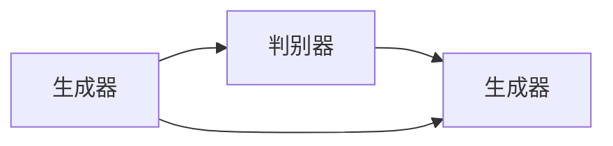

                 

# 生成对抗网络 (GAN) 原理与代码实例讲解

## 1. 背景介绍

### 1.1 问题由来
生成对抗网络（GANs, Generative Adversarial Networks）是近年来机器学习和计算机视觉领域的一个热点话题，主要用来生成逼真的图像、视频和音频等数据。GANs由两个神经网络组成：一个生成器（Generator）和一个判别器（Discriminator），它们相互博弈，生成器尝试生成尽可能逼真的数据，而判别器则尝试区分真实数据和生成的假数据。GANs的优势在于能够生成高质量的、多样化的数据，这在实际应用中具有巨大的潜力。

### 1.2 问题核心关键点
GANs的核心思想是通过两步训练过程：生成器和判别器之间的博弈。生成器（Generator）的目标是生成尽可能逼真的数据，而判别器（Discriminator）的目标是尽可能准确地判断输入数据是真实数据还是生成数据。GANs的训练过程是一种动态的博弈过程，需要不断迭代调整生成器和判别器的参数，以达到最终平衡。

## 2. 核心概念与联系

### 2.1 核心概念概述

为了更好地理解GANs的工作原理和训练过程，本节将介绍几个关键的概念：

- **生成器（Generator）**：负责生成假数据，如图像、音频等，通过神经网络进行学习，并尽量生成与真实数据难以区分的假数据。
- **判别器（Discriminator）**：负责判断输入数据是真实数据还是生成数据，通过神经网络进行学习，并尽量准确区分两种数据。
- **对抗损失（Adversarial Loss）**：生成器和判别器的目标函数，使得生成器生成的假数据尽可能逼真，而判别器尽可能准确地分辨真伪数据。
- **非对称训练**：生成器和判别器交替进行训练，生成器在判别器固定的情况下进行训练，判别器在生成器固定的情况下进行训练，这种非对称训练方式是GANs训练的核心。

这些概念之间的逻辑关系可以通过以下Mermaid流程图来展示：



这个流程图展示了GANs的基本结构：生成器和判别器相互博弈，通过非对称训练逐步优化生成器和判别器的参数。

## 3. 核心算法原理 & 具体操作步骤
### 3.1 算法原理概述

GANs的训练过程是一种动态的博弈过程，由生成器和判别器相互博弈，生成器生成假数据，判别器区分真伪数据，双方不断调整自身参数，以实现生成数据尽可能逼真，判别数据尽可能准确。

形式化地，假设生成器为 $G_{\theta_g}$，判别器为 $D_{\theta_d}$。生成器接收随机噪声 $\mathbf{z}$，生成样本 $\mathbf{x}_g=G_{\theta_g}(\mathbf{z})$，其中 $\mathbf{z} \sim \mathcal{N}(0,1)$。判别器接收真实数据 $\mathbf{x}_r$ 和生成的数据 $\mathbf{x}_g$，输出判别结果 $D_{\theta_d}(\mathbf{x})$，输出真实数据为1，生成数据为0。

GANs的训练目标函数可以定义为：

$$
\mathcal{L}(G,D) = \mathbb{E}_{\mathbf{x}_r \sim p_{data}} [\log D_{\theta_d}(\mathbf{x}_r)] + \mathbb{E}_{\mathbf{z} \sim p_z} [\log (1 - D_{\theta_d}(G_{\theta_g}(\mathbf{z})))]
$$

其中 $p_{data}$ 为真实数据的概率分布，$p_z$ 为随机噪声 $\mathbf{z}$ 的概率分布。目标函数是生成器和判别器损失的组合，生成器的目标是最大化生成数据的判别得分，判别器的目标是最大化对真实数据的判别得分和最小化对生成数据的判别得分。

### 3.2 算法步骤详解

GANs的训练过程包括生成器和判别器的交替训练：

**Step 1: 初始化生成器和判别器**

随机初始化生成器 $G_{\theta_g}$ 和判别器 $D_{\theta_d}$ 的参数，设置学习率 $\eta$，批大小 $m$。

**Step 2: 生成器训练**

在固定判别器参数 $D_{\theta_d}$ 的情况下，生成器 $G_{\theta_g}$ 通过随机噪声 $\mathbf{z}$ 生成数据 $\mathbf{x}_g$，输入判别器 $D_{\theta_d}$，计算生成数据的判别得分。

**Step 3: 判别器训练**

在固定生成器参数 $G_{\theta_g}$ 的情况下，判别器 $D_{\theta_d}$ 通过真实数据 $\mathbf{x}_r$ 和生成数据 $\mathbf{x}_g$，计算对真实数据和生成数据的判别得分。

**Step 4: 更新生成器和判别器参数**

根据生成器和判别器在当前批次上的判别得分，计算梯度，使用梯度下降等优化算法更新生成器和判别器的参数。

**Step 5: 重复训练**

重复以上步骤，直到满足预设的迭代轮数或达到收敛条件。

### 3.3 算法优缺点

GANs的优点在于能够生成高质量的、多样化的数据，同时训练过程相对简单，只需要固定一个网络进行训练即可。

然而，GANs也存在一些缺点：

- 训练不稳定：GANs的训练过程容易陷入不稳定的状态，导致生成器生成的数据质量下降，甚至出现“模式崩溃”（mode collapse）现象，即生成器只生成有限数量的模式。
- 计算资源消耗大：GANs的训练需要大量的计算资源，尤其是在生成高质量的数据时，计算资源消耗巨大。
- 判别器过于强大可能导致生成器无法逼真生成数据：如果判别器过于强大，生成器无法生成与真实数据难以区分的假数据，导致训练过程无法收敛。

尽管存在这些缺点，但GANs仍然在图像生成、音频生成、视频生成等领域取得了令人瞩目的成果，成为生成数据的有效工具。

### 3.4 算法应用领域

GANs已经在多个领域得到了广泛应用，例如：

- 图像生成：GANs可以生成逼真的图像，如人脸、景观、艺术作品等。
- 视频生成：GANs可以生成逼真的视频片段，如视频合成、动态图像生成等。
- 音频生成：GANs可以生成逼真的音频，如语音合成、音乐生成等。
- 图像风格转换：GANs可以将一张图像的风格转换成另一张图像的风格，如将素描图像转换成彩色图像。
- 数据增强：GANs可以生成新的数据，用于数据增强，提高模型的泛化能力。
- 图像修复：GANs可以对损坏的图像进行修复，如去噪、去模糊、填色等。

这些应用展示了GANs的强大生成能力，使得其在实际应用中具有广泛的前景。

## 4. 数学模型和公式 & 详细讲解 & 举例说明

### 4.1 数学模型构建

GANs的训练过程可以通过数学模型来描述。假设生成器 $G_{\theta_g}$ 接收随机噪声 $\mathbf{z}$，生成数据 $\mathbf{x}_g=G_{\theta_g}(\mathbf{z})$，其中 $\mathbf{z} \sim \mathcal{N}(0,1)$。判别器 $D_{\theta_d}$ 接收数据 $\mathbf{x}$，输出判别得分 $D_{\theta_d}(\mathbf{x})$，其中 $\mathbf{x} \in \mathbb{R}^n$。

生成器的目标是最小化生成数据的判别得分，即最大化 $\mathbb{E}_{\mathbf{z} \sim p_z} [D_{\theta_d}(G_{\theta_g}(\mathbf{z}))]$，判别器的目标是最小化对真实数据的判别得分，最大化对生成数据的判别得分，即最大化 $\mathbb{E}_{\mathbf{x}_r \sim p_{data}} [\log D_{\theta_d}(\mathbf{x}_r)]$ 和 $\mathbb{E}_{\mathbf{z} \sim p_z} [\log (1 - D_{\theta_d}(G_{\theta_g}(\mathbf{z})))]$。

### 4.2 公式推导过程

为了求解生成器和判别器的最优参数，我们引入交叉熵损失函数，将训练目标转化为优化问题：

$$
\min_{G_{\theta_g}} \max_{D_{\theta_d}} \mathcal{L}(G_{\theta_g}, D_{\theta_d})
$$

其中 $\mathcal{L}(G_{\theta_g}, D_{\theta_d})$ 定义为生成器和判别器的联合损失函数：

$$
\mathcal{L}(G_{\theta_g}, D_{\theta_d}) = \mathbb{E}_{\mathbf{x}_r \sim p_{data}} [\log D_{\theta_d}(\mathbf{x}_r)] + \mathbb{E}_{\mathbf{z} \sim p_z} [\log (1 - D_{\theta_d}(G_{\theta_g}(\mathbf{z})))
$$

定义生成器的参数更新公式为：

$$
G_{\theta_g} \leftarrow G_{\theta_g} - \eta \nabla_{\theta_g} \mathcal{L}(G_{\theta_g}, D_{\theta_d})
$$

定义判别器的参数更新公式为：

$$
D_{\theta_d} \leftarrow D_{\theta_d} - \eta \nabla_{\theta_d} \mathcal{L}(G_{\theta_g}, D_{\theta_d})
$$

其中 $\eta$ 为学习率，$\nabla_{\theta_g} \mathcal{L}(G_{\theta_g}, D_{\theta_d})$ 和 $\nabla_{\theta_d} \mathcal{L}(G_{\theta_g}, D_{\theta_d})$ 分别为生成器和判别器的梯度。

### 4.3 案例分析与讲解

以生成逼真的手写数字为例，通过GANs进行训练。首先，收集大规模的手写数字数据集，如MNIST，进行预处理。然后，定义生成器和判别器的神经网络结构，如使用卷积神经网络（CNN）进行生成和判别。

训练时，生成器接收随机噪声，生成手写数字图像，判别器接收图像，判断图像是真实数据还是生成数据。生成器和判别器的损失函数分别为交叉熵损失函数。通过交替更新生成器和判别器的参数，使得生成器生成的图像逼真度提高，判别器对真实数据和生成数据的区分能力增强。最终，生成器能够生成高质量的手写数字图像。

## 5. 项目实践：代码实例和详细解释说明
### 5.1 开发环境搭建

在进行GANs项目实践前，需要准备好开发环境。以下是使用Python进行PyTorch开发的Python环境配置流程：

1. 安装Anaconda：从官网下载并安装Anaconda，用于创建独立的Python环境。

2. 创建并激活虚拟环境：
```bash
conda create -n pytorch-env python=3.8 
conda activate pytorch-env
```

3. 安装PyTorch：根据CUDA版本，从官网获取对应的安装命令。例如：
```bash
conda install pytorch torchvision torchaudio cudatoolkit=11.1 -c pytorch -c conda-forge
```

4. 安装TensorFlow：
```bash
pip install tensorflow
```

5. 安装各类工具包：
```bash
pip install numpy pandas scikit-learn matplotlib tqdm jupyter notebook ipython
```

完成上述步骤后，即可在`pytorch-env`环境中开始GANs项目实践。

### 5.2 源代码详细实现

这里我们以手写数字图像生成为例，给出使用PyTorch进行GANs训练的完整代码实现。

首先，定义生成器和判别器的神经网络结构：

```python
import torch
import torch.nn as nn
import torch.optim as optim
import torchvision
import torchvision.transforms as transforms

# 定义生成器
class Generator(nn.Module):
    def __init__(self):
        super(Generator, self).__init__()
        self.fc1 = nn.Linear(100, 128)
        self.fc2 = nn.Linear(128, 28*28)
        self.deconv1 = nn.ConvTranspose2d(128, 128, kernel_size=4, stride=2, padding=1)
        self.deconv2 = nn.ConvTranspose2d(128, 64, kernel_size=4, stride=2, padding=1)
        self.deconv3 = nn.ConvTranspose2d(64, 1, kernel_size=4, stride=2, padding=1)

    def forward(self, x):
        x = self.fc1(x)
        x = self.fc2(x).view(-1, 128, 1, 1)
        x = self.deconv1(x)
        x = self.deconv2(x)
        x = torch.tanh(self.deconv3(x))
        return x

# 定义判别器
class Discriminator(nn.Module):
    def __init__(self):
        super(Discriminator, self).__init__()
        self.conv1 = nn.Conv2d(1, 64, kernel_size=4, stride=2, padding=1)
        self.conv2 = nn.Conv2d(64, 128, kernel_size=4, stride=2, padding=1)
        self.fc1 = nn.Linear(128*7*7, 128)
        self.fc2 = nn.Linear(128, 1)

    def forward(self, x):
        x = self.conv1(x)
        x = self.conv2(x)
        x = x.view(-1, 128*7*7)
        x = self.fc1(x)
        x = torch.sigmoid(self.fc2(x))
        return x
```

然后，定义数据加载函数和损失函数：

```python
# 定义数据加载函数
def load_data(batch_size):
    transform = transforms.Compose([
        transforms.ToTensor(),
        transforms.Normalize((0.5,), (0.5,))
    ])
    trainset = torchvision.datasets.MNIST(root='./data', train=True, transform=transform, download=True)
    trainloader = torch.utils.data.DataLoader(trainset, batch_size=batch_size, shuffle=True)
    return trainloader

# 定义损失函数
criterion = nn.BCELoss()

# 定义优化器
G_optimizer = optim.Adam(G.parameters(), lr=0.001)
D_optimizer = optim.Adam(D.parameters(), lr=0.001)
```

接着，定义训练和评估函数：

```python
# 定义训练函数
def train_model(model, trainloader, num_epochs):
    G = Generator()
    D = Discriminator()
    G_optimizer = optim.Adam(G.parameters(), lr=0.001)
    D_optimizer = optim.Adam(D.parameters(), lr=0.001)
    criterion = nn.BCELoss()
    for epoch in range(num_epochs):
        for i, (images, _) in enumerate(trainloader):
            # 定义输入的随机噪声
            z = torch.randn(batch_size, 100)
            # 生成器接收噪声，生成假数据
            fake_images = G(z)
            # 判别器接收真数据和假数据，计算判别得分
            real_images = images.view(batch_size, -1)
            real_output = D(real_images)
            fake_output = D(fake_images)
            # 计算生成器损失
            G_loss = criterion(fake_output, torch.ones(batch_size, 1))
            # 计算判别器损失
            D_loss_real = criterion(real_output, torch.ones(batch_size, 1))
            D_loss_fake = criterion(fake_output, torch.zeros(batch_size, 1))
            D_loss = D_loss_real + D_loss_fake
            # 更新生成器和判别器的参数
            G_optimizer.zero_grad()
            G_loss.backward()
            G_optimizer.step()
            D_optimizer.zero_grad()
            D_loss.backward()
            D_optimizer.step()
            # 每50次迭代输出一次损失
            if i % 50 == 0:
                print(f"Epoch {epoch+1}, Step {i+1}, G_loss: {G_loss.item()}, D_loss: {D_loss.item()}")
    return G, D

# 定义评估函数
def evaluate_model(model, testloader):
    G = Generator()
    D = Discriminator()
    with torch.no_grad():
        for i, (images, _) in enumerate(testloader):
            z = torch.randn(batch_size, 100)
            fake_images = G(z)
            fake_output = D(fake_images)
            print(f"Step {i+1}, G_output: {fake_output.item()}")
```

最后，启动训练流程并在测试集上评估：

```python
# 加载数据集
trainloader = load_data(64)
testloader = load_data(64)
# 训练模型
G, D = train_model(G, trainloader, 100)
# 评估模型
evaluate_model(G, testloader)
```

以上就是使用PyTorch对GANs进行手写数字图像生成训练的完整代码实现。可以看到，利用PyTorch框架，代码实现简洁高效。

### 5.3 代码解读与分析

让我们再详细解读一下关键代码的实现细节：

**Generator类**：
- `__init__`方法：定义生成器的神经网络结构，包括线性层和卷积层。
- `forward`方法：接收随机噪声，生成假图像，经过多个卷积层和全连接层，最终生成与真实图像大小相同的图像。

**Discriminator类**：
- `__init__`方法：定义判别器的神经网络结构，包括卷积层和全连接层。
- `forward`方法：接收真实图像和假图像，经过多个卷积层和全连接层，最终输出判别得分。

**train_model函数**：
- 定义生成器和判别器的参数和优化器，设置交叉熵损失函数。
- 在每个epoch内，对随机噪声和真图像进行前向传播，计算生成器和判别器的损失，并使用优化器更新参数。
- 每50次迭代输出一次生成器和判别器的损失，进行监控。

**evaluate_model函数**：
- 接收测试集数据，生成随机噪声，生成假图像，进行判别器前向传播，输出判别得分。
- 打印生成的假图像的判别得分，用于评估生成器的性能。

**train_model函数**：
- 定义生成器和判别器的参数和优化器，设置交叉熵损失函数。
- 在每个epoch内，对随机噪声和真图像进行前向传播，计算生成器和判别器的损失，并使用优化器更新参数。
- 每50次迭代输出一次生成器和判别器的损失，进行监控。

可以看到，PyTorch框架提供了便捷的神经网络构建和训练功能，使得GANs的代码实现更加简洁高效。开发者可以专注于模型结构和优化策略的优化，而不必过多关注底层的实现细节。

## 6. 实际应用场景
### 6.1 图像生成

GANs可以用于生成逼真的图像，如人脸、景观、艺术作品等。在实际应用中，GANs可以生成高质量的图像，用于图像补全、图像修复、图像风格转换等任务。例如，GANs可以将一张图像的风格转换成另一张图像的风格，如图像风格的迁移和转换，生成艺术风格的图像，或者将素描图像转换成彩色图像。

### 6.2 视频生成

GANs可以用于生成逼真的视频，如视频合成、动态图像生成等。在实际应用中，GANs可以生成高质量的视频，用于视频补全、视频生成、视频编辑等任务。例如，GANs可以将一段不完整的视频片段补全，或者生成一个新的视频片段。

### 6.3 音频生成

GANs可以用于生成逼真的音频，如语音合成、音乐生成等。在实际应用中，GANs可以生成高质量的音频，用于音频补全、音频生成、音频编辑等任务。例如，GANs可以将一段不完整的音频片段补全，或者生成一个新的音频片段。

### 6.4 数据增强

GANs可以用于生成新的数据，用于数据增强，提高模型的泛化能力。在实际应用中，GANs可以生成高质量的数据，用于数据增强，提高模型的泛化能力。例如，GANs可以生成新的图像数据，用于训练图像分类模型，或者生成新的文本数据，用于训练文本分类模型。

### 6.5 图像修复

GANs可以用于图像修复，如去噪、去模糊、填色等。在实际应用中，GANs可以生成高质量的图像，用于图像修复，提高图像质量。例如，GANs可以用于图像去噪，将模糊的图像变得更加清晰，或者将图像中的缺失部分进行修复。

### 6.6 未来应用展望

随着GANs技术的不断发展，其在图像生成、视频生成、音频生成、数据增强、图像修复等领域的应用前景将更加广阔。未来，GANs还将与更多领域的技术进行深度融合，如自动驾驶、医疗、金融等，带来新的突破。

GANs在自动驾驶领域可以用于生成逼真的道路场景，帮助自动驾驶系统进行训练和测试；在医疗领域可以用于生成逼真的医学图像，帮助医生进行诊断和治疗；在金融领域可以用于生成逼真的交易数据，帮助研究人员进行模拟和预测。

总之，GANs技术的不断发展将带来更多应用场景，推动其在更多领域实现落地，为人类社会带来更加深远的影响。

## 7. 工具和资源推荐
### 7.1 学习资源推荐

为了帮助开发者系统掌握GANs的理论基础和实践技巧，这里推荐一些优质的学习资源：

1. 《Generative Adversarial Networks: Training GANs with Python》书籍：介绍了GANs的基本原理、算法和实现细节，是学习GANs的重要参考书籍。
2. CS231n《卷积神经网络》课程：斯坦福大学开设的计算机视觉课程，包括GANs的应用和实践。
3. DeepLearning.AI《深度学习专项课程》：由Andrew Ng等专家授课，包括GANs的理论和实践。
4. PyTorch官方文档：PyTorch框架的官方文档，提供了丰富的GANs实现代码和示例。
5. Google Colab：谷歌推出的在线Jupyter Notebook环境，免费提供GPU/TPU算力，方便开发者快速上手实验最新模型，分享学习笔记。

通过对这些资源的学习实践，相信你一定能够快速掌握GANs的精髓，并用于解决实际的图像生成、视频生成、音频生成等问题。

### 7.2 开发工具推荐

高效的开发离不开优秀的工具支持。以下是几款用于GANs开发的常用工具：

1. PyTorch：基于Python的开源深度学习框架，灵活动态的计算图，适合快速迭代研究。
2. TensorFlow：由Google主导开发的开源深度学习框架，生产部署方便，适合大规模工程应用。
3. Keras：基于Python的高层深度学习框架，提供了丰富的API和示例，适合初学者使用。
4. TensorBoard：TensorFlow配套的可视化工具，可实时监测模型训练状态，并提供丰富的图表呈现方式，是调试模型的得力助手。
5. Weights & Biases：模型训练的实验跟踪工具，可以记录和可视化模型训练过程中的各项指标，方便对比和调优。

合理利用这些工具，可以显著提升GANs的开发效率，加快创新迭代的步伐。

### 7.3 相关论文推荐

GANs在近年来得到了广泛的研究，以下是几篇具有代表性的相关论文，推荐阅读：

1. Generative Adversarial Nets：由Ian Goodfellow等专家提出的原始GANs论文，定义了GANs的基本框架。
2. Deep Generative Adversarial Nets：由Ian Goodfellow等专家提出的改进GANs论文，提出了更加稳定的训练方法。
3. Unsupervised Representation Learning with Deep Convolutional Generative Adversarial Networks：由Shaoqing Ren等专家提出的将GANs应用于图像分类任务的论文，展示了GANs的强大能力。
4. Improved Training of Wasserstein GANs：由Martin Arjovsky等专家提出的改进GANs论文，提出了更加稳定的训练方法。
5. Progressive Growing of GANs for Improved Quality, Stability, and Variation：由Tinghui Zhou等专家提出的改进GANs论文，提出了更加稳定的训练方法。

这些论文代表了大GANs的发展脉络。通过学习这些前沿成果，可以帮助研究者把握学科前进方向，激发更多的创新灵感。

## 8. 总结：未来发展趋势与挑战
### 8.1 总结

本文对生成对抗网络（GANs）的原理和代码实例进行了全面系统的介绍。首先阐述了GANs的基本概念和训练过程，明确了GANs在图像生成、视频生成、音频生成等领域的潜在应用。其次，从原理到实践，详细讲解了GANs的数学模型和训练步骤，给出了GANs训练的完整代码实例。同时，本文还广泛探讨了GANs在实际应用中的各种场景，展示了GANs的强大生成能力。

通过本文的系统梳理，可以看到，GANs技术在生成高质量的图像、视频、音频等方面具有巨大的潜力，是当前深度学习领域的热点技术。

### 8.2 未来发展趋势

展望未来，GANs技术将呈现以下几个发展趋势：

1. 模型的多样性和个性化：未来的GANs将不仅限于生成静态图像，还会生成更加多样化和个性化的动态数据，如视频、音频等。
2. 训练过程的稳定性：未来的GANs将采用更加稳定和高效的训练方法，如自适应学习率、对抗样本训练等，提升模型的稳定性和生成质量。
3. 应用场景的扩展：未来的GANs将在更多领域得到应用，如自动驾驶、医疗、金融等，带来新的突破。
4. 多模态数据的融合：未来的GANs将能够融合多种模态的数据，生成更加全面和逼真的数据。
5. 知识图谱的整合：未来的GANs将能够整合知识图谱中的先验知识，生成更加准确和合理的数据。

以上趋势凸显了GANs技术的广阔前景。这些方向的探索发展，必将进一步提升GANs的生成能力和应用范围，为人工智能技术带来新的突破。

### 8.3 面临的挑战

尽管GANs技术在图像生成、视频生成、音频生成等领域取得了令人瞩目的成果，但在迈向更加智能化、普适化应用的过程中，它仍面临着诸多挑战：

1. 训练过程的不稳定性：GANs的训练过程容易陷入不稳定的状态，导致生成器生成的数据质量下降，甚至出现“模式崩溃”（mode collapse）现象，即生成器只生成有限数量的模式。
2. 计算资源消耗大：GANs的训练需要大量的计算资源，尤其是在生成高质量的数据时，计算资源消耗巨大。
3. 判别器过于强大可能导致生成器无法逼真生成数据：如果判别器过于强大，生成器无法生成与真实数据难以区分的假数据，导致训练过程无法收敛。
4. 模型的可解释性不足：GANs模型的内部工作机制和决策逻辑难以解释，对于医疗、金融等高风险应用，算法的可解释性和可审计性尤为重要。
5. 安全性有待保障：GANs模型容易生成有害的生成数据，如何过滤和防止有害数据的生成，确保输出的安全性，将是重要的研究方向。

尽管存在这些挑战，但随着学界和产业界的共同努力，GANs技术仍将在未来继续发展，克服这些挑战，带来更多创新突破。

### 8.4 研究展望

未来，GANs技术的研究方向可以包括以下几个方面：

1. 探索更加高效的训练方法：研究更加稳定和高效的GANs训练方法，如自适应学习率、对抗样本训练等，提升模型的稳定性和生成质量。
2. 研究更加多样化和个性化的生成方法：研究能够生成更加多样化和个性化的GANs模型，如多模态GANs、条件GANs等，适应更多应用场景。
3. 研究更加可解释的GANs模型：研究能够提供更强的可解释性和可审计性的GANs模型，如使用因果分析方法、博弈论工具等，提高系统可解释性。
4. 研究更加安全可靠的GANs模型：研究能够过滤和防止有害数据生成的GANs模型，如使用对抗样本训练、知识图谱整合等，提高系统安全性。
5. 研究更加普适化的GANs模型：研究能够适应更多应用场景的GANs模型，如自适应GANs、迁移学习GANs等，提升模型泛化能力。

这些研究方向将推动GANs技术迈向更高的台阶，为人工智能技术带来更多的创新和突破。

## 9. 附录：常见问题与解答

**Q1: GANs训练不稳定怎么办？**

A: 训练不稳定是GANs面临的主要问题之一。以下是一些解决GANs训练不稳定问题的方法：

1. 使用改进的GANs模型：如使用改进的WGAN（Wasserstein GAN）、Improved WGAN（Improved WGAN）、AC-GAN（Adversarial Conditional GAN）等模型，这些模型具有更好的稳定性。
2. 使用更先进的训练技巧：如使用对抗样本训练、梯度惩罚、自适应学习率等技巧，这些技巧可以提升GANs的稳定性。
3. 使用数据增强：通过数据增强技术，扩充训练数据集，提升模型的泛化能力。

**Q2: GANs生成的图像质量不高怎么办？**

A: 生成的图像质量不高是GANs面临的主要问题之一。以下是一些提升GANs图像生成质量的方法：

1. 使用更高级的生成器模型：如使用ResNet、Inception等高级生成器模型，这些模型具有更好的生成能力。
2. 使用更先进的训练技巧：如使用对抗样本训练、梯度惩罚、自适应学习率等技巧，这些技巧可以提升GANs的生成质量。
3. 使用更好的优化器：如使用AdamW、Adafactor等优化器，这些优化器可以提升GANs的训练效率和生成质量。

**Q3: GANs计算资源消耗大怎么办？**

A: 计算资源消耗大是GANs面临的主要问题之一。以下是一些优化GANs计算资源消耗的方法：

1. 使用更高效的生成器模型：如使用ResNet、Inception等高级生成器模型，这些模型具有更好的生成能力，同时也更加高效。
2. 使用更高级的训练技巧：如使用对抗样本训练、梯度惩罚、自适应学习率等技巧，这些技巧可以提升GANs的训练效率和生成质量。
3. 使用更高级的优化器：如使用AdamW、Adafactor等优化器，这些优化器可以提升GANs的训练效率和生成质量。

**Q4: GANs生成的图像模式单一怎么办？**

A: GANs生成的图像模式单一是GANs面临的主要问题之一。以下是一些解决GANs生成图像模式单一问题的方法：

1. 使用多模态GANs：通过融合多种模态的数据，生成更加多样化的图像。
2. 使用条件GANs：通过引入条件变量，引导GANs生成更加多样化的图像。
3. 使用多尺度GANs：通过使用多尺度生成器，生成更加多样化的图像。

**Q5: GANs生成的图像质量不稳定怎么办？**

A: GANs生成的图像质量不稳定是GANs面临的主要问题之一。以下是一些解决GANs生成图像质量不稳定问题的方法：

1. 使用改进的GANs模型：如使用改进的WGAN（Wasserstein GAN）、Improved WGAN（Improved WGAN）、AC-GAN（Adversarial Conditional GAN）等模型，这些模型具有更好的稳定性。
2. 使用更先进的训练技巧：如使用对抗样本训练、梯度惩罚、自适应学习率等技巧，这些技巧可以提升GANs的稳定性。
3. 使用更好的优化器：如使用AdamW、Adafactor等优化器，这些优化器可以提升GANs的训练效率和生成质量。

通过本文的系统梳理，可以看到，GANs技术在生成高质量的图像、视频、音频等方面具有巨大的潜力，是当前深度学习领域的热点技术。未来，随着GANs技术的不断发展，其在更多领域的应用前景将更加广阔。

