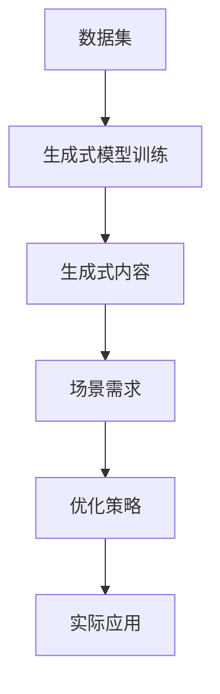

                 

## 1. 背景介绍

在AI技术的飞速发展下，生成式AIGC（人工智能生成内容）技术已经成为互联网领域的一股新趋势。从文本生成到图像生成，从语音生成到视频生成，AIGC的应用场景不断扩展，其潜在价值也在不断增加。但与此同时，人们对于AIGC的质疑声也不绝于耳。**“生成式AIGC是金矿还是泡沫”** 已经成为当前科技界的一个热门话题。

本文将从场景优先、数据为王的视角，探讨AIGC技术在实际应用中的落地情况，并对其未来发展趋势进行前瞻。

## 2. 核心概念与联系

### 2.1 核心概念概述

在讨论AIGC之前，我们先简要概述几个关键概念：

- **AIGC（AI生成的内容）**：指的是利用人工智能技术生成的小说、图片、音乐、视频等内容，在创意、娱乐、教育等多个领域有着广泛的应用。
- **生成式模型（Generative Models）**：通过学习数据分布，能够生成新的数据样本的深度学习模型，例如GANs（生成对抗网络）、VAEs（变分自编码器）等。
- **场景驱动（Scene-Driven）**：在应用AIGC技术时，应当首先考虑其适用的场景，然后围绕场景需求构建模型，确保生成内容的高相关性和实用性。
- **数据驱动（Data-Driven）**：生成式AIGC技术的核心在于数据。只有通过大量的标注数据训练出的模型，才能生成高质量的内容。

这些概念之间相互关联，共同构成了AIGC技术的基本框架。

### 2.2 核心概念原理和架构的 Mermaid 流程图



这个流程图展示了AIGC技术的基本流程：首先收集并标注数据集，然后训练生成式模型，再根据具体场景需求优化模型生成内容，最后应用到实际场景中。

## 3. 核心算法原理 & 具体操作步骤

### 3.1 算法原理概述

AIGC技术的核心在于生成式模型，其主要原理是利用训练好的模型，根据输入的噪声或随机向量，生成具有统计分布的输出。常见的生成式模型包括GANs、VAEs、自回归模型等。这些模型通过学习数据分布，能够在给定一定概率的情况下，生成新的数据样本。

### 3.2 算法步骤详解

AIGC的生成过程主要包括以下几个步骤：

1. **数据收集和预处理**：
   - 收集与场景相关的数据集。
   - 对数据进行清洗、标注和预处理。

2. **生成式模型训练**：
   - 选择合适的生成式模型，如GAN、VAE等。
   - 使用训练好的模型对数据进行拟合。

3. **生成内容**：
   - 根据场景需求，设计输入噪声或随机向量。
   - 将噪声或向量输入生成式模型，生成新的内容。

4. **后处理和优化**：
   - 对生成的内容进行后处理，如去噪、增强、优化等。
   - 根据场景需求对内容进行调整和优化。

5. **应用部署**：
   - 将生成式模型集成到实际应用中。
   - 根据用户反馈进行模型优化和改进。

### 3.3 算法优缺点

AIGC技术有以下优点：

- **高效生成内容**：能够快速生成大量高质量的内容，节省人力成本。
- **丰富应用场景**：广泛应用于创意写作、游戏、虚拟现实、教育等多个领域。
- **个性化定制**：能够根据用户需求生成个性化内容，提高用户体验。

但同时，也存在一些缺点：

- **依赖大量数据**：需要大量的标注数据进行训练，数据获取和标注成本较高。
- **模型复杂性高**：生成式模型的训练和优化需要较高的计算资源和算法知识。
- **内容质量不稳定**：生成的内容质量受限于训练数据的质量和模型设计。

### 3.4 算法应用领域

AIGC技术在以下几个领域有着广泛的应用：

1. **创意写作和文学创作**：
   - 小说生成器：根据用户输入的主题或关键字，生成相应的小说。
   - 诗歌生成器：生成符合特定风格和格律的诗歌。

2. **游戏和虚拟现实**：
   - 游戏角色生成：根据用户需求生成具有不同特性和个性的游戏角色。
   - 虚拟现实场景：生成虚拟现实场景和物品，增强用户体验。

3. **教育**：
   - 教育资源生成：生成学习材料、习题等，帮助学生学习和理解知识。
   - 智能辅导：根据学生学习情况，生成个性化的辅导内容。

4. **广告和营销**：
   - 广告创意生成：根据品牌需求，生成创意广告文案和图像。
   - 营销策略生成：生成营销策略和方案，提高营销效果。

5. **娱乐和媒体**：
   - 视频和音频生成：根据剧本和主题，生成相应的视频和音频内容。
   - 音乐生成：生成符合用户偏好的音乐风格和旋律。

## 4. 数学模型和公式 & 详细讲解 & 举例说明

### 4.1 数学模型构建

在AIGC中，常用的数学模型包括GANs、VAEs等生成式模型。这里以VAE为例，介绍其基本原理和构建方法。

VAE（变分自编码器）是一种生成式模型，通过学习数据的潜在分布，可以生成新的数据样本。其数学模型定义如下：

$$
p(z) = N(\mu_z,\sigma_z^2)
$$
$$
p(x|z) = N(\mu_x(z),\sigma_x^2(z))
$$

其中，$z$ 为潜在变量，$\mu_z$ 和 $\sigma_z$ 为潜在变量的均值和方差，$x$ 为输入数据，$\mu_x(z)$ 和 $\sigma_x(z)$ 为条件均值和方差。

### 4.2 公式推导过程

VAE的推导过程涉及多个步骤，这里简要介绍其关键部分。

1. **变分推断**：
   - 通过变分推断，将复杂分布$p(x,z)$ 近似为简单分布$q(z|x)$ 的变分形式。

2. **优化目标**：
   - 最小化变分推断的KL散度，使得$q(z|x)$ 与$p(x,z)$ 尽可能接近。

3. **生成过程**：
   - 通过给定随机向量$z$，生成数据$x$。

### 4.3 案例分析与讲解

以图片生成为例，VAE能够通过学习图片的潜在分布，生成新的图片。具体实现步骤如下：

1. **数据准备**：
   - 收集大量高质量的图片数据集。
   - 对图片进行预处理和标注。

2. **模型训练**：
   - 构建VAE模型，包括编码器和解码器。
   - 使用训练好的模型对图片数据进行拟合。

3. **生成图片**：
   - 随机生成一个潜在变量$z$。
   - 将$z$ 输入解码器，生成图片样本$x$。

4. **后处理**：
   - 对生成的图片进行去噪、增强等后处理，提高图片质量。

## 5. 项目实践：代码实例和详细解释说明

### 5.1 开发环境搭建

以下是使用Python和TensorFlow搭建AIGC开发环境的步骤：

1. 安装Anaconda：
```bash
conda create -n aigc-env python=3.8
conda activate aigc-env
```

2. 安装TensorFlow：
```bash
pip install tensorflow==2.6
```

3. 安装其他依赖库：
```bash
pip install numpy scipy matplotlib scikit-learn jupyter notebook ipython
```

### 5.2 源代码详细实现

以下是一个基于VAE的图片生成器的示例代码：

```python
import tensorflow as tf
import numpy as np
import matplotlib.pyplot as plt

class VAE(tf.keras.Model):
    def __init__(self, latent_dim):
        super(VAE, self).__init__()
        self.latent_dim = latent_dim
        self.encoder = tf.keras.Sequential([
            tf.keras.layers.InputLayer(input_shape=(28, 28)),
            tf.keras.layers.Conv2D(32, 3, activation='relu'),
            tf.keras.layers.MaxPooling2D(pool_size=(2, 2)),
            tf.keras.layers.Conv2D(64, 3, activation='relu'),
            tf.keras.layers.MaxPooling2D(pool_size=(2, 2)),
            tf.keras.layers.Flatten(),
            tf.keras.layers.Dense(128, activation='relu'),
            tf.keras.layers.Dense(latent_dim)
        ])
        self.decoder = tf.keras.Sequential([
            tf.keras.layers.InputLayer(input_shape=(latent_dim,)),
            tf.keras.layers.Dense(128, activation='relu'),
            tf.keras.layers.Dense(7*7*64, activation='relu'),
            tf.keras.layers.Reshape(target_shape=(7, 7, 64)),
            tf.keras.layers.Conv2DTranspose(64, 3, activation='relu'),
            tf.keras.layers.Conv2DTranspose(32, 3, activation='relu'),
            tf.keras.layers.Conv2DTranspose(1, 3, activation='sigmoid')
        ])

    def encode(self, x):
        mean, logvar = tf.split(self.encoder(x), 2, axis=-1)
        return mean, logvar

    def reparameterize(self, mean, logvar):
        epsilon = tf.random.normal(shape=(tf.shape(mean)[0], self.latent_dim))
        return mean + tf.exp(0.5 * logvar) * epsilon

    def decode(self, z):
        return self.decoder(z)

    def sample(self, mean, logvar):
        z = self.reparameterize(mean, logvar)
        img = self.decode(z)
        return img

    def call(self, x):
        mean, logvar = self.encode(x)
        img = self.sample(mean, logvar)
        return img

# 构建VAE模型
model = VAE(latent_dim=32)

# 训练VAE模型
learning_rate = 0.001
batch_size = 64
epochs = 50
optimizer = tf.keras.optimizers.Adam(learning_rate)

def loss_function(recon_x, x):
    mse_loss = tf.reduce_mean(tf.square(x - recon_x))
    kl_loss = -0.5 * tf.reduce_mean(1 + logvar - tf.square(mean) - tf.exp(logvar))
    return mse_loss + kl_loss

def train_step(x):
    with tf.GradientTape() as tape:
        recon_x = model(x)
        loss = loss_function(recon_x, x)
    gradients = tape.gradient(loss, model.trainable_variables)
    optimizer.apply_gradients(zip(gradients, model.trainable_variables))
    return loss

# 训练循环
for epoch in range(epochs):
    for batch in train_dataset:
        x, y = batch
        loss = train_step(x)
        if epoch % 10 == 0:
            print(f'Epoch: {epoch+1}, Loss: {loss:.4f}')

# 生成图片
latent_space = tf.random.normal(shape=(latent_dim, 1))
generated_images = model(latent_space)
plt.imshow(generated_images[0])
plt.show()
```

### 5.3 代码解读与分析

该代码实现了一个基于VAE的图片生成器。关键步骤如下：

1. **定义VAE模型**：
   - 构建编码器和解码器。
   - 定义重参数化函数，实现随机采样。

2. **训练模型**：
   - 定义损失函数，包括均方误差损失和KL散度损失。
   - 使用Adam优化器，进行模型训练。

3. **生成图片**：
   - 随机生成潜在变量，通过解码器生成图片。
   - 使用matplotlib展示生成的图片。

## 6. 实际应用场景

### 6.1 娱乐与媒体

在娱乐与媒体领域，AIGC技术可以生成各种形式的内容，如音乐、电影、动画等。例如，Netflix使用AIGC技术生成动画短片，吸引了大量观众的注意。Google的DeepMind公司也在利用AIGC技术生成音乐，创作符合用户偏好的音乐作品。

### 6.2 创意写作与文学创作

AIGC技术在创意写作和文学创作领域有着广泛的应用。例如，OpenAI的GPT-3模型能够生成高质量的小说、诗歌和文章。其生成的内容在情感表达、情节设计等方面都表现出色，成为了许多创作者的重要工具。

### 6.3 教育

在教育领域，AIGC技术可以生成个性化的学习材料和课程。例如，Khan Academy使用AIGC技术生成数学题目和答案，帮助学生理解和掌握数学知识。同时，AIGC技术还可以生成教育视频和虚拟现实场景，增强学习体验。

### 6.4 未来应用展望

未来，AIGC技术将在更多的领域得到应用，带来更广泛的影响：

1. **虚拟现实**：
   - 生成虚拟现实场景和物品，增强用户体验。

2. **医疗**：
   - 生成医疗图像和报告，辅助医生诊断和治疗。

3. **金融**：
   - 生成金融报告和分析，帮助投资者做出决策。

4. **广告**：
   - 生成广告素材和创意，提高广告效果。

5. **客服**：
   - 生成智能客服对话，提升客户服务体验。

6. **游戏**：
   - 生成游戏角色和场景，增强游戏体验。

## 7. 工具和资源推荐

### 7.1 学习资源推荐

为了系统掌握AIGC技术，推荐以下学习资源：

1. **Coursera《Deep Learning Specialization》**：由Andrew Ng教授开设，涵盖了深度学习的基础和高级内容，包括生成式模型等。

2. **Udacity《Deep Learning Nanodegree》**：涵盖了深度学习、生成式模型等多个方面，适合初学者入门。

3. **《Deep Generative Models and Applications》书籍**：介绍了各种生成式模型及其应用，包括GAN、VAE等。

4. **《Generative Adversarial Networks: An Overview》论文**：介绍了GAN的基本原理和应用。

5. **arXiv.org**：最新的生成式模型和算法研究，前沿进展不断。

### 7.2 开发工具推荐

以下是一些常用的AIGC开发工具：

1. **TensorFlow**：开源深度学习框架，支持各种生成式模型的实现。

2. **PyTorch**：另一个流行的深度学习框架，灵活易用。

3. **Keras**：高层深度学习框架，支持快速搭建和训练模型。

4. **Jax**：高性能计算库，支持自动微分和分布式训练。

5. **Colab**：Google提供的免费Jupyter Notebook环境，适合学习和实验。

### 7.3 相关论文推荐

以下是一些重要的AIGC相关论文，推荐阅读：

1. **《Generative Adversarial Nets》**：Ioannidis等，提出GAN的基本原理。

2. **《Variational Autoencoders》**：Kingma等，提出VAE的基本原理。

3. **《The Unreasonable Effectiveness of Transfer Learning》**：Weiss等，探讨了转移学习的有效性。

4. **《Language Models are Unsupervised Multitask Learners》**：Zaremba等，介绍了语言模型在多任务学习中的作用。

## 8. 总结：未来发展趋势与挑战

### 8.1 研究成果总结

本文从场景优先、数据为王的视角，探讨了AIGC技术的落地应用。AIGC技术在多个领域都有着广泛的应用，未来前景广阔。

### 8.2 未来发展趋势

未来，AIGC技术将继续发展，并可能带来以下趋势：

1. **更高效、更灵活的生成模型**：
   - 开发更高效的生成模型，降低计算成本，提高生成速度。
   - 引入更多的生成方式，如条件生成、对抗生成等。

2. **更广泛的应用场景**：
   - 应用场景将不断扩展，从娱乐、教育到医疗、金融等领域都将得到广泛应用。

3. **更深入的跨模态学习**：
   - 实现图像、音频、视频等多模态信息的融合，提高生成内容的多样性和实用性。

4. **更强的交互能力**：
   - 增强生成内容的交互性，如生成聊天机器人、虚拟现实等，提高用户体验。

### 8.3 面临的挑战

AIGC技术在发展过程中也面临一些挑战：

1. **数据获取和标注**：
   - 生成式模型需要大量高质量的数据进行训练，获取和标注数据成本较高。

2. **模型复杂度**：
   - 生成式模型的训练和优化需要较高的计算资源和算法知识。

3. **内容质量不稳定**：
   - 生成的内容质量受限于训练数据的质量和模型设计，难以保证一致性和稳定性。

4. **伦理和安全问题**：
   - 生成式模型可能生成有害、误导性的内容，引发伦理和安全问题。

### 8.4 研究展望

未来，AIGC技术的研究可以从以下几个方向进行：

1. **多模态生成**：
   - 实现图像、音频、视频等多模态信息的融合，提高生成内容的多样性和实用性。

2. **对抗生成**：
   - 引入对抗生成技术，生成更具创意和独特性的内容。

3. **跨领域迁移**：
   - 实现不同领域之间的迁移学习，提高模型的泛化能力。

4. **伦理与安全**：
   - 研究如何生成安全、无害的内容，提高内容的质量和可信度。

## 9. 附录：常见问题与解答

### Q1: 生成式AIGC技术是否适用于所有场景？

A: 生成式AIGC技术在许多领域都具有广泛的应用，但并不适用于所有场景。例如，需要高度精准性和安全性要求的任务，如医疗诊断、金融决策等，可能不适合使用AIGC技术。

### Q2: 生成式模型是否需要大量的标注数据？

A: 生成式模型需要大量的标注数据进行训练，尤其是在GAN和VAE等模型中，数据质量越高，生成效果越好。但目前也有一些零样本学习和少样本学习的方法，可以在少量数据下生成高质量内容。

### Q3: AIGC技术是否存在伦理和安全问题？

A: AIGC技术可能生成有害、误导性的内容，如假新闻、虚假广告等，引发伦理和安全问题。如何保障内容的安全性和可信度，是AIGC技术需要解决的重要问题。

### Q4: 如何提高AIGC技术的生成效率？

A: 提高AIGC技术的生成效率可以从多个方面入手，如使用高性能计算资源、优化模型结构、引入分布式训练等。同时，也需要对数据进行优化和预处理，提高数据质量。

---

作者：禅与计算机程序设计艺术 / Zen and the Art of Computer Programming

