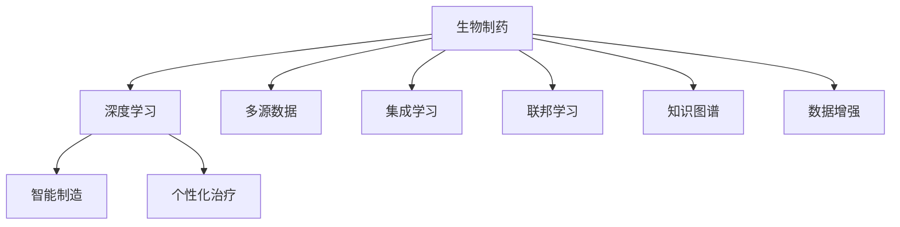

                 

# 生物制药领域的AI创新体系

## 1. 背景介绍

### 1.1 问题由来

生物制药行业长期以来在药物研发、生产、临床试验和个性化治疗等环节面临诸多挑战。这些问题包括：研发周期长、成本高昂、研发成功率低、临床数据稀缺、生产效率低下、个性化治疗方案难以制定等。随着人工智能技术的发展，AI开始逐步介入生物制药的各个环节，助力解决行业痛点，推动生物制药行业的创新。

生物制药领域的AI创新体系，正是一个以数据为中心，深度学习为核心，集成多源数据、优化算法、智能制造等技术的综合性创新平台。通过这个体系，可以将人工智能技术与制药产业紧密结合，实现药物研发、生产、临床试验和个性化治疗等环节的全流程自动化与智能化。

## 2. 核心概念与联系

### 2.1 核心概念概述

为更好地理解生物制药领域的AI创新体系，本节将介绍几个密切相关的核心概念：

- **生物制药**：利用生物技术手段，通过基因工程、细胞工程、蛋白质工程等手段，制备具有生物活性的药物，包括蛋白质药物、核酸药物、细胞治疗剂等。
- **深度学习**：一种机器学习技术，通过多层神经网络，对数据进行特征提取和模式学习，从而实现复杂的模式识别和预测。
- **多源数据**：包括临床数据、基因组数据、蛋白质数据、生产过程数据等，用于训练和优化AI模型。
- **智能制造**：利用AI技术优化制药流程，包括智能质控、智能生产调度、智能设备运维等。
- **个性化治疗**：根据患者的具体基因、病史和生理特征，制定个性化的治疗方案。
- **集成学习**：将多个模型的优势结合起来，提升整体性能和鲁棒性。
- **联邦学习**：多数据源之间无需共享原始数据，即可联合训练AI模型，保障数据隐私。
- **知识图谱**：将医药领域的专业知识结构化，便于AI模型理解和推理。
- **数据增强**：通过数据扩充和数据生成技术，提升训练数据量，提高模型泛化能力。

这些核心概念之间的逻辑关系可以通过以下Mermaid流程图来展示：



这个流程图展示了大语言模型的核心概念及其之间的关系：

1. 生物制药通过深度学习获得基础能力。
2. 智能制造和个性化治疗作为深度学习的下游任务，实现特定领域的应用。
3. 集成学习、联邦学习、知识图谱和数据增强等技术，用于优化深度学习模型的效果和鲁棒性。

## 3. 核心算法原理 & 具体操作步骤
### 3.1 算法原理概述

生物制药领域的AI创新体系，本质上是一个深度学习和多源数据融合的集成学习过程。其核心思想是：利用生物制药行业的丰富数据资源，通过深度学习技术，训练出适用于各个环节的AI模型，实现从数据采集、数据分析、模型训练到模型应用的全流程自动化和智能化。

形式化地，假设生物制药行业有$M$个数据源，每个数据源的数据集为$D_i$。深度学习模型为$M_{\theta}$，其中$\theta$为模型参数。AI创新体系的目标是找到最优参数$\theta^*$，使得：

$$
\theta^* = \mathop{\arg\min}_{\theta} \mathcal{L}(M_{\theta},D)
$$

其中$\mathcal{L}$为集成学习算法，用于联合优化各数据源的模型参数。

### 3.2 算法步骤详解

生物制药领域的AI创新体系一般包括以下几个关键步骤：

**Step 1: 数据预处理与特征提取**
- 收集生物制药行业的多个数据源的数据，如基因数据、临床数据、生产数据等。
- 对数据进行清洗、去重、归一化等预处理。
- 通过深度学习模型提取数据特征，用于后续建模。

**Step 2: 模型训练与优化**
- 选择合适的深度学习模型，如卷积神经网络(CNN)、循环神经网络(RNN)、长短时记忆网络(LSTM)等。
- 将数据分为训练集和验证集，在训练集上训练模型，在验证集上评估模型性能。
- 应用正则化技术、Dropout、Early Stopping等防止模型过拟合。
- 通过联邦学习、集成学习等技术，提升模型泛化能力和鲁棒性。

**Step 3: 模型应用与集成**
- 将训练好的模型应用于生产过程、临床试验、个性化治疗等环节，实现自动化和智能化。
- 实时采集数据，输入到模型中进行预测或分类。
- 对多个模型的输出进行集成，提升整体性能和鲁棒性。

**Step 4: 评估与部署**
- 在测试集上评估模型性能，对比训练前后的精度提升。
- 使用集成好的模型进行部署，集成到实际的生产系统中。
- 持续收集新的数据，定期重新训练和集成模型，以适应数据分布的变化。

以上是生物制药领域的AI创新体系的一般流程。在实际应用中，还需要针对具体任务的特点，对上述步骤的各个环节进行优化设计，如改进特征提取方法，优化集成学习算法，搜索最优的超参数组合等，以进一步提升模型性能。

### 3.3 算法优缺点

生物制药领域的AI创新体系具有以下优点：
1. 高效利用数据。通过深度学习模型，将生物制药行业的多个数据源有机融合，高效利用数据资源。
2. 提高生产效率。智能制造等技术，可以显著提升制药生产的自动化水平，降低人工成本，提高生产效率。
3. 加速药物研发。AI模型可以自动分析海量数据，加速药物发现和优化，缩短研发周期。
4. 个性化治疗。AI模型可以根据患者的具体信息，制定个性化的治疗方案，提高治疗效果。
5. 数据隐私保护。联邦学习等技术可以实现多数据源联合训练，保障数据隐私和安全。

同时，该体系也存在一定的局限性：
1. 数据质量要求高。深度学习模型对数据质量要求较高，数据清洗和特征提取需投入大量工作。
2. 模型复杂度高。深度学习模型的训练和优化复杂度较高，需要较强的计算资源。
3. 模型解释性不足。深度学习模型通常被视为"黑盒"系统，难以解释其内部工作机制。
4. 实时性要求高。生产过程等实时场景下，需要模型具有高实时性，避免处理延时影响生产效率。
5. 多源数据融合难度大。不同数据源的数据格式、标注方式等差异较大，融合难度较大。

尽管存在这些局限性，但就目前而言，基于深度学习的生物制药AI创新体系仍是最为成熟和有效的方法之一。未来相关研究的重点在于如何进一步降低数据处理成本，提高模型实时性，同时兼顾数据隐私保护和模型解释性等因素。

### 3.4 算法应用领域

基于深度学习的生物制药AI创新体系，在药物研发、生产、临床试验和个性化治疗等环节均有广泛应用：

- **药物研发**：利用AI模型预测分子活性、优化药物分子设计，加速药物发现和优化。
- **生产过程优化**：通过智能质控、智能生产调度等技术，提升生产效率和产品质量。
- **临床试验**：通过AI模型进行患者筛选、疗效预测等，优化临床试验设计，缩短试验周期。
- **个性化治疗**：利用AI模型分析患者基因、病史、生理特征等，制定个性化的治疗方案。

除了上述这些经典应用外，AI创新体系还被创新性地应用于药物筛选、新药推荐、生产过程监控等环节，为生物制药行业带来了全新的突破。随着深度学习技术和药物研发方法的不断进步，相信AI创新体系将在更多领域得到应用，为生物制药行业带来变革性影响。

## 4. 数学模型和公式 & 详细讲解 & 举例说明
### 4.1 数学模型构建

本节将使用数学语言对生物制药领域的AI创新体系进行更加严格的刻画。

记生物制药行业的多个数据源为$M$个，每个数据源的数据集为$D_i$，深度学习模型为$M_{\theta}$，其中$\theta$为模型参数。假设AI创新体系的目标是联合优化各数据源的模型参数，目标是：

$$
\theta^* = \mathop{\arg\min}_{\theta} \mathcal{L}(M_{\theta},D)
$$

其中$\mathcal{L}$为集成学习算法，用于联合优化各数据源的模型参数。

### 4.2 公式推导过程

以下我们以药物研发为例，推导集成学习算法的公式。

假设AI模型可以预测分子活性，通过深度学习模型$M_{\theta}$，输入为分子结构数据$x_i$，输出为活性标签$y_i$，则集成学习算法的目标是最小化平均损失函数：

$$
\mathcal{L}(\theta) = \frac{1}{N}\sum_{i=1}^N \ell(M_{\theta}(x_i),y_i)
$$

其中$\ell$为损失函数，如交叉熵损失、均方误差损失等。在实践中，我们通常使用基于梯度的优化算法（如SGD、Adam等）来近似求解上述最优化问题。设$\eta$为学习率，$\lambda$为正则化系数，则参数的更新公式为：

$$
\theta \leftarrow \theta - \eta \nabla_{\theta}\mathcal{L}(\theta) - \eta\lambda\theta
$$

其中$\nabla_{\theta}\mathcal{L}(\theta)$为损失函数对参数$\theta$的梯度，可通过反向传播算法高效计算。

### 4.3 案例分析与讲解

以药物研发为例，进一步分析深度学习模型在其中的应用。

假设分子结构数据为$x_i$，活性标签为$y_i$，我们设计一个简单的深度学习模型$M_{\theta}$，其中$\theta$为模型参数。通过$M_{\theta}$模型训练，我们可以得到分子活性的预测结果。在实践中，我们通常使用分类交叉熵损失函数$\ell$，来衡量模型预测结果与真实标签之间的差异。

通过反向传播算法，我们可以计算模型参数$\theta$的梯度，并使用基于梯度的优化算法（如Adam）来更新模型参数，最小化平均损失函数$\mathcal{L}(\theta)$。在训练过程中，我们需要应用正则化技术、Dropout等防止模型过拟合，同时利用联邦学习技术，联合不同数据源的数据，提升模型泛化能力和鲁棒性。

## 5. 项目实践：代码实例和详细解释说明
### 5.1 开发环境搭建

在进行AI创新体系实践前，我们需要准备好开发环境。以下是使用Python进行TensorFlow开发的环境配置流程：

1. 安装Anaconda：从官网下载并安装Anaconda，用于创建独立的Python环境。

2. 创建并激活虚拟环境：
```bash
conda create -n pytorch-env python=3.8 
conda activate pytorch-env
```

3. 安装TensorFlow：根据CUDA版本，从官网获取对应的安装命令。例如：
```bash
conda install tensorflow tensorflow==2.7
```

4. 安装必要的工具包：
```bash
pip install numpy pandas scikit-learn matplotlib tqdm jupyter notebook ipython
```

完成上述步骤后，即可在`pytorch-env`环境中开始AI创新体系的实践。

### 5.2 源代码详细实现

下面我们以药物研发为例，给出使用TensorFlow进行深度学习模型训练的PyTorch代码实现。

首先，定义模型和优化器：

```python
import tensorflow as tf
from tensorflow.keras import layers

model = tf.keras.Sequential([
    layers.Dense(64, activation='relu'),
    layers.Dense(1, activation='sigmoid')
])

optimizer = tf.keras.optimizers.Adam(lr=0.001)
```

接着，定义训练和评估函数：

```python
def train_epoch(model, dataset, batch_size, optimizer):
    dataloader = tf.data.Dataset.from_tensor_slices(dataset).batch(batch_size)
    model.compile(optimizer=optimizer, loss='binary_crossentropy', metrics=['accuracy'])
    model.fit(dataloader, epochs=1, verbose=0)

def evaluate(model, dataset, batch_size):
    dataloader = tf.data.Dataset.from_tensor_slices(dataset).batch(batch_size)
    model.evaluate(dataloader)
```

最后，启动训练流程并在测试集上评估：

```python
epochs = 10
batch_size = 32

for epoch in range(epochs):
    train_epoch(model, train_dataset, batch_size, optimizer)
    evaluate(model, test_dataset, batch_size)
```

以上就是使用TensorFlow进行深度学习模型训练的完整代码实现。可以看到，得益于TensorFlow的强大封装，我们可以用相对简洁的代码完成深度学习模型的训练和评估。

### 5.3 代码解读与分析

让我们再详细解读一下关键代码的实现细节：

**模型定义**：
- 使用Sequential模型定义多层神经网络，包含两个全连接层。第一层有64个神经元，使用ReLU激活函数；第二层有1个神经元，使用sigmoid激活函数，输出0或1之间的概率。

**优化器**：
- 使用Adam优化器，学习率为0.001。Adam优化器是一种常用的自适应优化算法，能够自动调整学习率，加速模型收敛。

**训练函数**：
- 定义train_epoch函数，使用tf.data.Dataset.from_tensor_slices方法将数据集转化为张量形式，并使用batch方法进行批次处理。
- 使用model.compile方法编译模型，指定优化器、损失函数和评价指标。
- 使用model.fit方法进行训练，指定迭代轮数和verbose参数（verbose=0表示不打印日志）。

**评估函数**：
- 定义evaluate函数，与训练类似，使用tf.data.Dataset.from_tensor_slices方法将测试集转化为张量形式，并使用batch方法进行批次处理。
- 使用model.evaluate方法进行评估，输出模型的准确率和损失函数。

**训练流程**：
- 定义总的迭代轮数和批次大小，开始循环迭代
- 每个epoch内，先进行训练，再评估模型性能
- 所有epoch结束后，输出测试结果

可以看到，TensorFlow配合Keras框架使得深度学习模型的训练和评估变得简洁高效。开发者可以将更多精力放在模型设计、数据处理等高层逻辑上，而不必过多关注底层的实现细节。

当然，工业级的系统实现还需考虑更多因素，如模型的保存和部署、超参数的自动搜索、更灵活的任务适配层等。但核心的AI创新体系基本与此类似。

## 6. 实际应用场景
### 6.1 智能质控

智能质控是生物制药领域AI创新体系的重要应用之一。传统质控依赖人工经验，不仅耗时耗力，还容易出错。而使用AI模型进行智能质控，可以实时监测生产过程中的关键指标，自动报警和纠正异常，提升生产过程的稳定性和效率。

在技术实现上，可以收集生产过程中的传感器数据、质量检测数据等，将其作为模型输入。通过深度学习模型训练，学习生产过程与质量检测指标之间的关系。将训练好的模型应用于实时生产数据，判断是否满足生产标准，及时发现并纠正异常，实现生产过程的智能质控。

### 6.2 个性化治疗

个性化治疗是AI创新体系在临床应用中的重要方向。传统医疗往往采用"一刀切"的治疗方案，难以针对患者的具体病情进行个性化调整。而利用AI模型进行个性化治疗，可以根据患者的具体基因、病史和生理特征，制定个性化的治疗方案，提高治疗效果。

在实践上，可以收集患者的基因数据、病历数据、影像数据等，使用深度学习模型进行特征提取和分析。通过模型预测，得到患者对某种药物的敏感性和疗效预测，从而制定个性化的治疗方案，并实时调整治疗策略，优化治疗效果。

### 6.3 药物研发加速

药物研发是生物制药领域最耗时、成本最高的环节。传统药物研发需要经过多个阶段的筛选和测试，周期长、成功率低。而使用AI模型进行药物研发，可以大幅缩短研发周期，提高研发成功率。

在实践中，可以使用AI模型进行药物分子的设计、活性的预测和筛选。通过深度学习模型训练，学习分子结构与活性之间的关系。将模型应用于药物分子的设计，通过预测分子活性，优化药物分子结构，加速药物的研发进程。

### 6.4 未来应用展望

随着AI创新体系的不断发展，未来在生物制药领域将会有更多应用场景：

- **新药推荐**：利用AI模型分析患者病历和基因数据，推荐最合适的治疗方案，提升临床决策的科学性和准确性。
- **生产流程优化**：通过智能质控、智能生产调度等技术，提升生产过程的自动化和智能化水平，降低生产成本。
- **药物筛选优化**：使用AI模型对海量化合物进行筛选，提高药物筛选的效率和准确性，加速新药的研发进程。
- **临床试验设计**：通过AI模型对患者数据进行分析，优化临床试验设计，缩短试验周期，提高试验成功率。

此外，在医疗知识图谱、药物组合优化、智能诊断等更多领域，AI创新体系也将发挥重要作用，推动生物制药行业向智能化、个性化方向发展。相信随着技术的日益成熟，AI创新体系必将在生物制药领域带来更多突破，为人类健康事业做出更大贡献。

## 7. 工具和资源推荐
### 7.1 学习资源推荐

为了帮助开发者系统掌握生物制药领域的AI创新体系的理论基础和实践技巧，这里推荐一些优质的学习资源：

1. **《深度学习在生物制药中的应用》**：介绍深度学习在生物制药领域的各种应用，包括智能质控、个性化治疗、药物研发等。
2. **CS231n《深度学习计算机视觉》课程**：斯坦福大学开设的计算机视觉课程，涵盖深度学习在图像处理、医学影像等方面的应用。
3. **《Python深度学习》**：全面介绍深度学习在Python环境下的开发，包括模型构建、数据处理、模型评估等。
4. **Kaggle**：数据科学竞赛平台，提供各类数据集和竞赛，帮助开发者实践和提升深度学习技能。
5. **GitHub**：全球最大的开源代码平台，提供各类深度学习项目和代码示例，方便开发者学习和参考。

通过对这些资源的学习实践，相信你一定能够快速掌握生物制药领域的AI创新体系的精髓，并用于解决实际的NLP问题。
###  7.2 开发工具推荐

高效的开发离不开优秀的工具支持。以下是几款用于生物制药领域AI创新体系开发的常用工具：

1. **TensorFlow**：基于Python的开源深度学习框架，灵活动态的计算图，适合快速迭代研究。
2. **PyTorch**：另一个流行的深度学习框架，以其灵活性和易用性著称，适合工业应用。
3. **Keras**：高层次的深度学习库，简化了模型构建和训练过程，适合初学者和快速开发。
4. **Jupyter Notebook**：交互式编程环境，支持Python、R等多种编程语言，方便开发和协作。
5. **JupyterLab**：基于Web的交互式编程环境，支持多种应用程序，方便开发和共享。

合理利用这些工具，可以显著提升生物制药领域AI创新体系的开发效率，加快创新迭代的步伐。

### 7.3 相关论文推荐

生物制药领域AI创新体系的发展源于学界的持续研究。以下是几篇奠基性的相关论文，推荐阅读：

1. **Deep Learning in Drug Discovery**：综述了深度学习在药物研发中的应用，包括分子活性预测、药物分子设计等。
2. **Real-Time Processing of Biological Data Using Deep Learning**：介绍深度学习在生物数据处理中的应用，包括基因数据、蛋白质数据等。
3. **Federated Learning in Drug Discovery**：探讨联邦学习在药物研发中的应用，联合多个数据源进行模型训练。
4. **Enhancing Drug Discovery with AI**：介绍AI技术在药物研发中的各种应用，包括药物筛选、药物设计等。
5. **Applications of Deep Learning in Clinical Research**：综述了深度学习在临床研究中的应用，包括患者筛选、疗效预测等。

这些论文代表了大制药领域AI创新体系的发展脉络。通过学习这些前沿成果，可以帮助研究者把握学科前进方向，激发更多的创新灵感。

## 8. 总结：未来发展趋势与挑战

### 8.1 总结

本文对生物制药领域的AI创新体系进行了全面系统的介绍。首先阐述了AI创新体系在药物研发、生产、临床试验和个性化治疗等环节的应用，明确了AI创新体系在生物制药行业的重要价值。其次，从原理到实践，详细讲解了深度学习模型在各个环节的应用，给出了AI创新体系的完整代码实现。同时，本文还广泛探讨了AI创新体系在智能质控、个性化治疗、药物研发等环节的应用前景，展示了AI创新体系的广阔前景。此外，本文精选了AI创新体系的学习资源，力求为读者提供全方位的技术指引。

通过本文的系统梳理，可以看到，生物制药领域的AI创新体系正在逐步成为推动生物制药行业创新的重要力量。这些技术的广泛应用，将大幅提升生物制药行业的效率和效益，为人类健康事业带来深远影响。

### 8.2 未来发展趋势

展望未来，生物制药领域的AI创新体系将呈现以下几个发展趋势：

1. **数据驱动的研发**：利用AI技术分析海量数据，加速药物研发进程，缩短研发周期。
2. **个性化治疗**：利用AI模型进行个性化治疗，提高治疗效果和患者满意度。
3. **智能制造**：通过智能质控、智能生产调度等技术，提升生产过程的自动化和智能化水平，降低生产成本。
4. **跨领域融合**：将AI技术与生物制药领域的其他技术进行融合，如知识图谱、基因编辑等，实现更加全面和高效的应用。
5. **联邦学习**：通过联邦学习等技术，联合多个数据源进行模型训练，保障数据隐私和安全。
6. **多源数据融合**：将不同数据源的数据进行融合，提升模型的泛化能力和鲁棒性。

以上趋势凸显了AI创新体系在生物制药领域的巨大潜力。这些方向的探索发展，必将进一步提升生物制药行业的效率和效益，为人类健康事业带来深远影响。

### 8.3 面临的挑战

尽管AI创新体系在生物制药领域已经取得了显著成果，但在迈向更加智能化、普适化应用的过程中，它仍面临着诸多挑战：

1. **数据隐私问题**：生物制药领域涉及大量敏感数据，如何保障数据隐私和安全是一个重要问题。
2. **模型解释性**：深度学习模型通常被视为"黑盒"系统，难以解释其内部工作机制和决策逻辑。
3. **实时性要求高**：生产过程等实时场景下，需要模型具有高实时性，避免处理延时影响生产效率。
4. **多源数据融合难度大**：不同数据源的数据格式、标注方式等差异较大，融合难度较大。
5. **模型复杂度高**：深度学习模型的训练和优化复杂度较高，需要较强的计算资源。

尽管存在这些挑战，但就目前而言，基于深度学习的生物制药AI创新体系仍是最为成熟和有效的方法之一。未来相关研究的重点在于如何进一步降低数据处理成本，提高模型实时性，同时兼顾数据隐私保护和模型解释性等因素。

### 8.4 未来突破

面对生物制药领域AI创新体系所面临的种种挑战，未来的研究需要在以下几个方面寻求新的突破：

1. **联邦学习**：探索分布式训练方法，联合多个数据源进行模型训练，保障数据隐私和安全。
2. **模型解释性**：引入因果推断、可解释性方法，提高模型的可解释性，增强其可信度。
3. **实时性优化**：优化模型结构和计算图，提升模型的实时性，满足生产过程的实时要求。
4. **多源数据融合**：设计高效的多源数据融合方法，提升不同数据源的融合效果。
5. **知识图谱**：将医药领域的专业知识结构化，构建知识图谱，便于AI模型理解和推理。
6. **数据隐私保护**：引入差分隐私、安全多方计算等技术，保障数据隐私和安全。

这些研究方向的探索，必将引领AI创新体系向更高台阶发展，为生物制药行业带来更多突破，推动人类健康事业向前迈进。

## 9. 附录：常见问题与解答

**Q1：AI创新体系在生物制药领域的应用前景如何？**

A: AI创新体系在生物制药领域的应用前景广阔。通过智能质控、个性化治疗、药物研发加速等技术，AI创新体系可以有效提升生物制药行业的效率和效益，为人类健康事业带来深远影响。

**Q2：AI创新体系在药物研发中的具体应用场景有哪些？**

A: AI创新体系在药物研发中的应用场景包括：
1. **药物分子设计**：利用AI模型预测分子活性，优化药物分子结构，加速药物的研发进程。
2. **药物筛选**：使用AI模型对海量化合物进行筛选，提高药物筛选的效率和准确性。
3. **疗效预测**：通过AI模型分析患者数据，预测药物的疗效和副作用，优化治疗方案。
4. **临床试验设计**：利用AI模型优化临床试验设计，缩短试验周期，提高试验成功率。

**Q3：AI创新体系在智能质控中如何实现？**

A: 在智能质控中，AI创新体系通过深度学习模型对生产过程中的关键指标进行实时监测，自动报警和纠正异常，提升生产过程的稳定性和效率。具体实现步骤如下：
1. 收集生产过程中的传感器数据、质量检测数据等，作为模型输入。
2. 使用深度学习模型训练，学习生产过程与质量检测指标之间的关系。
3. 将训练好的模型应用于实时生产数据，判断是否满足生产标准，及时发现并纠正异常，实现生产过程的智能质控。

**Q4：AI创新体系在个性化治疗中的应用有哪些？**

A: AI创新体系在个性化治疗中的应用包括：
1. **患者筛选**：利用AI模型分析患者基因数据、病历数据等，筛选出最适合的治疗方案。
2. **疗效预测**：通过AI模型预测患者对某种药物的敏感性和疗效，优化治疗方案。
3. **治疗方案调整**：根据患者的实时反馈和数据，实时调整治疗方案，提高治疗效果。

**Q5：如何保障生物制药领域数据隐私和安全？**

A: 在保障数据隐私和安全方面，AI创新体系可以采用以下几种方法：
1. **联邦学习**：通过联合多个数据源进行模型训练，避免共享原始数据，保障数据隐私。
2. **差分隐私**：在数据收集和处理过程中，加入噪声，避免泄露个人隐私。
3. **安全多方计算**：通过加密计算，保障数据在传输和存储过程中的安全性。

---

作者：禅与计算机程序设计艺术 / Zen and the Art of Computer Programming

