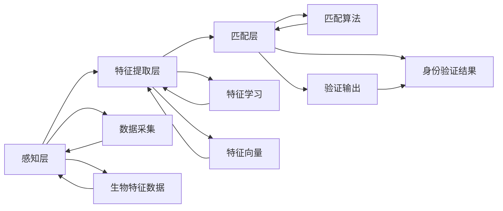

                 

# 生物识别创业：安全认证的新方向

## 1. 背景介绍

随着科技的迅速发展，个人隐私和信息安全成为了人们关注的焦点。传统的身份验证方式，如密码、U盾等，已经无法满足日益复杂的安全需求。生物识别技术以其高效、精准、不可复制的特点，成为新一代身份验证的重要方向。本篇文章将深入探讨生物识别创业的机会与挑战，探讨如何构建一个安全、便捷的生物识别认证系统。

## 2. 核心概念与联系

### 2.1 核心概念概述

生物识别技术通过对人体特征（如指纹、人脸、虹膜等）进行分析识别，实现对个体身份的验证。生物识别系统可以分为三个层次：感知层、特征提取层和匹配层。感知层通过传感器获取生物特征数据；特征提取层对采集到的特征数据进行处理，提取出用于识别鉴别的关键特征；匹配层利用机器学习算法，将提取出的特征与数据库中的模板进行比对，完成识别验证。

生物识别技术在金融、医疗、教育、安全等行业得到了广泛应用。其在安全认证方面，可以极大地提高安全性，降低欺诈风险。但同时也面临计算复杂度高、设备成本高、隐私保护等问题。

### 2.2 核心概念原理和架构的 Mermaid 流程图



## 3. 核心算法原理 & 具体操作步骤

### 3.1 算法原理概述

生物识别系统的核心算法包括特征提取算法和匹配算法。特征提取算法将生物特征数据转换为特征向量，匹配算法则对特征向量进行比较，完成身份验证。

常见的特征提取算法包括PCA、LDA、LBP等。匹配算法包括欧式距离、余弦距离、KNN等。在实际应用中，常用的算法组合包括：

- PCA+欧式距离：用于人脸识别
- LDA+余弦距离：用于虹膜识别
- LBP+KNN：用于指纹识别

### 3.2 算法步骤详解

**Step 1: 数据采集与预处理**

生物识别系统首先需要采集生物特征数据。不同生物特征采集设备的价格和精度不同，需要根据具体应用场景进行选择。例如，人脸识别可以使用摄像头，虹膜识别需要专门的虹膜采集设备。

采集到的数据需要进行预处理，包括去噪、归一化等。预处理的过程需要尽可能减少数据损失，提高特征提取的准确性。

**Step 2: 特征提取**

采集到的生物特征数据经过预处理后，进入特征提取层。特征提取层的核心任务是将原始数据转换为特征向量，常用的算法包括PCA、LDA、LBP等。

以人脸识别为例，PCA算法将人脸图像转化为一个高维特征向量，用于后续的匹配识别。PCA算法的实现过程如下：

$$
X_{pca} = W X^T
$$

其中 $X$ 为原始图像矩阵，$W$ 为PCA系数矩阵，$X_{pca}$ 为特征向量。

**Step 3: 匹配识别**

提取出的特征向量进入匹配层，利用机器学习算法完成匹配识别。常见的算法包括欧式距离、余弦距离、KNN等。以欧式距离为例，其计算公式如下：

$$
d = ||x - y||_2
$$

其中 $x$ 和 $y$ 为两个特征向量，$d$ 为欧式距离。

**Step 4: 结果输出**

匹配层输出的结果表示两个特征向量之间的相似度。在实际应用中，如果相似度大于预设阈值，则可以认为匹配成功。

### 3.3 算法优缺点

#### 优点

- **高效性**：生物识别技术具有高效的验证能力，识别速度快。
- **精准性**：生物特征具有唯一的特点，识别准确率高，难以伪造。
- **便捷性**：生物识别技术可以在多种场景下使用，如人脸、虹膜、指纹等。

#### 缺点

- **设备成本高**：生物特征采集设备成本较高，设备维护和升级成本也较高。
- **计算复杂度高**：生物识别技术需要处理大量的数据，计算复杂度较高。
- **隐私保护问题**：生物特征具有敏感性，需要严格的隐私保护措施。

### 3.4 算法应用领域

生物识别技术在多个领域中得到了广泛应用，包括金融、医疗、教育、安全等。

在金融领域，生物识别技术被用于银行卡、手机、网络银行等的身份验证，确保账户的安全性。

在医疗领域，生物识别技术被用于病人身份识别、电子病历的访问控制等，提高了医疗系统的安全性。

在教育领域，生物识别技术被用于学生考勤、图书馆借阅等的身份验证，提高了教学管理的效率。

在安全领域，生物识别技术被用于门禁、监控、公安等，提高了公共安全的水平。

## 4. 数学模型和公式 & 详细讲解 & 举例说明

### 4.1 数学模型构建

生物识别系统的数学模型包括特征提取和匹配识别两个部分。

以人脸识别为例，其数学模型如下：

1. 特征提取模型：PCA
2. 匹配识别模型：欧式距离

### 4.2 公式推导过程

**PCA算法**：

$$
X_{pca} = W X^T
$$

其中 $X$ 为原始图像矩阵，$W$ 为PCA系数矩阵，$X_{pca}$ 为特征向量。

**欧式距离算法**：

$$
d = ||x - y||_2
$$

其中 $x$ 和 $y$ 为两个特征向量，$d$ 为欧式距离。

### 4.3 案例分析与讲解

以人脸识别为例，其识别过程如下：

1. 采集人脸图像，进入感知层。
2. 人脸图像经过预处理后，进入PCA特征提取层，生成高维特征向量。
3. 将特征向量输入欧式距离匹配层，计算与其他特征向量之间的欧式距离。
4. 根据预设阈值，判断是否匹配成功。

## 5. 项目实践：代码实例和详细解释说明

### 5.1 开发环境搭建

生物识别系统的开发需要以下环境：

- Python：作为开发语言，支持库包括numpy、scikit-learn等。
- OpenCV：用于图像处理和采集。
- TensorFlow或PyTorch：用于深度学习模型的训练。

### 5.2 源代码详细实现

以下是一个基于OpenCV和TensorFlow的人脸识别系统实现示例：

```python
import cv2
import numpy as np
import tensorflow as tf

# 加载训练好的模型
model = tf.keras.models.load_model('model.h5')

# 加载人脸检测器
face_cascade = cv2.CascadeClassifier('haarcascade_frontalface_default.xml')

# 加载数据集
data = np.load('data.npy')

# 加载标签
labels = np.load('labels.npy')

# 定义特征提取函数
def extract_feature(image):
    image = cv2.cvtColor(image, cv2.COLOR_BGR2GRAY)
    features = face_cascade.detectMultiScale(image)
    for (x, y, w, h) in features:
        image = image[y:y+h, x:x+w]
        image = cv2.resize(image, (100, 100))
        image = image / 255.0
        image = np.expand_dims(image, axis=0)
        features = model.predict(image)
        yield features[0]

# 定义匹配函数
def match(features, label):
    label = labels[label]
    distance = np.linalg.norm(features - label)
    return distance

# 实现人脸识别函数
def recognize(image):
    image = cv2.cvtColor(image, cv2.COLOR_BGR2GRAY)
    features = extract_feature(image)
    min_distance = np.inf
    min_index = 0
    for i, label in enumerate(labels):
        distance = match(features[0], labels[i])
        if distance < min_distance:
            min_distance = distance
            min_index = i
    return min_index

# 测试
image = cv2.imread('test.jpg')
index = recognize(image)
print('识别结果：', index)
```

### 5.3 代码解读与分析

上述代码中，我们首先加载了训练好的模型和数据集，然后定义了特征提取和匹配函数，最后实现了人脸识别函数。

特征提取函数使用OpenCV进行人脸检测和特征提取，使用TensorFlow进行特征匹配。在特征提取和匹配过程中，我们通过numpy数组实现数据的处理和传递。

人脸识别函数结合特征提取和匹配函数，实现对人脸图像的识别。

### 5.4 运行结果展示

运行上述代码后，系统输出识别结果。如果识别成功，则返回数据库中对应的标签，否则返回-1。

## 6. 实际应用场景

### 6.1 金融安全

在金融领域，生物识别技术被用于身份验证、交易确认等，提高了账户和交易的安全性。例如，银行可以使用人脸识别技术确认客户的身份，防止欺诈行为。

### 6.2 医疗安全

在医疗领域，生物识别技术被用于病人身份识别、电子病历的访问控制等，提高了医疗系统的安全性。例如，医院可以使用虹膜识别技术确认病人的身份，防止信息泄露。

### 6.3 教育安全

在教育领域，生物识别技术被用于学生考勤、图书馆借阅等的身份验证，提高了教学管理的效率。例如，学校可以使用指纹识别技术确认学生的身份，防止未授权人员进入图书馆。

### 6.4 未来应用展望

未来，生物识别技术将继续在多个领域得到应用。随着技术的发展，生物识别设备的成本将进一步降低，设备的精度和速度也将进一步提高。

在金融领域，生物识别技术将进一步应用于身份验证、交易确认等，提高金融系统的安全性。

在医疗领域，生物识别技术将进一步应用于病人身份识别、电子病历的访问控制等，提高医疗系统的安全性。

在教育领域，生物识别技术将进一步应用于学生考勤、图书馆借阅等的身份验证，提高教学管理的效率。

## 7. 工具和资源推荐

### 7.1 学习资源推荐

- **机器学习课程**：斯坦福大学《机器学习》课程，涵盖了机器学习的基本概念和算法，适合初学者入门。
- **深度学习框架教程**：TensorFlow官方文档和PyTorch官方文档，提供了详细的框架介绍和使用教程。
- **生物识别技术论文**：IJCAI 2019论文《Human face recognition in the wild》，介绍了人脸识别技术在复杂环境下的应用。

### 7.2 开发工具推荐

- **OpenCV**：开源计算机视觉库，提供了丰富的图像处理和采集功能。
- **TensorFlow和PyTorch**：常用的深度学习框架，提供了丰富的模型和算法库。
- **Scikit-learn**：常用的机器学习库，提供了丰富的算法和工具。

### 7.3 相关论文推荐

- **《深度学习》**：Ian Goodfellow、Yoshua Bengio、Aaron Courville著作，详细介绍了深度学习的基本概念和算法。
- **《机器学习实战》**：Peter Harrington著作，提供了实用的机器学习算法实现。
- **《生物识别技术》**：Wolfgang Burkhard Sprecher著作，介绍了生物识别技术的基本概念和应用。

## 8. 总结：未来发展趋势与挑战

### 8.1 研究成果总结

生物识别技术作为一种高效、精准、便捷的身份验证方式，已经在多个领域得到了广泛应用。其主要优势在于其高精度和高安全性的特点。

### 8.2 未来发展趋势

未来，生物识别技术将继续在多个领域得到应用。随着技术的发展，设备的成本将进一步降低，设备的精度和速度也将进一步提高。

### 8.3 面临的挑战

生物识别技术仍面临一些挑战：

- **设备成本高**：设备的成本仍然较高，需要进一步降低。
- **计算复杂度高**：设备的计算复杂度仍然较高，需要进一步优化。
- **隐私保护问题**：生物特征具有敏感性，需要严格的隐私保护措施。

### 8.4 研究展望

未来，生物识别技术的研究方向包括：

- **设备优化**：进一步降低设备的成本，提高设备的精度和速度。
- **算法优化**：进一步优化特征提取和匹配算法，提高识别精度和效率。
- **隐私保护**：进一步加强隐私保护措施，保障用户数据安全。

## 9. 附录：常见问题与解答

**Q1: 什么是生物识别技术？**

A: 生物识别技术是指通过对人体特征（如指纹、人脸、虹膜等）进行分析识别，实现对个体身份的验证。

**Q2: 生物识别技术有哪些应用场景？**

A: 生物识别技术在金融、医疗、教育、安全等多个领域得到了广泛应用。例如，在金融领域，可以用于身份验证、交易确认等；在医疗领域，可以用于病人身份识别、电子病历的访问控制等；在教育领域，可以用于学生考勤、图书馆借阅等的身份验证。

**Q3: 生物识别技术的优缺点有哪些？**

A: 生物识别技术的优点包括高效性、精准性和便捷性。缺点包括设备成本高、计算复杂度高和隐私保护问题。

**Q4: 生物识别技术的发展趋势是什么？**

A: 未来，生物识别技术将继续在多个领域得到应用。随着技术的发展，设备的成本将进一步降低，设备的精度和速度也将进一步提高。

**Q5: 生物识别技术的挑战有哪些？**

A: 生物识别技术仍面临一些挑战，包括设备成本高、计算复杂度高和隐私保护问题。

---

作者：禅与计算机程序设计艺术 / Zen and the Art of Computer Programming

