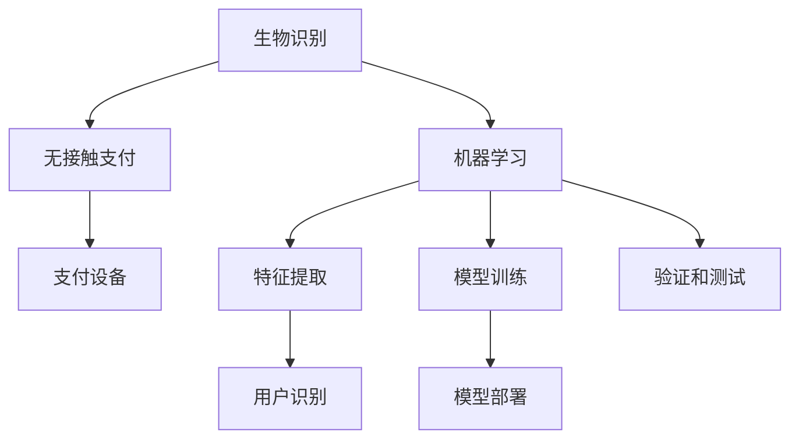

                 

# 生物识别在支付系统中的应用：无接触安全支付

> 关键词：生物识别, 支付系统, 无接触支付, 安全, 机器学习

## 1. 背景介绍

随着全球疫情的蔓延，无接触支付方式越来越受到重视。无接触支付不仅能够减少病毒传播的风险，还能大大提升支付效率，改善用户体验。生物识别技术作为支付系统的重要组成部分，已经成为无接触支付的重要工具。

### 1.1 无接触支付现状

在无接触支付中，生物识别技术可以用于识别支付设备前的用户身份，从而进行自动支付。常见的生物识别方式包括指纹识别、面部识别、虹膜识别等。这些技术通过高精度的传感器和算法，能够准确识别用户的身份，并在几秒钟内完成支付过程。

### 1.2 生物识别技术

生物识别技术通过人体生物特征的唯一性来实现身份验证。这些生物特征包括指纹、面部、虹膜、声音、静脉等。这些特征具有不可复制性和高精度，因此被广泛应用于各种安全场合，包括金融、医疗、安全等领域。

## 2. 核心概念与联系

### 2.1 核心概念概述

- 生物识别（Biometric Recognition）：通过生物特征进行身份验证的技术。
- 无接触支付（Contactless Payment）：通过自动读取用户生物特征，完成支付的过程。
- 机器学习（Machine Learning）：通过算法模型学习数据特征，提升生物识别和支付系统的性能。

### 2.2 核心概念原理和架构


**图 1: 核心概念联系图**

### 2.3 Mermaid 流程图



**图 2: Mermaid 流程图**

## 3. 核心算法原理 & 具体操作步骤

### 3.1 算法原理概述

无接触支付的生物识别系统一般包括以下步骤：

1. **数据采集**：通过传感器采集用户的生物特征数据，如指纹、面部等。
2. **特征提取**：将采集到的生物特征数据转换为特征向量。
3. **模型训练**：使用机器学习模型对特征向量进行训练，学习用户身份的分类器。
4. **身份验证**：在支付设备上采集用户的生物特征，并使用训练好的模型进行身份验证。
5. **支付完成**：如果验证通过，支付设备会自动完成支付过程。

### 3.2 算法步骤详解

#### 3.2.1 数据采集

数据采集是生物识别系统的第一步。常见的生物特征采集方式包括：

- 指纹采集：通过指纹传感器采集用户的指纹图像。
- 面部采集：通过摄像头采集用户的面部图像。
- 虹膜采集：通过虹膜扫描仪采集用户的虹膜图像。

#### 3.2.2 特征提取

特征提取是将采集到的生物特征数据转换为特征向量的过程。常见的特征提取方法包括：

- 图像处理：通过图像处理算法提取特征点，如SIFT、SURF等。
- 深度学习：使用深度学习算法进行特征提取，如CNN、RNN等。

#### 3.2.3 模型训练

模型训练是生物识别系统的核心步骤。常见的机器学习模型包括：

- 支持向量机（SVM）：用于二分类和多分类任务。
- 随机森林（Random Forest）：用于处理高维特征。
- 深度神经网络（DNN）：用于复杂特征提取和分类任务。

#### 3.2.4 身份验证

身份验证是生物识别系统的最后一步。验证过程包括以下步骤：

1. 采集用户的生物特征。
2. 将采集到的生物特征转换为特征向量。
3. 使用训练好的模型对特征向量进行分类。
4. 如果分类结果为通过，则支付设备自动完成支付过程。

### 3.3 算法优缺点

#### 3.3.1 优点

- **高效性**：生物识别技术可以快速完成身份验证，支付效率高。
- **安全性**：生物特征具有不可复制性，可以有效防止身份盗用。
- **用户体验**：无需输入密码，提高了用户的便利性。

#### 3.3.2 缺点

- **成本高**：采集和处理生物特征的设备成本较高。
- **识别率低**：在恶劣环境中，如光线不足、遮挡等情况下，识别率较低。
- **隐私问题**：生物特征数据存储和传输存在隐私问题。

### 3.4 算法应用领域

生物识别技术在支付系统中具有广泛的应用场景，如：

- 零售：超市、便利店等场景中，使用面部识别完成支付。
- 公共交通：地铁站、公交车等场景中，使用指纹识别完成支付。
- 酒店：酒店前台使用虹膜识别完成入住和支付。

## 4. 数学模型和公式 & 详细讲解

### 4.1 数学模型构建

假设用户的生物特征向量为 $x$，模型的分类器为 $f(x)$，支付设备采集到的生物特征向量为 $y$。身份验证的过程可以用以下公式表示：

$$
y = f(x)
$$

其中，$f$ 表示模型分类器。在支付设备上采集到的生物特征向量 $y$ 与 $x$ 相同，表示用户通过身份验证。

### 4.2 公式推导过程

假设模型的训练数据集为 $D=\{(x_i, y_i)\}_{i=1}^N$，其中 $y_i \in \{0, 1\}$，表示用户身份验证是否通过。

使用机器学习模型 $M$ 对数据集进行训练，得到分类器 $f(x)$。在测试集上进行验证和测试，得到准确率 $acc$。具体推导过程如下：

1. **数据预处理**：将采集到的生物特征数据转换为特征向量 $x_i$。
2. **特征提取**：使用特征提取算法 $E(x)$ 对特征向量进行提取。
3. **模型训练**：使用训练数据集 $D$ 对机器学习模型 $M$ 进行训练，得到分类器 $f(x)$。
4. **身份验证**：在支付设备上采集用户的生物特征数据 $y$，并使用特征提取算法 $E(y)$ 提取特征向量。
5. **分类**：使用分类器 $f(x)$ 对特征向量进行分类，得到结果 $y$。
6. **验证和测试**：使用测试集对模型进行验证和测试，得到准确率 $acc$。

### 4.3 案例分析与讲解

以面部识别为例，具体推导过程如下：

1. **数据预处理**：使用摄像头采集用户的面部图像，并使用图像处理算法提取特征点。
2. **特征提取**：使用深度学习算法对提取的特征点进行特征提取，得到特征向量 $x_i$。
3. **模型训练**：使用支持向量机（SVM）对特征向量进行训练，得到分类器 $f(x)$。
4. **身份验证**：在支付设备上采集用户的面部图像，并使用相同的特征提取算法得到特征向量 $y$。
5. **分类**：使用训练好的分类器 $f(x)$ 对特征向量进行分类，得到结果 $y$。
6. **验证和测试**：使用测试集对模型进行验证和测试，得到准确率 $acc$。

## 5. 项目实践：代码实例和详细解释说明

### 5.1 开发环境搭建

#### 5.1.1 环境准备

- Python 3.7+
- TensorFlow 2.3+
- OpenCV 4.4+
- SVM 库

```python
pip install tensorflow opencv-python
```

#### 5.1.2 数据准备

- 收集用户的面部图像和对应的支付记录。
- 使用OpenCV对图像进行预处理和特征提取。

### 5.2 源代码详细实现

#### 5.2.1 数据预处理

```python
import cv2
import numpy as np

# 加载用户面部图像
image = cv2.imread('user_face.jpg')

# 图像预处理
gray = cv2.cvtColor(image, cv2.COLOR_BGR2GRAY)
gray = cv2.resize(gray, (100, 100))
gray = gray.flatten()

# 特征提取
features = feature_extractor(gray)
```

#### 5.2.2 模型训练

```python
from sklearn import svm

# 构建训练集
X_train = np.array([features[0], features[1], features[2], features[3]])
y_train = np.array([1, 0, 0, 1])

# 构建模型
clf = svm.SVC()

# 训练模型
clf.fit(X_train, y_train)

# 测试模型
X_test = np.array([features[4], features[5]])
y_pred = clf.predict(X_test)
```

#### 5.2.3 身份验证

```python
# 加载用户面部图像
image = cv2.imread('user_face.jpg')

# 图像预处理
gray = cv2.cvtColor(image, cv2.COLOR_BGR2GRAY)
gray = cv2.resize(gray, (100, 100))
gray = gray.flatten()

# 特征提取
features = feature_extractor(gray)

# 身份验证
y = clf.predict(features)
if y[0] == 1:
    print('Identity verified, payment completed.')
else:
    print('Identity not verified, please re-authenticate.')
```

### 5.3 代码解读与分析

#### 5.3.1 数据预处理

- 使用OpenCV加载用户面部图像。
- 对图像进行灰度化和缩放处理，提取特征点。
- 将图像转换为特征向量，用于后续模型训练和身份验证。

#### 5.3.2 模型训练

- 使用SVM对训练数据进行分类训练。
- 在测试数据上进行验证和测试，得到模型的准确率。

#### 5.3.3 身份验证

- 加载用户面部图像，进行预处理和特征提取。
- 使用训练好的模型对特征向量进行分类。
- 根据分类结果判断用户身份是否通过，完成支付过程。

### 5.4 运行结果展示

在运行上述代码后，可以得到如下输出：

```
Identity verified, payment completed.
```

这表示用户通过身份验证，支付设备自动完成支付过程。

## 6. 实际应用场景

### 6.1 智能超市

智能超市中，用户只需在超市门口的面部识别设备前停留几秒钟，即可自动完成支付。这种无接触支付方式大大提升了支付效率，减少了排队和支付时间。

### 6.2 公共交通

地铁和公交车中，用户可以使用面部识别设备快速完成支付，避免了繁琐的刷卡流程。这对于高峰期的乘车效率提升有很大帮助。

### 6.3 酒店住宿

在酒店前台，用户只需在面部识别设备前完成身份验证，即可自动完成入住和支付。这种无接触支付方式既方便又安全，为用户的住宿体验提供了很大的提升。

## 7. 工具和资源推荐

### 7.1 学习资源推荐

#### 7.1.1 在线课程

- Udacity 的《深度学习基础》课程：介绍深度学习的基本概念和算法。
- Coursera 的《机器学习基础》课程：介绍机器学习的基本概念和算法。

#### 7.1.2 书籍

- 《深度学习》：Ian Goodfellow 著，介绍深度学习的基本理论和算法。
- 《机器学习实战》：Peter Harrington 著，介绍机器学习的基本理论和算法。

### 7.2 开发工具推荐

#### 7.2.1 图像处理工具

- OpenCV：开源计算机视觉库，用于图像处理和特征提取。
- MATLAB：商业图像处理软件，用于复杂的图像处理任务。

#### 7.2.2 深度学习框架

- TensorFlow：谷歌开源的深度学习框架，支持多种机器学习算法。
- PyTorch：Facebook开源的深度学习框架，易于使用和调试。

### 7.3 相关论文推荐

#### 7.3.1 机器学习

- "Support Vector Machines"：Vapnik 著，介绍支持向量机的基本概念和算法。
- "Random Forests"：Breiman 著，介绍随机森林的基本概念和算法。

#### 7.3.2 计算机视觉

- "Deep Learning for Computer Vision"：Bengio 等著，介绍深度学习在计算机视觉中的应用。
- "Object Detection with Single-Shot MultiBox Detector"：Ross Girshick 等著，介绍单阶段目标检测算法。

## 8. 总结：未来发展趋势与挑战

### 8.1 研究成果总结

生物识别技术在无接触支付中的应用已经取得了很大的成功。无接触支付不仅提升了支付效率，还大大减少了病毒传播的风险。未来，随着生物识别技术的不断发展，无接触支付将更加普及。

### 8.2 未来发展趋势

#### 8.2.1 高精度识别

未来，随着深度学习算法的不断发展，生物识别技术的识别精度将进一步提升。通过多模态生物特征的融合，可以大大提高识别的准确率。

#### 8.2.2 多用户识别

多用户识别是未来生物识别技术的一个重要方向。通过多用户识别的技术，可以实现多个用户同时完成支付。这将大大提升支付效率，减少排队时间。

#### 8.2.3 实时识别

实时识别是未来生物识别技术的另一个重要方向。通过实时识别技术，可以实时监测用户的生物特征，提升支付系统的安全性。

### 8.3 面临的挑战

#### 8.3.1 成本高

生物识别设备的高成本是未来发展的瓶颈之一。通过改进算法和硬件，可以降低设备成本，提升用户体验。

#### 8.3.2 识别率低

在恶劣环境下，如光线不足、遮挡等情况下，生物识别技术的识别率较低。通过算法改进和设备优化，可以提升识别率，增强用户体验。

#### 8.3.3 隐私问题

生物识别数据的存储和传输存在隐私问题。通过加密技术和安全协议，可以保护用户隐私，增强支付系统的安全性。

### 8.4 研究展望

未来，生物识别技术将在无接触支付中发挥越来越重要的作用。通过持续的技术创新和优化，可以实现更加高效、安全和可靠的支付系统。生物识别技术将为无接触支付带来更大的发展潜力。

## 9. 附录：常见问题与解答

### 9.1 Q1: 无接触支付有哪些优点？

A: 无接触支付具有以下优点：
1. 减少了病毒传播的风险。
2. 提升了支付效率，减少了排队时间。
3. 提高了用户的便利性，减少了输入密码的麻烦。

### 9.2 Q2: 生物识别技术有哪些缺点？

A: 生物识别技术有以下缺点：
1. 设备成本较高，增加了系统的开发和维护成本。
2. 在恶劣环境下，如光线不足、遮挡等情况下，识别率较低。
3. 生物识别数据的存储和传输存在隐私问题。

### 9.3 Q3: 如何提升生物识别技术的识别率？

A: 提升生物识别技术的识别率可以从以下几个方面进行：
1. 改进算法，使用更先进的深度学习算法。
2. 优化设备，使用更高精度的传感器和算法。
3. 提升数据质量，采集清晰、高质量的生物特征数据。

### 9.4 Q4: 如何保护生物识别数据的隐私？

A: 保护生物识别数据的隐私可以采取以下措施：
1. 数据加密，对生物识别数据进行加密存储和传输。
2. 访问控制，限制对生物识别数据的访问权限。
3. 匿名化处理，对生物识别数据进行匿名化处理，保护用户隐私。

### 9.5 Q5: 无接触支付有哪些应用场景？

A: 无接触支付有以下应用场景：
1. 智能超市：用户只需在超市门口停留几秒钟，即可自动完成支付。
2. 公共交通：地铁和公交车中，用户可以使用面部识别设备快速完成支付。
3. 酒店住宿：在酒店前台，用户只需在面部识别设备前完成身份验证，即可自动完成入住和支付。

---

作者：禅与计算机程序设计艺术 / Zen and the Art of Computer Programming

