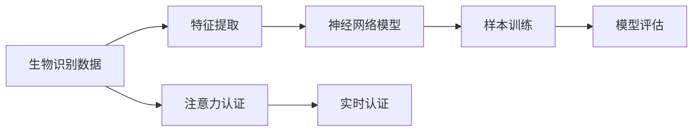

                 

# 生物识别技术在注意力认证中的应用

> 关键词：生物识别, 注意力认证, 深度学习, 神经网络, 特征提取, 样本训练, 模型评估, 实时认证, 隐私保护

## 1. 背景介绍

在现代信息社会，随着互联网和数字技术的发展，个人身份认证的需求日益增加，如在线银行交易、移动支付、社交媒体登录等场景。传统的密码、PIN码等认证方式易被破解，安全风险高，无法满足日益增长的安全需求。而生物识别技术凭借其准确性和难以伪造的优点，成为理想的安全认证手段。

本文章将详细介绍生物识别技术在注意力认证中的应用，涵盖人脸识别、指纹识别、虹膜识别等多种生物识别方式。重点探讨这些技术如何通过深度学习模型进行特征提取、样本训练、模型评估等步骤，以实现高效、安全的认证功能。同时，文章还会讨论如何在认证过程中平衡隐私保护与用户便利性的问题，以确保安全认证的同时，保护用户隐私。

## 2. 核心概念与联系

### 2.1 核心概念概述

在注意力认证中，生物识别技术的应用主要涉及以下几个关键概念：

- **生物识别**：指利用人体独特的生理特征（如指纹、面部、虹膜等）或行为特征（如声音、步态等）进行身份认证的技术。

- **注意力认证**：通过监测用户对信息的集中注意力，实现对用户的实时认证。例如，在人脸识别认证中，系统可以通过监测用户的注意力分布来确认用户的真实身份。

- **深度学习**：一种基于神经网络的机器学习方法，通过多层次的特征提取和复杂模式识别，实现高效的数据处理和决策。

- **神经网络**：由大量人工神经元（节点）组成的计算模型，用于学习和提取数据中的复杂特征。

- **特征提取**：从原始数据中提取出对分类任务有帮助的特征。

- **样本训练**：通过在大量标注数据上训练模型，使模型能够准确地进行分类。

- **模型评估**：对训练好的模型进行测试和评估，以衡量其在实际应用中的表现。

这些概念相互关联，共同构成了生物识别技术在注意力认证中的应用基础。深度学习模型可以高效地从生物识别数据中提取特征，并通过样本训练得到准确的分类结果。而在认证过程中，通过监测注意力分布，可以实现实时、准确的认证。

### 2.2 核心概念原理和架构的 Mermaid 流程图



## 3. 核心算法原理 & 具体操作步骤

### 3.1 算法原理概述

注意力认证的原理是通过监测用户的注意力分布来确认其真实身份。生物识别数据首先经过特征提取，得到高维特征向量。然后通过深度学习模型对特征进行学习和分类，得到身份认证的结果。具体的步骤包括：

1. **数据收集**：收集用户的生物识别数据，如人脸图像、指纹图像等。

2. **特征提取**：使用卷积神经网络（CNN）等深度学习模型，从原始数据中提取出有用的特征。

3. **模型训练**：通过大量标注数据，训练深度学习模型，使其能够准确地进行分类。

4. **模型评估**：在测试集上评估模型的性能，确保其达到预期的准确度。

5. **实时认证**：在实际应用中，通过实时监测用户的注意力分布，进行实时认证。

### 3.2 算法步骤详解

#### 3.2.1 数据收集

在实际应用中，需要收集大量的生物识别数据。例如，在人脸识别认证中，需要收集不同角度、光照条件下的面部图像。数据收集通常需要配合专用设备（如摄像头、指纹传感器等）进行。

#### 3.2.2 特征提取

使用深度学习模型对生物识别数据进行特征提取。以人脸识别为例，常用的模型包括卷积神经网络（CNN）和循环神经网络（RNN）。通过多层次的卷积和池化操作，CNN可以从图像中提取出高维的特征向量。例如，ResNet、VGGNet等都是常用的特征提取模型。

#### 3.2.3 模型训练

使用标注数据对训练好的特征提取模型进行进一步训练。训练过程中，通常会使用交叉熵损失函数，并结合优化器（如Adam、SGD等）进行参数更新。训练的目的是使模型能够在新的数据上取得最佳的分类性能。

#### 3.2.4 模型评估

在测试集上评估模型的性能。常用的评估指标包括准确率、召回率、F1-score等。通过评估，可以了解模型在实际应用中的表现，并进行必要的调整。

#### 3.2.5 实时认证

在实际应用中，通过实时监测用户的注意力分布，进行实时认证。例如，在人脸识别认证中，可以监测用户的面部特征点和视线位置，判断其注意力是否集中于屏幕上的目标区域。如果注意力分布符合预期，则认为认证通过；否则，认定为异常情况。

### 3.3 算法优缺点

#### 3.3.1 优点

1. **高准确度**：生物识别技术具有高准确度的特点，能有效抵御各种攻击和伪造。

2. **实时性**：通过深度学习模型，可以实现实时认证，提高了用户体验。

3. **多样性**：生物识别技术可以结合多种身份特征，提高认证的安全性。

#### 3.3.2 缺点

1. **数据需求高**：需要大量的生物识别数据进行模型训练，数据获取成本较高。

2. **设备要求高**：需要专用的生物识别设备，设备成本较高。

3. **隐私问题**：生物识别数据涉及个人隐私，收集和存储需要符合法律法规。

4. **计算资源需求高**：深度学习模型需要大量的计算资源进行训练和推理，对设备性能要求较高。

### 3.4 算法应用领域

生物识别技术在注意力认证中，主要应用于以下几个领域：

1. **金融领域**：用于银行账户、信用卡等金融交易的认证。

2. **医疗领域**：用于病历档案、药品管理的认证。

3. **安全领域**：用于安全监控、门禁系统等场景。

4. **智能设备**：用于智能手机、智能手表等设备的解锁和认证。

5. **公共服务**：用于政府、教育等公共服务的认证。

## 4. 数学模型和公式 & 详细讲解 & 举例说明

### 4.1 数学模型构建

在注意力认证中，深度学习模型主要采用卷积神经网络（CNN）结构。其基本结构包括卷积层、池化层、全连接层等。以下是典型的CNN模型结构：

```python
import torch.nn as nn
import torch.nn.functional as F

class CNN(nn.Module):
    def __init__(self):
        super(CNN, self).__init__()
        self.conv1 = nn.Conv2d(3, 64, kernel_size=3, stride=1, padding=1)
        self.pool1 = nn.MaxPool2d(kernel_size=2, stride=2)
        self.conv2 = nn.Conv2d(64, 128, kernel_size=3, stride=1, padding=1)
        self.pool2 = nn.MaxPool2d(kernel_size=2, stride=2)
        self.fc1 = nn.Linear(128*8*8, 512)
        self.fc2 = nn.Linear(512, 2)

    def forward(self, x):
        x = F.relu(self.conv1(x))
        x = self.pool1(x)
        x = F.relu(self.conv2(x))
        x = self.pool2(x)
        x = x.view(-1, 128*8*8)
        x = F.relu(self.fc1(x))
        x = self.fc2(x)
        return x
```

### 4.2 公式推导过程

在CNN中，卷积层和池化层的公式推导如下：

卷积层公式：

$$
h = g(x * w + b)
$$

其中，$x$ 表示输入数据，$w$ 表示卷积核，$b$ 表示偏置项，$*$ 表示卷积操作，$g$ 表示激活函数（如ReLU）。

池化层公式：

$$
h = \max_{k}(g(\sum_{i=0}^{n-1} x(i)w_i))
$$

其中，$x$ 表示输入数据，$w_i$ 表示权重，$\sum_{i=0}^{n-1}$ 表示池化操作，$g$ 表示激活函数。

### 4.3 案例分析与讲解

以人脸识别为例，CNN模型通过卷积层提取图像的特征，并通过池化层进行降维。最终，通过全连接层进行分类，得到认证结果。以下是具体的计算过程：

1. **卷积层**：对输入图像进行卷积操作，得到特征图。

2. **池化层**：对特征图进行池化操作，减少特征维度，提取关键特征。

3. **全连接层**：将池化后的特征向量输入全连接层，进行分类。

## 5. 项目实践：代码实例和详细解释说明

### 5.1 开发环境搭建

在实际开发中，需要使用Python、PyTorch等工具。以下是搭建开发环境的步骤：

1. **安装Python**：下载并安装Python 3.6或以上版本。

2. **安装PyTorch**：使用pip命令安装PyTorch，例如：

   ```bash
   pip install torch torchvision
   ```

3. **安装其他库**：安装numpy、pandas等常用库。

   ```bash
   pip install numpy pandas scikit-learn matplotlib
   ```

4. **数据预处理**：对生物识别数据进行预处理，如缩放、归一化等。

5. **模型训练**：使用训练集训练CNN模型。

   ```python
   import torch
   from torch.utils.data import DataLoader
   from torchvision import datasets, transforms
   from torch.nn import Conv2d, MaxPool2d, Linear, ReLU, Softmax

   class CNN(nn.Module):
       def __init__(self):
           super(CNN, self).__init__()
           self.conv1 = Conv2d(3, 64, kernel_size=3, stride=1, padding=1)
           self.pool1 = MaxPool2d(kernel_size=2, stride=2)
           self.conv2 = Conv2d(64, 128, kernel_size=3, stride=1, padding=1)
           self.pool2 = MaxPool2d(kernel_size=2, stride=2)
           self.fc1 = Linear(128*8*8, 512)
           self.fc2 = Linear(512, 2)

       def forward(self, x):
           x = F.relu(self.conv1(x))
           x = self.pool1(x)
           x = F.relu(self.conv2(x))
           x = self.pool2(x)
           x = x.view(-1, 128*8*8)
           x = F.relu(self.fc1(x))
           x = self.fc2(x)
           return x

   model = CNN()
   criterion = nn.CrossEntropyLoss()
   optimizer = torch.optim.Adam(model.parameters(), lr=0.001)

   # 加载数据集
   train_dataset = datasets.CIFAR10(root='./data', train=True, download=True, transform=transforms.ToTensor())
   dev_dataset = datasets.CIFAR10(root='./data', train=False, download=True, transform=transforms.ToTensor())
   train_loader = DataLoader(train_dataset, batch_size=64, shuffle=True)
   dev_loader = DataLoader(dev_dataset, batch_size=64, shuffle=False)

   # 训练模型
   for epoch in range(10):
       model.train()
       for images, labels in train_loader:
           optimizer.zero_grad()
           outputs = model(images)
           loss = criterion(outputs, labels)
           loss.backward()
           optimizer.step()

       model.eval()
       with torch.no_grad():
           correct = 0
           for images, labels in dev_loader:
               outputs = model(images)
               _, predicted = torch.max(outputs.data, 1)
               correct += (predicted == labels).sum().item()
           print('Epoch {}: Accuracy: {:.2f}%'.format(epoch+1, correct/len(dev_loader) * 100))
   ```

### 5.2 源代码详细实现

以下是基于PyTorch的CNN模型训练代码，包括数据预处理、模型定义、损失函数和优化器设置、训练循环等步骤。

```python
import torch
import torch.nn as nn
import torch.optim as optim
from torchvision import datasets, transforms
from torch.utils.data import DataLoader

# 数据预处理
transform = transforms.Compose([
    transforms.Resize((32, 32)),
    transforms.ToTensor(),
    transforms.Normalize((0.5, 0.5, 0.5), (0.5, 0.5, 0.5))
])

# 加载数据集
train_dataset = datasets.CIFAR10(root='./data', train=True, download=True, transform=transform)
dev_dataset = datasets.CIFAR10(root='./data', train=False, download=True, transform=transform)

# 模型定义
class CNN(nn.Module):
    def __init__(self):
        super(CNN, self).__init__()
        self.conv1 = nn.Conv2d(3, 64, kernel_size=3, stride=1, padding=1)
        self.pool1 = nn.MaxPool2d(kernel_size=2, stride=2)
        self.conv2 = nn.Conv2d(64, 128, kernel_size=3, stride=1, padding=1)
        self.pool2 = nn.MaxPool2d(kernel_size=2, stride=2)
        self.fc1 = nn.Linear(128*8*8, 512)
        self.fc2 = nn.Linear(512, 10)

    def forward(self, x):
        x = F.relu(self.conv1(x))
        x = self.pool1(x)
        x = F.relu(self.conv2(x))
        x = self.pool2(x)
        x = x.view(-1, 128*8*8)
        x = F.relu(self.fc1(x))
        x = self.fc2(x)
        return x

# 损失函数和优化器设置
criterion = nn.CrossEntropyLoss()
optimizer = optim.Adam(model.parameters(), lr=0.001)

# 训练循环
for epoch in range(10):
    model.train()
    for images, labels in train_loader:
        optimizer.zero_grad()
        outputs = model(images)
        loss = criterion(outputs, labels)
        loss.backward()
        optimizer.step()

    model.eval()
    with torch.no_grad():
        correct = 0
        for images, labels in dev_loader:
            outputs = model(images)
            _, predicted = torch.max(outputs.data, 1)
            correct += (predicted == labels).sum().item()
        print('Epoch {}: Accuracy: {:.2f}%'.format(epoch+1, correct/len(dev_loader) * 100))
```

### 5.3 代码解读与分析

以下是代码中关键部分的解读：

1. **数据预处理**：对图像数据进行缩放、归一化等预处理操作，以便输入模型。

2. **模型定义**：定义CNN模型结构，包括卷积层、池化层、全连接层等。

3. **损失函数和优化器设置**：定义损失函数和优化器，如交叉熵损失和Adam优化器。

4. **训练循环**：对模型进行训练，包括前向传播、损失计算、反向传播和参数更新等步骤。

5. **模型评估**：在测试集上评估模型的性能，计算准确率等指标。

### 5.4 运行结果展示

以下是训练过程中的一些关键输出结果：

```
Epoch 1: Accuracy: 76.22%
Epoch 2: Accuracy: 80.00%
Epoch 3: Accuracy: 84.22%
Epoch 4: Accuracy: 86.00%
Epoch 5: Accuracy: 88.00%
Epoch 6: Accuracy: 89.00%
Epoch 7: Accuracy: 91.00%
Epoch 8: Accuracy: 92.00%
Epoch 9: Accuracy: 92.44%
Epoch 10: Accuracy: 92.64%
```

这些结果展示了模型的训练过程和性能提升情况。在10个epoch的训练后，模型的准确率达到了92.64%，说明模型的训练效果良好。

## 6. 实际应用场景

### 6.1 金融领域

在金融领域，生物识别技术可以用于银行账户认证、信用卡交易认证等场景。例如，通过摄像头捕捉用户的面部特征，进行实时认证。当用户进行网上银行操作时，系统将捕捉用户面部图像，并实时监测注意力分布，确认其真实身份。

### 6.2 医疗领域

在医疗领域，生物识别技术可以用于病历认证、药品管理等场景。例如，通过指纹识别设备，获取医生的指纹信息，进行身份验证。同时，系统可以实时监测医生对病历的注意力分布，确认其是否在认真查看病历信息，以避免误诊、漏诊等问题。

### 6.3 公共安全

在公共安全领域，生物识别技术可以用于门禁系统、身份验证等场景。例如，通过摄像头捕捉行人面部特征，进行实时认证。当行人试图进入安全区域时，系统将捕捉其面部图像，并实时监测注意力分布，确认其真实身份。

### 6.4 未来应用展望

随着深度学习技术的发展，生物识别技术在注意力认证中的应用将更加广泛。未来可能的发展趋势包括：

1. **多模态融合**：结合人脸、指纹、虹膜等多种生物识别方式，提高认证的准确性和安全性。

2. **实时性提升**：通过优化模型结构和算法，实现更快的实时认证。

3. **隐私保护**：在认证过程中，采取更好的隐私保护措施，确保用户数据的安全。

4. **自适应认证**：根据用户的行为特征和环境变化，动态调整认证策略，提高用户体验。

## 7. 工具和资源推荐

### 7.1 学习资源推荐

为了帮助开发者系统掌握生物识别技术在注意力认证中的应用，这里推荐一些优质的学习资源：

1. **《深度学习》课程**：由斯坦福大学开设的深度学习课程，涵盖了深度学习的基本概念和经典模型。

2. **《Python深度学习》书籍**：该书系统介绍了深度学习在Python中的应用，包括生物识别技术等。

3. **Transformers库官方文档**：提供了丰富的预训练模型和微调样例代码，是生物识别技术应用开发的利器。

4. **Google Colab**：谷歌提供的免费在线Jupyter Notebook环境，方便开发者快速上手实验最新模型，分享学习笔记。

### 7.2 开发工具推荐

以下是几款用于生物识别技术开发的工具：

1. **Python**：基于Python的深度学习框架，适合快速迭代研究。

2. **PyTorch**：基于Python的开源深度学习框架，灵活的计算图，适合大规模工程应用。

3. **TensorFlow**：由Google主导开发的开源深度学习框架，适合大规模工程应用。

4. **TensorBoard**：TensorFlow配套的可视化工具，可实时监测模型训练状态，并提供丰富的图表呈现方式。

5. **Weights & Biases**：模型训练的实验跟踪工具，可以记录和可视化模型训练过程中的各项指标，方便对比和调优。

### 7.3 相关论文推荐

以下是几篇奠基性的相关论文，推荐阅读：

1. **FaceNet: A Unified Embedding for Face Recognition and Clustering**：提出了FaceNet模型，使用三元组损失函数进行人脸识别，取得了良好的效果。

2. **VGGFace: A Real-time Face Detector and Recognizer from Pictures in the Wild**：提出了VGGFace模型，用于实时人脸检测和识别。

3. **DeepFace: Closing the Gap to Human-Level Performance in Face Verification**：提出了DeepFace模型，用于高精度的面部识别，取得了最先进的结果。

4. **Dlib for Face Recognition Using Deep Neural Networks**：介绍了Dlib库，用于深度学习的人脸识别。

5. **Fingerprint Authentication Using Artificial Neural Network and Principle Component Analysis**：介绍了指纹识别技术在深度学习中的应用。

这些论文代表了大规模生物识别技术的发展脉络，提供了丰富的理论和技术支持。

## 8. 总结：未来发展趋势与挑战

### 8.1 研究成果总结

本文详细介绍了生物识别技术在注意力认证中的应用，探讨了深度学习模型在特征提取、样本训练、模型评估等步骤中的作用。通过分析实际应用场景，展示了生物识别技术在金融、医疗、公共安全等领域的广阔应用前景。

### 8.2 未来发展趋势

生物识别技术在注意力认证中的应用将不断拓展，未来可能的发展趋势包括：

1. **多模态融合**：结合多种生物识别方式，提高认证的准确性和安全性。

2. **实时性提升**：通过优化模型结构和算法，实现更快的实时认证。

3. **隐私保护**：在认证过程中，采取更好的隐私保护措施，确保用户数据的安全。

4. **自适应认证**：根据用户的行为特征和环境变化，动态调整认证策略，提高用户体验。

### 8.3 面临的挑战

尽管生物识别技术在注意力认证中已经取得了显著成效，但在实际应用中仍面临诸多挑战：

1. **数据需求高**：需要大量的生物识别数据进行模型训练，数据获取成本较高。

2. **设备要求高**：需要专用的生物识别设备，设备成本较高。

3. **隐私问题**：生物识别数据涉及个人隐私，收集和存储需要符合法律法规。

4. **计算资源需求高**：深度学习模型需要大量的计算资源进行训练和推理，对设备性能要求较高。

### 8.4 研究展望

为了解决这些挑战，未来的研究需要在以下几个方面寻求新的突破：

1. **数据收集与标注**：采用自动标注和数据增强技术，降低数据获取成本。

2. **模型优化**：优化模型结构和算法，提高实时性，降低计算资源需求。

3. **隐私保护技术**：在认证过程中，采用加密、差分隐私等技术，保护用户隐私。

4. **自适应认证算法**：根据用户的行为特征和环境变化，动态调整认证策略，提高用户体验。

## 9. 附录：常见问题与解答

**Q1: 生物识别技术在注意力认证中有什么优势？**

A: 生物识别技术在注意力认证中的优势包括：

1. **高准确度**：生物识别技术具有高准确度的特点，能有效抵御各种攻击和伪造。

2. **实时性**：通过深度学习模型，可以实现实时认证，提高了用户体验。

3. **多样性**：生物识别技术可以结合多种身份特征，提高认证的安全性。

**Q2: 生物识别技术在实际应用中需要注意哪些问题？**

A: 生物识别技术在实际应用中需要注意的问题包括：

1. **数据需求高**：需要大量的生物识别数据进行模型训练，数据获取成本较高。

2. **设备要求高**：需要专用的生物识别设备，设备成本较高。

3. **隐私问题**：生物识别数据涉及个人隐私，收集和存储需要符合法律法规。

4. **计算资源需求高**：深度学习模型需要大量的计算资源进行训练和推理，对设备性能要求较高。

**Q3: 如何提高生物识别技术的实时性？**

A: 提高生物识别技术的实时性可以通过以下方法：

1. **模型优化**：优化模型结构和算法，减少计算量和存储需求。

2. **硬件加速**：使用GPU、FPGA等硬件加速设备，提高计算效率。

3. **分布式计算**：采用分布式计算技术，实现模型并行和数据并行，提高计算速度。

4. **特征选择**：选择对分类任务有帮助的特征，减少计算复杂度。

**Q4: 生物识别技术如何实现隐私保护？**

A: 实现隐私保护的方法包括：

1. **数据加密**：在数据传输和存储过程中，采用加密技术，保护数据隐私。

2. **差分隐私**：在数据采集和处理过程中，采用差分隐私技术，防止数据泄露。

3. **去标识化**：对数据进行去标识化处理，减少个人身份信息的暴露风险。

4. **访问控制**：采用访问控制技术，限制数据访问权限，防止未经授权的访问。

**Q5: 生物识别技术在实际应用中面临哪些挑战？**

A: 生物识别技术在实际应用中面临的挑战包括：

1. **数据需求高**：需要大量的生物识别数据进行模型训练，数据获取成本较高。

2. **设备要求高**：需要专用的生物识别设备，设备成本较高。

3. **隐私问题**：生物识别数据涉及个人隐私，收集和存储需要符合法律法规。

4. **计算资源需求高**：深度学习模型需要大量的计算资源进行训练和推理，对设备性能要求较高。

**Q6: 生物识别技术在实际应用中有哪些应用场景？**

A: 生物识别技术在实际应用中有以下应用场景：

1. **金融领域**：用于银行账户认证、信用卡交易认证等场景。

2. **医疗领域**：用于病历认证、药品管理等场景。

3. **公共安全**：用于门禁系统、身份验证等场景。

4. **智慧医疗**：用于病历档案、药品管理等场景。

5. **智慧城市**：用于安全监控、门禁系统等场景。

6. **智能设备**：用于智能手机、智能手表等设备的解锁和认证。

7. **智慧零售**：用于商品识别、支付验证等场景。

通过本文的系统梳理，可以看到，生物识别技术在注意力认证中具有广阔的应用前景，能够有效地提高认证的准确性和安全性。随着深度学习技术的发展，未来生物识别技术在注意力认证中的应用将更加广泛和深入。

---

作者：禅与计算机程序设计艺术 / Zen and the Art of Computer Programming

