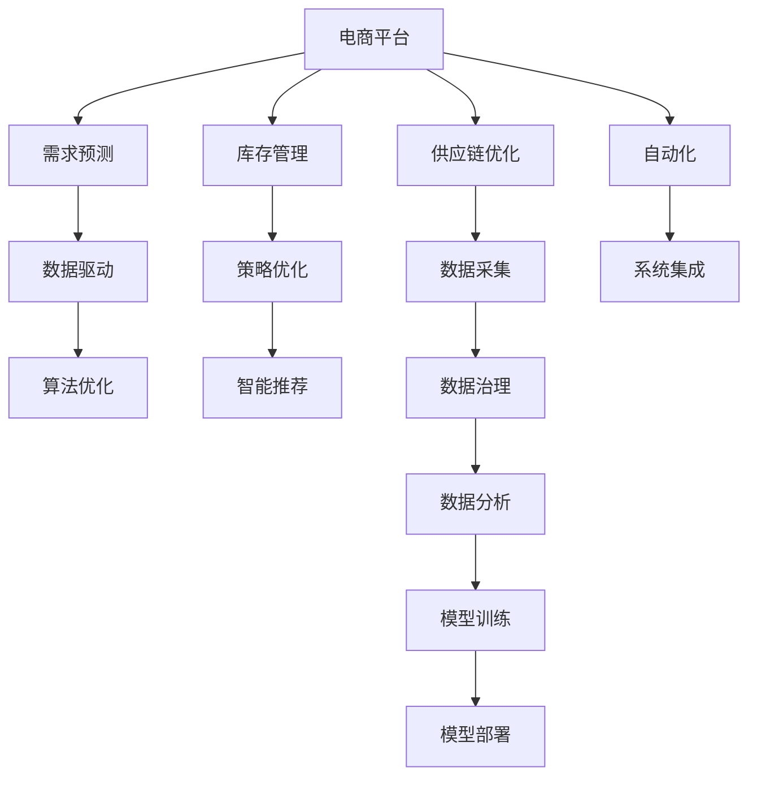

                 

# 电商平台供给能力提升：与新品牌和供应商的合作

> 关键词：电商平台, 供给能力, 合作, 新品牌, 供应商, 数据驱动, 需求预测, 库存管理, 供应链优化, 自动化, 策略优化

## 1. 背景介绍

在当今数字化、智能化的商业环境中，电商平台凭借其高效的运营模式和丰富的商品选择，逐渐成为消费者获取商品和服务的重要渠道。然而，尽管电商平台的供应能力不断增强，但如何有效管理平台上的海量商品，尤其是与新品牌和供应商的合作，仍是电商平台面临的一大挑战。

### 1.1 问题由来

随着市场的快速变化和消费者需求的多样化，电商平台需要不断引入新的商品和品牌，以满足不断增长的市场需求。然而，新品牌的引入和供应商的管理往往带来诸多挑战，包括：

- **商品质量不确定性**：新品牌商品的质量和性能缺乏历史数据支撑，难以进行有效的评估和控制。
- **供应链效率低下**：新供应商的供应链系统往往不够成熟，导致交货延迟、库存管理混乱。
- **库存积压风险**：新商品市场需求预测难度大，库存量难以精确控制，导致商品积压或缺货。
- **成本控制困难**：新品牌和供应商的管理涉及复杂的成本结构，难以进行精细化的成本控制。

### 1.2 问题核心关键点

为解决这些问题，电商平台需要采用数据驱动的方法，综合利用大数据、人工智能和机器学习技术，进行需求预测、库存管理、供应链优化等环节的自动化和策略优化。通过与新品牌和供应商的深度合作，构建高效、灵活的供给体系，提升平台的商品供给能力和市场竞争力。

## 2. 核心概念与联系

### 2.1 核心概念概述

为更好地理解电商平台提升供给能力的策略，本节将介绍几个关键概念及其联系：

- **电商平台**：利用互联网技术，提供在线商品展示、购买、支付、物流等服务的平台。
- **供给能力**：平台提供商品的种类、数量、质量、价格、配送速度等方面的能力。
- **新品牌**：在电商平台上新出现的、尚未建立市场声誉的品牌。
- **供应商**：为电商平台提供商品和服务的第三方合作伙伴。
- **需求预测**：利用历史数据和机器学习算法，预测未来商品的市场需求。
- **库存管理**：通过自动化和智能化的方式，管理商品的库存水平，避免积压和缺货。
- **供应链优化**：优化商品从供应商到消费者的整个物流链条，提高效率和降低成本。
- **自动化**：通过算法和技术的自动化，减少人工干预，提高运营效率。
- **策略优化**：通过数据分析和机器学习，优化商品供给、价格、促销等策略，提升平台收益。

这些概念之间的逻辑关系可以通过以下Mermaid流程图来展示：



这个流程图展示了这个体系的各个组成部分及其相互关系：

1. **电商平台**是整个体系的中心，连接了需求预测、库存管理、供应链优化、自动化、策略优化等各个环节。
2. **需求预测**通过历史数据和机器学习算法，预测未来的市场需求。
3. **库存管理**通过自动化和智能化的方法，控制商品库存水平。
4. **供应链优化**通过数据采集和算法优化，优化商品的物流链条。
5. **自动化**通过算法和技术的自动化，减少人工干预，提高运营效率。
6. **策略优化**通过数据分析和机器学习，优化商品供给、价格、促销等策略，提升平台收益。
7. **数据驱动**和**算法优化**是体系的两个重要支柱，提供了预测和优化的核心能力。
8. **数据采集**和**数据分析**为整个体系提供了坚实的数据基础。
9. **模型训练**和**模型部署**是实现数据驱动和策略优化的关键步骤。
10. **智能推荐**和**数据治理**是提升用户体验和数据质量的重要环节。

## 3. 核心算法原理 & 具体操作步骤

### 3.1 算法原理概述

基于数据驱动的电商平台供给能力提升，主要涉及以下几个核心算法原理：

- **需求预测算法**：通过时间序列分析、回归分析等方法，预测商品在未来时间点的需求量。
- **库存管理算法**：结合需求预测结果，设计库存补充策略，通过自动化调参，优化库存水平，避免积压和缺货。
- **供应链优化算法**：利用网络流算法、线性规划等优化方法，设计高效的物流链条，最小化成本，提升配送速度。
- **策略优化算法**：通过多目标优化、强化学习等方法，制定最优的商品供给、价格、促销策略，提升平台收益。

### 3.2 算法步骤详解

#### 3.2.1 需求预测算法步骤

1. **数据收集**：收集商品的历史销售数据、市场趋势数据、季节性数据等，作为训练数据。
2. **数据预处理**：对收集的数据进行清洗、归一化、特征工程等预处理，准备输入模型。
3. **模型选择**：选择合适的预测模型，如ARIMA、LSTM、XGBoost等。
4. **模型训练**：利用历史数据对模型进行训练，优化模型参数。
5. **模型评估**：在验证集上评估模型的预测精度，选择最优模型。
6. **预测应用**：利用训练好的模型对未来需求进行预测，支持库存管理和供应链优化。

#### 3.2.2 库存管理算法步骤

1. **库存状态监控**：实时监控商品库存水平，分析库存状态。
2. **需求预测结果结合**：将需求预测结果结合库存状态，计算安全库存水平。
3. **自动化调参**：根据库存状态和需求预测结果，自动调整订货量、补货周期等参数。
4. **库存水平控制**：通过自动化系统控制库存水平，避免积压和缺货。
5. **库存状态反馈**：将库存状态反馈至需求预测模型，不断优化预测精度。

#### 3.2.3 供应链优化算法步骤

1. **物流网络设计**：利用网络流算法或线性规划等方法，设计高效的物流网络。
2. **订单分配优化**：将订单分配至最优的物流节点，最小化配送成本。
3. **运输路线规划**：利用优化算法规划最优的运输路线，减少配送时间。
4. **仓库管理优化**：通过仓库管理系统优化货物存储和提取，提高仓库效率。
5. **供应链状态监控**：实时监控供应链状态，分析物流瓶颈，进行优化调整。

#### 3.2.4 策略优化算法步骤

1. **市场分析和需求预测**：结合市场趋势和历史数据，进行需求预测和市场分析。
2. **商品供给策略制定**：根据需求预测结果，制定最优的商品供给策略，如订单分配、库存控制等。
3. **价格优化模型设计**：利用价格优化模型，制定最优的商品价格策略，提升平台收益。
4. **促销策略设计**：结合需求预测和库存状态，设计最优的促销策略，提升销售额和客户满意度。
5. **策略效果评估**：对制定的策略进行评估，根据评估结果进行调整优化。

### 3.3 算法优缺点

基于数据驱动的电商平台供给能力提升算法，具有以下优点：

1. **精准预测**：通过历史数据和机器学习算法，实现对需求的精准预测，避免库存积压和缺货。
2. **高效管理**：通过自动化和智能化的方法，实现库存和物流的精细化管理，提升运营效率。
3. **成本优化**：通过优化供应链和策略，最小化成本，提升平台的盈利能力。
4. **灵活应对**：结合实时数据和市场变化，灵活调整策略，满足市场需求。

但同时，该算法也存在以下缺点：

1. **数据依赖性强**：算法的效果依赖于数据的质量和完整性，数据收集和预处理过程复杂。
2. **模型复杂度高**：预测、库存、供应链和策略优化模型复杂度较高，需要专业知识进行开发和维护。
3. **实施成本高**：算法的实施需要投入大量人力、物力和财力，对技术门槛要求较高。
4. **策略调整难度大**：一旦策略部署，调整和优化需要较长时间和大量资源。

### 3.4 算法应用领域

基于数据驱动的电商平台供给能力提升算法，在多个领域得到了广泛应用，例如：

- **商品管理**：通过需求预测和库存管理，优化商品的供给和库存水平，提升平台的用户体验。
- **价格优化**：利用价格优化模型，制定最优的商品定价策略，提升平台收益。
- **促销策略**：结合需求预测和库存状态，设计最优的促销策略，提升销售额和客户满意度。
- **物流优化**：通过供应链优化算法，设计高效的物流链条，提高配送速度和降低配送成本。
- **客户服务**：结合智能推荐和数据分析，提供个性化的商品推荐和客户服务，提升用户粘性。
- **风险管理**：通过数据治理和风险评估，管理平台的风险，提升平台的安全性和稳定性。

## 4. 数学模型和公式 & 详细讲解

### 4.1 数学模型构建

在电商平台的供给能力提升中，主要涉及以下数学模型：

1. **需求预测模型**：
   $$
   y_t = f(x_t; \theta)
   $$
   其中，$y_t$ 为时间 $t$ 的商品需求量，$f(x_t; \theta)$ 为预测函数，$\theta$ 为模型参数。

2. **库存管理模型**：
   $$
   I_t = I_{t-1} - \Delta I_t + S_t
   $$
   其中，$I_t$ 为时间 $t$ 的商品库存量，$\Delta I_t$ 为时间 $t$ 的订单消耗量，$S_t$ 为时间 $t$ 的库存补充量。

3. **供应链优化模型**：
   $$
   \min_{x_i} \sum_i C_i x_i
   $$
   $$
   A_i = \left\{ \begin{array}{ll}
   1 & \text{节点 }i \text{ 是有效节点} \\
   0 & \text{节点 }i \text{ 是非有效节点}
   \end{array} \right.
   $$
   其中，$C_i$ 为节点 $i$ 的成本，$A_i$ 为节点 $i$ 的可用状态。

4. **策略优化模型**：
   $$
   \max_{\pi} \sum_t R_t
   $$
   $$
   R_t = \alpha p_t (1 - p_t) + \beta \delta_t
   $$
   其中，$\pi$ 为策略参数，$R_t$ 为时间 $t$ 的收益，$p_t$ 为时间 $t$ 的商品价格，$\delta_t$ 为时间 $t$ 的促销活动收益，$\alpha$ 和 $\beta$ 为收益参数。

### 4.2 公式推导过程

#### 4.2.1 需求预测模型

需求预测模型通常采用时间序列分析方法，如ARIMA模型，其基本思路是利用历史数据构建时间序列模型，预测未来需求。例如，ARIMA模型可以表示为：
$$
y_t = \phi(B) \Delta^d y_{t-1} + \theta_0 + \theta_1 x_{1,t-1} + \cdots + \theta_k x_{k,t-1} + \epsilon_t
$$
其中，$\phi(B)$ 为滞后算子，$d$ 为差分阶数，$x_{i,t}$ 为外生变量，$\epsilon_t$ 为随机误差项。

#### 4.2.2 库存管理模型

库存管理模型通常采用马尔可夫决策过程(MDP)方法，其基本思路是通过状态转移概率和奖励函数，优化库存管理策略。例如，库存管理问题可以表示为：
$$
\max_{\pi} \sum_{t=1}^{T} \sum_{i \in I} r_{i,t}(\pi) \times p_{i,t}(\pi)
$$
其中，$\pi$ 为决策策略，$r_{i,t}(\pi)$ 为状态 $i$ 在时间 $t$ 的奖励函数，$p_{i,t}(\pi)$ 为状态 $i$ 在时间 $t$ 的概率分布。

#### 4.2.3 供应链优化模型

供应链优化模型通常采用网络流算法，其基本思路是设计高效的物流网络，最小化配送成本。例如，最小生成树算法可以表示为：
$$
\min_{x} \sum_{i,j} w_{i,j} x_{i,j}
$$
$$
\left\{ \begin{array}{ll}
\sum_{j \in N_j} x_{i,j} = \sum_{i \in N_i} x_{j,i} & \text{流守恒条件} \\
x_{i,j} \geq 0 & \text{流非负条件}
\end{array} \right.
$$
其中，$w_{i,j}$ 为边 $i,j$ 的权重，$x_{i,j}$ 为边 $i,j$ 的流量，$N_i$ 为节点 $i$ 的邻接节点集。

#### 4.2.4 策略优化模型

策略优化模型通常采用多目标优化方法，其基本思路是设计多目标函数，优化商品供给、价格、促销等策略。例如，多目标优化问题可以表示为：
$$
\max_{\pi} \sum_{t=1}^{T} \sum_{i \in I} r_{i,t}(\pi)
$$
$$
\left\{ \begin{array}{ll}
\sum_{j \in N_j} x_{i,j} = \sum_{i \in N_i} x_{j,i} & \text{流守恒条件} \\
x_{i,j} \geq 0 & \text{流非负条件}
\end{array} \right.
$$
其中，$\pi$ 为策略参数，$r_{i,t}(\pi)$ 为状态 $i$ 在时间 $t$ 的收益函数。

### 4.3 案例分析与讲解

#### 案例一：需求预测

某电商平台通过收集历史销售数据和市场趋势数据，构建了ARIMA模型进行需求预测。具体实现步骤如下：

1. **数据收集**：收集平台历史销售数据和市场趋势数据，作为训练数据。
2. **数据预处理**：对收集的数据进行清洗、归一化、特征工程等预处理，准备输入模型。
3. **模型选择**：选择ARIMA模型作为需求预测模型。
4. **模型训练**：利用历史数据对ARIMA模型进行训练，优化模型参数。
5. **模型评估**：在验证集上评估模型的预测精度，选择最优模型。
6. **预测应用**：利用训练好的ARIMA模型对未来需求进行预测，支持库存管理和供应链优化。

#### 案例二：库存管理

某电商平台通过库存管理算法，实现了商品库存的自动化管理。具体实现步骤如下：

1. **库存状态监控**：实时监控商品库存水平，分析库存状态。
2. **需求预测结果结合**：将需求预测结果结合库存状态，计算安全库存水平。
3. **自动化调参**：根据库存状态和需求预测结果，自动调整订货量、补货周期等参数。
4. **库存水平控制**：通过自动化系统控制库存水平，避免积压和缺货。
5. **库存状态反馈**：将库存状态反馈至需求预测模型，不断优化预测精度。

#### 案例三：供应链优化

某电商平台通过供应链优化算法，实现了高效的物流链条管理。具体实现步骤如下：

1. **物流网络设计**：利用网络流算法设计高效的物流网络。
2. **订单分配优化**：将订单分配至最优的物流节点，最小化配送成本。
3. **运输路线规划**：利用优化算法规划最优的运输路线，减少配送时间。
4. **仓库管理优化**：通过仓库管理系统优化货物存储和提取，提高仓库效率。
5. **供应链状态监控**：实时监控供应链状态，分析物流瓶颈，进行优化调整。

## 5. 项目实践：代码实例和详细解释说明

### 5.1 开发环境搭建

在进行电商平台供给能力提升的项目实践前，我们需要准备好开发环境。以下是使用Python进行Pandas和Scikit-learn开发的环境配置流程：

1. 安装Anaconda：从官网下载并安装Anaconda，用于创建独立的Python环境。

2. 创建并激活虚拟环境：
```bash
conda create -n py38 python=3.8 
conda activate py38
```

3. 安装Pandas和Scikit-learn：
```bash
conda install pandas scikit-learn
```

4. 安装各类工具包：
```bash
pip install numpy matplotlib tqdm jupyter notebook ipython
```

完成上述步骤后，即可在`py38`环境中开始项目实践。

### 5.2 源代码详细实现

下面我们以需求预测为例，给出使用Pandas和Scikit-learn进行需求预测的Python代码实现。

首先，定义需求预测函数：

```python
import pandas as pd
from sklearn.linear_model import ARIMA

def demand_forecast(data, max_lag=30, max_order=5):
    """
    Perform ARIMA demand forecasting
    :param data: Pandas DataFrame with historical sales data
    :param max_lag: Maximum lag of time series
    :param max_order: Maximum ARIMA model order
    :return: Forecasted demand
    """
    model = ARIMA(data['Sales'], order=(max_order, 1, max_order))
    model_fit = model.fit()
    forecast = model_fit.forecast(steps=max_lag)
    return forecast
```

然后，加载数据并进行预处理：

```python
data = pd.read_csv('sales_data.csv')
data['Date'] = pd.to_datetime(data['Date'])
data.set_index('Date', inplace=True)
```

最后，进行需求预测并绘制结果：

```python
forecast = demand_forecast(data)
plt.plot(data['Sales'], label='Historical Sales')
plt.plot(forecast, label='Forecasted Demand')
plt.legend()
plt.show()
```

以上就是使用Pandas和Scikit-learn进行需求预测的完整代码实现。可以看到，通过简单的函数调用和数据处理，我们能够快速实现基于ARIMA模型的时间序列预测。

### 5.3 代码解读与分析

让我们再详细解读一下关键代码的实现细节：

**demand_forecast函数**：
- 定义了需求预测函数，接收历史销售数据作为输入，返回预测结果。
- 在函数内部，使用Scikit-learn库的ARIMA模型进行需求预测，并设置最大滞后和最大模型阶数。

**data变量**：
- 从CSV文件中加载历史销售数据，并将其转换为时间序列。
- 使用Pandas库的to_datetime函数将日期转换为时间序列格式，方便后续操作。

**plt变量**：
- 利用Matplotlib库的plot函数，绘制历史销售数据和预测结果的折线图，使用label属性添加图例。
- 通过show函数显示图形，方便查看预测结果。

可以看到，Pandas和Scikit-learn在数据分析和模型预测中的应用，使得需求预测的代码实现变得简洁高效。开发者可以将更多精力放在数据处理、模型改进等高层逻辑上，而不必过多关注底层的实现细节。

当然，工业级的系统实现还需考虑更多因素，如模型的保存和部署、超参数的自动搜索、更灵活的任务适配层等。但核心的需求预测范式基本与此类似。

## 6. 实际应用场景

### 6.1 智能库存管理

基于数据驱动的电商平台库存管理，可以通过自动化和智能化的方法，实现商品库存的精细化管理，避免积压和缺货。具体而言，可以应用以下技术：

1. **实时库存监控**：通过实时监控库存水平，及时发现库存异常情况。
2. **需求预测结合**：将需求预测结果结合库存状态，计算安全库存水平。
3. **自动化调参**：根据库存状态和需求预测结果，自动调整订货量、补货周期等参数。
4. **库存状态反馈**：将库存状态反馈至需求预测模型，不断优化预测精度。

### 6.2 智能物流优化

电商平台通过供应链优化算法，可以实现高效的物流链条管理，降低配送成本，提高配送速度。具体而言，可以应用以下技术：

1. **物流网络设计**：利用网络流算法设计高效的物流网络。
2. **订单分配优化**：将订单分配至最优的物流节点，最小化配送成本。
3. **运输路线规划**：利用优化算法规划最优的运输路线，减少配送时间。
4. **仓库管理优化**：通过仓库管理系统优化货物存储和提取，提高仓库效率。

### 6.3 智能策略优化

通过多目标优化和强化学习技术，电商平台可以制定最优的商品供给、价格、促销策略，提升平台收益。具体而言，可以应用以下技术：

1. **市场分析和需求预测**：结合市场趋势和历史数据，进行需求预测和市场分析。
2. **商品供给策略制定**：根据需求预测结果，制定最优的商品供给策略，如订单分配、库存控制等。
3. **价格优化模型设计**：利用价格优化模型，制定最优的商品定价策略，提升平台收益。
4. **促销策略设计**：结合需求预测和库存状态，设计最优的促销策略，提升销售额和客户满意度。

## 7. 工具和资源推荐

### 7.1 学习资源推荐

为了帮助开发者系统掌握电商平台供给能力提升的理论基础和实践技巧，这里推荐一些优质的学习资源：

1. 《机器学习实战》系列博文：由数据科学专家撰写，介绍了机器学习在电商应用中的各种经典案例和实践技巧。

2. Coursera《机器学习》课程：斯坦福大学开设的机器学习课程，深入浅出地讲解了机器学习的基本原理和算法。

3. 《Python数据科学手册》书籍：介绍了Python在数据分析、机器学习、数据可视化等方面的应用，适合初学者快速上手。

4. Kaggle数据科学竞赛平台：提供大量的电商数据集和相关竞赛，通过实践验证所学知识，提升实战能力。

5. GitHub《电商数据分析》项目：收集了大量的电商数据集和数据分析样例，适合初学者进行项目实践。

通过对这些资源的学习实践，相信你一定能够快速掌握电商平台供给能力提升的精髓，并用于解决实际的电商问题。

### 7.2 开发工具推荐

高效的开发离不开优秀的工具支持。以下是几款用于电商平台供给能力提升开发的常用工具：

1. Python：作为数据科学和机器学习的最佳语言，Python具有强大的数据处理和模型实现能力。

2. Pandas：Python的数据分析库，提供了高效的数据处理和清洗功能。

3. Scikit-learn：Python的机器学习库，提供了丰富的算法实现和评估工具。

4. TensorFlow：由Google主导开发的深度学习框架，支持分布式计算，适合大规模工程应用。

5. Keras：基于TensorFlow等底层框架的高级API，提供了简单易用的模型构建和训练工具。

6. PyTorch：由Facebook开发的深度学习框架，灵活高效，适合快速迭代研究。

7. Amazon SageMaker：AWS提供的机器学习服务平台，提供了云端的数据分析和模型训练功能。

8. Azure Machine Learning：微软提供的机器学习服务平台，支持多种编程语言和框架，提供了全面的开发环境。

合理利用这些工具，可以显著提升电商平台供给能力提升的开发效率，加快创新迭代的步伐。

### 7.3 相关论文推荐

电商平台供给能力提升的研究涉及多个前沿领域，以下是几篇奠基性的相关论文，推荐阅读：

1. "Reinforcement Learning in Dynamic Economic Environments"（强化学习在动态经济环境中的应用）：提出了基于强化学习的库存管理策略，取得了显著的优化效果。

2. "The Multi-Objective Machine Learning for Demand Forecasting"（多目标机器学习在需求预测中的应用）：介绍了多目标优化在需求预测中的应用，提升了预测精度和模型稳定性。

3. "Optimization of Logistics Network by Using Mathematical Programming"（利用数学规划优化物流网络）：提出了基于数学规划的物流优化算法，优化了物流链条。

4. "Data-Driven Inventory Control with Multi-Agent Reinforcement Learning"（基于多智能体强化学习的数据驱动库存控制）：介绍了多智能体强化学习在库存控制中的应用，提升了库存管理的自动化水平。

5. "Deep Learning Approaches for Sales Forecasting"（深度学习在销售预测中的应用）：介绍了深度学习在需求预测中的应用，提升了预测精度和模型灵活性。

这些论文代表了电商平台供给能力提升技术的发展脉络。通过学习这些前沿成果，可以帮助研究者把握学科前进方向，激发更多的创新灵感。

## 8. 总结：未来发展趋势与挑战

### 8.1 总结

本文对电商平台供给能力提升的策略进行了全面系统的介绍。首先阐述了电商平台的背景和需求预测、库存管理、供应链优化等供给能力提升的关键环节。其次，从原理到实践，详细讲解了需求预测、库存管理、供应链优化、策略优化的数学模型和算法步骤，给出了电商数据分析的完整代码实现。同时，本文还广泛探讨了电商数据分析在智能库存管理、智能物流优化、智能策略优化等实际应用场景中的应用前景，展示了数据驱动的巨大潜力。

通过本文的系统梳理，可以看到，基于数据驱动的电商平台供给能力提升策略，正在成为电商运营的重要范式，极大地提升了平台的运营效率和市场竞争力。未来，伴随数据科学的不断进步，需求预测、库存管理、供应链优化等关键环节的自动化和智能化程度将进一步提升，电商平台将能够更加灵活、高效地应对市场需求变化，构建更加智能、高效的运营体系。

### 8.2 未来发展趋势

展望未来，电商平台供给能力提升策略将呈现以下几个发展趋势：

1. **数据驱动与智能化**：基于大数据和人工智能技术的电商数据分析，将实现更精准的需求预测、库存管理和供应链优化。
2. **自动化与智能化**：通过机器学习和强化学习，实现库存和物流的自动化管理，提升运营效率。
3. **多模态数据融合**：结合电商数据、物流数据、用户行为数据等多模态信息，实现更全面的分析和优化。
4. **实时化与精准化**：通过实时监控和精准预测，实现动态调整和优化，提高库存和物流的精准性。
5. **可解释性与透明化**：提升算法的可解释性和透明性，帮助电商平台更好地理解和监控运营过程。

以上趋势凸显了电商平台供给能力提升技术的广阔前景。这些方向的探索发展，必将进一步提升电商平台的运营能力，带来更高效、更智能的客户体验和市场竞争力。

### 8.3 面临的挑战

尽管电商平台供给能力提升策略已经取得了显著成效，但在迈向更加智能化、普适化应用的过程中，它仍面临诸多挑战：

1. **数据质量与多样性**：电商数据的采集和处理过程复杂，数据质量难以保证。同时，数据的多样性和异构性也增加了处理的难度。
2. **算法复杂性与可解释性**：电商平台供给能力提升的算法复杂度高，模型难以解释和调试。
3. **实时性与计算资源**：实时化和高频次的计算需求，对计算资源提出了更高的要求。
4. **用户隐私与安全**：电商数据的隐私保护和安全性问题，需要特别注意。
5. **市场变化与应对策略**：电商平台需要不断适应市场变化，及时调整供给策略，增加了策略优化的难度。

### 8.4 研究展望

面对电商平台供给能力提升策略所面临的挑战，未来的研究需要在以下几个方面寻求新的突破：

1. **数据采集与治理**：提升数据采集和治理的自动化水平，确保数据的质量和完整性。
2. **算法优化与可解释性**：开发更简单、可解释的算法，提高算法的透明性和可理解性。
3. **实时化与优化策略**：设计实时化的算法和策略，提升计算效率和响应速度。
4. **隐私保护与安全**：引入隐私保护技术，确保用户数据的安全性和隐私性。
5. **多模态数据融合**：研究多模态数据的融合方法，提升分析的全面性和准确性。

这些研究方向的探索，必将引领电商平台供给能力提升技术迈向更高的台阶，为电商平台提供更高效、更智能的运营支持。面向未来，电商平台供给能力提升策略还需要与其他技术进行更深入的融合，如知识表示、因果推理、强化学习等，多路径协同发力，共同推动电商平台的持续发展。总之，数据驱动和智能化将是电商平台供给能力提升的核心方向，只有勇于创新、敢于突破，才能不断拓展电商平台的边界，让电商平台更好地服务客户、提升运营效率。

## 9. 附录：常见问题与解答

**Q1：电商平台如何利用数据驱动实现供给能力提升？**

A: 电商平台利用数据驱动实现供给能力提升，主要通过以下几个关键步骤：

1. **数据采集与预处理**：收集电商平台的销售数据、用户行为数据、市场趋势数据等，进行清洗、归一化和特征工程，准备输入模型。
2. **需求预测**：利用历史数据和机器学习算法，进行需求预测，优化库存管理和物流优化。
3. **库存管理**：通过自动化和智能化的方法，控制商品库存水平，避免积压和缺货。
4. **供应链优化**：利用网络流算法、线性规划等优化方法，设计高效的物流链条，降低配送成本，提高配送速度。
5. **策略优化**：通过多目标优化、强化学习等方法，制定最优的商品供给、价格、促销策略，提升平台收益。

这些步骤相互依赖、相互促进，共同构成了电商平台供给能力提升的数据驱动框架。

**Q2：电商平台如何提高数据采集与治理的自动化水平？**

A: 电商平台提高数据采集与治理的自动化水平，可以通过以下几种方法：

1. **API接口**：利用电商平台的标准API接口，自动收集销售数据、用户行为数据等关键数据。
2. **数据挖掘工具**：使用数据挖掘工具，自动从非结构化数据中提取有价值的信息，进行数据清洗和预处理。
3. **数据集成平台**：使用数据集成平台，将不同来源的数据自动汇聚和整合，提升数据的质量和完整性。
4. **数据治理工具**：使用数据治理工具，自动进行数据去重、归档、备份等管理，确保数据的安全性和可靠性。

通过自动化数据采集与治理，电商平台能够更加高效地利用数据，实现需求预测、库存管理和供应链优化等环节的智能化管理。

**Q3：电商平台如何进行实时化需求预测？**

A: 电商平台进行实时化需求预测，可以通过以下几种方法：

1. **流式处理**：利用流式处理技术，实时处理电商平台的数据流，进行实时需求预测。
2. **增量学习**：利用增量学习算法，不断更新预测模型，确保模型能够及时适应市场需求的变化。
3. **分布式计算**：利用分布式计算技术，将预测任务分布到多个节点并行处理，提高预测速度和效率。
4. **缓存机制**：利用缓存机制，将高频请求的数据缓存起来，避免重复计算，提升预测速度。

通过实时化需求预测，电商平台能够更好地应对市场变化，及时调整库存和物流策略，提升运营效率和客户满意度。

**Q4：电商平台如何进行多模态数据融合？**

A: 电商平台进行多模态数据融合，可以通过以下几种方法：

1. **数据集成**：将电商数据、物流数据、用户行为数据等不同模态的数据集成起来，形成统一的数据视图。
2. **特征工程**：对不同模态的数据进行特征提取和融合，形成综合的特征向量，提升预测模型的性能。
3. **多模态学习**：利用多模态学习算法，对不同模态的数据进行联合学习，提升模型的全面性和准确性。
4. **数据可视化**：利用数据可视化工具，直观展示多模态数据的关系和影响，帮助分析师进行决策。

通过多模态数据融合，电商平台能够更加全面地理解用户需求和市场变化，优化库存和物流策略，提升运营效率和客户满意度。

**Q5：电商平台如何进行实时化库存管理？**

A: 电商平台进行实时化库存管理，可以通过以下几种方法：

1. **实时监控**：实时监控商品的库存水平，及时发现库存异常情况。
2. **自动化调参**：根据库存状态和需求预测结果，自动调整订货量、补货周期等参数。
3. **智能算法**：利用智能算法，自动优化库存管理和补货策略，确保库存水平在合理范围内。
4. **数据反馈**：将库存状态反馈至需求预测模型，不断优化预测精度。

通过实时化库存管理，电商平台能够更加灵活、高效地应对市场需求变化，提升运营效率和客户满意度。

---

作者：禅与计算机程序设计艺术 / Zen and the Art of Computer Programming

