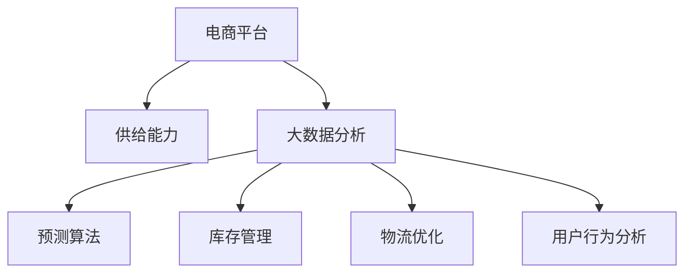

                 

# 电商平台供给能力提升：大数据分析的应用

> 关键词：电商平台、供给能力、大数据分析、预测算法、库存管理、物流优化、用户行为分析

## 1. 背景介绍

### 1.1 问题由来
在电商平台的快速发展的过程中，供给能力成为了制约其增长的瓶颈之一。如何高效地提升电商平台的供给能力，以满足日益增长的用户需求，成为了各大电商平台亟需解决的问题。

传统上，电商平台的供给能力提升主要依靠人工经验判断和简单的统计分析。然而，这种基于历史数据的分析方法往往存在预测准确率低、响应速度慢、不能实时调整等问题。而大数据分析技术的引入，为电商平台供给能力的提升提供了新的可能性。

## 2. 核心概念与联系

### 2.1 核心概念概述

为更好地理解大数据分析在电商平台供给能力提升中的应用，本节将介绍几个密切相关的核心概念：

- 电商平台：基于互联网技术的交易平台，通过连接消费者和商家，实现商品的交易与物流配送。
- 供给能力：指电商平台能够及时满足用户需求的能力，包括库存量、物流配送速度等。
- 大数据分析：通过对大规模数据的收集、处理和分析，获取有用信息和洞见的过程。
- 预测算法：利用历史数据和统计模型，预测未来事件的发生概率的算法。
- 库存管理：对电商平台库存进行实时监控和调整，以最大化库存周转率和减少库存积压。
- 物流优化：通过对物流网络的设计和优化，提升配送效率和降低物流成本。
- 用户行为分析：通过分析用户行为数据，预测用户需求和行为趋势，指导供给策略调整。

这些核心概念之间的逻辑关系可以通过以下Mermaid流程图来展示：



这个流程图展示了大数据分析在电商平台供给能力提升中的应用流程：

1. 电商平台通过大数据分析，获取供给能力的洞见。
2. 预测算法用于预测未来需求，指导库存管理。
3. 库存管理对库存进行实时监控和调整。
4. 物流优化通过改进物流网络，提升配送效率。
5. 用户行为分析用于预测用户需求，指导供给策略调整。

## 3. 核心算法原理 & 具体操作步骤
### 3.1 算法原理概述

电商平台供给能力提升的核心算法原理主要包括以下几个方面：

1. **大数据分析与供给能力评估**：通过收集和分析电商平台的历史数据，评估当前的供给能力，包括库存量、订单量、物流配送速度等。
2. **预测算法与需求预测**：利用历史数据和统计模型，预测未来需求的变化趋势，指导库存管理和物流优化。
3. **库存管理与调整**：根据需求预测结果，实时调整库存量，以最大化库存周转率和减少库存积压。
4. **物流优化与配送速度提升**：通过改进物流网络设计和优化物流配送路线，提升配送效率，降低物流成本。
5. **用户行为分析与需求引导**：通过分析用户行为数据，预测用户需求和行为趋势，指导供给策略调整，提升用户体验。

### 3.2 算法步骤详解

以下是电商平台供给能力提升的核心算法步骤详解：

1. **数据收集与预处理**：收集电商平台的历史数据，包括订单量、库存量、物流配送速度等，进行数据清洗和预处理，确保数据质量。
2. **供给能力评估**：通过统计分析方法，评估当前平台的供给能力，找出瓶颈和不足。
3. **需求预测**：利用预测算法，对未来的需求进行预测，包括订单量、商品销售量等。
4. **库存管理**：根据需求预测结果，动态调整库存量，确保库存满足需求，同时避免积压。
5. **物流优化**：改进物流网络设计，优化物流配送路线，提升配送速度和降低物流成本。
6. **用户行为分析**：分析用户行为数据，预测用户需求和行为趋势，指导供给策略调整。

### 3.3 算法优缺点

大数据分析在电商平台供给能力提升中的应用具有以下优点：

- **实时性和精准性**：大数据分析可以实时处理数据，提供准确的供给能力洞见，帮助电商平台快速响应市场需求。
- **预测准确性**：通过预测算法，可以准确预测未来需求，减少库存积压和缺货情况，提升用户体验。
- **自动化程度高**：大数据分析自动化程度高，减少了人工干预和误差，提高了供应链的效率。

同时，该方法也存在以下局限性：

- **数据质量和完整性**：大数据分析的效果很大程度上取决于数据的质量和完整性，缺失或不准确的数据会导致分析结果不可靠。
- **模型复杂度**：预测算法的复杂度较高，需要大量的计算资源，可能存在模型过拟合的风险。
- **实时性需求高**：电商平台对实时性要求高，大数据分析需要能够快速处理大量数据，以满足实时需求。

### 3.4 算法应用领域

大数据分析在电商平台供给能力提升中的应用主要包括以下几个领域：

- **库存管理**：通过大数据分析，实时监控库存状态，动态调整库存量，避免积压和缺货。
- **需求预测**：利用预测算法，对未来需求进行精准预测，指导库存管理和物流优化。
- **物流优化**：通过改进物流网络设计和优化物流配送路线，提升配送速度和降低物流成本。
- **用户行为分析**：通过分析用户行为数据，预测用户需求和行为趋势，指导供给策略调整，提升用户体验。

## 4. 数学模型和公式 & 详细讲解

### 4.1 数学模型构建

电商平台供给能力提升的数学模型主要包括以下几个方面：

- **需求预测模型**：预测未来需求，包括订单量和商品销售量。
- **库存管理模型**：根据需求预测结果，动态调整库存量。
- **物流优化模型**：通过改进物流网络设计和优化物流配送路线，提升配送速度和降低物流成本。
- **用户行为模型**：分析用户行为数据，预测用户需求和行为趋势。

### 4.2 公式推导过程

以需求预测模型为例，下面将详细推导预测模型的公式：

假设需求 $D_t$ 可以通过时间序列数据 $y_{t-1}, y_{t-2}, ..., y_{t-m}$ 进行预测，其中 $m$ 为历史数据长度。

假设需求 $D_t$ 与前 $m$ 个时间点的时间序列数据 $y_{t-1}, y_{t-2}, ..., y_{t-m}$ 存在线性关系，则可以用以下线性回归模型进行预测：

$$
D_t = \alpha + \beta_1y_{t-1} + \beta_2y_{t-2} + ... + \beta_my_{t-m} + \epsilon_t
$$

其中，$\alpha$ 为截距，$\beta_i$ 为第 $i$ 个自变量的系数，$\epsilon_t$ 为误差项。

通过最小二乘法或最大似然估计法，可以求出模型的参数 $\alpha, \beta_1, ..., \beta_m$，从而得到需求预测公式：

$$
D_t = \hat{\alpha} + \hat{\beta}_1y_{t-1} + \hat{\beta}_2y_{t-2} + ... + \hat{\beta}_my_{t-m}
$$

其中，$\hat{\alpha}, \hat{\beta}_1, ..., \hat{\beta}_m$ 为估计得到的参数值。

### 4.3 案例分析与讲解

假设某电商平台一个月的订单量数据如下（单位：订单数）：

| 时间 | 订单量 |
| --- | --- |
| 1 | 5 |
| 2 | 8 |
| 3 | 10 |
| 4 | 12 |
| 5 | 15 |
| 6 | 18 |
| 7 | 20 |
| 8 | 25 |
| 9 | 28 |
| 10 | 30 |
| 11 | 33 |
| 12 | 35 |

采用线性回归模型对下个月的订单量进行预测。根据历史数据，取 $m=5$，则线性回归模型的参数估计结果为：

$$
\hat{\alpha} = 2.25, \hat{\beta}_1 = 0.9, \hat{\beta}_2 = 0.7, \hat{\beta}_3 = 0.5, \hat{\beta}_4 = 0.3, \hat{\beta}_5 = 0.2
$$

根据预测模型公式，下个月的订单量预测值为：

$$
D_{13} = \hat{\alpha} + \hat{\beta}_1y_{12} + \hat{\beta}_2y_{11} + \hat{\beta}_3y_{10} + \hat{\beta}_4y_9 + \hat{\beta}_5y_8 = 2.25 + 0.9 \times 28 + 0.7 \times 25 + 0.5 \times 20 + 0.3 \times 18 + 0.2 \times 15 = 55
$$

预测结果表明，下个月的订单量可能达到55个。

## 5. 项目实践：代码实例和详细解释说明
### 5.1 开发环境搭建

在进行电商平台供给能力提升的实践前，我们需要准备好开发环境。以下是使用Python进行项目开发的常用工具：

1. Python环境：安装Python 3.7或更高版本，确保Python解释器能够正确运行。
2. Anaconda环境：安装Anaconda，创建虚拟Python环境，方便管理依赖。
3. 数据库：选择MySQL或PostgreSQL等关系型数据库，用于存储历史订单数据。
4. 数据处理工具：安装Pandas、NumPy等数据处理工具，用于数据清洗和预处理。
5. 预测库：安装Scikit-learn、TensorFlow等预测库，用于建立和训练预测模型。
6. 可视化工具：安装Matplotlib、Seaborn等可视化工具，用于数据可视化。

### 5.2 源代码详细实现

下面我们以需求预测模型为例，给出使用Python进行需求预测的代码实现。

首先，导入必要的库和数据：

```python
import pandas as pd
import numpy as np
from sklearn.linear_model import LinearRegression

# 导入数据
data = pd.read_csv('order_data.csv', index_col='时间', parse_dates=True)
```

然后，进行数据预处理：

```python
# 数据可视化
data.plot()

# 数据标准化
X = data['订单量'].shift(5).values.reshape(-1, 1)
y = data['订单量'].shift(0).values.reshape(-1, 1)
X = (X - np.mean(X)) / np.std(X)
y = (y - np.mean(y)) / np.std(y)
```

接着，建立线性回归模型并进行训练：

```python
# 模型训练
model = LinearRegression()
model.fit(X, y)

# 模型预测
y_pred = model.predict(X)
```

最后，进行预测结果的可视化：

```python
# 可视化预测结果
plt.plot(data.index, y_pred, label='预测结果')
plt.plot(data.index, y, label='真实值')
plt.legend()
plt.show()
```

以上代码实现了使用线性回归模型进行需求预测，并可视化预测结果。可以看到，线性回归模型可以较好地拟合历史数据，并进行未来需求的预测。

### 5.3 代码解读与分析

让我们再详细解读一下关键代码的实现细节：

**数据导入与预处理**：
- 使用Pandas库读取历史订单数据，并设置时间为索引。
- 使用NumPy库进行数据标准化，以便更好地拟合线性回归模型。

**模型建立与训练**：
- 建立线性回归模型，并使用历史数据进行训练。
- 使用历史数据的前5个时间点的订单量作为自变量，预测当前时间点的订单量。

**预测结果可视化**：
- 使用Matplotlib库可视化预测结果与真实值，便于观察模型的预测效果。

## 6. 实际应用场景
### 6.1 智能库存管理

通过大数据分析，电商平台可以实时监控库存状态，动态调整库存量，以最大化库存周转率和减少库存积压。例如，通过分析历史订单数据，预测未来的订单量，并根据预测结果动态调整库存量。

### 6.2 需求预测与市场规划

电商平台可以通过大数据分析，预测未来的需求趋势，指导市场规划。例如，根据历史订单数据和市场调研数据，预测未来的商品需求量，指导采购和库存管理，减少缺货和积压。

### 6.3 物流优化与配送速度提升

电商平台可以通过大数据分析，改进物流网络设计和优化物流配送路线，提升配送速度和降低物流成本。例如，通过分析历史订单数据和物流配送数据，预测最优的物流路径，优化物流配送路线，提升配送效率。

### 6.4 用户行为分析与个性化推荐

电商平台可以通过大数据分析，分析用户行为数据，预测用户需求和行为趋势，指导个性化推荐。例如，通过分析用户浏览、购买、评价等行为数据，预测用户的兴趣爱好和行为趋势，推荐用户感兴趣的商品。

## 7. 工具和资源推荐
### 7.1 学习资源推荐

为了帮助开发者系统掌握大数据分析在电商平台供给能力提升中的应用，这里推荐一些优质的学习资源：

1. 《Python数据分析实战》书籍：详细介绍了Python数据分析的基本方法和常用工具，包括Pandas、NumPy等。
2. 《统计学习方法》书籍：介绍了机器学习的基本概念和常用算法，包括线性回归、时间序列等。
3. 《深度学习实战》书籍：介绍了深度学习的基本概念和常用算法，包括神经网络、卷积神经网络等。
4. Coursera《机器学习》课程：斯坦福大学开设的机器学习课程，介绍了机器学习的基本概念和常用算法。
5. Kaggle数据分析竞赛：通过参加Kaggle数据分析竞赛，可以锻炼数据处理和分析能力。

通过对这些资源的学习实践，相信你一定能够快速掌握大数据分析在电商平台供给能力提升中的应用，并用于解决实际的电商平台问题。

### 7.2 开发工具推荐

高效的开发离不开优秀的工具支持。以下是几款用于电商平台供给能力提升开发的常用工具：

1. Python环境：Python 3.7或更高版本，用于数据处理和模型训练。
2. Anaconda环境：Anaconda，用于创建和管理虚拟Python环境，方便依赖管理。
3. MySQL/PostgreSQL：关系型数据库，用于存储历史订单数据。
4. Pandas、NumPy：数据处理工具，用于数据清洗和预处理。
5. Scikit-learn、TensorFlow：预测库，用于建立和训练预测模型。
6. Matplotlib、Seaborn：可视化工具，用于数据可视化。

合理利用这些工具，可以显著提升电商平台供给能力提升任务的开发效率，加快创新迭代的步伐。

### 7.3 相关论文推荐

大数据分析在电商平台供给能力提升中的应用源于学界的持续研究。以下是几篇奠基性的相关论文，推荐阅读：

1. "A Statistical Analysis of Demand Forecasting in E-Commerce"：研究了电商平台的订单量预测方法，提出了多种时间序列模型。
2. "Supply Chain Optimization with Data-Driven Demand Forecasting"：研究了基于大数据的供应链优化方法，提出了需求预测在供应链管理中的应用。
3. "A Machine Learning Approach to Inventory Management in E-Commerce"：研究了电商平台库存管理的机器学习方法，提出了基于预测算法的库存调整策略。
4. "User Behavior Analysis in E-Commerce"：研究了电商平台用户行为分析方法，提出了用户需求预测和个性化推荐的技术。

这些论文代表了大数据分析在电商平台供给能力提升领域的发展脉络。通过学习这些前沿成果，可以帮助研究者把握学科前进方向，激发更多的创新灵感。

## 8. 总结：未来发展趋势与挑战
### 8.1 总结

本文对大数据分析在电商平台供给能力提升中的应用进行了全面系统的介绍。首先阐述了大数据分析在电商平台供给能力提升的背景和意义，明确了电商平台供给能力提升的重要性。其次，从原理到实践，详细讲解了大数据分析的数学模型和操作步骤，给出了电商平台供给能力提升的完整代码实例。同时，本文还广泛探讨了大数据分析在电商平台的实际应用场景，展示了大数据分析的广泛应用。此外，本文精选了大数据分析技术的各类学习资源，力求为读者提供全方位的技术指引。

通过本文的系统梳理，可以看到，大数据分析在电商平台供给能力提升中的应用具有巨大的潜力。大数据分析可以帮助电商平台实时监控库存状态，动态调整库存量，预测未来的需求趋势，改进物流网络设计和优化物流配送路线，分析用户行为数据，指导个性化推荐，从而提升电商平台的供给能力。相信随着大数据分析技术的不断进步，电商平台供给能力提升必将迎来更加广阔的发展前景。

### 8.2 未来发展趋势

展望未来，大数据分析在电商平台供给能力提升中的应用将呈现以下几个发展趋势：

1. **智能化程度提高**：随着AI技术的不断发展，大数据分析将与AI技术深度融合，智能化程度不断提升，能够更精准地预测需求和优化供给。
2. **实时性要求更高**：电商平台对实时性要求不断提升，大数据分析需要具备更高的实时处理能力，能够实时监控库存状态和需求变化，快速调整供给策略。
3. **数据多样化**：电商平台的数据来源将更加多样化，包括社交媒体、物联网等，大数据分析需要能够处理和分析多源数据，全面掌握市场动态。
4. **预测精度提升**：大数据分析的预测模型将更加复杂和精准，能够更准确地预测未来的需求变化，指导库存管理和物流优化。
5. **用户行为深度分析**：电商平台将更加注重用户行为深度分析，通过分析用户行为数据，预测用户需求和行为趋势，指导个性化推荐和供给策略调整。

以上趋势凸显了大数据分析在电商平台供给能力提升中的广阔前景。这些方向的探索发展，必将进一步提升电商平台的供给能力，促进电商行业的健康发展。

### 8.3 面临的挑战

尽管大数据分析在电商平台供给能力提升中取得了显著效果，但在迈向更加智能化、实时化和个性化应用的过程中，它仍面临着诸多挑战：

1. **数据质量问题**：电商平台的订单数据和物流数据可能存在缺失或不准确的情况，影响大数据分析的效果。如何提高数据质量和完整性，是亟需解决的问题。
2. **计算资源需求高**：大数据分析需要处理大量的数据，计算资源需求高，可能存在资源不足的问题。如何优化算法，提高计算效率，是亟需解决的问题。
3. **实时性要求高**：电商平台对实时性要求高，大数据分析需要具备更高的实时处理能力，可能存在延迟问题。如何提高实时性，是亟需解决的问题。
4. **数据隐私和安全问题**：电商平台的用户数据可能存在隐私和安全问题，如何保护用户数据隐私，是亟需解决的问题。
5. **模型解释性和透明性问题**：大数据分析的预测模型可能存在黑盒问题，缺乏解释性和透明性，如何提高模型可解释性和透明性，是亟需解决的问题。

### 8.4 研究展望

面对大数据分析在电商平台供给能力提升中面临的挑战，未来的研究需要在以下几个方面寻求新的突破：

1. **多源数据融合**：研究如何整合多源数据，提高数据质量和完整性，全面掌握市场动态。
2. **实时计算优化**：研究如何优化大数据分析的计算资源和算法，提高实时处理能力，满足电商平台对实时性的需求。
3. **模型可解释性提升**：研究如何提高大数据分析模型的可解释性和透明性，增强模型的可信度和可用性。
4. **隐私保护技术**：研究如何保护电商平台的隐私数据，确保用户数据的安全和隐私。
5. **预测模型改进**：研究如何改进大数据分析的预测模型，提高预测精度和鲁棒性，指导电商平台的供给管理。

这些研究方向的探索，必将引领大数据分析在电商平台供给能力提升领域迈向更高的台阶，为电商平台的健康发展提供有力的技术支持。总之，大数据分析技术需要不断创新和突破，才能更好地满足电商平台的供给管理需求，推动电商行业的发展。

## 9. 附录：常见问题与解答

**Q1：电商平台在应用大数据分析时，需要处理哪些数据？**

A: 电商平台在应用大数据分析时，需要处理的数据包括：

1. 订单数据：包括订单数量、订单时间、订单金额等，用于预测未来订单量和指导库存管理。
2. 库存数据：包括库存量、库存时间、库存商品等，用于实时监控库存状态和动态调整库存量。
3. 物流数据：包括物流配送时间、物流路径、物流成本等，用于优化物流网络和配送路线。
4. 用户行为数据：包括用户浏览、购买、评价等行为数据，用于分析用户需求和行为趋势，指导个性化推荐和供给策略调整。

**Q2：电商平台在应用大数据分析时，需要注意哪些问题？**

A: 电商平台在应用大数据分析时，需要注意以下问题：

1. 数据质量问题：电商平台的订单数据和物流数据可能存在缺失或不准确的情况，需要进行数据清洗和预处理。
2. 数据隐私问题：电商平台的订单数据和用户数据可能涉及用户隐私，需要进行数据保护和隐私保护。
3. 实时性问题：电商平台对实时性要求高，大数据分析需要具备更高的实时处理能力，满足电商平台对实时性的需求。
4. 计算资源问题：大数据分析需要处理大量的数据，计算资源需求高，需要进行资源优化和算法改进。
5. 模型解释性问题：大数据分析的预测模型可能存在黑盒问题，需要进行模型可解释性和透明性的提升。

**Q3：电商平台在应用大数据分析时，有哪些具体应用场景？**

A: 电商平台在应用大数据分析时，具体应用场景包括：

1. 库存管理：通过分析历史订单数据，预测未来的订单量，并根据预测结果动态调整库存量，最大化库存周转率和减少库存积压。
2. 需求预测：利用历史订单数据和市场调研数据，预测未来的商品需求量，指导采购和库存管理，减少缺货和积压。
3. 物流优化：通过分析历史订单数据和物流配送数据，预测最优的物流路径，优化物流配送路线，提升配送效率和降低物流成本。
4. 用户行为分析：通过分析用户浏览、购买、评价等行为数据，预测用户的兴趣爱好和行为趋势，推荐用户感兴趣的商品。

这些应用场景展示了大数据分析在电商平台供给能力提升中的广泛应用和巨大潜力。

---

作者：禅与计算机程序设计艺术 / Zen and the Art of Computer Programming

