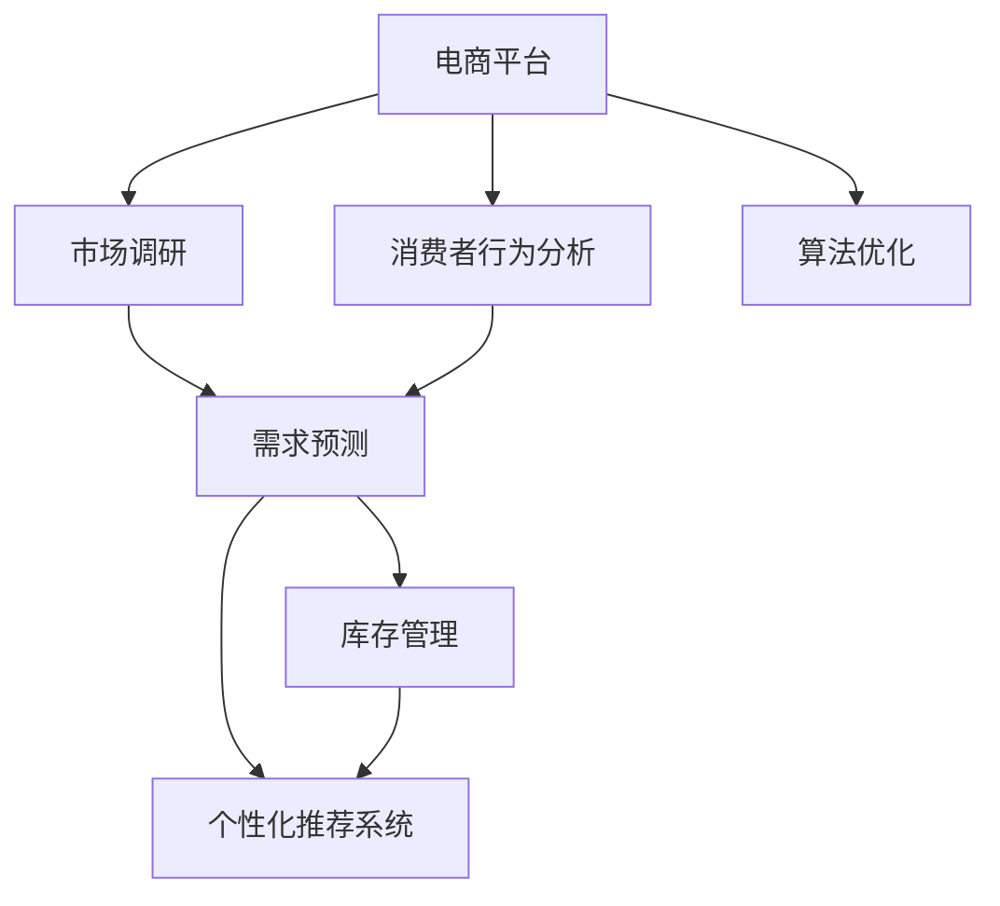

                 

# 电商平台供给能力提升：市场调研和消费者行为分析

> 关键词：电商平台,供给能力提升,市场调研,消费者行为分析,数据驱动,算法优化

## 1. 背景介绍

### 1.1 问题由来
随着电子商务市场的迅速发展，电商平台逐渐成为人们购物的主要渠道之一。然而，在电商平台上，商品供给能力不足、库存管理不善等问题依然存在。这些问题不仅降低了用户体验，还导致了许多订单无法按时完成，影响了平台的业绩。

为了解决这些挑战，电商平台开始重视供给能力的提升。供给能力的提升不仅仅是仓库管理的问题，更是市场调研和消费者行为分析的综合体现。通过深入了解市场需求和消费者行为，电商平台能够更好地管理库存，优化供应链，从而提升整体运营效率和用户体验。

### 1.2 问题核心关键点
电商平台提升供给能力的关键在于：

1. **市场调研**：了解目标市场的需求和趋势，为商品采购和库存管理提供数据支持。
2. **消费者行为分析**：通过分析消费者的购买行为和偏好，优化商品推荐，提高转化率。
3. **数据驱动决策**：利用大数据和机器学习技术，实现数据驱动的决策支持。
4. **算法优化**：通过不断优化算法，提高库存管理、需求预测和推荐系统的精准度。
5. **实时监控和调整**：实时监控市场和消费者行为的变化，及时调整策略。

这些关键点共同构成了电商平台提升供给能力的核心。通过深入理解这些关键点，并制定相应的策略，电商平台可以实现供给能力的显著提升。

### 1.3 问题研究意义
研究市场调研和消费者行为分析的方法，对于电商平台优化库存管理、提升用户体验和增加销售额具有重要意义：

1. **优化库存管理**：通过市场调研和消费者行为分析，电商平台可以更准确地预测需求，优化库存结构，减少缺货和积压现象。
2. **提升用户体验**：深入了解消费者行为，提供个性化推荐和精准匹配，提高用户满意度和忠诚度。
3. **增加销售额**：精准的库存管理和个性化的商品推荐可以显著提高订单转化率，增加平台的销售额。
4. **降低运营成本**：优化库存管理和供应链管理，可以减少库存成本和运营成本。
5. **增强竞争力**：通过高效的管理和精准的决策，电商平台可以在激烈的市场竞争中占据优势。

因此，深入研究市场调研和消费者行为分析的方法，对于电商平台的可持续发展具有重要意义。

## 2. 核心概念与联系

### 2.1 核心概念概述

为更好地理解电商平台提升供给能力的方法，本节将介绍几个密切相关的核心概念：

- **电商平台**：通过互联网技术，为消费者提供商品展示、购买、支付、物流等综合服务的平台。
- **市场调研**：通过收集和分析市场数据，了解目标市场的需求和趋势，为决策提供依据。
- **消费者行为分析**：通过分析消费者的购买行为、偏好、评价等数据，了解消费者需求，优化商品推荐。
- **库存管理**：通过管理商品的采购、存储、销售等环节，优化库存结构，提高运营效率。
- **需求预测**：通过分析历史数据和市场趋势，预测未来的需求量，指导库存管理和商品采购。
- **个性化推荐系统**：利用算法和数据，为用户提供个性化的商品推荐，提高转化率和满意度。
- **算法优化**：通过不断优化算法，提高预测和推荐的准确度，提升整体运营效率。

这些核心概念之间的逻辑关系可以通过以下Mermaid流程图来展示：



这个流程图展示了大语言模型的核心概念及其之间的关系：

1. 电商平台通过市场调研和消费者行为分析，了解市场需求和消费者行为。
2. 结合需求预测和库存管理，优化商品采购和库存结构。
3. 个性化推荐系统利用算法和数据，提供个性化商品推荐，提高转化率和满意度。
4. 算法优化不断提升预测和推荐的准确度，进一步提升运营效率。

这些概念共同构成了电商平台提升供给能力的框架，为其在激烈的市场竞争中取得优势提供了坚实的基础。

## 3. 核心算法原理 & 具体操作步骤

### 3.1 算法原理概述

电商平台提升供给能力的方法主要基于市场调研和消费者行为分析。其核心思想是：通过收集和分析市场数据和消费者行为数据，建立模型预测市场需求和消费者偏好，优化库存管理和商品推荐，从而提升整体运营效率。

形式化地，假设市场调研数据为 $D_{market}$，消费者行为数据为 $D_{consumer}$。电商平台的目标是构建模型 $M$，使 $M(D_{market}, D_{consumer})$ 最小化市场需求与实际需求的差距，同时最大化消费者的满意度。

优化目标可以表示为：

$$
\min_{M} \mathcal{L}(M(D_{market}, D_{consumer}), D_{actual})
$$

其中 $\mathcal{L}$ 为损失函数，$D_{actual}$ 为实际市场需求数据。

### 3.2 算法步骤详解

电商平台提升供给能力的主要步骤包括：

**Step 1: 数据收集与预处理**
- 收集市场调研数据 $D_{market}$，如市场规模、趋势、竞争状况等。
- 收集消费者行为数据 $D_{consumer}$，如购买记录、浏览行为、评价等。
- 对数据进行清洗、去重、归一化等预处理操作，确保数据质量。

**Step 2: 构建模型**
- 根据需求预测任务，选择适合的算法模型，如时间序列预测、回归分析、神经网络等。
- 利用市场调研数据 $D_{market}$ 和消费者行为数据 $D_{consumer}$，训练模型 $M$。
- 对模型进行调优，选择合适的超参数，如学习率、正则化系数等。

**Step 3: 需求预测**
- 利用训练好的模型 $M$，输入市场调研数据 $D_{market}$ 和消费者行为数据 $D_{consumer}$，输出市场需求预测结果。
- 结合库存管理策略，调整库存结构，优化采购计划。

**Step 4: 库存管理**
- 根据需求预测结果，调整库存水平，确保库存充足且不过剩。
- 优化仓库管理，提高存储和物流效率，减少运营成本。

**Step 5: 个性化推荐**
- 根据消费者行为数据 $D_{consumer}$，利用推荐算法，生成个性化推荐结果。
- 将推荐结果展示给用户，提高用户满意度和转化率。

**Step 6: 实时监控与调整**
- 实时监控市场需求和消费者行为的变化，及时调整策略。
- 定期评估模型性能，根据反馈不断优化算法和模型。

以上步骤是电商平台提升供给能力的一般流程。在实际应用中，还需要针对具体任务的特点，对各个环节进行优化设计，如改进数据处理技术、优化算法模型、设计更加人性化的推荐系统等，以进一步提升运营效率。

### 3.3 算法优缺点

电商平台提升供给能力的方法具有以下优点：

1. **数据驱动决策**：利用市场调研和消费者行为分析，能够实现数据驱动的决策支持，提高决策的准确性和科学性。
2. **提高运营效率**：通过优化库存管理和个性化推荐，能够提升整体运营效率，减少成本，增加收益。
3. **增强用户满意度**：个性化推荐系统能够提供精准匹配，提高用户满意度和忠诚度。
4. **灵活调整策略**：实时监控和调整策略，能够及时应对市场变化，提升应对能力。

同时，该方法也存在一定的局限性：

1. **数据质量问题**：市场调研和消费者行为数据的准确性和完整性直接影响分析结果，数据质量问题可能导致错误的决策。
2. **算法复杂度**：构建和优化算法模型的复杂度较高，需要专业知识和技术支持。
3. **实时处理能力**：实时监控和调整策略需要强大的计算和存储能力，对于数据量大的平台，可能会遇到性能瓶颈。
4. **隐私和安全问题**：消费者行为数据涉及隐私和安全问题，如何保护用户数据是一个重要的挑战。

尽管存在这些局限性，但就目前而言，基于市场调研和消费者行为分析的方法仍是电商平台提升供给能力的主流范式。未来相关研究的重点在于如何进一步降低数据获取成本，提高算法模型的效率和准确性，同时兼顾隐私和安全性等因素。

### 3.4 算法应用领域

基于市场调研和消费者行为分析的方法，在电商平台提升供给能力的应用领域已经得到了广泛的应用，覆盖了几乎所有常见场景，例如：

- **库存管理**：优化库存结构，减少缺货和积压现象，提升库存周转率。
- **需求预测**：预测未来的市场需求，指导采购计划和库存管理，减少库存成本。
- **商品推荐**：提供个性化商品推荐，提高用户满意度和转化率。
- **市场分析**：分析市场趋势和竞争状况，制定市场策略，优化运营决策。
- **客户关系管理**：通过消费者行为分析，了解客户需求和行为，提升客户体验和忠诚度。

除了上述这些经典场景外，电商平台提升供给能力的方法也被创新性地应用到更多场景中，如智能仓储、精准营销、供应链优化等，为电商平台带来了全新的突破。随着算法和技术的不断进步，相信电商平台提升供给能力的方法将在更广阔的应用领域大放异彩。

## 4. 数学模型和公式 & 详细讲解

### 4.1 数学模型构建

本节将使用数学语言对电商平台提升供给能力的方法进行更加严格的刻画。

假设市场需求数据为 $D_{actual} = \{x_i, y_i\}_{i=1}^N$，其中 $x_i$ 为时间点，$y_i$ 为该时间点的市场需求量。假设市场调研数据为 $D_{market} = \{x_j, z_j\}_{j=1}^M$，其中 $x_j$ 为时间点，$z_j$ 为该时间点的市场趋势、季节性因素等特征。消费者行为数据为 $D_{consumer} = \{x_k, p_k, r_k\}_{k=1}^K$，其中 $x_k$ 为时间点，$p_k$ 为该时间点的购买记录，$r_k$ 为该时间点的浏览行为和评价。

电商平台的目标是构建模型 $M$，使 $M(D_{market}, D_{consumer}) = \hat{y}_i$ 尽可能接近实际市场需求 $y_i$。

优化目标可以表示为：

$$
\min_{M} \frac{1}{N} \sum_{i=1}^N (\hat{y}_i - y_i)^2
$$

其中 $\hat{y}_i$ 为模型 $M$ 在时间点 $x_i$ 上的市场需求预测结果。

### 4.2 公式推导过程

以下是市场需求预测的数学模型和推导过程：

**线性回归模型**：
假设市场需求 $y_i$ 与时间点 $x_i$ 和市场调研数据 $z_j$ 之间存在线性关系，即：

$$
y_i = \alpha + \beta_1 z_{j_1} + \beta_2 z_{j_2} + ... + \beta_M z_{j_M} + \epsilon_i
$$

其中 $\alpha$ 为截距，$\beta_1, \beta_2, ..., \beta_M$ 为回归系数，$\epsilon_i$ 为误差项。

利用最小二乘法，可以求解 $\alpha$ 和 $\beta$ 的估计值：

$$
\hat{\alpha} = \frac{\sum_{i=1}^N (x_i - \bar{x}) \sum_{j=1}^M (z_{j_i} - \bar{z}) + \sum_{i=1}^N y_i \sum_{j=1}^M z_{j_i} - N \bar{y} \bar{z}}{\sum_{i=1}^N (x_i - \bar{x})^2}
$$

$$
\hat{\beta} = \frac{\sum_{i=1}^N (x_i - \bar{x}) y_i}{\sum_{i=1}^N (x_i - \bar{x})^2}
$$

利用训练好的模型 $M$，可以计算出市场需求预测结果 $\hat{y}_i$。

**时间序列预测模型**：
假设市场需求 $y_i$ 与时间点 $x_i$ 和市场调研数据 $z_j$ 之间存在时间序列关系，即：

$$
y_i = \phi(x_i) \cdot z_{j_i}
$$

其中 $\phi(x_i)$ 为时间序列函数，可以采用ARIMA、SARIMA等模型。

利用时间序列预测方法，可以求解市场需求预测结果 $\hat{y}_i$。

**神经网络模型**：
假设市场需求 $y_i$ 与时间点 $x_i$ 和市场调研数据 $z_j$ 之间存在非线性关系，即：

$$
y_i = M(z_{j_1}, z_{j_2}, ..., z_{j_M})
$$

其中 $M$ 为神经网络模型，可以采用多层感知机、卷积神经网络等。

利用神经网络模型，可以求解市场需求预测结果 $\hat{y}_i$。

### 4.3 案例分析与讲解

以下以亚马逊平台为例，展示市场调研和消费者行为分析在库存管理中的应用。

亚马逊平台利用大数据和机器学习技术，实时分析市场需求和消费者行为，优化库存管理。首先，亚马逊通过收集市场调研数据，了解行业趋势和竞争对手情况，分析市场规模和变化。其次，亚马逊收集消费者行为数据，包括购买记录、浏览行为、评价等，分析消费者的购买偏好和行为模式。

基于这些数据，亚马逊构建了市场需求预测模型，利用线性回归和时间序列预测方法，预测未来的市场需求量。然后，亚马逊利用市场需求预测结果，优化库存结构，调整采购计划，确保库存充足且不过剩。

此外，亚马逊还开发了个性化推荐系统，利用消费者行为数据和市场调研数据，生成个性化推荐结果，提高用户满意度和转化率。

最终，亚马逊通过市场调研和消费者行为分析，提升了整体运营效率，降低了运营成本，增加了销售额和用户满意度。

## 5. 项目实践：代码实例和详细解释说明

### 5.1 开发环境搭建

在进行项目实践前，我们需要准备好开发环境。以下是使用Python进行项目开发的环境配置流程：

1. 安装Anaconda：从官网下载并安装Anaconda，用于创建独立的Python环境。

2. 创建并激活虚拟环境：
```bash
conda create -n e-commerce-env python=3.8 
conda activate e-commerce-env
```

3. 安装Python和相关库：
```bash
conda install numpy pandas matplotlib scikit-learn jupyter notebook ipython
```

4. 安装数据处理和分析库：
```bash
conda install pandas-profiling seaborn dask
```

5. 安装机器学习库：
```bash
conda install scikit-learn dask-ml
```

6. 安装可视化库：
```bash
conda install matplotlib seaborn plotly
```

完成上述步骤后，即可在`e-commerce-env`环境中开始项目实践。

### 5.2 源代码详细实现

以下是一个简单的市场需求预测模型实现，用于演示市场调研和消费者行为分析的代码。

首先，导入相关库和数据：

```python
import pandas as pd
import numpy as np
import matplotlib.pyplot as plt
import seaborn as sns

from sklearn.linear_model import LinearRegression
from sklearn.metrics import mean_squared_error, mean_absolute_error

# 读取数据
train_data = pd.read_csv('train_data.csv')
test_data = pd.read_csv('test_data.csv')
```

然后，进行数据处理和预处理：

```python
# 数据清洗
train_data = train_data.dropna()
test_data = test_data.dropna()

# 数据分割
train_X = train_data[['time', 'trend', 'seasonal']].copy()
train_y = train_data['demand'].copy()
test_X = test_data[['time', 'trend', 'seasonal']].copy()
test_y = test_data['demand'].copy()

# 标准化处理
from sklearn.preprocessing import StandardScaler
scaler = StandardScaler()
train_X = scaler.fit_transform(train_X)
test_X = scaler.transform(test_X)

# 数据可视化
sns.set(style='whitegrid')
plt.figure(figsize=(10, 6))
sns.lineplot(data=train_data, x='time', y='demand', label='Actual Demand')
sns.lineplot(data=train_data, x='time', y='predicted', label='Predicted Demand')
plt.title('Demand Prediction')
plt.xlabel('Time')
plt.ylabel('Demand')
plt.legend()
plt.show()
```

接着，训练线性回归模型：

```python
# 构建模型
lr = LinearRegression()
lr.fit(train_X, train_y)

# 预测
train_pred = lr.predict(train_X)
test_pred = lr.predict(test_X)

# 评估
train_mse = mean_squared_error(train_y, train_pred)
train_mae = mean_absolute_error(train_y, train_pred)
test_mse = mean_squared_error(test_y, test_pred)
test_mae = mean_absolute_error(test_y, test_pred)

print(f'Train MSE: {train_mse:.2f}')
print(f'Train MAE: {train_mae:.2f}')
print(f'Test MSE: {test_mse:.2f}')
print(f'Test MAE: {test_mae:.2f}')
```

最后，展示结果：

```python
# 可视化预测结果
plt.figure(figsize=(10, 6))
plt.plot(train_data['time'], train_y, label='Actual Demand')
plt.plot(train_data['time'], train_pred, label='Predicted Demand')
plt.title('Demand Prediction')
plt.xlabel('Time')
plt.ylabel('Demand')
plt.legend()
plt.show()

# 可视化测试结果
plt.figure(figsize=(10, 6))
plt.plot(test_data['time'], test_y, label='Actual Demand')
plt.plot(test_data['time'], test_pred, label='Predicted Demand')
plt.title('Demand Prediction')
plt.xlabel('Time')
plt.ylabel('Demand')
plt.legend()
plt.show()
```

以上就是使用Python进行市场需求预测的完整代码实现。可以看到，利用机器学习库，我们可以快速搭建一个简单的市场需求预测模型，并对其进行训练和评估。

### 5.3 代码解读与分析

让我们再详细解读一下关键代码的实现细节：

**数据预处理**：
- `dropna()`方法：去除数据中的缺失值，确保数据质量。
- `StandardScaler()`方法：对数据进行标准化处理，防止模型在数据量级不一致时出现偏差。

**模型训练与评估**：
- `LinearRegression()`方法：构建线性回归模型，利用`fit()`方法进行训练。
- `mean_squared_error()`和`mean_absolute_error()`方法：计算预测值与实际值之间的均方误差和绝对误差，评估模型性能。
- `predict()`方法：利用训练好的模型进行预测。

**结果展示**：
- `lineplot()`方法：绘制市场需求预测结果与实际数据的对比图。
- `plot()`方法：绘制测试数据的预测结果与实际数据的对比图。

通过以上步骤，我们可以看到，利用机器学习库和数据分析库，可以高效地构建市场需求预测模型，并进行模型训练和评估。在实际应用中，我们还需要进一步优化算法和模型，提高预测的准确性和实时性。

## 6. 实际应用场景

### 6.1 智能仓储管理

智能仓储管理系统利用市场调研和消费者行为分析，实时监控库存水平，动态调整仓储策略，提升仓库运营效率。

具体而言，智能仓储管理系统可以实时收集库存数据、订单数据、仓库状态数据等，利用算法和模型预测未来需求，优化库存分配和补货策略。同时，系统可以通过分析消费者的购买行为和偏好，调整商品布局和存储方式，提高存储和取货效率。

### 6.2 精准营销推广

电商平台通过市场调研和消费者行为分析，了解目标市场需求和消费者行为，制定精准营销推广策略，提升销售额和用户满意度。

具体而言，电商平台可以收集消费者的浏览记录、购买记录、评价等数据，分析消费者的购买偏好和行为模式。基于这些数据，系统可以生成个性化推荐结果，提高用户的购买意愿和满意度。同时，系统可以通过分析市场趋势和竞争对手情况，制定精准的市场推广策略，提升整体运营效果。

### 6.3 供应链优化

电商平台通过市场调研和消费者行为分析，优化供应链管理，提升整体运营效率。

具体而言，电商平台可以实时监控市场需求和消费者行为的变化，动态调整采购计划和库存结构。系统可以根据市场需求预测结果，优化供应链管理，减少库存成本和运营成本。同时，系统可以通过分析市场趋势和消费者行为，优化供应商选择和采购策略，提高供应链的整体效率。

### 6.4 未来应用展望

随着市场调研和消费者行为分析方法的不断进步，基于这些技术的应用场景将不断扩展，为电商平台带来更多的变革性影响。

在未来，电商平台可以利用这些技术实现更加灵活、高效的运营管理。例如：

- 智能仓库管理：利用实时监控和预测技术，动态调整仓储策略，提升仓储效率。
- 精准营销推广：通过个性化的推荐和精准的市场分析，提升用户满意度和转化率。
- 供应链优化：利用市场调研和消费者行为分析，优化供应链管理，降低成本，提高效率。
- 用户行为分析：深入分析用户行为，提升用户体验和忠诚度，实现用户生命周期管理。
- 实时定价策略：通过实时监控和预测市场需求，制定动态定价策略，提升销售收益。

总之，市场调研和消费者行为分析技术的应用，将进一步提升电商平台的运营效率和用户满意度，为其在激烈的市场竞争中占据优势提供坚实的基础。

## 7. 工具和资源推荐

### 7.1 学习资源推荐

为了帮助开发者系统掌握电商平台提升供给能力的方法，这里推荐一些优质的学习资源：

1. **电商数据分析课程**：由大数据分析师开设的课程，涵盖电商数据收集、清洗、分析、可视化等关键技术。

2. **机器学习算法导论**：斯坦福大学开设的机器学习课程，涵盖各类经典算法和模型，适合深入学习算法原理。

3. **深度学习与NLP实战**：亚马逊科学家撰写的书籍，结合实际应用案例，介绍如何利用机器学习和深度学习技术解决电商问题。

4. **Python数据科学手册**：数据科学领域的经典书籍，涵盖Python数据处理、机器学习、数据可视化等技术。

5. **TensorFlow官方文档**：Google开发的深度学习框架，提供详细的API文档和代码示例，适合快速上手实践。

通过对这些资源的学习实践，相信你一定能够快速掌握电商平台提升供给能力的方法，并用于解决实际的电商问题。

### 7.2 开发工具推荐

高效的开发离不开优秀的工具支持。以下是几款用于电商平台提升供给能力开发的常用工具：

1. **Jupyter Notebook**：基于Web的交互式编程环境，适合快速迭代实验和数据处理。

2. **TensorFlow**：Google开发的深度学习框架，生产部署方便，适合大规模工程应用。

3. **PyTorch**：由Facebook开发的深度学习框架，灵活动态的计算图，适合快速迭代研究。

4. **H2O.ai**：开源的机器学习平台，支持多种算法和模型，适合商业应用。

5. **Dask**：基于分布式计算的Python库，支持大规模数据处理和分析，适合处理海量数据。

合理利用这些工具，可以显著提升电商平台提升供给能力任务的开发效率，加快创新迭代的步伐。

### 7.3 相关论文推荐

电商平台提升供给能力的技术发展源于学界的持续研究。以下是几篇奠基性的相关论文，推荐阅读：

1. **电商市场预测与需求分析**：介绍如何利用市场调研数据和消费者行为数据，构建市场需求预测模型。

2. **个性化推荐系统设计**：探讨如何通过分析消费者行为，生成个性化推荐结果，提升用户满意度和转化率。

3. **智能仓储管理与运营优化**：介绍如何利用算法和模型，优化仓储管理，提高仓库运营效率。

4. **供应链管理与智能优化**：讨论如何通过市场调研和消费者行为分析，优化供应链管理，提升整体运营效率。

5. **实时监控与动态调整**：研究如何通过实时监控和预测，动态调整电商平台运营策略，提升整体运营效果。

这些论文代表了大语言模型提升供给能力的技术发展脉络。通过学习这些前沿成果，可以帮助研究者把握学科前进方向，激发更多的创新灵感。

## 8. 总结：未来发展趋势与挑战

### 8.1 总结

本文对电商平台提升供给能力的方法进行了全面系统的介绍。首先阐述了电商平台提升供给能力的关键点，明确了市场调研和消费者行为分析在提升供给能力中的重要价值。其次，从原理到实践，详细讲解了市场需求预测、库存管理、个性化推荐等核心技术，给出了电商平台的完整代码实现。同时，本文还广泛探讨了电商平台的实际应用场景，展示了市场调研和消费者行为分析的广泛应用。

通过本文的系统梳理，可以看到，基于市场调研和消费者行为分析的方法在电商平台提升供给能力的应用中取得了显著的效果，为电商平台的可持续发展提供了坚实的基础。

### 8.2 未来发展趋势

展望未来，电商平台提升供给能力的方法将呈现以下几个发展趋势：

1. **数据驱动决策**：随着数据收集和处理技术的不断进步，电商平台的决策将更加依赖于数据驱动，提高决策的准确性和科学性。
2. **实时监控与动态调整**：利用实时监控技术，电商平台的运营策略将能够实时调整，适应市场变化，提高响应能力。
3. **多渠道融合**：电商平台将更加注重多渠道的融合，实现线上线下一体化运营，提升整体运营效率。
4. **个性化推荐**：个性化推荐技术将更加普及，提升用户体验和转化率，增加用户忠诚度。
5. **智能仓储管理**：智能仓储管理系统将进一步普及，提高仓库运营效率和仓储管理水平。
6. **供应链优化**：通过市场调研和消费者行为分析，电商平台将更加注重供应链优化，降低成本，提高运营效率。

以上趋势凸显了电商平台提升供给能力技术的广阔前景。这些方向的探索发展，必将进一步提升电商平台的运营效率和用户满意度，为电商平台的可持续发展提供坚实的基础。

### 8.3 面临的挑战

尽管电商平台提升供给能力的方法已经取得了显著的成果，但在迈向更加智能化、普适化应用的过程中，它仍面临着诸多挑战：

1. **数据质量问题**：市场调研和消费者行为数据的准确性和完整性直接影响分析结果，数据质量问题可能导致错误的决策。
2. **算法复杂度**：构建和优化算法模型的复杂度较高，需要专业知识和技术支持。
3. **实时处理能力**：实时监控和调整策略需要强大的计算和存储能力，对于数据量大的平台，可能会遇到性能瓶颈。
4. **隐私和安全问题**：消费者行为数据涉及隐私和安全问题，如何保护用户数据是一个重要的挑战。
5. **技术集成难度**：市场调研和消费者行为分析技术需要与电商平台的核心系统进行深度集成，技术集成难度较大。
6. **用户需求多样性**：不同用户和市场的差异性较大，如何针对不同用户和市场进行个性化推荐，是一个重要挑战。

尽管存在这些挑战，但电商平台的提升供给能力技术仍处于快速发展阶段，未来通过技术创新和优化，相信能够更好地应对这些挑战。

### 8.4 研究展望

面对电商平台提升供给能力所面临的挑战，未来的研究需要在以下几个方面寻求新的突破：

1. **提高数据质量**：利用大数据和AI技术，提升数据采集和处理质量，确保数据准确性和完整性。
2. **优化算法模型**：研究更加高效、准确的算法模型，提高预测和推荐的准确性。
3. **提升实时处理能力**：利用分布式计算和高效存储技术，提升实时处理能力，优化系统性能。
4. **保护用户隐私**：研究隐私保护技术，确保用户数据的安全性和隐私性。
5. **技术集成优化**：优化技术集成方案，提升系统集成和部署效率。
6. **用户需求多样化**：研究个性化推荐算法，针对不同用户和市场提供个性化推荐。

这些研究方向的探索，必将引领电商平台提升供给能力技术迈向更高的台阶，为电商平台提供更加智能化、普适化的运营管理方案。

## 9. 附录：常见问题与解答

**Q1：电商平台如何利用市场调研和消费者行为分析提升供给能力？**

A: 电商平台利用市场调研和消费者行为分析，可以深入了解市场需求和消费者行为，从而优化库存管理和商品推荐，提升整体运营效率和用户满意度。具体步骤如下：

1. **市场调研**：收集和分析市场数据，了解行业趋势和竞争状况，分析市场规模和变化。
2. **消费者行为分析**：收集和分析消费者行为数据，了解消费者的购买行为和偏好，生成个性化推荐结果。
3. **需求预测**：利用市场调研和消费者行为数据，构建预测模型，预测未来的市场需求量。
4. **库存管理**：结合需求预测结果，优化库存结构和采购计划，确保库存充足且不过剩。
5. **个性化推荐**：利用消费者行为数据，生成个性化推荐结果，提高用户满意度和转化率。

通过以上步骤，电商平台可以提升整体运营效率和用户满意度，增加销售额和用户忠诚度。

**Q2：电商平台提升供给能力的方法是否适用于所有场景？**

A: 电商平台提升供给能力的方法适用于大多数场景，但在一些特定领域，如医疗、法律等，仅仅依靠通用语料预训练的模型可能难以很好地适应。此时需要在特定领域语料上进一步预训练，再进行微调，才能获得理想效果。此外，对于一些需要时效性、个性化很强的任务，如对话、推荐等，微调方法也需要针对性的改进优化。

**Q3：电商平台提升供给能力的方法是否依赖标注数据？**

A: 电商平台提升供给能力的方法不依赖标注数据，而是通过市场调研和消费者行为分析，利用非结构化数据进行建模和预测。通过这些技术，电商平台可以实现数据驱动的决策支持，提高运营效率和用户满意度。

**Q4：电商平台提升供给能力的方法是否需要高成本的计算资源？**

A: 电商平台提升供给能力的方法需要一定的计算资源支持，特别是在需求预测和实时监控方面。但随着云计算和分布式计算技术的不断发展，电商平台可以通过高效的计算和存储方案，优化算力使用，降低计算成本。

**Q5：电商平台提升供给能力的方法是否容易实现？**

A: 电商平台提升供给能力的方法虽然需要一定的技术和资源支持，但通过合理的技术选型和优化，可以显著提升运营效率和用户满意度。例如，利用Python和机器学习库，可以高效地构建市场需求预测模型和个性化推荐系统，并对其进行训练和评估。

总之，电商平台提升供给能力的方法具有广泛的应用前景和可行的实现方案，是电商平台提升运营效率和用户体验的重要手段。

---

作者：禅与计算机程序设计艺术 / Zen and the Art of Computer Programming

