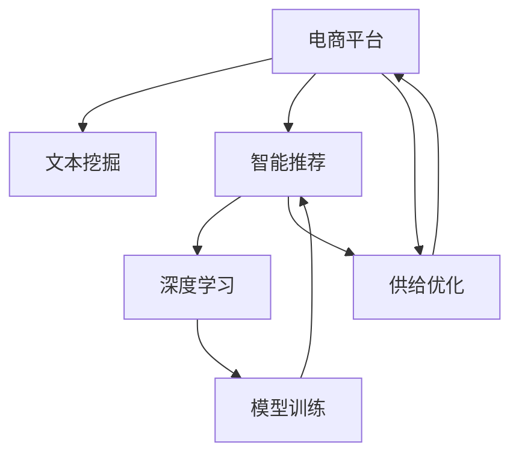

                 

## 1. 背景介绍

随着电商行业的蓬勃发展，各大电商平台在市场竞争中逐渐意识到，如何提升网站和APP的供给能力，提升用户体验，是保持竞争力的关键。传统的供给能力提升方式往往依赖于人工干预和经验积累，难以快速应对市场变化。本文将介绍一种基于深度学习的大规模文本挖掘和智能推荐技术，通过文本分析和推荐算法，显著提升电商平台的供给能力。

## 2. 核心概念与联系

### 2.1 核心概念概述

本节将介绍几个与电商平台供给能力提升密切相关的核心概念：

- **电商平台**：指的是基于互联网开展商品销售和在线交易的平台，如淘宝、京东、亚马逊等。
- **供给能力**：指的是电商平台满足用户需求的能力，包括商品数量、种类、库存量、配送速度等。
- **文本挖掘**：从大量非结构化文本数据中提取有用信息，如商品描述、用户评论、聊天内容等。
- **智能推荐**：通过分析用户行为和商品属性，向用户推荐最符合其兴趣的商品。
- **深度学习**：一种基于神经网络的机器学习方法，在图像、语音、文本等领域有着广泛应用。

### 2.2 核心概念原理和架构的 Mermaid 流程图



以上流程图展示了电商平台供给能力提升的整个架构，包括以下关键环节：

1. **电商平台**：数据的来源和处理场所。
2. **文本挖掘**：从电商平台的海量非结构化文本中提取有用信息。
3. **智能推荐**：通过深度学习模型对用户行为进行分析，实现个性化推荐。
4. **深度学习**：构建推荐模型的基础。
5. **模型训练**：利用标注数据训练推荐模型。
6. **供给优化**：根据推荐结果调整库存和配送策略。

## 3. 核心算法原理 & 具体操作步骤

### 3.1 算法原理概述

基于深度学习的电商平台供给能力提升，主要分为文本挖掘和智能推荐两个环节。以下是详细的算法原理：

**文本挖掘**：
1. **数据准备**：收集电商平台的商品描述、用户评论、聊天内容等非结构化文本。
2. **文本预处理**：进行分词、去停用词、词性标注等预处理操作。
3. **特征提取**：利用TF-IDF、词嵌入等技术，将文本转换为模型可用的数值特征。
4. **模型训练**：利用标注数据训练文本挖掘模型，如情感分析、实体识别等。

**智能推荐**：
1. **数据准备**：收集用户浏览、购买、评价等行为数据。
2. **特征提取**：将用户行为数据转换为数值特征，如点击次数、停留时间、评分等。
3. **模型训练**：利用标注数据训练推荐模型，如协同过滤、内容推荐、深度学习等。
4. **模型部署**：将训练好的推荐模型部署到电商平台，实时响应用户需求。

### 3.2 算法步骤详解

**文本挖掘**：
1. **数据预处理**：使用Python的NLTK库进行分词、去停用词等操作。
2. **特征提取**：利用TF-IDF、Word2Vec等技术，将文本转换为向量表示。
3. **模型训练**：使用SVM、KNN等算法进行训练，验证模型效果。

**智能推荐**：
1. **数据预处理**：将用户行为数据转换为数值特征。
2. **特征提取**：利用PCA、LDA等技术，提取用户行为的主要特征。
3. **模型训练**：使用协同过滤、矩阵分解、深度学习等方法进行训练，验证模型效果。
4. **模型部署**：将训练好的推荐模型部署到电商平台的推荐系统，实时响应用户需求。

### 3.3 算法优缺点

**文本挖掘的优点**：
1. **全面性**：利用非结构化文本数据进行挖掘，能够全面了解用户需求和商品属性。
2. **高效性**：深度学习模型能够自动学习特征，减少人工干预。
3. **准确性**：通过多维特征分析，提升挖掘结果的准确性。

**文本挖掘的缺点**：
1. **数据量要求高**：需要海量非结构化文本数据作为输入。
2. **模型复杂性**：深度学习模型复杂，训练和部署成本高。
3. **特征工程难度大**：文本挖掘中特征工程较难，需要丰富的领域知识。

**智能推荐的优点**：
1. **个性化**：能够根据用户历史行为推荐个性化商品。
2. **实时性**：实时响应用户需求，提升用户体验。
3. **可扩展性**：模型规模可扩展，能够处理大规模用户和商品数据。

**智能推荐的缺点**：
1. **冷启动问题**：新用户和新商品没有足够的历史数据，推荐效果不佳。
2. **数据稀疏性**：用户行为数据稀疏，模型难以捕捉用户真实兴趣。
3. **推荐偏差**：推荐系统可能存在数据偏差，影响推荐结果的公平性和多样性。

### 3.4 算法应用领域

基于深度学习的电商平台供给能力提升技术，可以应用于以下几个领域：

1. **商品推荐**：通过用户行为和商品属性，实时推荐用户感兴趣的商品。
2. **库存管理**：根据用户购买行为预测商品需求，优化库存管理。
3. **价格优化**：根据用户购买行为和市场行情，实时调整商品价格。
4. **市场预测**：分析市场趋势，预测未来需求变化，指导营销策略。
5. **用户体验优化**：通过用户行为分析，优化网站和APP的用户体验。

## 4. 数学模型和公式 & 详细讲解 & 举例说明

### 4.1 数学模型构建

在电商平台供给能力提升中，文本挖掘和智能推荐都需要构建数学模型。以下是具体的模型构建过程：

**文本挖掘**：
1. **文本表示**：将文本转换为向量表示。
2. **特征工程**：提取文本中的关键词和主题。
3. **情感分析**：通过模型预测文本情感极性。

**智能推荐**：
1. **用户画像**：利用协同过滤等技术，建立用户画像。
2. **商品画像**：利用内容推荐等技术，建立商品画像。
3. **相似度计算**：通过余弦相似度等方法计算用户和商品之间的相似度。

### 4.2 公式推导过程

**文本挖掘的公式推导**：
1. **TF-IDF公式**：
   $$
   TF(x_i, t_j) = \frac{\text{出现次数}}{\text{词频总和}}
   $$
   $$
   IDF(x_i, t_j) = \log\frac{N}{\sum_{i=1}^N \text{出现次数}}
   $$
   $$
   TF-IDF(x_i, t_j) = TF(x_i, t_j) \times IDF(x_i, t_j)
   $$
2. **Word2Vec公式**：
   $$
   \text{嵌入向量} = \text{softmax}(\text{相似矩阵} \times \text{输入向量})
   $$

**智能推荐的公式推导**：
1. **协同过滤公式**：
   $$
   \text{相似度} = \text{余弦相似度}(x_i, x_j) = \frac{\langle x_i, x_j \rangle}{||x_i||_2 \times ||x_j||_2}
   $$
   $$
   \text{推荐结果} = \text{排序}(\{(x_i, \text{相似度}(x_i, u)\}_{i=1}^N)
   $$
2. **深度学习模型公式**：
   $$
   \text{预测结果} = \text{softmax}(\text{神经网络输出})
   $$

### 4.3 案例分析与讲解

**案例1：商品推荐系统**：
1. **数据准备**：收集用户浏览、点击、购买等行为数据。
2. **特征提取**：将行为数据转换为数值特征。
3. **模型训练**：使用深度学习模型（如DNN、RNN等）进行训练。
4. **模型部署**：将训练好的模型部署到推荐系统，实时响应用户需求。

**案例2：库存管理**：
1. **数据准备**：收集商品销售、库存、价格等数据。
2. **特征提取**：将库存数据转换为数值特征。
3. **模型训练**：使用协同过滤等方法进行训练。
4. **模型部署**：将训练好的模型部署到库存管理系统，实时调整库存。

## 5. 项目实践：代码实例和详细解释说明

### 5.1 开发环境搭建

在进行电商平台供给能力提升的开发前，我们需要准备好开发环境。以下是使用Python进行开发的环境配置流程：

1. **安装Python**：从官网下载并安装Python 3.x版本。
2. **安装相关库**：使用pip安装必要的库，如NLTK、Scikit-learn、TensorFlow等。
3. **安装服务器**：搭建服务器环境，配置Nginx、Redis等。

### 5.2 源代码详细实现

以下是一个简单的商品推荐系统的源代码实现，包括数据准备、特征提取、模型训练和部署等环节：

```python
# 数据准备
import pandas as pd
import numpy as np

# 特征提取
from sklearn.feature_extraction.text import TfidfVectorizer
from sklearn.decomposition import TruncatedSVD

# 模型训练
from sklearn.metrics.pairwise import cosine_similarity

# 模型部署
from flask import Flask, request, jsonify

app = Flask(__name__)

# 用户行为数据
user_data = pd.read_csv('user_data.csv')

# 商品数据
item_data = pd.read_csv('item_data.csv')

# 特征提取
vectorizer = TfidfVectorizer()
user_vectors = vectorizer.fit_transform(user_data['description'])
item_vectors = vectorizer.transform(item_data['description'])

# 模型训练
svd = TruncatedSVD(n_components=100)
user_svd = svd.fit_transform(user_vectors)
item_svd = svd.transform(item_vectors)

# 模型部署
@app.route('/recommend', methods=['GET'])
def recommend():
    user_id = request.args.get('user_id')
    user_vector = user_svd[user_id - 1]
    recommendations = []
    for i in range(len(item_svd)):
        similarity = cosine_similarity([user_vector], item_svd[i:i+1])[0][0]
        recommendations.append((item_data['id'][i], similarity))
    recommendations.sort(key=lambda x: x[1], reverse=True)
    return jsonify({'recommendations': recommendations})

if __name__ == '__main__':
    app.run(host='0.0.0.0', port=5000)
```

### 5.3 代码解读与分析

让我们再详细解读一下关键代码的实现细节：

**数据准备**：
- 使用Pandas库读取用户行为数据和商品数据。
- 将数据进行预处理，提取文本特征。

**特征提取**：
- 使用TfidfVectorizer进行特征提取，将文本转换为向量表示。
- 使用TruncatedSVD进行降维，减少特征维度。

**模型训练**：
- 使用cosine_similarity计算用户和商品之间的相似度。
- 通过相似度排序，生成推荐列表。

**模型部署**：
- 使用Flask框架部署推荐系统，实时响应用户请求。

## 6. 实际应用场景

### 6.1 商品推荐系统

在电商平台中，商品推荐系统是最具代表性的供给能力提升技术。通过分析用户浏览、点击、购买等行为，商品推荐系统能够实时向用户推荐最感兴趣的商品，提升用户体验和转化率。

**实际应用**：
1. **个性化推荐**：根据用户历史行为，实时推荐个性化商品。
2. **商品优化**：通过推荐结果调整商品价格和库存。
3. **用户反馈**：收集用户反馈，优化推荐模型。

**案例**：
1. **淘宝商品推荐系统**：通过分析用户行为，推荐个性化商品。
2. **亚马逊推荐系统**：实时推荐用户感兴趣的商品，提升购物体验。

### 6.2 库存管理系统

库存管理系统是电商平台供应链管理的重要组成部分，通过预测用户需求，优化库存配置，提升供应链效率。

**实际应用**：
1. **库存预测**：根据历史销售数据，预测未来需求。
2. **订单管理**：优化订单分配和配送，提升配送速度。
3. **风险控制**：通过库存预测，控制库存风险。

**案例**：
1. **京东库存管理系统**：利用文本挖掘和推荐算法，优化库存配置。
2. **eBay库存管理系统**：通过库存预测，提升供应链效率。

### 6.3 市场预测系统

市场预测系统能够分析市场趋势，预测未来需求变化，指导电商平台的营销策略。

**实际应用**：
1. **市场需求分析**：分析市场趋势，预测未来需求。
2. **营销策略调整**：根据预测结果，调整营销策略。
3. **风险预警**：及时发现市场风险，避免损失。

**案例**：
1. **阿里巴巴市场预测系统**：通过分析市场趋势，指导营销策略。
2. **Shopify市场预测系统**：预测未来需求，优化营销策略。

## 7. 工具和资源推荐

### 7.1 学习资源推荐

为了帮助开发者系统掌握电商平台供给能力提升的理论基础和实践技巧，这里推荐一些优质的学习资源：

1. **《深度学习实战》**：详细介绍了深度学习在电商推荐系统中的应用。
2. **《机器学习基础》**：介绍了机器学习在电商数据挖掘和推荐系统中的应用。
3. **Coursera电商数据科学课程**：斯坦福大学开设的电商数据科学课程，涵盖电商数据分析和推荐系统等知识。
4. **Kaggle电商推荐系统竞赛**：通过实际竞赛数据，训练推荐模型。

### 7.2 开发工具推荐

高效的开发离不开优秀的工具支持。以下是几款用于电商平台供给能力提升开发的常用工具：

1. **Python**：基于Python的电商推荐系统开发，简单易用，数据处理能力强。
2. **Pandas**：用于数据处理和分析，支持大规模数据集操作。
3. **Scikit-learn**：用于构建机器学习模型，支持多种算法。
4. **TensorFlow**：用于深度学习模型的开发和部署。
5. **Flask**：用于构建Web服务，支持实时响应用户请求。

### 7.3 相关论文推荐

电商平台的供给能力提升技术涉及多个领域，以下是几篇经典的学术论文，推荐阅读：

1. **《E-commerce Recommendation Systems: A Survey》**：对电商推荐系统进行了全面的综述，包括经典算法和前沿技术。
2. **《Item-based Collaborative Filtering with Multi-Tensor Factorization》**：介绍了多张量因子分解方法，应用于商品推荐系统。
3. **《Deep Learning for Recommendation Systems》**：介绍了深度学习在电商推荐系统中的应用。

## 8. 总结：未来发展趋势与挑战

### 8.1 研究成果总结

本文对电商平台供给能力提升中的文本挖掘和智能推荐技术进行了全面系统的介绍。详细讲解了深度学习在大规模文本挖掘和智能推荐中的应用，并通过案例分析展示了实际应用效果。

### 8.2 未来发展趋势

展望未来，电商平台供给能力提升技术将呈现以下几个发展趋势：

1. **数据驱动**：利用大数据和机器学习技术，实时优化商品推荐和库存管理。
2. **用户交互**：通过NLP技术，实现用户交互分析，提升用户体验。
3. **多模态融合**：将文本、图像、语音等多种模态信息融合，提升推荐系统效果。
4. **实时处理**：利用流计算和大数据技术，实现实时数据处理和分析。
5. **个性化推荐**：通过深度学习和协同过滤等方法，实现更精准、个性化的推荐。

### 8.3 面临的挑战

尽管电商平台供给能力提升技术已经取得了瞩目成就，但在迈向更加智能化、普适化应用的过程中，它仍面临着诸多挑战：

1. **数据质量问题**：电商平台的数据质量参差不齐，存在噪声和缺失值，影响推荐效果。
2. **冷启动问题**：新用户和新商品没有足够的历史数据，推荐效果不佳。
3. **模型复杂性**：深度学习模型复杂，训练和部署成本高。
4. **用户隐私问题**：用户数据隐私保护是一个重要问题，需要确保用户数据的安全性。

### 8.4 研究展望

面对电商平台供给能力提升所面临的种种挑战，未来的研究需要在以下几个方面寻求新的突破：

1. **数据预处理**：采用数据清洗、去噪等技术，提升数据质量。
2. **冷启动策略**：利用协同过滤、迁移学习等技术，解决新用户和新商品的推荐问题。
3. **模型简化**：简化模型结构，提高训练和部署效率。
4. **隐私保护**：采用差分隐私等技术，保护用户数据隐私。

总之，电商平台供给能力提升技术还有很大的研究空间，需要不断探索和创新。只有从数据、算法、工程、业务等多个维度协同发力，才能真正实现电商平台供给能力的全面提升，推动电商行业的持续发展。

## 9. 附录：常见问题与解答

**Q1：电商平台供给能力提升是否适用于所有电商场景？**

A: 电商平台供给能力提升技术适用于大部分电商场景，尤其是数据量较大、用户行为多样化的平台。但对于某些垂直领域或小规模平台，可能需要针对性地优化算法和模型。

**Q2：如何提高电商推荐系统的推荐精度？**

A: 提高推荐系统的推荐精度可以从以下几个方面入手：
1. **数据质量**：确保数据完整、准确，减少噪声和缺失值。
2. **特征工程**：设计有效的特征提取方法，提取有用信息。
3. **模型优化**：选择适合的算法和模型，优化模型参数。
4. **在线学习**：利用在线学习技术，实时更新模型，提高推荐效果。

**Q3：电商平台供给能力提升的开发难度大吗？**

A: 电商平台供给能力提升的开发难度较大，需要综合考虑数据、算法、工程等多个方面。但随着深度学习和大数据技术的不断发展，开发难度正在逐渐降低。

**Q4：电商平台供给能力提升需要考虑哪些因素？**

A: 电商平台供给能力提升需要考虑以下因素：
1. **数据**：电商平台的数据量、质量、分布等因素。
2. **算法**：选择合适的推荐算法和模型，设计合理的特征工程方法。
3. **工程**：优化代码实现，提高系统性能和可扩展性。
4. **业务**：理解电商平台的业务需求和用户行为，进行合理的算法优化和模型部署。

---

作者：禅与计算机程序设计艺术 / Zen and the Art of Computer Programming

