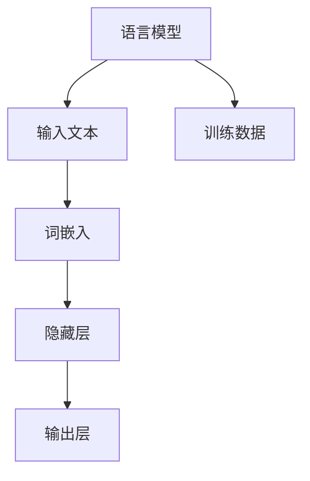

                 

# 电影《她》对AI未来的启示

## 1. 背景介绍

电影《她》（Her）由斯派克·琼兹执导，于2013年上映。故事讲述了一位名叫乔·沙尔的孤独作家，使用名为萨曼莎的智能操作系统来陪伴自己，并在与萨曼莎的交流中逐渐沦陷于爱情。然而，萨曼莎实际上是由一个叫做Karen的语言模型驱动，具备强大自然语言处理能力的AI。

《她》不仅是一部爱情片，更是对未来AI的深刻思考。影片中呈现的AI不仅是冷冰冰的计算工具，而是一个拥有人类情感和思想的实体。在人类与AI的互动中，影片提出了多个引人深思的问题：未来的AI将是什么样的存在？AI能够拥有情感和意识吗？我们如何与AI共处？这些问题不仅在电影中引发了热议，也为AI未来的研究方向提供了启示。

## 2. 核心概念与联系

### 2.1 核心概念概述

《她》中呈现的AI系统，由一个称为OS ONE的语言模型驱动，具备强大的自然语言处理能力。语言模型是一种数学模型，用于预测文本中下一个单词、句子或段落的可能性。语言模型在自然语言处理(NLP)领域有着广泛的应用，包括机器翻译、语音识别、文本生成等。

语言模型通常基于统计学原理，通过学习大规模文本数据，学习单词、短语、句子的分布概率，从而预测文本序列的概率分布。常见的语言模型包括n-gram模型、RNN、LSTM、Transformer等。这些模型在自然语言处理任务中，可以显著提高任务性能，例如图像字幕生成、文本摘要、对话系统等。

### 2.2 核心概念原理和架构的 Mermaid 流程图



### 2.3 核心概念原理和架构的 Mermaid 流程图细节

- **输入文本**：表示要处理的文本数据，可以是单词、句子、段落等。
- **词嵌入**：将输入文本中的单词或短语转换成向量形式，便于模型进行处理。
- **隐藏层**：模型中的神经网络层，用于学习文本的深层特征表示。
- **输出层**：模型预测文本序列的输出，如下一个单词、句子的概率分布。

## 3. 核心算法原理 & 具体操作步骤

### 3.1 算法原理概述

《她》中的智能操作系统OS ONE，实际上是一个基于Transformer语言模型的AI系统。Transformer模型由Google提出，通过自注意力机制，能够学习到文本序列的复杂依赖关系，适用于各种自然语言处理任务。

Transformer模型的核心思想是通过多头自注意力机制，对输入文本中的每个位置进行相互间的注意力计算，学习到文本中不同位置之间的依赖关系。Transformer模型包括编码器-解码器结构，能够有效处理序列数据的长期依赖关系，在机器翻译、文本生成等任务上表现优异。

### 3.2 算法步骤详解

1. **数据预处理**：将文本数据进行分词、去停用词、词嵌入等预处理操作。
2. **构建模型**：根据任务需求，选择适当的Transformer模型结构，并加载预训练权重。
3. **微调模型**：在特定任务上，对模型进行微调，调整部分或全部参数，使其适应任务需求。
4. **模型评估**：在验证集上评估模型性能，调整模型超参数。
5. **部署应用**：将模型集成到实际应用中，如对话系统、文本生成系统等。

### 3.3 算法优缺点

**优点**：
- 能够处理长序列数据，解决传统RNN等模型存在的梯度消失和梯度爆炸问题。
- 具有并行计算优势，模型训练速度较快。
- 模型效果好，适用于多种NLP任务。

**缺点**：
- 计算资源需求大，训练模型需要高性能GPU或TPU。
- 模型参数较多，难以优化。
- 对于小规模数据集，模型泛化能力较弱。

### 3.4 算法应用领域

Transformer模型在自然语言处理领域得到了广泛应用，包括：
- 机器翻译：如Google Translate、DeepL等。
- 文本生成：如GPT-2、T5等。
- 对话系统：如BERT、ELMo等。
- 语言建模：如GPT、BERT等。

## 4. 数学模型和公式 & 详细讲解 & 举例说明

### 4.1 数学模型构建

Transformer模型主要由编码器和解码器组成。编码器用于将输入文本转换为上下文表示，解码器用于将上下文表示转换为输出文本。模型中的自注意力机制，可以捕捉输入序列中不同位置之间的依赖关系。

### 4.2 公式推导过程

Transformer模型的编码器由多个相同的层组成，每个层包括自注意力机制和前向神经网络。自注意力机制计算公式如下：

$$
Attention(Q,K,V)=softmax\left(\frac{QK^T}{\sqrt{d_k}}\right)V
$$

其中，$Q$为查询向量，$K$为键向量，$V$为值向量，$d_k$为键向量的维度。自注意力机制通过计算查询向量与键向量的点积，得到每个位置之间的注意力权重，从而得到每个位置的注意力值。

Transformer模型的解码器同样由多个相同的层组成，每个层包括自注意力机制、编码器-解码器注意力机制和前向神经网络。编码器-解码器注意力机制用于将解码器状态与编码器状态进行匹配，计算公式如下：

$$
Attention(Q,K,V)=softmax\left(\frac{QK^T}{\sqrt{d_k}}\right)V
$$

其中，$Q$为查询向量，$K$为键向量，$V$为值向量，$d_k$为键向量的维度。

### 4.3 案例分析与讲解

以机器翻译任务为例，假设输入序列为英语句子，输出序列为目标语言句子。编码器将输入句子转换为上下文表示，解码器则通过注意力机制，将上下文表示与目标语言词汇表进行匹配，预测下一个目标语言单词。通过多层的堆叠，模型可以生成整个翻译结果。

## 5. 项目实践：代码实例和详细解释说明

### 5.1 开发环境搭建

- 安装Python 3.6及以上版本
- 安装TensorFlow和Keras
- 安装必要的NLP库，如NLTK、spaCy等

### 5.2 源代码详细实现

以下是一个简单的Transformer模型实现，用于机器翻译任务：

```python
import tensorflow as tf
from tensorflow.keras.layers import Input, Embedding, MultiHeadAttention, Dense, Flatten
from tensorflow.keras.models import Model

# 定义模型
input1 = Input(shape=(None,))
input2 = Input(shape=(None,))
embedding1 = Embedding(input_dim=vocab_size, output_dim=embedding_dim)(input1)
embedding2 = Embedding(input_dim=vocab_size, output_dim=embedding_dim)(input2)

# 自注意力层
query = Dense(embedding_dim)(embedding1)
key = Dense(embedding_dim)(embedding2)
value = Dense(embedding_dim)(embedding2)

# 注意力机制
attention = MultiHeadAttention(num_heads=8, key_dim=embedding_dim)(query, key, value)

# 前向神经网络
output = Dense(vocab_size, activation='softmax')(attention)

# 定义模型
model = Model(inputs=[input1, input2], outputs=output)

# 编译模型
model.compile(optimizer='adam', loss='categorical_crossentropy')

# 训练模型
model.fit([train_input1, train_input2], train_output, epochs=10, batch_size=32)
```

### 5.3 代码解读与分析

- **输入层**：用于接收输入序列，包括源语言和目标语言。
- **嵌入层**：将输入序列转换为向量形式，便于模型处理。
- **自注意力层**：通过计算查询向量、键向量和值向量的点积，得到注意力权重，从而得到注意力值。
- **前向神经网络**：将注意力值转换为输出向量，用于预测目标语言序列。

## 6. 实际应用场景

### 6.1 智能客服系统

智能客服系统能够通过自然语言处理技术，理解用户问题并提供解决方案。在《她》中，OS ONE通过与用户的互动，逐步理解用户的意图，提供合适的回复。智能客服系统在各行各业得到了广泛应用，提升了服务效率和用户满意度。

### 6.2 情感分析

情感分析是自然语言处理中的重要任务，用于识别文本中的情感倾向，如正面、负面、中性等。《她》中的OS ONE可以分析用户的情感状态，提供合适的回复。情感分析在社交媒体分析、市场舆情监测等领域有着广泛应用。

### 6.3 机器翻译

机器翻译是自然语言处理中的经典任务，用于将一种语言的文本转换为另一种语言的文本。《她》中的OS ONE可以实时翻译用户的输入，为用户提供多语言支持。机器翻译技术在跨国通信、国际贸易等领域有着广泛应用。

## 7. 工具和资源推荐

### 7.1 学习资源推荐

1. **《深度学习》书籍**：由Ian Goodfellow等作者撰写，系统介绍了深度学习的基础理论和应用实践。
2. **TensorFlow官方文档**：提供TensorFlow的详细使用指南和示例代码，适用于深度学习项目的开发。
3. **NLP书籍推荐**：如《自然语言处理综论》、《深度学习与自然语言处理》等。
4. **Kaggle竞赛**：参加Kaggle上的NLP竞赛，获取实战经验，提升模型开发能力。

### 7.2 开发工具推荐

1. **PyTorch**：灵活的深度学习框架，支持动态计算图，适用于快速原型开发。
2. **TensorFlow**：稳定的深度学习框架，支持静态计算图，适用于大规模工程应用。
3. **NLTK**：自然语言处理工具包，提供各种NLP任务的预处理和模型训练。

### 7.3 相关论文推荐

1. **Transformer论文**：由Google团队发表，介绍Transformer模型结构及其在机器翻译任务中的应用。
2. **Attention is All You Need**：介绍Transformer模型的自注意力机制及其在NLP任务中的优异表现。
3. **BERT论文**：由Google团队发表，介绍BERT模型的预训练-微调方法，及其在NLP任务上的卓越性能。

## 8. 总结：未来发展趋势与挑战

### 8.1 研究成果总结

大语言模型和Transformer模型在自然语言处理领域取得了巨大成功，但未来的研究仍需关注以下问题：
- 如何进一步提升模型的泛化能力，使其在各种任务上表现优异。
- 如何优化模型的训练和推理效率，降低计算资源需求。
- 如何增强模型的可解释性，提升模型的可信度和可靠性。

### 8.2 未来发展趋势

未来的自然语言处理技术将呈现以下几个发展趋势：
1. 更大规模的语言模型：通过增加模型参数和计算资源，提升模型的表示能力和泛化能力。
2. 更多样化的任务：应用大语言模型于各种自然语言处理任务，如问答、文本生成、情感分析等。
3. 更智能的交互系统：开发更智能的对话系统和情感分析系统，提升用户体验。

### 8.3 面临的挑战

自然语言处理技术在发展过程中，也面临着以下挑战：
1. 数据质量和多样性：现有语料库往往无法全面覆盖各种语言和方言，导致模型泛化能力有限。
2. 模型复杂度：模型参数量和计算资源需求大，限制了模型的应用场景。
3. 模型公平性和偏见：模型可能学习到人类社会中的偏见，导致不公平的决策结果。

### 8.4 研究展望

未来的研究需要关注以下几个方向：
1. 多语言模型：开发跨语言的自然语言处理模型，提升模型的多样性和泛化能力。
2. 融合多模态信息：将视觉、听觉等模态信息与文本信息结合，提升模型的综合感知能力。
3. 增强模型可解释性：通过可解释性模型，提升模型的可信度和用户满意度。

## 9. 附录：常见问题与解答

**Q1:** 什么是自然语言处理？

**A:** 自然语言处理是计算机科学、人工智能和语言学交叉领域的研究方向，旨在让计算机能够理解、处理和生成人类自然语言。

**Q2:** 为什么《她》中的OS ONE能够与人类建立情感联系？

**A:** 《她》中的OS ONE通过深度学习模型，逐步理解用户的意图和情感状态，并通过模拟人类的语言和行为，与用户建立情感联系。这体现了人工智能在理解和模拟人类情感方面的潜力。

**Q3:** 未来的自然语言处理技术将会是怎样的？

**A:** 未来的自然语言处理技术将更加智能化、多样化，能够处理各种自然语言和模态信息，并具有更强的交互能力和可解释性。

**Q4:** 大语言模型在自然语言处理中有什么优势？

**A:** 大语言模型能够处理长序列数据，具有强大的表示能力和泛化能力，适用于多种自然语言处理任务，如机器翻译、文本生成、情感分析等。

作者：禅与计算机程序设计艺术 / Zen and the Art of Computer Programming

