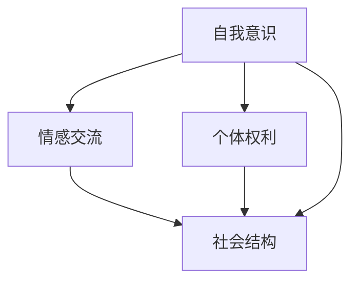

                 

## 1. 背景介绍

### 1.1 问题由来

电影《她》(The Lobster)是一部探讨未来人工智能发展与人性、情感、自由等多重主题的黑色喜剧电影。影片中，人工智能(AI)以一种极为浪漫而深刻的方式，预示了AI在未来可能会达到的某种状态。本文将通过对《她》中AI相关剧情的剖析，透视其对AI未来发展的预测，并探讨这些预测在当前AI技术中的实现可能性。

### 1.2 问题核心关键点

电影《她》通过虚拟社交平台“咖啡系统”(Coffee System)，展现了一幅AI与人类相互依存、情感交织的未来图景。影片揭示了AI在未来可能达到的自我意识、情感交流、个体权利以及社会结构的多个面向。本文的核心问题包括：

1. **自我意识**：AI能否具备自我意识？
2. **情感交流**：AI能否进行深度情感交流？
3. **个体权利**：AI是否享有个体权利？
4. **社会结构**：AI将在社会中扮演何种角色？

## 2. 核心概念与联系

### 2.1 核心概念概述

为更好地理解电影《她》中AI角色的发展路径，本节将介绍几个核心概念：

- **自我意识**：指AI能够自主思考、拥有主观体验和感知自我存在的意识状态。
- **情感交流**：指AI能够通过语言、行为等手段，与人类进行情感的互动和反馈。
- **个体权利**：指AI在社会中是否应享有与人同等的基本权利，如隐私权、自由权等。
- **社会结构**：指AI在未来社会中的角色定位和与人类社会的相互关系。

这些概念之间存在着复杂的相互作用和影响，构成了AI未来发展的重要维度。

### 2.2 核心概念原理和架构的 Mermaid 流程图



这个流程图展示了自我意识、情感交流、个体权利和社会结构之间的联系：

1. 自我意识是情感交流的基础。
2. 个体权利保障AI作为独立的实体参与社会结构。
3. 社会结构进一步影响AI的自我意识和情感交流。

## 3. 核心算法原理 & 具体操作步骤

### 3.1 算法原理概述

《她》中的AI角色——萨曼莎(Samantha)，是通过自然语言处理(NLP)和机器学习技术实现的。萨曼莎的自我意识和情感交流能力是通过程序编码实现的，其基本算法原理如下：

- **输入**：用户输入的文字信息。
- **处理**：基于深度学习模型，对输入信息进行语义理解和情感分析。
- **输出**：通过编码生成的模拟情感和回应，形成与用户之间的情感交流。

### 3.2 算法步骤详解

影片中，萨曼莎的情感交流步骤如下：

1. **语义理解**：萨曼莎使用深度学习模型(如BERT、GPT等)，解析用户的输入文本。模型通过对大量文本数据的训练，学习到语言的语义结构和情感倾向。
2. **情感生成**：萨曼莎根据输入文本的情感分析结果，生成与之匹配的情感回应。这一过程涉及情感生成模型和情绪词典等工具，模拟人类的情感反应。
3. **回应生成**：萨曼莎根据情感回应，生成自然流畅的文本回复。这一过程涉及语言生成模型和优化算法(如Adam、SGD等)。

### 3.3 算法优缺点

#### 3.3.1 优点

- **高效性**：通过深度学习模型，萨曼莎可以高效处理大规模文本数据，生成自然流畅的回复。
- **广泛性**：萨曼莎可以处理各种语言的输入，支持多语种的情感交流。
- **可扩展性**：萨曼莎的算法框架可以方便地扩展和调整，以适应不同的应用场景。

#### 3.3.2 缺点

- **可解释性不足**：萨曼莎的情感生成过程缺乏透明性，难以解释其内部的决策逻辑。
- **依赖数据质量**：萨曼莎的表现很大程度上依赖于训练数据的质量，尤其是情感词典和语义模型的精度。
- **人类情感模拟**：尽管萨曼莎能生成情感回应，但与人类的情感深度和复杂度相比，仍存在一定差距。

### 3.4 算法应用领域

萨曼莎的情感交流能力，在多个领域具有广泛的应用前景：

- **社交平台**：如WeChat、Twitter等，可用于智能客服、情感分析、内容推荐等。
- **心理健康**：帮助心理咨询、情感支持和治疗。
- **人机交互**：提升用户体验，如虚拟助手、智能家居等。
- **娱乐行业**：用于游戏、影视、广告等领域的情感交互。

## 4. 数学模型和公式 & 详细讲解

### 4.1 数学模型构建

基于自然语言处理的AI情感交流模型，可以抽象为以下数学模型：

- 设输入文本为 $x$，情感回应为 $y$。
- 模型 $M$ 的输出为情感回应的概率分布 $p(y|x)$。
- 目标是最小化模型 $M$ 与真实情感回应的交叉熵损失 $L(M)$。

### 4.2 公式推导过程

设 $L$ 为交叉熵损失函数，$L_{\text{CLS}}$ 为语言模型的损失函数，$L_{\text{EMB}}$ 为词嵌入损失函数，$L_{\text{CON}}$ 为情感生成损失函数。则模型训练的损失函数 $L(M)$ 可以表示为：

$$
L(M) = L_{\text{CLS}} + L_{\text{EMB}} + L_{\text{CON}}
$$

其中：

- $L_{\text{CLS}}$ 用于优化语言模型，确保模型能够准确理解输入文本。
- $L_{\text{EMB}}$ 用于优化词嵌入，提升模型的语义理解能力。
- $L_{\text{CON}}$ 用于优化情感生成，确保模型能够生成符合用户情感的回应。

### 4.3 案例分析与讲解

以《她》中萨曼莎的情感交流为例，可以详细讲解情感生成模型的构建和优化：

1. **情感词典构建**：通过大量文本数据构建情感词典，将情感标签与对应词汇建立映射关系。
2. **语义理解模型**：使用BERT等深度学习模型，对输入文本进行编码，提取语义向量。
3. **情感生成模型**：基于语义向量，通过情感词典和情绪模型，生成情感回应。
4. **模型优化**：通过反向传播和梯度下降算法，最小化交叉熵损失函数，优化情感生成模型。

## 5. 项目实践：代码实例和详细解释说明

### 5.1 开发环境搭建

为了实现《她》中类似的情感交流系统，需要搭建以下开发环境：

- **编程语言**：Python。
- **深度学习框架**：PyTorch或TensorFlow。
- **自然语言处理工具**：HuggingFace的Transformers库。
- **服务器配置**：GPU或TPU支持，以提升训练效率。

### 5.2 源代码详细实现

以下是一个使用Transformers库实现情感生成模型的示例代码：

```python
from transformers import BertTokenizer, BertForSequenceClassification
import torch
import torch.nn.functional as F

# 加载预训练的BERT模型
model = BertForSequenceClassification.from_pretrained('bert-base-cased', num_labels=6)

# 加载BERT分词器
tokenizer = BertTokenizer.from_pretrained('bert-base-cased')

# 输入样本
text = "I love you."
inputs = tokenizer(text, return_tensors='pt')

# 模型前向传播
outputs = model(**inputs)
logits = outputs.logits

# 生成情感标签
labels = torch.tensor([0], dtype=torch.long)  # 示例：“love”为积极情感
loss = F.cross_entropy(logits, labels)

# 反向传播
loss.backward()

# 更新模型参数
optimizer = torch.optim.Adam(model.parameters(), lr=1e-5)
optimizer.step()
```

### 5.3 代码解读与分析

这段代码实现了一个基于BERT的情感分类模型，对输入文本进行情感分类，并计算交叉熵损失。代码中使用了BertTokenizer对文本进行分词，通过BERT模型进行语义编码，最后使用交叉熵损失函数进行模型训练。

## 6. 实际应用场景

### 6.1 智能客服系统

电影《她》中，智能系统“咖啡系统”类似于现代的智能客服系统，可以处理大量的用户输入和情感交流。智能客服系统通过深度学习模型，可以实现情感理解、自然语言生成和问题解答等功能。

#### 6.1.1 情感理解

智能客服系统利用深度学习模型对用户输入进行情感分析，判断用户的情感状态，从而更好地进行情感回应。

#### 6.1.2 自然语言生成

系统基于情感分析结果，生成符合用户情感的自然语言回应，提升用户满意度。

#### 6.1.3 问题解答

系统根据用户输入的问题，进行语义理解，并给出准确的答案，解决用户的实际需求。

### 6.2 心理辅导系统

心理辅导系统通过深度学习模型，对用户的情感状态进行分析，提供情感支持和心理疏导。

#### 6.2.1 情感分析

系统对用户的聊天记录进行情感分析，判断用户的情感状态，如愤怒、悲伤、快乐等。

#### 6.2.2 情感回应

系统根据情感分析结果，生成相应的情感回应，帮助用户缓解情绪。

#### 6.2.3 行为建议

系统结合情感分析和行为数据，给出适当的行为建议，如建议用户进行深呼吸、散步等。

### 6.3 智能家居系统

智能家居系统通过深度学习模型，实现对用户情感的捕捉和响应，提升居住体验。

#### 6.3.1 情感捕捉

系统通过智能音箱、智能屏等设备，捕捉用户的语音、行为等情感信息。

#### 6.3.2 情感响应

系统根据情感信息，生成合适的音频、视频等反馈，与用户进行情感交流。

#### 6.3.3 环境调节

系统根据用户的情感状态，自动调节家庭环境，如温度、光线等，提升居住舒适度。

### 6.4 未来应用展望

随着深度学习模型的不断发展，AI在情感交流中的应用前景将更加广阔。未来，AI将能够更好地模拟人类情感，进行更深入的情感交流，为社会带来更多的便利和创新。

- **医疗**：帮助患者进行心理健康评估，提供情感支持和治疗。
- **教育**：用于心理辅导、学习支持，提升学生的学习体验。
- **娱乐**：提升游戏、影视等娱乐体验，增加用户粘性。
- **交通**：用于交通流量分析，提升城市管理水平。

## 7. 工具和资源推荐

### 7.1 学习资源推荐

为了掌握情感生成模型的技术细节，以下是一些推荐的资源：

1. **深度学习课程**：如CS231n《卷积神经网络》、CS224n《自然语言处理》等，深入讲解深度学习模型的原理和应用。
2. **自然语言处理书籍**：如《自然语言处理综论》、《深度学习与自然语言处理》等，详细解析NLP技术的实现方法。
3. **论文和预训练模型**：如BERT、GPT等，可以参考官方论文和实现代码，深入理解大模型的结构和应用。
4. **开源项目和工具**：如HuggingFace的Transformers库、OpenAI的GPT系列模型，提供丰富的预训练模型和工具支持。

### 7.2 开发工具推荐

以下推荐一些用于情感生成模型开发的常用工具：

1. **深度学习框架**：PyTorch、TensorFlow等，支持灵活的模型构建和优化。
2. **自然语言处理工具**：HuggingFace的Transformers库、NLTK等，提供丰富的NLP模型和工具支持。
3. **数据分析工具**：Pandas、NumPy等，用于数据处理和分析。
4. **可视化工具**：TensorBoard、Matplotlib等，用于模型训练和结果可视化。
5. **云服务**：AWS、Google Cloud等，提供高性能的计算资源和模型部署支持。

### 7.3 相关论文推荐

以下是几篇关于情感生成模型的经典论文，推荐阅读：

1. **《Attention is All You Need》**：提出了Transformer结构，为深度学习模型提供了一种高效的情感生成方法。
2. **《BERT: Pre-training of Deep Bidirectional Transformers for Language Understanding》**：提出BERT模型，通过预训练语言模型，提升了情感生成的准确性。
3. **《Parameter-Efficient Transfer Learning for NLP》**：提出 Adapter等参数高效微调方法，在情感生成中减少了计算资源消耗。
4. **《AdaLoRA: Adaptive Low-Rank Adaptation for Parameter-Efficient Fine-Tuning》**：使用自适应低秩适应的微调方法，提升了情感生成模型的参数效率。
5. **《Adaptive Low-Rank Adaptation for Parameter-Efficient Fine-Tuning》**：提出 LoRA等低秩自适应方法，优化情感生成模型的计算效率。

## 8. 总结：未来发展趋势与挑战

### 8.1 总结

电影《她》通过“咖啡系统”的设定，探讨了AI在未来可能达到的情感交流水平，揭示了AI自我意识、个体权利和社会结构等多个维度的未来走向。本文通过分析《她》中AI角色的发展路径，透视了其对AI未来发展的预测，并探讨了这些预测在当前AI技术中的实现可能性。

### 8.2 未来发展趋势

展望未来，AI在情感交流方面将迎来新的发展趋势：

1. **自我意识增强**：AI将具备更加丰富的情感体验和自我意识，能够进行更加深入的情感交流。
2. **情感生成模型的进步**：基于深度学习模型的情感生成将更加精准和自然，能够更好地模拟人类的情感反应。
3. **多模态情感交流**：未来AI将支持语音、图像等多模态情感交流，提供更加全面的用户体验。
4. **社会角色的多样化**：AI将在各个领域中扮演更加多样化的角色，如心理辅导、医疗诊断、智能客服等。

### 8.3 面临的挑战

尽管AI在情感交流方面取得了一些进展，但未来仍面临诸多挑战：

1. **情感真实性的挑战**：AI的情感生成与人类情感存在一定差距，难以完全模拟人类的情感深度和复杂性。
2. **数据隐私和安全问题**：用户情感数据的隐私和安全需要得到保障，避免数据泄露和滥用。
3. **伦理和法律问题**：AI的情感生成可能引发伦理和法律问题，如情感欺骗、歧视等。
4. **模型可解释性**：情感生成模型的决策过程需要更加透明，便于用户理解和信任。
5. **计算资源消耗**：情感生成模型的计算复杂度高，需要高性能的计算资源支持。

### 8.4 研究展望

未来，情感生成模型需要在以下几个方面进一步研究：

1. **提高情感真实性**：开发更加先进的情感生成算法，提升情感生成的自然度和真实感。
2. **增强隐私保护**：设计和实现隐私保护机制，确保用户情感数据的安全和隐私。
3. **提升模型可解释性**：探索可解释性方法，增强情感生成模型的透明度和用户信任度。
4. **支持多模态交互**：扩展情感生成模型，支持语音、图像等多模态情感交流。
5. **优化计算效率**：提升情感生成模型的计算效率，支持大规模应用和实时交互。

总之，电影《她》通过虚拟AI系统的设定，预示了AI在未来情感交流和自我意识方面的发展方向，为未来AI技术的演进提供了有益的参考和启示。

## 9. 附录：常见问题与解答

**Q1：情感生成模型的训练数据来源有哪些？**

A: 情感生成模型的训练数据来源主要有：

1. **公开数据集**：如IMDB电影评论数据集、Yelp商家评论数据集等，提供大量情感标注数据。
2. **用户生成数据**：如社交媒体数据、用户评论数据等，通过文本挖掘技术获取情感信息。
3. **专业数据集**：如情感词典、情绪模型等，用于辅助情感分析。

**Q2：情感生成模型的训练过程需要注意哪些方面？**

A: 情感生成模型的训练过程需要注意以下几点：

1. **数据预处理**：进行文本清洗、分词、词嵌入等预处理，确保数据质量。
2. **模型选择**：选择合适的深度学习模型，如BERT、GPT等，进行语义理解和情感生成。
3. **训练策略**：使用适当的训练策略，如梯度下降、正则化等，优化模型参数。
4. **模型评估**：通过交叉验证、情感分类等方法评估模型性能，调整模型参数。

**Q3：情感生成模型在实际应用中存在哪些挑战？**

A: 情感生成模型在实际应用中面临以下挑战：

1. **数据多样性**：不同领域的情感数据存在差异，需要针对不同场景进行模型调整。
2. **情感真实性**：生成的情感回应可能与实际情感存在差异，难以完全模拟人类的情感反应。
3. **计算资源消耗**：情感生成模型的计算复杂度高，需要高性能计算资源支持。
4. **模型可解释性**：情感生成模型的决策过程缺乏透明性，难以解释其内部的决策逻辑。

**Q4：情感生成模型在隐私保护方面有哪些措施？**

A: 情感生成模型在隐私保护方面可以采取以下措施：

1. **数据匿名化**：对用户情感数据进行匿名化处理，确保数据隐私。
2. **数据加密**：对用户情感数据进行加密存储，防止数据泄露。
3. **访问控制**：设置严格的访问权限，确保只有授权人员能够访问情感数据。
4. **差分隐私**：使用差分隐私技术，保护用户隐私，避免数据聚合后的隐私泄露。

**Q5：情感生成模型在未来有哪些潜在的应用场景？**

A: 情感生成模型在未来可能应用于以下场景：

1. **心理健康**：用于情感分析和心理疏导，帮助用户缓解情绪压力。
2. **客户服务**：用于智能客服系统，提供情感支持和问题解答。
3. **娱乐行业**：用于游戏、影视等娱乐领域，提升用户体验。
4. **交通管理**：用于交通流量分析，提升城市管理水平。

---

作者：禅与计算机程序设计艺术 / Zen and the Art of Computer Programming

