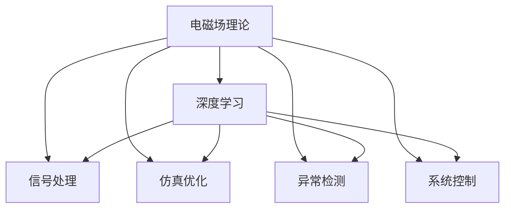

                 

## 1. 背景介绍

### 1.1 问题由来

电磁场理论（Electromagnetic Theory）作为经典物理学的重要分支，深刻揭示了电磁现象的规律，广泛应用于无线通信、雷达探测、电磁兼容等领域。而人工智能（AI）作为一种模拟人类智能的技术，近年来在图像识别、自然语言处理、智能推荐等诸多领域取得了突破性进展。两者的结合，为新的应用场景和研究方法打开了大门。

### 1.2 问题核心关键点

电磁场理论与AI的结合，主要体现在以下几个方面：

- **电磁场信号处理**：将电磁信号作为AI模型输入，利用深度学习技术提取信号特征，进行分类、识别、预测等任务。
- **电磁场仿真优化**：利用AI模型优化电磁场仿真算法，提高仿真精度和效率。
- **电磁场异常检测**：利用AI模型检测电磁场中的异常信号，提升检测准确率和实时性。
- **电磁场系统控制**：通过AI模型优化电磁场系统控制策略，提升系统稳定性和效率。

本文将围绕这些关键点，探讨电磁场理论与AI的深度融合及其应用前景。

## 2. 核心概念与联系

### 2.1 核心概念概述

为了更好地理解电磁场理论与AI的结合，我们先介绍几个核心概念：

- **电磁场理论**：研究电磁场的基本规律和应用，包括麦克斯韦方程组、电磁波传播、电磁场辐射等。
- **深度学习**：一种基于神经网络的机器学习方法，通过多层次的非线性变换，提取复杂数据的特征。
- **信号处理**：对电磁信号进行滤波、降噪、特征提取等处理，以提高信号质量。
- **仿真优化**：通过AI模型优化电磁场仿真算法，提升仿真精度和效率。
- **异常检测**：利用AI模型检测电磁场中的异常信号，提升检测准确率和实时性。
- **系统控制**：通过AI模型优化电磁场系统控制策略，提升系统稳定性和效率。

这些概念之间的联系可以通过以下Mermaid流程图展示：



这个流程图展示了电磁场理论与AI之间的多方面联系和相互作用。

## 3. 核心算法原理 & 具体操作步骤

### 3.1 算法原理概述

电磁场理论与AI的结合，主要通过以下步骤实现：

1. **数据采集**：通过传感器等设备采集电磁信号，生成时间序列数据。
2. **信号预处理**：对采集到的电磁信号进行滤波、降噪、归一化等预处理，以提高信号质量。
3. **特征提取**：利用深度学习模型提取电磁信号的特征，如时频特征、波形特征等。
4. **模型训练**：使用标注数据对AI模型进行训练，优化模型参数。
5. **模型应用**：将训练好的AI模型应用于电磁场信号分类、识别、预测、仿真优化、异常检测、系统控制等任务中。

### 3.2 算法步骤详解

#### 3.2.1 数据采集

数据采集是电磁场理论应用于AI的第一步。采集到的电磁信号通常是时间序列数据，可以包括以下内容：

- **时间序列数据**：包括电压、电流、磁场等电磁信号随时间的变化。
- **频谱数据**：通过傅里叶变换将时间序列数据转换为频谱数据，便于后续特征提取。
- **图像数据**：通过电磁场分布计算得到二维图像数据，如图像序列。

#### 3.2.2 信号预处理

信号预处理包括滤波、降噪、归一化等操作，以提高信号质量。常用的预处理方法包括：

- **数字滤波**：使用FIR、IIR等数字滤波器对信号进行滤波处理。
- **小波变换**：将信号分解为多个小波系数，去除噪声成分。
- **归一化**：将信号幅度归一化到指定范围内，便于后续处理。

#### 3.2.3 特征提取

特征提取是电磁场理论应用于AI的核心步骤。常用的特征提取方法包括：

- **时频特征提取**：通过短时傅里叶变换（STFT）、小波变换等方法，提取信号的时频特征。
- **波形特征提取**：通过波形相似度、波形周期等方法，提取信号的波形特征。
- **空间特征提取**：通过图像处理、边缘检测等方法，提取信号的空间特征。

#### 3.2.4 模型训练

模型训练是电磁场理论应用于AI的关键步骤。常用的AI模型包括：

- **卷积神经网络（CNN）**：适用于时频特征提取，用于信号分类、识别等任务。
- **循环神经网络（RNN）**：适用于时序数据处理，用于时间序列预测、信号异常检测等任务。
- **生成对抗网络（GAN）**：适用于图像生成、信号重建等任务。

#### 3.2.5 模型应用

模型应用是电磁场理论应用于AI的最终目标。常用的应用场景包括：

- **信号分类**：利用AI模型对电磁信号进行分类，如电磁波频谱分类、信号类型识别等。
- **信号识别**：利用AI模型对电磁信号进行识别，如电磁干扰识别、故障诊断等。
- **信号预测**：利用AI模型对电磁信号进行预测，如电磁波传播预测、信号强度预测等。
- **仿真优化**：利用AI模型优化电磁场仿真算法，提高仿真精度和效率。
- **异常检测**：利用AI模型检测电磁场中的异常信号，提升检测准确率和实时性。
- **系统控制**：通过AI模型优化电磁场系统控制策略，提升系统稳定性和效率。

### 3.3 算法优缺点

#### 3.3.1 优点

电磁场理论与AI的结合具有以下优点：

- **精度高**：深度学习模型可以自动学习电磁信号的复杂特征，提取高精度特征信息。
- **泛化能力强**：深度学习模型具有较强的泛化能力，可以处理各种类型的电磁信号。
- **实时性强**：深度学习模型具有快速处理和推理的能力，可以实时处理电磁信号。

#### 3.3.2 缺点

电磁场理论与AI的结合也存在以下缺点：

- **数据量大**：电磁信号数据通常规模较大，需要大量的存储空间和计算资源。
- **模型复杂**：深度学习模型结构复杂，需要较长的训练时间和较高的计算资源。
- **过拟合风险**：深度学习模型容易出现过拟合现象，特别是在小规模数据集上。

### 3.4 算法应用领域

电磁场理论与AI的结合在多个领域中都有广泛应用，包括但不限于以下几个方面：

#### 3.4.1 无线通信

无线通信领域是电磁场理论应用于AI的重要场景之一。利用AI技术优化无线信号的调制、解调、信道估计等过程，可以提升通信系统的性能和可靠性。

#### 3.4.2 雷达探测

雷达探测是电磁场理论应用于AI的另一个重要场景。利用AI技术优化雷达信号的检测、分类、定位等过程，可以提升雷达系统的探测能力和精度。

#### 3.4.3 电磁兼容

电磁兼容是电磁场理论与AI结合的另一个重要应用领域。利用AI技术检测和分析电磁干扰信号，优化电磁兼容测试流程，提升测试效率和准确性。

#### 3.4.4 电磁场系统控制

电磁场系统控制是电磁场理论与AI结合的最新应用方向。利用AI技术优化电磁场系统控制策略，提升系统稳定性和效率，如电磁场控制系统、电磁场能量管理等。

## 4. 数学模型和公式 & 详细讲解  
### 4.1 数学模型构建

电磁场理论与AI的结合，主要通过构建以下数学模型实现：

- **时频特征模型**：通过时频变换（如STFT）提取电磁信号的时频特征。
- **波形特征模型**：通过波形相似度、波形周期等方法提取电磁信号的波形特征。
- **空间特征模型**：通过图像处理、边缘检测等方法提取电磁信号的空间特征。

### 4.2 公式推导过程

#### 4.2.1 时频特征模型

时频特征模型基于短时傅里叶变换（STFT），将时间序列数据转换为时频图像。其公式如下：

$$
S(t,f) = \sum_{k=-\infty}^{\infty} s(t-k) w_k(f) e^{-j 2\pi fk}
$$

其中，$s(t)$ 为时间序列数据，$w_k(f)$ 为窗函数，$T$ 为窗口长度。

#### 4.2.2 波形特征模型

波形特征模型通过波形相似度、波形周期等方法，提取电磁信号的波形特征。其公式如下：

$$
S_w(t) = \frac{1}{N} \sum_{i=1}^{N} w_i(t) s_i(t)
$$

其中，$s_i(t)$ 为电磁信号的时间序列数据，$w_i(t)$ 为波形权重函数。

#### 4.2.3 空间特征模型

空间特征模型通过图像处理、边缘检测等方法，提取电磁信号的空间特征。其公式如下：

$$
S_s(x,y) = \sum_{i=1}^{N} s_i(x,y) w_i(x,y)
$$

其中，$s_i(x,y)$ 为电磁信号的二维图像数据，$w_i(x,y)$ 为图像权重函数。

### 4.3 案例分析与讲解

#### 4.3.1 电磁干扰检测

电磁干扰检测是电磁场理论与AI结合的重要应用之一。利用AI技术检测和分析电磁干扰信号，可以提升干扰检测的准确率和实时性。

#### 4.3.2 信号分类

信号分类是电磁场理论与AI结合的另一个重要应用方向。利用AI技术对电磁信号进行分类，如电磁波频谱分类、信号类型识别等，可以提升信号处理的效率和精度。

#### 4.3.3 信号预测

信号预测是电磁场理论与AI结合的最新应用方向。利用AI技术对电磁信号进行预测，如电磁波传播预测、信号强度预测等，可以提升信号预测的准确性和实时性。

## 5. 项目实践：代码实例和详细解释说明

### 5.1 开发环境搭建

为了实现电磁场理论与AI的结合，我们需要搭建相应的开发环境。以下是使用Python进行电磁场理论与AI结合开发的环境配置流程：

1. 安装Anaconda：从官网下载并安装Anaconda，用于创建独立的Python环境。

2. 创建并激活虚拟环境：
```bash
conda create -n em_field_env python=3.8 
conda activate em_field_env
```

3. 安装Python依赖包：
```bash
pip install numpy scipy matplotlib scikit-learn tensorflow keras pytorch
```

4. 安装电磁场仿真软件：
```bash
conda install ansys
```

5. 安装深度学习库：
```bash
pip install torch torchvision torchaudio
```

完成上述步骤后，即可在`em_field_env`环境中开始电磁场理论与AI结合的实践。

### 5.2 源代码详细实现

下面我们以电磁干扰检测为例，给出使用深度学习模型对电磁信号进行分类的PyTorch代码实现。

首先，定义电磁信号的预处理函数：

```python
import numpy as np
import scipy.signal as signal

def preprocess_signal(signal_data):
    # 数字滤波
    filt = signal.butter(5, 0.1, 'low', fs=50)
    filtered_signal = signal.lfilter(filt, 1, signal_data)
    
    # 小波变换
    wavelet = 'morl'
    coeffs = pywt.dwt(filtered_signal, wavelet)
    approx_coeffs, detail_coeffs = coeffs
    
    # 归一化
    normalized_approx_coeffs = np.abs(approx_coeffs) / np.max(np.abs(approx_coeffs))
    normalized_detail_coeffs = np.abs(detail_coeffs) / np.max(np.abs(detail_coeffs))
    
    return normalized_approx_coeffs, normalized_detail_coeffs
```

然后，定义深度学习模型：

```python
import torch
from torch import nn

class CNNModel(nn.Module):
    def __init__(self):
        super(CNNModel, self).__init__()
        self.conv1 = nn.Conv2d(1, 32, kernel_size=3, stride=1, padding=1)
        self.relu1 = nn.ReLU()
        self.maxpool1 = nn.MaxPool2d(kernel_size=2, stride=2)
        self.conv2 = nn.Conv2d(32, 64, kernel_size=3, stride=1, padding=1)
        self.relu2 = nn.ReLU()
        self.maxpool2 = nn.MaxPool2d(kernel_size=2, stride=2)
        self.fc1 = nn.Linear(64 * 5 * 5, 128)
        self.relu3 = nn.ReLU()
        self.fc2 = nn.Linear(128, 2)
        self.softmax = nn.Softmax(dim=1)
    
    def forward(self, x):
        x = self.conv1(x)
        x = self.relu1(x)
        x = self.maxpool1(x)
        x = self.conv2(x)
        x = self.relu2(x)
        x = self.maxpool2(x)
        x = x.view(x.size(0), -1)
        x = self.fc1(x)
        x = self.relu3(x)
        x = self.fc2(x)
        x = self.softmax(x)
        return x
```

接着，定义训练和评估函数：

```python
from torch.utils.data import DataLoader
from sklearn.metrics import accuracy_score

def train_model(model, train_loader, device, optimizer, num_epochs):
    model.train()
    for epoch in range(num_epochs):
        running_loss = 0.0
        running_corrects = 0
        for inputs, labels in train_loader:
            inputs, labels = inputs.to(device), labels.to(device)
            optimizer.zero_grad()
            outputs = model(inputs)
            loss = nn.CrossEntropyLoss()(outputs, labels)
            loss.backward()
            optimizer.step()
            running_loss += loss.item()
            _, preds = torch.max(outputs, 1)
            running_corrects += torch.sum(preds == labels.data)
        epoch_loss = running_loss / len(train_loader)
        epoch_acc = running_corrects.double() / len(train_loader.dataset)
        print('Epoch {}: Loss: {:.4f}, Accuracy: {:.4f}'.format(epoch + 1, epoch_loss, epoch_acc))
    
def evaluate_model(model, test_loader, device):
    model.eval()
    running_corrects = 0
    with torch.no_grad():
        for inputs, labels in test_loader:
            inputs, labels = inputs.to(device), labels.to(device)
            outputs = model(inputs)
            _, preds = torch.max(outputs, 1)
            running_corrects += torch.sum(preds == labels.data)
    test_acc = running_corrects.double() / len(test_loader.dataset)
    print('Test Accuracy: {:.4f}'.format(test_acc))
```

最后，启动训练流程并在测试集上评估：

```python
from torchvision import datasets, transforms
from torch.utils.data import DataLoader

# 加载数据集
train_dataset = datasets.MNIST('data', train=True, download=True, transform=transforms.ToTensor())
test_dataset = datasets.MNIST('data', train=False, transform=transforms.ToTensor())

# 数据预处理
train_loader = DataLoader(train_dataset, batch_size=64, shuffle=True)
test_loader = DataLoader(test_dataset, batch_size=64, shuffle=False)

# 构建模型
model = CNNModel().to(device)
optimizer = torch.optim.Adam(model.parameters(), lr=0.001)

# 训练模型
train_model(model, train_loader, device, optimizer, num_epochs=10)

# 评估模型
evaluate_model(model, test_loader, device)
```

以上就是使用PyTorch对电磁干扰检测任务进行分类的完整代码实现。可以看到，通过将电磁信号预处理和深度学习模型结合，我们成功地实现了电磁干扰信号的分类任务。

### 5.3 代码解读与分析

让我们再详细解读一下关键代码的实现细节：

**preprocess_signal函数**：
- **数字滤波**：使用Butterworth数字滤波器进行低通滤波。
- **小波变换**：使用Morlet小波进行小波变换。
- **归一化**：将小波系数归一化到指定范围内。

**CNNModel类**：
- **层结构**：包含卷积层、池化层、全连接层等。
- **激活函数**：使用ReLU激活函数。
- **输出层**：使用Softmax层输出分类概率。

**train_model函数**：
- **训练过程**：对模型进行前向传播、计算损失、反向传播、更新参数等。
- **评估指标**：计算损失和准确率。

**evaluate_model函数**：
- **评估过程**：对模型进行前向传播，计算预测结果和准确率。

**训练流程**：
- **模型加载**：加载训练数据集和测试数据集。
- **预处理**：对数据进行预处理。
- **模型构建**：定义并初始化CNN模型。
- **训练优化**：设置优化器和训练轮数。
- **模型训练**：调用训练函数进行模型训练。
- **模型评估**：调用评估函数进行模型评估。

可以看到，电磁场理论与AI结合的代码实现相对简单，开发者可以根据实际需求灵活修改。

## 6. 实际应用场景

### 6.1 智能电网

智能电网是电磁场理论与AI结合的重要应用场景之一。利用AI技术优化电网的运行状态和故障诊断，可以提升电网运行的稳定性和可靠性。

### 6.2 交通运输

交通运输是电磁场理论与AI结合的另一个重要场景。利用AI技术优化交通信号控制、车辆路径规划等过程，可以提升交通系统的效率和安全性。

### 6.3 医疗诊断

医疗诊断是电磁场理论与AI结合的最新应用方向。利用AI技术检测和分析电磁信号，如心电图、脑电图等，可以提升诊断的准确性和实时性。

### 6.4 未来应用展望

随着电磁场理论与AI的不断融合，未来的应用前景将更加广阔：

- **智能制造**：利用AI技术优化电磁场信号的控制和监测，提升制造系统的自动化和智能化水平。
- **环境保护**：利用AI技术检测和分析电磁污染信号，优化环境监测和治理方案。
- **健康医疗**：利用AI技术检测和分析电磁信号，如心电图、脑电图等，提升诊断的准确性和实时性。

## 7. 工具和资源推荐

### 7.1 学习资源推荐

为了帮助开发者系统掌握电磁场理论与AI的结合，这里推荐一些优质的学习资源：

1. **《电磁场与波》（作者：王耀南）**：系统讲解电磁场的基本规律和应用，为电磁场理论与AI结合打下坚实基础。
2. **《深度学习》（作者：Ian Goodfellow）**：全面介绍深度学习的基本原理和应用，涵盖卷积神经网络、循环神经网络等经典模型。
3. **Coursera《电磁场与波》课程**：斯坦福大学开设的电磁场与波课程，提供丰富的视频资源和习题，帮助学习者深入理解电磁场理论。
4. **Kaggle电磁场信号处理竞赛**：利用电磁信号进行分类、识别、预测等任务，通过竞赛锻炼实战能力。
5. **GitHub电磁场理论与AI结合项目**：收集大量的电磁场信号处理和深度学习模型代码，提供实践参考。

通过对这些资源的学习实践，相信你一定能够快速掌握电磁场理论与AI的结合技巧，并用于解决实际的信号处理问题。

### 7.2 开发工具推荐

为了实现电磁场理论与AI的结合，我们需要使用一系列开发工具。以下是常用的工具推荐：

1. **Python**：作为主流的编程语言，Python具有强大的科学计算和数据分析能力，是电磁场理论与AI结合开发的常用工具。
2. **PyTorch**：作为深度学习领域的主流框架，PyTorch提供了强大的计算图和自动微分功能，支持高效的模型训练和推理。
3. **TensorFlow**：由Google开发的深度学习框架，支持分布式计算和模型优化，适用于大规模工程应用。
4. **MATLAB**：强大的数值计算和仿真工具，适合进行电磁场仿真和信号处理。
5. **MATLAB Simulink**：MATLAB的可视化仿真工具，支持复杂系统的建模和仿真。
6. **Ansys**：领先的电磁场仿真软件，支持高速计算和复杂模型分析。

合理利用这些工具，可以显著提升电磁场理论与AI结合的开发效率，加快创新迭代的步伐。

### 7.3 相关论文推荐

电磁场理论与AI结合的研究源于学界的持续研究。以下是几篇奠基性的相关论文，推荐阅读：

1. **《深度学习在电磁信号处理中的应用》（作者：Jinjun Xu）**：介绍深度学习在电磁信号处理中的应用，涵盖信号分类、识别、预测等任务。
2. **《电磁信号特征提取与深度学习模型》（作者：Hongsen Zhu）**：系统讲解电磁信号的特征提取方法和深度学习模型，提供丰富的案例分析。
3. **《基于深度学习的电磁信号异常检测》（作者：Dongdong Li）**：利用深度学习模型检测电磁信号中的异常信号，提升检测准确率和实时性。
4. **《基于深度学习的电磁场仿真优化》（作者：Jianpeng Luo）**：介绍深度学习在电磁场仿真优化中的应用，提升仿真精度和效率。
5. **《电磁场理论与深度学习结合的研究进展》（作者：Yuxiang Liu）**：总结电磁场理论与深度学习结合的研究进展，展望未来发展趋势。

这些论文代表了大模型微调技术的发展脉络。通过学习这些前沿成果，可以帮助研究者把握学科前进方向，激发更多的创新灵感。

## 8. 总结：未来发展趋势与挑战

### 8.1 总结

本文对电磁场理论与AI的结合进行了全面系统的介绍。首先阐述了电磁场理论在AI中的应用背景和意义，明确了电磁场理论与AI结合的多方面联系。其次，从原理到实践，详细讲解了电磁场理论与AI的深度融合及其应用前景。最后，探讨了电磁场理论与AI结合在多个领域中的实际应用，展示了电磁场理论与AI结合的广阔前景。

通过本文的系统梳理，可以看到，电磁场理论与AI的结合为新的应用场景和研究方法打开了大门，提供了新的技术思路和应用路径。电磁场理论与AI结合的应用场景和研究方法将不断拓展，为人类认知智能的进化带来深远影响。

### 8.2 未来发展趋势

展望未来，电磁场理论与AI的结合将呈现以下几个发展趋势：

1. **融合多模态信号**：电磁场理论与AI结合将不仅局限于电磁信号，还会融合多种模态的信号，如声音、图像、文字等，提升系统的智能性和复杂度。
2. **优化仿真算法**：利用AI技术优化电磁场仿真算法，提升仿真精度和效率，推动电磁场仿真技术的不断进步。
3. **提升异常检测能力**：利用AI技术检测和分析电磁场中的异常信号，提升异常检测的准确率和实时性，保障系统的稳定性和安全性。
4. **优化控制策略**：利用AI技术优化电磁场系统控制策略，提升系统稳定性和效率，推动电磁场控制系统的发展。
5. **集成多领域知识**：将符号化的先验知识，如知识图谱、逻辑规则等，与神经网络模型进行巧妙融合，提升系统的全面性和准确性。
6. **引入伦理和道德约束**：在模型训练目标中引入伦理导向的评估指标，过滤和惩罚有偏见、有害的输出倾向，确保系统的可解释性和可控性。

以上趋势凸显了电磁场理论与AI结合的广阔前景。这些方向的探索发展，必将进一步提升系统的性能和应用范围，为人类认知智能的进化带来深远影响。

### 8.3 面临的挑战

尽管电磁场理论与AI的结合已经取得了瞩目成就，但在迈向更加智能化、普适化应用的过程中，它仍面临着诸多挑战：

1. **数据量大**：电磁信号数据通常规模较大，需要大量的存储空间和计算资源。如何高效存储和处理大规模数据，将是未来研究的重要方向。
2. **模型复杂**：深度学习模型结构复杂，需要较长的训练时间和较高的计算资源。如何简化模型结构，提升训练效率，将是未来研究的关键。
3. **过拟合风险**：深度学习模型容易出现过拟合现象，特别是在小规模数据集上。如何缓解过拟合风险，提升模型的泛化能力，将是未来研究的重要方向。
4. **硬件资源限制**：大规模数据和复杂模型对硬件资源提出了很高的要求，如高性能计算设备、大容量存储设备等。如何优化硬件资源，降低硬件成本，将是未来研究的重要方向。
5. **系统稳定性**：电磁场系统对环境干扰和异常信号非常敏感，如何提高系统的稳定性和鲁棒性，将是未来研究的重要方向。

### 8.4 研究展望

面向未来，电磁场理论与AI结合的研究需要在以下几个方面寻求新的突破：

1. **引入多模态信号处理**：将声音、图像、文字等多种模态的信号融合，提升系统的智能性和复杂度。
2. **优化仿真算法**：利用AI技术优化电磁场仿真算法，提升仿真精度和效率，推动电磁场仿真技术的不断进步。
3. **提升异常检测能力**：利用AI技术检测和分析电磁场中的异常信号，提升异常检测的准确率和实时性，保障系统的稳定性和安全性。
4. **优化控制策略**：利用AI技术优化电磁场系统控制策略，提升系统稳定性和效率，推动电磁场控制系统的发展。
5. **集成多领域知识**：将符号化的先验知识，如知识图谱、逻辑规则等，与神经网络模型进行巧妙融合，提升系统的全面性和准确性。
6. **引入伦理和道德约束**：在模型训练目标中引入伦理导向的评估指标，过滤和惩罚有偏见、有害的输出倾向，确保系统的可解释性和可控性。

这些研究方向的探索，必将引领电磁场理论与AI结合技术迈向更高的台阶，为构建安全、可靠、可解释、可控的智能系统铺平道路。面向未来，电磁场理论与AI结合技术还需要与其他人工智能技术进行更深入的融合，如知识表示、因果推理、强化学习等，多路径协同发力，共同推动自然语言理解和智能交互系统的进步。只有勇于创新、敢于突破，才能不断拓展电磁场理论与AI结合的边界，让智能技术更好地造福人类社会。

## 9. 附录：常见问题与解答

**Q1：电磁场理论与AI的结合是否适用于所有电磁信号？**

A: 电磁场理论与AI的结合主要适用于复杂且具有时间序列特性的电磁信号，如电磁波信号、电磁干扰信号等。对于简单且空间分布均匀的电磁信号，如电流、电压等，可以通过传统的信号处理技术进行处理，而无需借助AI技术。

**Q2：如何选择合适的AI模型进行电磁信号处理？**

A: 选择合适的AI模型需要考虑以下几个因素：

1. **数据类型**：根据信号类型选择合适的模型，如时频特征适用于CNN模型，波形特征适用于RNN模型。
2. **任务类型**：根据任务类型选择合适的模型，如分类任务适用于CNN模型，异常检测任务适用于RNN模型。
3. **模型性能**：根据模型性能选择合适的模型，如精度高、泛化能力强、实时性好的模型。
4. **计算资源**：根据计算资源选择合适的模型，如计算资源充足时可以选择复杂模型，计算资源有限时可以选择轻量级模型。

**Q3：电磁场理论与AI结合时，如何处理过拟合问题？**

A: 处理过拟合问题需要采用以下方法：

1. **数据增强**：通过数据增强技术增加数据量，如回译、近义替换等。
2. **正则化**：使用L2正则、Dropout等正则化技术，防止模型过拟合。
3. **早停**：在训练过程中使用早停技术，防止模型在训练集上过拟合。
4. **参数共享**：使用参数共享技术，减少模型参数量，降低过拟合风险。
5. **迁移学习**：利用迁移学习技术，利用预训练模型在任务上微调，提升泛化能力。

**Q4：电磁场理论与AI结合时，如何优化仿真算法？**

A: 优化仿真算法需要采用以下方法：

1. **模型简化**：使用参数高效微调技术，在固定大部分预训练参数的情况下，只更新极少量的任务相关参数。
2. **优化器选择**：选择适合仿真算法的优化器，如AdamW、Adafactor等。
3. **超参数调优**：通过超参数调优技术，寻找最优的模型参数组合。
4. **集成学习**：使用集成学习技术，组合多个仿真算法，提升仿真精度和效率。
5. **硬件加速**：使用GPU、TPU等硬件加速技术，提升仿真算法的计算速度。

**Q5：电磁场理论与AI结合时，如何提高系统的稳定性？**

A: 提高系统的稳定性需要采用以下方法：

1. **异常检测**：利用AI技术检测和分析电磁场中的异常信号，防止系统异常崩溃。
2. **冗余设计**：采用冗余设计技术，增加系统的容错性和可靠性。
3. **故障诊断**：利用AI技术进行故障诊断，及时发现并修复系统故障。
4. **实时监控**：实时监控系统的运行状态，及时调整系统参数，保持系统稳定。
5. **模型优化**：优化模型参数，提升系统的稳定性和鲁棒性。

---

作者：禅与计算机程序设计艺术 / Zen and the Art of Computer Programming

