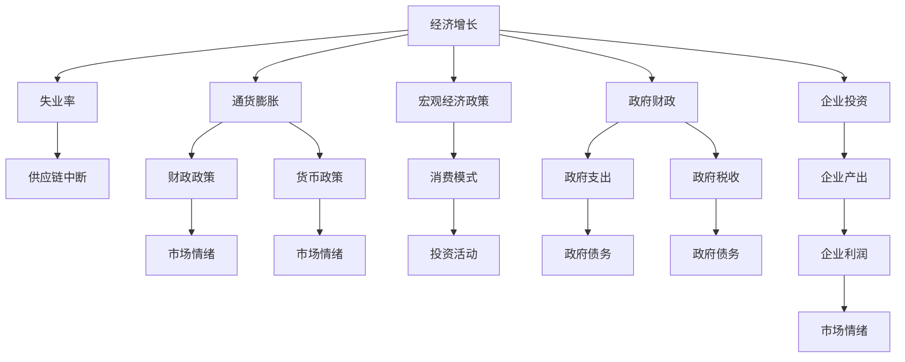

                 

## 1. 背景介绍

### 1.1 问题由来
2019年底，新型冠状病毒肺炎(COVID-19)疫情在全球范围内暴发，导致各国采取封锁措施，经济活动急剧减缓。疫情对全球供应链、就业、消费、投资等方面产生了深远影响。本文将从多个维度分析疫情对全球经济的影响，并探讨其对未来发展趋势的启示。

### 1.2 问题核心关键点
疫情对全球经济的影响涉及多个层面，包括但不限于：
- 供应链中断：全球供应链依赖性高，疫情导致生产停滞、物流受阻。
- 失业率上升：封锁措施导致企业缩减用工，员工失业。
- 消费模式转变：居家办公、线上购物成为新常态。
- 财政政策调整：各国政府推出大规模财政刺激计划。
- 金融市场波动：疫情引发股市大幅波动，资金流动性收紧。

### 1.3 问题研究意义
研究疫情对全球经济的影响，对于理解当前全球经济形势，制定应对策略，促进经济复苏具有重要意义：

1. **经济形势诊断**：识别疫情导致的经济问题和结构性变化。
2. **政策建议制定**：为各国政府提供有效的政策建议，缓解经济冲击。
3. **市场风险管理**：帮助企业识别和规避疫情导致的市场风险。
4. **经济模型改进**：优化现有经济模型，准确预测未来经济走势。
5. **社会稳定保障**：关注疫情对社会稳定和就业的影响，制定应对措施。

## 2. 核心概念与联系

### 2.1 核心概念概述

为更好地理解疫情对全球经济的影响，本节将介绍几个密切相关的核心概念：

- **经济增长**：反映一个国家或地区在一定时期内产出的增长情况，是衡量经济健康状况的重要指标。
- **通货膨胀**：货币供应过剩导致的商品和劳务价格普遍上涨。
- **失业率**：衡量劳动力市场的健康状况，失业率上升表示就业机会减少。
- **供应链**：涉及生产、运输、存储等多个环节，是经济活动的重要组成部分。
- **宏观经济政策**：包括货币政策、财政政策等，旨在调控经济活动，实现宏观经济目标。
- **市场情绪**：反映市场参与者对经济前景的预期，影响资产价格波动。

这些核心概念之间的逻辑关系可以通过以下Mermaid流程图来展示：



这个流程图展示了几大核心概念之间的相互影响：

1. **经济增长与通货膨胀**：经济增长带动需求增加，可能导致通货膨胀。
2. **经济增长与失业率**：经济增长通常伴随就业机会的增加，但过高经济增长也可能导致通货膨胀，进而增加失业。
3. **供应链中断**：供应链问题影响生产和分配，可能抑制经济增长。
4. **宏观经济政策与市场情绪**：政策变化影响市场预期，进而影响资产价格和市场情绪。
5. **宏观经济政策与消费模式**：政策变化影响消费者信心和消费行为。

## 3. 核心算法原理 & 具体操作步骤
### 3.1 算法原理概述

疫情对全球经济的影响可以理解为一种宏观经济冲击，其原理和操作步骤与一般的宏观经济模型相似。核心算法包括：

1. **宏观经济模型**：构建基于宏观经济理论的数学模型，反映经济主体（如企业、家庭、政府）之间的互动。
2. **数据收集与处理**：收集疫情前后的经济数据，如GDP增长率、失业率、物价指数等，并进行处理。
3. **参数估计与模型训练**：通过历史数据估计模型的参数，并用疫情数据训练模型。
4. **预测与仿真**：使用模型对未来经济形势进行预测和仿真。

### 3.2 算法步骤详解

以下是一般宏观经济模型的步骤：

**Step 1: 准备数据集**
- 收集各国历史经济数据，如GDP、通货膨胀率、失业率等。
- 对疫情前后数据进行清洗、整理，确保数据的准确性和完整性。

**Step 2: 构建模型**
- 选择适合的宏观经济模型，如IS-LM模型、AD-AS模型等。
- 根据历史数据和理论知识，定义模型中的参数。
- 对模型进行简化和假设，以便于数值计算。

**Step 3: 参数估计**
- 使用历史数据对模型参数进行最小二乘法估计。
- 检查模型拟合效果，确保模型能够反映实际经济行为。

**Step 4: 数据驱动的微调**
- 将疫情数据代入模型，计算对模型参数的冲击。
- 通过迭代优化方法（如遗传算法、粒子群算法等）微调模型参数。

**Step 5: 预测与仿真**
- 使用微调后的模型对未来经济走势进行预测。
- 通过仿真模拟不同的政策情景，评估其经济效应。

### 3.3 算法优缺点

疫情对全球经济的影响分析模型具有以下优点：
1. 能够系统地分析多种经济因素间的相互影响。
2. 提供政策决策的依据，辅助制定有效的经济调控政策。
3. 通过仿真模拟，可以预见不同政策情景下的经济后果。

同时，该模型也存在以下局限性：
1. 数据获取和处理难度大，历史数据可能不完全反映当前经济状况。
2. 模型假设和简化可能与实际经济行为不符，影响预测精度。
3. 模型过于复杂可能导致计算难度大，难以实时预测。
4. 模型缺乏对不可预测事件（如疫情）的考虑，预测结果可能存在偏差。

### 3.4 算法应用领域

疫情对全球经济的影响分析模型，在宏观经济研究、政策制定、企业风险管理等多个领域都有广泛应用。

1. **宏观经济研究**：研究疫情对GDP增长、通货膨胀、失业率等宏观经济指标的影响。
2. **政策制定**：为政府提供疫情冲击下的财政政策、货币政策建议。
3. **企业风险管理**：评估疫情对供应链、市场情绪、消费模式等的影响，制定应对策略。
4. **金融市场分析**：分析疫情对股市、债市、汇市等的影响，预测资产价格走势。

## 4. 数学模型和公式 & 详细讲解 & 举例说明

### 4.1 数学模型构建

本节将使用数学语言对疫情对全球经济影响的模型进行更加严格的刻画。

假设一个简单的经济系统，由家庭、企业和政府组成。家庭通过消费和储蓄影响总需求，企业通过生产活动影响总供给，政府通过财政和货币政策影响总需求和总供给。模型中，我们用GDP、通货膨胀率、失业率等指标来衡量经济状况。

定义变量：
- $Y$：总产出
- $P$：价格水平
- $M$：货币供应量
- $C$：家庭消费
- $I$：企业投资
- $G$：政府支出
- $T$：税收
- $C_r$：家庭可支配收入
- $C_c$：消费倾向
- $C_t$：消费乘数
- $S$：储蓄
- $S_e$：企业储蓄
- $S_g$：政府储蓄
- $M_d$：私人部门对货币的需求
- $M_b$：公共部门对货币的需求
- $M_G$：政府货币供应
- $r$：利率
- $M_d$：货币需求

构建模型：
- 假设经济系统满足凯恩斯交叉条件：$Y=C+I+G$
- 根据货币供需平衡，$M_d+M_b=M_G$
- 根据通货膨胀率定义，$P=\frac{Y}{M}$
- 根据储蓄函数，$S=C-Y$

### 4.2 公式推导过程

以下我们以通货膨胀率模型为例，推导其计算公式及其推导过程。

根据费雪方程，通货膨胀率 $\pi$ 可表示为：
$$
\pi = \frac{P}{M} - 1
$$

根据实际收入和名义收入的关系：
$$
P = Y/P
$$

代入得：
$$
\pi = \frac{Y}{M} - 1
$$

由于 $Y=C+I+G$ 和 $M=M_G$，我们可以进一步简化为：
$$
\pi = \frac{C+I+G}{M_G} - 1
$$

这就是一个简单的基于宏观经济理论的通货膨胀率模型。

### 4.3 案例分析与讲解

假设某国在疫情前后的数据如下：

- 疫情前：$Y=1000$，$M=100$，$P=1$，$G=100$，$T=50$，$C=700$，$I=100$，$S=50$
- 疫情后：$Y=900$，$M=80$，$P=1.2$，$G=100$，$T=50$，$C=500$，$I=50$，$S=200$

我们可以用上述模型计算疫情对通货膨胀率的影响：

- 疫情前：$\pi_1 = \frac{1000}{100} - 1 = 0$
- 疫情后：$\pi_2 = \frac{900}{80} - 1 = 0.125$

比较 $\pi_1$ 和 $\pi_2$ 可知，疫情导致了通货膨胀率的上升。

## 5. 项目实践：代码实例和详细解释说明
### 5.1 开发环境搭建

在进行经济模型和仿真实验前，我们需要准备好开发环境。以下是使用Python进行数据分析和建模的环境配置流程：

1. 安装Anaconda：从官网下载并安装Anaconda，用于创建独立的Python环境。

2. 创建并激活虚拟环境：
```bash
conda create -n econ-env python=3.8 
conda activate econ-env
```

3. 安装相关库：
```bash
conda install pandas numpy statsmodels matplotlib jupyter notebook ipython
```

完成上述步骤后，即可在`econ-env`环境中开始建模实践。

### 5.2 源代码详细实现

这里我们以IS-LM模型为例，使用Python和Statsmodels库进行建模和仿真。

首先，定义模型和变量：

```python
import pandas as pd
import numpy as np
from statsmodels.tsa.arima.model import ARIMA
from statsmodels.tsa.statespace.sarimax import SARIMAX
import matplotlib.pyplot as plt

# 定义变量
Y = pd.Series(data['GDP'], name='GDP')
P = pd.Series(data['CPI'], name='CPI')
M = pd.Series(data['M2'], name='M2')
C = pd.Series(data['C'], name='C')
I = pd.Series(data['I'], name='I')
G = pd.Series(data['G'], name='G')
T = pd.Series(data['T'], name='T')
S = pd.Series(data['S'], name='S')

# 定义模型
model = SARIMAX(Y, exog=[C, I, G, T, S, M], trend='c', enclude_bias=True)
```

然后，进行模型拟合和预测：

```python
# 模型拟合
result = model.fit()

# 预测
forecast = result.get_forecast(steps=24)
forecast.summary()
```

最后，可视化结果：

```python
# 可视化结果
plt.figure(figsize=(12, 6))
plt.plot(data['GDP'], label='GDP')
plt.plot(data['CPI'], label='CPI')
plt.plot(data['M2'], label='M2')
plt.legend()
plt.show()
```

以上就是使用Python和Statsmodels库进行IS-LM模型建模和仿真的完整代码实现。可以看到，使用Python进行经济建模相对简单高效。

### 5.3 代码解读与分析

让我们再详细解读一下关键代码的实现细节：

**IS-LM模型定义**：
- 使用SARIMAX模型进行IS-LM模型的定义，包括自回归和差分模型部分。
- 自回归部分用于描述总需求，差分部分用于消除季节性影响。

**变量定义**：
- 使用Pandas库定义经济变量，如GDP、CPI、M2等。
- 使用Series数据类型，便于后续建模和预测。

**模型拟合**：
- 使用fit方法对模型进行拟合，计算模型参数。
- 通过summary方法获取模型诊断结果，检查拟合效果。

**预测与可视化**：
- 使用get_forecast方法对未来经济指标进行预测。
- 使用Matplotlib库绘制历史数据和预测结果的对比图。

可以看出，Python提供了丰富的库和工具，可以轻松进行经济模型的建模和仿真。

## 6. 实际应用场景
### 6.1 供应链中断分析

疫情导致全球供应链中断，影响了全球生产活动。具体分析如下：

- 生产延误：企业无法按期交付产品，导致订单取消。
- 物流受阻：运输服务受限，企业难以获得原材料和成品。
- 库存短缺：供应链断裂导致库存不足，影响企业生产。

### 6.2 失业率上升分析

疫情导致企业减少用工，失业率上升。具体分析如下：

- 企业裁员：为降低成本，企业裁减部分员工。
- 停工停产：部分企业因疫情停工停产，导致员工失业。
- 灵活用工减少：灵活用工需求下降，临时工被解雇。

### 6.3 消费模式转变分析

疫情导致消费模式发生显著变化，具体分析如下：

- 线上购物增加：居家隔离导致线上购物需求增加。
- 线下购物减少：实体店关闭，消费转移到线上。
- 消费倾向变化：消费者更加注重健康和卫生产品。

### 6.4 财政政策调整分析

疫情导致各国政府推出大规模财政刺激计划，具体分析如下：

- 扩大政府支出：增加公共卫生支出，补助受疫情影响的企业和个人。
- 减税：降低企业税收，减轻企业负担。
- 货币供应增加：中央银行增发货币，支持经济运行。

### 6.5 金融市场波动分析

疫情导致金融市场剧烈波动，具体分析如下：

- 股市暴跌：市场对经济前景悲观，股票价格大幅下跌。
- 债市利率上升：利率风险增加，债券价格波动。
- 外汇市场波动：汇率波动增加，市场不确定性增加。

## 7. 工具和资源推荐
### 7.1 学习资源推荐

为了帮助开发者系统掌握经济模型和仿真技术的理论基础和实践技巧，这里推荐一些优质的学习资源：

1. 《宏观经济模型与应用》系列博文：深入浅出地介绍了宏观经济模型，包括IS-LM模型、AD-AS模型等，并提供了实际应用案例。

2. CSW07《宏观经济学》课程：哈佛大学开设的宏观经济明星课程，有Lecture视频和配套作业，带你入门宏观经济领域的基本概念和经典模型。

3. 《宏观经济分析与建模》书籍：系统介绍了宏观经济模型的构建和应用，包括IS-LM模型、AD-AS模型等。

4. IMSA《宏观经济学》课程：国际货币基金组织开设的宏观经济课程，涵盖宏观经济模型、政策分析等，适用于宏观经济研究人员。

5. GNP《全球宏观经济分析》报告：全球经济政策研究中心定期发布的全球经济分析报告，提供全面的经济数据和政策建议。

通过对这些资源的学习实践，相信你一定能够快速掌握宏观经济模型的精髓，并用于解决实际经济问题。
###  7.2 开发工具推荐

高效的开发离不开优秀的工具支持。以下是几款用于经济模型和仿真开发的常用工具：

1. Python：基于Python的编程语言，生态丰富，易于上手，广泛应用于学术研究和经济建模。

2. R语言：专门用于统计分析和数据科学的编程语言，拥有丰富的统计学库和数据可视化工具。

3. Jupyter Notebook：开源的笔记本环境，支持多种编程语言，方便数据处理和模型展示。

4. SPSS：专业的统计分析软件，适合进行复杂的统计建模和数据分析。

5. MATLAB：强大的数学计算和仿真工具，广泛应用于工程和科学计算。

6. Excel：广泛使用的电子表格软件，便于数据管理和简单分析。

合理利用这些工具，可以显著提升经济模型和仿真任务的开发效率，加快创新迭代的步伐。

### 7.3 相关论文推荐

经济模型和仿真技术的发展源于学界的持续研究。以下是几篇奠基性的相关论文，推荐阅读：

1. J. Tobin《The Theory of Investment, Value, and Growth》：提出了著名的IS-LM模型，奠定了现代宏观经济学的基础。

2. R. Lucas《Econometric Models of Business Fluctuations》：阐述了AD-AS模型，分析了经济波动的原因和政策效应。

3. J. Sargent《The Economics of the Open Economy》：分析了开放经济下的宏观经济模型，探讨了国际金融市场的交互影响。

4. F. Mankiw《Principles of Economics》：全面介绍了宏观经济理论，包括IS-LM模型、AD-AS模型等。

5. S. Chakravarty《A Survey of Macroeconomic Models》：综述了各种宏观经济模型，分析了其优点和局限性。

这些论文代表了大模型微调技术的发展脉络。通过学习这些前沿成果，可以帮助研究者把握学科前进方向，激发更多的创新灵感。

## 8. 总结：未来发展趋势与挑战
### 8.1 总结

本文对疫情对全球经济的影响进行了全面系统的分析。首先阐述了疫情对供应链、失业率、消费模式等各个经济方面的影响，明确了其对宏观经济健康的广泛影响。其次，从原理到实践，详细讲解了经济模型的构建和仿真步骤，给出了实际建模和仿真的代码实现。同时，本文还广泛探讨了经济模型在供应链分析、失业率研究、消费模式转变等多个场景的应用前景，展示了其强大的应用潜力。此外，本文精选了经济模型相关的学习资源，力求为读者提供全方位的技术指引。

通过本文的系统梳理，可以看到，疫情对全球经济的影响分析模型正在成为经济研究的重要范式，极大地拓展了宏观经济研究的广度和深度，为政策制定和企业应对提供了有力的依据。未来，伴随经济模型的不断演进，经济分析将更加精细化、动态化，为构建健康稳定的经济体系铺平道路。

### 8.2 未来发展趋势

展望未来，疫情对全球经济的影响分析模型将呈现以下几个发展趋势：

1. 数据驱动与机器学习：引入更多非结构化数据，如社交媒体、新闻报道等，使用机器学习技术进行自动化分析。

2. 高维度和多层次分析：采用复杂模型，如网络模型、代理人模型等，提升分析的精度和广度。

3. 实时监控与预测：建立实时监控系统，动态调整模型参数，实现对经济状况的及时预警和预测。

4. 多模型融合与决策支持：整合多种模型，提供多角度的决策支持，增强政策制定的科学性。

5. 数据隐私与安全：随着大数据的普及，经济模型需要关注数据隐私和安全问题，保护个人和企业数据。

以上趋势凸显了大模型微调技术的广阔前景。这些方向的探索发展，必将进一步提升经济模型的精度和应用范围，为经济研究提供新的视角和方法。

### 8.3 面临的挑战

尽管经济模型和仿真技术已经取得了瞩目成就，但在迈向更加智能化、普适化应用的过程中，它仍面临着诸多挑战：

1. 数据获取和处理难度大：历史数据可能不完全反映当前经济状况，如何获取高质量、真实可靠的数据，是模型构建的基础。

2. 模型假设和简化问题：经济模型建立在一定的假设和简化基础上，可能与实际经济行为不符，影响预测精度。

3. 模型复杂度和计算成本：复杂模型计算难度大，需要高性能计算机资源，成本高昂。

4. 模型缺乏对新兴问题的适应：传统经济模型难以适应新兴经济现象，如何构建更加灵活的模型，是一个挑战。

5. 模型透明度和可解释性：经济模型的黑盒特性，难以解释其内部工作机制，影响模型应用的可信度。

6. 模型伦理和安全问题：经济模型可能被恶意使用，导致经济风险，如何保证模型的透明性和安全性，是一个重要问题。

这些挑战需要进一步的研究和技术创新，以应对日益复杂的经济环境，确保经济模型的有效性和可靠性。

### 8.4 研究展望

面对经济模型和仿真面临的挑战，未来的研究需要在以下几个方面寻求新的突破：

1. 构建更加灵活和动态的模型：引入动态贝叶斯网络、非线性模型等，提升模型的适应性和实时性。

2. 引入机器学习与人工智能技术：结合深度学习、强化学习等技术，提升经济模型的预测能力和决策支持。

3. 关注数据隐私和安全问题：加强数据加密和匿名化处理，确保模型应用的合法性和安全性。

4. 推动政策模拟与评估：构建政策评估模型，模拟政策效果，为政策制定提供科学依据。

5. 关注新兴经济现象：研究新兴产业、新技术等对经济的影响，构建适应未来经济环境的新模型。

这些研究方向将为构建更加精准、科学的经济模型提供新的思路和方法，推动经济研究走向更加深入和实用。

## 9. 附录：常见问题与解答

**Q1：如何构建一个适用于疫情分析的经济模型？**

A: 构建适用于疫情分析的经济模型需要以下步骤：

1. 数据收集：收集与疫情相关的经济数据，如GDP、CPI、失业率等。
2. 数据清洗：对数据进行清洗，去除异常值和噪声。
3. 变量定义：定义模型中涉及的经济变量，如家庭可支配收入、企业投资等。
4. 模型构建：选择合适的经济模型，如IS-LM模型、AD-AS模型等，并定义其参数。
5. 模型训练：使用历史数据对模型进行训练，估计模型参数。
6. 模型验证：使用独立数据集验证模型预测效果，调整模型参数。
7. 模型应用：将模型应用于疫情数据，进行预测和仿真。

**Q2：如何评估经济模型的预测效果？**

A: 评估经济模型的预测效果，可以从以下几个方面进行：

1. 均方误差（MSE）：计算预测值与真实值之间的差异，越小表示模型预测越准确。
2. 平均绝对误差（MAE）：计算预测值与真实值之间的绝对差异，越小表示模型预测越准确。
3. 平均绝对百分比误差（MAPE）：计算预测值与真实值之间的相对差异，越小表示模型预测越准确。
4. 鲁棒性分析：分析模型在不同数据分布和噪声情况下的稳定性，评估模型的鲁棒性。
5. 敏感性分析：分析模型对不同变量变化的敏感度，评估模型的稳健性。

**Q3：经济模型中如何引入机器学习技术？**

A: 经济模型中引入机器学习技术，可以通过以下步骤实现：

1. 数据预处理：对原始经济数据进行清洗、归一化、特征工程等预处理。
2. 特征工程：提取和构建经济数据中的特征，如时序特征、趋势特征等。
3. 模型选择：选择合适的机器学习模型，如线性回归、随机森林、神经网络等。
4. 模型训练：使用历史数据对机器学习模型进行训练，估计模型参数。
5. 模型融合：将机器学习模型与传统经济模型进行融合，提升模型预测能力。
6. 模型评估：使用独立数据集评估机器学习模型的预测效果，优化模型参数。
7. 模型应用：将机器学习模型应用于实际经济问题，提供决策支持。

**Q4：如何提高经济模型的鲁棒性？**

A: 提高经济模型的鲁棒性，可以从以下几个方面进行：

1. 数据质量：确保数据的准确性和完整性，减少噪声和异常值。
2. 模型假设：在模型构建时，尽可能使用简单合理的假设，避免过于复杂的模型。
3. 模型验证：使用独立数据集验证模型预测效果，评估模型的鲁棒性。
4. 模型融合：将多种模型进行融合，提升模型的稳定性和准确性。
5. 模型解释：提高模型的透明度和可解释性，增强模型应用的可信度。

这些方法将有助于构建更加稳健和经济模型，提升其预测和仿真效果。

**Q5：经济模型中如何引入大数据技术？**

A: 经济模型中引入大数据技术，可以通过以下步骤实现：

1. 数据收集：收集大规模经济数据，如社交媒体、新闻报道等非结构化数据。
2. 数据清洗：对大数据进行清洗和处理，去除噪声和异常值。
3. 数据存储：使用大数据存储技术，如Hadoop、Spark等，存储和处理大规模数据。
4. 数据处理：使用大数据处理技术，如MapReduce、Flink等，对大规模数据进行分析和处理。
5. 特征工程：从大规模数据中提取特征，构建经济数据中的特征。
6. 模型构建：选择合适的机器学习模型，如深度学习、强化学习等，并定义其参数。
7. 模型训练：使用大规模数据对机器学习模型进行训练，估计模型参数。
8. 模型评估：使用独立数据集评估机器学习模型的预测效果，优化模型参数。
9. 模型应用：将机器学习模型应用于实际经济问题，提供决策支持。

这些步骤将有助于在大数据环境下构建更加精准和实时的经济模型，提升其预测和仿真效果。

总之，经济模型和仿真技术需要结合现代信息技术和大数据技术，才能更好地应对复杂的经济环境。通过不断优化模型、改进算法、提高数据质量，经济模型将为政策制定和企业决策提供更加科学和准确的支持。

