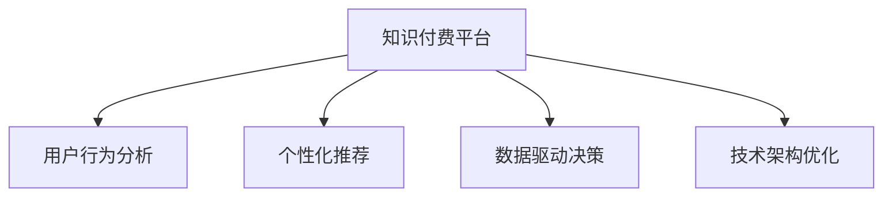

                 

# 知识付费创业中的用户体验优化

> 关键词：知识付费, 用户体验优化, 用户行为分析, 个性化推荐, 数据驱动决策, 内容推荐系统

## 1. 背景介绍

### 1.1 问题由来

在移动互联网时代，知识付费成为越来越多人的消费选择。无论是获取专业知识，还是提升技能水平，用户都希望在短时间内获得高质量的内容。然而，当前的知识付费平台往往面临着用户体验欠佳的问题，如课程推荐不精准、购买体验繁琐、学习效果不佳等。这些问题不仅影响了用户满意度，还制约了平台的商业价值和发展空间。因此，优化知识付费平台的用户体验，提升用户黏性，成为各平台竞相突破的关键。

### 1.2 问题核心关键点

优化知识付费平台的用户体验，主要涉及以下几个核心问题：
1. **用户行为分析**：理解用户在不同场景下的行为模式，分析用户对课程的喜好和偏好。
2. **个性化推荐**：根据用户行为和偏好，提供精准的课程推荐，提升用户满意度和购买意愿。
3. **数据驱动决策**：利用数据挖掘和分析技术，动态调整内容和推荐策略，持续优化用户体验。
4. **技术架构优化**：设计高效、可扩展的用户体验优化技术架构，确保平台的高可用性和可维护性。

本文将从用户行为分析、个性化推荐、数据驱动决策和架构优化四个方面，系统介绍知识付费平台的用户体验优化方法。

## 2. 核心概念与联系

### 2.1 核心概念概述

为更好地理解知识付费平台的用户体验优化方法，本节将介绍几个密切相关的核心概念：

- **知识付费平台(Knowledge-Pay Platform, KPP)**：基于互联网，提供付费课程、讲座、电子书等知识产品，以内容为核心，用户为核心的商业平台。
- **用户行为分析(User Behavior Analysis, UBA)**：通过收集和分析用户在使用知识付费平台时的行为数据，了解用户需求和行为模式，从而指导产品改进和优化。
- **个性化推荐系统(Personalized Recommendation System, PRS)**：根据用户的历史行为和偏好，动态调整课程推荐策略，提供个性化的学习内容，提升用户体验。
- **数据驱动决策(Data-Driven Decision Making, DDDM)**：利用大数据分析和机器学习技术，驱动产品开发和运营决策，持续优化用户体验。
- **技术架构优化(Architecture Optimization)**：设计高效、可扩展的技术架构，确保平台的稳定性和可维护性，支持用户体验优化的高效实施。

这些核心概念之间的逻辑关系可以通过以下Mermaid流程图来展示：



这个流程图展示了好用户体验优化的各个关键组件及其之间的关系：

1. 知识付费平台通过收集用户数据，启动行为分析和个性化推荐。
2. 数据驱动决策以行为分析为基础，进一步优化推荐和产品策略。
3. 技术架构优化为平台提供了坚实的基础，支持各个模块的高效运行。

## 3. 核心算法原理 & 具体操作步骤

### 3.1 算法原理概述

知识付费平台的用户体验优化，本质上是一个数据驱动的用户行为分析与个性化推荐过程。其核心思想是：利用大数据和机器学习技术，分析和理解用户在平台上的行为模式，并据此提供个性化的课程推荐，提升用户满意度和平台黏性。

具体而言，用户在知识付费平台上的行为数据可以包括以下几个维度：
- 浏览行为：浏览课程、目录、讲师等信息。
- 搜索行为：输入关键字，查找相关课程或讲座。
- 购买行为：选择课程并完成支付。
- 学习行为：观看视频、阅读文章、完成测验等。

通过收集和分析这些数据，可以构建用户画像，识别用户偏好和行为模式，并据此进行推荐和优化。

### 3.2 算法步骤详解

知识付费平台的用户体验优化主要包括以下几个关键步骤：

**Step 1: 数据采集与预处理**
- 收集用户在不同场景下的行为数据，如浏览、搜索、购买、学习等。
- 数据清洗和归一化，去除异常值和噪声，确保数据质量。

**Step 2: 用户行为分析**
- 利用数据挖掘技术，如关联规则、序列模式、聚类分析等，识别用户的行为模式和偏好。
- 利用机器学习技术，如决策树、随机森林、协同过滤等，构建用户画像，并预测用户行为。

**Step 3: 个性化推荐**
- 根据用户画像和行为模式，利用推荐算法，如协同过滤、基于内容的推荐、矩阵分解等，提供个性化的课程推荐。
- 引入多臂老虎机等在线学习算法，动态调整推荐策略，提升推荐效果。

**Step 4: 数据驱动决策**
- 利用A/B测试等方法，评估推荐效果，收集用户反馈。
- 利用统计分析和机器学习技术，分析用户反馈，优化推荐算法和策略。
- 动态调整课程内容和运营策略，提升用户体验。

**Step 5: 技术架构优化**
- 设计高效、可扩展的技术架构，确保平台的稳定性和可维护性。
- 采用缓存、负载均衡、分布式计算等技术，提高平台的响应速度和扩展能力。
- 引入DevOps、持续集成/持续部署(CI/CD)等自动化流程，加速产品迭代和优化。

以上是知识付费平台用户体验优化的主要步骤。在实际应用中，还需要根据具体平台的特点，对各环节进行优化设计，如改进推荐算法、引入新数据源、设计更加灵活的用户画像模型等。

### 3.3 算法优缺点

知识付费平台的用户体验优化方法具有以下优点：
1. 提升用户满意度：通过个性化的推荐，满足用户对知识内容的个性化需求，提升学习体验。
2. 增加用户黏性：优化用户体验，提高用户留存率和活跃度，增强平台竞争力。
3. 降低运营成本：通过数据分析和个性化推荐，优化课程推荐和广告投放，降低运营成本。
4. 增强平台收益：优化用户体验，提升用户满意度和转化率，增加平台收益。

同时，该方法也存在一定的局限性：
1. 数据隐私问题：用户行为数据的收集和分析可能引发隐私保护问题。
2. 算法偏见：推荐算法可能受到数据偏见的影响，导致不公正推荐。
3. 用户行为多样性：用户行为模式多样，单一算法难以覆盖所有场景。
4. 数据质量依赖：个性化推荐和数据驱动决策的质量很大程度上依赖于数据的质量和全面性。

尽管存在这些局限性，但就目前而言，数据驱动的用户体验优化方法仍然是知识付费平台优化的主流范式。未来相关研究的重点在于如何进一步提升数据质量，减少算法偏见，拓展个性化推荐的应用场景，同时兼顾用户隐私保护和算法公平性等因素。

### 3.4 算法应用领域

知识付费平台的用户体验优化方法，已经在各类知识付费应用中得到了广泛的应用，例如：

- **课程推荐系统**：根据用户浏览、搜索、学习行为，推荐用户感兴趣的课程。
- **用户行为分析系统**：分析用户行为数据，识别用户需求和偏好，优化课程内容和推荐策略。
- **个性化学习路径规划**：根据用户的学习进度和偏好，推荐适宜的学习路径，提升学习效率。
- **广告推荐系统**：通过用户行为分析，推荐用户感兴趣的相关广告，提升平台收入。
- **用户满意度评估系统**：收集用户反馈，进行满意度分析，优化用户体验和课程内容。

除了上述这些经典应用外，知识付费平台的用户体验优化还涵盖了如内容智能推荐、学习行为监控、课程质量评估等多个环节，为平台的持续优化提供了全面的技术支持。

## 4. 数学模型和公式 & 详细讲解  
### 4.1 数学模型构建

本节将使用数学语言对知识付费平台用户体验优化过程进行更加严格的刻画。

设用户集合为 $U$，课程集合为 $I$。用户 $u \in U$ 对课程 $i \in I$ 的评分 $r_{ui}$ 可以表示为用户 $u$ 的兴趣度 $a_u$ 和课程 $i$ 的质量 $q_i$ 的线性加权和：

$$
r_{ui} = \alpha_u q_i + (1-\alpha_u) p_i
$$

其中 $\alpha_u$ 为 $u$ 对 $i$ 的兴趣度权重，$p_i$ 为课程 $i$ 的平均评分。

设 $R$ 为用户-课程评分矩阵，$A$ 为用户兴趣度矩阵，$P$ 为课程平均评分矩阵。则用户 $u$ 的个性化推荐可以表示为：

$$
\hat{r}_{ui} = \alpha_u q_i + (1-\alpha_u) p_i = \mathbf{R}_u \mathbf{A}^T + \mathbf{P} (1-\mathbf{A}_u)
$$

其中 $\mathbf{R}_u$ 为 $u$ 的评分向量，$\mathbf{A}^T$ 为 $u$ 的兴趣度权重向量，$\mathbf{P}$ 为课程平均评分向量，$(1-\mathbf{A}_u)$ 为 $u$ 的兴趣度权重缺失部分。

### 4.2 公式推导过程

在实际应用中，我们通常使用协同过滤算法来实现个性化推荐。协同过滤算法的基本思想是通过分析用户行为数据，构建用户相似度矩阵和物品相似度矩阵，进而进行推荐。

设 $R$ 为 $N \times M$ 的用户-课程评分矩阵，$A$ 为 $N \times K$ 的用户兴趣度矩阵，$P$ 为 $M \times K$ 的课程平均评分矩阵。协同过滤算法的核心步骤包括：

1. 计算用户 $u$ 和用户 $v$ 的相似度 $\sim_{uv}$：

$$
\sim_{uv} = \frac{\mathbf{R}_u \mathbf{A}^T \mathbf{A}_v^{-1} \mathbf{A}_u}{||\mathbf{A}_u|| \times ||\mathbf{A}_v||}
$$

其中 $||\mathbf{A}_u||$ 为 $u$ 的兴趣度向量的范数，$\mathbf{A}_v^{-1}$ 为 $v$ 的兴趣度权重矩阵的逆矩阵。

2. 计算课程 $i$ 和课程 $j$ 的相似度 $\sim_{ij}$：

$$
\sim_{ij} = \frac{\mathbf{R}_i^T \mathbf{A} \mathbf{A}_j^{-1} \mathbf{R}_j}{||\mathbf{A}_j|| \times ||\mathbf{R}_j||}
$$

其中 $||\mathbf{R}_j||$ 为 $j$ 的评分矩阵的范数，$\mathbf{A}_j^{-1}$ 为 $j$ 的兴趣度权重矩阵的逆矩阵。

3. 计算课程 $i$ 对用户 $u$ 的推荐分数 $\hat{r}_{ui}$：

$$
\hat{r}_{ui} = \sum_{v \in U} \sim_{uv} \cdot \mathbf{R}_{vi} + \sum_{j \in I} \sim_{ij} \cdot \mathbf{P}_j
$$

其中 $\sim_{uv}$ 为用户 $u$ 和用户 $v$ 的相似度，$\mathbf{R}_{vi}$ 为课程 $v$ 对 $u$ 的评分向量，$\sim_{ij}$ 为课程 $i$ 和课程 $j$ 的相似度，$\mathbf{P}_j$ 为课程 $j$ 的平均评分向量。

在得到推荐分数后，根据评分阈值和排序规则，选取推荐课程列表，完成个性化推荐。

### 4.3 案例分析与讲解

**案例：基于协同过滤的用户推荐系统**

一家在线教育平台，希望通过个性化推荐提升用户学习体验。该平台收集了用户在学习过程中的浏览、搜索、购买、学习等行为数据，并尝试利用协同过滤算法进行推荐优化。

1. 数据准备：
- 收集用户 $N=10000$ 和课程 $M=5000$ 的历史行为数据，包括课程评分、搜索记录、学习时长等。
- 构建用户兴趣度矩阵 $A$ 和课程平均评分矩阵 $P$。

2. 模型训练：
- 计算用户 $u$ 和用户 $v$ 的相似度 $\sim_{uv}$，得到用户相似度矩阵 $S_{uv}$。
- 计算课程 $i$ 和课程 $j$ 的相似度 $\sim_{ij}$，得到课程相似度矩阵 $S_{ij}$。

3. 个性化推荐：
- 对于用户 $u$，计算其对课程 $i$ 的推荐分数 $\hat{r}_{ui}$。
- 根据推荐分数，选取 top-K 课程进行推荐。

通过上述步骤，平台可以动态调整推荐策略，满足不同用户的个性化需求，提升用户满意度和平台收益。

## 5. 项目实践：代码实例和详细解释说明
### 5.1 开发环境搭建

在进行用户体验优化项目开发前，我们需要准备好开发环境。以下是使用Python进行Flask框架开发的环境配置流程：

1. 安装Anaconda：从官网下载并安装Anaconda，用于创建独立的Python环境。

2. 创建并激活虚拟环境：
```bash
conda create -n pyenv python=3.8 
conda activate pyenv
```

3. 安装Flask：
```bash
pip install Flask
```

4. 安装SQLAlchemy：
```bash
pip install SQLAlchemy
```

5. 安装Gunicorn：
```bash
pip install Gunicorn
```

6. 安装Flask-RESTful：
```bash
pip install Flask-RESTful
```

完成上述步骤后，即可在`pyenv`环境中开始用户体验优化项目开发。

### 5.2 源代码详细实现

下面我们以个性化推荐系统为例，给出使用Flask框架的Python代码实现。

首先，定义推荐系统的数据模型：

```python
from flask_sqlalchemy import SQLAlchemy

db = SQLAlchemy()

class User(db.Model):
    id = db.Column(db.Integer, primary_key=True)
    name = db.Column(db.String(50))
    interests = db.relationship('Interest', backref='user', lazy='dynamic')

class Course(db.Model):
    id = db.Column(db.Integer, primary_key=True)
    name = db.Column(db.String(50))
    rating = db.Column(db.Float)

class Interest(db.Model):
    id = db.Column(db.Integer, primary_key=True)
    user_id = db.Column(db.Integer, db.ForeignKey('user.id'))
    course_id = db.Column(db.Integer, db.ForeignKey('course.id'))
```

然后，定义推荐系统的推荐逻辑：

```python
from sklearn.metrics.pairwise import cosine_similarity
import pandas as pd

def calculate_similarity(user1, user2):
    # 计算用户相似度
    user1_interests = [interest.course_id for interest in user1.interests]
    user2_interests = [interest.course_id for interest in user2.interests]
    user1_rated_courses = Course.query.filter(Course.id.in_(user1_interests)).all()
    user2_rated_courses = Course.query.filter(Course.id.in_(user2_interests)).all()
    user1_rated course_ratings = [course.rating for course in user1_rated_courses]
    user2_rated_course_ratings = [course.rating for course in user2_rated_courses]
    similarity = cosine_similarity(user1_rated_course_ratings, user2_rated_course_ratings)
    return similarity

def recommend_courses(user, top_k=5):
    # 根据用户相似度推荐课程
    similarity_matrix = [calculate_similarity(user, other_user) for other_user in User.query.all()]
    top_k_similar_users = sorted(range(len(similarity_matrix)), key=lambda i: similarity_matrix[i], reverse=True)[:top_k]
    recommended_courses = set()
    for similar_user_index in top_k_similar_users:
        recommended_courses.update(Course.query.filter_by(id=Course.id.in_(similar_user_index)).all())
    return recommended_courses
```

最后，定义API接口和调用逻辑：

```python
from flask import Flask, request, jsonify

app = Flask(__name__)

@app.route('/recommend_courses', methods=['POST'])
def recommend_courses_api():
    user_data = request.json
    user = User.query.filter_by(name=user_data['name']).first()
    if not user:
        return jsonify({'message': 'User not found'}), 404
    recommended_courses = recommend_courses(user)
    return jsonify({course.name: course.rating for course in recommended_courses})

if __name__ == '__main__':
    app.run(debug=True)
```

以上就是使用Flask框架进行个性化推荐系统的完整代码实现。可以看到，通过Flask和SQLAlchemy的封装，我们能够以相对简洁的代码完成推荐系统的搭建。

### 5.3 代码解读与分析

让我们再详细解读一下关键代码的实现细节：

**User类**：
- `__init__`方法：初始化用户的基本信息。
- `interests`属性：定义用户兴趣与课程之间的关系，即用户对课程的评分。

**Course类**：
- `__init__`方法：初始化课程的基本信息，包括课程名和评分。

**Interest类**：
- `__init__`方法：定义用户对课程的评分，关联用户和课程。

**calculate_similarity函数**：
- 计算用户之间的相似度，利用cosine_similarity函数实现。

**recommend_courses函数**：
- 根据用户相似度推荐课程，遍历所有用户，计算用户之间的相似度，根据相似度推荐课程。

**recommend_courses_api函数**：
- 定义API接口，接收用户名，查询用户信息，调用recommend_courses函数进行推荐，返回推荐课程列表。

通过上述代码，我们可以看到，用户体验优化项目需要结合用户行为数据、推荐算法和API接口设计，以实现个性化推荐系统的开发。

当然，工业级的系统实现还需考虑更多因素，如推荐算法的优化、数据存储的优化、API接口的性能调优等。但核心的个性化推荐流程基本与此类似。

## 6. 实际应用场景
### 6.1 智能客服系统

基于个性化推荐的用户体验优化方法，可以广泛应用于智能客服系统的构建。传统客服往往需要配备大量人力，高峰期响应缓慢，且一致性和专业性难以保证。而使用个性化推荐算法，可以为每位用户提供专属的服务方案，提升用户体验。

在技术实现上，可以收集用户的历史互动记录和偏好数据，构建用户画像，根据用户画像进行个性化推荐。推荐算法可以在短时间内提供个性化的客服解决方案，减少用户等待时间，提升用户满意度。

### 6.2 金融服务平台

金融服务平台需要实时了解用户需求，提供个性化的金融服务和产品推荐。通过个性化推荐，平台能够根据用户的消费记录和行为数据，推荐个性化的理财产品、投资策略等，提升用户黏性。

在具体实现上，可以收集用户的交易记录、理财偏好等数据，构建用户画像，进行行为分析和推荐优化。推荐算法可以动态调整推荐策略，根据用户的实时需求，提供个性化的金融服务，提升平台收益。

### 6.3 旅游推荐平台

旅游推荐平台需要根据用户的兴趣和偏好，提供个性化的旅游推荐。通过个性化推荐，平台能够提供符合用户期望的旅游路线、酒店、景点等，提升用户体验。

在实现上，可以收集用户的浏览记录、搜索关键词、预订记录等数据，构建用户画像，进行行为分析和推荐优化。推荐算法可以根据用户的偏好和行为，推荐个性化的旅游方案，提升用户满意度。

### 6.4 未来应用展望

随着个性化推荐技术的不断发展，基于用户体验优化的方法将在更多领域得到应用，为各行各业带来变革性影响。

在医疗健康领域，个性化推荐可以应用于疾病诊断、治疗方案推荐等环节，提升医疗服务的个性化和精准性。

在教育培训领域，个性化推荐可以应用于课程推荐、学习路径规划等环节，提升学习效果和用户体验。

在零售电商领域，个性化推荐可以应用于商品推荐、优惠券推荐等环节，提升用户购买体验和平台销售业绩。

此外，在体育赛事、娱乐传媒、交通出行等众多领域，个性化推荐的应用场景也将不断拓展，为各行业提供更智能、高效的服务解决方案。

## 7. 工具和资源推荐
### 7.1 学习资源推荐

为了帮助开发者系统掌握用户体验优化的技术基础和实践技巧，这里推荐一些优质的学习资源：

1. **《推荐系统实战》**：一本介绍推荐系统理论和实践的经典书籍，涵盖了协同过滤、内容推荐、混合推荐等核心算法。

2. **Coursera《Machine Learning》**：斯坦福大学开设的机器学习课程，系统介绍机器学习和推荐系统的基础理论，并包含多个案例分析。

3. **Kaggle**：一个数据科学竞赛平台，提供丰富的推荐系统竞赛和数据集，可以通过竞赛学习和实践推荐算法。

4. **TF-IDF算法**：一种基于文本特征的推荐算法，适用于文本数据较多的场景。

5. **Apache Mahout**：一个开源的推荐系统框架，包含多种推荐算法和实现，适用于大规模推荐系统开发。

通过这些资源的学习实践，相信你一定能够快速掌握个性化推荐系统的核心技术和应用方法，提升用户体验优化能力。

### 7.2 开发工具推荐

高效的开发离不开优秀的工具支持。以下是几款用于用户体验优化项目的常用工具：

1. **Flask**：一个轻量级的Python Web框架，适合快速迭代和原型开发，支持API接口设计。

2. **SQLAlchemy**：一个强大的Python ORM框架，支持多种数据库，提供灵活的数据库操作和查询。

3. **Gunicorn**：一个Python WSGI HTTP服务器，支持异步处理和负载均衡，提高API接口的响应速度和扩展能力。

4. **Flask-RESTful**：一个基于Flask的RESTful API框架，支持API接口的快速设计和开发。

5. **TensorFlow**：一个开源的机器学习框架，支持多种推荐算法和深度学习模型的实现，适用于复杂的推荐系统开发。

6. **PyTorch**：一个开源的深度学习框架，支持动态计算图和灵活的模型设计，适用于推荐算法和深度学习模型的开发。

合理利用这些工具，可以显著提升用户体验优化项目的开发效率，加速产品迭代和优化。

### 7.3 相关论文推荐

个性化推荐技术的发展源于学界的持续研究。以下是几篇奠基性的相关论文，推荐阅读：

1. **《推荐系统实践》**：一本介绍推荐系统理论和实践的经典书籍，涵盖了协同过滤、内容推荐、混合推荐等核心算法。

2. **《协同过滤推荐算法》**：一篇综述性的论文，介绍了协同过滤算法的原理、优缺点和应用场景。

3. **《基于内容的推荐系统》**：一篇介绍内容推荐算法的论文，涵盖协同过滤、基于内容的推荐、混合推荐等核心算法。

4. **《深度学习在推荐系统中的应用》**：一篇综述性的论文，介绍了深度学习在推荐系统中的应用，包括深度协同过滤、深度内容推荐等。

5. **《基于知识图谱的推荐系统》**：一篇介绍知识图谱在推荐系统中的应用，涵盖知识图谱构建、推荐算法等。

这些论文代表了个性化推荐技术的发展脉络。通过学习这些前沿成果，可以帮助研究者把握学科前进方向，激发更多的创新灵感。

## 8. 总结：未来发展趋势与挑战

### 8.1 总结

本文对知识付费平台用户体验优化的核心算法和操作步骤进行了详细讲解，系统介绍了推荐系统、数据驱动决策和架构优化的技术方法。通过具体的案例分析，展示了推荐系统在智能客服、金融服务平台、旅游推荐平台等实际应用场景中的落地效果。

通过本文的系统梳理，可以看到，用户体验优化是知识付费平台优化用户体验的重要手段，能够提升用户满意度和平台收益。未来，随着推荐算法和数据技术的不断进步，用户体验优化将变得更加智能和个性化，进一步提升平台的竞争力和用户黏性。

### 8.2 未来发展趋势

展望未来，用户体验优化的发展趋势将呈现以下几个方向：

1. **推荐算法的多样化**：除了传统的协同过滤、内容推荐等算法，未来还将涌现更多新的推荐算法，如深度协同过滤、知识图谱推荐、多臂老虎机等。

2. **数据驱动决策的深度化**：通过深度学习和强化学习技术，优化推荐算法和策略，提升推荐效果和用户满意度。

3. **推荐系统的泛化能力提升**：推荐系统将更多地应用于跨领域、跨场景的推荐任务，提升系统的泛化能力和鲁棒性。

4. **推荐系统的实时化**：通过实时数据流处理和在线学习技术，实现推荐系统的动态调整和实时优化。

5. **推荐系统的个性化程度提升**：结合用户行为数据、社交网络和情感分析等技术，提升个性化推荐的效果和精度。

6. **推荐系统的智能化**：结合自然语言处理、语音识别等技术，实现更加智能化的推荐交互方式，提升用户体验。

以上趋势凸显了用户体验优化的广阔前景。这些方向的探索发展，必将进一步提升推荐系统的性能和应用范围，为用户带来更丰富、更精准的个性化体验。

### 8.3 面临的挑战

尽管用户体验优化的发展前景广阔，但在迈向更加智能化、普适化应用的过程中，它仍面临着诸多挑战：

1. **数据质量问题**：推荐系统的效果很大程度上依赖于数据的质量和全面性，如何收集和处理高质量的数据，是推荐系统优化的重要挑战。

2. **推荐算法偏见**：推荐算法可能受到数据偏见的影响，导致不公正推荐。如何消除算法偏见，实现公平推荐，是推荐系统优化的关键问题。

3. **用户隐私保护**：用户行为数据的收集和分析可能引发隐私保护问题，如何平衡用户隐私保护和推荐效果，是推荐系统优化的重要考量。

4. **推荐系统的复杂性**：推荐系统的实现涉及多方面的技术，如何整合不同技术和算法，实现高效、可扩展的系统架构，是推荐系统优化的难点。

5. **推荐系统的实时性**：推荐系统的实时优化和动态调整，对系统架构和技术实现提出了更高要求，如何提升系统的响应速度和扩展能力，是推荐系统优化的重要挑战。

尽管存在这些挑战，但随着技术不断进步和应用不断深入，推荐系统的优化和应用将不断拓展，为用户带来更加智能、个性化的体验。

### 8.4 研究展望

面对推荐系统优化的诸多挑战，未来的研究需要在以下几个方面寻求新的突破：

1. **大数据分析与处理**：结合大数据技术，提升推荐系统的数据处理和分析能力，实现高质量的数据驱动决策。

2. **深度学习与强化学习**：利用深度学习与强化学习技术，优化推荐算法和策略，提升推荐效果和系统性能。

3. **多模态推荐**：结合文本、图像、语音等多种数据源，提升推荐系统的泛化能力和智能化程度。

4. **公平与透明推荐**：研究公平推荐算法，消除数据偏见和算法偏见，提高推荐系统的透明性和可解释性。

5. **跨领域推荐**：研究跨领域、跨场景的推荐算法，提升推荐系统的泛化能力和适应性。

6. **用户隐私保护**：研究用户隐私保护技术，实现用户行为数据的安全存储和处理，保障用户隐私权益。

这些研究方向将推动推荐系统向更高层次的智能化和个性化迈进，为用户带来更加丰富、精准的个性化体验。面向未来，推荐系统的研究将与更多前沿技术相结合，共同推动人工智能技术的进一步发展。

## 9. 附录：常见问题与解答

**Q1：推荐算法如何选择？**

A: 推荐算法的选择需要考虑多个因素，包括数据质量、推荐场景、系统架构等。一般而言，如果数据较为稀疏，可以选择基于协同过滤的算法；如果数据较为稠密，可以选择基于内容的推荐算法；如果推荐场景较为复杂，可以选择混合推荐算法。

**Q2：如何提升推荐系统的实时性？**

A: 提升推荐系统的实时性，可以从多个方面入手：
1. 使用流处理技术，实时收集和处理用户行为数据。
2. 引入在线学习算法，动态调整推荐策略。
3. 优化推荐算法的计算图，提高模型推理速度。
4. 采用缓存技术，减少重复计算和数据访问。

**Q3：推荐系统如何处理冷启动问题？**

A: 推荐系统的冷启动问题指的是新用户或新物品的推荐问题。一般可以通过以下方法解决：
1. 利用用户画像和兴趣度模型，进行初始推荐。
2. 引入新物品推荐算法，如基于内容的推荐、协同过滤等。
3. 利用多臂老虎机等在线学习算法，动态调整推荐策略。

**Q4：推荐系统的推荐效果如何评估？**

A: 推荐系统的推荐效果可以通过多种指标进行评估，包括召回率、准确率、F1值等。一般而言，召回率反映推荐的全面性，准确率反映推荐的准确性，F1值综合考虑召回率和准确率。

**Q5：推荐系统如何处理用户反馈？**

A: 推荐系统可以通过以下方法处理用户反馈：
1. 实时收集用户反馈，进行行为分析和推荐优化。
2. 利用情感分析技术，识别用户对推荐的情感倾向，动态调整推荐策略。
3. 引入多臂老虎机等在线学习算法，动态调整推荐策略，提升推荐效果。

通过上述步骤，可以逐步提升推荐系统的推荐效果和用户体验，为平台的持续优化提供坚实的数据和算法支持。

---

作者：禅与计算机程序设计艺术 / Zen and the Art of Computer Programming

