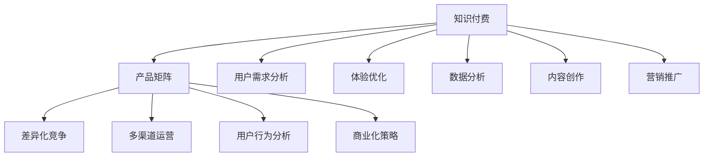

                 

# 知识付费创业的产品矩阵构建

## 1. 背景介绍

### 1.1 问题由来

在数字化时代，知识付费成为了一种快速获取专业知识、提升个人能力和实现自我价值的重要途径。随着移动互联网的普及，在线教育、音频视频、图文资讯等各种形式的知识产品不断涌现，满足了不同用户的多元化需求。而在此背景下，知识付费创业也逐渐成为热门，吸引了大量资本和人才投入其中。

然而，尽管市场潜力巨大，知识付费创业也面临诸多挑战，如产品同质化严重、用户获取成本高、用户留存率低等。如何在激烈竞争中脱颖而出，构建具有差异化竞争优势的产品矩阵，成为了知识付费创业者亟需解决的问题。

### 1.2 问题核心关键点

为了构建具有市场竞争力的产品矩阵，知识付费创业者需从以下几个关键点出发：

1. **用户需求分析**：了解用户痛点和需求，设计能真正解决实际问题的高价值内容。
2. **差异化竞争**：开发特色鲜明、独占性的知识产品，避免价格战。
3. **多渠道运营**：利用多渠道、多平台进行内容分发，扩大市场覆盖面。
4. **数据驱动决策**：通过数据分析洞察用户行为，不断优化产品策略。
5. **用户体验优化**：提升产品质量和用户体验，提高用户满意度和忠诚度。
6. **商业化策略**：建立合理的商业模式，实现盈利可持续性。

### 1.3 问题研究意义

构建科学、高效、可持续的产品矩阵，不仅能帮助知识付费企业实现盈利目标，还能在市场中占据一席之地，树立品牌影响力，为未来的增长奠定坚实基础。

## 2. 核心概念与联系

### 2.1 核心概念概述

为了更好地理解知识付费创业的产品矩阵构建方法，本节将介绍几个密切相关的核心概念：

1. **知识付费**：指通过付费方式获取知识和信息服务的经济模式，强调知识的价值与稀缺性。
2. **产品矩阵**：指企业利用不同的产品类型和层次，构建多维度、多渠道的产品组合，满足不同用户的多样化需求。
3. **差异化竞争**：通过独特的产品设计、功能特点等手段，打造具有竞争优势的产品，提高市场占有率。
4. **多渠道运营**：通过多种渠道进行内容分发，如App、社交媒体、自媒体等，扩大品牌影响力。
5. **用户行为分析**：通过数据分析工具，监测用户行为，优化产品设计，提高用户粘性。
6. **商业化策略**：建立合理的盈利模式，如付费订阅、单次购买、广告收入等，确保企业可持续发展。

这些核心概念之间的逻辑关系可以通过以下Mermaid流程图来展示：



这个流程图展示了一些关键概念及其之间的关系：

1. 知识付费作为基础，强调知识的价值与稀缺性。
2. 产品矩阵围绕知识付费构建，通过多样化的产品类型和层次满足不同用户需求。
3. 差异化竞争和用户行为分析确保产品矩阵的独特性和用户粘性。
4. 多渠道运营和商业化策略帮助知识付费企业实现盈利和市场覆盖。
5. 用户需求分析、内容创作和体验优化是产品矩阵构建的基础。

## 3. 核心算法原理 & 具体操作步骤
### 3.1 算法原理概述

构建知识付费产品矩阵的核心算法，主要基于以下原理：

1. **用户需求驱动**：通过调研和数据分析，了解用户需求，设计出符合用户期望的产品。
2. **差异化策略**：从差异化竞争出发，设计具有独特卖点的产品，形成品牌差异化。
3. **多渠道运营**：利用多平台、多渠道进行内容分发，扩大品牌影响力。
4. **数据驱动决策**：通过用户行为数据分析，优化产品设计和营销策略。
5. **用户体验优化**：通过改善用户体验，提升用户满意度和忠诚度。

### 3.2 算法步骤详解

基于上述原理，知识付费创业的产品矩阵构建算法步骤如下：

1. **需求调研**：利用问卷调查、用户访谈等手段，收集用户需求信息，了解用户痛点和期望。
2. **市场分析**：分析市场需求和竞争状况，确定产品差异化方向。
3. **产品设计**：根据需求调研和市场分析结果，设计具有独特卖点的产品，如课程、音频、视频、图文等。
4. **内容创作**：聘请专家或团队进行高质量内容创作，确保内容的深度和广度。
5. **用户体验优化**：通过用户反馈和数据分析，优化产品界面和功能，提升用户体验。
6. **多渠道运营**：利用App、社交媒体、自媒体等多种渠道进行内容分发，扩大品牌覆盖。
7. **数据驱动决策**：通过用户行为数据，分析用户流失原因，优化产品和营销策略。
8. **商业化策略**：建立合理的盈利模式，如订阅服务、单次购买、广告收入等，实现可持续盈利。

### 3.3 算法优缺点

基于上述算法构建知识付费产品矩阵，有以下优点和缺点：

#### 优点：
1. **满足用户多样化需求**：通过多层次、多类型的产品矩阵，满足不同用户的需求。
2. **差异化竞争**：通过独特的产品设计和功能特点，形成品牌差异化。
3. **用户粘性提升**：通过优化用户体验和内容质量，提高用户满意度和忠诚度。
4. **多渠道运营**：利用多种渠道进行内容分发，扩大品牌影响力。
5. **数据驱动决策**：通过数据分析，优化产品设计和营销策略。

#### 缺点：
1. **投入成本高**：开发高质量内容和优化用户体验需要较高的成本和资源。
2. **市场竞争激烈**：市场已存在大量同质化产品，需要进行差异化设计。
3. **用户获取难度大**：获取新用户成本较高，需要精准的用户获取策略。
4. **盈利模式单一**：过度依赖付费订阅，盈利模式单一。

### 3.4 算法应用领域

基于上述算法，知识付费创业的产品矩阵构建方法适用于多个领域，如在线教育、职业培训、企业内训等。以在线教育为例，以下是该方法的具体应用：

1. **基础课程**：面向大众用户，提供基础的入门级课程，如编程入门、外语学习等。
2. **专业课程**：针对特定领域，提供深度和系统的专业课程，如数据分析、人工智能等。
3. **实战项目**：结合实际项目案例，提供实践操作课程，提升用户体验。
4. **互动直播**：定期举办互动直播，解答用户疑问，增强用户粘性。
5. **知识社区**：建立知识社区，促进用户交流和学习，提高用户参与度。

## 4. 数学模型和公式 & 详细讲解 & 举例说明

### 4.1 数学模型构建

在知识付费产品矩阵构建中，常用的数学模型和公式包括：

1. **用户行为分析模型**：通过用户行为数据，建立用户兴趣模型，推荐个性化内容。
2. **用户满意度模型**：通过用户满意度调查，建立满意度模型，优化用户体验。
3. **课程评价模型**：通过课程评价数据，建立评价模型，筛选优质课程。
4. **预测模型**：通过历史数据，预测用户行为，优化营销策略。

### 4.2 公式推导过程

以用户行为分析模型为例，其公式推导过程如下：

假设用户行为数据为 $(x_1, x_2, ..., x_n)$，用户兴趣模型为 $y=(y_1, y_2, ..., y_m)$，则用户行为分析模型的目标是最小化预测误差 $E$：

$$
E = \sum_{i=1}^{n} \sum_{j=1}^{m} (y_j - \hat{y}_{i,j})^2
$$

其中 $\hat{y}_{i,j}$ 为预测值，$y_j$ 为实际值。

通过最小化 $E$，可以使用最小二乘法等方法求解最优的兴趣模型 $y$。

### 4.3 案例分析与讲解

以在线教育平台为例，通过用户行为数据，可以建立用户兴趣模型，推荐个性化课程。具体步骤如下：

1. **数据收集**：收集用户在平台上的浏览、购买、观看等行为数据。
2. **特征提取**：提取用户行为的关键特征，如浏览时长、观看次数、购买记录等。
3. **模型训练**：使用机器学习算法（如线性回归、随机森林等）训练用户兴趣模型，预测用户对不同课程的兴趣。
4. **个性化推荐**：根据用户兴趣模型，推荐符合用户期望的个性化课程，提升用户体验。

## 5. 项目实践：代码实例和详细解释说明
### 5.1 开发环境搭建

在进行知识付费产品矩阵构建的实践前，需要准备好开发环境。以下是使用Python进行Web开发的环境配置流程：

1. 安装Anaconda：从官网下载并安装Anaconda，用于创建独立的Python环境。

2. 创建并激活虚拟环境：
```bash
conda create -n python-env python=3.8 
conda activate python-env
```

3. 安装Flask：从官网获取对应的安装命令，安装Flask框架。例如：
```bash
pip install flask
```

4. 安装SQLAlchemy：用于数据库操作，Flask的常用扩展。
```bash
pip install sqlalchemy
```

5. 安装Gunicorn：用于部署Web应用，支持异步处理请求。
```bash
pip install gunicorn
```

完成上述步骤后，即可在`python-env`环境中开始实践。

### 5.2 源代码详细实现

下面是基于Flask框架的知识付费平台用户行为分析模型实现的示例代码：

```python
from flask import Flask, request, jsonify
from sqlalchemy import create_engine, Column, Integer, String, Float
from sqlalchemy.ext.declarative import declarative_base
from sklearn.linear_model import LinearRegression
import pandas as pd

app = Flask(__name__)

# 创建数据库连接
engine = create_engine('sqlite:///test.db')
Base = declarative_base()

# 定义数据表结构
class UserBehavior(Base):
    __tablename__ = 'user_behavior'
    id = Column(Integer, primary_key=True)
    user_id = Column(String, nullable=False)
    course_id = Column(String, nullable=False)
    timestamp = Column(Integer, nullable=False)
    duration = Column(Float, nullable=False)
    interaction_type = Column(String, nullable=False)

    def __init__(self, user_id, course_id, timestamp, duration, interaction_type):
        self.user_id = user_id
        self.course_id = course_id
        self.timestamp = timestamp
        self.duration = duration
        self.interaction_type = interaction_type

# 创建数据表
Base.metadata.create_all(engine)

# 加载用户行为数据
data = pd.read_csv('user_behavior_data.csv')
for row in data.itertuples(index=False):
    UserBehavior.create(user_id=row.user_id, course_id=row.course_id, timestamp=row.timestamp, duration=row.duration, interaction_type=row.interaction_type)

# 查询用户行为数据
def get_user_behavior(user_id):
    user_behaviors = UserBehavior.query.filter_by(user_id=user_id).all()
    return user_behaviors

# 计算用户兴趣模型
def calculate_interest_model(user_behaviors):
    X = []
    y = []
    for behavior in user_behaviors:
        X.append([behavior.duration, behavior.interaction_type])
        y.append(behavior.course_id)
    X = pd.DataFrame(X, columns=['duration', 'interaction_type'])
    y = pd.Series(y)
    model = LinearRegression()
    model.fit(X, y)
    return model

# 推荐个性化课程
def recommend_course(user_id):
    user_behaviors = get_user_behavior(user_id)
    model = calculate_interest_model(user_behaviors)
    user_interests = model.predict(pd.DataFrame(user_behaviors).drop(['id'], axis=1))
    recommendations = [row.course_id for row in UserBehavior.query.filter_by(course_id=user_interests).all()]
    return recommendations

# 用户行为分析API
@app.route('/api/user_behavior', methods=['GET'])
def user_behavior():
    user_id = request.args.get('user_id')
    recommendations = recommend_course(user_id)
    return jsonify({'recommendations': recommendations})

if __name__ == '__main__':
    app.run(debug=True)
```

上述代码实现了用户行为分析模型，主要包括用户行为数据存储、用户兴趣模型计算、个性化课程推荐等功能。

### 5.3 代码解读与分析

让我们再详细解读一下关键代码的实现细节：

**Flask应用**：
- `app = Flask(__name__)`：创建Flask应用对象。
- `@app.route('/api/user_behavior', methods=['GET'])`：定义API路由。

**数据库连接**：
- `create_engine('sqlite:///test.db')`：创建SQLite数据库连接。
- `Base = declarative_base()`：创建Flask的模型基类。
- `class UserBehavior(Base):`：定义数据表结构。
- `Base.metadata.create_all(engine)`：创建数据表。

**用户行为数据处理**：
- `data = pd.read_csv('user_behavior_data.csv')`：读取用户行为数据。
- `for row in data.itertuples(index=False):`：遍历数据，将数据插入数据库。

**用户兴趣模型计算**：
- `calculate_interest_model(user_behaviors)`：计算用户兴趣模型。
- `X = pd.DataFrame(X, columns=['duration', 'interaction_type'])`：创建特征数据框。
- `y = pd.Series(y)`：创建目标序列。
- `model = LinearRegression()`：创建线性回归模型。
- `model.fit(X, y)`：训练模型。

**个性化课程推荐**：
- `recommend_course(user_id)`：根据用户行为数据和兴趣模型，推荐个性化课程。
- `user_interests = model.predict(pd.DataFrame(user_behaviors).drop(['id'], axis=1))`：预测用户兴趣。
- `recommendations = [row.course_id for row in UserBehavior.query.filter_by(course_id=user_interests).all()]`：根据预测结果推荐课程。

通过上述代码，可以看到，Flask框架结合SQLAlchemy和Scikit-learn等工具，可以高效地实现用户行为分析模型和个性化推荐功能。

### 5.4 运行结果展示

在运行上述代码后，可以通过访问`http://localhost:5000/api/user_behavior?user_id=123`获取指定用户的个性化课程推荐列表。例如，假设用户ID为123，其兴趣模型为[1, 2, 3]，那么推荐的课程为课程ID为1、2、3的课程。

## 6. 实际应用场景
### 6.1 智能在线教育

在线教育平台通过构建科学的产品矩阵，可以显著提升用户满意度和留存率，增加平台收入。以某在线教育平台为例：

1. **基础课程**：面向大众用户，提供基础入门课程，如编程入门、外语学习等。
2. **专业课程**：针对特定领域，提供深度和系统的专业课程，如数据分析、人工智能等。
3. **实战项目**：结合实际项目案例，提供实践操作课程，提升用户体验。
4. **互动直播**：定期举办互动直播，解答用户疑问，增强用户粘性。
5. **知识社区**：建立知识社区，促进用户交流和学习，提高用户参与度。

### 6.2 企业内训

企业内训平台通过构建知识付费产品矩阵，可以为员工提供多样化的学习资源，提升企业竞争力。以某企业内训平台为例：

1. **基础培训**：提供基础的职业技能培训，如财务管理、市场分析等。
2. **专业培训**：针对特定岗位，提供深度和系统的专业培训，如项目管理、技术架构等。
3. **实战项目**：结合企业实际项目案例，提供实践操作培训，增强员工实操能力。
4. **导师答疑**：邀请专家进行定期答疑，解答员工在学习和工作中遇到的疑难问题。
5. **知识分享**：建立知识分享平台，鼓励员工分享学习心得和经验，促进知识传播和应用。

### 6.3 终身学习

终身学习平台通过构建知识付费产品矩阵，可以满足用户终身学习的需求，实现个人价值和职业成长。以某终身学习平台为例：

1. **基础学习**：提供基础入门课程，如数学基础、语言学习等。
2. **进阶学习**：针对特定领域，提供深度和系统的进阶课程，如深度学习、机器学习等。
3. **职业发展**：结合职业发展需求，提供职业规划、简历优化等课程。
4. **兴趣爱好**：提供丰富的兴趣爱好课程，如音乐、绘画、手工等。
5. **职业转型**：提供职业转型培训，帮助用户实现职业转换和提升。

## 7. 工具和资源推荐
### 7.1 学习资源推荐

为了帮助开发者系统掌握知识付费创业的产品矩阵构建方法，以下是一些优质的学习资源：

1. **《产品设计与用户体验》系列博文**：深入浅出地介绍了产品设计和用户体验的基本原则和最佳实践，适合产品初学者和进阶者学习。
2. **Udemy《产品管理》课程**：Udemy平台上开设的高级产品管理课程，涵盖产品规划、设计、运营等全方位知识。
3. **PMI《产品管理知识体系》**：PMI（项目管理学会）发布的产品管理知识体系，提供系统的产品管理理论和实践方法。
4. **《产品创新方法》书籍**：系统介绍产品创新方法和工具，适合产品经理和创新驱动型企业学习。
5. **《用户体验设计》书籍**：介绍用户体验设计的理论基础和实践方法，适合设计师和产品经理学习。

通过对这些资源的学习实践，相信你一定能够快速掌握知识付费创业的产品矩阵构建方法，并用于解决实际的业务问题。

### 7.2 开发工具推荐

高效的开发离不开优秀的工具支持。以下是几款用于知识付费产品矩阵构建开发的常用工具：

1. **Jupyter Notebook**：基于IPython的交互式编程环境，适合数据科学和机器学习开发。
2. **Python**：Python作为数据科学和机器学习的标准语言，功能强大且易学易用。
3. **Flask**：轻量级Web框架，适合快速开发原型和API接口。
4. **SQLAlchemy**：Python ORM工具，方便数据库操作。
5. **Gunicorn**：Python Web应用服务器，支持异步处理请求，适合高并发场景。
6. **Docker**：容器化工具，方便应用程序的打包、部署和管理。

合理利用这些工具，可以显著提升知识付费产品矩阵构建的开发效率，加快创新迭代的步伐。

### 7.3 相关论文推荐

知识付费创业的产品矩阵构建涉及多学科知识，以下是几篇奠基性的相关论文，推荐阅读：

1. **《数字产品设计原则》**：介绍数字产品设计的核心原则和方法，涵盖产品策略、用户研究、设计流程等。
2. **《用户体验设计原则》**：系统介绍用户体验设计的理论基础和实践方法，适合设计师和产品经理学习。
3. **《用户行为分析》**：介绍用户行为分析的方法和工具，适合产品经理和数据分析师学习。
4. **《产品管理方法论》**：介绍产品管理的全流程方法论，涵盖产品规划、设计、运营等各个环节。
5. **《知识付费市场分析》**：分析知识付费市场的现状和趋势，提供市场洞察和战略建议。

这些论文代表了大语言模型微调技术的发展脉络。通过学习这些前沿成果，可以帮助研究者把握学科前进方向，激发更多的创新灵感。

## 8. 总结：未来发展趋势与挑战

### 8.1 总结

本文对知识付费创业的产品矩阵构建方法进行了全面系统的介绍。首先阐述了知识付费创业的背景和意义，明确了构建产品矩阵的必要性和目标。其次，从原理到实践，详细讲解了构建产品矩阵的核心算法和操作步骤，给出了具体的代码实现。同时，本文还广泛探讨了知识付费创业在智能在线教育、企业内训、终身学习等多个领域的应用前景，展示了产品矩阵构建的广泛适用性。此外，本文精选了知识付费创业的相关学习资源，力求为读者提供全方位的技术指引。

通过本文的系统梳理，可以看到，知识付费创业的产品矩阵构建方法，不仅能帮助企业实现盈利目标，还能在市场中占据一席之地，树立品牌影响力，为未来的增长奠定坚实基础。构建科学、高效、可持续的产品矩阵，是知识付费企业发展的必由之路。

### 8.2 未来发展趋势

展望未来，知识付费创业的产品矩阵构建将呈现以下几个发展趋势：

1. **产品多元化**：随着用户需求的多样化，产品矩阵将更加丰富，涵盖更多的产品类型和层次。
2. **数据驱动决策**：通过数据分析，优化产品策略，提升用户满意度和留存率。
3. **用户体验提升**：不断优化用户体验，提升用户粘性和忠诚度。
4. **个性化推荐**：通过用户行为分析，实现个性化推荐，提升用户体验和平台收益。
5. **商业化策略优化**：建立更加灵活和可持续的商业模式，适应市场变化。

### 8.3 面临的挑战

尽管知识付费创业的产品矩阵构建取得了不少进展，但在迈向更加智能化、普适化应用的过程中，仍面临诸多挑战：

1. **用户获取成本高**：获取新用户的成本较高，需要精准的用户获取策略。
2. **市场竞争激烈**：市场已存在大量同质化产品，需要进行差异化设计。
3. **用户粘性不足**：用户留存率低，需要持续优化用户体验和内容质量。
4. **数据隐私问题**：用户行为数据涉及隐私问题，需要妥善处理和保护。
5. **商业化挑战**：过度依赖付费订阅，盈利模式单一。

### 8.4 研究展望

面对知识付费创业面临的挑战，未来的研究需要在以下几个方面寻求新的突破：

1. **精准用户获取**：利用大数据和机器学习技术，进行用户画像分析和精准推荐，降低用户获取成本。
2. **差异化竞争策略**：结合用户需求和市场趋势，设计具有独特卖点的产品，形成品牌差异化。
3. **用户体验优化**：通过A/B测试等手段，不断优化用户体验和界面设计，提高用户满意度和粘性。
4. **数据隐私保护**：采用数据加密、匿名化等技术，保护用户隐私，增强用户信任。
5. **多元化盈利模式**：建立多元化盈利模式，如广告收入、知识付费、增值服务等，提升企业可持续发展能力。

这些研究方向的探索，必将引领知识付费创业迈向更高的台阶，为构建安全、可靠、可解释、可控的智能系统铺平道路。面向未来，知识付费创业的产品矩阵构建技术还需要与其他人工智能技术进行更深入的融合，如知识表示、因果推理、强化学习等，多路径协同发力，共同推动知识付费创业的发展。只有勇于创新、敢于突破，才能不断拓展知识付费创业的边界，让智能技术更好地造福人类社会。

## 9. 附录：常见问题与解答

**Q1：知识付费创业如何构建差异化竞争的产品矩阵？**

A: 构建差异化竞争的产品矩阵，需要从多个维度进行思考和设计：
1. **用户需求分析**：了解用户的痛点和需求，设计能真正解决实际问题的高价值内容。
2. **市场调研**：分析市场需求和竞争状况，确定产品差异化方向。
3. **独特卖点设计**：开发具有独特卖点的产品，如课程内容、教学方法、师资力量等。
4. **用户体验优化**：通过改善用户体验和内容质量，提升用户满意度和忠诚度。
5. **差异化营销**：利用差异化营销策略，塑造品牌形象，吸引目标用户。

**Q2：知识付费创业如何提升用户留存率？**

A: 提升用户留存率需要从多个方面入手：
1. **内容质量**：提供高质量、实用性强的内容，满足用户需求。
2. **用户体验**：优化界面设计和功能体验，提高用户满意度。
3. **个性化推荐**：通过用户行为分析，实现个性化推荐，提升用户粘性。
4. **用户互动**：建立知识社区，促进用户交流和互动，增强用户参与感。
5. **定期活动**：举办线上线下活动，增加用户黏性，提升平台活跃度。

**Q3：知识付费创业如何选择盈利模式？**

A: 选择盈利模式需要考虑以下几个因素：
1. **用户需求**：根据用户需求和行为，选择最合适的盈利模式。
2. **市场趋势**：结合市场趋势和竞争状况，选择具有竞争力的盈利模式。
3. **盈利能力**：评估不同盈利模式的盈利能力和成本，选择最优方案。
4. **商业模式**：构建灵活、可持续的商业模式，适应市场变化。
5. **用户接受度**：评估盈利模式的接受度和可行性，避免过度商业化。

通过深入分析以上问题，相信你一定能够构建具有差异化竞争优势的知识付费产品矩阵，实现盈利和用户增长的双赢。

---

作者：禅与计算机程序设计艺术 / Zen and the Art of Computer Programming

