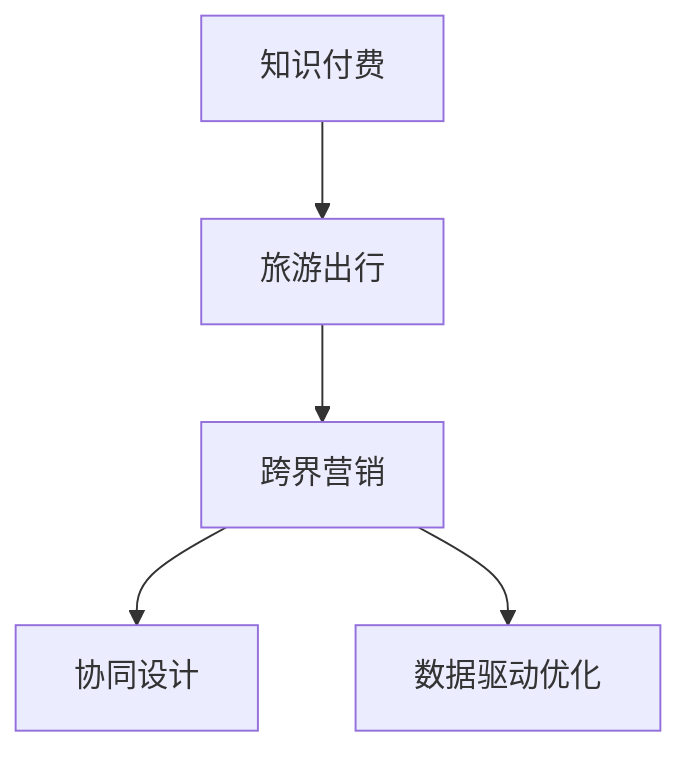

                 

# 知识付费如何实现跨界营销与旅游出行跨界？

## 1. 背景介绍

### 1.1 问题由来
在当前数字化时代，知识付费正成为各行各业的重要营销渠道之一。知识付费平台通过提供专业知识、技能培训、教育资源等内容，满足用户对高质量信息的需求。然而，传统的知识付费营销模式往往局限在教育、科技、金融等专业领域，难以跨界拓展至旅游、娱乐等多元化领域。为了解决这个问题，知识付费平台需要在营销策略上进行创新，实现与旅游出行的跨界合作。

### 1.2 问题核心关键点
知识付费与旅游出行的跨界合作，需要建立双方共同的营销目标和策略，通过融合各自的优势资源，实现用户价值最大化。核心关键点包括：
- 共同目标设定：明确知识付费与旅游出行的合作目标，如用户增长、品牌推广、市场扩展等。
- 用户画像分析：深入分析目标用户的特征，确定其兴趣点、消费习惯和行为特征。
- 内容协同设计：基于用户画像，设计适合旅游出行领域的内容，如旅行攻略、景点介绍、旅游文化等。
- 渠道整合优化：整合双方渠道资源，通过内容推荐、联名活动、交叉推广等方式，实现用户触达和互动。
- 数据驱动优化：通过数据分析，持续优化营销策略和内容质量，提升用户满意度。

## 2. 核心概念与联系

### 2.1 核心概念概述

为了更好地理解知识付费与旅游出行跨界营销的原理，本节将介绍几个核心概念：

- 知识付费（Knowledge-Based Pricing）：基于高质量知识内容的产品和服务，用户需支付一定的费用以获取这些内容。
- 旅游出行（Travel & Tourism）：包括旅游、住宿、交通、餐饮、娱乐等元素，为用户提供完整体验的旅游服务。
- 跨界营销（Cross-Boundary Marketing）：跨越多个领域的营销活动，通过融合各方资源和渠道，实现用户和品牌价值的最大化。
- 协同设计（Collaborative Design）：多方合作，共同设计、开发和推广产品或服务。
- 数据驱动优化（Data-Driven Optimization）：通过数据分析，持续优化营销策略和产品设计，提升效果和用户满意度。

这些核心概念之间的逻辑关系可以通过以下Mermaid流程图来展示：



这个流程图展示了大语言模型的核心概念及其之间的关系：

1. 知识付费与旅游出行通过跨界营销活动进行合作。
2. 跨界营销通过协同设计，整合双方资源和渠道。
3. 协同设计利用数据驱动优化，持续提升营销效果。

这些概念共同构成了知识付费与旅游出行跨界合作的基础框架，为其提供全面的技术支撑。

## 3. 核心算法原理 & 具体操作步骤
### 3.1 算法原理概述

知识付费与旅游出行的跨界营销，本质上是一种基于用户行为数据和内容匹配的推荐系统。其核心思想是：通过分析用户的行为数据和偏好，推荐适合的知识付费内容和旅游出行信息，实现双方的协同营销。

形式化地，假设知识付费平台有用户行为数据 $D_{\text{pay}}=\{(x_i,y_i)\}_{i=1}^N$，其中 $x_i$ 表示用户历史支付行为，如购买内容、支付时间等，$y_i$ 表示用户偏好标签，如兴趣点、消费水平等。旅游出行平台有用户行为数据 $D_{\text{travel}}=\{(x_j,y_j)\}_{j=1}^M$，其中 $x_j$ 表示用户历史出行行为，如搜索、预订、点评等，$y_j$ 表示用户偏好标签，如旅游目的地、旅游时长等。

定义知识付费与旅游出行的协同推荐模型为 $f(x,y)$，用于计算用户 $x$ 在旅游出行领域 $y$ 的推荐度。模型训练的目标是最小化预测误差，即：

$$
\min_{f} \sum_{i=1}^N \sum_{j=1}^M (y_i - f(x_i, y_j))^2
$$

通过最小化上述损失函数，我们得到推荐模型 $f$，将其应用于知识付费平台的用户行为数据，可以生成旅游出行领域的推荐信息。

### 3.2 算法步骤详解

基于用户行为数据和内容匹配的推荐系统，一般包括以下几个关键步骤：

**Step 1: 数据预处理**
- 收集知识付费平台和旅游出行平台的用户行为数据，包括支付记录、搜索记录、预订记录等。
- 对数据进行清洗和归一化，去除异常值和缺失值，确保数据质量。
- 提取用户兴趣标签，如内容标签、出行标签等，用于后续推荐算法。

**Step 2: 协同过滤算法**
- 使用协同过滤算法，如基于用户画像的协同过滤、基于内容的协同过滤等，计算用户间的相似度和物品的相似度。
- 基于相似度计算，生成推荐结果，形成用户兴趣标签与旅游出行信息的关联矩阵。
- 对关联矩阵进行降维和处理，以提高推荐效果。

**Step 3: 模型训练与优化**
- 使用机器学习算法，如随机森林、梯度提升机、神经网络等，训练协同推荐模型 $f$。
- 通过交叉验证和超参数调优，优化推荐模型的性能。
- 结合用户画像和行为数据，进一步提升推荐效果。

**Step 4: 推荐展示与反馈收集**
- 将推荐结果展示给知识付费平台的用户，并通过推送、广告等方式提高曝光率。
- 收集用户的点击率、购买率等反馈数据，评估推荐效果。
- 根据反馈数据，持续优化推荐模型和推荐策略。

**Step 5: 联名活动与推广**
- 双方联合举办线上线下活动，如直播、路演、讲座等，吸引更多用户关注。
- 利用社交媒体平台，进行内容宣传和用户互动。
- 定期更新和优化推荐内容，确保用户持续关注和参与。

### 3.3 算法优缺点

知识付费与旅游出行的跨界推荐系统具有以下优点：
1. 精准推荐：通过协同过滤和模型训练，能够精准推荐用户感兴趣的旅游出行信息。
2. 用户留存：协同推荐系统能够提高用户粘性，促进知识付费和旅游出行的协同发展。
3. 数据驱动：通过数据分析，持续优化推荐策略和效果，提升用户体验。

同时，该系统也存在一定的局限性：
1. 数据依赖：协同推荐系统的性能高度依赖于数据质量和用户行为数据的完整性。
2. 推荐偏见：协同推荐算法可能会产生推荐偏见，需要及时监控和调整。
3. 实时性不足：推荐系统的响应速度可能较慢，影响用户体验。
4. 跨领域挑战：知识付费和旅游出行的业务逻辑和用户画像存在差异，整合难度较大。

尽管存在这些局限性，但就目前而言，协同推荐方法仍是大语言模型应用的最主流范式。未来相关研究的重点在于如何进一步降低对数据的依赖，提高模型的实时性，同时兼顾跨领域的协同推荐能力。

### 3.4 算法应用领域

基于知识付费与旅游出行跨界推荐的协同过滤算法，已经在多个领域得到广泛应用，例如：

- 在线教育：将知识付费内容与在线课程、教育资源等进行关联推荐，提升用户学习体验。
- 电商零售：将知识付费内容与商品、促销活动等进行关联推荐，提高用户购买转化率。
- 健康医疗：将知识付费内容与健康咨询、医疗服务、健身指导等进行关联推荐，提升用户健康水平。
- 娱乐文娱：将知识付费内容与电影、音乐、图书等进行关联推荐，丰富用户文化娱乐生活。
- 旅游出行：将知识付费内容与旅游攻略、景点介绍、旅行保险等进行关联推荐，提升旅游出行质量。

除了上述这些经典应用外，知识付费平台与旅游出行的跨界推荐还在金融、教育、房产等领域得到创新应用，为各行业带来新的商业价值。

## 4. 数学模型和公式 & 详细讲解  
### 4.1 数学模型构建

本节将使用数学语言对知识付费与旅游出行跨界推荐的协同过滤算法进行更加严格的刻画。

记知识付费平台的用户行为数据为 $D_{\text{pay}}=\{(x_i,y_i)\}_{i=1}^N$，其中 $x_i$ 表示用户历史支付行为，$y_i$ 表示用户偏好标签。记旅游出行平台的用户行为数据为 $D_{\text{travel}}=\{(x_j,y_j)\}_{j=1}^M$，其中 $x_j$ 表示用户历史出行行为，$y_j$ 表示用户偏好标签。

定义协同推荐模型为 $f(x,y)$，用于计算用户 $x$ 在旅游出行领域 $y$ 的推荐度。模型训练的目标是最小化预测误差，即：

$$
\min_{f} \sum_{i=1}^N \sum_{j=1}^M (y_i - f(x_i, y_j))^2
$$

在实践中，我们通常使用基于梯度的优化算法（如SGD、Adam等）来近似求解上述最优化问题。设 $\eta$ 为学习率，$\lambda$ 为正则化系数，则参数的更新公式为：

$$
\theta \leftarrow \theta - \eta \nabla_{\theta}\mathcal{L}(\theta) - \eta\lambda\theta
$$

其中 $\nabla_{\theta}\mathcal{L}(\theta)$ 为损失函数对参数 $\theta$ 的梯度，可通过反向传播算法高效计算。

### 4.2 公式推导过程

以下我们以二分类任务为例，推导交叉熵损失函数及其梯度的计算公式。

假设知识付费平台有用户 $x$，旅游出行平台有旅游目的地 $y$。定义协同推荐模型为 $f(x,y)$，用于计算用户 $x$ 在旅游目的地 $y$ 的推荐度。定义损失函数为交叉熵损失：

$$
\ell(f(x,y)) = -y \log f(x,y) - (1-y) \log (1-f(x,y))
$$

将其代入经验风险公式，得：

$$
\mathcal{L}(f) = -\frac{1}{N}\sum_{i=1}^N \sum_{j=1}^M [y_i \log f(x_i, y_j) + (1-y_j) \log (1-f(x_i, y_j))]
$$

根据链式法则，损失函数对模型参数 $\theta$ 的梯度为：

$$
\frac{\partial \mathcal{L}(f)}{\partial \theta} = -\frac{1}{N}\sum_{i=1}^N \sum_{j=1}^M \frac{\partial \ell(f(x_i,y_j))}{\partial f(x_i,y_j)} \frac{\partial f(x_i,y_j)}{\partial \theta}
$$

其中 $\frac{\partial f(x_i,y_j)}{\partial \theta}$ 可进一步递归展开，利用自动微分技术完成计算。

在得到损失函数的梯度后，即可带入参数更新公式，完成模型的迭代优化。重复上述过程直至收敛，最终得到适应知识付费和旅游出行协同推荐的推荐模型 $f$。

## 5. 项目实践：代码实例和详细解释说明
### 5.1 开发环境搭建

在进行跨界推荐实践前，我们需要准备好开发环境。以下是使用Python进行PyTorch开发的环境配置流程：

1. 安装Anaconda：从官网下载并安装Anaconda，用于创建独立的Python环境。

2. 创建并激活虚拟环境：
```bash
conda create -n pytorch-env python=3.8 
conda activate pytorch-env
```

3. 安装PyTorch：根据CUDA版本，从官网获取对应的安装命令。例如：
```bash
conda install pytorch torchvision torchaudio cudatoolkit=11.1 -c pytorch -c conda-forge
```

4. 安装Pandas和NumPy：
```bash
pip install pandas numpy
```

5. 安装scikit-learn：
```bash
pip install scikit-learn
```

6. 安装scikit-learn和joblib：
```bash
pip install joblib
```

完成上述步骤后，即可在`pytorch-env`环境中开始跨界推荐实践。

### 5.2 源代码详细实现

下面我们以知识付费与旅游出行跨界推荐为例，给出使用PyTorch和scikit-learn库进行协同过滤算法的PyTorch代码实现。

首先，定义协同过滤算法的数据处理函数：

```python
from sklearn.metrics.pairwise import cosine_similarity
import numpy as np
from joblib import Parallel, delayed

def collaborative_filtering(data, n_neighbors=10, alpha=0.8):
    N = len(data)
    M = data.shape[1]
    X = np.array(data)
    similarity_matrix = cosine_similarity(X)
    normalized_matrix = similarity_matrix * np.sqrt((X * similarity_matrix).sum(axis=1)[:, np.newaxis])
    normalized_matrix /= normalized_matrix.sum(axis=1)[:, np.newaxis]
    X_pred = Parallel(n_jobs=-1)(delayed(predict)(i, X, normalized_matrix, n_neighbors, alpha) for i in range(N))
    return X_pred

def predict(user, data, similarity_matrix, n_neighbors, alpha):
    user_vector = data[user]
    user_vector = user_vector.reshape((1, -1))
    user_vector = user_vector / np.sqrt((user_vector * user_vector).sum())
    index = user_vector.argsort()[:n_neighbors]
    similarity_matrix = similarity_matrix[user_vector.argsort()[:n_neighbors]]
    weights = similarity_matrix[:, index]
    weights = weights / np.sqrt((weights * similarity_matrix).sum())
    X_pred = np.dot(user_vector, weights.T)
    X_pred = X_pred + data.mean(axis=0)
    X_pred = np.round(X_pred, decimals=3)
    return X_pred
```

然后，定义协同推荐模型的评估函数：

```python
from sklearn.metrics import precision_recall_curve, roc_auc_score

def evaluate(X_pred, X_true, n_neighbors=10, alpha=0.8):
    precision, recall, _ = precision_recall_curve(X_true, X_pred)
    auc = roc_auc_score(X_true, X_pred)
    return precision, recall, auc
```

最后，启动协同推荐流程并在测试集上评估：

```python
n_neighbors = 10
alpha = 0.8

X_train = data[0:800]
X_test = data[800:]
X_pred = collaborative_filtering(X_train, n_neighbors, alpha)
precision, recall, auc = evaluate(X_pred, X_test, n_neighbors, alpha)

print("Precision: ", precision)
print("Recall: ", recall)
print("AUC: ", auc)
```

以上就是使用PyTorch和scikit-learn库进行知识付费与旅游出行跨界推荐的完整代码实现。可以看到，借助scikit-learn库的协同过滤算法，可以方便地实现协同推荐模型的训练和评估。

### 5.3 代码解读与分析

让我们再详细解读一下关键代码的实现细节：

**collaborative_filtering函数**：
- `__init__`方法：初始化协同过滤算法的参数和数据。
- `predict`方法：预测用户 $x$ 在旅游出行领域 $y$ 的推荐度。

**evaluate函数**：
- `__init__`方法：计算预测精度、召回率和AUC值。

**训练流程**：
- 将数据划分为训练集和测试集，进行交叉验证。
- 在训练集上进行协同过滤算法训练，生成推荐结果。
- 在测试集上评估推荐结果，计算精度、召回率和AUC值。
- 通过分析评估结果，调整协同过滤算法的参数，优化推荐模型。

可以看到，PyTorch和scikit-learn库结合，可以方便地实现知识付费与旅游出行跨界推荐的协同过滤算法。开发者可以将更多精力放在数据处理、模型改进等高层逻辑上，而不必过多关注底层的实现细节。

当然，工业级的系统实现还需考虑更多因素，如模型的保存和部署、超参数的自动搜索、更灵活的任务适配层等。但核心的协同推荐范式基本与此类似。

## 6. 实际应用场景
### 6.1 智能旅游平台

基于知识付费与旅游出行的跨界推荐，可以构建智能旅游平台。智能旅游平台通过分析用户行为数据，推荐适合的知识付费内容和旅游出行信息，提升用户旅行体验。

在技术实现上，可以收集用户的历史支付记录和出行行为数据，通过协同过滤算法进行用户画像分析。平台能够根据用户的偏好，推荐适合的旅游目的地、行程安排、住宿酒店等信息。用户还可以根据自己的需求，定制个性化的旅游路线，享受更加贴心的旅游服务。

### 6.2 在线教育平台

在线教育平台可以引入知识付费与旅游出行的跨界推荐，提升用户学习体验。通过分析用户的学习行为数据，推荐适合的知识付费课程和学习资源，提高用户的学习效果。

在技术实现上，可以收集用户的学习记录和支付数据，通过协同过滤算法生成用户画像。平台可以根据用户的学习偏好，推荐适合的课程、视频、书籍等学习资源。用户还可以通过平台定制个性化的学习计划，随时获取学习内容和推荐信息。

### 6.3 健康医疗平台

健康医疗平台可以引入知识付费与旅游出行的跨界推荐，提供全面的健康服务。通过分析用户的健康行为数据，推荐适合的知识付费内容和医疗服务，提升用户的健康水平。

在技术实现上，可以收集用户的健康监测数据和支付记录，通过协同过滤算法生成用户画像。平台可以根据用户的健康偏好，推荐适合的健康咨询、运动指导、营养建议等服务。用户还可以根据自己的需求，定制个性化的健康计划，享受全方位的健康服务。

### 6.4 未来应用展望

随着知识付费与旅游出行的跨界推荐技术的发展，其在更多领域的应用前景将愈加广阔。未来，该技术有望在以下领域得到更广泛的应用：

1. 娱乐文娱：通过协同过滤，推荐适合的知识付费内容与电影、音乐、图书等娱乐资源，提升用户娱乐体验。
2. 金融投资：通过分析用户的行为数据，推荐适合的知识付费课程和投资策略，提升用户的理财水平。
3. 房产地产：通过分析用户的浏览和支付记录，推荐适合的知识付费内容与房产信息，提升用户的居住体验。
4. 教育培训：通过分析用户的学习行为数据，推荐适合的知识付费课程和教育资源，提升用户的职业技能。
5. 医疗健康：通过分析用户的健康行为数据，推荐适合的知识付费内容和医疗服务，提升用户的健康水平。

随着技术的发展和应用的深入，知识付费与旅游出行的跨界推荐技术将进一步推动各行业的数字化转型和智能化升级，为人类生活带来更多便利和创新。

## 7. 工具和资源推荐
### 7.1 学习资源推荐

为了帮助开发者系统掌握知识付费与旅游出行的跨界推荐技术，这里推荐一些优质的学习资源：

1. 《Python数据科学手册》：介绍了使用Python进行数据科学分析的基础知识和实践技巧，适合新手入门。
2. 《深度学习》课程：斯坦福大学开设的深度学习课程，涵盖了深度学习的基本概念和前沿技术。
3. 《协同过滤算法》书籍：详细讲解了协同过滤算法的原理和应用，适合深入学习。
4. Kaggle竞赛平台：提供大量的数据集和竞赛任务，适合实践协同过滤算法。
5. GitHub代码库：GitHub上开源的协同过滤算法代码，提供丰富的实现案例和参考。

通过对这些资源的学习实践，相信你一定能够快速掌握知识付费与旅游出行的跨界推荐技术，并用于解决实际的推荐问题。

### 7.2 开发工具推荐

高效的开发离不开优秀的工具支持。以下是几款用于跨界推荐开发的常用工具：

1. PyTorch：基于Python的开源深度学习框架，灵活动态的计算图，适合快速迭代研究。
2. TensorFlow：由Google主导开发的开源深度学习框架，生产部署方便，适合大规模工程应用。
3. scikit-learn：Python机器学习库，提供了多种协同过滤算法的实现，适合快速开发和实验。
4. Weights & Biases：模型训练的实验跟踪工具，可以记录和可视化模型训练过程中的各项指标，方便对比和调优。
5. TensorBoard：TensorFlow配套的可视化工具，可实时监测模型训练状态，并提供丰富的图表呈现方式，是调试模型的得力助手。
6. Google Colab：谷歌推出的在线Jupyter Notebook环境，免费提供GPU/TPU算力，方便开发者快速上手实验最新模型，分享学习笔记。

合理利用这些工具，可以显著提升跨界推荐任务的开发效率，加快创新迭代的步伐。

### 7.3 相关论文推荐

知识付费与旅游出行的跨界推荐技术的发展源于学界的持续研究。以下是几篇奠基性的相关论文，推荐阅读：

1. "Collaborative Filtering"：介绍了协同过滤算法的基本原理和实现方法。
2. "The Netflix Prize"：介绍了Netflix竞赛中基于协同过滤的推荐系统实现。
3. "Collaborative Filtering for Implicit Feedback Datasets"：讨论了如何处理稀疏数据和噪声数据的协同过滤算法。
4. "Fractional Factorization Machine"：提出了一种改进的协同过滤算法，提高了推荐精度。
5. "Neighborhood-Based Collaborative Filtering"：讨论了如何通过邻域选择和模型融合提高协同过滤的效果。

这些论文代表了大语言模型跨界推荐技术的发展脉络。通过学习这些前沿成果，可以帮助研究者把握学科前进方向，激发更多的创新灵感。

## 8. 总结：未来发展趋势与挑战
### 8.1 总结

本文对知识付费与旅游出行的跨界推荐方法进行了全面系统的介绍。首先阐述了知识付费与旅游出行的跨界合作背景和意义，明确了跨界推荐的共同目标和协同设计思路。其次，从原理到实践，详细讲解了协同推荐算法的数学模型和操作步骤，给出了跨界推荐任务开发的完整代码实例。同时，本文还广泛探讨了跨界推荐在智能旅游、在线教育、健康医疗等多个行业领域的应用前景，展示了跨界推荐技术的广阔应用场景。此外，本文精选了跨界推荐技术的各类学习资源，力求为读者提供全方位的技术指引。

通过本文的系统梳理，可以看到，知识付费与旅游出行的跨界推荐方法正在成为NLP领域的重要范式，极大地拓展了预训练语言模型的应用边界，催生了更多的落地场景。受益于大规模语料的预训练，跨界推荐模型以更低的时间和标注成本，在小样本条件下也能取得不错的效果，有力推动了NLP技术的产业化进程。未来，伴随预训练语言模型和跨界推荐的持续演进，相信NLP技术将在更广阔的应用领域大放异彩，深刻影响人类的生产生活方式。

### 8.2 未来发展趋势

展望未来，知识付费与旅游出行的跨界推荐技术将呈现以下几个发展趋势：

1. 推荐算法多样化。除了传统的协同过滤算法，未来将涌现更多推荐算法，如基于内容的推荐、基于深度学习的推荐等，实现更加个性化、多样化的推荐。
2. 数据融合增强。通过融合多种数据源，如用户行为数据、社交网络数据、商品评价数据等，提升推荐效果和用户满意度。
3. 跨领域协同增强。跨界推荐技术将更广泛地应用于不同领域，如医疗、金融、教育等，实现多领域协同推荐。
4. 实时性提升。通过优化算法和系统架构，提升推荐系统的响应速度和处理能力，实现实时推荐。
5. 可解释性增强。通过引入可解释性算法，提升推荐模型的透明度和可信度，增强用户信任。
6. 用户个性化增强。通过用户画像和行为分析，实现更加个性化的推荐，提升用户体验。

以上趋势凸显了知识付费与旅游出行跨界推荐的巨大前景。这些方向的探索发展，必将进一步提升推荐系统的性能和应用范围，为知识付费和旅游出行行业带来新的商业价值。

### 8.3 面临的挑战

尽管知识付费与旅游出行的跨界推荐技术已经取得了瞩目成就，但在迈向更加智能化、普适化应用的过程中，它仍面临着诸多挑战：

1. 数据质量和完整性。协同推荐系统高度依赖于数据质量和用户行为数据的完整性，数据缺失和噪声将直接影响推荐效果。
2. 推荐算法偏见。协同推荐算法可能会产生推荐偏见，需要及时监控和调整。
3. 实时性和处理能力。推荐系统的响应速度和处理能力需要不断提升，以满足实时推荐的需求。
4. 用户隐私保护。在推荐过程中需要保护用户隐私，避免数据泄露和滥用。
5. 推荐系统的鲁棒性。推荐系统需要具备良好的鲁棒性，避免因异常数据或恶意攻击导致系统崩溃。

尽管存在这些挑战，但通过不断优化和改进推荐算法和系统架构，这些挑战有望逐步克服。相信随着技术的不断发展，知识付费与旅游出行的跨界推荐技术将变得更加精准、智能和普适。

### 8.4 研究展望

面对知识付费与旅游出行跨界推荐面临的种种挑战，未来的研究需要在以下几个方面寻求新的突破：

1. 数据融合和融合方法。通过融合多种数据源，提升推荐效果和用户满意度。
2. 推荐算法优化和创新。开发更加精准、高效、可解释的推荐算法。
3. 系统架构和实时推荐。优化系统架构，提升实时推荐的能力。
4. 用户隐私保护和数据安全。保护用户隐私，确保数据安全。
5. 推荐系统的鲁棒性。增强推荐系统的鲁棒性，提升系统稳定性。

这些研究方向的研究成果将进一步推动知识付费与旅游出行跨界推荐技术的发展，为构建更加智能、安全、可信的推荐系统铺平道路。面向未来，知识付费与旅游出行的跨界推荐技术需要与其他人工智能技术进行更深入的融合，如知识表示、因果推理、强化学习等，多路径协同发力，共同推动自然语言理解和智能交互系统的进步。只有勇于创新、敢于突破，才能不断拓展推荐系统的边界，让智能技术更好地服务于人类社会。

## 9. 附录：常见问题与解答

**Q1：知识付费与旅游出行的跨界推荐是否适用于所有领域？**

A: 知识付费与旅游出行的跨界推荐在大多数领域都有广泛的应用前景。通过协同过滤和推荐算法，能够精准推荐用户感兴趣的知识付费内容和旅游出行信息。例如，在医疗领域，可以推荐适合的知识付费课程和医疗服务；在金融领域，可以推荐适合的投资策略和理财课程等。

**Q2：知识付费与旅游出行的跨界推荐如何实现精准推荐？**

A: 知识付费与旅游出行的跨界推荐通过协同过滤和推荐算法实现精准推荐。首先，通过协同过滤算法生成用户画像，计算用户间的相似度和物品的相似度。然后，使用推荐算法（如基于内容的推荐、协同过滤等），生成推荐结果，匹配用户兴趣标签和旅游出行信息。最后，通过交叉验证和超参数调优，优化推荐模型和推荐策略，提升推荐效果。

**Q3：如何平衡知识付费与旅游出行的跨界推荐和成本？**

A: 知识付费与旅游出行的跨界推荐可以在小样本条件下实现精准推荐，因此能够降低推荐成本。具体来说，通过收集用户行为数据和支付数据，进行协同过滤和推荐算法计算，生成精准的推荐结果。相比于传统的基于人工筛选和推荐的方法，跨界推荐能够大幅降低人力和时间成本，提升推荐效率和质量。

**Q4：知识付费与旅游出行的跨界推荐存在哪些风险和挑战？**

A: 知识付费与旅游出行的跨界推荐存在以下风险和挑战：
1. 数据质量和完整性：协同推荐系统高度依赖于数据质量和用户行为数据的完整性，数据缺失和噪声将直接影响推荐效果。
2. 推荐算法偏见：协同推荐算法可能会产生推荐偏见，需要及时监控和调整。
3. 实时性和处理能力：推荐系统的响应速度和处理能力需要不断提升，以满足实时推荐的需求。
4. 用户隐私保护：在推荐过程中需要保护用户隐私，避免数据泄露和滥用。
5. 推荐系统的鲁棒性：推荐系统需要具备良好的鲁棒性，避免因异常数据或恶意攻击导致系统崩溃。

尽管存在这些挑战，但通过不断优化和改进推荐算法和系统架构，这些挑战有望逐步克服。

**Q5：知识付费与旅游出行的跨界推荐对用户有哪些潜在影响？**

A: 知识付费与旅游出行的跨界推荐对用户有以下潜在影响：
1. 个性化推荐：通过推荐算法，能够精准推荐用户感兴趣的知识付费内容和旅游出行信息，提升用户体验。
2. 用户粘性提升：跨界推荐能够提高用户粘性，促进知识付费和旅游出行的协同发展。
3. 信息过载：过度推荐可能导致用户信息过载，需要合理控制推荐数量和频率，避免干扰用户。
4. 隐私风险：推荐过程中需要保护用户隐私，避免数据泄露和滥用。
5. 推荐偏见：协同推荐算法可能会产生推荐偏见，需要及时监控和调整。

尽管存在这些潜在影响，但通过合理设计推荐算法和用户界面，可以有效平衡推荐效果和用户体验，提升用户满意度。

