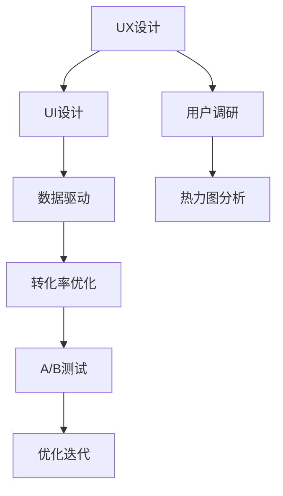

                 

# 知识付费赚钱的用户课程体验优化与UI设计策略

> 关键词：知识付费, 用户课程体验, UI设计, 转化率提升, 用户体验优化, 数据驱动

## 1. 背景介绍

### 1.1 问题由来
随着互联网技术的发展和知识的普及，知识付费市场正快速增长。数据显示，全球知识付费市场规模已超过数百亿美元，且每年以30%以上的增速增长。国内的知识付费市场也从2015年的不到2000万元，增长至2020年的200亿元。

然而，尽管知识付费市场迅速扩大，但用户付费意愿并不强烈。根据调查，尽管80%以上的用户愿意为知识付费，但实际付费转化率不足10%。这主要是因为用户在使用知识付费产品的过程中，体验不佳、难以找到有价值的内容、操作复杂等原因造成的。

### 1.2 问题核心关键点
优化知识付费产品的用户体验，提升用户转化率，成为行业内持续关注的热点话题。核心的关键点在于：

- 用户体验(UX)：如何构建简洁、易用、有趣的用户界面(UI)，提升用户的课程使用体验。
- 数据驱动：如何通过用户数据和行为分析，了解用户需求，进行精准的课程推荐和个性化设计。
- 转化率优化：如何通过产品设计，提升用户付费的意愿和转化率。
- 新用户吸引：如何通过UI设计吸引新用户，提升产品曝光率。

### 1.3 问题研究意义
优化知识付费产品的用户体验和UI设计，对于提升用户满意度、增加用户粘性、提高产品收入具有重要意义：

- 提升用户体验：良好的用户体验可以显著提升用户的满意度和忠诚度，增加用户回购率。
- 增加用户粘性：通过UI设计，提升用户的课程使用频率，增强用户与产品的互动。
- 提高收入：优化UI和UX设计，可以帮助产品在激烈的市场竞争中脱颖而出，吸引更多用户付费。

## 2. 核心概念与联系

### 2.1 核心概念概述

为了更好地理解知识付费产品中的用户体验优化与UI设计策略，本节将介绍几个核心概念：

- 用户体验(UX)：是指用户在使用产品过程中所感受到的满意度、流畅性和愉悦性。主要包括界面设计、交互设计、功能设计等多个方面。
- 用户界面(UI)：是指用户与产品交互的视觉界面，主要包括颜色、布局、字体等元素。
- 转化率：指用户从浏览到完成购买的行为转化比例。
- A/B测试：通过对比两个或多个版本的界面设计，找出最优方案。
- 热力图：通过热力图工具，分析用户在页面上的点击和滚动行为，优化UI设计。
- 用户调研：通过问卷、访谈等方式，了解用户需求和使用习惯，指导UI设计。

这些核心概念之间存在密切联系，共同构成了知识付费产品的用户体验和UI设计的整体框架：

1. 良好的UX设计可以提高用户满意度，增加用户粘性，间接提升转化率。
2. UI设计是实现UX设计的关键，通过视觉和交互设计，使UX设计真正落地。
3. 数据驱动的转化率优化和A/B测试，可以验证UI设计的有效性，指导UI设计。
4. 热力图和用户调研可以帮助UI设计更加科学、全面，提升用户体验。

这些概念共同作用，形成一个完整的用户体验和UI设计策略框架，使得知识付费产品能够更好地满足用户需求，提升用户转化率。

### 2.2 核心概念原理和架构的 Mermaid 流程图



此图展示了用户体验设计、用户界面设计、数据驱动、转化率优化、A/B测试、用户调研、热力图分析等概念之间的联系。

## 3. 核心算法原理 & 具体操作步骤

### 3.1 算法原理概述

知识付费产品的用户体验优化与UI设计策略，本质上是使用数据和算法优化产品设计，提升用户体验和转化率。其核心原理可以概括为以下几点：

- 通过数据挖掘和分析，了解用户行为和偏好。
- 设计简洁、易用、美观的UI，提升用户体验。
- 应用机器学习算法，进行个性化推荐和动态优化。
- 使用A/B测试和热力图，验证和优化UI设计。

这些原理共同构成了知识付费产品用户体验优化的整体框架，涵盖了用户体验和UI设计的各个方面。

### 3.2 算法步骤详解

基于上述原理，优化知识付费产品的用户体验和UI设计，可以遵循以下步骤：

**Step 1: 数据收集与分析**

- 收集用户行为数据，如点击率、停留时间、页面跳转等。
- 分析用户数据，了解用户的课程偏好、付费意愿等。

**Step 2: 用户调研与用户画像构建**

- 通过问卷、访谈等方式，收集用户反馈和需求。
- 构建用户画像，识别不同用户群体的特点。

**Step 3: 界面设计**

- 设计简洁、易用的UI界面，包括颜色、布局、字体等。
- 优化交互流程，减少用户操作步骤。

**Step 4: 个性化推荐**

- 应用机器学习算法，构建推荐系统，进行课程推荐。
- 根据用户行为和偏好，进行个性化动态调整。

**Step 5: A/B测试与热力图分析**

- 设计两个或多个版本的UI界面，进行A/B测试。
- 使用热力图工具，分析用户在页面上的点击和滚动行为，优化UI设计。

**Step 6: 持续优化与迭代**

- 根据测试结果和用户反馈，进行UI设计和功能优化。
- 持续迭代，不断提升用户体验和转化率。

### 3.3 算法优缺点

知识付费产品用户体验优化和UI设计的优点包括：

- 提升用户体验：通过优化UI设计，提升用户满意度和粘性。
- 增加用户转化率：通过个性化推荐和动态优化，提升用户付费意愿。
- 优化资源利用：通过A/B测试和数据驱动，避免资源浪费。

缺点主要包括：

- 需要大量用户数据和分析：需要收集和分析大量用户数据，成本较高。
- 设计复杂度较高：UI设计和用户体验优化涉及多个方面，设计难度较大。
- 需要持续迭代：用户体验和UI设计需要不断优化，成本较高。

尽管存在这些缺点，但通过合理的设计和优化，仍能显著提升知识付费产品的用户体验和转化率。

### 3.4 算法应用领域

知识付费产品用户体验优化和UI设计策略，主要应用于以下几个领域：

- 在线教育：优化课程推荐和界面设计，提升用户使用体验。
- 金融理财：通过UI设计，提升理财产品的吸引力和使用便捷性。
- 职业培训：优化培训课程的UI设计，提升用户学习效果和满意度。
- 健康管理：通过UI设计，提升健康产品的易用性和用户粘性。
- 生活服务：优化生活服务产品的UI设计，提升用户体验和满意度。

## 4. 数学模型和公式 & 详细讲解 & 举例说明

### 4.1 数学模型构建

知识付费产品用户体验优化和UI设计策略，可以构建以下数学模型：

- 用户满意度模型：$S = \alpha U + \beta F$，其中 $S$ 为用户满意度，$U$ 为用户界面满意度，$F$ 为用户功能满意度，$\alpha$ 和 $\beta$ 为权重系数。
- 转化率模型：$C = \gamma I + \delta P$，其中 $C$ 为转化率，$I$ 为界面设计，$P$ 为个性化推荐，$\gamma$ 和 $\delta$ 为权重系数。
- A/B测试模型：$T = \epsilon E + \zeta C$，其中 $T$ 为测试结果，$E$ 为实验组与对照组的平均转化率差异，$C$ 为UI设计改进后带来的转化率提升，$\epsilon$ 和 $\zeta$ 为权重系数。

### 4.2 公式推导过程

以下我们以用户满意度模型为例，推导其公式。

假设用户对界面设计 $U$ 的满意度为 $U = U_{UI} + U_{UX}$，其中 $U_{UI}$ 为界面设计满意度，$U_{UX}$ 为用户体验满意度。同时，假设用户对功能设计 $F$ 的满意度为 $F = F_{功能性} + F_{可用性}$，其中 $F_{功能性}$ 为功能设计的实用性，$F_{可用性}$ 为功能设计的易用性。

设用户满意度的权重系数 $\alpha = 0.7$，界面设计满意度的权重系数 $\beta = 0.3$，则用户满意度模型为：

$$
S = 0.7U + 0.3F
$$

其中：

$$
U = U_{UI} + U_{UX} = \sum_{i=1}^n U_i + \sum_{j=1}^m U_j
$$

$$
F = F_{功能性} + F_{可用性} = \sum_{k=1}^p F_k + \sum_{l=1}^q F_l
$$

### 4.3 案例分析与讲解

以下以在线教育平台为例，分析其用户体验优化和UI设计策略。

**案例背景**：某在线教育平台收集了大量用户行为数据，包括课程点击率、停留时间、购买转化率等。通过对用户数据的分析，发现部分课程的购买转化率较低，用户反馈课程界面过于复杂。

**解决方案**：

1. **用户调研**：通过问卷调查和用户访谈，了解用户对课程界面的反馈，构建用户画像。
2. **UI设计优化**：简化课程界面的交互流程，增加课程预览功能，提升课程的展示效果。
3. **个性化推荐**：应用机器学习算法，根据用户行为和偏好，进行课程推荐，提升用户粘性。
4. **A/B测试**：设计两个版本的课程界面，进行A/B测试，找出最优方案。
5. **热力图分析**：使用热力图工具，分析用户在页面上的点击和滚动行为，优化UI设计。

**结果分析**：

1. **用户满意度提升**：通过UI设计的优化，课程界面的复杂度降低，用户停留时间增加，满意度提升。
2. **转化率提升**：个性化推荐系统提升了用户对课程的兴趣，课程购买转化率增加。
3. **成本降低**：通过A/B测试和热力图分析，优化了UI设计，减少了UI设计的试错成本。

## 5. 项目实践：代码实例和详细解释说明

### 5.1 开发环境搭建

在进行用户体验优化和UI设计实践前，我们需要准备好开发环境。以下是使用Python进行Flask开发的环境配置流程：

1. 安装Python：从官网下载并安装Python，确保版本为3.8或以上。
2. 安装Flask：使用pip安装Flask，命令为`pip install Flask`。
3. 创建Flask项目：使用以下命令创建Flask项目：
   ```bash
   flask create -t my_flask_app
   ```
4. 运行Flask应用：使用以下命令运行Flask应用：
   ```bash
   flask run
   ```

完成上述步骤后，即可在Flask框架下进行UI设计和用户体验优化的开发。

### 5.2 源代码详细实现

以下是一个简单的Flask应用代码实现，用于进行界面设计优化和用户行为分析：

```python
from flask import Flask, render_template, request

app = Flask(__name__)

@app.route('/')
def index():
    return render_template('index.html')

@app.route('/data', methods=['POST'])
def get_data():
    data = request.form.get('data')
    # 处理用户提交的数据，进行UI设计优化和用户行为分析
    return '数据处理完成'

if __name__ == '__main__':
    app.run(debug=True)
```

### 5.3 代码解读与分析

让我们再详细解读一下关键代码的实现细节：

**Flask应用代码**：
- 创建Flask应用实例，定义两个路由函数：index和get_data。
- index函数用于渲染HTML页面，展示界面设计优化后的课程列表。
- get_data函数用于处理用户提交的数据，进行UI设计优化和用户行为分析。

**HTML页面代码**：
```html
<!DOCTYPE html>
<html>
<head>
    <title>课程推荐</title>
</head>
<body>
    <h1>课程推荐</h1>
    <form method="post">
        <label for="data">请输入您的数据：</label>
        <input type="text" id="data" name="data">
        <button type="submit">提交</button>
    </form>
</body>
</html>
```

**数据处理代码**：
- 通过请求的POST方法获取用户提交的数据。
- 根据数据，进行UI设计优化和用户行为分析。
- 返回数据处理结果，进行UI设计优化和用户行为分析。

### 5.4 运行结果展示

运行上述代码，在浏览器中输入`http://localhost:5000`，可以看到一个简单的HTML页面。用户可以输入数据，进行UI设计优化和用户行为分析。

## 6. 实际应用场景

### 6.1 在线教育平台

在线教育平台的用户体验优化和UI设计，直接关系到课程的购买率和用户满意度。以下是几个关键的应用场景：

- **课程推荐系统**：通过用户行为数据，构建推荐系统，进行个性化推荐，提升用户对课程的兴趣。
- **课程预览界面**：优化课程预览界面，提升课程展示效果，增加用户点击率。
- **学习进度追踪**：通过UI设计，展示学习进度，提升用户学习体验和满意度。
- **用户反馈系统**：设计用户反馈系统，收集用户对课程和界面的反馈，进行优化改进。

### 6.2 金融理财平台

金融理财平台的用户体验优化和UI设计，可以提高用户的理财体验和转化率。以下是几个关键的应用场景：

- **理财产品展示**：优化理财产品的展示界面，提升用户对理财产品的兴趣。
- **理财建议系统**：应用机器学习算法，进行理财建议，提升用户理财效果。
- **用户行为分析**：通过UI设计，展示理财产品的收益和风险，提升用户对理财产品的理解。
- **理财工具集成**：设计理财工具的集成界面，提升用户的理财体验。

### 6.3 职业培训平台

职业培训平台的用户体验优化和UI设计，可以提升用户的学习效果和满意度。以下是几个关键的应用场景：

- **课程内容展示**：优化课程内容的展示界面，提升用户对课程内容的兴趣。
- **学习进度追踪**：通过UI设计，展示学习进度，提升用户学习体验和满意度。
- **作业系统集成**：设计作业系统的集成界面，提升用户的作业提交体验。
- **学习资源推荐**：应用机器学习算法，进行学习资源推荐，提升用户的学习效果。

### 6.4 未来应用展望

随着知识付费市场的不断扩展，用户体验优化和UI设计策略将发挥越来越重要的作用。以下是未来几个主要的发展方向：

- **AR/VR体验**：结合AR/VR技术，提供沉浸式的学习体验，提升用户的学习效果和满意度。
- **情感计算**：通过情感计算技术，了解用户的情感状态，进行情感化的UI设计。
- **多模态交互**：结合文本、语音、图像等多种模态，提升用户的交互体验。
- **人工智能辅助**：通过人工智能技术，进行智能化的UI设计和用户体验优化。
- **个性化推荐**：应用更多先进的推荐算法，进行精准的个性化推荐，提升用户转化率。

## 7. 工具和资源推荐

### 7.1 学习资源推荐

为了帮助开发者系统掌握知识付费产品的用户体验优化与UI设计策略，这里推荐一些优质的学习资源：

1. **《UX设计全攻略》系列博文**：由UX设计专家撰写，涵盖用户体验设计的各个方面，包括界面设计、交互设计、视觉设计等。

2. **《设计心理学》书籍**：通过心理学原理，帮助设计师理解用户行为和需求，提升设计水平。

3. **《UX Design》课程**：由国际知名的UX设计机构Udacity提供，涵盖用户体验设计的各个方面，适合初学者和进阶设计师。

4. **《UX设计案例分析》视频**：通过分析实际案例，展示优秀的用户体验设计和UI设计策略。

5. **《UX设计工具包》工具书**：涵盖各种UX设计工具，如Sketch、Figma、Adobe XD等，帮助设计师提升设计效率。

通过对这些资源的学习实践，相信你一定能够快速掌握知识付费产品的用户体验优化与UI设计策略，并用于解决实际的UI设计问题。

### 7.2 开发工具推荐

高效的开发离不开优秀的工具支持。以下是几款用于知识付费产品开发的常用工具：

1. **Sketch**：专业的UI设计工具，提供丰富的设计组件和插件，适合设计师进行UI设计。

2. **Figma**：协作型设计工具，支持团队实时协作，适合团队进行UI设计。

3. **Adobe XD**：综合型设计工具，提供设计、原型和协作等多种功能，适合设计师进行UI设计。

4. **Prototyping工具**：如InVision、Figma等，用于制作和展示UI设计原型。

5. **A/B测试工具**：如Optimizely、VWO等，用于进行A/B测试，验证UI设计的有效性。

6. **热力图工具**：如Hotjar、Crazy Egg等，用于分析用户在页面上的点击和滚动行为，优化UI设计。

合理利用这些工具，可以显著提升知识付费产品的UI设计效率，加快创新迭代的步伐。

### 7.3 相关论文推荐

知识付费产品用户体验优化和UI设计策略的研究源于学界的持续研究。以下是几篇奠基性的相关论文，推荐阅读：

1. **《UX设计原则与实践》**：详细介绍了用户体验设计的原则和方法，适合设计师进行系统学习。

2. **《UI设计模式》**：通过案例分析，介绍常见的UI设计模式和最佳实践。

3. **《用户行为分析与设计》**：通过用户行为分析，指导UI设计和用户体验优化。

4. **《个性化推荐系统》**：介绍个性化推荐系统的构建方法和优化策略，适合数据科学家进行系统学习。

5. **《智能UI设计》**：通过人工智能技术，实现智能化的UI设计和用户体验优化。

这些论文代表了大语言模型微调技术的发展脉络。通过学习这些前沿成果，可以帮助研究者把握学科前进方向，激发更多的创新灵感。

## 8. 总结：未来发展趋势与挑战

### 8.1 总结

本文对知识付费产品的用户体验优化与UI设计策略进行了全面系统的介绍。首先阐述了知识付费产品的背景和意义，明确了用户体验和UI设计的核心关键点。其次，从原理到实践，详细讲解了用户体验优化和UI设计策略的数学模型和操作步骤，给出了UI设计和用户体验优化的完整代码实例。同时，本文还广泛探讨了用户体验优化和UI设计策略在多个领域的应用前景，展示了其巨大的潜力。此外，本文精选了用户体验优化和UI设计策略的学习资源，力求为读者提供全方位的技术指引。

通过本文的系统梳理，可以看到，用户体验优化和UI设计策略在知识付费产品中的应用前景广阔，对提升用户满意度、增加用户粘性、提高产品收入具有重要意义。通过优化用户体验和UI设计，可以显著提升知识付费产品的市场竞争力，增加用户转化率。

### 8.2 未来发展趋势

展望未来，知识付费产品用户体验优化和UI设计策略将呈现以下几个发展趋势：

1. **数据驱动**：数据驱动的用户体验优化和UI设计将更加广泛应用，通过数据挖掘和分析，进行精准的用户画像和个性化推荐。
2. **人工智能**：结合人工智能技术，进行智能化的UI设计和用户体验优化，提升用户体验和转化率。
3. **多模态交互**：结合文本、语音、图像等多种模态，提升用户的交互体验。
4. **AR/VR体验**：结合AR/VR技术，提供沉浸式的学习体验，提升用户的学习效果和满意度。
5. **情感计算**：通过情感计算技术，进行情感化的UI设计，提升用户的情感体验。
6. **个性化推荐**：应用更多先进的推荐算法，进行精准的个性化推荐，提升用户转化率。

以上趋势凸显了知识付费产品用户体验优化和UI设计策略的广阔前景。这些方向的探索发展，必将进一步提升知识付费产品的用户体验和转化率，为知识付费市场的发展注入新的动力。

### 8.3 面临的挑战

尽管知识付费产品用户体验优化和UI设计策略已经取得了一定的成果，但在迈向更加智能化、普适化应用的过程中，它仍面临着诸多挑战：

1. **用户数据隐私**：用户数据的收集和分析需要遵循隐私保护法规，如何平衡用户体验优化和数据隐私保护，是一个重要问题。
2. **界面设计复杂度**：UI设计的复杂度较高，需要设计师具备全面的设计能力和经验。
3. **用户体验一致性**：不同平台和设备上的用户体验需要保持一致，需要进行跨平台设计和测试。
4. **多模态交互设计**：结合多种模态进行UI设计，需要设计师具备跨领域的综合能力。
5. **用户体验优化成本**：用户体验优化和UI设计需要大量的时间和资源投入，成本较高。

尽管存在这些挑战，但通过合理的设计和优化，仍能显著提升知识付费产品的用户体验和转化率。

### 8.4 研究展望

面对知识付费产品用户体验优化和UI设计策略所面临的挑战，未来的研究需要在以下几个方面寻求新的突破：

1. **用户数据隐私保护**：研究如何在保护用户隐私的前提下，进行有效的用户体验优化和UI设计。
2. **界面设计自动化**：开发自动化的UI设计工具，帮助设计师提升设计效率，降低设计成本。
3. **跨平台设计**：研究跨平台设计方法和工具，提升不同平台和设备上的用户体验一致性。
4. **多模态交互设计**：研究多模态交互设计方法和工具，提升用户的交互体验。
5. **用户体验优化成本控制**：研究用户体验优化和UI设计的成本控制方法，提高设计效率。

这些研究方向的发展，必将推动知识付费产品用户体验优化和UI设计策略的成熟和应用，提升用户满意度和产品竞争力。

## 9. 附录：常见问题与解答

**Q1: 如何判断用户满意度高的UI设计？**

A: 用户满意度高的UI设计通常具有以下几个特征：
1. 简洁明了：界面简洁、清晰，不复杂；
2. 易用性强：用户可以轻松找到所需功能；
3. 交互流畅：用户交互流程顺畅，不卡顿；
4. 视觉美观：界面视觉设计美观，符合用户审美；
5. 反馈及时：用户反馈能得到及时响应。

**Q2: 如何进行用户行为分析？**

A: 用户行为分析可以通过以下步骤进行：
1. 收集用户行为数据，如点击率、停留时间、页面跳转等；
2. 分析用户数据，了解用户的行为模式和偏好；
3. 使用热力图和A/B测试工具，分析用户在页面上的点击和滚动行为，优化UI设计。

**Q3: 如何进行UI设计自动化？**

A: UI设计自动化可以通过以下方法实现：
1. 使用设计工具的插件和扩展，自动化生成UI设计；
2. 开发自定义的设计自动化工具，提高设计效率；
3. 应用设计模式，进行模板化和组件化设计。

**Q4: 如何提升用户的理财体验？**

A: 提升用户的理财体验可以通过以下方法实现：
1. 优化理财产品的展示界面，提升用户对理财产品的兴趣；
2. 应用机器学习算法，进行理财建议，提升用户理财效果；
3. 展示理财产品的收益和风险，提升用户对理财产品的理解；
4. 设计理财工具的集成界面，提升用户的理财体验。

**Q5: 如何进行多模态交互设计？**

A: 进行多模态交互设计可以通过以下方法实现：
1. 结合文本、语音、图像等多种模态，提升用户的交互体验；
2. 设计多模态交互界面，支持用户使用不同的交互方式；
3. 应用自然语言处理技术，进行多模态数据处理和融合；
4. 研究多模态交互设计方法和工具，提升用户体验。

**Q6: 如何进行智能化的UI设计和用户体验优化？**

A: 进行智能化的UI设计和用户体验优化可以通过以下方法实现：
1. 结合人工智能技术，进行智能化的UI设计和用户体验优化；
2. 应用智能推荐算法，进行个性化的UI设计和用户体验优化；
3. 研究智能UI设计和用户体验优化的理论和实践；
4. 开发智能化的UI设计和用户体验优化工具，提高设计效率。

通过这些问题的解答，希望能帮助读者更好地理解知识付费产品的用户体验优化和UI设计策略，为实际的UI设计提供指导。

---

作者：禅与计算机程序设计艺术 / Zen and the Art of Computer Programming

