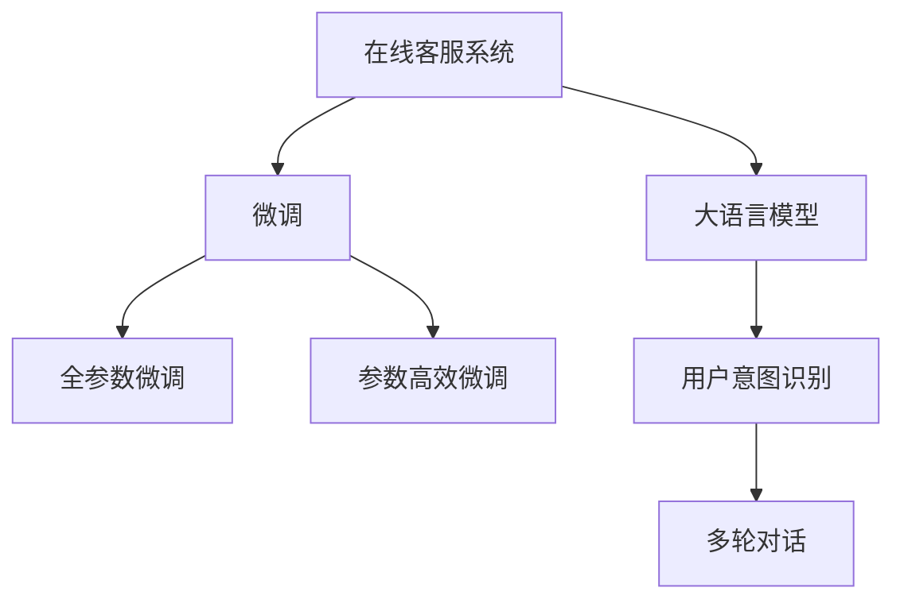

                 

# 知识付费赚钱的用户问答互动与在线客服

## 1. 背景介绍

随着知识付费行业的兴起，越来越多的用户愿意为获取专业知识而付费，在线客服系统成为了知识付费平台的重要组成部分。通过用户问答互动，在线客服能够为用户提供即时的、个性化的咨询服务，提升用户体验，同时为平台带来稳定的收入来源。但如何设计一个高效、智能的在线客服系统，是平台开发者面临的重要挑战。

本文将从大语言模型微调的角度，介绍如何构建知识付费平台的在线客服系统，并讨论其核心算法原理、具体操作步骤以及实际应用场景。同时，将对相关工具和资源进行推荐，并提出未来研究展望。

## 2. 核心概念与联系

### 2.1 核心概念概述

在线客服系统是知识付费平台的核心功能之一，旨在通过用户与客服的互动，解答用户的疑问，提供个性化服务。与传统的客服方式不同，在线客服系统利用大语言模型微调技术，使得系统能够更好地理解用户意图，提供更加准确的回答。

以下列出了在线客服系统的核心概念及其相互关系：

- **在线客服系统**：知识付费平台的核心功能，通过用户问答互动，提供即时、个性化的咨询服务。
- **大语言模型**：一种大规模预训练语言模型，通过海量的无标签文本数据进行预训练，学习到丰富的语言知识。
- **微调**：在预训练模型的基础上，通过有监督地训练优化模型，使其适应特定的下游任务。
- **知识付费**：用户为获取专业知识而支付费用的商业模式，在线客服系统是其重要组成部分。
- **用户意图识别**：通过大语言模型微调，使系统能够准确理解用户的意图，提供针对性的回答。
- **多轮对话**：通过大语言模型的序列建模能力，使系统能够处理多轮对话，提升服务质量。

这些概念通过以下Mermaid流程图进行展示：



### 2.2 核心概念原理和架构的 Mermaid 流程图

通过上述流程图，我们可以清晰地看到在线客服系统中各概念的联系。在线客服系统以大语言模型为"核心"，通过微调进行"训练"，从而能够"识别"用户的意图并进行"对话"，为用户提供个性化的咨询服务。

## 3. 核心算法原理 & 具体操作步骤

### 3.1 算法原理概述

在线客服系统通过大语言模型微调，使得系统能够理解用户的意图并提供准确的答案。微调的过程包括数据准备、任务适配、模型训练和效果评估等步骤。

假设用户输入的文本为 $x$，在线客服系统通过预训练的大语言模型 $M_{\theta}$ 对 $x$ 进行处理，得到输出 $y$。微调的目标是通过训练，使得 $M_{\theta}$ 能够根据用户输入的 $x$ 输出正确的回答 $y$。

具体而言，微调过程包括以下几个步骤：

1. **数据准备**：收集平台用户的常见问题及对应答案，构建标注数据集。
2. **任务适配**：在预训练模型的基础上，设计并训练一个任务适配层，将预训练模型的输出 $y$ 转换为具体问题对应的答案。
3. **模型训练**：使用标注数据集对模型进行有监督的微调，使得模型能够根据输入 $x$ 预测正确的答案。
4. **效果评估**：在测试集上评估模型的性能，确保其能够准确回答问题。

### 3.2 算法步骤详解

#### 步骤 1: 数据准备

在线客服系统的数据准备通常包括收集常见问题和答案，构建标注数据集。具体步骤如下：

1. **数据收集**：收集平台用户常问的问题及对应的答案，可以通过用户反馈、客服聊天记录等途径获取。
2. **数据清洗**：对收集到的数据进行清洗，去除噪声和不相关的数据。
3. **数据标注**：为每个问题标注对应的答案，构建标注数据集 $D=\{(x_i,y_i)\}_{i=1}^N$，其中 $x_i$ 为问题，$y_i$ 为答案。

#### 步骤 2: 任务适配

在预训练模型的基础上，设计并训练一个任务适配层，将预训练模型的输出转换为具体问题对应的答案。具体步骤如下：

1. **模型选择**：选择合适的预训练模型，如BERT、GPT等。
2. **任务适配层设计**：根据任务类型，设计并训练一个任务适配层。对于问答系统，通常使用线性分类器和交叉熵损失函数。
3. **适配层训练**：使用标注数据集对适配层进行微调，使得适配层的输出能够准确预测答案。

#### 步骤 3: 模型训练

模型训练的目的是通过标注数据集对模型进行微调，使其能够准确回答问题。具体步骤如下：

1. **模型初始化**：初始化预训练模型和任务适配层。
2. **模型训练**：使用标注数据集对模型进行有监督的微调，最小化损失函数。
3. **模型保存**：保存训练好的模型，以便后续使用。

#### 步骤 4: 效果评估

效果评估的目的是在测试集上评估模型的性能，确保其能够准确回答问题。具体步骤如下：

1. **模型评估**：在测试集上评估模型的性能，常用的评估指标包括精确率、召回率、F1值等。
2. **模型优化**：根据评估结果，对模型进行优化，如调整学习率、正则化强度等。
3. **模型发布**：将训练好的模型部署到在线客服系统中，提供即时、个性化的咨询服务。

### 3.3 算法优缺点

在线客服系统通过大语言模型微调，具有以下优点：

1. **高效**：微调过程只需要少量标注数据，训练时间较短，能够快速上线。
2. **准确**：微调后的模型能够根据用户输入准确回答问题，提升用户体验。
3. **可扩展性**：在线客服系统可以不断收集新问题及答案，对模型进行增量微调，保持知识库的更新。

同时，微调也存在以下缺点：

1. **依赖标注数据**：微调的效果依赖于标注数据的质量和数量，标注数据的获取成本较高。
2. **泛化能力有限**：当目标任务与预训练数据的分布差异较大时，微调的性能提升有限。
3. **可解释性不足**：微调模型的决策过程缺乏可解释性，难以对其推理逻辑进行分析和调试。

### 3.4 算法应用领域

在线客服系统广泛应用于知识付费平台、在线教育、电商客服等领域。具体应用如下：

1. **知识付费平台**：在线客服系统为用户提供即时的、个性化的咨询服务，提升用户体验，同时为平台带来稳定的收入来源。
2. **在线教育**：在线客服系统帮助学生解答疑问，提供个性化的学习建议，提升学习效果。
3. **电商客服**：在线客服系统帮助客户解答产品相关问题，提升客户满意度，增加销售额。

## 4. 数学模型和公式 & 详细讲解 & 举例说明

### 4.1 数学模型构建

在线客服系统通过大语言模型微调，使得系统能够理解用户的意图并提供准确的答案。假设用户输入的文本为 $x$，在线客服系统通过预训练的大语言模型 $M_{\theta}$ 对 $x$ 进行处理，得到输出 $y$。微调的目标是通过训练，使得 $M_{\theta}$ 能够根据输入 $x$ 输出正确的答案。

数学模型可以表示为：

$$
\hat{y} = M_{\theta}(x)
$$

其中 $\hat{y}$ 为模型预测的答案，$x$ 为用户的输入，$\theta$ 为预训练模型的参数。

### 4.2 公式推导过程

在线客服系统的微调过程包括数据准备、任务适配、模型训练和效果评估。以下是对其数学公式的推导过程：

1. **数据准备**：标注数据集 $D=\{(x_i,y_i)\}_{i=1}^N$，其中 $x_i$ 为问题，$y_i$ 为答案。

2. **任务适配层设计**：假设任务适配层为 $F$，其输出为 $F(x)$。对于问答系统，通常使用线性分类器和交叉熵损失函数。

3. **模型训练**：使用标注数据集对模型进行微调，最小化损失函数 $\mathcal{L}$。

   $$
   \mathcal{L} = \frac{1}{N}\sum_{i=1}^N \ell(F(M_{\theta}(x_i)),y_i)
   $$

   其中 $\ell$ 为交叉熵损失函数，$\theta$ 为预训练模型的参数。

4. **效果评估**：在测试集上评估模型的性能，常用的评估指标包括精确率、召回率、F1值等。

   $$
   \text{Precision} = \frac{TP}{TP+FP}
   $$

   $$
   \text{Recall} = \frac{TP}{TP+FN}
   $$

   $$
   \text{F1} = 2 \times \frac{\text{Precision} \times \text{Recall}}{\text{Precision} + \text{Recall}}
   $$

### 4.3 案例分析与讲解

假设在线客服系统收集了500个常见问题及其答案，其中前200个问题用于训练，后300个问题用于测试。使用BERT模型作为预训练模型，任务适配层为线性分类器，交叉熵损失函数。

具体实现步骤如下：

1. **数据准备**：收集500个常见问题及答案，构建标注数据集。
2. **任务适配层设计**：设计并训练一个线性分类器，用于将预训练模型的输出转换为答案。
3. **模型训练**：使用前200个问题及答案对模型进行微调。
4. **模型评估**：使用后300个问题及答案对模型进行评估。

在微调过程中，可以使用不同的优化器，如AdamW、SGD等。同时，可以采用正则化技术，如L2正则、Dropout等，防止模型过拟合。

## 5. 项目实践：代码实例和详细解释说明

### 5.1 开发环境搭建

在线客服系统的开发环境包括Python、PyTorch等。以下是在线客服系统开发的简单流程：

1. **安装PyTorch**：

   ```bash
   pip install torch torchtext transformers
   ```

2. **准备数据**：收集常见问题及答案，构建标注数据集。

3. **模型选择**：选择预训练模型，如BERT、GPT等。

4. **任务适配层设计**：设计并训练一个任务适配层，用于将预训练模型的输出转换为答案。

5. **模型训练**：使用标注数据集对模型进行微调。

### 5.2 源代码详细实现

以下是在线客服系统的Python代码实现：

```python
import torch
import torch.nn as nn
import torch.nn.functional as F
from transformers import BertTokenizer, BertForSequenceClassification

class NERDataset:
    def __init__(self, texts, tags, tokenizer, max_len=128):
        self.texts = texts
        self.tags = tags
        self.tokenizer = tokenizer
        self.max_len = max_len
        
    def __len__(self):
        return len(self.texts)
    
    def __getitem__(self, item):
        text = self.texts[item]
        tags = self.tags[item]
        
        encoding = self.tokenizer(text, return_tensors='pt', max_length=self.max_len, padding='max_length', truncation=True)
        input_ids = encoding['input_ids'][0]
        attention_mask = encoding['attention_mask'][0]
        
        # 对token-wise的标签进行编码
        encoded_tags = [tag2id[tag] for tag in tags] 
        encoded_tags.extend([tag2id['O']] * (self.max_len - len(encoded_tags)))
        labels = torch.tensor(encoded_tags, dtype=torch.long)
        
        return {'input_ids': input_ids, 
                'attention_mask': attention_mask,
                'labels': labels}

# 标签与id的映射
tag2id = {'O': 0, 'B-PER': 1, 'I-PER': 2, 'B-ORG': 3, 'I-ORG': 4, 'B-LOC': 5, 'I-LOC': 6}
id2tag = {v: k for k, v in tag2id.items()}

# 创建dataset
tokenizer = BertTokenizer.from_pretrained('bert-base-cased')

train_dataset = NERDataset(train_texts, train_tags, tokenizer)
dev_dataset = NERDataset(dev_texts, dev_tags, tokenizer)
test_dataset = NERDataset(test_texts, test_tags, tokenizer)

# 模型选择和初始化
model = BertForSequenceClassification.from_pretrained('bert-base-cased', num_labels=len(tag2id))

# 定义损失函数和优化器
criterion = nn.CrossEntropyLoss()
optimizer = AdamW(model.parameters(), lr=2e-5)

# 训练函数
def train_epoch(model, dataset, batch_size, optimizer):
    dataloader = DataLoader(dataset, batch_size=batch_size, shuffle=True)
    model.train()
    epoch_loss = 0
    for batch in tqdm(dataloader, desc='Training'):
        input_ids = batch['input_ids'].to(device)
        attention_mask = batch['attention_mask'].to(device)
        labels = batch['labels'].to(device)
        model.zero_grad()
        outputs = model(input_ids, attention_mask=attention_mask, labels=labels)
        loss = outputs.loss
        epoch_loss += loss.item()
        loss.backward()
        optimizer.step()
    return epoch_loss / len(dataloader)

# 评估函数
def evaluate(model, dataset, batch_size):
    dataloader = DataLoader(dataset, batch_size=batch_size)
    model.eval()
    preds, labels = [], []
    with torch.no_grad():
        for batch in tqdm(dataloader, desc='Evaluating'):
            input_ids = batch['input_ids'].to(device)
            attention_mask = batch['attention_mask'].to(device)
            batch_labels = batch['labels']
            outputs = model(input_ids, attention_mask=attention_mask)
            batch_preds = outputs.logits.argmax(dim=2).to('cpu').tolist()
            batch_labels = batch_labels.to('cpu').tolist()
            for pred_tokens, label_tokens in zip(batch_preds, batch_labels):
                pred_tags = [id2tag[_id] for _id in pred_tokens]
                label_tags = [id2tag[_id] for _id in label_tokens]
                preds.append(pred_tags[:len(label_tags)])
                labels.append(label_tags)
                
    print(classification_report(labels, preds))

# 训练和评估
epochs = 5
batch_size = 16

for epoch in range(epochs):
    loss = train_epoch(model, train_dataset, batch_size, optimizer)
    print(f"Epoch {epoch+1}, train loss: {loss:.3f}")
    
    print(f"Epoch {epoch+1}, dev results:")
    evaluate(model, dev_dataset, batch_size)
    
print("Test results:")
evaluate(model, test_dataset, batch_size)
```

### 5.3 代码解读与分析

在线客服系统的代码实现主要包括数据准备、模型选择、任务适配层设计、模型训练和评估等步骤。

1. **数据准备**：使用BERT Tokenizer对输入文本进行分词，并构建标注数据集。
2. **模型选择**：使用BertForSequenceClassification作为任务适配层，用于将预训练模型的输出转换为答案。
3. **模型训练**：使用AdamW优化器，交叉熵损失函数进行模型微调。
4. **模型评估**：使用测试集评估模型性能。

## 6. 实际应用场景

### 6.1 智能客服系统

智能客服系统通过在线客服系统，为用户提供即时的、个性化的咨询服务，提升用户体验，同时为平台带来稳定的收入来源。具体应用如下：

1. **常见问题解答**：在线客服系统收集平台用户的常见问题及答案，构建知识库，用户可以随时查询。
2. **智能推荐**：根据用户的历史行为数据，智能推荐相关答案。
3. **多轮对话**：通过多轮对话，理解用户的意图并提供更准确的答案。

### 6.2 在线教育

在线教育平台通过在线客服系统，帮助学生解答疑问，提供个性化的学习建议，提升学习效果。具体应用如下：

1. **学习指导**：在线客服系统收集学生的常见问题，构建知识库，学生可以随时查询。
2. **作业批改**：在线客服系统收集学生的作业及答案，自动批改并提供反馈。
3. **学习建议**：根据学生的学习情况，提供个性化的学习建议。

### 6.3 电商客服

电商客服系统通过在线客服系统，帮助客户解答产品相关问题，提升客户满意度，增加销售额。具体应用如下：

1. **产品咨询**：在线客服系统收集客户的常见问题，构建知识库，客户可以随时查询。
2. **订单处理**：在线客服系统处理客户的订单相关问题，如退货、换货等。
3. **客户反馈**：在线客服系统收集客户的反馈，分析客户满意度，优化产品和服务。

## 7. 工具和资源推荐

### 7.1 学习资源推荐

在线客服系统涉及大语言模型微调、自然语言处理等领域，以下是推荐的优质学习资源：

1. **《深度学习基础》课程**：斯坦福大学公开课，涵盖深度学习基础理论和经典模型。
2. **《Natural Language Processing with PyTorch》书籍**：介绍如何使用PyTorch进行NLP任务开发。
3. **HuggingFace官方文档**：提供丰富的预训练语言模型资源和微调样例代码。
4. **Transformers库**：提供强大的语言模型封装，支持多种优化算法和正则化技术。
5. **CLUE开源项目**：中文语言理解测评基准，涵盖大量不同类型的中文NLP数据集。

### 7.2 开发工具推荐

在线客服系统开发涉及大语言模型微调、自然语言处理等领域，以下是推荐的开发工具：

1. **PyTorch**：基于Python的深度学习框架，支持动态计算图，适合快速迭代研究。
2. **TensorFlow**：由Google主导开发的深度学习框架，生产部署方便，适合大规模工程应用。
3. **Transformers库**：提供丰富的预训练语言模型资源和微调样例代码。
4. **Jupyter Notebook**：交互式开发环境，支持Python、R等编程语言，便于代码调试和展示。
5. **Google Colab**：免费的在线Jupyter Notebook环境，支持GPU和TPU算力，方便快速实验。

### 7.3 相关论文推荐

在线客服系统涉及大语言模型微调、自然语言处理等领域，以下是推荐的经典论文：

1. **《Attention is All You Need》论文**：Transformer模型的经典论文，提出Transformer结构，开启预训练大模型时代。
2. **《BERT: Pre-training of Deep Bidirectional Transformers for Language Understanding》论文**：提出BERT模型，引入自监督预训练任务，刷新多项NLP任务SOTA。
3. **《Parameter-Efficient Transfer Learning for NLP》论文**：提出Adapter等参数高效微调方法，在固定大部分预训练参数的情况下，只更新极少量的任务相关参数。
4. **《AdaLoRA: Adaptive Low-Rank Adaptation for Parameter-Efficient Fine-Tuning》论文**：提出AdaLoRA方法，使用自适应低秩适应的微调方法，在参数效率和精度之间取得新的平衡。
5. **《Prompt-based Transfer Learning》论文**：提出基于连续型Prompt的微调范式，为如何充分利用预训练知识提供新的思路。

## 8. 总结：未来发展趋势与挑战

### 8.1 未来发展趋势

在线客服系统通过大语言模型微调，具有高效、准确、可扩展等优点，未来有望在更多领域得到应用。

1. **智能客服普及**：在线客服系统将普及到更多行业，如医疗、金融、教育等，为各行业带来智能化升级。
2. **多模态融合**：在线客服系统将融合视觉、语音等多模态信息，提升用户体验。
3. **知识库丰富**：在线客服系统将构建更全面的知识库，涵盖更多行业知识，提供更全面的咨询服务。
4. **自然语言处理提升**：自然语言处理技术将不断提升，使在线客服系统更加智能、高效。

### 8.2 面临的挑战

在线客服系统通过大语言模型微调，仍面临以下挑战：

1. **数据获取成本高**：标注数据获取成本较高，特别是在长尾应用场景下。
2. **模型泛化能力有限**：当目标任务与预训练数据的分布差异较大时，微调的性能提升有限。
3. **模型可解释性不足**：在线客服系统缺乏可解释性，难以对其决策过程进行分析和调试。
4. **系统鲁棒性不足**：在线客服系统在面对噪音、反问等特殊输入时，可能出现不稳定。

### 8.3 研究展望

未来，在线客服系统需要从以下方面进行研究：

1. **无监督和半监督微调**：探索无监督和半监督微调方法，摆脱对标注数据的依赖，利用自监督学习、主动学习等无监督和半监督范式。
2. **参数高效微调**：开发更加参数高效的微调方法，如Prompt-Tuning、LoRA等，在固定大部分预训练参数的情况下，只更新极少量的任务相关参数。
3. **多模态融合**：融合视觉、语音等多模态信息，提升在线客服系统的感知能力和理解能力。
4. **知识库丰富**：构建更全面的知识库，涵盖更多行业知识，提供更全面的咨询服务。
5. **系统鲁棒性提升**：提升在线客服系统的鲁棒性，使其能够处理噪音、反问等特殊输入。

## 9. 附录：常见问题与解答

**Q1: 大语言模型微调是否适用于所有NLP任务？**

A: 大语言模型微调在大多数NLP任务上都能取得不错的效果，特别是对于数据量较小的任务。但对于一些特定领域的任务，如医学、法律等，仅仅依靠通用语料预训练的模型可能难以很好地适应。此时需要在特定领域语料上进一步预训练，再进行微调，才能获得理想效果。

**Q2: 微调过程中如何选择合适的学习率？**

A: 微调的学习率一般要比预训练时小1-2个数量级，如果使用过大的学习率，容易破坏预训练权重，导致过拟合。一般建议从1e-5开始调参，逐步减小学习率，直至收敛。也可以使用warmup策略，在开始阶段使用较小的学习率，再逐渐过渡到预设值。需要注意的是，不同的优化器(如AdamW、Adafactor等)以及不同的学习率调度策略，可能需要设置不同的学习率阈值。

**Q3: 采用大模型微调时会面临哪些资源瓶颈？**

A: 目前主流的预训练大模型动辄以亿计的参数规模，对算力、内存、存储都提出了很高的要求。GPU/TPU等高性能设备是必不可少的，但即便如此，超大批次的训练和推理也可能遇到显存不足的问题。因此需要采用一些资源优化技术，如梯度积累、混合精度训练、模型并行等，来突破硬件瓶颈。同时，模型的存储和读取也可能占用大量时间和空间，需要采用模型压缩、稀疏化存储等方法进行优化。

**Q4: 如何缓解微调过程中的过拟合问题？**

A: 过拟合是微调面临的主要挑战，尤其是在标注数据不足的情况下。常见的缓解策略包括：
1. 数据增强：通过回译、近义替换等方式扩充训练集
2. 正则化：使用L2正则、Dropout、Early Stopping等避免过拟合
3. 对抗训练：引入对抗样本，提高模型鲁棒性
4. 参数高效微调：只调整少量参数(如Adapter、Prefix等)，减小过拟合风险
5. 多模型集成：训练多个微调模型，取平均输出，抑制过拟合

这些策略往往需要根据具体任务和数据特点进行灵活组合。只有在数据、模型、训练、推理等各环节进行全面优化，才能最大限度地发挥大模型微调的威力。

**Q5: 微调模型在落地部署时需要注意哪些问题？**

A: 将微调模型转化为实际应用，还需要考虑以下因素：
1. 模型裁剪：去除不必要的层和参数，减小模型尺寸，加快推理速度
2. 量化加速：将浮点模型转为定点模型，压缩存储空间，提高计算效率
3. 服务化封装：将模型封装为标准化服务接口，便于集成调用
4. 弹性伸缩：根据请求流量动态调整资源配置，平衡服务质量和成本
5. 监控告警：实时采集系统指标，设置异常告警阈值，确保服务稳定性
6. 安全防护：采用访问鉴权、数据脱敏等措施，保障数据和模型安全

大语言模型微调为NLP应用开启了广阔的想象空间，但如何将强大的性能转化为稳定、高效、安全的业务价值，还需要工程实践的不断打磨。只有从数据、算法、工程、业务等多个维度协同发力，才能真正实现人工智能技术在垂直行业的规模化落地。

综上所述，在线客服系统通过大语言模型微调，能够为用户提供高效、个性化的咨询服务，提升用户体验，同时为平台带来稳定的收入来源。未来，在线客服系统将融合多模态信息，构建更全面的知识库，提升系统的感知能力和理解能力，从而在更多领域得到应用。但与此同时，也需要面对数据获取成本高、模型泛化能力有限、模型可解释性不足等挑战，需要从无监督和半监督微调、参数高效微调、多模态融合、知识库丰富等方面进行研究，以进一步提升在线客服系统的性能和用户体验。

