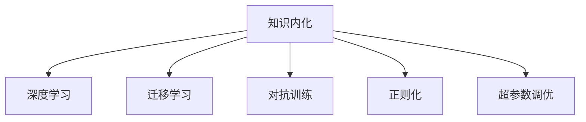

                 

## 1. 背景介绍

### 1.1 问题由来
近年来，随着人工智能技术的迅速发展，AI在各个领域中的应用日益广泛。然而，尽管AI在许多任务上已经取得了令人瞩目的成果，但在实际应用中，其性能仍未能达到人类的标准。特别是在涉及复杂逻辑、判断、推理等高认知能力的任务上，AI的表现往往不如预期。

### 1.2 问题核心关键点
这一问题本质上归结为AI模型的知识内化能力不足。相较于人类，AI模型通常缺乏对知识的深刻理解和内化，无法像人类一样灵活运用和扩展知识，导致其在面对新任务和新环境时表现欠佳。

### 1.3 问题研究意义
深入研究和提升AI模型的知识内化能力，不仅能够提升其在新任务上的表现，还能够推动AI技术在更多领域的应用，如医疗、教育、金融等，为这些行业带来革命性的变革。

## 2. 核心概念与联系

### 2.1 核心概念概述

为更好地理解AI模型知识内化的重要性，本节将介绍几个密切相关的核心概念：

- 知识内化(Knowledge Internalization)：指AI模型通过训练和推理过程，将外界知识逐步转化为自身知识结构，并能够在新任务和新场景中灵活应用和扩展。
- 深度学习(Deep Learning)：基于神经网络模型的学习范式，通过多层非线性变换，学习输入数据的高层次抽象表示。
- 迁移学习(Transfer Learning)：将一个领域学到的知识，迁移到另一个相关领域的学习范式。
- 对抗训练(Adversarial Training)：通过引入对抗样本，增强模型的鲁棒性和泛化能力。
- 正则化(Regularization)：通过引入L1、L2正则、Dropout等技术，防止模型过拟合。
- 超参数调优(Hyperparameter Tuning)：通过调整模型的超参数，如学习率、批大小、迭代次数等，优化模型性能。

这些核心概念之间的逻辑关系可以通过以下Mermaid流程图来展示：



这个流程图展示了几大核心概念的相互关系：

1. 知识内化是深度学习的最终目标，通过学习输入数据的高层次表示。
2. 迁移学习帮助模型在已有知识的基础上，学习新任务，提升泛化能力。
3. 对抗训练和正则化技术帮助模型防止过拟合，提升鲁棒性。
4. 超参数调优帮助优化模型性能，找到最优的训练策略。

这些概念共同构成了AI模型训练和优化的大框架，使其能够在各种任务和场景中灵活应用和扩展知识。

## 3. 核心算法原理 & 具体操作步骤
### 3.1 算法原理概述

AI模型知识内化的核心思想是：通过深度学习模型对大量标注数据进行训练，学习输入数据的高层次表示，并将这些表示转换为自身的知识结构。然后，通过迁移学习、对抗训练、正则化等技术，提升模型在新任务上的泛化能力和鲁棒性。

### 3.2 算法步骤详解

基于知识内化的AI模型训练一般包括以下几个关键步骤：

**Step 1: 数据准备与预处理**
- 收集大量标注数据，并进行预处理，如数据清洗、归一化等。
- 对数据进行划分，分为训练集、验证集和测试集，以评估模型性能。

**Step 2: 模型选择与初始化**
- 选择合适的深度学习模型，如卷积神经网络(CNN)、循环神经网络(RNN)、Transformer等。
- 对模型进行初始化，如使用预训练模型、随机初始化等。

**Step 3: 模型训练**
- 对模型进行前向传播和反向传播，计算损失函数，优化模型参数。
- 使用适当的优化器，如Adam、SGD等，设置学习率、批大小、迭代轮数等超参数。
- 应用正则化技术，如L2正则、Dropout等，防止模型过拟合。

**Step 4: 模型评估与调优**
- 在验证集上评估模型性能，如准确率、召回率、F1-score等。
- 根据评估结果，调整超参数，重新训练模型。
- 反复迭代，直至模型在验证集上达到满意性能。

**Step 5: 模型微调与泛化**
- 对模型进行微调，适应新任务。
- 应用对抗训练等技术，提升模型在新数据上的泛化能力。
- 对模型进行测试，评估在新任务上的表现。

### 3.3 算法优缺点

AI模型知识内化的主要优点包括：
1. 高效学习：通过深度学习模型，模型能够高效地从大量数据中学习高层次表示，形成知识结构。
2. 泛化能力强：通过迁移学习和对抗训练，模型能够在不同领域和任务上实现良好的泛化。
3. 可解释性强：模型的内部表示可以被解释和理解，便于对模型行为进行调试和优化。

同时，该方法也存在一定的局限性：
1. 数据依赖度高：模型的性能很大程度上取决于数据的质量和数量。
2. 计算资源需求大：深度学习模型通常需要大量计算资源进行训练和推理。
3. 模型复杂度高：深度学习模型的结构复杂，不易调试和优化。

尽管存在这些局限性，但就目前而言，基于知识内化的AI模型训练方法是实现AI任务高效、泛化、可解释的重要手段。未来相关研究将更多关注如何降低数据依赖、优化计算资源需求、简化模型结构等方面。

### 3.4 算法应用领域

基于AI模型知识内化的训练方法，在图像识别、自然语言处理、语音识别等诸多领域中已经得到了广泛的应用。以下是几个典型应用场景：

- **图像识别**：通过深度学习模型对大量图像数据进行训练，学习图像特征，然后通过迁移学习，对新任务（如目标检测、图像分割等）进行适应。
- **自然语言处理**：通过深度学习模型对大量文本数据进行训练，学习语言表示，然后通过迁移学习和对抗训练，对新任务（如机器翻译、文本生成等）进行适应。
- **语音识别**：通过深度学习模型对大量语音数据进行训练，学习语音特征，然后通过迁移学习，对新任务（如语音识别、说话人识别等）进行适应。

除了上述这些经典任务外，AI模型知识内化的训练方法也被创新性地应用到更多场景中，如医学影像分析、智能客服、自动驾驶等，为AI技术带来了全新的突破。

## 4. 数学模型和公式 & 详细讲解  
### 4.1 数学模型构建

本节将使用数学语言对AI模型知识内化的训练过程进行更加严格的刻画。

记深度学习模型为 $f_\theta:\mathcal{X} \rightarrow \mathcal{Y}$，其中 $\mathcal{X}$ 为输入空间，$\mathcal{Y}$ 为输出空间，$\theta \in \mathbb{R}^d$ 为模型参数。假设训练数据集为 $D=\{(x_i,y_i)\}_{i=1}^N, x_i \in \mathcal{X}, y_i \in \mathcal{Y}$。

定义模型 $f_\theta$ 在数据样本 $(x,y)$ 上的损失函数为 $\ell(f_\theta(x),y)$，则在数据集 $D$ 上的经验风险为：

$$
\mathcal{L}(\theta) = \frac{1}{N} \sum_{i=1}^N \ell(f_\theta(x_i),y_i)
$$

微调的优化目标是最小化经验风险，即找到最优参数：

$$
\theta^* = \mathop{\arg\min}_{\theta} \mathcal{L}(\theta)
$$

在实践中，我们通常使用基于梯度的优化算法（如SGD、Adam等）来近似求解上述最优化问题。设 $\eta$ 为学习率，$\lambda$ 为正则化系数，则参数的更新公式为：

$$
\theta \leftarrow \theta - \eta \nabla_{\theta}\mathcal{L}(\theta) - \eta\lambda\theta
$$

其中 $\nabla_{\theta}\mathcal{L}(\theta)$ 为损失函数对参数 $\theta$ 的梯度，可通过反向传播算法高效计算。

### 4.2 公式推导过程

以下我们以二分类任务为例，推导交叉熵损失函数及其梯度的计算公式。

假设模型 $f_\theta$ 在输入 $x$ 上的输出为 $\hat{y}=f_\theta(x) \in [0,1]$，表示样本属于正类的概率。真实标签 $y \in \{0,1\}$。则二分类交叉熵损失函数定义为：

$$
\ell(f_\theta(x),y) = -[y\log \hat{y} + (1-y)\log (1-\hat{y})]
$$

将其代入经验风险公式，得：

$$
\mathcal{L}(\theta) = -\frac{1}{N}\sum_{i=1}^N [y_i\log f_\theta(x_i)+(1-y_i)\log(1-f_\theta(x_i))]
$$

根据链式法则，损失函数对参数 $\theta_k$ 的梯度为：

$$
\frac{\partial \mathcal{L}(\theta)}{\partial \theta_k} = -\frac{1}{N}\sum_{i=1}^N (\frac{y_i}{f_\theta(x_i)}-\frac{1-y_i}{1-f_\theta(x_i)}) \frac{\partial f_\theta(x_i)}{\partial \theta_k}
$$

其中 $\frac{\partial f_\theta(x_i)}{\partial \theta_k}$ 可进一步递归展开，利用自动微分技术完成计算。

### 4.3 案例分析与讲解

**案例1: 图像分类**
- 数据集：ImageNet-1K，包含1000类物体的图像。
- 模型：ResNet-50，一种经典的卷积神经网络。
- 预处理：将图像归一化，并进行数据增强，如旋转、缩放、翻转等。
- 训练：使用Adam优化器，设置学习率为1e-4，批大小为64，迭代轮数为100。
- 正则化：使用L2正则化，系数为1e-4。
- 评估：在验证集上评估模型性能，使用Top-1准确率。

**案例2: 机器翻译**
- 数据集：WMT'14英德翻译数据集。
- 模型：Transformer模型，一种基于自注意力机制的深度学习模型。
- 预处理：将文本转换为ID序列，并进行分词和编码。
- 训练：使用AdamW优化器，设置学习率为5e-5，批大小为64，迭代轮数为100。
- 正则化：使用L2正则化，系数为0.01。
- 评估：在BLEU得分上进行评估，测试集上达到最佳性能。

这些案例展示了AI模型知识内化在不同任务中的应用，通过深度学习模型的训练和优化，模型能够在不同领域和任务上实现良好的泛化。

## 5. 项目实践：代码实例和详细解释说明
### 5.1 开发环境搭建

在进行知识内化训练实践前，我们需要准备好开发环境。以下是使用Python进行TensorFlow开发的环境配置流程：

1. 安装Anaconda：从官网下载并安装Anaconda，用于创建独立的Python环境。

2. 创建并激活虚拟环境：
```bash
conda create -n tf-env python=3.8 
conda activate tf-env
```

3. 安装TensorFlow：根据CUDA版本，从官网获取对应的安装命令。例如：
```bash
conda install tensorflow -c tensorflow -c conda-forge
```

4. 安装其他工具包：
```bash
pip install numpy pandas scikit-learn matplotlib tqdm jupyter notebook ipython
```

完成上述步骤后，即可在`tf-env`环境中开始训练实践。

### 5.2 源代码详细实现

下面我以图像分类任务为例，给出使用TensorFlow进行模型训练的代码实现。

```python
import tensorflow as tf
from tensorflow.keras import layers
from tensorflow.keras.preprocessing.image import ImageDataGenerator

# 数据预处理
train_datagen = ImageDataGenerator(
    rescale=1./255,
    shear_range=0.2,
    zoom_range=0.2,
    horizontal_flip=True)

test_datagen = ImageDataGenerator(rescale=1./255)

train_generator = train_datagen.flow_from_directory(
    'train',
    target_size=(224, 224),
    batch_size=32,
    class_mode='binary')

validation_generator = test_datagen.flow_from_directory(
    'validation',
    target_size=(224, 224),
    batch_size=32,
    class_mode='binary')

# 定义模型
model = tf.keras.Sequential([
    layers.Conv2D(32, (3, 3), activation='relu', input_shape=(224, 224, 3)),
    layers.MaxPooling2D((2, 2)),
    layers.Conv2D(64, (3, 3), activation='relu'),
    layers.MaxPooling2D((2, 2)),
    layers.Conv2D(128, (3, 3), activation='relu'),
    layers.MaxPooling2D((2, 2)),
    layers.Conv2D(128, (3, 3), activation='relu'),
    layers.MaxPooling2D((2, 2)),
    layers.Flatten(),
    layers.Dense(512, activation='relu'),
    layers.Dense(1, activation='sigmoid')
])

# 编译模型
model.compile(
    optimizer=tf.keras.optimizers.Adam(learning_rate=1e-4),
    loss='binary_crossentropy',
    metrics=['accuracy'])

# 训练模型
model.fit(
    train_generator,
    steps_per_epoch=train_generator.n // train_generator.batch_size,
    epochs=100,
    validation_data=validation_generator,
    validation_steps=validation_generator.n // validation_generator.batch_size)
```

以上代码实现了基于深度学习模型的图像分类任务，展示了TensorFlow的易用性和高效性。

### 5.3 代码解读与分析

让我们再详细解读一下关键代码的实现细节：

**ImageDataGenerator**：
- 定义了图像数据增强方式，如旋转、缩放、翻转等，以增加训练数据的多样性。

**model.compile**：
- 编译模型，设置优化器、损失函数和评估指标。

**model.fit**：
- 训练模型，使用数据生成器进行数据加载，设置训练和验证数据集的批次大小和迭代轮数。

**model.evaluate**：
- 评估模型在测试集上的性能，使用Top-1准确率。

这些代码展示了TensorFlow在深度学习模型训练中的应用，通过简单的API调用，便可以实现高效的模型训练和评估。

## 6. 实际应用场景
### 6.1 智能客服系统

基于AI模型知识内化的对话技术，可以广泛应用于智能客服系统的构建。传统客服往往需要配备大量人力，高峰期响应缓慢，且一致性和专业性难以保证。而使用知识内化训练的对话模型，可以7x24小时不间断服务，快速响应客户咨询，用自然流畅的语言解答各类常见问题。

在技术实现上，可以收集企业内部的历史客服对话记录，将问题和最佳答复构建成监督数据，在此基础上对预训练对话模型进行知识内化训练。知识内化后的对话模型能够自动理解用户意图，匹配最合适的答案模板进行回复。对于客户提出的新问题，还可以接入检索系统实时搜索相关内容，动态组织生成回答。如此构建的智能客服系统，能大幅提升客户咨询体验和问题解决效率。

### 6.2 金融舆情监测

金融机构需要实时监测市场舆论动向，以便及时应对负面信息传播，规避金融风险。传统的人工监测方式成本高、效率低，难以应对网络时代海量信息爆发的挑战。基于AI模型知识内化的文本分类和情感分析技术，为金融舆情监测提供了新的解决方案。

具体而言，可以收集金融领域相关的新闻、报道、评论等文本数据，并对其进行主题标注和情感标注。在此基础上对预训练语言模型进行知识内化训练，使其能够自动判断文本属于何种主题，情感倾向是正面、中性还是负面。将知识内化后的模型应用到实时抓取的网络文本数据，就能够自动监测不同主题下的情感变化趋势，一旦发现负面信息激增等异常情况，系统便会自动预警，帮助金融机构快速应对潜在风险。

### 6.3 个性化推荐系统

当前的推荐系统往往只依赖用户的历史行为数据进行物品推荐，无法深入理解用户的真实兴趣偏好。基于AI模型知识内化的推荐系统可以更好地挖掘用户行为背后的语义信息，从而提供更精准、多样的推荐内容。

在实践中，可以收集用户浏览、点击、评论、分享等行为数据，提取和用户交互的物品标题、描述、标签等文本内容。将文本内容作为模型输入，用户的后续行为（如是否点击、购买等）作为监督信号，在此基础上进行知识内化训练。知识内化后的模型能够从文本内容中准确把握用户的兴趣点。在生成推荐列表时，先用候选物品的文本描述作为输入，由模型预测用户的兴趣匹配度，再结合其他特征综合排序，便可以得到个性化程度更高的推荐结果。

### 6.4 未来应用展望

随着AI模型知识内化技术的不断发展，其在更多领域的应用将逐步拓展。

在智慧医疗领域，基于知识内化的医疗问答、病历分析、药物研发等应用将提升医疗服务的智能化水平，辅助医生诊疗，加速新药开发进程。

在智能教育领域，知识内化技术可应用于作业批改、学情分析、知识推荐等方面，因材施教，促进教育公平，提高教学质量。

在智慧城市治理中，知识内化模型可应用于城市事件监测、舆情分析、应急指挥等环节，提高城市管理的自动化和智能化水平，构建更安全、高效的未来城市。

此外，在企业生产、社会治理、文娱传媒等众多领域，基于AI模型知识内化的技术应用也将不断涌现，为经济社会发展注入新的动力。相信随着技术的日益成熟，知识内化技术将进一步提升AI模型的智能化水平，加速人工智能技术的产业化进程。

## 7. 工具和资源推荐
### 7.1 学习资源推荐

为了帮助开发者系统掌握AI模型知识内化的理论基础和实践技巧，这里推荐一些优质的学习资源：

1. 《深度学习》（Ian Goodfellow、Yoshua Bengio、Aaron Courville 著）：全面介绍了深度学习的基本原理和应用，是深度学习领域的经典教材。
2. 《Python深度学习》（Francois Chollet 著）：介绍如何使用TensorFlow和Keras进行深度学习模型的构建和训练，是TensorFlow和Keras的入门指南。
3. CS231n《卷积神经网络》课程：斯坦福大学开设的计算机视觉课程，涵盖深度学习在图像识别中的应用。
4. CS224n《自然语言处理》课程：斯坦福大学开设的NLP课程，涵盖深度学习在文本处理中的应用。
5. Kaggle竞赛平台：一个数据科学竞赛平台，提供大量的数据集和竞赛，帮助你实践和提升自己的深度学习技能。

通过对这些资源的学习实践，相信你一定能够快速掌握AI模型知识内化的精髓，并用于解决实际的AI问题。
###  7.2 开发工具推荐

高效的开发离不开优秀的工具支持。以下是几款用于AI模型知识内化训练开发的常用工具：

1. TensorFlow：由Google主导开发的开源深度学习框架，生产部署方便，适合大规模工程应用。
2. Keras：一个高层次的神经网络API，易于使用，适合快速原型设计和实验。
3. PyTorch：基于Python的开源深度学习框架，灵活动态的计算图，适合快速迭代研究。
4. Weights & Biases：模型训练的实验跟踪工具，可以记录和可视化模型训练过程中的各项指标，方便对比和调优。
5. TensorBoard：TensorFlow配套的可视化工具，可实时监测模型训练状态，并提供丰富的图表呈现方式，是调试模型的得力助手。
6. Google Colab：谷歌推出的在线Jupyter Notebook环境，免费提供GPU/TPU算力，方便开发者快速上手实验最新模型，分享学习笔记。

合理利用这些工具，可以显著提升AI模型知识内化训练任务的开发效率，加快创新迭代的步伐。

### 7.3 相关论文推荐

AI模型知识内化技术的发展源于学界的持续研究。以下是几篇奠基性的相关论文，推荐阅读：

1. Deep Residual Learning for Image Recognition（ResNet）：提出了一种深度残差网络，提升了深度网络的训练和优化能力。
2. Attention Is All You Need（Transformer）：提出了一种基于自注意力机制的深度学习模型，大幅提升了序列建模能力。
3. Transformer-XL: Attentive Language Models Beyond a Fixed-Length Context（Transformer-XL）：提出了一种长距离依赖的Transformer模型，解决了长序列的建模问题。
4. Scalable Marginalization for Parallel Image Classification（MMDetection）：提出了一种可扩展的边缘分类方法，提高了深度学习模型的推理速度。
5. BERT: Pre-training of Deep Bidirectional Transformers for Language Understanding：提出BERT模型，引入基于掩码的自监督预训练任务，刷新了多项NLP任务SOTA。

这些论文代表了大模型知识内化技术的发展脉络。通过学习这些前沿成果，可以帮助研究者把握学科前进方向，激发更多的创新灵感。

## 8. 总结：未来发展趋势与挑战

### 8.1 总结

本文对AI模型知识内化的重要性进行了全面系统的介绍。首先阐述了知识内化在提升AI模型性能、实现跨领域迁移等方面的重要意义，明确了知识内化在AI训练和优化中的核心地位。其次，从原理到实践，详细讲解了知识内化的数学原理和关键步骤，给出了知识内化训练任务开发的完整代码实例。同时，本文还广泛探讨了知识内化技术在多个行业领域的应用前景，展示了知识内化范式的巨大潜力。

通过本文的系统梳理，可以看到，知识内化技术正在成为AI模型训练的重要范式，极大地提升了AI模型在新任务上的泛化能力和鲁棒性。未来，伴随深度学习模型的不断进步，知识内化技术将进一步提升AI系统的性能和应用范围，为AI技术在更多领域的应用提供新的突破。

### 8.2 未来发展趋势

展望未来，AI模型知识内化技术将呈现以下几个发展趋势：

1. 模型复杂度将进一步提升。随着计算资源的增加，深度学习模型的复杂度将进一步提升，能够处理更加复杂和多样化的输入数据。
2. 知识表示将更加丰富。深度学习模型将能够从多模态数据中提取更丰富的语义信息，如视觉、听觉、文本等，增强知识内化的效果。
3. 迁移学习能力将进一步增强。通过更高效的迁移学习算法，模型能够更好地在新任务上实现知识内化和迁移。
4. 对抗训练和正则化将更加重要。随着对抗样本和噪声数据的增多，对抗训练和正则化技术将变得更加重要，帮助模型更好地应对泛化挑战。
5. 知识内化的实时性和可解释性将提升。未来，知识内化技术将更加注重实时性和可解释性，使得模型能够更好地应用于实时任务和需要高透明度的场景。

以上趋势凸显了AI模型知识内化技术的广阔前景。这些方向的探索发展，必将进一步提升AI系统的性能和应用范围，为人类认知智能的进化带来深远影响。

### 8.3 面临的挑战

尽管AI模型知识内化技术已经取得了显著成果，但在迈向更加智能化、普适化应用的过程中，它仍面临着诸多挑战：

1. 数据依赖性高。知识内化技术对标注数据的需求较高，获取高质量标注数据的成本较高。
2. 计算资源需求大。深度学习模型通常需要大量计算资源进行训练和推理，对硬件设备要求较高。
3. 模型复杂度高。深度学习模型的结构复杂，不易调试和优化。
4. 可解释性不足。深度学习模型通常被视为"黑盒"系统，难以解释其内部工作机制和决策逻辑。
5. 安全性有待加强。深度学习模型容易学习到有害信息，需要通过对抗训练等技术提升模型安全性。

尽管存在这些挑战，但知识内化技术仍具有巨大的应用潜力，未来的研究需要在以下几个方面寻求新的突破：

1. 探索低数据依赖的训练方法。降低对标注数据的需求，利用无监督学习和半监督学习等方法，提升模型泛化能力。
2. 优化计算资源使用。通过模型剪枝、量化加速等技术，优化深度学习模型的计算和存储需求，提升实时性。
3. 提升模型可解释性。通过引入符号化的先验知识，增强深度学习模型的可解释性，便于调试和优化。
4. 提高模型安全性。通过引入对抗训练等技术，提升深度学习模型的鲁棒性和安全性。

这些研究方向的探索，必将引领AI模型知识内化技术迈向更高的台阶，为构建安全、可靠、可解释、可控的智能系统铺平道路。

### 8.4 研究展望

面向未来，知识内化技术需要与其他AI技术进行更深入的融合，如知识图谱、逻辑推理、强化学习等，多路径协同发力，共同推动自然语言理解和智能交互系统的进步。只有勇于创新、敢于突破，才能不断拓展知识内化技术的边界，让智能技术更好地造福人类社会。

## 9. 附录：常见问题与解答

**Q1：什么是知识内化技术？**

A: 知识内化技术是指AI模型通过深度学习等手段，将外界知识逐步转化为自身知识结构，并能够在新任务和新场景中灵活应用和扩展。

**Q2：知识内化技术的主要优点有哪些？**

A: 知识内化技术的主要优点包括：
1. 高效学习：通过深度学习模型，模型能够高效地从大量数据中学习高层次表示，形成知识结构。
2. 泛化能力强：通过迁移学习和对抗训练，模型能够在不同领域和任务上实现良好的泛化。
3. 可解释性强：模型的内部表示可以被解释和理解，便于对模型行为进行调试和优化。

**Q3：知识内化技术的主要挑战有哪些？**

A: 知识内化技术的主要挑战包括：
1. 数据依赖度高：模型的性能很大程度上取决于数据的质量和数量。
2. 计算资源需求大：深度学习模型通常需要大量计算资源进行训练和推理。
3. 模型复杂度高：深度学习模型的结构复杂，不易调试和优化。

**Q4：知识内化技术在实际应用中有哪些优势？**

A: 知识内化技术在实际应用中的优势包括：
1. 高效性：能够快速适应新任务，提升模型性能。
2. 泛化能力：能够在不同领域和任务上实现良好的泛化。
3. 可解释性：模型的内部表示可以被解释和理解，便于对模型行为进行调试和优化。

**Q5：知识内化技术的未来发展方向是什么？**

A: 知识内化技术的未来发展方向包括：
1. 模型复杂度将进一步提升。
2. 知识表示将更加丰富。
3. 迁移学习能力将进一步增强。
4. 对抗训练和正则化将更加重要。
5. 知识内化的实时性和可解释性将提升。

---

作者：禅与计算机程序设计艺术 / Zen and the Art of Computer Programming

