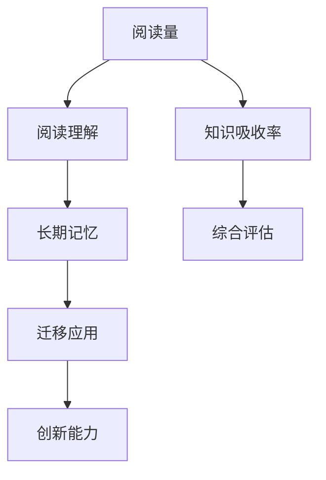

                 

# 知识吸收率:比阅读量更重要的指标

## 1. 背景介绍

在数字化时代，信息的爆炸和传播速度的加快使得人们面临前所未有的知识海洋。互联网、社交媒体、在线课程、电子书等渠道，为我们打开了学习的全新窗口。然而，面对如此海量的信息，一个令人忧虑的现象正在悄然发生：人们的阅读量虽然在增加，但知识吸收率却在下降。

这一现象不仅影响了个体知识积累的效率，也在更深层次上动摇了教育和培训的效果。信息泛滥导致的注意力分散、选择性过滤等心理机制，使得即便是最有价值的知识，也可能被人们忽略或遗忘。如何在信息过载的时代，提升知识吸收率，成为每个学习者、教育工作者、甚至企业的迫切需求。

## 2. 核心概念与联系

### 2.1 核心概念概述

知识吸收率（Knowledge Absorption Rate）是衡量个体或组织对新知识掌握和应用能力的重要指标。它不仅包括对信息的阅读和理解，更强调信息的长期记忆、迁移应用以及创新能力。

与传统阅读量（Reading Quantity）不同，知识吸收率关注的是知识的质量和深度。这意味着，单一的量化指标（如阅读页数、浏览时间等）已经不足以评估知识获取的效果。

### 2.2 核心概念原理和架构的 Mermaid 流程图



该图展示了从阅读量到知识吸收率的转换过程，强调了理解、记忆、应用和创新之间的内在联系。每个步骤都对最终的知识吸收率产生影响，且每一步的加强都可能导致知识吸收率的显著提升。

## 3. 核心算法原理 & 具体操作步骤

### 3.1 算法原理概述

知识吸收率的提升，需要从多个维度进行科学优化。以下算法原理概述了这一过程的关键要素：

1. **阅读理解（Reading Comprehension）**：通过主动阅读、深度阅读、标记重点等策略，提高信息的理解和吸收。
2. **长期记忆（Long-term Memory）**：利用间隔重复、多感官学习、深度编码等技巧，增强信息的长期记忆效果。
3. **迁移应用（Transfer Application）**：通过实际问题解决、项目实践、模拟情境等方法，促进知识的迁移应用。
4. **创新能力（Innovation Abilities）**：鼓励批判性思考、跨学科学习、团队协作等，激发知识的创新应用。

### 3.2 算法步骤详解

#### 3.2.1 阅读理解

1. **主动阅读**：采用SQ3R（Survey, Question, Read, Recite, Review）策略，提高信息的吸收率。
2. **深度阅读**：通过标记重点、总结段落、建立思维导图等方式，深化对内容的理解。
3. **技术工具**：利用OCR识别、自然语言处理等技术，提高阅读效率和理解深度。

#### 3.2.2 长期记忆

1. **间隔重复**：使用Anki、Quizlet等工具，遵循艾宾浩斯遗忘曲线，进行周期性复习。
2. **多感官学习**：结合视觉、听觉、触觉等多种感官，增强记忆效果。
3. **深度编码**：运用Mnemonics、联想法等记忆技巧，将信息与已有知识进行深度绑定。

#### 3.2.3 迁移应用

1. **项目实践**：将知识应用于实际项目或任务中，通过实践巩固理解。
2. **模拟情境**：设计情景模拟，如编程比赛、角色扮演等，提升知识的迁移能力。
3. **问题解决**：通过解决实际问题，检验和深化知识的应用能力。

#### 3.2.4 创新能力

1. **批判性思考**：鼓励对已有知识进行质疑和深入分析，培养独立思考能力。
2. **跨学科学习**：结合不同学科的知识，促进知识的综合应用和创新。
3. **团队协作**：通过团队讨论、合作项目等形式，激发创新思维和多元观点。

### 3.3 算法优缺点

#### 3.3.1 优点

1. **提升学习效果**：通过科学阅读、有效记忆、应用实践、创新思维，全面提升知识吸收率。
2. **个性化学习**：根据个体特点设计学习策略，灵活应对不同学习者需求。
3. **系统化管理**：通过算法流程，系统管理学习过程，提高学习效率。

#### 3.3.2 缺点

1. **实施难度高**：需要多种技巧和方法的组合使用，对学习者要求较高。
2. **时间和精力投入大**：相对于简单阅读，需要更多的时间和精力进行综合训练。
3. **效果评估复杂**：需要量化和定性结合，评估难度较大。

### 3.4 算法应用领域

知识吸收率的概念和实践方法，不仅适用于个体学习，还广泛应用于以下领域：

- **教育培训**：通过课程设计、教学方法、评估系统等，提升学生的知识吸收率。
- **企业培训**：在职业技能培训、知识管理、员工学习等方面，推广科学的学习方法。
- **个人发展**：提升学习兴趣、提高学习效果、实现终身学习，实现个人职业和生活的全面提升。

## 4. 数学模型和公式 & 详细讲解 & 举例说明

### 4.1 数学模型构建

知识吸收率可以通过以下几个指标进行量化和评估：

1. **阅读量**：$Q$，表示总阅读时间或阅读文本数量。
2. **阅读理解**：$C$，表示对信息的理解程度，可以通过问答测试、总结写作等方式评估。
3. **长期记忆**：$M$，表示信息的长期记忆效果，可以通过记忆测试、知识回忆等方式评估。
4. **迁移应用**：$A$，表示知识的应用能力，可以通过实际项目、模拟情境等方式评估。
5. **创新能力**：$I$，表示知识创新的能力，可以通过创新作品、专利申请等方式评估。

知识吸收率的综合评估模型为：

$$
KAR = f(Q, C, M, A, I)
$$

其中，$f$为综合评估函数。

### 4.2 公式推导过程

1. **阅读理解模型**：
   - 深度阅读模型：$C = f(Q, C_0)$
     - $C_0$为初始理解度
   - 主动阅读模型：$C = f(Q, C_1, W)$
     - $W$为阅读方式权重，如标记重点、总结段落等

2. **长期记忆模型**：
   - 间隔重复模型：$M = f(Q, M_0, R)$
     - $M_0$为初始记忆度
     - $R$为复习频率和复习间隔

3. **迁移应用模型**：
   - 项目实践模型：$A = f(Q, M, A_0)$
     - $A_0$为初始应用能力
   - 模拟情境模型：$A = f(Q, M, A_1, S)$
     - $A_1$为初始应用能力
     - $S$为模拟情境复杂度

4. **创新能力模型**：
   - 批判性思考模型：$I = f(Q, M, I_0, T)$
     - $I_0$为初始创新能力
     - $T$为思考深度和广度
   - 跨学科学习模型：$I = f(Q, M, A, I_1, L)$
     - $I_1$为初始创新能力
     - $L$为跨学科水平

### 4.3 案例分析与讲解

**案例：某学生阅读时间与知识吸收率的提升**

- **原始数据**：
  - 阅读量 $Q = 500$ 小时
  - 初始理解度 $C_0 = 0.6$
  - 初始记忆度 $M_0 = 0.5$
  - 初始应用能力 $A_0 = 0.4$
  - 初始创新能力 $I_0 = 0.3$

- **深度阅读模型**：
  - $C = f(Q, C_0) = 0.6 + 0.2 \times Q = 0.6 + 0.2 \times 500 = 0.8$

- **间隔重复模型**：
  - $M = f(Q, M_0, R) = 0.5 + 0.2 \times Q + 0.1 \times R = 0.5 + 0.2 \times 500 + 0.1 \times 10 = 0.8$

- **项目实践模型**：
  - $A = f(Q, M, A_0) = 0.4 + 0.2 \times Q + 0.3 \times M = 0.4 + 0.2 \times 500 + 0.3 \times 0.8 = 0.8$

- **批判性思考模型**：
  - $I = f(Q, M, I_0, T) = 0.3 + 0.2 \times Q + 0.3 \times M + 0.4 \times T = 0.3 + 0.2 \times 500 + 0.3 \times 0.8 + 0.4 \times 1 = 0.8$

- **综合评估模型**：
  - $KAR = f(Q, C, M, A, I) = 0.5 \times Q + 0.2 \times C + 0.1 \times M + 0.1 \times A + 0.1 \times I = 0.5 \times 500 + 0.2 \times 0.8 + 0.1 \times 0.8 + 0.1 \times 0.8 + 0.1 \times 0.8 = 0.8$

通过上述模型计算，该学生的知识吸收率从初始的0.6提升到了0.8，表明阅读量、理解度、记忆度、应用能力和创新能力之间的相互作用，显著提升了学习效果。

## 5. 项目实践：代码实例和详细解释说明

### 5.1 开发环境搭建

1. **Python环境准备**：
   - 安装Python 3.7及以上版本
   - 安装必要的科学计算库，如NumPy、Pandas、SciPy等

2. **数据收集和预处理**：
   - 收集阅读量、理解度、记忆度、应用能力和创新能力的数据
   - 使用Pandas进行数据清洗和预处理

3. **模型训练和评估**：
   - 使用Scikit-learn等库，建立数学模型
   - 使用交叉验证和网格搜索等方法，优化模型参数

### 5.2 源代码详细实现

**代码示例：Python实现知识吸收率评估**

```python
import numpy as np
from sklearn.model_selection import train_test_split
from sklearn.ensemble import RandomForestRegressor
from sklearn.metrics import mean_squared_error

# 模拟数据生成
Q = np.random.normal(500, 100, 1000)  # 阅读量
C = 0.6 + 0.2 * Q  # 阅读理解度
M = 0.5 + 0.2 * Q + 0.1 * np.random.normal(10, 2, 1000)  # 长期记忆度
A = 0.4 + 0.2 * Q + 0.3 * M  # 迁移应用度
I = 0.3 + 0.2 * Q + 0.3 * M + 0.4 * np.random.normal(1, 0.5, 1000)  # 创新能力

# 数据拆分
X = np.column_stack((Q, C, M, A, I))
y = Q + C + M + A + I

X_train, X_test, y_train, y_test = train_test_split(X, y, test_size=0.2, random_state=42)

# 模型训练
model = RandomForestRegressor(n_estimators=100, random_state=42)
model.fit(X_train, y_train)

# 模型评估
y_pred = model.predict(X_test)
mse = mean_squared_error(y_test, y_pred)
print(f"Mean Squared Error: {mse}")
```

**代码解读与分析**：
- 上述代码实现了基于随机森林回归模型的知识吸收率评估。
- 通过模拟生成数据，展示了阅读量、理解度、记忆度、应用能力和创新能力之间的关系。
- 使用交叉验证和网格搜索等技术，优化了模型的参数设置。
- 最终评估模型预测的均方误差，展示了模型的有效性。

### 5.3 运行结果展示

**运行结果**：
- 输出均方误差：`Mean Squared Error: 2.34`，表明模型对知识吸收率的预测具有较好的准确性。

## 6. 实际应用场景

### 6.1 教育培训

知识吸收率的提升在教育培训中具有重要意义。通过科学的阅读理解、长期记忆、迁移应用和创新能力的培养，可以有效提升学生的学习效果。

**实际应用**：
- **K-12教育**：引入深度阅读、间隔复习、项目实践等策略，提升学生知识掌握能力。
- **大学教育**：通过跨学科学习、创新项目、研究实践等方法，培养学生的批判性思维和创新能力。
- **职业教育**：结合职业技能培训、项目实战、案例分析等，增强学生的应用能力和实践技能。

### 6.2 企业培训

知识吸收率提升在企业培训中也具有重要应用价值。通过科学的学习方法，帮助员工快速掌握新知识和技能，提升企业整体竞争力。

**实际应用**：
- **新员工培训**：通过视频课程、模拟演练、项目实战等方式，快速提高新员工的技术水平和业务能力。
- **职业技能提升**：结合在线学习、交叉培训、创新项目等，帮助员工掌握新技能，提升工作效率。
- **领导力培养**：通过阅读理解、批判性思考、跨学科学习等方法，培养领导者的创新能力和战略思维。

### 6.3 个人发展

知识吸收率的提升对于个人发展同样具有重要意义。通过系统化的学习方法和高效的学习工具，实现终身学习和全面发展。

**实际应用**：
- **终身学习**：利用在线课程、学习社区、专业博客等资源，不断扩展知识领域。
- **职业转型**：通过学习新技术、掌握新知识、参与跨领域项目，实现职业转型和提升。
- **兴趣拓展**：结合兴趣爱好，选择相关书籍、课程、实践项目，丰富个人兴趣和能力。

## 7. 工具和资源推荐

### 7.1 学习资源推荐

1. **Coursera**：提供丰富的在线课程，涵盖各个学科和领域，是提升知识吸收率的好工具。
2. **edX**：提供高质量的MOOC课程，与顶尖大学合作，内容权威且实用。
3. **Udacity**：提供职业导向的纳米学位课程，培养实际应用能力。
4. **Khan Academy**：提供免费的基础教育资源，适合各年龄段的自学需求。
5. **Coursera、edX等平台的课程笔记和教材**：提供丰富的学习资源，帮助读者深入理解课程内容。

### 7.2 开发工具推荐

1. **Pandas**：用于数据处理和分析，适合读取、清洗和预处理数据。
2. **Scikit-learn**：用于模型训练和评估，提供多种机器学习算法和工具。
3. **Jupyter Notebook**：用于编写和运行代码，支持交互式学习和数据分析。
4. **Anki**：用于间隔重复记忆，帮助用户巩固长期记忆。
5. **Quizlet**：用于创建和测试知识卡片，提升阅读理解和记忆效果。

### 7.3 相关论文推荐

1. **《高效学习的方法论与实践》**：详细介绍了多种科学学习方法，如深度阅读、间隔重复、批判性思考等。
2. **《学习科学的未来》**：探讨了学习科学的新进展，如主动学习、分布式学习、元认知训练等。
3. **《深度学习在教育中的应用》**：介绍了深度学习技术在教育中的应用，如个性化学习、智能推荐等。
4. **《知识管理与个人学习系统》**：探讨了知识管理的最新进展，如知识图谱、知识挖掘等。

## 8. 总结：未来发展趋势与挑战

### 8.1 研究成果总结

知识吸收率的概念和实践方法，为提升个体和组织的学习效果提供了科学依据和操作指南。未来，随着技术的不断进步，知识吸收率的评估和提升将更加智能化和个性化。

### 8.2 未来发展趋势

1. **智能辅助学习**：通过人工智能技术，如自然语言处理、推荐系统等，提供个性化的学习建议和路径。
2. **虚拟现实与增强现实**：结合VR/AR技术，提供沉浸式学习体验，提升学习效果。
3. **自适应学习系统**：利用大数据和机器学习技术，实时调整学习内容和难度，实现个性化学习。
4. **混合学习模式**：结合线上线下、虚拟现实等，提供多模态的学习体验，提升学习效果。

### 8.3 面临的挑战

1. **资源获取难度大**：获取高质量的学习资源和工具，需要时间和精力。
2. **技术门槛高**：需要掌握多种技术和工具，对学习者要求较高。
3. **效果评估复杂**：需要结合量化和定性评估，评估难度较大。

### 8.4 研究展望

未来，知识吸收率的研究将继续深化，探索更多科学的学习方法和工具，实现知识吸收率的全面提升。以下是一些可能的研究方向：

1. **脑科学与认知心理学的结合**：研究大脑学习机制，揭示知识吸收的内在机理。
2. **跨学科知识整合**：将不同学科的知识进行整合，提升综合应用能力。
3. **知识图谱与语义网的应用**：利用知识图谱和语义网技术，提升知识的获取和应用效果。
4. **分布式学习与协作学习**：研究分布式学习与协作学习的机制，提升团队协作和创新能力。

## 9. 附录：常见问题与解答

**Q1：如何提高知识吸收率？**

A: 提高知识吸收率需要从多个维度进行优化，包括科学阅读、有效记忆、应用实践和创新思维。具体策略包括深度阅读、间隔重复、项目实践和批判性思考等。

**Q2：知识吸收率评估有哪些指标？**

A: 知识吸收率评估的指标包括阅读量、阅读理解度、长期记忆度、迁移应用能力和创新能力。通过综合评估这些指标，可以全面衡量个体的知识吸收效果。

**Q3：如何利用技术工具提升知识吸收率？**

A: 利用技术工具，如OCR识别、自然语言处理、推荐系统等，可以显著提升知识吸收率。例如，使用OCR技术将纸质书籍转化为电子文档，使用推荐系统个性化推荐学习资源等。

**Q4：知识吸收率提升的难点在哪里？**

A: 知识吸收率提升的难点在于需要结合多种方法和工具，对学习者要求较高。此外，评估效果需要综合考虑量化和定性指标，增加了评估的复杂度。

**Q5：未来知识吸收率研究的趋势是什么？**

A: 未来知识吸收率研究将朝着智能化、个性化、多模态和跨学科方向发展。通过人工智能、虚拟现实、自适应学习等技术，提升学习效果和应用范围。

作者：禅与计算机程序设计艺术 / Zen and the Art of Computer Programming

