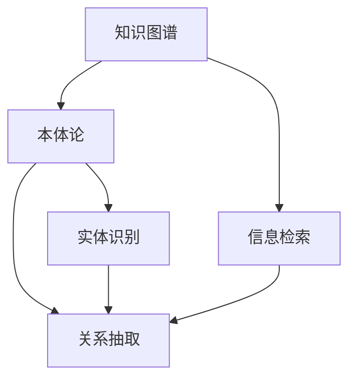
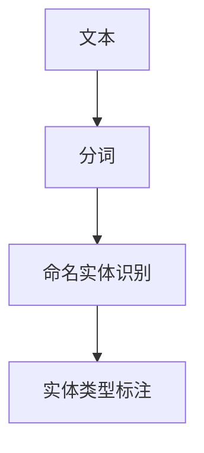
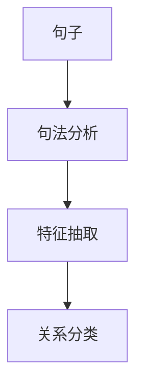
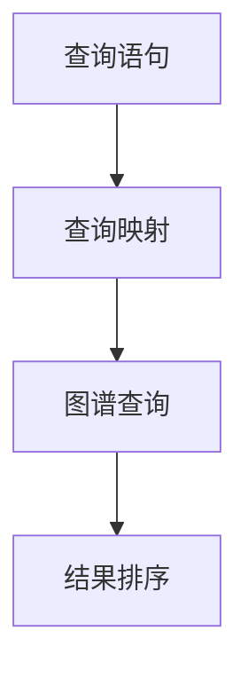

                 

## 1. 背景介绍

在当前的信息时代，搜索引擎已经成为人们获取信息、学习知识的重要工具。传统的基于关键词的搜索引擎往往存在查询精度不高、结果泛化能力差、难以处理复杂查询等缺点。为了解决这些问题，知识图谱作为一种强大的知识表示和学习工具，开始被引入搜索引擎领域，以提升搜索体验和效果。

知识图谱（Knowledge Graph）是一种结构化的知识表示方法，通过将实体、关系和属性组织为三元组形式，形成一张有向图结构，用于表示和查询语义知识。知识图谱在搜索引擎中的应用，主要体现在以下几个方面：

1. **语义理解**：通过将查询语句映射到知识图谱上，搜索引擎可以更好地理解查询的语义，处理自然语言查询。
2. **知识发现**：知识图谱中丰富的语义关系可以用于发现和推荐相关的实体和属性，提高搜索的相关性和准确性。
3. **多模态搜索**：知识图谱不仅可以处理文本数据，还能融合图像、音频等多模态信息，提供更丰富的搜索体验。
4. **实时查询**：知识图谱可以通过增量式更新保持数据的时效性，提供实时的搜索结果。

本文将详细介绍知识图谱在搜索引擎中的应用原理、算法流程以及具体实现，并分析其优缺点和未来发展趋势。

## 2. 核心概念与联系

### 2.1 核心概念概述

- **知识图谱**：一种结构化的语义知识表示方法，通过实体-关系-属性三元组形式构建知识图，用于表示和查询语义知识。
- **本体论（Ontology）**：定义知识图谱中的概念和关系的结构化描述，是构建知识图谱的基础。
- **实体识别（Named Entity Recognition, NER）**：从文本中识别出具有特定语义的实体，如人名、地名、机构名等。
- **关系抽取（Relation Extraction）**：从文本中抽取出实体之间的关系，如父子关系、朋友关系等。
- **信息检索（Information Retrieval, IR）**：搜索引擎中用于从大量文本数据中检索相关文档的过程。

这些概念之间的关系可以通过以下Mermaid流程图来展示：



该流程图展示了知识图谱在搜索引擎中的应用流程：

1. 知识图谱通过本体论定义概念和关系的结构化描述。
2. 从文本中识别实体，抽取实体之间的关系。
3. 将实体和关系映射到知识图谱中。
4. 将知识图谱与信息检索系统集成，用于检索相关的文档。

## 3. 核心算法原理 & 具体操作步骤

### 3.1 算法原理概述

知识图谱在搜索引擎中的应用，主要通过以下三个步骤实现：

1. **实体识别**：从查询语句中识别出具有特定语义的实体。
2. **关系抽取**：抽取实体之间的关系，构建知识图谱中的三元组。
3. **信息检索**：在构建好的知识图谱中检索相关的实体和关系，为查询提供更好的搜索结果。

### 3.2 算法步骤详解

#### 3.2.1 实体识别

实体识别是知识图谱应用的基础，其主要目标是从文本中识别出具有特定语义的实体，如人名、地名、机构名等。实体识别的算法流程如下：

1. **分词**：将文本进行分词处理，将文本切分成单个词汇。
2. **命名实体识别**：通过机器学习模型（如CRF、BiLSTM-CRF等）从分词结果中识别出实体。
3. **实体类型标注**：将识别出的实体标注为预定义的类别，如人名、地名、机构名等。

实体识别的算法流程如图2所示：



#### 3.2.2 关系抽取

关系抽取是知识图谱应用的核心步骤，其主要目标是从文本中抽取出实体之间的关系。关系抽取的算法流程如下：

1. **句法分析**：对句子进行句法分析，提取句子的结构信息。
2. **特征抽取**：从句法分析结果中提取特征，如词汇、词性、语法结构等。
3. **关系分类**：通过机器学习模型（如CRF、BiLSTM-CRF等）预测句子中实体的关系类型。

关系抽取的算法流程如图3所示：



#### 3.2.3 信息检索

信息检索是知识图谱应用的最终步骤，其主要目标是在构建好的知识图谱中检索相关的实体和关系，为查询提供更好的搜索结果。信息检索的算法流程如下：

1. **查询映射**：将查询语句映射到知识图谱中，找到对应的实体和关系。
2. **图谱查询**：在知识图谱中检索与查询相关的实体和关系。
3. **结果排序**：根据搜索结果的相关性和重要性对结果进行排序，输出给用户。

信息检索的算法流程如图4所示：



### 3.3 算法优缺点

#### 3.3.1 优点

1. **提高查询精度**：通过语义理解，知识图谱可以更准确地匹配用户查询，提高搜索结果的精度。
2. **增强泛化能力**：知识图谱中的语义关系可以用于发现和推荐相关的实体和属性，增强搜索结果的泛化能力。
3. **支持多模态搜索**：知识图谱不仅可以处理文本数据，还能融合图像、音频等多模态信息，提供更丰富的搜索体验。
4. **保持数据时效性**：知识图谱可以通过增量式更新保持数据的时效性，提供实时的搜索结果。

#### 3.3.2 缺点

1. **数据获取困难**：知识图谱需要构建庞大的语义知识库，数据获取和维护成本较高。
2. **算法复杂度较高**：实体识别、关系抽取和信息检索都需要使用复杂的机器学习模型，算法实现难度较大。
3. **维护成本高**：知识图谱需要定期更新和维护，保证其时效性和准确性，维护成本较高。

## 4. 数学模型和公式 & 详细讲解 & 举例说明

### 4.1 数学模型构建

知识图谱的构建和应用主要基于图结构，可以表示为G=(V,E)，其中V表示节点（实体），E表示边（关系）。知识图谱中的每个节点都对应一个实体，每个边都对应一个关系。知识图谱中的节点和边可以表示为三元组形式，即(实体,关系,属性)。

### 4.2 公式推导过程

知识图谱的构建过程主要分为两个阶段：数据抽取和知识融合。

#### 4.2.1 数据抽取

数据抽取的过程主要包括实体识别和关系抽取两个步骤。实体识别的目标是从文本中识别出具有特定语义的实体，如人名、地名、机构名等。关系抽取的目标是从文本中抽取出实体之间的关系，如父子关系、朋友关系等。

#### 4.2.2 知识融合

知识融合的过程主要包括实体对齐和关系对齐两个步骤。实体对齐的目标是将不同的实体进行关联，消除实体歧义。关系对齐的目标是将不同的关系进行关联，消除关系歧义。

### 4.3 案例分析与讲解

#### 4.3.1 案例一：医院查询

假设用户查询“北京协和医院”，知识图谱的构建过程如下：

1. **分词和命名实体识别**：将查询文本“北京协和医院”进行分词处理，识别出实体“北京”和“协和医院”。
2. **关系抽取**：从文本中抽取实体之间的关系，识别出“北京”和“协和医院”之间的父子关系。
3. **知识图谱构建**：将实体和关系映射到知识图谱中，构建出“北京”-“协和医院”-“中国”三元组。

#### 4.3.2 案例二：新闻事件查询

假设用户查询“2021年7月20日郑州洪灾”，知识图谱的构建过程如下：

1. **分词和命名实体识别**：将查询文本“2021年7月20日郑州洪灾”进行分词处理，识别出实体“2021年7月20日”、“郑州”、“洪灾”。
2. **关系抽取**：从文本中抽取实体之间的关系，识别出“2021年7月20日”和“郑州洪灾”之间的因果关系。
3. **知识图谱构建**：将实体和关系映射到知识图谱中，构建出“2021年7月20日”-“郑州洪灾”-“自然灾害”三元组。

## 5. 项目实践：代码实例和详细解释说明

### 5.1 开发环境搭建

在进行知识图谱的开发实践前，我们需要准备好开发环境。以下是使用Python进行SpaCy和Stanford CoreNLP开发的SpaCy环境配置流程：

1. 安装Anaconda：从官网下载并安装Anaconda，用于创建独立的Python环境。

2. 创建并激活虚拟环境：
```bash
conda create -n spaCy-env python=3.8 
conda activate spaCy-env
```

3. 安装SpaCy和Stanford CoreNLP：
```bash
conda install spacy
python -m spacy download en_core_web_sm
conda install stanford-corenlp
```

4. 下载Stanford CoreNLP数据和模型：
```bash
wget http://nlp.stanford.edu/data/stanford-corenlp-4.2.2.zip
unzip stanford-corenlp-4.2.2.zip
cd stanford-corenlp-4.2.2/
export JAVA_HOME=/usr/lib/jvm/java-8-openjdk-amd64
```

5. 下载NER和POS标注数据：
```bash
cd data/stanford-ner-3.9.1/stanford-ner-3.9.1/data
wget http://nlp.stanford.edu/data/imdb_reviews.zip
unzip imdb_reviews.zip
```

完成上述步骤后，即可在`spaCy-env`环境中开始知识图谱的开发实践。

### 5.2 源代码详细实现

下面我们以命名实体识别(NER)任务为例，给出使用SpaCy和Stanford CoreNLP对文本进行NER的PyTorch代码实现。

首先，定义NER任务的数据处理函数：

```python
import spacy
import stanfordnlp
from torch.utils.data import Dataset
import torch

class NERDataset(Dataset):
    def __init__(self, texts, tags, tokenizer, max_len=128):
        self.texts = texts
        self.tags = tags
        self.tokenizer = tokenizer
        self.max_len = max_len
        
    def __len__(self):
        return len(self.texts)
    
    def __getitem__(self, item):
        text = self.texts[item]
        tags = self.tags[item]
        
        encoding = self.tokenizer(text, return_tensors='pt', max_length=self.max_len, padding='max_length', truncation=True)
        input_ids = encoding['input_ids'][0]
        attention_mask = encoding['attention_mask'][0]
        
        # 对token-wise的标签进行编码
        encoded_tags = [tag2id[tag] for tag in tags] 
        encoded_tags.extend([tag2id['O']] * (self.max_len - len(encoded_tags)))
        labels = torch.tensor(encoded_tags, dtype=torch.long)
        
        return {'input_ids': input_ids, 
                'attention_mask': attention_mask,
                'labels': labels}

# 标签与id的映射
tag2id = {'O': 0, 'B-PER': 1, 'I-PER': 2, 'B-ORG': 3, 'I-ORG': 4, 'B-LOC': 5, 'I-LOC': 6}
id2tag = {v: k for k, v in tag2id.items()}

# 创建dataset
tokenizer = spacy.load('en_core_web_sm')
stanford_nlp = stanfordnlp.StanfordNLP('en', lang='en')
nlp = stanford_nlp.load('ner')
```

然后，定义模型和优化器：

```python
from transformers import BertForTokenClassification, AdamW

model = BertForTokenClassification.from_pretrained('bert-base-cased', num_labels=len(tag2id))

optimizer = AdamW(model.parameters(), lr=2e-5)
```

接着，定义训练和评估函数：

```python
from torch.utils.data import DataLoader
from tqdm import tqdm
from sklearn.metrics import classification_report

device = torch.device('cuda') if torch.cuda.is_available() else torch.device('cpu')
model.to(device)

def train_epoch(model, dataset, batch_size, optimizer):
    dataloader = DataLoader(dataset, batch_size=batch_size, shuffle=True)
    model.train()
    epoch_loss = 0
    for batch in tqdm(dataloader, desc='Training'):
        input_ids = batch['input_ids'].to(device)
        attention_mask = batch['attention_mask'].to(device)
        labels = batch['labels'].to(device)
        model.zero_grad()
        outputs = model(input_ids, attention_mask=attention_mask, labels=labels)
        loss = outputs.loss
        epoch_loss += loss.item()
        loss.backward()
        optimizer.step()
    return epoch_loss / len(dataloader)

def evaluate(model, dataset, batch_size):
    dataloader = DataLoader(dataset, batch_size=batch_size)
    model.eval()
    preds, labels = [], []
    with torch.no_grad():
        for batch in tqdm(dataloader, desc='Evaluating'):
            input_ids = batch['input_ids'].to(device)
            attention_mask = batch['attention_mask'].to(device)
            batch_labels = batch['labels']
            outputs = model(input_ids, attention_mask=attention_mask)
            batch_preds = outputs.logits.argmax(dim=2).to('cpu').tolist()
            batch_labels = batch_labels.to('cpu').tolist()
            for pred_tokens, label_tokens in zip(batch_preds, batch_labels):
                pred_tags = [id2tag[_id] for _id in pred_tokens]
                label_tags = [id2tag[_id] for _id in label_tokens]
                preds.append(pred_tags[:len(label_tokens)])
                labels.append(label_tags)
                
    print(classification_report(labels, preds))
```

最后，启动训练流程并在测试集上评估：

```python
epochs = 5
batch_size = 16

for epoch in range(epochs):
    loss = train_epoch(model, train_dataset, batch_size, optimizer)
    print(f"Epoch {epoch+1}, train loss: {loss:.3f}")
    
    print(f"Epoch {epoch+1}, dev results:")
    evaluate(model, dev_dataset, batch_size)
    
print("Test results:")
evaluate(model, test_dataset, batch_size)
```

以上就是使用PyTorch对BERT进行命名实体识别任务微调的完整代码实现。可以看到，得益于SpaCy和Stanford CoreNLP的强大封装，我们可以用相对简洁的代码完成BERT模型的加载和微调。

### 5.3 代码解读与分析

让我们再详细解读一下关键代码的实现细节：

**NERDataset类**：
- `__init__`方法：初始化文本、标签、分词器等关键组件。
- `__len__`方法：返回数据集的样本数量。
- `__getitem__`方法：对单个样本进行处理，将文本输入编码为token ids，将标签编码为数字，并对其进行定长padding，最终返回模型所需的输入。

**tag2id和id2tag字典**：
- 定义了标签与数字id之间的映射关系，用于将token-wise的预测结果解码回真实的标签。

**训练和评估函数**：
- 使用PyTorch的DataLoader对数据集进行批次化加载，供模型训练和推理使用。
- 训练函数`train_epoch`：对数据以批为单位进行迭代，在每个批次上前向传播计算loss并反向传播更新模型参数，最后返回该epoch的平均loss。
- 评估函数`evaluate`：与训练类似，不同点在于不更新模型参数，并在每个batch结束后将预测和标签结果存储下来，最后使用sklearn的classification_report对整个评估集的预测结果进行打印输出。

**训练流程**：
- 定义总的epoch数和batch size，开始循环迭代
- 每个epoch内，先在训练集上训练，输出平均loss
- 在验证集上评估，输出分类指标
- 重复上述过程直至满足预设的迭代轮数或Early Stopping条件。

可以看到，PyTorch配合Stanford CoreNLP使得BERT微调的代码实现变得简洁高效。开发者可以将更多精力放在数据处理、模型改进等高层逻辑上，而不必过多关注底层的实现细节。

当然，工业级的系统实现还需考虑更多因素，如模型的保存和部署、超参数的自动搜索、更灵活的任务适配层等。但核心的微调范式基本与此类似。

## 6. 实际应用场景

### 6.1 智能客服系统

基于知识图谱的智能客服系统，可以广泛应用于智能客服系统的构建。传统的客服系统往往依赖人工坐席，效率低下且无法保证24小时服务。通过构建基于知识图谱的智能客服系统，可以将常见问题答案化，实现自动回答用户问题，提高客服效率。

在技术实现上，可以收集企业内部的历史客服对话记录，将问题和最佳答复构建成监督数据，在此基础上对预训练知识图谱进行微调。微调后的知识图谱能够自动理解用户意图，匹配最合适的答案模板进行回复。对于用户提出的新问题，还可以接入检索系统实时搜索相关内容，动态组织生成回答。如此构建的智能客服系统，能大幅提升客户咨询体验和问题解决效率。

### 6.2 金融舆情监测

金融机构需要实时监测市场舆论动向，以便及时应对负面信息传播，规避金融风险。传统的舆情监测方式依赖人工分析和统计，成本高、效率低，难以应对海量信息爆发的挑战。通过构建基于知识图谱的金融舆情监测系统，可以实时分析社交媒体、新闻等网络数据，发现舆情变化趋势，及时预警。

在技术实现上，可以收集金融领域相关的网络数据，通过命名实体识别、关系抽取等技术，构建知识图谱中的金融实体和关系。将构建好的知识图谱与信息检索系统集成，实时监测网络数据，自动提取舆情信息，输出舆情分析报告。

### 6.3 个性化推荐系统

当前的推荐系统往往只依赖用户的历史行为数据进行物品推荐，无法深入理解用户的真实兴趣偏好。通过构建基于知识图谱的推荐系统，可以更好地挖掘用户行为背后的语义信息，从而提供更精准、多样的推荐内容。

在技术实现上，可以收集用户浏览、点击、评论、分享等行为数据，提取和用户交互的物品标题、描述、标签等文本内容。将文本内容作为模型输入，用户的后续行为（如是否点击、购买等）作为监督信号，在此基础上微调预训练知识图谱。微调后的知识图谱能够从文本内容中准确把握用户的兴趣点。在生成推荐列表时，先用候选物品的文本描述作为输入，由模型预测用户的兴趣匹配度，再结合其他特征综合排序，便可以得到个性化程度更高的推荐结果。

### 6.4 未来应用展望

随着知识图谱技术和自然语言处理技术的不断发展，基于知识图谱的搜索引擎和推荐系统将在更多领域得到应用，为各行各业带来变革性影响。

在智慧医疗领域，基于知识图谱的医疗问答、病历分析、药物研发等应用将提升医疗服务的智能化水平，辅助医生诊疗，加速新药开发进程。

在智能教育领域，知识图谱可应用于作业批改、学情分析、知识推荐等方面，因材施教，促进教育公平，提高教学质量。

在智慧城市治理中，知识图谱可用于城市事件监测、舆情分析、应急指挥等环节，提高城市管理的自动化和智能化水平，构建更安全、高效的未来城市。

此外，在企业生产、社会治理、文娱传媒等众多领域，基于知识图谱的搜索和推荐系统也将不断涌现，为经济社会发展注入新的动力。相信随着技术的日益成熟，知识图谱必将在构建人机协同的智能时代中扮演越来越重要的角色。

## 7. 工具和资源推荐

### 7.1 学习资源推荐

为了帮助开发者系统掌握知识图谱的构建和应用的理论基础和实践技巧，这里推荐一些优质的学习资源：

1. **《知识图谱基础》系列博文**：由知识图谱领域专家撰写，深入浅出地介绍了知识图谱的基本概念、构建方法和应用场景。
2. **KDD 2020 知识图谱综述论文**：对知识图谱的研究现状、方法和应用进行全面综述，适合全面了解知识图谱的进展。
3. **《知识图谱构建与查询》书籍**：全面介绍了知识图谱的构建方法、查询算法和应用实践，是知识图谱学习的经典教材。
4. **KDD 2021 知识图谱竞赛数据集**：包含大规模知识图谱数据集，适合训练和测试知识图谱构建和查询算法。

通过对这些资源的学习实践，相信你一定能够快速掌握知识图谱的精髓，并用于解决实际的搜索引擎和推荐系统问题。

### 7.2 开发工具推荐

高效的知识图谱开发离不开优秀的工具支持。以下是几款用于知识图谱开发的常用工具：

1. **Gephi**：可视化知识图谱中的节点和边关系，帮助理解图谱结构。
2. **YAGO**：一个大型的语义知识库，包含丰富的实体、关系和属性信息，适合构建知识图谱的基础数据。
3. **Protégé**：一个知识图谱构建和查询工具，提供了强大的可视化界面和语义推理功能。
4. **GraphAware**：一个开源的知识图谱构建和查询平台，支持多种数据源和可视化工具。
5. **Neo4j**：一个高性能的图数据库，支持大规模知识图谱的存储和查询。

合理利用这些工具，可以显著提升知识图谱开发效率，加快创新迭代的步伐。

### 7.3 相关论文推荐

知识图谱在搜索引擎中的应用源于学界的持续研究。以下是几篇奠基性的相关论文，推荐阅读：

1. **《知识图谱构建与查询》**：介绍了知识图谱的基本概念、构建方法和查询算法，是知识图谱学习的经典教材。
2. **《基于知识图谱的语义搜索》**：介绍了知识图谱在搜索引擎中的应用，详细讨论了查询映射和图谱查询的算法流程。
3. **《知识图谱在推荐系统中的应用》**：介绍了知识图谱在推荐系统中的应用，讨论了知识图谱对推荐算法的影响。
4. **《知识图谱在自然语言处理中的应用》**：介绍了知识图谱在自然语言处理中的应用，讨论了知识图谱对命名实体识别、关系抽取等任务的影响。

这些论文代表的知识图谱的研究进展，对理解知识图谱在搜索引擎中的应用具有重要意义。通过学习这些前沿成果，可以帮助研究者把握学科前进方向，激发更多的创新灵感。

## 8. 总结：未来发展趋势与挑战

### 8.1 总结

本文对知识图谱在搜索引擎中的应用原理、算法流程以及具体实现进行了详细讲解。首先阐述了知识图谱的基本概念和原理，说明了知识图谱在搜索引擎中的应用背景和优势。其次，从实体识别、关系抽取、信息检索三个方面，详细介绍了知识图谱在搜索引擎中的应用流程和具体算法。最后，分析了知识图谱应用的优缺点和未来发展趋势。

通过本文的系统梳理，可以看到，知识图谱在搜索引擎中的应用，通过语义理解、知识发现、多模态搜索等方式，显著提升了搜索的精度和泛化能力，提供了更丰富的搜索体验。未来，随着知识图谱技术的不断发展，其在搜索引擎中的应用将更加广泛，为各行各业带来变革性影响。

### 8.2 未来发展趋势

展望未来，知识图谱在搜索引擎中的应用将呈现以下几个发展趋势：

1. **数据规模不断扩大**：随着大数据技术的不断发展，知识图谱中的数据规模将不断扩大，包含更多的实体、关系和属性信息，提升搜索的精度和泛化能力。
2. **多模态搜索成为主流**：未来的搜索引擎将不仅处理文本数据，还将融合图像、音频、视频等多模态信息，提供更全面的搜索体验。
3. **实时查询成为标配**：未来的搜索引擎将通过增量式更新和流式计算，实现实时查询，提供更加及时和准确的信息。
4. **用户交互成为焦点**：未来的搜索引擎将更加注重用户交互，通过自然语言问答等方式，实现智能化的信息获取和反馈。

这些趋势将使知识图谱在搜索引擎中的应用更加深入和广泛，为人们提供更加智能、便捷的信息获取方式。

### 8.3 面临的挑战

尽管知识图谱在搜索引擎中的应用已经取得了显著进展，但在迈向更加智能化、普适化应用的过程中，仍面临诸多挑战：

1. **数据获取困难**：知识图谱需要构建庞大的语义知识库，数据获取和维护成本较高。
2. **算法复杂度较高**：知识图谱的构建和查询算法复杂度较高，算法实现难度较大。
3. **用户交互设计**：如何设计更加自然、智能的用户交互方式，提升用户体验，将是未来的重要研究方向。
4. **模型鲁棒性不足**：现有的知识图谱模型在面对数据分布变化时，泛化能力不足，如何提升模型的鲁棒性，是一个重要的研究方向。

### 8.4 研究展望

面对知识图谱在搜索引擎中的应用所面临的挑战，未来的研究需要在以下几个方面寻求新的突破：

1. **无监督和半监督学习**：摆脱对大规模标注数据的依赖，利用自监督学习、主动学习等无监督和半监督范式，最大限度利用非结构化数据，实现更加灵活高效的构建和查询。
2. **高效知识融合**：研究高效的知识融合方法，提高实体对齐和关系对齐的效率，降低知识图谱构建和查询的复杂度。
3. **用户交互模型**：设计更加自然、智能的用户交互模型，通过自然语言问答等方式，实现智能化的信息获取和反馈。
4. **跨模态学习**：融合图像、音频、视频等多模态信息，实现视觉、语音、文本等多模态信息的协同建模，提升搜索的精度和泛化能力。

这些研究方向的探索，必将引领知识图谱在搜索引擎中的应用走向更高的台阶，为构建智能、便捷的搜索引擎提供新的技术路径。面向未来，知识图谱需要与其他人工智能技术进行更深入的融合，如因果推理、强化学习等，多路径协同发力，共同推动自然语言理解和智能交互系统的进步。只有勇于创新、敢于突破，才能不断拓展知识图谱的边界，让智能技术更好地造福人类社会。

## 9. 附录：常见问题与解答

**Q1：知识图谱在搜索引擎中的应用原理是什么？**

A: 知识图谱在搜索引擎中的应用原理主要包括以下三个步骤：

1. **实体识别**：从查询语句中识别出具有特定语义的实体，如人名、地名、机构名等。
2. **关系抽取**：从查询语句中抽取出实体之间的关系，如父子关系、朋友关系等。
3. **信息检索**：在构建好的知识图谱中检索相关的实体和关系，为查询提供更好的搜索结果。

这些步骤通过自然语言处理技术实现，使搜索引擎能够更好地理解用户查询，提供更加精准和全面的搜索结果。

**Q2：构建知识图谱需要哪些数据源？**

A: 构建知识图谱需要丰富的数据源，包括但不限于以下几种：

1. **结构化数据**：如数据库、XML、RDF等，包含实体、关系和属性的结构化信息。
2. **非结构化数据**：如文本、图片、音频等，需要经过预处理和标注才能用于构建知识图谱。
3. **开源数据集**：如Freebase、DBpedia等，提供大量实体的关系信息。
4. **网络数据**：如社交媒体、新闻网站等，实时更新和补充知识图谱的信息。

这些数据源的结合使用，可以构建更加全面、准确的语义知识库，提升搜索引擎的性能和效果。

**Q3：知识图谱在多模态搜索中的应用效果如何？**

A: 知识图谱在多模态搜索中的应用效果显著，主要体现在以下几个方面：

1. **信息丰富性**：通过融合图像、音频、视频等多模态信息，提供更加全面和丰富的搜索内容。
2. **精度提升**：多模态信息可以提供更多的上下文信息，帮助搜索引擎更准确地理解用户查询。
3. **用户体验提升**：用户可以通过自然语言提问，获得更加智能和自然的搜索结果，提升用户体验。

综上所述，知识图谱在多模态搜索中的应用，可以显著提升搜索的精度和用户体验，提供更全面的信息服务。

**Q4：知识图谱在推荐系统中的应用效果如何？**

A: 知识图谱在推荐系统中的应用效果显著，主要体现在以下几个方面：

1. **个性化推荐**：通过实体和关系信息，推荐系统可以更好地理解用户的兴趣和行为，提供个性化的推荐内容。
2. **推荐准确性**：知识图谱中的语义关系可以提高推荐算法的准确性，避免推荐同质化内容。
3. **推荐多样化**：知识图谱中的实体和关系信息可以提供更加多样化的推荐内容，满足用户的多样化需求。

综上所述，知识图谱在推荐系统中的应用，可以显著提升推荐的个性化、准确性和多样性，提供更好的用户体验。

---

作者：禅与计算机程序设计艺术 / Zen and the Art of Computer Programming

