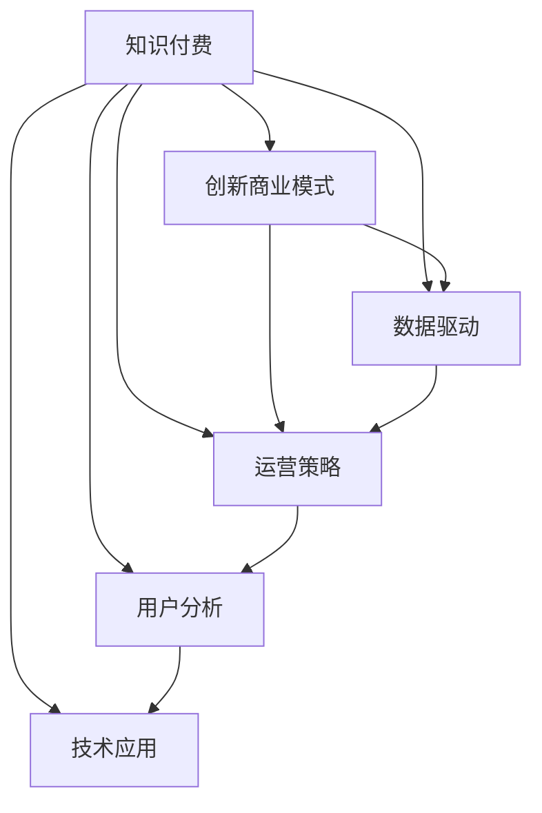
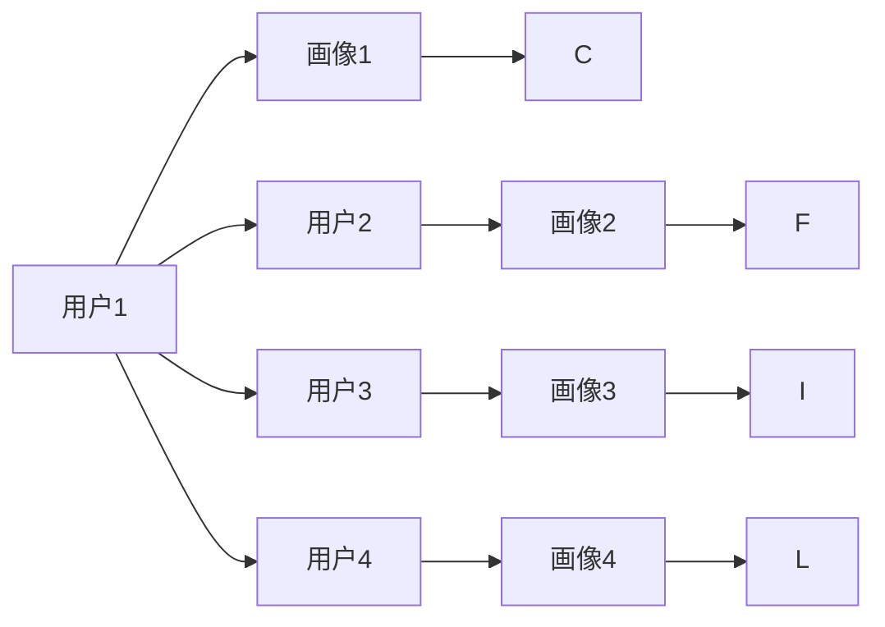
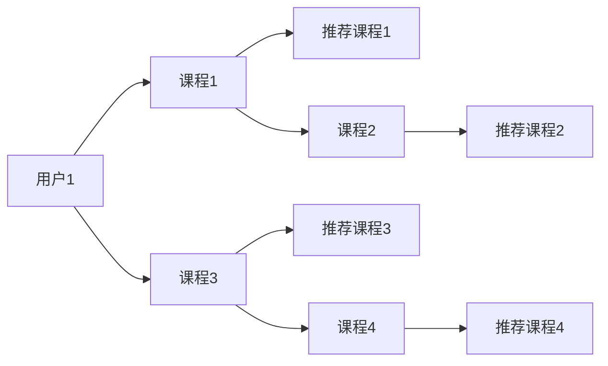

                 

# 知识经济时代下的知识付费创新商业模式运营

> 关键词：知识付费, 创新商业模式, 数据驱动, 运营策略, 用户分析, 技术应用

## 1. 背景介绍

### 1.1 问题由来
进入21世纪以来，互联网和移动通信技术的飞速发展，推动了信息传播方式的革命性变化。知识经济时代，以数据和知识为核心资产的生产、流通和消费方式正在重塑整个产业结构。知识付费作为知识经济时代的新兴商业模式，通过向用户提供高质量的内容，如在线课程、专家咨询、专业文档等，以付费订阅或单次购买的方式实现价值变现。

知识付费的兴起，深刻影响了教育、出版、媒体、咨询等行业，催生了大量内容生产者、平台运营商和消费者。与此同时，如何构建一个可持续、高效、满足用户需求的知识付费生态系统，成为业界亟需解决的重要问题。

### 1.2 问题核心关键点
知识付费商业模式的核心在于将知识资源转化为商品或服务，通过付费机制保障内容质量和平台盈利。而实现这一目标的关键在于：
1. 内容生产与用户需求的精准匹配。
2. 平台的商业模式设计。
3. 数据驱动的运营策略。
4. 技术应用支持平台运行效率。
5. 用户行为分析和预测。
6. 平台盈利模式的多元化。

本文聚焦于知识付费创新商业模式的运营，从内容匹配、商业模式、运营策略、技术应用等多个维度，探讨知识付费平台如何通过数据驱动和创新技术，实现高质量内容的精准推送，提升用户粘性，增加平台收入。

## 2. 核心概念与联系

### 2.1 核心概念概述

为更好地理解知识付费平台的运营策略，本节将介绍几个密切相关的核心概念：

- 知识付费(Content Subscription)：指通过付费机制为用户提供高质量知识内容，如在线课程、专业文档、专家咨询等。平台需确保内容的专业性和可靠性，以吸引和留住用户。
- 创新商业模式(Innovative Business Model)：指突破传统商业模式，创造新的价值分配和交换方式。知识付费平台通过数据驱动、个性化推荐、用户订阅等方式实现商业变现。
- 数据驱动(Data-Driven)：指利用大数据技术分析用户行为、需求和偏好，指导内容生产和运营策略。
- 运营策略(Operational Strategy)：指平台通过精准定位、用户画像分析、推荐系统优化等手段提升用户体验和平台收益。
- 用户分析(User Analysis)：指对用户行为、偏好、付费习惯等进行深入分析，以指导内容和运营策略的设计。
- 技术应用(Technology Application)：指采用人工智能、云计算、大数据等技术手段，支持平台的高效运营和管理。

这些核心概念之间的逻辑关系可以通过以下Mermaid流程图来展示：



这个流程图展示了这个概念框架：

1. 知识付费平台的核心功能是通过付费机制提供高质量内容。
2. 创新商业模式为平台提供了多维度的收入来源。
3. 数据驱动使得平台能够精准分析和预测用户需求。
4. 运营策略指导内容生产和平台运营，提升用户体验。
5. 用户分析揭示了用户行为和偏好，为平台优化运营策略提供支持。
6. 技术应用提供了高效管理和运营的保障。

这些概念共同构成了知识付费平台的运营框架，使得平台能够更精准地推送内容，提高用户粘性，实现商业价值的最大化。

## 3. 核心算法原理 & 具体操作步骤
### 3.1 算法原理概述

知识付费平台的运营，从本质上是一个基于数据的决策支持系统。通过对用户行为数据的分析，平台可以精准定位用户需求，设计个性化的内容推荐策略，并通过运营策略调整，最大化用户粘性和平台收入。这一过程的核心算法包括：

- 用户画像分析(User Profiling)：通过分析用户的历史行为、偏好、付费习惯等数据，构建用户画像，指导内容生产和推荐策略。
- 推荐系统(Recommendation System)：基于用户画像和内容特征，构建推荐模型，推荐最适合用户的内容。
- 运营策略优化(Operational Strategy Optimization)：通过A/B测试、多臂老虎机等方法，不断优化平台运营策略，提升用户体验和平台收益。
- 用户行为预测(User Behavior Prediction)：利用机器学习算法，预测用户未来的行为，如购买倾向、流失风险等，指导平台的决策。

这些算法构成了一个闭环的决策支持系统，确保平台能够持续优化内容和运营策略，满足用户需求，提升平台收益。

### 3.2 算法步骤详解

知识付费平台的运营，涉及多个核心步骤，具体如下：

**Step 1: 数据收集与预处理**
- 从平台的数据库中提取用户行为数据，包括浏览历史、点击次数、购买记录等。
- 对数据进行清洗和预处理，去除噪音和异常值，确保数据的质量和一致性。

**Step 2: 用户画像分析**
- 利用机器学习算法，如K-means聚类、TF-IDF等，对用户行为数据进行分析，提取用户特征。
- 根据用户特征，将用户分为不同的用户画像，以便后续的推荐和运营策略设计。

**Step 3: 推荐系统构建**
- 基于用户画像和内容特征，构建推荐模型，如协同过滤、内容协同过滤等。
- 利用在线学习算法，如梯度下降、随机梯度下降等，不断优化推荐模型，提升推荐精度。
- 引入多样性、新颖性、公平性等指标，优化推荐算法，确保推荐结果的多样性和质量。

**Step 4: 运营策略优化**
- 设计A/B测试方案，比较不同的运营策略，如价格策略、内容推送策略等。
- 利用多臂老虎机算法，优化运营策略，最大化平台收益。
- 定期分析运营数据，调整策略，确保平台的持续优化和改进。

**Step 5: 用户行为预测**
- 利用机器学习算法，如随机森林、神经网络等，对用户未来的行为进行预测。
- 结合预测结果和实时数据，动态调整推荐策略，提高用户的满意度和平台收益。

**Step 6: 效果评估与迭代**
- 利用A/B测试和多臂老虎机算法，评估不同策略的效果，优化推荐和运营策略。
- 定期分析运营数据，发现问题，及时调整策略，确保平台的长期健康发展。

### 3.3 算法优缺点

基于数据驱动的运营算法具有以下优点：
1. 精准定位用户需求：通过用户画像和推荐系统，平台可以精准推送用户感兴趣的内容。
2. 提升用户体验：个性化推荐和优化运营策略，提升用户的粘性和满意度。
3. 增加平台收益：多渠道付费机制和动态定价策略，最大化平台收益。
4. 数据驱动决策：数据驱动的决策支持系统，确保平台运营的科学性和可靠性。

同时，该方法也存在一定的局限性：
1. 数据隐私问题：用户的隐私数据需要保护，避免数据泄露和滥用。
2. 数据质量问题：数据收集和预处理需要高质量的数据源和数据清洗技术。
3. 模型复杂性：复杂的推荐和运营策略设计，需要强大的计算资源和技术支持。
4. 用户多样性：不同用户群体的需求差异大，需要多维度、个性化的策略设计。

尽管存在这些局限性，但就目前而言，基于数据驱动的运营算法仍是最主流的方式。未来相关研究的重点在于如何进一步优化算法，降低对数据和计算的依赖，提高算法的可解释性和用户信任度。

### 3.4 算法应用领域

知识付费平台的运营算法，已经在多个领域得到了广泛的应用，例如：

- 在线教育：如Coursera、Udacity等平台，通过个性化的课程推荐和定价策略，提升用户购买意愿。
- 专业文档和咨询：如法律、医疗等领域的知识付费平台，通过精准推送相关内容和专家服务，满足用户的专业需求。
- 多媒体内容：如视频、音频内容付费平台，通过个性化的内容推荐和订阅策略，提升用户粘性。

除了上述这些经典应用外，知识付费平台还创新性地应用到了更多场景中，如企业培训、个人成长、技能提升等，为知识内容的消费提供了新的渠道和方式。

## 4. 数学模型和公式 & 详细讲解 & 举例说明
### 4.1 数学模型构建

知识付费平台的运营算法，涉及多个数学模型和公式，以下对其中几个关键模型进行详细介绍：

#### 4.1.1 用户画像模型

用户画像模型通过对用户行为数据的分析和建模，构建用户画像，以便进行个性化的内容推荐和运营策略设计。以K-means聚类算法为例，其数学模型如下：

$$
\min_{C} \sum_{x \in D} ||x - \mu_k||^2, \quad s.t. \sum_{k} |C_k| = |D|, \quad C_k \in D
$$

其中，$D$ 为样本数据集，$C$ 为聚类中心，$k$ 为聚类数。

#### 4.1.2 推荐系统模型

推荐系统模型利用用户画像和内容特征，构建推荐模型，以提升推荐精度和多样性。以协同过滤算法为例，其基本模型如下：

$$
\hat{y} = \sum_{i=1}^n \alpha_i \times (X_i \times Y_i)
$$

其中，$\hat{y}$ 为推荐值，$n$ 为样本数，$\alpha_i$ 为权重，$X_i$ 为用户特征，$Y_i$ 为内容特征。

### 4.2 公式推导过程

以下是几个关键公式的推导过程，以便更深入地理解知识付费平台的运营算法。

#### 4.2.1 K-means聚类算法

K-means聚类算法的基本思想是将样本数据集分成K个簇，使得簇内的样本相似度最大化，簇间的相似度最小化。其基本公式如下：

$$
\min_{C} \sum_{x \in D} ||x - \mu_k||^2, \quad s.t. \sum_{k} |C_k| = |D|, \quad C_k \in D
$$

其中，$D$ 为样本数据集，$C$ 为聚类中心，$k$ 为聚类数。

#### 4.2.2 协同过滤推荐算法

协同过滤推荐算法基于用户和内容的相似度，进行推荐。其基本公式如下：

$$
\hat{y} = \sum_{i=1}^n \alpha_i \times (X_i \times Y_i)
$$

其中，$\hat{y}$ 为推荐值，$n$ 为样本数，$\alpha_i$ 为权重，$X_i$ 为用户特征，$Y_i$ 为内容特征。

#### 4.2.3 多臂老虎机算法

多臂老虎机算法用于优化运营策略，其基本公式如下：

$$
k_{next} = \arg\max_k \frac{\pi_k}{Q_k}, \quad \pi_k = \frac{C_k}{N_k}, \quad Q_k = \frac{C_k + \varepsilon}{N_k + \delta}
$$

其中，$k$ 为选择的运营策略，$\pi_k$ 为策略的点击率，$Q_k$ 为策略的平均点击率估计，$C_k$ 为策略的点击次数，$N_k$ 为策略的展示次数，$\varepsilon$ 和 $\delta$ 为正则化参数。

### 4.3 案例分析与讲解

#### 4.3.1 用户画像案例

某在线教育平台收集了用户的历史行为数据，包括课程浏览、学习时长、评分等。通过K-means聚类算法，平台将用户分为不同画像，如下所示：



画像1的用户喜欢数学和计算机科学课程，画像2的用户偏好语言学和历史，画像3的用户关注商业和经济，画像4的用户对艺术和文化感兴趣。

平台根据用户画像，推荐相应的课程内容，提升用户满意度。例如，画像2的用户在浏览英语课程时，平台推荐相关历史和文化课程，满足其综合需求。

#### 4.3.2 推荐系统案例

某知识付费平台收集了用户和课程的评分数据，通过协同过滤算法，平台为用户推荐了相关课程，如下所示：



用户1对课程1的评分较高，同时对课程4的评分较低。平台利用协同过滤算法，推荐课程3和推荐课程2，满足用户对相关课程的期望。

## 5. 项目实践：代码实例和详细解释说明
### 5.1 开发环境搭建

在进行知识付费平台的运营算法实践前，我们需要准备好开发环境。以下是使用Python进行项目开发的环境配置流程：

1. 安装Anaconda：从官网下载并安装Anaconda，用于创建独立的Python环境。

2. 创建并激活虚拟环境：
```bash
conda create -n pytorch-env python=3.8 
conda activate pytorch-env
```

3. 安装Python及常用库：
```bash
conda install numpy pandas scikit-learn matplotlib tqdm jupyter notebook ipython
```

4. 安装TensorFlow和PyTorch：
```bash
conda install tensorflow torch torchvision torchaudio cudatoolkit=11.1 -c pytorch -c conda-forge
```

5. 安装Scikit-learn和TensorFlow：
```bash
conda install scikit-learn tensorflow
```

6. 安装Keras：
```bash
pip install keras
```

完成上述步骤后，即可在`pytorch-env`环境中开始项目实践。

### 5.2 源代码详细实现

以下是使用TensorFlow和Keras实现知识付费平台推荐系统的代码实现。

首先，定义数据处理函数：

```python
import tensorflow as tf
from tensorflow.keras.preprocessing import sequence
from tensorflow.keras.models import Sequential
from tensorflow.keras.layers import Dense, Embedding, LSTM

def load_data():
    # 加载用户数据和课程数据
    user_data = ...
    course_data = ...
    return user_data, course_data
```

然后，定义模型结构：

```python
def build_model(input_shape, output_shape):
    model = Sequential()
    model.add(Embedding(input_dim=10000, output_dim=100, input_length=50))
    model.add(LSTM(100, dropout=0.2, recurrent_dropout=0.2))
    model.add(Dense(output_shape, activation='softmax'))
    return model
```

接着，定义训练和评估函数：

```python
def train_model(model, user_data, course_data):
    model.compile(loss='categorical_crossentropy', optimizer='adam', metrics=['accuracy'])
    history = model.fit(user_data, course_data, epochs=10, batch_size=32, validation_split=0.2)
    return history

def evaluate_model(model, user_data, course_data):
    scores = model.evaluate(user_data, course_data, verbose=0)
    print("Test loss:", scores[0])
    print("Test accuracy:", scores[1])
```

最后，启动训练流程并在测试集上评估：

```python
user_data, course_data = load_data()
model = build_model(user_data.shape[1], course_data.shape[1])
history = train_model(model, user_data, course_data)
evaluate_model(model, user_data, course_data)
```

以上就是使用TensorFlow和Keras进行知识付费平台推荐系统的完整代码实现。可以看到，Keras提供了高度抽象化的模型定义接口，使得模型的构建和训练过程简洁高效。

### 5.3 代码解读与分析

让我们再详细解读一下关键代码的实现细节：

**load_data函数**：
- 定义用户数据和课程数据的加载函数，数据预处理，包括归一化、one-hot编码等。

**build_model函数**：
- 定义推荐模型结构，包括嵌入层、LSTM层和全连接层。
- 嵌入层将用户和课程ID映射为向量，LSTM层对用户行为进行建模，全连接层输出推荐结果。

**train_model函数**：
- 定义模型编译和训练过程，采用交叉熵损失和Adam优化器，使用数据集进行训练和验证。

**evaluate_model函数**：
- 定义模型评估过程，计算损失和精度，输出评估结果。

**训练流程**：
- 加载数据集，构建模型，训练模型，评估模型。

可以看到，TensorFlow和Keras使得知识付费平台的推荐系统代码实现变得简洁高效。开发者可以将更多精力放在模型优化和算法改进上，而不必过多关注底层的实现细节。

当然，工业级的系统实现还需考虑更多因素，如模型的保存和部署、超参数的自动搜索、更灵活的任务适配层等。但核心的推荐范式基本与此类似。

## 6. 实际应用场景
### 6.1 智能教育平台

智能教育平台是知识付费的重要应用场景之一，通过个性化的课程推荐和动态定价策略，提升教育质量和学习效果。

在技术实现上，平台可以收集用户的学习历史、考试成绩、学习时长等数据，构建用户画像和课程画像。利用协同过滤算法，平台可以为每个用户推荐适合的课程，同时根据用户的付费行为和课程评价，动态调整课程价格。平台还可以通过学习曲线分析，预测用户的流失风险，及时进行挽留。

### 6.2 企业培训平台

企业培训平台通过知识付费为员工提供专业的培训课程和知识资源，提升员工技能和职业素养。

平台可以收集员工的培训历史、技能评估、学习反馈等数据，构建员工画像和课程画像。利用推荐算法，平台可以为每个员工推荐适合的培训课程，同时根据员工的培训效果和反馈，动态调整课程内容和定价。平台还可以通过绩效分析，预测员工的成长潜力，进行有针对性的培训。

### 6.3 在线咨询平台

在线咨询平台通过知识付费提供专业咨询服务和解决方案，满足用户的专业需求。

平台可以收集用户的咨询历史、问题类型、咨询效果等数据，构建用户画像和咨询画像。利用推荐算法，平台可以为每个用户推荐适合的咨询专家和解决方案，同时根据用户的付费行为和咨询效果，动态调整专家定价。平台还可以通过满意度分析，预测用户的咨询需求，进行有针对性的推荐。

### 6.4 未来应用展望

伴随人工智能技术的不断进步，知识付费平台的运营将迎来更多创新和突破：

1. 智能语音助理：结合语音识别和自然语言处理技术，平台可以提供语音搜索和语音咨询，提升用户体验。

2. 多模态内容推荐：结合图像、视频、语音等多模态数据，平台可以提供更加丰富和全面的内容推荐，满足用户的综合性需求。

3. 知识图谱：利用知识图谱技术，平台可以构建知识网络，提供更为深入的知识服务和知识发现。

4. 实时推荐：通过实时分析用户行为数据，平台可以提供更加精准和个性化的推荐，提升用户满意度。

5. 跨平台整合：平台可以通过API和SDK，实现跨平台内容推荐和运营策略的整合，提升平台的整体性能。

6. 数据分析平台：平台可以通过数据分析平台，进行深入的用户行为分析，指导内容和运营策略的设计。

7. 自动化运营：平台可以通过自动化工具，进行模型的自动构建和部署，提高运营效率。

总之，未来的知识付费平台将更加智能化、个性化和全面化，为用户的知识获取和应用提供更高效、便捷的服务。

## 7. 工具和资源推荐
### 7.1 学习资源推荐

为了帮助开发者系统掌握知识付费平台的运营算法，这里推荐一些优质的学习资源：

1. 《机器学习实战》系列博文：由机器学习专家撰写，详细介绍推荐算法、用户画像分析、数据处理等核心概念。

2. Coursera《数据科学与机器学习》课程：由斯坦福大学教授授课，涵盖机器学习、数据科学、深度学习等多个核心领域，适合初学者入门。

3. 《深度学习》书籍：由Google深度学习团队编写，全面介绍了深度学习的基础和应用，包括推荐系统、用户画像等。

4. TensorFlow官方文档：TensorFlow的官方文档，提供了丰富的示例代码和详细介绍，是学习TensorFlow的重要资料。

5. PyTorch官方文档：PyTorch的官方文档，提供了丰富的示例代码和详细介绍，是学习PyTorch的重要资料。

通过对这些资源的学习实践，相信你一定能够快速掌握知识付费平台的运营算法，并用于解决实际的运营问题。

### 7.2 开发工具推荐

高效的开发离不开优秀的工具支持。以下是几款用于知识付费平台运营开发的工具：

1. PyTorch：基于Python的开源深度学习框架，灵活动态的计算图，适合快速迭代研究。大部分预训练语言模型都有PyTorch版本的实现。

2. TensorFlow：由Google主导开发的开源深度学习框架，生产部署方便，适合大规模工程应用。同样有丰富的预训练语言模型资源。

3. Keras：基于TensorFlow的高级API，提供了高度抽象化的模型定义接口，适合快速开发和实验。

4. Weights & Biases：模型训练的实验跟踪工具，可以记录和可视化模型训练过程中的各项指标，方便对比和调优。与主流深度学习框架无缝集成。

5. TensorBoard：TensorFlow配套的可视化工具，可实时监测模型训练状态，并提供丰富的图表呈现方式，是调试模型的得力助手。

6. Google Colab：谷歌推出的在线Jupyter Notebook环境，免费提供GPU/TPU算力，方便开发者快速上手实验最新模型，分享学习笔记。

合理利用这些工具，可以显著提升知识付费平台的运营算法开发效率，加快创新迭代的步伐。

### 7.3 相关论文推荐

知识付费平台运营算法的研究源于学界的持续研究。以下是几篇奠基性的相关论文，推荐阅读：

1. Matrix Factorization Techniques for Recommender Systems：提出基于矩阵分解的推荐算法，广泛应用于推荐系统。

2. Collaborative Filtering for Implicit Feedback Datasets：提出基于协同过滤的推荐算法，适用于数据稀疏、隐式反馈的推荐场景。

3. Context-Aware Recommendation Learning for Social Media：结合上下文信息，提出基于上下文的推荐算法，提升推荐效果。

4. User-Based Collaborative Filtering with Multi-Type Feedback：提出基于用户反馈的推荐算法，适用于多种类型反馈数据的推荐场景。

5. Hybrid Recommendation Systems：提出基于混合推荐算法的推荐系统，结合内容推荐和协同过滤，提升推荐效果。

这些论文代表了大数据推荐算法的研究脉络。通过学习这些前沿成果，可以帮助研究者把握学科前进方向，激发更多的创新灵感。

## 8. 总结：未来发展趋势与挑战
### 8.1 总结

本文对知识付费平台的运营算法进行了全面系统的介绍。首先阐述了知识付费平台的运营背景和运营算法的核心概念，明确了运营算法在用户画像分析、内容推荐、运营策略优化等方面的作用。其次，从算法原理和具体操作步骤的视角，详细讲解了推荐算法、用户画像分析、运营策略优化等关键步骤，给出了运营算法实践的完整代码实例。同时，本文还广泛探讨了知识付费平台在智能教育、企业培训、在线咨询等多个行业领域的应用前景，展示了运营算法的巨大潜力。此外，本文精选了运营算法的各类学习资源，力求为读者提供全方位的技术指引。

通过本文的系统梳理，可以看到，知识付费平台运营算法能够精准匹配用户需求，提升用户体验和平台收益，为知识付费的商业模式提供了重要支撑。未来，伴随技术的不断进步和应用场景的不断拓展，知识付费平台的运营算法必将进一步提升内容推荐的精准性和用户的粘性，实现平台的可持续发展。

### 8.2 未来发展趋势

展望未来，知识付费平台的运营算法将呈现以下几个发展趋势：

1. 数据驱动：伴随数据采集和分析技术的不断进步，知识付费平台的运营算法将更加数据驱动，通过用户行为数据的深度挖掘，实现个性化推荐和运营策略优化。

2. 算法多样化：将出现更多算法创新，如基于深度学习的推荐算法、多臂老虎机算法、强化学习算法等，提升推荐效果和运营效率。

3. 模型实时化：通过实时分析用户行为数据，知识付费平台的运营算法将更加实时化，提升推荐精准度和用户粘性。

4. 跨领域应用：知识付费平台的运营算法将在更多领域得到应用，如智能医疗、智慧城市、智能制造等，为更多行业提供数据驱动的决策支持。

5. 用户隐私保护：伴随用户隐私保护意识的增强，知识付费平台的运营算法将更加注重用户隐私保护，实现数据安全与运营效率的平衡。

6. 智能语音和自然语言处理：结合智能语音和自然语言处理技术，平台可以提供语音搜索和自然语言对话，提升用户体验。

7. 多模态内容推荐：结合图像、视频、语音等多模态数据，平台可以提供更加丰富和全面的内容推荐，满足用户的综合性需求。

8. 知识图谱：利用知识图谱技术，平台可以构建知识网络，提供更为深入的知识服务和知识发现。

以上趋势凸显了知识付费平台运营算法的广阔前景。这些方向的探索发展，必将进一步提升知识付费平台的推荐精准性和用户体验，为平台的长期发展提供强大支持。

### 8.3 面临的挑战

尽管知识付费平台的运营算法已经取得了瞩目成就，但在迈向更加智能化、普适化应用的过程中，它仍面临着诸多挑战：

1. 数据隐私问题：用户的隐私数据需要保护，避免数据泄露和滥用。如何平衡数据驱动运营和用户隐私保护，将是重要的研究方向。

2. 数据质量问题：数据收集和预处理需要高质量的数据源和数据清洗技术，确保数据的质量和一致性。

3. 算法复杂性：复杂的推荐和运营策略设计，需要强大的计算资源和技术支持。如何降低算法复杂度，提高算法的效率和可解释性，将是重要的研究方向。

4. 用户多样性：不同用户群体的需求差异大，需要多维度、个性化的策略设计。如何通过数据驱动，实现对多样化用户需求的精准匹配，将是重要的研究方向。

5. 技术成熟度：当前的运营算法在某些复杂场景下仍存在局限性，如推荐多样性、鲁棒性、实时性等。如何通过技术创新，提升算法的性能和可靠性，将是重要的研究方向。

6. 商业可持续性：知识付费平台的运营算法需要平衡用户体验和平台收益，如何通过合理的定价策略和推荐算法，实现平台的商业可持续性，将是重要的研究方向。

7. 跨平台整合：平台需要通过API和SDK，实现跨平台内容推荐和运营策略的整合，提升平台的整体性能。如何实现跨平台的无缝整合，将是重要的研究方向。

8. 用户行为预测：预测用户未来的行为，如购买倾向、流失风险等，是平台优化运营策略的关键。如何提高用户行为预测的准确性和实时性，将是重要的研究方向。

这些挑战需要学界和业界共同努力，通过不断的技术创新和实践优化，克服当前的局限性，推动知识付费平台的健康发展。

### 8.4 研究展望

面对知识付费平台运营算法所面临的诸多挑战，未来的研究需要在以下几个方面寻求新的突破：

1. 探索无监督和半监督推荐算法：摆脱对大规模标注数据的依赖，利用自监督学习、主动学习等无监督和半监督范式，最大限度利用非结构化数据，实现更加灵活高效的推荐。

2. 研究参数高效和计算高效的推荐范式：开发更加参数高效的推荐方法，在固定大部分预训练参数的情况下，只更新极少量的任务相关参数。同时优化推荐模型的计算图，减少前向传播和反向传播的资源消耗，实现更加轻量级、实时性的部署。

3. 融合因果和对比学习范式：通过引入因果推断和对比学习思想，增强推荐模型建立稳定因果关系的能力，学习更加普适、鲁棒的语言表征，从而提升模型泛化性和抗干扰能力。

4. 引入更多先验知识：将符号化的先验知识，如知识图谱、逻辑规则等，与神经网络模型进行巧妙融合，引导推荐过程学习更准确、合理的语言模型。同时加强不同模态数据的整合，实现视觉、语音等多模态信息与文本信息的协同建模。

5. 结合因果分析和博弈论工具：将因果分析方法引入推荐模型，识别出模型决策的关键特征，增强输出解释的因果性和逻辑性。借助博弈论工具刻画人机交互过程，主动探索并规避模型的脆弱点，提高系统稳定性。

6. 纳入伦理道德约束：在模型训练目标中引入伦理导向的评估指标，过滤和惩罚有偏见、有害的输出倾向。同时加强人工干预和审核，建立模型行为的监管机制，确保输出符合人类价值观和伦理道德。

这些研究方向的探索，必将引领知识付费平台运营算法迈向更高的台阶，为构建安全、可靠、可解释、可控的智能系统铺平道路。面向未来，知识付费平台运营算法还需要与其他人工智能技术进行更深入的融合，如知识表示、因果推理、强化学习等，多路径协同发力，共同推动知识内容的消费方式和服务模式的进步。只有勇于创新、敢于突破，才能不断拓展知识付费平台的边界，让智能技术更好地造福人类社会。

## 9. 附录：常见问题与解答

**Q1：知识付费平台的用户画像分析方法有哪些？**

A: 知识付费平台的用户画像分析方法包括：

1. K-means聚类算法：通过用户行为数据，将用户分为不同画像。
2. TF-IDF算法：通过用户行为数据，提取用户特征。
3. 协同过滤算法：通过用户行为数据，提取用户和内容的相似度。

这些方法可以帮助平台构建精准的用户画像，指导内容推荐和运营策略设计。

**Q2：知识付费平台的推荐系统如何处理数据稀疏性？**

A: 知识付费平台的推荐系统可以通过以下方法处理数据稀疏性：

1. 矩阵分解算法：如ALS、SVD等，将用户和内容特征矩阵分解，填充缺失数据。
2. 深度学习算法：如神经网络、自编码器等，通过学习用户和内容的潜在语义表示，填充缺失数据。
3. 混合推荐算法：结合协同过滤和内容推荐，提升推荐效果。

这些方法可以有效地处理数据稀疏性，提高推荐算法的精度和效率。

**Q3：知识付费平台的运营策略优化有哪些方法？**

A: 知识付费平台的运营策略优化方法包括：

1. A/B测试：比较不同运营策略的效果，选择最优策略。
2. 多臂老虎机算法：优化运营策略，最大化平台收益。
3. 时间序列分析：预测用户行为，调整运营策略。
4. 因果推断：识别用户行为的关键特征，优化推荐策略。

这些方法可以提升平台的运营效率和用户满意度。

**Q4：知识付费平台如何实现跨平台整合？**

A: 知识付费平台可以通过以下方法实现跨平台整合：

1. API接口：平台通过API接口，实现不同平台的内容推荐和用户数据的共享。
2. SDK框架：平台通过SDK框架，实现不同平台的运营策略和用户行为的协同优化。
3. 数据联邦学习：平台通过数据联邦学习，实现不同平台的数据联合分析。

这些方法可以提升平台的整体性能和用户粘性。

**Q5：知识付费平台如何进行用户行为预测？**

A: 知识付费平台可以通过以下方法进行用户行为预测：

1. 随机森林算法：通过用户行为数据，预测用户未来的行为，如购买倾向、流失风险等。
2. 神经网络算法：通过用户行为数据，预测用户未来的行为，如观看时长、学习效果等。
3. 多臂老虎机算法：通过用户行为数据，预测用户未来的行为，如点击次数、推荐效果等。

这些方法可以提升平台的运营策略和用户体验。

以上问题与解答，旨在帮助开发者更好地理解和掌握知识付费平台的运营算法，确保平台的高效运行和用户满意度。

