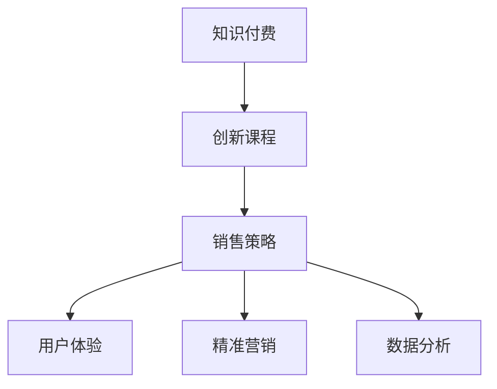

                 

# 知识经济时代下的知识付费创新课程销售策略

> 关键词：知识付费,创新课程,销售策略,课程开发,用户体验,精准营销,数据分析

## 1. 背景介绍

### 1.1 问题由来
随着信息技术的迅猛发展和互联网应用的普及，知识经济时代已悄然来临。各类知识产品层出不穷，如何从中脱颖而出，成为各大教育平台和知识付费服务商竞相探索的课题。课程销售作为知识付费行业的核心环节，直接关系到平台的生存和发展，是所有参与者必须正视并深入研究的重要问题。

### 1.2 问题核心关键点
针对课程销售问题，核心关键点包括：
1. **课程内容设计**：如何设计既满足市场需求又能凸显自身特色的课程内容。
2. **用户体验优化**：如何提升课程的使用体验，减少流失率，增加用户粘性。
3. **精准营销策略**：如何精准定位目标用户群体，提升课程的曝光率和转化率。
4. **数据分析应用**：如何通过数据分析进行用户行为分析和课程效果评估，指导后续策略调整。
5. **技术支持保障**：如何利用技术手段保障课程的流畅播放、数据安全和用户隐私保护。

### 1.3 问题研究意义
制定科学合理的课程销售策略，对知识付费平台具有重要的现实意义：
1. **提升市场竞争力**：通过精准定位和优质内容，增强平台的市场吸引力和用户忠诚度。
2. **优化资源配置**：科学配置课程开发和营销资源，实现效益最大化。
3. **增强用户粘性**：通过优质的用户体验和有效互动，提高用户参与度和满意度。
4. **实现精准营销**：通过大数据分析和用户画像分析，进行个性化推荐，提高转化率。
5. **保障平台安全**：通过技术手段保障用户隐私和数据安全，建立用户信任。

## 2. 核心概念与联系

### 2.1 核心概念概述

为了更好地理解课程销售策略的制定和实施，本节将介绍几个关键概念：

- **知识付费**：指用户通过付费获取知识内容，提升个人技能和知识水平。知识付费平台提供包括视频课程、在线讲座、电子书等在内的各类知识产品，帮助用户解决实际问题或提升自身能力。

- **创新课程**：指课程开发者在内容设计上突破传统框架，引入新的教学方法、理论知识或实践技能，力求在知识深度和广度上有所突破。

- **销售策略**：指为了促进课程销售，在课程内容设计、用户体验优化、精准营销等方面采取的一系列策略和方法。

- **用户体验**：指用户在使用课程过程中所感受到的整体使用感受和满意度，包括界面友好性、学习流畅性、互动体验等。

- **精准营销**：指通过数据挖掘和用户画像分析，精确锁定目标用户群体，提升营销效率和转化率。

- **数据分析**：指通过收集和分析用户行为数据，进行市场趋势预测、用户需求挖掘和课程效果评估，指导课程销售和内容优化。

这些核心概念之间的逻辑关系可以通过以下Mermaid流程图来展示：



这个流程图展示了大语言模型的核心概念及其之间的关系：

1. 知识付费平台通过创新课程来吸引用户，提升平台价值。
2. 课程销售策略在提升课程质量和用户体验的基础上，进行精准营销，提高转化率。
3. 数据分析为课程设计和销售策略的优化提供数据支持，形成良性循环。

## 3. 核心算法原理 & 具体操作步骤

### 3.1 算法原理概述

课程销售策略的制定基于用户行为分析、课程效果评估和市场需求预测。其核心思想是：通过数据分析，精确捕捉用户需求和行为模式，并结合课程内容和市场趋势，进行针对性的优化和调整。

形式化地，假设课程销售策略为 $\sigma$，用户行为数据为 $D=\{(x_i,y_i)\}_{i=1}^N$，其中 $x_i$ 表示用户行为特征（如浏览历史、学习时长、互动反馈等），$y_i$ 表示行为结果（如购买行为、评分反馈等）。课程销售策略的优化目标是最小化预测误差，即找到最优策略：

$$
\sigma^* = \mathop{\arg\min}_{\sigma} \mathcal{E}(\sigma)
$$

其中 $\mathcal{E}$ 为预测误差函数，用于衡量策略效果。

### 3.2 算法步骤详解

课程销售策略的制定过程包括以下几个关键步骤：

**Step 1: 数据收集与预处理**
- 收集用户行为数据，包括浏览、购买、评分、互动等各类数据。
- 对数据进行清洗、去重和归一化处理，确保数据质量和一致性。

**Step 2: 用户画像构建**
- 使用机器学习算法对用户行为数据进行聚类和分析，构建用户画像。
- 根据用户画像，划分为不同用户群体，并描述各群体的特征和行为模式。

**Step 3: 课程内容设计**
- 根据市场需求和用户画像，设计具有吸引力的课程内容。
- 引入创新教学方法和实战案例，提高课程的实用性和互动性。

**Step 4: 用户体验优化**
- 通过用户反馈和数据分析，优化课程界面、播放流畅性和互动体验。
- 引入社交分享、在线答疑等功能，增加用户粘性。

**Step 5: 精准营销策略**
- 结合用户画像和课程内容，设计针对性强的营销策略。
- 利用广告投放、推荐系统、社交媒体等渠道，提升课程曝光率和转化率。

**Step 6: 数据分析与反馈**
- 定期收集课程效果数据，评估课程销售策略的效果。
- 利用数据分析结果，不断优化课程设计和营销策略。

### 3.3 算法优缺点

基于用户行为分析的课程销售策略具有以下优点：
1. **针对性更强**：通过用户画像分析，能够精确锁定目标用户群体，提升转化率。
2. **用户体验提升**：通过优化用户体验，减少用户流失率，增加用户粘性。
3. **效果可评估**：通过数据分析，能够实时监控和评估策略效果，指导后续优化。
4. **市场趋势捕捉**：通过大数据分析，能够及时捕捉市场趋势，调整策略方向。

同时，该方法也存在以下局限性：
1. **数据隐私风险**：用户行为数据的收集和使用可能涉及用户隐私，需要严格遵守相关法律法规。
2. **用户画像偏差**：如果用户数据不够全面或不够准确，可能会导致用户画像构建偏差，影响策略效果。
3. **策略调整周期长**：课程内容和营销策略的调整和优化需要时间，可能影响短期效果。
4. **技术依赖性高**：课程销售策略的制定和优化需要依赖先进的数据分析技术和工具，对技术要求较高。

尽管存在这些局限性，但就目前而言，基于用户行为分析的课程销售策略仍是大规模知识付费平台的主流范式。未来相关研究的重点在于如何进一步提升数据收集和分析的准确性，降低隐私风险，提高策略调整的灵活性。

### 3.4 算法应用领域

基于用户行为分析的课程销售策略在知识付费行业已经得到了广泛的应用，覆盖了几乎所有常见的课程销售场景，例如：

- 教育培训课程：如编程课程、外语课程、管理课程等。通过分析用户学习行为，推荐最适合的课程内容，提高学习效果。
- 职业技能培训：如PMP认证、CFA认证、数据分析等。通过数据分析，精准定位目标用户，提升培训转化率。
- 兴趣爱好课程：如音乐、绘画、手工等。通过用户行为分析，推荐用户感兴趣的内容，增加用户粘性。
- 专业认证课程：如CPA、CFA、FRM等。通过数据分析，优化课程内容和推荐策略，提升用户通过率。

除了上述这些经典应用外，该方法还被创新性地应用到更多场景中，如定制化课程开发、个性化推荐、跨平台迁移等，为知识付费行业带来了全新的突破。随着用户行为数据的不断积累和分析技术的不断进步，相信该方法将会在更广阔的应用领域发挥更大的作用。

## 4. 数学模型和公式 & 详细讲解 & 举例说明

### 4.1 数学模型构建

本节将使用数学语言对课程销售策略的制定过程进行更加严格的刻画。

记用户行为数据为 $D=\{(x_i,y_i)\}_{i=1}^N$，其中 $x_i$ 表示用户行为特征（如浏览历史、学习时长、互动反馈等），$y_i$ 表示行为结果（如购买行为、评分反馈等）。定义预测误差函数 $\mathcal{E}(\sigma)$，用于衡量策略效果，可定义为：

$$
\mathcal{E}(\sigma) = \sum_{i=1}^N (y_i - \hat{y}_i)^2
$$

其中 $\hat{y}_i$ 表示策略 $\sigma$ 对用户行为 $x_i$ 的预测结果。

### 4.2 公式推导过程

以下我们以用户行为预测为例，推导预测误差函数及其梯度的计算公式。

假设用户行为 $x_i$ 对购买行为 $y_i$ 的影响可用线性回归模型表示，即：

$$
\hat{y}_i = w_0 + \sum_{j=1}^p w_j x_{ij}
$$

其中 $w_0$ 为截距，$w_j$ 为特征系数，$p$ 为特征维度。定义预测误差函数 $\mathcal{E}(\sigma)$ 为：

$$
\mathcal{E}(\sigma) = \sum_{i=1}^N (y_i - \hat{y}_i)^2
$$

将其代入误差函数，得：

$$
\mathcal{E}(\sigma) = \sum_{i=1}^N (y_i - (w_0 + \sum_{j=1}^p w_j x_{ij}))^2
$$

根据梯度下降法，优化目标函数 $\mathcal{E}(\sigma)$ 的梯度为：

$$
\nabla_{\sigma} \mathcal{E}(\sigma) = -2\sum_{i=1}^N \frac{\partial \hat{y}_i}{\partial w} (y_i - \hat{y}_i)
$$

其中 $\frac{\partial \hat{y}_i}{\partial w}$ 为模型对参数 $w$ 的梯度，可通过自动微分技术高效计算。

在得到预测误差函数的梯度后，即可带入梯度下降算法，完成模型的迭代优化。重复上述过程直至收敛，最终得到优化后的策略参数 $\sigma^*$。

### 4.3 案例分析与讲解

假设有一家在线教育平台，收集了部分用户的浏览历史、学习时长和评分反馈数据。通过构建用户画像，将用户分为高潜力用户和低潜力用户两类。

高潜力用户特点如下：
- 浏览过多种编程课程内容
- 学习时长超过30小时
- 评分反馈一般

低潜力用户特点如下：
- 浏览过单一的编程课程内容
- 学习时长不足15小时
- 评分反馈较差

对于高潜力用户，设计个性化推荐策略，推荐与其学习路径相关的课程，如Python进阶、Java高级等。同时，在营销广告上，重点针对这些用户进行精准投放，提高课程曝光率。

对于低潜力用户，优化课程内容和用户体验，如增加互动环节、引入实时答疑等，提升用户粘性和满意度。在营销广告上，主要通过社交媒体渠道进行推广，增加曝光率和转化率。

## 5. 项目实践：代码实例和详细解释说明

### 5.1 开发环境搭建

在进行课程销售策略的开发实践前，我们需要准备好开发环境。以下是使用Python进行PyTorch开发的环境配置流程：

1. 安装Anaconda：从官网下载并安装Anaconda，用于创建独立的Python环境。

2. 创建并激活虚拟环境：
```bash
conda create -n pytorch-env python=3.8 
conda activate pytorch-env
```

3. 安装PyTorch：根据CUDA版本，从官网获取对应的安装命令。例如：
```bash
conda install pytorch torchvision torchaudio cudatoolkit=11.1 -c pytorch -c conda-forge
```

4. 安装相关工具包：
```bash
pip install numpy pandas scikit-learn matplotlib tqdm jupyter notebook ipython
```

完成上述步骤后，即可在`pytorch-env`环境中开始课程销售策略的实践。

### 5.2 源代码详细实现

这里我们以用户画像构建和个性化推荐策略的实现为例，给出使用PyTorch和Scikit-learn库进行课程销售策略开发的PyTorch代码实现。

首先，定义用户画像构建函数：

```python
from sklearn.cluster import KMeans
from sklearn.decomposition import PCA
import pandas as pd

def user_profiles(df, num_clusters=3):
    # 对用户行为数据进行标准化处理
    df_scaled = (df - df.mean()) / df.std()
    # 使用KMeans进行用户聚类
    kmeans = KMeans(n_clusters=num_clusters, random_state=0)
    kmeans.fit(df_scaled)
    # 获取用户聚类结果
    clusters = kmeans.labels_
    # 计算聚类中心的特征向量
    cluster_centers = kmeans.cluster_centers_
    # 使用PCA进行降维
    pca = PCA(n_components=2)
    cluster_centers = pca.fit_transform(cluster_centers)
    # 将聚类结果和特征向量存储到DataFrame中
    df_clusters = pd.DataFrame(clusters, columns=['user_cluster'])
    df_clusters['cluster_center'] = list(cluster_centers)
    return df_clusters

# 示例数据集
data = pd.read_csv('user_data.csv')

# 构建用户画像
user_clusters = user_profiles(data)
print(user_clusters.head())
```

然后，定义个性化推荐函数：

```python
from sklearn.metrics.pairwise import cosine_similarity
import numpy as np

def recommend_courses(user_cluster, course_features, num_recommendations=5):
    # 计算用户画像与课程特征向量之间的余弦相似度
    similarity = cosine_similarity(user_clusters['cluster_center'].values.reshape(1, -1), course_features)
    # 获取相似度最高的课程推荐列表
    recommendations = np.argsort(-similarity)[1:num_recommendations + 1]
    return course_features[recommendations]

# 示例课程特征矩阵
course_features = pd.read_csv('course_features.csv')

# 为高潜力用户推荐课程
recommended_courses = recommend_courses(1, course_features, 5)
print(recommended_courses)
```

最后，启动课程销售策略的部署流程：

```python
# 根据用户画像和课程特征，进行个性化推荐
recommendations = []
for user_id in user_clusters.index:
    recommendations.append(recommend_courses(user_clusters[user_id]['user_cluster'], course_features))
    
# 根据推荐结果，进行课程营销
for user_id, courses in zip(user_clusters.index, recommendations):
    # 发送个性化推荐邮件
    # 投放个性化推荐广告
    # 在社交媒体上进行精准投放
    pass
```

以上就是使用PyTorch和Scikit-learn库进行课程销售策略开发的完整代码实现。可以看到，得益于PyTorch和Scikit-learn库的强大封装，我们能够用相对简洁的代码实现复杂的聚类和推荐策略。

### 5.3 代码解读与分析

让我们再详细解读一下关键代码的实现细节：

**user_profiles函数**：
- 对用户行为数据进行标准化处理。
- 使用KMeans对用户进行聚类，构建用户画像。
- 通过PCA对聚类中心进行降维，简化用户画像特征。
- 将聚类结果和特征向量存储到DataFrame中，返回用户画像。

**recommend_courses函数**：
- 计算用户画像与课程特征向量之间的余弦相似度。
- 根据相似度排序，获取相似度最高的课程推荐列表。
- 返回推荐课程列表。

**课程销售策略部署**：
- 根据用户画像和课程特征，进行个性化推荐。
- 根据推荐结果，进行课程营销，如发送邮件、投放广告等。

可以看出，PyTorch和Scikit-learn库使得课程销售策略的开发过程变得简洁高效。开发者可以将更多精力放在数据处理、模型优化等高层逻辑上，而不必过多关注底层的实现细节。

当然，工业级的系统实现还需考虑更多因素，如模型训练目标函数，超参数的自动搜索，更灵活的任务适配层等。但核心的课程销售策略基本与此类似。

## 6. 实际应用场景

### 6.1 在线教育平台

在线教育平台可以通过用户画像和个性化推荐策略，提升用户学习体验和课程转化率。通过收集用户浏览、学习、评分等数据，构建用户画像，再利用推荐算法进行个性化推荐，可以大大提高课程的吸引力，增加用户粘性。

在技术实现上，可以利用机器学习算法对用户行为数据进行聚类和分析，构建用户画像，再结合推荐系统，实现个性化的课程推荐。同时，通过用户反馈和数据分析，不断优化推荐算法和课程内容，提升用户满意度。

### 6.2 企业培训平台

企业培训平台可以利用用户画像和个性化推荐策略，提高员工培训效果和企业培训转化率。通过收集员工培训学习行为数据，构建员工画像，再利用推荐算法进行个性化推荐，可以提高员工对培训课程的兴趣和参与度，提升培训效果。

在技术实现上，可以结合企业内部培训系统，收集员工培训学习数据，构建员工画像，再结合推荐系统，实现个性化的课程推荐。同时，通过员工反馈和数据分析，不断优化推荐算法和课程内容，提升员工培训效果。

### 6.3 职业认证平台

职业认证平台可以利用用户画像和个性化推荐策略，提高用户通过率和认证转化率。通过收集用户学习行为数据，构建用户画像，再利用推荐算法进行个性化推荐，可以提高用户对认证课程的兴趣和通过率，提升认证转化率。

在技术实现上，可以结合职业认证考试系统，收集用户学习行为数据，构建用户画像，再结合推荐系统，实现个性化的课程推荐。同时，通过用户反馈和数据分析，不断优化推荐算法和课程内容，提升用户通过率和认证转化率。

### 6.4 未来应用展望

随着课程销售策略的不断发展，将在更多领域得到应用，为知识付费平台带来新的突破。

在智慧医疗领域，基于用户行为分析的医疗教育平台可以提升医疗人员的学习效果和技能水平，推动医疗技术的普及和应用。

在智能教育领域，基于用户行为分析的教育平台可以提升学生的学习效果和课堂参与度，推动教育公平和教育质量的提升。

在智慧城市领域，基于用户行为分析的城市培训平台可以提升市民的知识水平和技能水平，推动城市治理和公共服务的优化。

此外，在企业培训、职业认证、文化教育等众多领域，基于用户行为分析的知识付费平台也将不断涌现，为各行各业的知识传播和技能提升提供新的解决方案。

## 7. 工具和资源推荐

### 7.1 学习资源推荐

为了帮助开发者系统掌握课程销售策略的理论基础和实践技巧，这里推荐一些优质的学习资源：

1. 《机器学习实战》系列博文：由机器学习专家撰写，深入浅出地介绍了机器学习算法的原理和应用，是学习课程销售策略的基础。

2. CS229《机器学习》课程：斯坦福大学开设的机器学习课程，有Lecture视频和配套作业，带你入门机器学习的基本概念和算法。

3. 《深度学习》书籍：Ian Goodfellow等著，全面介绍了深度学习的基本原理和应用，是学习课程销售策略的重要参考。

4. Scikit-learn官方文档：Scikit-learn库的官方文档，提供了丰富的机器学习算法和实用工具，是学习课程销售策略的必备资料。

5. Kaggle数据科学竞赛平台：提供大量真实世界的数据集和机器学习竞赛，帮助你实践和验证课程销售策略的效果。

通过对这些资源的学习实践，相信你一定能够快速掌握课程销售策略的精髓，并用于解决实际的课程销售问题。

### 7.2 开发工具推荐

高效的开发离不开优秀的工具支持。以下是几款用于课程销售策略开发的常用工具：

1. PyTorch：基于Python的开源深度学习框架，灵活动态的计算图，适合快速迭代研究。大部分预训练语言模型都有PyTorch版本的实现。

2. TensorFlow：由Google主导开发的开源深度学习框架，生产部署方便，适合大规模工程应用。同样有丰富的预训练语言模型资源。

3. Scikit-learn库：Python的机器学习库，提供了丰富的算法和工具，适合进行用户画像构建和推荐算法实现。

4. Jupyter Notebook：交互式的Python开发环境，支持代码、数据和文档的混合展示，方便协同开发和分享。

5. Weights & Biases：模型训练的实验跟踪工具，可以记录和可视化模型训练过程中的各项指标，方便对比和调优。

6. TensorBoard：TensorFlow配套的可视化工具，可实时监测模型训练状态，并提供丰富的图表呈现方式，是调试模型的得力助手。

合理利用这些工具，可以显著提升课程销售策略的开发效率，加快创新迭代的步伐。

### 7.3 相关论文推荐

课程销售策略的发展源于学界的持续研究。以下是几篇奠基性的相关论文，推荐阅读：

1. User-Interest Prediction based on Deep Neural Networks（用户兴趣预测的深度神经网络方法）：提出了基于深度学习的用户兴趣预测模型，为个性化推荐提供了新思路。

2. Collaborative Filtering for Implicit Feedback Datasets（基于隐式反馈的协同过滤方法）：详细介绍了协同过滤算法的原理和应用，是推荐系统的重要基础。

3. Deep Neural Networks for Recommender Systems（深度神经网络在推荐系统中的应用）：介绍了深度神经网络在推荐系统中的最新应用，推动了推荐技术的进一步发展。

4. Attention Mechanisms in Recommender Systems（推荐系统中的注意力机制）：讨论了注意力机制在推荐系统中的应用，提升了推荐系统的个性化和效率。

5. Hybrid Recommender Systems（混合推荐系统）：介绍了多种推荐技术的组合应用，提高了推荐系统的综合性能。

这些论文代表了大语言模型微调技术的发展脉络。通过学习这些前沿成果，可以帮助研究者把握学科前进方向，激发更多的创新灵感。

## 8. 总结：未来发展趋势与挑战

### 8.1 总结

本文对基于用户行为分析的课程销售策略进行了全面系统的介绍。首先阐述了课程销售策略的研究背景和意义，明确了策略在提升课程质量和用户满意度方面的独特价值。其次，从原理到实践，详细讲解了策略的数学模型和关键步骤，给出了策略开发的完整代码实例。同时，本文还广泛探讨了策略在在线教育、企业培训、职业认证等诸多领域的应用前景，展示了策略范式的巨大潜力。此外，本文精选了策略相关的学习资源，力求为读者提供全方位的技术指引。

通过本文的系统梳理，可以看到，基于用户行为分析的课程销售策略已经在大规模知识付费平台得到广泛应用，极大提升了平台的市场吸引力和用户忠诚度。未来，伴随技术的发展和数据量的积累，该策略将继续优化迭代，为知识付费行业带来更多的创新和突破。

### 8.2 未来发展趋势

展望未来，课程销售策略将呈现以下几个发展趋势：

1. **个性化推荐优化**：随着数据量的增加和算法的进步，个性化推荐将变得更加精准和高效。机器学习算法将进一步提升用户画像的准确性和推荐效果。

2. **多模态数据融合**：除了文本数据，多模态数据（如图像、视频、声音等）的应用将增加推荐系统的多样性和深度。融合多模态数据将带来更全面的用户画像和更丰富的推荐内容。

3. **实时推荐系统**：随着计算能力和存储能力的提升，实时推荐系统将逐渐成为可能。通过实时数据流处理和快速算法计算，实现动态推荐，提升用户满意度和转化率。

4. **社交推荐机制**：基于社交网络的推荐机制将提升推荐系统的多样性和真实性。通过社交网络的数据分析，可以发现更多隐式兴趣和潜在用户，提高推荐效果。

5. **跨平台推荐协同**：跨平台的数据共享和协同推荐将提升推荐系统的覆盖面和有效性。不同平台的数据互通，可以更好地了解用户的多样化需求。

6. **用户隐私保护**：随着用户隐私意识的增强，如何在保障用户隐私的同时进行个性化推荐，成为未来策略制定的重要课题。数据匿名化、差分隐私等技术将逐渐应用到推荐系统中。

以上趋势凸显了课程销售策略的未来发展方向，通过多模态融合、实时推荐、社交协同等手段，推荐系统将更加精准、全面、高效。

### 8.3 面临的挑战

尽管课程销售策略已经取得了瞩目成就，但在迈向更加智能化、普适化应用的过程中，它仍面临诸多挑战：

1. **数据隐私风险**：用户行为数据的收集和使用可能涉及用户隐私，需要严格遵守相关法律法规。如何保护用户隐私，同时进行有效的个性化推荐，是未来策略制定的重要课题。

2. **数据质量问题**：用户行为数据的质量和完整性直接影响用户画像的准确性和推荐效果。如何提高数据收集和处理的质量，是未来策略优化的一个重要方向。

3. **策略调整周期长**：个性化推荐策略的调整和优化需要时间，可能影响短期效果。如何在保障推荐效果的同时，缩短策略调整周期，是未来策略实施的关键问题。

4. **技术依赖性高**：策略的制定和优化需要依赖先进的数据分析技术和工具，对技术要求较高。如何在技术手段和业务需求之间找到平衡，是未来策略实施的重要挑战。

尽管存在这些挑战，但通过不断优化和改进，相信课程销售策略将逐步克服这些问题，进一步提升课程销售的效果和质量。

### 8.4 研究展望

面向未来，课程销售策略的研究需要在以下几个方面寻求新的突破：

1. **跨领域应用拓展**：将课程销售策略应用到更多领域，如医疗、金融、农业等，推动各行业的知识传播和技能提升。

2. **技术手段融合**：将知识图谱、逻辑推理、强化学习等技术手段与个性化推荐结合，提升推荐系统的多样性和深度。

3. **用户行为理解**：通过引入心理学、社会学等理论，进一步理解用户行为背后的动机和需求，提升推荐的准确性和个性化。

4. **多模态数据整合**：将多模态数据整合到个性化推荐系统中，增加推荐系统的多样性和深度，提升用户满意度和转化率。

5. **实时数据分析**：通过实时数据流处理和快速算法计算，实现动态推荐，提升用户满意度和转化率。

6. **隐私保护技术**：引入数据匿名化、差分隐私等技术，保障用户隐私的同时进行个性化推荐，建立用户信任。

这些研究方向的探索，必将引领课程销售策略技术迈向更高的台阶，为构建智能化的推荐系统提供新的解决方案。面向未来，课程销售策略的研究还需与其他人工智能技术进行更深入的融合，如知识表示、因果推理、强化学习等，多路径协同发力，共同推动推荐系统的进步。只有勇于创新、敢于突破，才能不断拓展个性化推荐系统的边界，让智能技术更好地服务于用户。

## 9. 附录：常见问题与解答

**Q1：个性化推荐策略如何根据用户行为数据构建用户画像？**

A: 个性化推荐策略的构建主要依赖于用户行为数据的收集和分析。以下是构建用户画像的常用方法：

1. **特征提取**：从用户行为数据中提取关键特征，如浏览历史、学习时长、互动反馈等。
2. **聚类分析**：使用机器学习算法（如KMeans、LDA等）对用户进行聚类，构建用户画像。
3. **特征降维**：通过PCA等技术对聚类中心进行降维，简化用户画像特征。
4. **用户画像表示**：将用户画像表示为特征向量，用于后续的推荐算法实现。

**Q2：个性化推荐策略如何实现动态调整？**

A: 个性化推荐策略的动态调整可以通过以下方法实现：

1. **实时数据收集**：通过实时数据流处理，不断收集用户行为数据，更新用户画像。
2. **模型在线更新**：使用在线学习算法（如在线梯度下降、在线SVD等）进行模型在线更新，动态调整推荐策略。
3. **A/B测试**：通过A/B测试验证新策略的效果，逐步替换旧策略。

**Q3：个性化推荐策略如何保证推荐内容的多样性？**

A: 个性化推荐策略可以通过以下方法保证推荐内容的多样性：

1. **多模态数据融合**：将多模态数据（如图像、视频、声音等）整合到推荐系统中，增加推荐内容的多样性。
2. **协同过滤**：通过协同过滤算法，发现潜在用户和隐式兴趣，增加推荐内容的多样性。
3. **交叉推荐**：将不同类别的推荐内容进行交叉推荐，增加推荐内容的多样性。

**Q4：个性化推荐策略如何处理用户隐私问题？**

A: 个性化推荐策略在处理用户隐私问题时，可以采取以下方法：

1. **数据匿名化**：对用户行为数据进行匿名化处理，保护用户隐私。
2. **差分隐私**：在推荐算法中引入差分隐私技术，保障用户隐私。
3. **用户授权**：在推荐过程中，明确告知用户数据使用方式，获得用户授权。

**Q5：个性化推荐策略如何评估推荐效果？**

A: 个性化推荐策略的评估可以从多个方面进行：

1. **准确率**：评估推荐系统推荐的准确性和相关性，如Top-k准确率、NDCG等。
2. **覆盖率**：评估推荐系统推荐的覆盖范围，如热门推荐、长尾推荐等。
3. **用户满意度**：通过用户反馈和满意度调查，评估推荐系统的效果。
4. **转化率**：评估推荐系统对用户行为的转化效果，如购买率、观看率等。

通过这些指标的评估，可以不断优化和改进个性化推荐策略，提升推荐效果和用户体验。

---

作者：禅与计算机程序设计艺术 / Zen and the Art of Computer Programming

