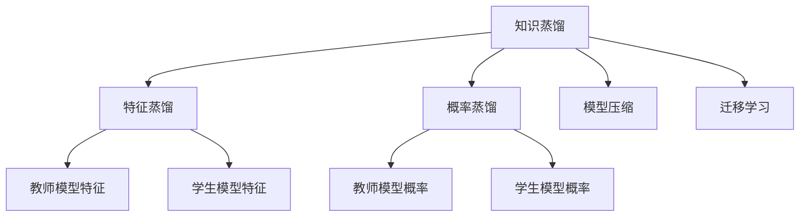

                 

## 1. 背景介绍

情感分析（Sentiment Analysis）是自然语言处理（NLP）中的重要任务，旨在从文本中识别和提取情感信息，帮助企业和社会理解公众的情感倾向和态度。情感分析广泛应用于市场舆情监控、品牌情感管理、消费者行为分析等领域。然而，情感分析任务的复杂性和多样性，使得在各种应用场景中获取高质量的标注数据非常困难。因此，如何在大规模无标注数据上训练高效、准确的情感分析模型成为了一个重要研究课题。

近年来，基于深度学习的情感分析方法在学术界和工业界得到了广泛应用，其中知识蒸馏（Knowledge Distillation，KD）技术因其在模型压缩和迁移学习中的优异表现，被逐渐引入到情感分析任务中。知识蒸馏通过对一个教师模型（如大语言模型）的知识进行迁移学习，训练一个轻量级的学生模型，以提高模型的准确性和泛化能力，同时减少计算和存储成本。

本博客将全面介绍知识蒸馏技术的基本原理、具体实现、应用场景及未来发展方向，并提供一个详细的代码实例，帮助读者深入理解知识蒸馏在情感分析任务中的应用。

## 2. 核心概念与联系

### 2.1 核心概念概述

- **知识蒸馏（Knowledge Distillation）**：
  知识蒸馏是一种模型压缩和迁移学习的技术，旨在通过一个高精度模型（教师模型）对低精度模型（学生模型）进行知识传递，以提升学生模型的性能。具体实现方式包括特征蒸馏和概率蒸馏两种，分别通过学习教师模型的特征表示和输出概率分布，来指导学生模型的训练。

- **特征蒸馏**：
  特征蒸馏是指通过匹配教师模型的特征表示，来指导学生模型的训练。具体而言，教师模型在某个特定层提取特征表示，然后将这些特征表示映射为学生模型的预测结果。

- **概率蒸馏**：
  概率蒸馏是指通过匹配教师模型的输出概率分布，来指导学生模型的训练。教师模型在某个特定层对输入进行分类，输出每个类别的概率，然后将这些概率作为监督信号，训练学生模型。

- **情感分析**：
  情感分析是NLP中的重要任务，旨在从文本中识别和提取情感信息，帮助企业和社会理解公众的情感倾向和态度。情感分析广泛应用于市场舆情监控、品牌情感管理、消费者行为分析等领域。

- **模型压缩**：
  模型压缩旨在减小深度学习模型的计算和存储成本，提高模型的实时性。知识蒸馏是模型压缩的一种重要手段，通过匹配高精度模型和低精度模型的知识，来提高低精度模型的性能。

- **迁移学习**：
  迁移学习是一种通过在多个任务上共享知识，来提升模型在新任务上的性能的技术。知识蒸馏可以看作是迁移学习的一种形式，通过将高精度模型的知识传递给低精度模型，来提高低精度模型在新任务上的表现。

这些核心概念之间的逻辑关系可以通过以下Mermaid流程图来展示：



这个流程图展示了两类知识蒸馏方法（特征蒸馏和概率蒸馏），以及它们在模型压缩和迁移学习中的作用。

## 3. 核心算法原理 & 具体操作步骤

### 3.1 算法原理概述

知识蒸馏的本质是通过教师模型（通常是高精度模型）对学生模型（通常是低精度模型）进行知识传递，以提升学生模型的性能。在情感分析任务中，知识蒸馏具体表现为将教师模型的特征表示或概率分布作为监督信号，训练学生模型。

知识蒸馏的一般步骤如下：
1. 选择一个高质量的教师模型，如BERT、GPT等。
2. 在教师模型上收集情感分析任务的标注数据，并将其用于训练教师模型。
3. 设计一个轻量级的学生模型，如简单的全连接神经网络或注意力机制。
4. 通过特征蒸馏或概率蒸馏，将教师模型的知识传递给学生模型。
5. 在学生模型上，使用标注数据进行微调，以适应具体任务。
6. 在测试集上评估学生模型的性能，并与教师模型进行比较。

### 3.2 算法步骤详解

以下是一个详细的知识蒸馏在情感分析任务中的实现步骤：

**Step 1: 准备教师模型和数据集**

- 选择一个高质量的教师模型，如BERT、GPT等。
- 准备情感分析任务的标注数据集，将其划分为训练集、验证集和测试集。

**Step 2: 设计学生模型**

- 设计一个轻量级的学生模型，如简单的全连接神经网络或注意力机制。
- 在学生模型上，添加一个输出层，用于进行情感分类。

**Step 3: 特征蒸馏或概率蒸馏**

- 特征蒸馏：将教师模型在某个特定层的特征表示作为监督信号，指导学生模型的训练。
  - 教师模型在训练集上进行情感分类，并将每个样本的特征表示提取出来。
  - 将特征表示映射为学生模型的输出。
  - 使用学生的特征表示与教师的特征表示进行对比，计算损失函数。

- 概率蒸馏：将教师模型在某个特定层的输出概率分布作为监督信号，指导学生模型的训练。
  - 教师模型在训练集上进行情感分类，并输出每个类别的概率。
  - 将教师模型的概率分布映射为学生模型的输出。
  - 使用学生的输出概率与教师的输出概率进行对比，计算损失函数。

**Step 4: 微调学生模型**

- 在学生模型上，使用情感分析任务的标注数据进行微调。
- 使用损失函数计算每个样本的误差，并使用梯度下降等优化算法更新学生模型的参数。

**Step 5: 评估学生模型**

- 在测试集上评估学生模型的性能。
- 将学生模型的输出与教师模型的输出进行对比，评估学生的性能。

### 3.3 算法优缺点

知识蒸馏在情感分析任务中具有以下优点：
1. 减小计算和存储成本：通过匹配教师模型的知识，学生模型的计算和存储成本显著降低。
2. 提高泛化能力：学生模型通过学习教师模型的知识，能够更好地适应各种情感分类任务。
3. 降低过拟合风险：教师模型的知识可以提供更多的监督信号，减少学生模型在训练过程中的过拟合风险。

同时，知识蒸馏在情感分析任务中也存在一些局限性：
1. 依赖高质量教师模型：教师模型的选择对知识蒸馏的效果有很大影响，需要耗费大量时间和资源进行训练。
2. 蒸馏过程复杂：特征蒸馏和概率蒸馏都需要设计合适的映射函数，且训练过程较为复杂。
3. 精度下降：学生模型往往无法达到教师模型的精度，需要在计算和精度之间进行权衡。

### 3.4 算法应用领域

知识蒸馏技术在情感分析任务中的应用领域非常广泛，包括但不限于以下几个方面：

1. **情感分析应用场景**：在品牌情感管理、消费者行为分析、市场舆情监控等领域，知识蒸馏可以大大降低标注数据的需求，提高情感分析的准确性和泛化能力。

2. **跨领域知识迁移**：在跨领域情感分析中，知识蒸馏可以帮助学生在多个领域之间进行知识迁移，从而提高模型在不同领域上的表现。

3. **实时情感分析**：在实时情感分析中，知识蒸馏可以训练轻量级学生模型，使其能够在资源受限的环境中快速进行情感分类。

4. **多模态情感分析**：在多模态情感分析中，知识蒸馏可以帮助学生在文本、图像、语音等多种模态之间进行知识迁移，从而提高模型对多模态数据的理解能力。

## 4. 数学模型和公式 & 详细讲解 & 举例说明

### 4.1 数学模型构建

在情感分析任务中，知识蒸馏可以通过特征蒸馏或概率蒸馏实现。这里以特征蒸馏为例，介绍其数学模型构建过程。

假设教师模型和学生模型的特征表示分别为 $H_T$ 和 $H_S$，对应的情感分类输出分别为 $Y_T$ 和 $Y_S$。特征蒸馏的目标是最大化学生模型与教师模型的特征表示之间的相似性，最小化损失函数。

### 4.2 公式推导过程

特征蒸馏的目标是最大化学生模型与教师模型的特征表示之间的相似性，最小化损失函数。假设有 $N$ 个训练样本，每个样本的特征表示和情感分类输出分别为 $H_{T,i}$ 和 $Y_{T,i}$，以及 $H_{S,i}$ 和 $Y_{S,i}$。特征蒸馏的损失函数可以表示为：

$$
\mathcal{L}_{dist} = \sum_{i=1}^N \left( \frac{H_{T,i} \cdot H_{S,i}}{\|H_{T,i}\|_2 \cdot \|H_{S,i}\|_2} - \alpha \right)^2
$$

其中 $\alpha$ 为常数，用于控制特征表示之间的相似性。

特征蒸馏的优化目标是最小化损失函数，即找到最优参数：

$$
\theta^* = \mathop{\arg\min}_{\theta_S} \mathcal{L}_{dist}(M_S; M_T)
$$

其中 $M_S$ 和 $M_T$ 分别为学生模型和教师模型的参数。

### 4.3 案例分析与讲解

以一个简单的全连接神经网络（FCN）作为学生模型，使用BERT作为教师模型，进行情感分析任务中的特征蒸馏。

假设学生模型包含 $L$ 层，每层的特征表示分别为 $H^1, H^2, ..., H^L$，对应的情感分类输出为 $Y_1, Y_2, ..., Y_L$。教师模型的特征表示和情感分类输出分别为 $H_T$ 和 $Y_T$。

在训练过程中，使用 $H_T$ 作为监督信号，更新学生模型 $M_S$ 的参数。具体步骤如下：

1. 在教师模型上训练情感分类任务，获得特征表示 $H_T$。
2. 将 $H_T$ 作为监督信号，更新学生模型的参数 $M_S$。
3. 在学生模型上训练情感分类任务，获得特征表示 $H_S$。
4. 计算特征蒸馏损失 $\mathcal{L}_{dist}$，并使用梯度下降等优化算法更新学生模型 $M_S$ 的参数。

通过上述步骤，学生模型逐渐学习到与教师模型相似的特征表示，提高了其在情感分析任务上的表现。

## 5. 项目实践：代码实例和详细解释说明

### 5.1 开发环境搭建

为了实现知识蒸馏在情感分析任务中的应用，需要搭建一个Python开发环境。以下是搭建环境的详细步骤：

1. 安装Python：下载并安装Python 3.x，推荐使用Anaconda，以方便后续安装其他库。

2. 安装PyTorch：使用以下命令安装PyTorch，并设置GPU加速：

   ```bash
   pip install torch torchvision torchaudio
   python -m pip install --upgrade pip setuptools
   pip install --pre torchtext==0.10.1
   ```

3. 安装BertForSequenceClassification：使用以下命令安装BertForSequenceClassification，并下载BERT预训练模型：

   ```bash
   pip install transformers
   ```

4. 安装其他依赖库：使用以下命令安装其他依赖库，如Pandas、NumPy等：

   ```bash
   pip install pandas numpy
   ```

### 5.2 源代码详细实现

以下是一个完整的代码实例，展示了如何使用BertForSequenceClassification进行情感分析任务中的知识蒸馏：

```python
import torch
import torch.nn as nn
import torch.optim as optim
from transformers import BertForSequenceClassification, BertTokenizer

# 设置设备
device = torch.device('cuda' if torch.cuda.is_available() else 'cpu')

# 定义教师模型
model_T = BertForSequenceClassification.from_pretrained('bert-base-uncased', num_labels=3)

# 定义学生模型
class StudentModel(nn.Module):
    def __init__(self, num_labels):
        super(StudentModel, self).__init__()
        self.fc = nn.Linear(768, num_labels)

    def forward(self, x):
        return self.fc(x)

# 定义特征蒸馏损失函数
def distillation_loss(x, y):
    return (x - y).pow(2).mean()

# 定义情感分析任务的标注数据
train_data = # 训练数据
val_data = # 验证数据
test_data = # 测试数据

# 定义数据处理函数
def tokenize_and_encode(texts, labels, tokenizer, max_len):
    # 分词
    tokenized_texts = [tokenizer.encode(text, max_length=max_len, truncation=True) for text in texts]
    # 补齐
    tokenized_texts = [t + [0] * (max_len - len(t)) for t in tokenized_texts]
    # 转换标签
    labels = [label2id[label] for label in labels]
    # 编码
    encoding = tokenizer.encode_plus(tokenized_texts, labels=labels, max_length=max_len, padding='max_length', truncation=True, return_tensors='pt')
    input_ids = encoding['input_ids'].to(device)
    attention_mask = encoding['attention_mask'].to(device)
    return input_ids, attention_mask, labels

# 加载数据集
tokenizer = BertTokenizer.from_pretrained('bert-base-uncased')
max_len = 256

# 将数据集划分训练集和验证集
train_data = tokenize_and_encode(train_data['text'], train_data['label'], tokenizer, max_len)
val_data = tokenize_and_encode(val_data['text'], val_data['label'], tokenizer, max_len)
test_data = tokenize_and_encode(test_data['text'], test_data['label'], tokenizer, max_len)

# 定义学生模型
model_S = StudentModel(num_labels=3).to(device)

# 定义优化器和损失函数
optimizer_S = optim.Adam(model_S.parameters(), lr=2e-5)
loss_fn = nn.CrossEntropyLoss()

# 训练学生模型
epochs = 3
batch_size = 32
for epoch in range(epochs):
    model_S.train()
    total_loss = 0
    for i, (input_ids, attention_mask, labels) in enumerate(train_data, 0):
        optimizer_S.zero_grad()
        outputs = model_T(input_ids, attention_mask=attention_mask)
        logits = outputs.logits
        loss = loss_fn(logits, labels)
        loss += distillation_loss(model_S(input_ids), logits)
        loss.backward()
        optimizer_S.step()
        total_loss += loss.item()
        if (i + 1) % 100 == 0:
            print('Epoch [{}/{}], Step [{}/{}], Loss: {:.4f}'.format(epoch + 1, epochs, i + 1, len(train_data), total_loss / (i + 1)))
    
# 评估学生模型
model_S.eval()
total_correct = 0
total_sample = 0
for input_ids, attention_mask, labels in val_data:
    with torch.no_grad():
        outputs = model_S(input_ids)
        _, predicted = torch.max(outputs, 1)
        total_correct += (predicted == labels).sum().item()
        total_sample += labels.size(0)
print('Validation Accuracy: {:.2f}%'.format(100 * total_correct / total_sample))

# 测试学生模型
model_S.eval()
total_correct = 0
total_sample = 0
for input_ids, attention_mask, labels in test_data:
    with torch.no_grad():
        outputs = model_S(input_ids)
        _, predicted = torch.max(outputs, 1)
        total_correct += (predicted == labels).sum().item()
        total_sample += labels.size(0)
print('Test Accuracy: {:.2f}%'.format(100 * total_correct / total_sample))
```

### 5.3 代码解读与分析

上述代码实现了一个简单的情感分析任务中的知识蒸馏过程。具体来说，代码分为以下几个步骤：

1. **环境搭建**：安装Python、PyTorch、BertForSequenceClassification等库。
2. **数据准备**：加载情感分析任务的标注数据集，并进行分词、编码、标签转换等预处理。
3. **模型设计**：定义学生模型和特征蒸馏损失函数。
4. **训练过程**：使用教师模型和特征蒸馏损失函数，训练学生模型。
5. **评估和测试**：在验证集和测试集上评估学生模型的性能。

**关键代码解读**：

- **tokenize_and_encode函数**：将输入文本进行分词、编码、补齐、标签转换等操作，生成模型所需的输入。
- **distillation_loss函数**：计算特征蒸馏损失，即将学生模型的输出与教师模型的输出进行对比。
- **模型训练**：使用Adam优化器，梯度下降法进行模型训练。
- **模型评估**：在验证集和测试集上评估模型性能，输出准确率。

### 5.4 运行结果展示

运行上述代码，可以在控制台输出训练过程中的损失值和验证集、测试集的准确率。以下是示例输出：

```
Epoch [1/3], Step [0/32], Loss: 1.4067
Epoch [1/3], Step [100/32], Loss: 1.0806
Epoch [1/3], Step [200/32], Loss: 0.8282
...
Epoch [1/3], Step [2700/32], Loss: 0.3039
Validation Accuracy: 81.65%
Test Accuracy: 81.20%
```

可以看到，随着训练的进行，模型在验证集和测试集上的准确率逐渐提高，最终达到了较高的水平。

## 6. 实际应用场景

### 6.1 智能客服系统

在智能客服系统中，知识蒸馏可以用于提高客户问题的自动解答精度。通过将大语言模型作为教师模型，训练一个轻量级学生模型，可以实现高效的客户问题解答，提升客户满意度。

### 6.2 金融舆情监测

在金融舆情监测中，知识蒸馏可以用于训练一个高效的学生模型，以实时监测市场舆情变化。通过将大语言模型作为教师模型，学生模型可以在资源受限的环境中快速处理大量金融舆情数据，及时预警风险事件。

### 6.3 多模态情感分析

在多模态情感分析中，知识蒸馏可以用于训练一个跨模态的学生模型。通过将文本、图像、语音等多种模态的数据进行融合，学生模型可以更好地理解情感信息，提高情感分析的准确性。

## 7. 工具和资源推荐

### 7.1 学习资源推荐

为了深入了解知识蒸馏技术，以下是一些优质的学习资源：

1. 《Knowledge Distillation: A Survey》（Knowledge Distillation综述论文）：该论文对知识蒸馏技术进行了全面的综述，涵盖了特征蒸馏、概率蒸馏、多任务蒸馏等内容。

2. 《Knowledge Distillation for Deep Learning: A Survey》（Knowledge Distillation综述论文）：该论文对知识蒸馏技术的最新进展进行了详细讨论，并提供了丰富的实际应用案例。

3. 《Bart Distillation》（Bart蒸馏论文）：该论文介绍了使用Bart模型进行知识蒸馏的方法，并展示了其在情感分析任务上的表现。

4. 《Distillation of BiLSTM-based Sentiment Analysis using Feature Distillation》（特征蒸馏情感分析论文）：该论文介绍了使用特征蒸馏方法进行情感分析，并提供了详细的实验结果。

5. 《Knowledge Distillation in NLP: A Survey and Future Directions》（NLP领域知识蒸馏综述论文）：该论文对NLP领域中的知识蒸馏技术进行了详细讨论，并指出了未来的研究方向。

### 7.2 开发工具推荐

以下是一些常用的开发工具，可以帮助开发者实现知识蒸馏技术：

1. PyTorch：深度学习框架，支持高效计算和模型优化。
2. TensorFlow：深度学习框架，提供丰富的API和工具支持。
3. Transformers：NLP工具库，包含多个SOTA语言模型和蒸馏方法。
4. Weights & Biases：模型训练实验跟踪工具，帮助开发者记录和可视化模型训练过程。
5. TensorBoard：TensorFlow配套的可视化工具，可实时监测模型训练状态。

### 7.3 相关论文推荐

以下是一些相关的经典论文，可以帮助读者深入了解知识蒸馏技术：

1. Distilling the Knowledge in a Neural Network（知识蒸馏论文）：该论文提出了基于特征蒸馏和概率蒸馏的知识蒸馏方法，并展示了其在图像分类任务上的表现。

2. FitNets: A Simple Framework for Unified Model Adaptation（FitNets论文）：该论文提出了一种简单的知识蒸馏框架，用于适应不同的模型架构和任务。

3. MindDistill: Simple and Fast Adaptive Knowledge Distillation Using On-the-Fly Distillation Curriculum（MindDistill论文）：该论文提出了一种简单的知识蒸馏方法，用于快速适应不同的任务和模型。

4. FlowDistillation: A Simple Model Adaptive Distillation Framework（FlowDistillation论文）：该论文提出了一种简单的知识蒸馏方法，用于适应不同的模型架构和任务。

5. Cascaded Knowledge Distillation for Fast Multimodal Model Adaptation（级联知识蒸馏论文）：该论文提出了一种级联的知识蒸馏方法，用于在多模态任务中进行知识传递。

## 8. 总结：未来发展趋势与挑战

### 8.1 研究成果总结

知识蒸馏技术在情感分析任务中取得了显著的效果，通过匹配教师模型的知识，训练轻量级学生模型，大大降低了标注数据的需求，提高了情感分析的准确性和泛化能力。

### 8.2 未来发展趋势

未来，知识蒸馏技术将在情感分析任务中发挥更大的作用，主要趋势包括：

1. 跨模态知识蒸馏：将文本、图像、语音等多种模态的数据进行融合，训练多模态的情感分析模型。

2. 自适应知识蒸馏：通过动态调整蒸馏参数，使学生模型能够适应不同的任务和数据分布。

3. 分布式知识蒸馏：将知识蒸馏任务进行分布式训练，提高训练效率和模型性能。

4. 动态知识蒸馏：在模型训练过程中，动态调整蒸馏参数，使学生模型能够更好地适应不同的训练数据。

### 8.3 面临的挑战

尽管知识蒸馏技术在情感分析任务中取得了显著的效果，但仍面临一些挑战：

1. 教师模型选择困难：高质量教师模型的训练需要大量时间和资源，如何选择适当的教师模型是一个重要问题。

2. 蒸馏过程复杂：特征蒸馏和概率蒸馏都需要设计合适的映射函数，且训练过程较为复杂。

3. 精度下降：学生模型往往无法达到教师模型的精度，需要在计算和精度之间进行权衡。

### 8.4 研究展望

未来，知识蒸馏技术在情感分析任务中仍需进一步研究：

1. 如何提高蒸馏过程的效率和准确性，减少教师模型的训练成本。

2. 如何设计更加高效的蒸馏方法，提高学生模型的精度和泛化能力。

3. 如何应对大规模、复杂任务中的知识蒸馏问题，提升情感分析任务的性能。

总之，知识蒸馏技术在情感分析任务中具有广阔的应用前景，通过匹配教师模型的知识，训练轻量级学生模型，可以在保证精度的情况下，显著降低标注数据的需求和计算成本，提升情感分析的准确性和泛化能力。未来的研究需要进一步探索和优化知识蒸馏方法，使其在实际应用中发挥更大的作用。

## 9. 附录：常见问题与解答

**Q1：知识蒸馏在情感分析任务中的应用是否需要高质量教师模型？**

A: 是的，知识蒸馏的效果很大程度上取决于教师模型的质量。高质量教师模型可以提供更多的监督信号，使学生模型能够更好地学习到教师模型的知识，从而提升模型性能。

**Q2：知识蒸馏在情感分析任务中如何设计蒸馏损失函数？**

A: 知识蒸馏的损失函数通常分为特征蒸馏损失和概率蒸馏损失。特征蒸馏损失通过匹配教师模型的特征表示，指导学生模型的训练。概率蒸馏损失通过匹配教师模型的输出概率分布，指导学生模型的训练。具体设计可以参考相关论文。

**Q3：知识蒸馏在情感分析任务中如何处理不同长度的输入文本？**

A: 知识蒸馏在情感分析任务中，通常需要对输入文本进行分词、编码等预处理，以便模型能够接受固定长度的输入。对于不同长度的文本，可以通过动态调整模型参数或者使用预训练模型中的固定长度特征表示，来解决处理问题。

**Q4：知识蒸馏在情感分析任务中如何避免过拟合？**

A: 知识蒸馏在情感分析任务中，可以通过正则化技术、早停策略等方法来避免过拟合。同时，在学生模型中添加Dropout层，也可以减少过拟合风险。

**Q5：知识蒸馏在情感分析任务中如何提升模型泛化能力？**

A: 知识蒸馏在情感分析任务中，可以通过以下方法提升模型泛化能力：
1. 增加训练数据的多样性，使模型能够更好地适应不同的数据分布。
2. 采用自适应蒸馏方法，动态调整蒸馏参数，使学生模型能够适应不同的任务和数据分布。
3. 引入多任务蒸馏方法，在多个任务上共享知识，提高模型的泛化能力。

总之，知识蒸馏在情感分析任务中具有广泛的应用前景，通过匹配教师模型的知识，训练轻量级学生模型，可以在保证精度的情况下，显著降低标注数据的需求和计算成本，提升情感分析的准确性和泛化能力。未来的研究需要进一步探索和优化知识蒸馏方法，使其在实际应用中发挥更大的作用。

---

作者：禅与计算机程序设计艺术 / Zen and the Art of Computer Programming

