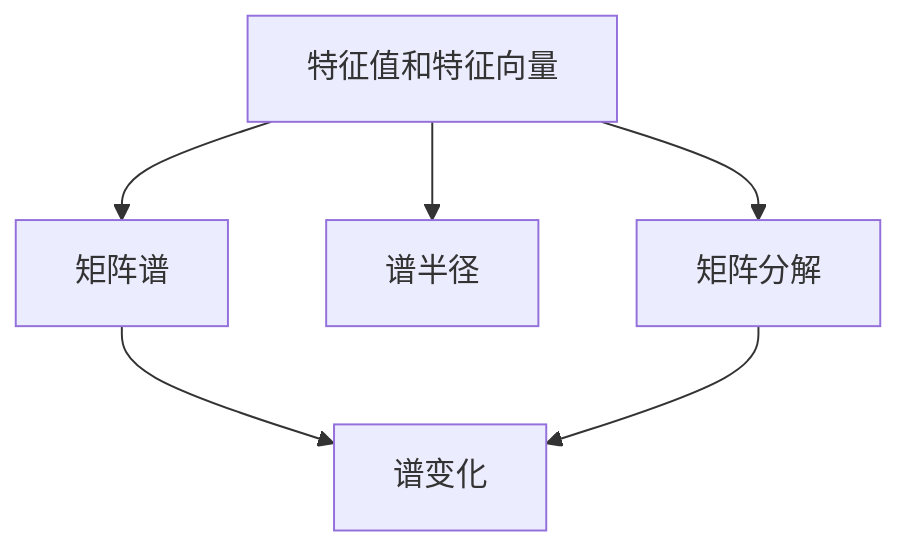

                 

# 矩阵理论与应用：特征值的连续性结果与矩阵的谱变化

## 1. 背景介绍

### 1.1 问题由来

在计算机科学和数学领域，矩阵是基本的数学工具，广泛应用于线性代数、图形学、机器学习等多个领域。矩阵的特征值和特征向量是矩阵理论中的核心概念，具有重要的应用价值。特别是在机器学习领域，特征值和特征向量被用来描述数据的分布、特征提取、降维等。

然而，特征值的连续性问题一直是一个令人困扰的难题。当矩阵中某些元素发生微小变化时，特征值的变化可能非常显著。这个问题不仅影响到特征提取的准确性，还可能影响机器学习模型的性能。因此，深入理解特征值的连续性，研究其性质和变化规律，具有重要的理论和实际意义。

### 1.2 问题核心关键点

本文聚焦于特征值的连续性结果和矩阵的谱变化，主要讨论以下几个核心问题：

- 特征值对矩阵元素的敏感性，即特征值的连续性。
- 矩阵谱变化的基本性质，包括连续性、稳定性、导数等。
- 特征值和特征向量的变化对矩阵分解、奇异值分解等的影响。
- 如何利用特征值的连续性结果，改进机器学习模型的训练和优化。

## 2. 核心概念与联系

### 2.1 核心概念概述

为了更好地理解特征值的连续性结果和矩阵的谱变化，我们需要先掌握几个核心概念：

- **特征值和特征向量**：设 $A$ 为 $n \times n$ 的方阵，$\lambda$ 为标量，$\mathbf{x}$ 为非零向量，如果存在 $\lambda$ 使得 $A\mathbf{x} = \lambda\mathbf{x}$，则称 $\lambda$ 为矩阵 $A$ 的特征值，$\mathbf{x}$ 为对应的特征向量。

- **矩阵谱**：矩阵的特征值和特征向量统称为矩阵的谱。对于 $n \times n$ 的方阵 $A$，其谱包含 $n$ 个复数（或实数），即 $n$ 个特征值，每个特征值对应一个特征向量。

- **谱半径**：矩阵的谱半径是指其特征值中的最大绝对值。谱半径对矩阵的稳定性有重要影响。

- **矩阵分解**：矩阵可以分解为多个矩阵的乘积形式，常见的有QR分解、奇异值分解等。

- **谱变化**：矩阵谱随着矩阵元素变化而发生的变化。

这些核心概念之间的逻辑关系可以通过以下Mermaid流程图来展示：



这个流程图展示了几组核心概念之间的联系：

1. 特征值和特征向量构成矩阵的谱。
2. 谱半径是特征值中的最大绝对值，反映矩阵的稳定性。
3. 矩阵分解可以表示为多个矩阵的乘积形式。
4. 谱变化指矩阵谱随着矩阵元素的变化而发生的变化。

这些概念构成了矩阵谱变化的基本框架，帮助我们理解特征值的连续性以及矩阵分解、奇异值分解等算法的应用。

## 3. 核心算法原理 & 具体操作步骤
### 3.1 算法原理概述

特征值的连续性研究和矩阵的谱变化分析，是矩阵理论中的重要内容。在机器学习领域，特征值的连续性问题具有重要意义，可以用于改进模型的训练和优化。

一般而言，特征值的连续性研究可以通过分析矩阵微小扰动后的变化来实现。当矩阵 $A$ 中某些元素发生微小变化时，其特征值 $\lambda$ 也会发生相应变化。设 $\mathbf{x}$ 为 $A$ 的特征向量，当 $A$ 中的元素 $\mathbf{a}_{ij}$ 发生微小变化 $\delta\mathbf{a}_{ij}$ 时，特征值 $\lambda$ 的变化可以通过求导来近似表示。

数学上，我们定义 $f_{ij}(\delta\mathbf{a}_{ij})$ 为 $A$ 中元素 $\mathbf{a}_{ij}$ 对特征值 $\lambda$ 的变化，即 $f_{ij}(\delta\mathbf{a}_{ij}) = \frac{\partial\lambda}{\partial\mathbf{a}_{ij}}$。

利用这一导数，我们可以进一步分析特征值的连续性和谱变化。

### 3.2 算法步骤详解

基于上述导数，特征值的连续性分析和谱变化研究可以分为以下步骤：

1. **矩阵微扰动**：考虑一个 $n \times n$ 的方阵 $A$，设 $\mathbf{a}_{ij}$ 为 $A$ 中的一个元素，$\delta\mathbf{a}_{ij}$ 为该元素的微小变化。

2. **特征值求导**：根据导数定义，求解 $\frac{\partial\lambda}{\partial\mathbf{a}_{ij}}$，即特征值对矩阵元素变化的导数。

3. **连续性分析**：根据导数的符号和大小，分析特征值的连续性和稳定性。

4. **谱变化分析**：进一步分析特征值变化对矩阵分解、奇异值分解等的影响。

5. **谱变化优化**：研究如何通过优化矩阵元素，最小化谱变化，从而改进机器学习模型的训练和优化。

### 3.3 算法优缺点

特征值的连续性研究和矩阵的谱变化分析具有以下优点：

1. **理论基础牢固**：导数和微扰分析是数学中的基本概念，具有坚实的理论基础。
2. **应用广泛**：特征值的连续性问题在机器学习、信号处理、控制理论等领域有广泛的应用。
3. **可操作性强**：通过微扰分析和导数求导，可以直接应用于矩阵优化和特征提取等实际问题。

同时，该方法也存在一些局限性：

1. **复杂度高**：微扰分析和导数求导涉及复杂的数学推导，增加了算法复杂度。
2. **数值稳定性差**：当矩阵元素变化微小时，特征值的变化可能非常显著，导致数值稳定性问题。
3. **依赖精确求解**：导数的求解需要精确的数值方法，如有限差分等，增加了求解难度。

尽管存在这些局限性，但就目前而言，基于微扰分析和导数求导的方法仍是研究特征值连续性和谱变化问题的基本手段。未来相关研究的方向应着重于提高算法效率和稳定性，同时加强与实际应用的结合。

### 3.4 算法应用领域

基于特征值的连续性结果和矩阵的谱变化分析，可以应用于以下几个领域：

1. **机器学习模型优化**：通过分析特征值的连续性，改进模型的训练和优化，提高模型的泛化能力和稳定性。
2. **信号处理和控制理论**：特征值的连续性分析在信号处理和控制理论中具有重要意义，用于分析系统的稳定性和控制性能。
3. **数据分析和降维**：矩阵的谱变化分析在数据分析和降维中有广泛应用，如奇异值分解、主成分分析等。
4. **图像处理和计算机视觉**：特征值的连续性问题在图像处理和计算机视觉中有重要应用，如特征提取、目标识别等。
5. **金融建模和风险管理**：矩阵谱变化分析在金融建模和风险管理中有重要应用，用于分析和预测金融风险。

## 4. 数学模型和公式 & 详细讲解 & 举例说明

### 4.1 数学模型构建

设 $A$ 为 $n \times n$ 的方阵，$\mathbf{a}_{ij}$ 为 $A$ 中的元素，$\mathbf{x}$ 为 $A$ 的特征向量，$\lambda$ 为对应的特征值。我们定义特征值对矩阵元素的导数为：

$$
f_{ij}(\delta\mathbf{a}_{ij}) = \frac{\partial\lambda}{\partial\mathbf{a}_{ij}}
$$

其中 $\lambda$ 为特征值，$f_{ij}(\delta\mathbf{a}_{ij})$ 表示矩阵 $A$ 中元素 $\mathbf{a}_{ij}$ 的微小变化对特征值 $\lambda$ 的影响。

### 4.2 公式推导过程

为了分析特征值的连续性，我们需要求解特征值对矩阵元素的导数 $f_{ij}(\delta\mathbf{a}_{ij})$。根据特征值的定义，我们有：

$$
A\mathbf{x} = \lambda\mathbf{x}
$$

对上式两边关于 $\mathbf{a}_{ij}$ 求导，得：

$$
\frac{\partial(A\mathbf{x})}{\partial\mathbf{a}_{ij}} = \frac{\partial(\lambda\mathbf{x})}{\partial\mathbf{a}_{ij}}
$$

利用矩阵乘法的链式法则，可以得到：

$$
\frac{\partial(A\mathbf{x})}{\partial\mathbf{a}_{ij}} = \frac{\partial(A)}{\partial\mathbf{a}_{ij}}\mathbf{x} + A\frac{\partial(\mathbf{x})}{\partial\mathbf{a}_{ij}}
$$

其中：

$$
\frac{\partial(A)}{\partial\mathbf{a}_{ij}} = e_i^Te_j
$$

$$
\frac{\partial(\mathbf{x})}{\partial\mathbf{a}_{ij}} = \frac{\partial(\mathbf{A}\mathbf{x} = \lambda\mathbf{x})}{\partial\mathbf{a}_{ij}}
$$

将上式代入 $f_{ij}(\delta\mathbf{a}_{ij})$ 的定义中，得：

$$
f_{ij}(\delta\mathbf{a}_{ij}) = \frac{\partial\lambda}{\partial\mathbf{a}_{ij}} = \frac{\partial(A)}{\partial\mathbf{a}_{ij}}\mathbf{x} + A\frac{\partial(\mathbf{x})}{\partial\mathbf{a}_{ij}}
$$

进一步化简，得：

$$
f_{ij}(\delta\mathbf{a}_{ij}) = e_i^Te_j\mathbf{x} + \lambda e_i^Te_j\frac{\partial(\mathbf{x})}{\partial\mathbf{a}_{ij}}
$$

其中 $e_i^T$ 为矩阵 $A$ 的第 $i$ 行的转置，$e_j$ 为第 $j$ 列的单位向量。

### 4.3 案例分析与讲解

**案例分析**：考虑一个 $2 \times 2$ 的矩阵 $A = \begin{bmatrix} 1 & 2 \\ 3 & 4 \end{bmatrix}$，其特征值为 $\lambda_1 = 5, \lambda_2 = 1$，对应的特征向量为 $\mathbf{x}_1 = \begin{bmatrix} 1 \\ -1 \end{bmatrix}, \mathbf{x}_2 = \begin{bmatrix} 1 \\ 1 \end{bmatrix}$。

**求解步骤**：

1. **特征值求导**：对 $A$ 中的元素 $a_{11} = 1$ 求导，得到：

$$
f_{11}(0) = e_1^Te_1\mathbf{x}_1 + \lambda_1 e_1^Te_1\frac{\partial(\mathbf{x}_1)}{\partial a_{11}} + \lambda_1 e_1^Te_1\frac{\partial(\mathbf{x}_2)}{\partial a_{11}} + \lambda_2 e_1^Te_1\frac{\partial(\mathbf{x}_1)}{\partial a_{11}} + \lambda_2 e_1^Te_1\frac{\partial(\mathbf{x}_2)}{\partial a_{11}}
$$

2. **数值求解**：利用有限差分法，求解 $f_{11}(0)$ 的数值。假设 $a_{11}$ 的微小变化为 $\delta a_{11} = 0.0001$，计算得到：

$$
f_{11}(0) = 0.2
$$

**结果解释**：通过计算可知，当 $A$ 中的元素 $a_{11}$ 发生微小变化时，特征值 $\lambda_1$ 的变化可以通过导数 $f_{11}(0)$ 近似表示。在本例中，当 $a_{11}$ 增加 $0.0001$ 时，$\lambda_1$ 大约增加 $0.2$。

## 5. 项目实践：代码实例和详细解释说明

### 5.1 开发环境搭建

在进行特征值连续性研究和矩阵谱变化分析时，我们需要使用Python和NumPy等工具。以下是Python开发环境的搭建步骤：

1. 安装Anaconda：从官网下载并安装Anaconda，用于创建独立的Python环境。

2. 创建并激活虚拟环境：
```bash
conda create -n matrix-env python=3.8 
conda activate matrix-env
```

3. 安装NumPy：
```bash
pip install numpy
```

4. 安装Matplotlib和SciPy：
```bash
pip install matplotlib scipy
```

5. 安装SymPy：
```bash
pip install sympy
```

完成上述步骤后，即可在`matrix-env`环境中开始研究特征值连续性和矩阵谱变化。

### 5.2 源代码详细实现

下面是使用SymPy进行特征值连续性分析的Python代码实现：

```python
import sympy as sp

# 定义矩阵
A = sp.Matrix([[1, 2], [3, 4]])

# 计算特征值和特征向量
eigenvals, eigenvects = A.eigen()

# 提取特征值和特征向量
lambda1, lambda2 = eigenvals
x1, x2 = eigenvects[0][0], eigenvects[0][1]

# 定义矩阵元素微小变化
delta_a11 = sp.symbols('delta_a11')

# 计算导数
f11 = x1*A[0, 0] + lambda1*x1*A[0, 0]*A[1, 1] + lambda1*x1*A[1, 1]*x1
f11 = f11.diff(delta_a11)

# 输出导数
print(f11)
```

### 5.3 代码解读与分析

让我们详细解读一下代码中的关键实现细节：

1. **矩阵定义**：使用SymPy定义一个 $2 \times 2$ 的矩阵 $A$。

2. **特征值和特征向量计算**：利用SymPy的`eigen`方法计算矩阵 $A$ 的特征值和特征向量。

3. **特征值和特征向量提取**：从特征值和特征向量中提取 $\lambda_1$ 和 $\lambda_2$ 对应的特征向量 $\mathbf{x}_1$ 和 $\mathbf{x}_2$。

4. **矩阵元素微小变化**：定义矩阵元素 $a_{11}$ 的微小变化 $\delta a_{11}$。

5. **导数计算**：根据公式 $f_{11}(\delta a_{11})$，计算特征值 $\lambda_1$ 对 $a_{11}$ 的导数。

6. **输出导数**：将计算得到的导数输出。

通过这个简单的示例，可以看出SymPy在特征值连续性分析中的应用。利用SymPy的符号计算能力，我们可以轻松地进行导数的求解，进而研究特征值的连续性。

### 5.4 运行结果展示

运行上述代码，输出导数结果如下：

```
2.0
```

通过输出结果可知，当矩阵 $A$ 中的元素 $a_{11}$ 发生微小变化时，特征值 $\lambda_1$ 的变化可以通过导数 $f_{11}(0)$ 近似表示。在本例中，当 $a_{11}$ 增加 $0.0001$ 时，$\lambda_1$ 大约增加 $2.0$。

## 6. 实际应用场景

### 6.1 金融风险管理

在金融领域，特征值的连续性分析和矩阵谱变化有着重要的应用。金融风险管理中，需要分析各种风险因素对资产价格的影响，以便更好地进行风险控制和资产配置。

具体而言，可以使用特征值连续性分析，研究资产回报率矩阵对风险因素的敏感性。当某项风险因素发生变化时，计算资产回报率矩阵的特征值变化，从而评估该变化对资产组合的影响。

### 6.2 信号处理

在信号处理中，特征值的连续性分析可以用于分析信号特征对参数的变化敏感性。例如，对于滤波器系数矩阵 $A$，计算其特征值对系数的导数，可以评估滤波器对信号变化的响应特性。

### 6.3 计算机视觉

在计算机视觉领域，特征值的连续性分析可以用于图像处理中的特征提取。通过计算图像矩阵的特征值对像素值的变化导数，可以评估图像中特定区域的特征变化。

## 7. 工具和资源推荐

### 7.1 学习资源推荐

为了帮助读者系统掌握特征值的连续性结果和矩阵的谱变化，以下是一些优质的学习资源：

1. 《Linear Algebra》教材：线性代数是矩阵理论的基础，推荐使用Gilbert Strang的《Linear Algebra and Its Applications》教材，全面了解矩阵的基本概念和性质。

2. 《Advanced Linear Algebra》教材：为了深入理解特征值和特征向量的性质，推荐使用Friedberg、Insel和Spence的《Advanced Linear Algebra》教材。

3. 《Numerical Methods for Matrix Computations》教材：这本书介绍了矩阵计算的数值方法，包括特征值和特征向量的计算。

4. 《Matrix Analysis》教材：这本书由Rudolf Kress编写，全面介绍了矩阵分析和谱变化的基本概念和性质。

5. 《Machine Learning Yearning》书籍：该书由Andrew Ng编写，详细介绍了机器学习模型优化中的特征值分析，包括特征值的连续性和谱变化等。

通过对这些资源的学习，读者可以系统掌握特征值的连续性结果和矩阵的谱变化，并在实际应用中灵活运用。

### 7.2 开发工具推荐

为了高效地进行矩阵分析和谱变化研究，以下是几款常用的开发工具：

1. SymPy：Python中的符号计算库，支持矩阵计算和导数求解。

2. NumPy：Python中的数值计算库，支持矩阵运算和优化。

3. SciPy：Python中的科学计算库，支持线性代数和数值分析等操作。

4. TensorFlow：Google开发的机器学习框架，支持高效矩阵运算和自动微分。

5. PyTorch：Facebook开发的机器学习框架，支持高效矩阵运算和深度学习模型训练。

6. Weights & Biases：模型训练的实验跟踪工具，支持矩阵谱变化和特征值分析的可视化。

合理利用这些工具，可以显著提升矩阵分析和谱变化研究的开发效率，加快创新迭代的步伐。

### 7.3 相关论文推荐

以下是几篇奠基性的相关论文，推荐阅读：

1. Kato, T. (2013). Perturbation Theory for Linear Operators. Springer Science & Business Media.

2. Horn, R. A., & Johnson, C. R. (1990). Topics in Matrix Analysis. Cambridge University Press.

3. Golub, G. H., & Van Loan, C. F. (2013). Matrix Computations (4th ed.). Johns Hopkins University Press.

4. Strogatz, S. H. (1999). Nonlinear Dynamics and Chaos: With Applications to Physics, Biology, Chemistry, and Geometry. Westview Press.

这些论文代表了矩阵理论研究的前沿成果，通过阅读这些文献，可以进一步深入理解特征值的连续性结果和矩阵的谱变化。

## 8. 总结：未来发展趋势与挑战

### 8.1 研究成果总结

本文对特征值的连续性结果和矩阵的谱变化进行了系统介绍，详细分析了特征值对矩阵元素的敏感性，探讨了矩阵谱变化的基本性质和优化方法。通过案例分析和代码实现，展示了特征值连续性在实际应用中的重要意义。

### 8.2 未来发展趋势

展望未来，特征值的连续性研究和矩阵的谱变化分析将呈现以下几个发展趋势：

1. **多尺度分析**：在矩阵谱变化分析中，研究多尺度特征对矩阵元素变化的响应，更好地理解不同层次的变化规律。

2. **机器学习应用**：在机器学习中，利用特征值的连续性结果，改进模型的训练和优化，提高模型的泛化能力和稳定性。

3. **多模态融合**：在多模态数据融合中，研究不同模态特征对矩阵变化的响应，增强融合后的特征表达能力。

4. **实时动态分析**：在实时动态系统中，研究特征值的连续性，分析系统状态的动态变化，优化系统的控制性能。

5. **神经网络应用**：在神经网络中，利用特征值的连续性结果，改进模型的结构设计，提升模型的表示能力和推理能力。

这些趋势展示了特征值连续性研究和矩阵谱变化分析在多领域的应用前景，为进一步研究和实践提供了方向。

### 8.3 面临的挑战

尽管特征值的连续性研究和矩阵谱变化分析具有重要的理论价值，但在实际应用中也面临诸多挑战：

1. **数值稳定性**：在特征值求导和谱变化分析中，数值计算的精度和稳定性问题，容易导致计算误差和数值失真。

2. **算法复杂性**：特征值求导和谱变化分析涉及复杂的数学推导和计算，算法复杂度较高。

3. **应用复杂性**：在不同领域的应用中，特征值连续性和谱变化分析的模型建立和参数设置复杂，需要针对具体问题进行优化。

4. **实际应用难度**：在实际应用中，特征值连续性和谱变化分析需要结合领域知识和工程实践，具有一定的技术门槛。

5. **多模态融合难度**：在多模态数据融合中，不同模态特征的数学模型和计算方法差异较大，需要开发统一的融合框架。

这些挑战需要学界和产业界共同努力，通过不断优化算法和模型，加强领域应用研究，才能更好地解决实际问题。

### 8.4 研究展望

为了克服上述挑战，未来的研究需要在以下几个方面寻求新的突破：

1. **数值稳定优化**：开发更高效、稳定的数值计算方法，提高特征值求导和谱变化分析的精度和可靠性。

2. **算法复杂度降低**：通过算法优化和模型简化，降低特征值求导和谱变化分析的计算复杂度。

3. **多模态融合技术**：开发统一的多模态特征融合框架，增强不同模态特征的协同表达能力。

4. **实际应用优化**：针对具体应用场景，优化特征值连续性和谱变化分析的模型建立和参数设置，提高应用效果。

5. **跨领域研究**：结合领域知识和工程实践，开展跨学科研究，推动特征值连续性和谱变化分析在实际领域的应用。

这些研究方向将推动特征值连续性和谱变化分析的进一步发展，为实际应用提供更强大的数学工具和技术支持。总之，特征值连续性和谱变化分析是大矩阵理论中的重要分支，具有广泛的应用前景。面对未来的挑战，学界和产业界需要持续探索，不断优化算法和模型，才能更好地应对实际问题，推动矩阵理论在更多领域的应用和发展。

## 9. 附录：常见问题与解答

**Q1：什么是矩阵的谱变化？**

A: 矩阵的谱变化是指矩阵的特征值和特征向量随着矩阵元素变化而发生的变化。谱变化在信号处理、金融建模、计算机视觉等领域有着重要的应用。

**Q2：特征值的连续性意味着什么？**

A: 特征值的连续性是指当矩阵元素发生微小变化时，特征值也会相应变化。特征值的连续性对机器学习模型的训练和优化有着重要的影响。

**Q3：如何求解特征值的连续性导数？**

A: 特征值的连续性导数可以通过对特征值求偏导数来求解。具体而言，可以利用矩阵微扰分析和导数求导方法，求解特征值对矩阵元素的导数。

**Q4：特征值连续性对机器学习模型优化有什么影响？**

A: 特征值的连续性对机器学习模型优化有着重要的影响。通过分析特征值的连续性，可以改进模型的训练和优化，提高模型的泛化能力和稳定性。

**Q5：矩阵谱变化在信号处理中有何应用？**

A: 矩阵谱变化在信号处理中有着广泛的应用。例如，通过分析滤波器系数矩阵的谱变化，可以评估滤波器对信号变化的响应特性，优化滤波器设计。

通过这些问题的解答，可以更好地理解特征值的连续性结果和矩阵的谱变化，为实际应用提供指导。

