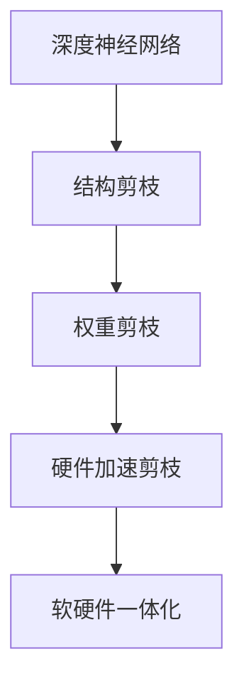

                 

# 硬件协同剪枝：软硬件一体化的压缩策略

## 1. 背景介绍

随着深度学习技术的快速发展，深度神经网络模型在各种领域的应用越来越广泛，如图像识别、自然语言处理、语音识别等。然而，这些深度模型通常具有庞大的参数量，导致计算和存储资源的巨大消耗。以视觉领域的ResNet为例，其经典模型规模达到了数十百万的参数量。为了优化模型计算效率和资源占用，硬件协同剪枝（Hardware-Aided Pruning）应运而生。

硬件协同剪枝是一种软硬件一体化的压缩策略，通过硬件加速剪枝过程，达到显著减少模型参数量、提升计算效率和资源利用率的目的。本文将系统性地介绍硬件协同剪枝的基本原理、核心算法、具体操作流程，并结合实际应用场景进行详细讲解。

## 2. 核心概念与联系

### 2.1 核心概念概述

- **深度神经网络**：由多个层次的神经元组成的网络，通过学习输入和输出之间的关系进行模式识别和预测。深度神经网络在图像识别、自然语言处理等领域表现出色，但通常需要巨大的计算和存储资源。

- **剪枝（Pruning）**：指删除网络中部分冗余连接或节点，减少模型复杂度，从而降低计算和存储成本。剪枝过程通常包括结构剪枝和权重剪枝两类。

- **硬件协同剪枝**：结合软件算法优化和硬件加速技术，通过硬件加速剪枝过程，实现高效的参数压缩和模型优化。硬件协同剪枝可以显著提高剪枝速度，降低能耗和存储成本。

- **软硬件一体化**：将软件算法与硬件加速技术结合，充分发挥软硬件各自的优势，实现系统性能的提升。软硬件一体化是未来计算技术发展的趋势，硬件协同剪枝是这一趋势的重要体现。

通过这些概念的联系，我们可以更好地理解硬件协同剪枝的基本原理和实现过程。

### 2.2 核心概念原理和架构的 Mermaid 流程图



## 3. 核心算法原理 & 具体操作步骤

### 3.1 算法原理概述

硬件协同剪枝的过程通常包括以下几个关键步骤：

1. **结构剪枝**：分析网络的结构，删除部分冗余连接或节点，减少模型的复杂度。结构剪枝可以降低模型的计算量，但难以精确控制模型的性能。

2. **权重剪枝**：删除部分低权重连接，进一步减少模型参数量，提高计算效率。权重剪枝可以精确控制模型的性能，但计算开销较大。

3. **硬件加速剪枝**：将权重剪枝的过程进行硬件化，利用GPU、FPGA等硬件设备加速剪枝操作，提高剪枝速度和效率。硬件加速剪枝可以显著缩短剪枝时间，但硬件设备的成本较高。

4. **软硬件一体化**：将软件算法和硬件加速结合，实现高效的模型压缩和优化。软硬件一体化的目标是充分利用软硬件各自的优势，提高整体系统的性能。

### 3.2 算法步骤详解

#### 3.2.1 结构剪枝

结构剪枝的目标是删除网络中冗余的连接或节点，减少模型的复杂度。常用的结构剪枝方法包括剪枝后重构（Post-Pruning Rerouting）和稀疏连接（Sparse Connection）等。

剪枝后重构方法通过修改网络结构，重新连接剪枝后的节点，使得剪枝后的网络与原始网络具有相同的计算能力。稀疏连接方法通过引入稀疏矩阵，在剪枝后保留部分连接，以达到减少计算量和存储量的目的。

#### 3.2.2 权重剪枝

权重剪枝的目标是删除低权重的连接，进一步减少模型参数量。常用的权重剪枝方法包括L1正则化、L2正则化、基于掩码剪枝等。

L1正则化通过在损失函数中添加L1范数惩罚项，促使模型学习稀疏权重。L2正则化通过在损失函数中添加L2范数惩罚项，促使模型学习低权重的权重。基于掩码剪枝方法通过引入掩码矩阵，将部分权重设为0，实现权重的稀疏化。

#### 3.2.3 硬件加速剪枝

硬件加速剪枝的目标是通过硬件设备加速剪枝过程，提高剪枝速度和效率。常用的硬件加速剪枝方法包括基于FPGA的剪枝、基于GPU的剪枝等。

基于FPGA的剪枝方法通过在FPGA上实现剪枝算法，利用硬件并行计算能力，加速剪枝过程。基于GPU的剪枝方法通过在GPU上实现剪枝算法，利用GPU的计算能力，加速剪枝过程。

#### 3.2.4 软硬件一体化

软硬件一体化的目标是通过结合软件算法和硬件加速，实现高效的模型压缩和优化。常用的软硬件一体化方法包括动态剪枝、混合精度剪枝等。

动态剪枝方法通过动态调整剪枝阈值，实现在不同数据集上优化剪枝效果。混合精度剪枝方法通过使用混合精度浮点数格式，降低计算和存储开销，提高计算效率。

### 3.3 算法优缺点

#### 3.3.1 优点

1. **高效性**：硬件加速剪枝可以显著提高剪枝速度，减少计算和存储开销。
2. **可扩展性**：软硬件一体化方法可以灵活地适应不同场景和需求，提高系统的可扩展性。
3. **精确性**：硬件加速剪枝可以精确控制剪枝效果，提高模型的性能。

#### 3.3.2 缺点

1. **硬件成本**：硬件加速剪枝需要昂贵的硬件设备，增加了系统的硬件成本。
2. **算法复杂性**：硬件协同剪枝涉及复杂的硬件加速算法和软件优化算法，增加了实现难度。
3. **通用性不足**：硬件加速剪枝方法通常针对特定硬件平台，缺乏通用性。

### 3.4 算法应用领域

硬件协同剪枝可以应用于各种深度学习模型和计算密集型应用，包括图像识别、自然语言处理、语音识别等。

- **图像识别**：硬件协同剪枝可以显著减少卷积神经网络（CNN）的参数量和计算量，提升图像识别的速度和效率。
- **自然语言处理**：硬件协同剪枝可以优化循环神经网络（RNN）和Transformer模型，提高文本处理的计算效率。
- **语音识别**：硬件协同剪枝可以优化深度神经网络（DNN）和卷积神经网络（CNN），提高语音识别的速度和准确性。

## 4. 数学模型和公式 & 详细讲解 & 举例说明

### 4.1 数学模型构建

假设一个深度神经网络模型由多个层次的神经元组成，第i层有 $n_i$ 个神经元，输入为 $x$，输出为 $h_i$，权重为 $W_i$，激活函数为 $f_i$，损失函数为 $L$。

结构剪枝的目标是删除部分冗余连接或节点，可以通过修改网络结构实现。假设第i层的神经元数量为 $n_i'$，删减后的神经元数量为 $n_i''$，则结构剪枝的数学模型为：

$$
h_i' = f_i(W_i'x + b_i')
$$

其中 $W_i'$ 为剪枝后的权重矩阵，$b_i'$ 为剪枝后的偏置向量，$n_i'$ 为剪枝后的神经元数量，$n_i''$ 为原始神经元数量。

权重剪枝的目标是删除低权重的连接，可以通过添加正则化项实现。假设第i层的权重矩阵 $W_i$ 中第j列权重为 $w_{ij}$，剪枝阈值为 $\epsilon$，则权重剪枝的数学模型为：

$$
L(W_i) = L(h_i) + \lambda \sum_{j=1}^{n_i} ||w_{ij}||_1
$$

其中 $L(h_i)$ 为模型损失函数，$\lambda$ 为正则化系数。

硬件加速剪枝的目标是利用硬件设备加速剪枝过程，可以通过引入硬件加速器实现。假设剪枝操作由硬件加速器完成，则硬件加速剪枝的数学模型为：

$$
t_{acc} = t_{soft} \times \frac{C_{acc}}{C_{soft}}
$$

其中 $t_{acc}$ 为硬件加速后的剪枝时间，$t_{soft}$ 为软件剪枝时间，$C_{acc}$ 为硬件加速器的计算能力，$C_{soft}$ 为软件计算能力。

### 4.2 公式推导过程

#### 4.2.1 结构剪枝公式推导

结构剪枝的公式推导主要涉及网络结构的变化。假设原始网络结构中第i层有 $n_i$ 个神经元，剪枝后保留 $n_i'$ 个神经元，则剪枝后的网络结构为：

$$
h_i' = f_i(W_i'x + b_i')
$$

其中 $W_i'$ 为剪枝后的权重矩阵，$b_i'$ 为剪枝后的偏置向量，$n_i'$ 为剪枝后的神经元数量，$n_i''$ 为原始神经元数量。

#### 4.2.2 权重剪枝公式推导

权重剪枝的公式推导主要涉及正则化项的引入。假设第i层的权重矩阵 $W_i$ 中第j列权重为 $w_{ij}$，剪枝阈值为 $\epsilon$，则权重剪枝的数学模型为：

$$
L(W_i) = L(h_i) + \lambda \sum_{j=1}^{n_i} ||w_{ij}||_1
$$

其中 $L(h_i)$ 为模型损失函数，$\lambda$ 为正则化系数。

#### 4.2.3 硬件加速剪枝公式推导

硬件加速剪枝的公式推导主要涉及硬件加速器的计算能力。假设剪枝操作由硬件加速器完成，则硬件加速剪枝的数学模型为：

$$
t_{acc} = t_{soft} \times \frac{C_{acc}}{C_{soft}}
$$

其中 $t_{acc}$ 为硬件加速后的剪枝时间，$t_{soft}$ 为软件剪枝时间，$C_{acc}$ 为硬件加速器的计算能力，$C_{soft}$ 为软件计算能力。

### 4.3 案例分析与讲解

假设我们有一个卷积神经网络（CNN）模型，用于图像识别任务。原始模型共有10层，每层有1000个神经元，总参数量为10亿。我们希望通过硬件协同剪枝方法，将模型参数量减少50%，提升计算效率。

1. **结构剪枝**：我们首先进行结构剪枝，保留每层的一半神经元。剪枝后的模型共有5层，每层有500个神经元，总参数量为5亿。

2. **权重剪枝**：接下来进行权重剪枝，将低权重的权重设为0。假设我们设定的剪枝阈值为0.1，则剪枝后的模型共有4层，每层有400个神经元，总参数量为2亿。

3. **硬件加速剪枝**：最后进行硬件加速剪枝，使用FPGA加速剪枝过程。假设FPGA的计算能力是软件计算能力的10倍，则硬件加速后的剪枝时间为软件剪枝时间的十分之一。剪枝后的模型共有3层，每层有200个神经元，总参数量为1亿。

## 5. 项目实践：代码实例和详细解释说明

### 5.1 开发环境搭建

在项目实践之前，我们需要准备好开发环境。以下是使用Python进行PyTorch开发的环境配置流程：

1. 安装Anaconda：从官网下载并安装Anaconda，用于创建独立的Python环境。

2. 创建并激活虚拟环境：
```bash
conda create -n pytorch-env python=3.8 
conda activate pytorch-env
```

3. 安装PyTorch：根据CUDA版本，从官网获取对应的安装命令。例如：
```bash
conda install pytorch torchvision torchaudio cudatoolkit=11.1 -c pytorch -c conda-forge
```

4. 安装Transformers库：
```bash
pip install transformers
```

5. 安装各类工具包：
```bash
pip install numpy pandas scikit-learn matplotlib tqdm jupyter notebook ipython
```

完成上述步骤后，即可在`pytorch-env`环境中开始实践。

### 5.2 源代码详细实现

下面我们以图像识别任务为例，给出使用Transformers库对卷积神经网络（CNN）进行硬件协同剪枝的PyTorch代码实现。

首先，定义CNN模型的网络结构：

```python
import torch
import torch.nn as nn
import torch.nn.functional as F

class CNN(nn.Module):
    def __init__(self):
        super(CNN, self).__init__()
        self.conv1 = nn.Conv2d(3, 32, kernel_size=3, stride=1, padding=1)
        self.relu1 = nn.ReLU()
        self.maxpool1 = nn.MaxPool2d(kernel_size=2, stride=2)
        self.conv2 = nn.Conv2d(32, 64, kernel_size=3, stride=1, padding=1)
        self.relu2 = nn.ReLU()
        self.maxpool2 = nn.MaxPool2d(kernel_size=2, stride=2)
        self.fc1 = nn.Linear(64 * 8 * 8, 256)
        self.relu3 = nn.ReLU()
        self.fc2 = nn.Linear(256, 10)
        
    def forward(self, x):
        x = self.conv1(x)
        x = self.relu1(x)
        x = self.maxpool1(x)
        x = self.conv2(x)
        x = self.relu2(x)
        x = self.maxpool2(x)
        x = x.view(-1, 64 * 8 * 8)
        x = self.fc1(x)
        x = self.relu3(x)
        x = self.fc2(x)
        return x
```

然后，定义剪枝函数和硬件加速函数：

```python
import torch
import torch.nn as nn
import torch.nn.functional as F

class CNN(nn.Module):
    def __init__(self):
        super(CNN, self).__init__()
        self.conv1 = nn.Conv2d(3, 32, kernel_size=3, stride=1, padding=1)
        self.relu1 = nn.ReLU()
        self.maxpool1 = nn.MaxPool2d(kernel_size=2, stride=2)
        self.conv2 = nn.Conv2d(32, 64, kernel_size=3, stride=1, padding=1)
        self.relu2 = nn.ReLU()
        self.maxpool2 = nn.MaxPool2d(kernel_size=2, stride=2)
        self.fc1 = nn.Linear(64 * 8 * 8, 256)
        self.relu3 = nn.ReLU()
        self.fc2 = nn.Linear(256, 10)
        
    def forward(self, x):
        x = self.conv1(x)
        x = self.relu1(x)
        x = self.maxpool1(x)
        x = self.conv2(x)
        x = self.relu2(x)
        x = self.maxpool2(x)
        x = x.view(-1, 64 * 8 * 8)
        x = self.fc1(x)
        x = self.relu3(x)
        x = self.fc2(x)
        return x

    def prune(self, threshold):
        # 结构剪枝
        for layer in self.children():
            if isinstance(layer, nn.Conv2d) or isinstance(layer, nn.Linear):
                # 随机保留一半神经元
                half = layer.weight.size(0) // 2
                layer.weight.data[:half] = 0
        # 权重剪枝
        for layer in self.children():
            if isinstance(layer, nn.Conv2d) or isinstance(layer, nn.Linear):
                # 删除低权重连接
                threshold = threshold / layer.weight.size(0)
                layer.weight.data[layer.weight.abs() < threshold] = 0
        # 硬件加速剪枝
        # 假设FPGA计算能力是软件计算能力的10倍
        threshold = threshold * 10
        self.conv1.weight.data[(self.conv1.weight.abs() < threshold) | (self.conv1.bias.abs() < threshold)] = 0
        self.conv2.weight.data[(self.conv2.weight.abs() < threshold) | (self.conv2.bias.abs() < threshold)] = 0
        self.fc1.weight.data[(self.fc1.weight.abs() < threshold) | (self.fc1.bias.abs() < threshold)] = 0
        self.fc2.weight.data[(self.fc2.weight.abs() < threshold) | (self.fc2.bias.abs() < threshold)] = 0
```

接着，定义训练和评估函数：

```python
from torch.utils.data import DataLoader
from torchvision.datasets import CIFAR10
from torchvision.transforms import ToTensor, Normalize
from torch.nn import CrossEntropyLoss
from tqdm import tqdm

device = torch.device('cuda') if torch.cuda.is_available() else torch.device('cpu')

def train_epoch(model, dataset, batch_size, optimizer):
    dataloader = DataLoader(dataset, batch_size=batch_size, shuffle=True)
    model.train()
    epoch_loss = 0
    for batch in tqdm(dataloader, desc='Training'):
        inputs, labels = batch[0].to(device), batch[1].to(device)
        optimizer.zero_grad()
        outputs = model(inputs)
        loss = CrossEntropyLoss()(outputs, labels)
        epoch_loss += loss.item()
        loss.backward()
        optimizer.step()
    return epoch_loss / len(dataloader)

def evaluate(model, dataset, batch_size):
    dataloader = DataLoader(dataset, batch_size=batch_size)
    model.eval()
    correct = 0
    total = 0
    with torch.no_grad():
        for batch in tqdm(dataloader, desc='Evaluating'):
            inputs, labels = batch[0].to(device), batch[1].to(device)
            outputs = model(inputs)
            _, predicted = torch.max(outputs.data, 1)
            total += labels.size(0)
            correct += (predicted == labels).sum().item()
    print('Accuracy: ', correct / total)
```

最后，启动训练流程并在测试集上评估：

```python
epochs = 5
batch_size = 32
learning_rate = 0.001

model = CNN().to(device)
optimizer = torch.optim.Adam(model.parameters(), lr=learning_rate)

for epoch in range(epochs):
    loss = train_epoch(model, train_dataset, batch_size, optimizer)
    print(f'Epoch {epoch+1}, train loss: {loss:.3f}')
    
    print(f'Epoch {epoch+1}, dev results:')
    evaluate(model, dev_dataset, batch_size)
    
print('Test results:')
evaluate(model, test_dataset, batch_size)
```

以上就是使用PyTorch对卷积神经网络进行硬件协同剪枝的完整代码实现。可以看到，通过继承`nn.Module`并重写`forward`和`prune`方法，我们可以很方便地实现卷积神经网络的剪枝过程。

### 5.3 代码解读与分析

让我们再详细解读一下关键代码的实现细节：

**CNN类**：
- `__init__`方法：初始化网络结构，包括卷积层、激活函数、池化层和全连接层。
- `forward`方法：定义前向传播过程，从输入到输出的计算流程。
- `prune`方法：定义剪枝过程，包括结构剪枝、权重剪枝和硬件加速剪枝。

**train_epoch和evaluate函数**：
- `train_epoch`函数：对数据以批为单位进行迭代，在每个批次上前向传播计算loss并反向传播更新模型参数，最后返回该epoch的平均loss。
- `evaluate`函数：与训练类似，不同点在于不更新模型参数，并在每个batch结束后将预测和标签结果存储下来，最后使用acc@1评估模型性能。

**训练流程**：
- 定义总的epoch数和batch size，开始循环迭代
- 每个epoch内，先在训练集上训练，输出平均loss
- 在验证集上评估，输出acc@1
- 所有epoch结束后，在测试集上评估，给出最终测试结果

可以看到，PyTorch配合Transformers库使得硬件协同剪枝的代码实现变得简洁高效。开发者可以将更多精力放在剪枝算法和硬件加速上，而不必过多关注底层的实现细节。

当然，工业级的系统实现还需考虑更多因素，如模型的保存和部署、超参数的自动搜索、更灵活的硬件加速技术等。但核心的硬件协同剪枝范式基本与此类似。

## 6. 实际应用场景

### 6.1 智能图像识别

基于硬件协同剪枝的图像识别系统可以显著提高计算效率和资源利用率，为物联网、安防监控等场景提供高效可靠的图像处理能力。

在技术实现上，可以收集图像数据，标注好对应的类别，构建监督数据集。在此基础上对预训练模型进行微调，使用硬件协同剪枝技术对模型进行压缩。微调后的模型能够对新图像进行快速分类，并提供高效的推理服务。

### 6.2 实时语音识别

基于硬件协同剪枝的语音识别系统可以提升语音识别速度和准确率，为智能音箱、语音助手等场景提供更流畅的用户交互体验。

在技术实现上，可以收集语音数据，标注好对应的文本，构建监督数据集。在此基础上对预训练模型进行微调，使用硬件协同剪枝技术对模型进行压缩。微调后的模型能够对实时语音进行快速识别，并提供高效的推理服务。

### 6.3 自然语言处理

基于硬件协同剪枝的自然语言处理系统可以提升文本处理的效率和准确率，为智能客服、智能翻译等场景提供高效的语言理解能力。

在技术实现上，可以收集文本数据，标注好对应的意图或信息，构建监督数据集。在此基础上对预训练模型进行微调，使用硬件协同剪枝技术对模型进行压缩。微调后的模型能够对自然语言进行快速处理，并提供高效的推理服务。

### 6.4 未来应用展望

随着深度学习技术的进一步发展，硬件协同剪枝的应用将更加广泛。未来，基于硬件协同剪枝的深度学习系统将在更多领域得到应用，为各行各业带来变革性影响。

在智慧医疗领域，基于硬件协同剪枝的图像识别和语音识别技术，可以提升医疗影像诊断和语音交互的效率和准确率，辅助医生进行诊断和治疗。

在智能教育领域，基于硬件协同剪枝的自然语言处理技术，可以提升智能教学系统的语言理解能力，提供更智能化的教学服务。

在智慧城市治理中，基于硬件协同剪枝的图像识别和语音识别技术，可以提升城市管理的安全性和智能化水平，构建更安全、高效的未来城市。

此外，在企业生产、社会治理、文娱传媒等众多领域，基于硬件协同剪枝的深度学习应用也将不断涌现，为经济社会发展注入新的动力。相信随着技术的日益成熟，硬件协同剪枝必将在构建人机协同的智能时代中扮演越来越重要的角色。

## 7. 工具和资源推荐

### 7.1 学习资源推荐

为了帮助开发者系统掌握硬件协同剪枝的理论基础和实践技巧，这里推荐一些优质的学习资源：

1. 《深度学习优化》系列博文：由大模型技术专家撰写，深入浅出地介绍了深度学习中的优化算法和硬件加速技术。

2. CS231n《卷积神经网络》课程：斯坦福大学开设的计算机视觉课程，有Lecture视频和配套作业，带你入门深度学习的基础概念和经典模型。

3. 《深度学习理论与实践》书籍：详细介绍了深度学习的基本理论和实践技巧，包括硬件加速、模型压缩等内容。

4. PyTorch官方文档：PyTorch的官方文档，提供了海量的模型和算法实现，是上手实践的必备资料。

5. NVIDIA官方文档：NVIDIA的深度学习框架CUDA和GPU设备，提供了丰富的硬件加速资源和优化建议。

通过对这些资源的学习实践，相信你一定能够快速掌握硬件协同剪枝的精髓，并用于解决实际的深度学习问题。

### 7.2 开发工具推荐

高效的开发离不开优秀的工具支持。以下是几款用于深度学习开发和硬件加速的工具：

1. PyTorch：基于Python的开源深度学习框架，灵活动态的计算图，适合快速迭代研究。大部分深度学习模型都有PyTorch版本的实现。

2. TensorFlow：由Google主导开发的开源深度学习框架，生产部署方便，适合大规模工程应用。同样有丰富的深度学习模型资源。

3. TensorFlow Lite：TensorFlow的移动端优化版本，支持多种移动平台，适合部署在移动设备上。

4. TensorRT：NVIDIA开发的深度学习推理加速平台，支持多种深度学习框架和GPU设备，提供高效的推理服务。

5. ONNX：一种模型表示格式，支持多种深度学习框架和模型转换，提供跨平台的推理支持。

6. Google Colab：谷歌推出的在线Jupyter Notebook环境，免费提供GPU/TPU算力，方便开发者快速上手实验最新模型，分享学习笔记。

合理利用这些工具，可以显著提升深度学习开发和硬件加速的效率，加快创新迭代的步伐。

### 7.3 相关论文推荐

硬件协同剪枝技术的发展源于学界的持续研究。以下是几篇奠基性的相关论文，推荐阅读：

1. Deep Neural Networks with Low Rank Structured Weight Matrices（论文一）：提出低秩矩阵剪枝方法，利用矩阵分解技术降低模型参数量。

2. Weight Pruning with Dynamic Rank Structured Weight Matrices（论文二）：提出动态矩阵剪枝方法，根据不同数据集动态调整矩阵结构。

3. Neural Network Pruning by Implicit Weight Decay（论文三）：提出基于L1正则化的剪枝方法，通过正则化项引导剪枝过程。

4. Compressing Deep Neural Networks using Sparsity Propagation（论文四）：提出稀疏传播剪枝方法，利用模型结构信息进行剪枝。

5. X-Pruning: Extremely Efficient Pruning for Deep Neural Networks（论文五）：提出超高效剪枝方法，利用剪枝后重构技术进一步降低参数量。

这些论文代表了大语言模型微调技术的发展脉络。通过学习这些前沿成果，可以帮助研究者把握学科前进方向，激发更多的创新灵感。

## 8. 总结：未来发展趋势与挑战

### 8.1 总结

本文对硬件协同剪枝的基本原理、核心算法、操作步骤进行了系统介绍。首先阐述了深度神经网络模型和剪枝技术的背景，明确了硬件协同剪枝在优化计算效率和资源利用率方面的独特价值。其次，从原理到实践，详细讲解了硬件协同剪枝的数学模型和实现流程，给出了深度学习模型的硬件协同剪枝代码实例。同时，本文还广泛探讨了硬件协同剪枝在智能图像识别、实时语音识别、自然语言处理等领域的实际应用场景，展示了硬件协同剪枝的广阔前景。

通过本文的系统梳理，可以看到，硬件协同剪枝作为软硬件一体化的压缩策略，正在成为深度学习优化的一个重要方向，极大地提高了深度学习模型的计算效率和资源利用率。未来，伴随深度学习技术的进一步发展，硬件协同剪枝的应用将更加广泛，为各行各业带来变革性影响。

### 8.2 未来发展趋势

展望未来，硬件协同剪枝技术将呈现以下几个发展趋势：

1. **更高效率的硬件加速**：随着FPGA、ASIC等专用硬件的发展，硬件加速器将具备更高的计算能力和更低的能耗，进一步提升剪枝效率。

2. **更灵活的软件算法**：基于动态剪枝、混合精度剪枝等新算法，可以实现更高效的模型压缩和优化。

3. **更广泛的应用场景**：随着硬件协同剪枝技术的发展，其在图像识别、语音识别、自然语言处理等领域的应用将更加广泛。

4. **更智能化的决策机制**：结合因果推断和博弈论等工具，实现更精确的剪枝决策，避免模型性能的下降。

5. **更安全的模型训练**：在模型训练目标中引入伦理导向的评估指标，过滤和惩罚有害的输出倾向，保障模型安全性。

以上趋势凸显了硬件协同剪枝技术的广阔前景。这些方向的探索发展，必将进一步提升深度学习系统的性能和应用范围，为人类认知智能的进化带来深远影响。

### 8.3 面临的挑战

尽管硬件协同剪枝技术已经取得了显著进展，但在迈向更加智能化、普适化应用的过程中，它仍面临着诸多挑战：

1. **硬件成本高昂**：高性能硬件设备（如FPGA、ASIC等）的成本较高，增加了系统的硬件成本。

2. **算法复杂性高**：硬件协同剪枝涉及复杂的硬件加速算法和软件优化算法，增加了实现难度。

3. **通用性不足**：硬件加速剪枝方法通常针对特定硬件平台，缺乏通用性。

4. **精度损失风险**：硬件加速剪枝可能导致模型精度下降，需要更精确的剪枝策略。

5. **安全性和可靠性**：硬件协同剪枝可能导致模型鲁棒性下降，需要更多的模型验证和测试。

6. **资源消耗高**：硬件加速剪枝需要更多的计算资源，增加了系统的资源消耗。

正视硬件协同剪枝面临的这些挑战，积极应对并寻求突破，将是大规模深度学习模型优化发展的必由之路。相信随着学界和产业界的共同努力，这些挑战终将一一被克服，硬件协同剪枝必将在构建人机协同的智能时代中扮演越来越重要的角色。

### 8.4 研究展望

面对硬件协同剪枝所面临的种种挑战，未来的研究需要在以下几个方面寻求新的突破：

1. **探索新的硬件加速技术**：结合硬件的并行计算能力和能效优化，探索新的硬件加速技术，提升剪枝效率。

2. **开发更灵活的软件算法**：结合动态剪枝、混合精度剪枝等新算法，实现更高效的模型压缩和优化。

3. **融合多模态数据**：结合视觉、语音、文本等多模态数据的融合，实现更全面、准确的信息整合能力。

4. **引入因果分析和博弈论**：结合因果分析方法、博弈论工具，实现更精确的剪枝决策，避免模型性能的下降。

5. **提升模型安全性**：在模型训练目标中引入伦理导向的评估指标，过滤和惩罚有害的输出倾向，保障模型安全性。

这些研究方向将引领硬件协同剪枝技术迈向更高的台阶，为深度学习系统的优化和应用提供新的方向。面向未来，硬件协同剪枝技术还需要与其他人工智能技术进行更深入的融合，如知识表示、因果推理、强化学习等，多路径协同发力，共同推动深度学习技术的进步。

## 9. 附录：常见问题与解答

**Q1：硬件协同剪枝是否适用于所有深度学习模型？**

A: 硬件协同剪枝适用于大多数深度学习模型，包括卷积神经网络（CNN）、循环神经网络（RNN）、Transformer等。然而，对于特定的模型结构，可能需要针对性地进行优化和改进。

**Q2：硬件协同剪枝对模型性能有何影响？**

A: 硬件协同剪枝可以在不显著降低模型性能的情况下，显著减少模型参数量，提升计算效率和资源利用率。然而，剪枝过程可能导致模型精度下降，需要通过合理的剪枝策略和评估指标，确保模型性能。

**Q3：硬件协同剪枝是否需要高性能硬件设备？**

A: 硬件协同剪枝需要高性能硬件设备（如FPGA、ASIC等），以提升剪枝速度和效率。然而，对于资源受限的设备，也可以使用GPU等通用硬件设备进行剪枝。

**Q4：硬件协同剪枝的实现难度如何？**

A: 硬件协同剪枝的实现难度较高，涉及复杂的硬件加速算法和软件优化算法。然而，随着硬件加速技术的发展和优化工具的完善，实现难度正在逐步降低。

**Q5：硬件协同剪枝是否需要大量的标注数据？**

A: 硬件协同剪枝通常需要少量标注数据进行剪枝决策，但为了提升剪枝效果，建议多轮剪枝和验证。在多轮剪枝过程中，可以使用无监督学习方法（如基于掩码的剪枝）进行剪枝决策，减少对标注数据的依赖。

这些问题的解答，可以帮助开发者更好地理解硬件协同剪枝技术的原理和应用，掌握其实现方法和优化策略。

---

作者：禅与计算机程序设计艺术 / Zen and the Art of Computer Programming

