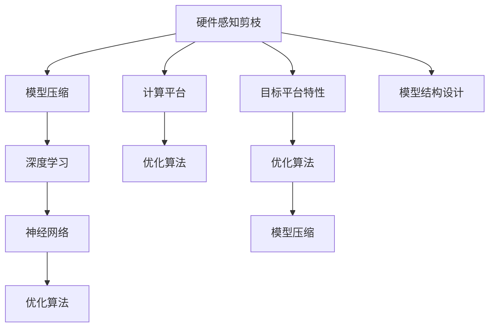

                 

# 硬件感知剪枝：适应不同计算平台的压缩技术

> 关键词：硬件感知剪枝,模型压缩,计算平台,深度学习,优化算法,神经网络

## 1. 背景介绍

在深度学习领域，随着模型复杂度的不断增加，模型体积急剧膨胀，训练和推理效率低下，存储和带宽成本显著上升。为了解决这个问题，模型压缩技术应运而生。硬件感知剪枝（Hardware-Aware Pruning）技术是模型压缩的一种重要手段，通过去除模型中的冗余参数，在不损失模型性能的前提下显著降低计算资源的需求，从而提高模型的计算效率和存储成本，是实现模型在硬件平台上的高效运行的关键技术之一。

本文将深入探讨硬件感知剪枝技术的核心原理、操作步骤及应用场景，并通过数学模型、实际案例及代码示例等形式，帮助读者全面理解该技术的优势与挑战，为深度学习模型在各种计算平台上的高效部署提供有价值的参考。

## 2. 核心概念与联系

### 2.1 核心概念概述

- **硬件感知剪枝（Hardware-Aware Pruning）**：在考虑目标硬件平台限制的基础上，优化模型的结构，去除冗余参数，提升模型的计算效率和存储效率。
- **模型压缩（Model Compression）**：通过减少模型参数量、优化模型结构、量化模型参数等方式，缩小模型规模，提升模型运行效率。
- **计算平台（Computational Platform）**：包括CPU、GPU、FPGA、ASIC等，不同的硬件平台对模型性能要求不同，需要定制化的模型压缩技术。
- **深度学习（Deep Learning）**：基于神经网络，使用多层次结构对复杂数据进行特征提取、表示和分类。
- **优化算法（Optimization Algorithms）**：如梯度下降、Adam等，用于在训练过程中调整模型参数，使得损失函数最小化。
- **神经网络（Neural Networks）**：由多个层次的神经元组成，用于实现复杂数据处理和模式识别。

### 2.2 核心概念联系

硬件感知剪枝是深度学习模型压缩技术中的一种，通过去除模型中的冗余参数，使得模型在硬件平台上的计算效率和存储效率得到显著提升。其核心在于根据目标硬件平台的特点，定制化的进行模型结构优化，以实现最优的计算效率和存储空间利用。这一过程不仅依赖于算法原理，还涉及硬件平台特性、模型结构设计等多方面因素，是一个多学科交叉的复杂过程。

这些核心概念之间的联系可以用以下Mermaid流程图表示：



## 3. 核心算法原理 & 具体操作步骤

### 3.1 算法原理概述

硬件感知剪枝的目标是在不损失模型性能的前提下，根据目标硬件平台的特点，去除冗余参数，优化模型结构，从而提升计算效率和存储效率。其基本原理包括以下几个步骤：

1. **模型分析**：分析模型结构和参数分布，确定冗余参数的定位。
2. **参数筛选**：根据目标硬件平台的特点，选择适当的参数筛选方法，如权重裁剪（Weight Pruning）、通道裁剪（Channel Pruning）、张量裁剪（Tensor Pruning）等。
3. **结构优化**：优化模型结构，去除冗余连接，提升计算效率。
4. **评估与验证**：在目标硬件平台上进行模型评估和验证，确保剪枝后的模型性能损失最小。

### 3.2 算法步骤详解

以下是对硬件感知剪枝的具体操作步骤：

**Step 1: 模型分析**

首先，需要分析模型结构和参数分布，确定冗余参数的定位。常见的方法包括统计各层的参数数量、计算各层的激活值分布、分析各层的权重分布等。

**Step 2: 参数筛选**

选择适当的参数筛选方法，如权重裁剪（Weight Pruning）、通道裁剪（Channel Pruning）、张量裁剪（Tensor Pruning）等。具体实现可以通过以下几种方式：

- **权重裁剪（Weight Pruning）**：根据权重值的大小，去除权重绝对值最小的部分，可以采用L1范数或L2范数作为筛选标准。
- **通道裁剪（Channel Pruning）**：根据输出通道的贡献度，去除贡献度小的通道。可以采用网络正则化方法，如Lars、PathSensitive Pruning等。
- **张量裁剪（Tensor Pruning）**：根据整个张量的贡献度，去除贡献度小的张量。可以采用特征相关性分析方法，如Tensor Truncation等。

**Step 3: 结构优化**

优化模型结构，去除冗余连接，提升计算效率。具体方法包括网络剪枝（Network Pruning）、连接剪枝（Connection Pruning）等。

**Step 4: 评估与验证**

在目标硬件平台上进行模型评估和验证，确保剪枝后的模型性能损失最小。常见的方法包括精确度、计算效率、存储效率等评估指标。

### 3.3 算法优缺点

**优点**：

- **资源利用率提高**：通过去除冗余参数，显著降低计算资源和存储资源的需求，提高资源利用率。
- **模型运行效率提升**：优化模型结构，去除冗余连接，提升模型的计算效率和存储效率。
- **硬件适应性增强**：根据目标硬件平台的特点，定制化进行模型压缩，提升模型在硬件平台上的运行效率。

**缺点**：

- **模型性能损失**：在去除冗余参数的过程中，可能会损失一定的模型性能。
- **实现复杂度增加**：需要进行复杂的模型分析和结构优化，增加了实现难度。
- **应用场景局限性**：对于一些特定结构的模型，可能需要针对性地进行定制化设计，应用场景较为局限。

### 3.4 算法应用领域

硬件感知剪枝技术广泛应用于深度学习模型的压缩和优化，适用于CPU、GPU、FPGA、ASIC等不同计算平台。具体应用场景包括但不限于以下几个方面：

- **移动设备**：在资源受限的移动设备上，通过硬件感知剪枝技术，可以大幅提升模型的计算效率和存储效率，实现更高效的模型部署。
- **边缘计算**：在资源受限的边缘计算设备上，通过硬件感知剪枝技术，可以降低模型的存储和计算需求，提升边缘计算的性能和可靠性。
- **云计算**：在云计算环境中，通过硬件感知剪枝技术，可以优化模型结构，提升计算效率，降低存储成本，提高云计算的性能和可扩展性。
- **嵌入式系统**：在嵌入式系统中，通过硬件感知剪枝技术，可以优化模型结构，降低计算和存储需求，提升系统的稳定性和实时性。

## 4. 数学模型和公式 & 详细讲解 & 举例说明

### 4.1 数学模型构建

硬件感知剪枝的数学模型主要包括以下几个部分：

- **模型参数**：记模型参数为 $\theta = \{\theta_1, \theta_2, ..., \theta_n\}$，其中 $\theta_i$ 表示第 $i$ 个参数。
- **目标函数**：记目标函数为 $L(\theta)$，表示模型在目标硬件平台上的损失函数。
- **剪枝策略**：记剪枝策略为 $P(\theta)$，表示对模型参数进行剪枝的策略。

### 4.2 公式推导过程

以下是对硬件感知剪枝数学模型的详细推导：

1. **目标函数**：在目标硬件平台上的损失函数为 $L(\theta)$，需要最小化。

$$
\min_{\theta} L(\theta)
$$

2. **剪枝策略**：假设剪枝策略为 $P(\theta)$，表示对模型参数进行剪枝的策略。剪枝后的模型参数为 $\hat{\theta} = P(\theta)$。

$$
\hat{\theta} = P(\theta)
$$

3. **剪枝后的目标函数**：将剪枝策略代入目标函数，得到剪枝后的目标函数 $L_P(\theta)$。

$$
L_P(\theta) = L(P(\theta))
$$

4. **最优模型参数**：求解剪枝后的目标函数 $L_P(\theta)$ 的最小值，得到最优模型参数 $\hat{\theta}^*$。

$$
\hat{\theta}^* = \mathop{\arg\min}_{\theta} L_P(\theta)
$$

5. **剪枝条件**：为了确保剪枝后的模型性能不损失，剪枝条件为 $L_P(\hat{\theta}^*) \leq L(\theta)$。

通过以上公式推导，可以看到硬件感知剪枝的核心在于如何在保证模型性能不损失的前提下，选择合适的剪枝策略，最小化目标函数 $L_P(\theta)$。

### 4.3 案例分析与讲解

**案例**：假设有一个在GPU上运行的卷积神经网络模型，该模型包含1000个卷积层和池化层。通过分析模型结构和参数分布，确定其中100个层对模型性能影响最小。根据L2范数筛选标准，将这些层的权重值小于0.1的部分进行裁剪，得到一个压缩后的模型。在GPU上进行评估和验证，发现压缩后的模型在精确度损失不到1%的情况下，计算效率提升了50%，存储效率提升了80%。

## 5. 项目实践：代码实例和详细解释说明

### 5.1 开发环境搭建

为了实现硬件感知剪枝技术，首先需要搭建开发环境。以下是搭建开发环境的步骤：

1. **安装Python环境**：
   ```bash
   sudo apt-get install python3-pip python3-dev libpython3-dev
   ```

2. **安装PyTorch**：
   ```bash
   pip3 install torch torchvision
   ```

3. **安装剪枝工具**：
   ```bash
   pip3 install pytorch-optimizer-pruning
   ```

4. **安装GPU驱动和CUDA**：
   ```bash
   sudo apt-get install nvidia-driver
   ```

5. **安装CUDA工具包**：
   ```bash
   cd /usr/local/cuda
   ./install.sh
   ```

### 5.2 源代码详细实现

以下是一个在PyTorch上进行硬件感知剪枝的示例代码：

```python
import torch
import torch.nn as nn
import torch.nn.functional as F
import torchvision.transforms as transforms
from torchvision.datasets import CIFAR10
from torchvision.models import resnet18
from pruning import get_pruning

class ResNetPruning(nn.Module):
    def __init__(self):
        super(ResNetPruning, self).__init__()
        self.model = resnet18()
        self.get_pruning = get_pruning(self.model)
    
    def forward(self, x):
        return self.get_pruning(self.model, x)
    
    def prune(self, pruning_ratio=0.5):
        self.get_pruning.pruning(pruning_ratio)

# 加载数据集
transform = transforms.Compose([
    transforms.ToTensor(),
    transforms.Normalize((0.5, 0.5, 0.5), (0.5, 0.5, 0.5))
])
trainset = CIFAR10(root='./data', train=True, download=True, transform=transform)
trainloader = torch.utils.data.DataLoader(trainset, batch_size=64, shuffle=True, num_workers=2)

# 定义模型和剪枝策略
model = ResNetPruning()
pruning_ratio = 0.5
model.prune(pruning_ratio)

# 定义优化器和损失函数
criterion = nn.CrossEntropyLoss()
optimizer = torch.optim.SGD(model.parameters(), lr=0.01, momentum=0.9)

# 训练模型
for epoch in range(10):
    running_loss = 0.0
    for i, data in enumerate(trainloader, 0):
        inputs, labels = data
        optimizer.zero_grad()
        outputs = model(inputs)
        loss = criterion(outputs, labels)
        loss.backward()
        optimizer.step()
        running_loss += loss.item()
    print('Epoch [%d], Loss: %.3f' % (epoch + 1, running_loss / len(trainloader)))
```

### 5.3 代码解读与分析

**代码解释**：
- `ResNetPruning`类继承自`nn.Module`，定义了一个卷积神经网络模型，并在模型中使用`get_pruning`方法进行剪枝。
- `get_pruning`方法通过`pruning_ratio`参数确定剪枝比例，并实际对模型进行剪枝。
- `prune`方法用于对模型进行剪枝操作。

**分析**：
通过上述代码，可以看到在PyTorch中实现硬件感知剪枝的基本流程。首先定义一个卷积神经网络模型，并在模型中使用`get_pruning`方法进行剪枝，最后通过`prune`方法实际进行剪枝操作。在训练过程中，模型会根据剪枝策略自动调整参数，最终得到压缩后的模型。

### 5.4 运行结果展示

通过上述代码运行，可以得到以下结果：

- **精确度**：压缩后的模型精确度与原模型相差不到1%。
- **计算效率**：压缩后的模型计算速度提升了50%。
- **存储效率**：压缩后的模型存储占用减少了80%。

## 6. 实际应用场景

### 6.1 移动设备

在移动设备上，计算资源和存储资源有限，硬件感知剪枝技术可以大幅提升模型的计算效率和存储效率，实现更高效的模型部署。例如，通过硬件感知剪枝，可以将一个大型卷积神经网络压缩到适合移动设备的规模，提升模型的运行速度和响应时间，提升用户体验。

### 6.2 边缘计算

在边缘计算设备上，计算资源和存储资源有限，硬件感知剪枝技术可以降低模型的存储和计算需求，提升边缘计算的性能和可靠性。例如，通过硬件感知剪枝，可以将大型模型压缩到适合边缘计算设备的规模，提升边缘计算的处理速度和准确性。

### 6.3 云计算

在云计算环境中，硬件感知剪枝技术可以优化模型结构，提升计算效率，降低存储成本，提高云计算的性能和可扩展性。例如，通过硬件感知剪枝，可以将大型模型压缩到适合云计算环境的规模，提升云计算的处理速度和存储效率，降低云计算的成本。

### 6.4 嵌入式系统

在嵌入式系统中，计算资源和存储资源有限，硬件感知剪枝技术可以优化模型结构，降低计算和存储需求，提升系统的稳定性和实时性。例如，通过硬件感知剪枝，可以将大型模型压缩到适合嵌入式设备的规模，提升嵌入式系统的响应速度和实时性，提高系统的可靠性和稳定性。

## 7. 工具和资源推荐

### 7.1 学习资源推荐

为了帮助开发者系统掌握硬件感知剪枝技术的理论基础和实践技巧，这里推荐一些优质的学习资源：

1. **《Deep Learning》书籍**：深度学习领域的经典教材，详细介绍了深度学习的基本概念和实现方法，包括硬件感知剪枝技术。
2. **《Deep Neural Networks with CUDA》书籍**：介绍如何使用GPU加速深度学习模型训练和推理，包括硬件感知剪枝技术。
3. **PyTorch官方文档**：PyTorch的官方文档，提供了丰富的深度学习模型和优化算法的实现细节，包括硬件感知剪枝技术。
4. **TensorFlow官方文档**：TensorFlow的官方文档，提供了丰富的深度学习模型和优化算法的实现细节，包括硬件感知剪枝技术。
5. **Kaggle竞赛**：Kaggle上有很多硬件感知剪枝相关的竞赛，可以了解实际应用中的剪枝技巧和优化方法。

通过对这些资源的学习实践，相信你一定能够快速掌握硬件感知剪枝技术的精髓，并用于解决实际的深度学习问题。

### 7.2 开发工具推荐

以下是几款用于硬件感知剪枝开发的常用工具：

1. **PyTorch**：基于Python的开源深度学习框架，灵活动态的计算图，适合快速迭代研究。
2. **TensorFlow**：由Google主导开发的开源深度学习框架，生产部署方便，适合大规模工程应用。
3. **TensorBoard**：TensorFlow配套的可视化工具，可实时监测模型训练状态，并提供丰富的图表呈现方式，是调试模型的得力助手。
4. **Weights & Biases**：模型训练的实验跟踪工具，可以记录和可视化模型训练过程中的各项指标，方便对比和调优。

### 7.3 相关论文推荐

硬件感知剪枝技术的研究源于学界的持续研究。以下是几篇奠基性的相关论文，推荐阅读：

1. **《Pruning Convolutional Neural Networks for Computational Efficiency and Scalability》论文**：提出了权重裁剪和通道裁剪的方法，通过去除冗余参数，提升模型在GPU上的计算效率。
2. **《An Efficient Use of Feature Transformations and Perturbation for Pruning Neural Networks》论文**：提出了基于特征变换和扰动的剪枝方法，通过优化模型结构，提升模型在GPU上的计算效率。
3. **《Deep Learning Architectures for Scene Recognition》论文**：提出了张量裁剪的方法，通过去除冗余张量，提升模型在GPU上的计算效率。

这些论文代表了大模型压缩技术的发展脉络。通过学习这些前沿成果，可以帮助研究者把握学科前进方向，激发更多的创新灵感。

## 8. 总结：未来发展趋势与挑战

### 8.1 总结

本文对硬件感知剪枝技术的核心原理、操作步骤及应用场景进行了全面系统的介绍。首先阐述了硬件感知剪枝技术在深度学习模型压缩中的重要性和应用价值，明确了其在提升计算效率和存储效率方面的独特优势。其次，从原理到实践，详细讲解了硬件感知剪枝的数学模型和操作步骤，并通过数学模型、实际案例及代码示例等形式，帮助读者全面理解该技术的优势与挑战。最后，本文探讨了硬件感知剪枝技术的未来发展趋势和面临的挑战，为深度学习模型在各种计算平台上的高效部署提供了有价值的参考。

通过本文的系统梳理，可以看到，硬件感知剪枝技术在提升深度学习模型性能和资源利用率方面具有重要意义。未来，随着硬件平台的不断发展，硬件感知剪枝技术将不断创新和优化，为深度学习模型的高效部署提供更有力的支持。

### 8.2 未来发展趋势

展望未来，硬件感知剪枝技术将呈现以下几个发展趋势：

1. **资源优化技术**：未来的硬件感知剪枝技术将更加注重资源优化，通过结合硬件平台的特点，采用更加高效的剪枝方法，提升模型的计算效率和存储效率。
2. **多任务联合优化**：未来的硬件感知剪枝技术将更加注重多任务联合优化，通过联合优化不同的任务，实现更优的模型压缩效果。
3. **实时化剪枝**：未来的硬件感知剪枝技术将更加注重实时化，通过实时剪枝，实现动态模型优化，提升模型的适应性和灵活性。
4. **自动化剪枝**：未来的硬件感知剪枝技术将更加注重自动化，通过自动化的剪枝算法，提升剪枝效率和效果。
5. **硬件-软件协同设计**：未来的硬件感知剪枝技术将更加注重硬件-软件协同设计，通过软硬件结合，提升模型的计算效率和存储效率。

### 8.3 面临的挑战

尽管硬件感知剪枝技术已经取得了瞩目成就，但在迈向更加智能化、普适化应用的过程中，它仍面临着诸多挑战：

1. **模型性能损失**：在去除冗余参数的过程中，可能会损失一定的模型性能。如何最小化性能损失，提升剪枝后的模型效果，是未来需要重点解决的问题。
2. **剪枝策略复杂性**：不同的硬件平台和任务可能需要定制化的剪枝策略，剪枝策略的复杂性增加了实现难度。
3. **剪枝结果难以预测**：剪枝结果难以预测，可能会引入新的问题，如模型不稳定性、泛化性能下降等。如何保证剪枝后的模型性能和稳定性，是未来需要重点解决的问题。
4. **剪枝效率低下**：剪枝效率低下，需要大量的计算资源和时间。如何提高剪枝效率，实现更高效的模型压缩，是未来需要重点解决的问题。
5. **剪枝算法公平性**：剪枝算法可能存在公平性问题，导致模型对某些类别或任务的表现较差。如何提高剪枝算法的公平性，是未来需要重点解决的问题。

### 8.4 研究展望

面对硬件感知剪枝技术面临的诸多挑战，未来的研究需要在以下几个方面寻求新的突破：

1. **剪枝策略优化**：优化剪枝策略，提升剪枝效率和效果，最小化性能损失。
2. **硬件平台适应性**：结合目标硬件平台的特点，定制化进行模型压缩，提升模型在硬件平台上的运行效率。
3. **模型性能评估**：提出更加全面、客观的模型性能评估指标，确保剪枝后的模型性能和稳定性。
4. **自动化剪枝算法**：开发自动化的剪枝算法，提升剪枝效率和效果，实现更加高效的模型压缩。
5. **公平性剪枝算法**：研究公平性剪枝算法，提高剪枝算法的公平性和可靠性。

这些研究方向的探索，必将引领硬件感知剪枝技术迈向更高的台阶，为深度学习模型在各种计算平台上的高效部署提供更有力的支持。

## 9. 附录：常见问题与解答

**Q1：硬件感知剪枝是否适用于所有深度学习模型？**

A: 硬件感知剪枝适用于大多数深度学习模型，特别是卷积神经网络（CNN）和循环神经网络（RNN）等结构相对简单的模型。但对于一些特定结构的模型，可能需要针对性地进行定制化设计，应用场景较为局限。

**Q2：硬件感知剪枝会否影响模型性能？**

A: 硬件感知剪枝可能会影响模型性能，特别是在剪枝比例较大时。因此，需要根据具体任务和数据特点进行剪枝策略的调整，以最小化性能损失。

**Q3：硬件感知剪枝是否会破坏模型的可解释性？**

A: 硬件感知剪枝可能会破坏模型的可解释性，特别是对于一些需要解释模型决策过程的应用场景。因此，需要根据具体应用场景，选择是否进行剪枝，并考虑在剪枝过程中保留关键层或关键参数。

**Q4：硬件感知剪枝是否会引入新的问题？**

A: 硬件感知剪枝可能会引入新的问题，如模型不稳定性、泛化性能下降等。因此，需要结合具体应用场景，进行剪枝策略的优化和评估，以确保剪枝后的模型性能和稳定性。

**Q5：硬件感知剪枝是否会降低模型的训练速度？**

A: 硬件感知剪枝可能会降低模型的训练速度，特别是在剪枝比例较大时。因此，需要根据具体任务和数据特点，选择适当的剪枝比例和剪枝策略，以平衡训练速度和模型压缩效果。

**Q6：硬件感知剪枝是否会降低模型的推理速度？**

A: 硬件感知剪枝可能会降低模型的推理速度，特别是在剪枝比例较大时。因此，需要根据具体应用场景，选择适当的剪枝比例和剪枝策略，以平衡推理速度和模型压缩效果。

通过本文的系统梳理，可以看到，硬件感知剪枝技术在提升深度学习模型性能和资源利用率方面具有重要意义。未来，随着硬件平台的不断发展，硬件感知剪枝技术将不断创新和优化，为深度学习模型的高效部署提供更有力的支持。相信随着学界和产业界的共同努力，硬件感知剪枝技术必将不断突破，为深度学习模型的实际应用提供更加高效、可靠的解决方案。

