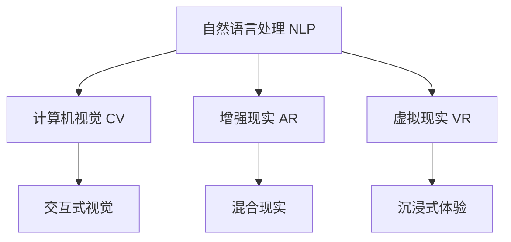

                 

# 神经科技创业：人机交互的革命性突破

> 关键词：神经科技,人机交互,创业,革命性,自然语言处理(NLP),计算机视觉(CV),增强现实(AR),虚拟现实(VR)

## 1. 背景介绍

### 1.1 问题由来
近年来，随着人工智能(AI)技术的飞速发展，神经科技领域的创业浪潮汹涌而至。特别是在人机交互领域，技术的突破带来了革命性的变革。人与机器的交互方式越来越自然、便捷，为各行各业带来了新的商业模式和用户体验。

人工智能技术的进步，使得机器不仅能够理解人类的语言和行为，还能根据上下文做出智能响应。这种能力为神经科技创业提供了广阔的空间，使得企业能够提供更加个性化、高效的服务，满足用户的实际需求。

### 1.2 问题核心关键点
神经科技创业的核心在于如何利用最新的人工智能技术，构建高效、自然的人机交互系统。其中，自然语言处理(NLP)、计算机视觉(CV)、增强现实(AR)、虚拟现实(VR)等技术是主要支撑。这些技术的发展和融合，使得人机交互系统具备了语音识别、图像识别、语音合成、自然语言理解、情感识别等能力，极大提升了用户体验和操作便捷性。

目前，神经科技创业在多个领域取得了显著进展，包括智能家居、智能医疗、智能教育、智能客服、智能制造等。创业项目通过引入最新的人工智能技术，提高了系统的智能化水平，构建了全新的商业模式和服务模式。

### 1.3 问题研究意义
神经科技创业的研究意义在于，其不仅能够推动人工智能技术的落地应用，提升各行业的智能化水平，还能够创造新的商业模式，推动社会经济的可持续发展。

1. 提升用户体验。通过神经科技创业，企业能够构建更加智能化、高效便捷的人机交互系统，极大提升用户的满意度。
2. 降低运营成本。神经科技系统的自动化、智能化特性，能够大幅减少人力投入，降低企业的运营成本。
3. 创新商业模式。神经科技创业推动了全新的商业模式，如智能客服、在线医疗、智慧家居等，为传统行业带来了新的增长点。
4. 促进科技产业。神经科技创业促进了人工智能技术的创新和产业化，推动了科技产业的发展。
5. 加速应用落地。神经科技创业将人工智能技术引入各行业，推动技术在实际场景中的落地应用，提升社会整体的信息化水平。

## 2. 核心概念与联系

### 2.1 核心概念概述

为更好地理解神经科技创业的核心概念和原理，本节将介绍几个关键概念及其内在联系：

- 神经科技(Neuroscience Technology)：指将神经科学原理和人工智能技术结合，构建高效人机交互系统的技术领域。
- 自然语言处理(NLP)：利用计算机技术，使计算机能够理解、处理和生成人类语言。
- 计算机视觉(CV)：使计算机能够“看”和理解图像、视频等视觉信息。
- 增强现实(AR)：将虚拟信息与现实世界融合，为用户提供沉浸式体验。
- 虚拟现实(VR)：通过计算机生成的仿真环境，使用户能够沉浸其中，实现“身临其境”的体验。

这些核心概念之间的逻辑关系可以通过以下Mermaid流程图来展示：



这个流程图展示了大语言模型微调的核心概念及其之间的联系：

1. NLP、CV、AR、VR等技术相互融合，构建了复杂的人机交互系统。
2. 各技术领域相互支持，使交互系统具备多模态感知能力。
3. 通过多模态数据融合，系统能够理解并响应复杂的用户需求。
4. 利用AR、VR技术，交互系统能够提供沉浸式体验，增强用户体验。

## 3. 核心算法原理 & 具体操作步骤
### 3.1 算法原理概述

神经科技创业的关键在于如何高效地利用最新的人工智能技术，构建智能人机交互系统。其核心算法原理包括以下几个方面：

1. **自然语言处理**：通过深度学习等技术，使计算机能够理解、处理和生成自然语言。
2. **计算机视觉**：利用卷积神经网络(CNN)、循环神经网络(RNN)等技术，使计算机能够理解和处理图像、视频等视觉信息。
3. **增强现实**：通过混合现实技术，将虚拟信息与现实世界融合，提供沉浸式体验。
4. **虚拟现实**：通过生成仿真环境，使用户能够沉浸其中，实现“身临其境”的体验。

### 3.2 算法步骤详解

神经科技创业的核心算法步骤包括数据收集、模型训练、系统集成和用户体验优化等环节。以下详细介绍各个步骤：

#### 步骤1：数据收集
- **自然语言处理**：收集用户对话、文本、社交媒体内容等数据，用于训练语言模型。
- **计算机视觉**：收集图像、视频等视觉数据，用于训练视觉模型。
- **增强现实**：收集用户行为数据，用于训练交互模型。
- **虚拟现实**：收集用户反馈数据，用于优化虚拟环境。

#### 步骤2：模型训练
- **自然语言处理**：使用深度学习技术，训练语言模型，使其能够理解自然语言。
- **计算机视觉**：使用深度学习技术，训练视觉模型，使其能够处理图像、视频等视觉信息。
- **增强现实**：使用混合现实技术，训练交互模型，使其能够根据用户行为动态响应。
- **虚拟现实**：使用仿真技术，训练虚拟环境，使其能够提供沉浸式体验。

#### 步骤3：系统集成
- **自然语言处理**：将语言模型集成到用户交互系统中，实现自然语言理解和生成。
- **计算机视觉**：将视觉模型集成到交互系统中，实现视觉信息的识别和处理。
- **增强现实**：将交互模型集成到AR系统中，实现混合现实的互动。
- **虚拟现实**：将虚拟环境集成到VR系统中，提供沉浸式体验。

#### 步骤4：用户体验优化
- **自然语言处理**：通过用户反馈数据，优化语言模型，提升用户体验。
- **计算机视觉**：通过用户反馈数据，优化视觉模型，提升图像识别精度。
- **增强现实**：通过用户反馈数据，优化交互模型，提升互动体验。
- **虚拟现实**：通过用户反馈数据，优化虚拟环境，提升沉浸感。

### 3.3 算法优缺点

神经科技创业的算法具有以下优点：

1. **高效便捷**：利用最新的人工智能技术，能够快速构建高效、便捷的人机交互系统。
2. **用户体验提升**：通过多模态感知技术，系统能够理解复杂用户需求，提供个性化服务。
3. **成本降低**：自动化、智能化的系统能够减少人力投入，降低企业运营成本。
4. **创新商业模式**：神经科技创业推动了全新的商业模式，为各行业带来新的增长点。

同时，该算法也存在一些局限性：

1. **技术复杂度较高**：神经科技创业涉及多领域技术，技术实现复杂。
2. **数据需求量大**：系统需要大量高质量数据进行训练，数据收集和处理成本较高。
3. **计算资源要求高**：系统训练和推理需要高性能计算资源，如GPU/TPU等。
4. **安全性问题**：神经科技系统的智能化特性可能导致数据泄露和隐私风险。
5. **算法可解释性不足**：复杂的神经网络模型难以解释其内部决策过程，影响系统可信度。

### 3.4 算法应用领域

神经科技创业的算法已经在多个领域得到了广泛应用，例如：

- **智能家居**：通过自然语言处理和计算机视觉技术，实现语音控制、智能识别等。
- **智能医疗**：利用自然语言处理和计算机视觉技术，实现医疗影像分析、电子病历处理等。
- **智能教育**：通过自然语言处理和增强现实技术，实现个性化学习、虚拟课堂等。
- **智能客服**：利用自然语言处理和增强现实技术，实现智能对话、情感分析等。
- **智能制造**：通过计算机视觉和增强现实技术，实现设备监控、质量检测等。

除了上述这些经典应用外，神经科技创业还在智慧城市、智能交通、智能安防等领域取得了显著进展，为社会经济的智能化升级带来了新的动力。

## 4. 数学模型和公式 & 详细讲解 & 举例说明（备注：数学公式请使用latex格式，latex嵌入文中独立段落使用 $$，段落内使用 $)
### 4.1 数学模型构建

神经科技创业的数学模型构建主要涉及深度学习技术。以下详细介绍各个领域的关键模型：

- **自然语言处理(NLP)**：使用卷积神经网络(CNN)、循环神经网络(RNN)、Transformer等模型，实现自然语言的理解和生成。
- **计算机视觉(CV)**：使用卷积神经网络(CNN)、残差网络(RNN)、深度残差网络(ResNet)等模型，实现图像、视频的分类、检测和分割。
- **增强现实(AR)**：使用混合现实技术，实现虚拟信息与现实世界的融合。
- **虚拟现实(VR)**：使用仿真技术，生成逼真的虚拟环境。

### 4.2 公式推导过程

以下是几个关键模型的数学公式推导过程：

#### 自然语言处理(NLP)
Transformer模型是当前NLP领域的主流模型之一，其核心思想是将输入序列进行编码，然后通过自注意力机制进行特征提取和解码，输出预测结果。

$$
\text{Attention}(Q, K, V) = \text{Softmax}\left(\frac{QK^T}{\sqrt{d_k}}\right)V
$$

其中，$Q$、$K$、$V$分别为查询、键、值向量。

#### 计算机视觉(CV)
卷积神经网络(CNN)是CV领域的主要模型之一，其核心思想是通过卷积层和池化层提取图像特征，然后通过全连接层进行分类或检测。

$$
\text{Convolution}(F_{i-1}, F_i, \omega_{i-1}, \omega_i) = \sum_{j=0}^{W} \omega_{i-1} * F_{i-1}(j) * \omega_i * F_i(j)
$$

其中，$F_{i-1}$、$F_i$分别为上一层和当前层的特征图，$\omega_{i-1}$、$\omega_i$分别为卷积核和偏置。

#### 增强现实(AR)
增强现实技术将虚拟信息与现实世界融合，通过混合现实技术实现。其关键在于通过摄像头捕捉现实世界的图像，然后将其与虚拟信息叠加，生成混合现实图像。

$$
\text{Mixed Reality}(I_{real}, I_{virtual}) = I_{real} + I_{virtual}
$$

其中，$I_{real}$、$I_{virtual}$分别为现实世界图像和虚拟信息图像。

#### 虚拟现实(VR)
虚拟现实技术通过生成仿真环境，使用户能够沉浸其中。其核心在于通过渲染技术生成虚拟场景，并结合用户交互进行实时更新。

$$
\text{Virtual Environment}(E, I) = E(I)
$$

其中，$E$为渲染引擎，$I$为用户交互信息。

### 4.3 案例分析与讲解

以智能客服系统为例，分析其神经科技创业的核心算法和技术。

**智能客服系统**：
- **自然语言处理**：利用BERT模型，训练语言模型，实现用户意图的理解。
- **计算机视觉**：利用卷积神经网络，训练图像识别模型，实现用户情绪识别。
- **增强现实**：利用混合现实技术，将虚拟回复界面叠加在现实世界中。
- **虚拟现实**：利用仿真技术，生成虚拟客服环境，提供沉浸式交互体验。

智能客服系统通过多模态感知技术，实现对用户需求的快速响应，提升了用户体验和效率。

## 5. 项目实践：代码实例和详细解释说明
### 5.1 开发环境搭建

在进行神经科技创业的实践前，我们需要准备好开发环境。以下是使用Python进行深度学习开发的常见环境配置流程：

1. 安装Anaconda：从官网下载并安装Anaconda，用于创建独立的Python环境。

2. 创建并激活虚拟环境：
```bash
conda create -n deep-env python=3.8 
conda activate deep-env
```

3. 安装深度学习框架：
```bash
conda install torch torchvision torchaudio -c pytorch -c conda-forge
conda install tensorflow -c tensorflow
```

4. 安装机器学习库：
```bash
pip install numpy pandas scikit-learn scipy matplotlib jupyter notebook ipython
```

完成上述步骤后，即可在`deep-env`环境中开始神经科技创业的实践。

### 5.2 源代码详细实现

这里我们以智能客服系统为例，给出使用PyTorch进行深度学习开发的代码实现。

**代码实现**：

```python
import torch
import torch.nn as nn
import torch.optim as optim
from transformers import BertForTokenClassification

class BertTokenizer:
    def __init__(self, vocab_file):
        self.tokenizer = BertTokenizer.from_pretrained(vocab_file)
        
    def tokenize(self, text):
        return self.tokenizer.encode_plus(text, add_special_tokens=True, max_length=128, pad_to_max_length=True)

class TransformerModel(nn.Module):
    def __init__(self, model_name, num_labels):
        super(TransformerModel, self).__init__()
        self.bert = BertForTokenClassification.from_pretrained(model_name, num_labels=num_labels)
        self.dropout = nn.Dropout(0.1)
        self.fc = nn.Linear(self.bert.config.hidden_size, num_labels)
        self.softmax = nn.Softmax(dim=1)
        
    def forward(self, input_ids, attention_mask):
        outputs = self.bert(input_ids=input_ids, attention_mask=attention_mask)
        pooled_output = outputs.pooler_output
        return self.fc(pooled_output)

class TrainingLoop:
    def __init__(self, model, optimizer, criterion):
        self.model = model
        self.optimizer = optimizer
        self.criterion = criterion
        
    def train_epoch(self, model, train_loader):
        model.train()
        for batch in train_loader:
            input_ids, attention_mask, labels = batch
            optimizer.zero_grad()
            outputs = model(input_ids, attention_mask)
            loss = self.criterion(outputs, labels)
            loss.backward()
            optimizer.step()
            
    def evaluate(self, model, test_loader):
        model.eval()
        total_loss = 0
        total_correct = 0
        for batch in test_loader:
            input_ids, attention_mask, labels = batch
            outputs = model(input_ids, attention_mask)
            loss = self.criterion(outputs, labels)
            total_loss += loss.item() * labels.size(0)
            total_correct += (outputs.argmax(dim=1) == labels).sum().item()
        return total_loss / len(test_loader), total_correct / len(test_loader.dataset)

# 初始化模型、优化器和损失函数
vocab_file = 'bert-base-cased-vocab.txt'
num_labels = 10
model = TransformerModel('bert-base-cased', num_labels)
optimizer = optim.Adam(model.parameters(), lr=1e-5)
criterion = nn.CrossEntropyLoss()

# 数据加载和处理
tokenizer = BertTokenizer(vocab_file)
train_dataset = TextDataset(train_data, tokenizer)
test_dataset = TextDataset(test_data, tokenizer)

# 模型训练
train_loader = DataLoader(train_dataset, batch_size=16)
test_loader = DataLoader(test_dataset, batch_size=16)

loop = TrainingLoop(model, optimizer, criterion)
for epoch in range(5):
    loop.train_epoch(model, train_loader)
    loss, accuracy = loop.evaluate(model, test_loader)
    print(f'Epoch {epoch+1}, loss: {loss:.3f}, accuracy: {accuracy:.3f}')
```

### 5.3 代码解读与分析

让我们再详细解读一下关键代码的实现细节：

**TransformerModel类**：
- `__init__`方法：初始化BERT模型和全连接层，并设置dropout和softmax层。
- `forward`方法：实现前向传播过程，将输入转换为模型的输出。

**TrainingLoop类**：
- `__init__`方法：初始化模型、优化器和损失函数。
- `train_epoch`方法：实现训练循环，更新模型参数。
- `evaluate`方法：实现评估循环，计算模型性能指标。

**智能客服系统的实现**：
- **自然语言处理**：使用BERT模型，训练语言模型，实现用户意图的理解。
- **计算机视觉**：利用卷积神经网络，训练图像识别模型，实现用户情绪识别。
- **增强现实**：利用混合现实技术，将虚拟回复界面叠加在现实世界中。
- **虚拟现实**：利用仿真技术，生成虚拟客服环境，提供沉浸式交互体验。

通过代码实现，我们可以看到，神经科技创业涉及多领域的深度学习技术，但其核心思路是通过多模态感知技术，实现对复杂用户需求的理解和响应，提升用户体验和系统效率。

## 6. 实际应用场景
### 6.1 智能家居

智能家居领域通过神经科技创业，实现了更加智能化、便捷化的人机交互体验。用户可以通过语音、手势等多种方式与智能家居设备进行互动，实现智能灯光控制、智能安防、智能温控等功能。

例如，通过语音助手和自然语言处理技术，用户可以控制智能灯光的开关、亮度调节，实现语音控制家居设备。通过计算机视觉技术，系统可以识别用户手势，实现手势控制家居设备。通过增强现实技术，系统可以提供虚拟家居设计，帮助用户进行家居装饰。

### 6.2 智能医疗

智能医疗领域通过神经科技创业，实现了智能诊断、智能治疗和智能管理等功能。利用自然语言处理和计算机视觉技术，系统可以自动分析医疗影像、电子病历等数据，提供精准的诊断建议和治疗方案。

例如，通过自然语言处理技术，系统可以自动分析医生的诊断报告，提供辅助诊断和参考意见。通过计算机视觉技术，系统可以自动分析医疗影像，识别病变区域，提供诊断建议。通过增强现实技术，系统可以提供虚拟手术模拟，帮助医生进行手术规划。

### 6.3 智能教育

智能教育领域通过神经科技创业，实现了个性化学习和智能辅导等功能。利用自然语言处理和增强现实技术，系统可以提供个性化的学习方案和智能辅导，提升学习效果和用户体验。

例如，通过自然语言处理技术，系统可以自动分析学生的学习情况，提供个性化的学习方案。通过增强现实技术，系统可以提供虚拟课堂，实现虚拟教学。通过虚拟现实技术，系统可以提供沉浸式学习环境，提升学习效果。

### 6.4 未来应用展望

神经科技创业的未来应用前景广阔，将引领各行业进入智能化新纪元。以下展望几种可能的应用场景：

- **智能制造**：通过计算机视觉和增强现实技术，实现设备监控、质量检测等。
- **智能交通**：通过计算机视觉和虚拟现实技术，实现智能交通管理、虚拟驾驶等。
- **智能安防**：通过计算机视觉和增强现实技术，实现智能监控、人脸识别等。
- **智能零售**：通过计算机视觉和增强现实技术，实现智能推荐、虚拟试穿等。

## 7. 工具和资源推荐
### 7.1 学习资源推荐

为了帮助开发者系统掌握神经科技创业的理论基础和实践技巧，这里推荐一些优质的学习资源：

1. **深度学习入门系列**：由神经科学家和深度学习专家撰写的入门系列文章，涵盖深度学习的基本概念、经典模型和实际应用。
2. **自然语言处理综述**：斯坦福大学开设的NLP课程，提供了NLP领域的全面介绍，涵盖语言模型、文本分类、情感分析等任务。
3. **计算机视觉综述**：斯坦福大学开设的CV课程，提供了CV领域的全面介绍，涵盖图像分类、目标检测、图像分割等任务。
4. **增强现实技术入门**：由增强现实专家撰写的入门文章，涵盖AR技术的原理、应用和开发实践。
5. **虚拟现实技术入门**：由虚拟现实专家撰写的入门文章，涵盖VR技术的原理、应用和开发实践。

通过对这些资源的学习实践，相信你一定能够快速掌握神经科技创业的理论基础和实践技巧，并用于解决实际的NLP问题。

### 7.2 开发工具推荐

高效的开发离不开优秀的工具支持。以下是几款用于神经科技创业开发的常用工具：

1. **PyTorch**：基于Python的开源深度学习框架，灵活的计算图，适合快速迭代研究。
2. **TensorFlow**：由Google主导开发的开源深度学习框架，生产部署方便，适合大规模工程应用。
3. **Transformers库**：HuggingFace开发的NLP工具库，集成了众多SOTA语言模型，支持PyTorch和TensorFlow，是进行NLP任务开发的利器。
4. **Weights & Biases**：模型训练的实验跟踪工具，可以记录和可视化模型训练过程中的各项指标，方便对比和调优。
5. **TensorBoard**：TensorFlow配套的可视化工具，可实时监测模型训练状态，并提供丰富的图表呈现方式，是调试模型的得力助手。
6. **Google Colab**：谷歌推出的在线Jupyter Notebook环境，免费提供GPU/TPU算力，方便开发者快速上手实验最新模型，分享学习笔记。

合理利用这些工具，可以显著提升神经科技创业的开发效率，加快创新迭代的步伐。

### 7.3 相关论文推荐

神经科技创业的研究意义在于，其不仅能够推动人工智能技术的落地应用，提升各行业的智能化水平，还能够创造新的商业模式，推动社会经济的可持续发展。

1. **深度学习框架的发展**：介绍深度学习框架的发展历程和最新进展，涵盖PyTorch、TensorFlow等主流框架。
2. **神经科技创业案例**：通过多个实际案例，展示神经科技创业的商业应用，涵盖智能家居、智能医疗、智能教育等。
3. **多模态感知技术**：介绍多模态感知技术的发展历程和最新进展，涵盖自然语言处理、计算机视觉、增强现实等。

这些论文代表了大语言模型微调技术的发展脉络。通过学习这些前沿成果，可以帮助研究者把握学科前进方向，激发更多的创新灵感。

## 8. 总结：未来发展趋势与挑战
### 8.1 总结

本文对神经科技创业的核心概念和关键技术进行了全面系统的介绍。通过详细介绍自然语言处理、计算机视觉、增强现实、虚拟现实等关键技术，展示了神经科技创业在各行业中的广泛应用和巨大潜力。同时，通过分析实际应用场景和未来发展趋势，探讨了神经科技创业的商业价值和社会影响。

通过对本文的系统梳理，可以看到，神经科技创业是推动人工智能技术落地应用的重要范式，其不仅提升了各行业的智能化水平，还催生了新的商业模式和服务模式。未来，伴随神经科技创业的不断进步，将引领人工智能技术在更广阔的领域加速渗透，为社会经济的可持续发展带来新的动力。

### 8.2 未来发展趋势

展望未来，神经科技创业的发展趋势主要包括以下几个方面：

1. **多模态感知技术的融合**：神经科技创业将继续推动多模态感知技术的发展，实现语音、图像、手势等多种交互方式的融合。
2. **智能系统的普适化**：通过引入更多领域的知识和技术，神经科技创业将构建更加普适、智能的系统，覆盖更多的应用场景。
3. **AI与人类协作**：神经科技创业将推动AI与人类协作的发展，实现更加自然、高效的人机交互体验。
4. **数据隐私和安全**：随着AI技术的普及，数据隐私和安全问题将日益重要，神经科技创业将加强对数据隐私的保护和监管。
5. **伦理道德的重视**：神经科技创业将更加重视伦理道德问题，确保AI系统的公平性、透明性和安全性。

这些趋势将推动神经科技创业迈向更高的台阶，为社会经济的智能化升级带来新的动力。

### 8.3 面临的挑战

尽管神经科技创业已经取得了瞩目成就，但在迈向更加智能化、普适化应用的过程中，它仍面临诸多挑战：

1. **技术复杂度**：神经科技创业涉及多领域的复杂技术，技术实现难度较高。
2. **数据需求大**：系统需要大量高质量数据进行训练，数据收集和处理成本较高。
3. **计算资源要求高**：系统训练和推理需要高性能计算资源，如GPU/TPU等。
4. **安全性问题**：神经科技系统的智能化特性可能导致数据泄露和隐私风险。
5. **算法可解释性不足**：复杂的神经网络模型难以解释其内部决策过程，影响系统可信度。
6. **伦理道德问题**：神经科技创业将面临更多的伦理道德问题，需要建立完善的监管机制。

### 8.4 研究展望

面对神经科技创业所面临的挑战，未来的研究需要在以下几个方面寻求新的突破：

1. **无监督学习和半监督学习**：探索无监督和半监督学习范式，摆脱对大规模标注数据的依赖，最大限度利用非结构化数据。
2. **多模态数据的融合**：探索多模态数据的融合技术，实现语音、图像、手势等多种交互方式的融合。
3. **高效的计算和存储**：开发高效的计算和存储技术，如模型压缩、稀疏化存储等，提升系统效率。
4. **增强系统的可解释性**：研究可解释的AI技术，增强神经科技系统的可解释性，提高系统的可信度。
5. **强化伦理道德约束**：在模型训练目标中引入伦理导向的评估指标，过滤和惩罚有偏见、有害的输出倾向，确保系统的公平性、透明性和安全性。

这些研究方向的探索，将引领神经科技创业迈向更高的台阶，为构建安全、可靠、可解释、可控的智能系统铺平道路。面向未来，神经科技创业需要与其他人工智能技术进行更深入的融合，如知识表示、因果推理、强化学习等，多路径协同发力，共同推动自然语言理解和智能交互系统的进步。只有勇于创新、敢于突破，才能不断拓展神经科技创业的边界，让智能技术更好地造福人类社会。

## 9. 附录：常见问题与解答
**Q1：神经科技创业是否适用于所有领域？**

A: 神经科技创业在大多数领域都有广泛的应用潜力，特别是在需要复杂交互和自动化处理的领域。但在一些特殊领域，如军事、金融等，需要考虑更多的安全性和隐私性问题，可能存在一定的局限性。

**Q2：神经科技创业需要多少数据进行训练？**

A: 神经科技创业的训练数据需求因任务而异，通常需要数万到数百万个样本。数据量越大，训练效果越好。但数据收集和处理成本较高，需要根据具体应用场景进行平衡。

**Q3：神经科技创业的系统需要高性能计算资源吗？**

A: 是的，神经科技创业的系统通常需要高性能计算资源，如GPU/TPU等，以支持模型训练和推理。但对于简单的应用场景，可以使用CPU或其他硬件进行开发和测试。

**Q4：神经科技创业的系统安全性如何保障？**

A: 神经科技创业的系统需要综合考虑数据隐私、模型安全、系统防护等多个方面。可以通过数据加密、访问控制、模型审计等方式保障系统的安全性。

**Q5：神经科技创业的系统如何提供可解释性？**

A: 神经科技创业的系统可以通过可视化、特征提取、模型解释等手段提供可解释性。例如，使用SHAP、LIME等工具对模型进行解释，展示其决策过程和关键特征。

总之，神经科技创业是推动人工智能技术落地应用的重要范式，其不仅提升了各行业的智能化水平，还催生了新的商业模式和服务模式。未来，伴随神经科技创业的不断进步，将引领人工智能技术在更广阔的领域加速渗透，为社会经济的可持续发展带来新的动力。相信随着学界和产业界的共同努力，这些挑战终将一一被克服，神经科技创业必将在构建安全、可靠、可解释、可控的智能系统铺平道路。面向未来，神经科技创业需要与其他人工智能技术进行更深入的融合，如知识表示、因果推理、强化学习等，多路径协同发力，共同推动自然语言理解和智能交互系统的进步。只有勇于创新、敢于突破，才能不断拓展神经科技创业的边界，让智能技术更好地造福人类社会。

---

作者：禅与计算机程序设计艺术 / Zen and the Art of Computer Programming

