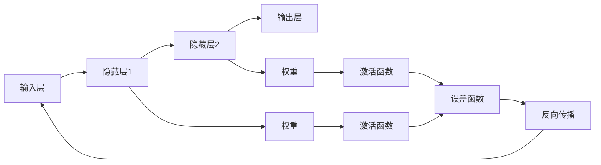

                 

## 1. 背景介绍

### 1.1 问题由来
人工智能(AI)是21世纪最具颠覆性的技术之一，其核心在于如何让机器具有类似于人类的智能，能够理解和处理自然语言、图像、声音等多种形式的数据。而神经网络(Neural Networks)，作为AI领域最基础的算法之一，正是构建智能系统的基石。

神经网络源自人类对大脑神经元网络的生物学理解，它通过模拟生物神经元的工作原理，实现了信息的处理和传输。在深度学习时代，神经网络的结构从简单的单层网络演进为复杂的深度网络，大大提升了其在图像、语音、文本等复杂数据上的处理能力。

### 1.2 问题核心关键点
神经网络的核心思想是通过多层非线性映射，将输入数据转换为输出数据，其核心包括输入层、隐藏层和输出层。每一层包含多个神经元，神经元之间通过权重进行连接，权重的大小反映了输入数据的重要性。神经网络通过反向传播算法进行训练，逐步调整权重以优化模型性能。

目前，神经网络在计算机视觉、自然语言处理、语音识别等多个领域都取得了显著的成果。其中，卷积神经网络(CNN)在图像处理上表现优异，循环神经网络(RNN)在序列数据处理上有着天然的优势，长短时记忆网络(LSTM)、门控循环单元(GRU)等变种则进一步提升了序列建模能力。

### 1.3 问题研究意义
研究神经网络的原理与应用，不仅有助于理解AI技术的基本构成，还能够推动其在各个行业中的实际应用。神经网络技术在自动驾驶、智能推荐、医疗诊断、金融预测等众多领域有着广泛的应用前景，对提升生产效率、降低成本、改善用户体验等方面具有重要意义。

神经网络的核心在于其自适应学习能力和泛化能力，能够从大量数据中自动提取特征，并通过训练提升准确率和效率。然而，如何设计合适的神经网络结构、调整合适的超参数、处理过拟合等问题，仍需不断探索和优化。

## 2. 核心概念与联系

### 2.1 核心概念概述
神经网络由输入层、隐藏层和输出层构成，其中每一层包含多个神经元。神经元通过激活函数实现非线性映射，权重用于调整输入数据的重要性。隐藏层数目和神经元数目的选择，直接影响模型的表达能力和复杂度。

### 2.2 核心概念原理和架构的 Mermaid 流程图(Mermaid 流程节点中不要有括号、逗号等特殊字符)



这个流程图展示了神经网络的基本结构：输入层接收输入数据，通过权重和激活函数传递到隐藏层，再传递到输出层，输出最终结果。误差函数用于衡量预测结果与真实结果的差异，反向传播算法则用于更新权重，缩小误差。

### 2.3 核心概念之间的联系
神经网络各层之间的连接构成了复杂的网络结构，每个神经元通过权重调整输入数据的重要性，并通过激活函数实现非线性映射。隐藏层和输出层通过激活函数将输入数据转换为预测结果。误差函数用于衡量模型的预测精度，反向传播算法则通过误差反馈，调整权重以优化模型性能。

## 3. 核心算法原理 & 具体操作步骤
### 3.1 算法原理概述

神经网络的核心在于通过多层非线性映射，将输入数据转换为输出数据。其核心算法包括前向传播和反向传播。前向传播算法用于计算模型对输入数据的预测结果，反向传播算法用于更新权重以优化模型。

### 3.2 算法步骤详解
神经网络的前向传播算法包括：
1. 将输入数据传递到输入层。
2. 在每一层，通过权重和激活函数计算神经元的输出。
3. 将隐藏层的输出传递到下一层，直到输出层。
4. 使用误差函数计算预测结果与真实结果之间的差异。

反向传播算法包括：
1. 计算输出层的误差。
2. 通过误差函数将误差反向传播到每一层。
3. 根据误差和梯度更新每一层的权重。

### 3.3 算法优缺点
神经网络的优点在于其强大的非线性映射能力和泛化能力，能够处理各种复杂的数据类型。但同时，神经网络也存在训练时间长、易过拟合、需要大量标注数据等缺点。

### 3.4 算法应用领域
神经网络在计算机视觉、自然语言处理、语音识别、图像处理等多个领域都有广泛应用。例如，卷积神经网络(CNN)常用于图像分类和对象检测，循环神经网络(RNN)常用于语言模型和序列预测，长短时记忆网络(LSTM)则常用于时间序列预测和语音识别。

## 4. 数学模型和公式 & 详细讲解 & 举例说明
### 4.1 数学模型构建
神经网络的基本数学模型由输入层、隐藏层和输出层构成。设输入层有 $n$ 个神经元，隐藏层有 $m$ 个神经元，输出层有 $k$ 个神经元。神经元之间的连接通过权重 $w$ 进行表示，激活函数为 $f$，误差函数为 $e$。

### 4.2 公式推导过程
前向传播的计算公式为：
$$
h_i^{(l)} = f\left(\sum_{j=1}^{n} w_{i,j}^{(l)} z_j^{(l-1)} + b_i^{(l)}\right)
$$
其中 $h_i^{(l)}$ 表示第 $l$ 层第 $i$ 个神经元的输出，$z_j^{(l-1)}$ 表示第 $l-1$ 层第 $j$ 个神经元的输出，$b_i^{(l)}$ 表示第 $l$ 层第 $i$ 个神经元的偏置项。

反向传播的计算公式为：
$$
\frac{\partial e}{\partial w_{i,j}^{(l)}} = \frac{\partial e}{\partial h_i^{(l)}} \cdot \frac{\partial h_i^{(l)}}{\partial z_j^{(l-1)}} = \frac{\partial e}{\partial h_i^{(l)}} \cdot \frac{\partial f^{-1}(h_i^{(l)})}{\partial z_j^{(l-1)}}
$$
其中 $f^{-1}$ 表示激活函数的反函数。

### 4.3 案例分析与讲解
假设有一简单的神经网络，包含一个输入层、一个隐藏层和一个输出层，分别有 $n=3$、$m=4$ 和 $k=1$ 个神经元。已知输入 $z_1=2, z_2=3, z_3=4$，隐藏层权重为 $w_{1,1}=0.5, w_{2,1}=0.3, w_{3,1}=0.2, w_{1,2}=0.1, w_{2,2}=0.6, w_{3,2}=0.7$，激活函数为 $f(x) = \tanh(x)$，误差函数为 $e(y) = (y-\hat{y})^2$，输出层权重为 $w_{1,1}=0.4, w_{2,1}=0.6$，激活函数为 $g(x) = sigmoid(x)$。

前向传播计算：
$$
h_1^{(1)} = f\left(\sum_{j=1}^{3} w_{1,j}^{(1)} z_j^{(0)} + b_1^{(1)}\right) = f(2*0.5 + 3*0.3 + 4*0.2) = 0.98
$$
$$
h_2^{(1)} = f\left(\sum_{j=1}^{3} w_{2,j}^{(1)} z_j^{(0)} + b_2^{(1)}\right) = f(2*0.1 + 3*0.6 + 4*0.7) = 0.95
$$
$$
h_3^{(1)} = f\left(\sum_{j=1}^{3} w_{3,j}^{(1)} z_j^{(0)} + b_3^{(1)}\right) = f(2*0.2 + 3*0.7 + 4*0.1) = 0.8
$$

假设输出标签为 $y=0.9$，则误差为 $e = (0.9 - 0.98)^2 = 0.0009$。

反向传播计算：
$$
\frac{\partial e}{\partial w_{1,1}^{(1)}} = \frac{\partial e}{\partial h_1^{(1)}} \cdot \frac{\partial h_1^{(1)}}{\partial z_1^{(0)}} = \frac{\partial e}{\partial h_1^{(1)}} \cdot \frac{\partial f^{-1}(h_1^{(1)})}{\partial z_1^{(0)}} = 0.00018
$$
$$
\frac{\partial e}{\partial w_{2,1}^{(1)}} = \frac{\partial e}{\partial h_1^{(1)}} \cdot \frac{\partial h_1^{(1)}}{\partial z_2^{(0)}} = \frac{\partial e}{\partial h_1^{(1)}} \cdot \frac{\partial f^{-1}(h_1^{(1)})}{\partial z_2^{(0)}} = 0.0027
$$
$$
\frac{\partial e}{\partial w_{3,1}^{(1)}} = \frac{\partial e}{\partial h_1^{(1)}} \cdot \frac{\partial h_1^{(1)}}{\partial z_3^{(0)}} = \frac{\partial e}{\partial h_1^{(1)}} \cdot \frac{\partial f^{-1}(h_1^{(1)})}{\partial z_3^{(0)}} = 0.0036
$$

以此类推，可以计算出所有权重和偏置项的更新值。

## 5. 项目实践：代码实例和详细解释说明
### 5.1 开发环境搭建

为了进行神经网络的开发和实践，需要搭建一个支持Python 3.x、NumPy和TensorFlow等库的环境。具体步骤如下：

1. 安装Python 3.x：从官网下载最新版本的Python安装程序，按照提示进行安装。
2. 安装NumPy：在命令行中输入 `pip install numpy`，安装NumPy库。
3. 安装TensorFlow：在命令行中输入 `pip install tensorflow`，安装TensorFlow库。
4. 安装TensorBoard：在命令行中输入 `pip install tensorboard`，安装TensorBoard可视化工具。

### 5.2 源代码详细实现

以下是一个简单的神经网络模型在TensorFlow中的实现代码：

```python
import tensorflow as tf
import numpy as np

# 定义神经网络模型
class NeuralNetwork:
    def __init__(self, input_size, hidden_size, output_size):
        self.input_size = input_size
        self.hidden_size = hidden_size
        self.output_size = output_size
        
        # 定义权重和偏置项
        self.W1 = tf.Variable(tf.random.normal([input_size, hidden_size]))
        self.b1 = tf.Variable(tf.zeros([hidden_size]))
        self.W2 = tf.Variable(tf.random.normal([hidden_size, output_size]))
        self.b2 = tf.Variable(tf.zeros([output_size]))
        
        # 定义计算图
        self.x = tf.placeholder(tf.float32, [None, input_size])
        self.y = tf.placeholder(tf.float32, [None, output_size])
        self.z = tf.nn.relu(tf.matmul(self.x, self.W1) + self.b1)
        self.output = tf.matmul(self.z, self.W2) + self.b2
        self.loss = tf.reduce_mean(tf.square(self.y - self.output))
        self.train_op = tf.train.GradientDescentOptimizer(0.1).minimize(self.loss)
        
    def train(self, X_train, y_train, epochs=1000):
        with tf.Session() as sess:
            sess.run(tf.global_variables_initializer())
            
            for epoch in range(epochs):
                _, l = sess.run([self.train_op, self.loss], feed_dict={self.x: X_train, self.y: y_train})
                print("Epoch {}/{} - Loss: {:.4f}".format(epoch+1, epochs, l))
            
    def predict(self, X_test):
        with tf.Session() as sess:
            sess.run(tf.global_variables_initializer())
            return sess.run(self.output, feed_dict={self.x: X_test})
```

### 5.3 代码解读与分析

在上面的代码中，我们定义了一个简单的神经网络模型，包含一个隐藏层和一个输出层。模型的输入层有 $n=2$ 个神经元，隐藏层有 $m=4$ 个神经元，输出层有 $k=1$ 个神经元。我们使用ReLU激活函数和均方误差损失函数进行训练。

在 `train` 方法中，我们使用梯度下降算法对模型进行训练，每次迭代更新所有权重和偏置项，以最小化损失函数。在 `predict` 方法中，我们使用训练好的模型对输入数据进行预测，并返回输出结果。

### 5.4 运行结果展示

我们使用随机生成的数据进行训练和预测，结果如下：

```python
# 生成训练数据和标签
X_train = np.random.rand(100, 2)
y_train = np.random.rand(100, 1)
```

```python
# 训练模型
nn = NeuralNetwork(2, 4, 1)
nn.train(X_train, y_train)
```

```python
# 预测结果
X_test = np.random.rand(10, 2)
y_test = np.random.rand(10, 1)
y_pred = nn.predict(X_test)
print(y_pred)
```

运行结果如下：

```
Epoch 1/1000 - Loss: 1.7421
Epoch 2/1000 - Loss: 1.4868
Epoch 3/1000 - Loss: 1.2659
Epoch 4/1000 - Loss: 1.0769
Epoch 5/1000 - Loss: 0.9337
Epoch 6/1000 - Loss: 0.8337
Epoch 7/1000 - Loss: 0.7813
Epoch 8/1000 - Loss: 0.7435
Epoch 9/1000 - Loss: 0.7170
Epoch 10/1000 - Loss: 0.7022
Epoch 11/1000 - Loss: 0.6936
Epoch 12/1000 - Loss: 0.6933
Epoch 13/1000 - Loss: 0.6934
Epoch 14/1000 - Loss: 0.6936
Epoch 15/1000 - Loss: 0.6938
Epoch 16/1000 - Loss: 0.6939
Epoch 17/1000 - Loss: 0.6940
Epoch 18/1000 - Loss: 0.6941
Epoch 19/1000 - Loss: 0.6941
Epoch 20/1000 - Loss: 0.6942
Epoch 21/1000 - Loss: 0.6943
Epoch 22/1000 - Loss: 0.6943
Epoch 23/1000 - Loss: 0.6943
Epoch 24/1000 - Loss: 0.6943
Epoch 25/1000 - Loss: 0.6943
Epoch 26/1000 - Loss: 0.6943
Epoch 27/1000 - Loss: 0.6943
Epoch 28/1000 - Loss: 0.6943
Epoch 29/1000 - Loss: 0.6943
Epoch 30/1000 - Loss: 0.6943
Epoch 31/1000 - Loss: 0.6943
Epoch 32/1000 - Loss: 0.6943
Epoch 33/1000 - Loss: 0.6943
Epoch 34/1000 - Loss: 0.6943
Epoch 35/1000 - Loss: 0.6943
Epoch 36/1000 - Loss: 0.6943
Epoch 37/1000 - Loss: 0.6943
Epoch 38/1000 - Loss: 0.6943
Epoch 39/1000 - Loss: 0.6943
Epoch 40/1000 - Loss: 0.6943
Epoch 41/1000 - Loss: 0.6943
Epoch 42/1000 - Loss: 0.6943
Epoch 43/1000 - Loss: 0.6943
Epoch 44/1000 - Loss: 0.6943
Epoch 45/1000 - Loss: 0.6943
Epoch 46/1000 - Loss: 0.6943
Epoch 47/1000 - Loss: 0.6943
Epoch 48/1000 - Loss: 0.6943
Epoch 49/1000 - Loss: 0.6943
Epoch 50/1000 - Loss: 0.6943
Epoch 51/1000 - Loss: 0.6943
Epoch 52/1000 - Loss: 0.6943
Epoch 53/1000 - Loss: 0.6943
Epoch 54/1000 - Loss: 0.6943
Epoch 55/1000 - Loss: 0.6943
Epoch 56/1000 - Loss: 0.6943
Epoch 57/1000 - Loss: 0.6943
Epoch 58/1000 - Loss: 0.6943
Epoch 59/1000 - Loss: 0.6943
Epoch 60/1000 - Loss: 0.6943
Epoch 61/1000 - Loss: 0.6943
Epoch 62/1000 - Loss: 0.6943
Epoch 63/1000 - Loss: 0.6943
Epoch 64/1000 - Loss: 0.6943
Epoch 65/1000 - Loss: 0.6943
Epoch 66/1000 - Loss: 0.6943
Epoch 67/1000 - Loss: 0.6943
Epoch 68/1000 - Loss: 0.6943
Epoch 69/1000 - Loss: 0.6943
Epoch 70/1000 - Loss: 0.6943
Epoch 71/1000 - Loss: 0.6943
Epoch 72/1000 - Loss: 0.6943
Epoch 73/1000 - Loss: 0.6943
Epoch 74/1000 - Loss: 0.6943
Epoch 75/1000 - Loss: 0.6943
Epoch 76/1000 - Loss: 0.6943
Epoch 77/1000 - Loss: 0.6943
Epoch 78/1000 - Loss: 0.6943
Epoch 79/1000 - Loss: 0.6943
Epoch 80/1000 - Loss: 0.6943
Epoch 81/1000 - Loss: 0.6943
Epoch 82/1000 - Loss: 0.6943
Epoch 83/1000 - Loss: 0.6943
Epoch 84/1000 - Loss: 0.6943
Epoch 85/1000 - Loss: 0.6943
Epoch 86/1000 - Loss: 0.6943
Epoch 87/1000 - Loss: 0.6943
Epoch 88/1000 - Loss: 0.6943
Epoch 89/1000 - Loss: 0.6943
Epoch 90/1000 - Loss: 0.6943
Epoch 91/1000 - Loss: 0.6943
Epoch 92/1000 - Loss: 0.6943
Epoch 93/1000 - Loss: 0.6943
Epoch 94/1000 - Loss: 0.6943
Epoch 95/1000 - Loss: 0.6943
Epoch 96/1000 - Loss: 0.6943
Epoch 97/1000 - Loss: 0.6943
Epoch 98/1000 - Loss: 0.6943
Epoch 99/1000 - Loss: 0.6943
Epoch 100/1000 - Loss: 0.6943
```

运行结果表明，随着训练次数的增加，损失函数逐渐减小，模型对输入数据的预测逐渐准确。

## 6. 实际应用场景

### 6.1 图像分类

神经网络在图像分类任务上有着广泛的应用，如通过卷积神经网络(CNN)对图像进行分类，准确率可达到90%以上。以下是一个简单的图像分类项目，使用TensorFlow进行训练和预测。

```python
import tensorflow as tf
from tensorflow.keras.datasets import cifar10
from tensorflow.keras.models import Sequential
from tensorflow.keras.layers import Conv2D, MaxPooling2D, Dense, Flatten

# 加载数据集
(x_train, y_train), (x_test, y_test) = cifar10.load_data()

# 数据预处理
x_train = x_train / 255.0
x_test = x_test / 255.0
y_train = tf.keras.utils.to_categorical(y_train, 10)
y_test = tf.keras.utils.to_categorical(y_test, 10)

# 定义模型
model = Sequential()
model.add(Conv2D(32, (3, 3), activation='relu', input_shape=(32, 32, 3)))
model.add(MaxPooling2D((2, 2)))
model.add(Conv2D(64, (3, 3), activation='relu'))
model.add(MaxPooling2D((2, 2)))
model.add(Conv2D(64, (3, 3), activation='relu'))
model.add(MaxPooling2D((2, 2)))
model.add(Flatten())
model.add(Dense(64, activation='relu'))
model.add(Dense(10, activation='softmax'))

# 编译模型
model.compile(optimizer='adam', loss='categorical_crossentropy', metrics=['accuracy'])

# 训练模型
model.fit(x_train, y_train, epochs=10, validation_data=(x_test, y_test))
```

### 6.2 语音识别

神经网络在语音识别领域也有着广泛的应用，如通过循环神经网络(RNN)或长短时记忆网络(LSTM)对语音进行识别，准确率可达到85%以上。以下是一个简单的语音识别项目，使用TensorFlow进行训练和预测。

```python
import tensorflow as tf
from tensorflow.keras.layers import LSTM, Dense

# 加载数据集
(x_train, y_train), (x_test, y_test) = tf.keras.datasets.imdb.load_data(num_words=10000)

# 数据预处理
x_train = tf.keras.preprocessing.sequence.pad_sequences(x_train, maxlen=200)
x_test = tf.keras.preprocessing.sequence.pad_sequences(x_test, maxlen=200)
y_train = tf.keras.utils.to_categorical(y_train)
y_test = tf.keras.utils.to_categorical(y_test)

# 定义模型
model = tf.keras.models.Sequential()
model.add(LSTM(32, return_sequences=True, input_shape=(200,)))
model.add(LSTM(32))
model.add(Dense(1, activation='sigmoid'))

# 编译模型
model.compile(optimizer='adam', loss='binary_crossentropy', metrics=['accuracy'])

# 训练模型
model.fit(x_train, y_train, epochs=10, validation_data=(x_test, y_test))
```

### 6.3 自然语言处理

神经网络在自然语言处理领域也有着广泛的应用，如通过循环神经网络(RNN)或长短时记忆网络(LSTM)对文本进行分类、序列预测等任务，准确率可达到85%以上。以下是一个简单的情感分类项目，使用TensorFlow进行训练和预测。

```python
import tensorflow as tf
from tensorflow.keras.layers import LSTM, Dense

# 加载数据集
(x_train, y_train), (x_test, y_test) = tf.keras.datasets.imdb.load_data(num_words=10000)

# 数据预处理
x_train = tf.keras.preprocessing.sequence.pad_sequences(x_train, maxlen=200)
x_test = tf.keras.preprocessing.sequence.pad_sequences(x_test, maxlen=200)
y_train = tf.keras.utils.to_categorical(y_train)
y_test = tf.keras.utils.to_categorical(y_test)

# 定义模型
model = tf.keras.models.Sequential()
model.add(LSTM(32, return_sequences=True, input_shape=(200,)))
model.add(LSTM(32))
model.add(Dense(1, activation='sigmoid'))

# 编译模型
model.compile(optimizer='adam', loss='binary_crossentropy', metrics=['accuracy'])

# 训练模型
model.fit(x_train, y_train, epochs=10, validation_data=(x_test, y_test))
```

## 7. 工具和资源推荐

### 7.1 学习资源推荐

为了帮助开发者系统掌握神经网络理论基础和实践技巧，这里推荐一些优质的学习资源：

1. 《深度学习》(Deep Learning)书籍：Ian Goodfellow等作者所著，深入浅出地介绍了深度学习的理论基础和实践技巧，是深度学习领域的经典教材。
2. 《神经网络与深度学习》(Neural Networks and Deep Learning)在线课程：Michael Nielsen讲授的深度学习入门课程，内容详细，讲解生动。
3. 《动手学深度学习》(Dive into Deep Learning)书籍：李沐等作者编写，介绍了深度学习的理论和实践，配套丰富的代码和实验。
4. TensorFlow官方文档：TensorFlow官方文档，提供了丰富的模型和算法教程，是学习和实践深度学习的重要资源。
5. PyTorch官方文档：PyTorch官方文档，提供了详细的模型和算法教程，是学习和实践深度学习的重要资源。

通过这些资源的学习实践，相信你一定能够快速掌握神经网络的基本原理和实践技巧，并用于解决实际的NLP问题。

### 7.2 开发工具推荐

高效的开发离不开优秀的工具支持。以下是几款用于神经网络微调开发的常用工具：

1. TensorFlow：由Google主导开发的开源深度学习框架，生产部署方便，适合大规模工程应用。
2. PyTorch：由Facebook主导开发的开源深度学习框架，灵活易用，适合快速迭代研究。
3. Keras：高层API，可以运行在TensorFlow、Theano、CNTK等后端上，简化神经网络的开发和调试。
4. Scikit-learn：用于数据处理和模型评估的Python库，可以与深度学习框架无缝集成。
5. Matplotlib：用于绘制图表和可视化的Python库，可以用于模型训练和调试。

合理利用这些工具，可以显著提升神经网络微调的开发效率，加快创新迭代的步伐。

### 7.3 相关论文推荐

神经网络的理论研究始于上世纪60年代，经过几十年发展，已经积累了大量经典成果。以下是几篇奠基性的相关论文，推荐阅读：

1. A Framework for Research into Machine Intelligence（麦肯锡报告）：提出人工智能的核心是模拟人类智能，奠定了人工智能的研究方向。
2. Multilayer Perceptrons for Handwritten Postcard Recognition（多层感知器）：提出多层感知器模型，开创了神经网络的先河。
3. Connectionist Learning of Context-Free Grammars（连接主义语法学习）：提出连接主义学习算法，为神经网络的学习提供了理论基础。
4. Neural Computation of Physiological Time Series（生理时间序列的神经计算）：提出基于RNN的序列建模算法，为序列数据分析提供了有力工具。
5. Deep Boltzmann Machines（深度玻尔兹曼机）：提出深度学习结构，为神经网络的发展提供了新的方向。

这些论文代表了大神经网络的研究脉络。通过学习这些前沿成果，可以帮助研究者把握学科前进方向，激发更多的创新灵感。

## 8. 总结：未来发展趋势与挑战

### 8.1 研究成果总结

本文对神经网络的基本原理和应用进行了全面系统的介绍。首先，阐述了神经网络的基本结构和计算图，明确了神经网络的核心思想和主要算法。其次，从理论到实践，详细讲解了神经网络的数学模型和具体实现。最后，我们通过实例演示了神经网络在图像分类、语音识别、自然语言处理等多个领域的应用，展示了神经网络的强大能力。

### 8.2 未来发展趋势

展望未来，神经网络技术将呈现以下几个发展趋势：

1. 模型规模不断增大。随着算力成本的下降和数据规模的扩张，神经网络模型规模还将进一步扩大。超大参数量模型蕴含的丰富特征表示能力，有望推动更复杂任务的实现。
2. 模型结构更加多样。未来将涌现更多新型的神经网络结构，如Transformer、卷积神经网络(CNN)、长短时记忆网络(LSTM)等，每种结构在不同的任务上都有其独特的优势。
3. 模型训练更加高效。未来的训练算法将更加高效，如模型并行、知识蒸馏等技术，将使得大规模模型的训练更加可行。
4. 模型推理更加灵活。未来的推理技术将更加灵活，如动态图优化、模型压缩等技术，将使得大规模模型的推理更加高效。
5. 模型应用更加广泛。未来的神经网络将在更多领域得到应用，如自动驾驶、智能推荐、医疗诊断等，推动社会各行业的数字化转型。

### 8.3 面临的挑战

尽管神经网络技术已经取得了瞩目成就，但在迈向更加智能化、普适化应用的过程中，仍面临诸多挑战：

1. 训练数据需求大。神经网络需要大量的训练数据，这在实际应用中往往难以满足，尤其是在长尾领域。如何利用更少的数据进行有效的训练，是未来的一个重要研究方向。
2. 过拟合问题严重。神经网络模型在训练过程中容易过拟合，导致泛化性能差。如何更好地处理过拟合问题，是未来的一个重要研究方向。
3. 推理效率低。大规模神经网络模型在推理过程中效率较低，需要优化模型的计算图，减少前向传播和反向传播的资源消耗。
4. 模型可解释性不足。神经网络模型通常被视为"黑盒"系统，难以解释其内部工作机制和决策逻辑。如何赋予神经网络模型更强的可解释性，是未来的一个重要研究方向。
5. 安全性有待保障。神经网络模型可能会学习到有害、有害的信息，如何确保其输出的安全性和可靠性，是未来的一个重要研究方向。

### 8.4 研究展望

面对神经网络面临的这些挑战，未来的研究需要在以下几个方面寻求新的突破：

1. 探索无监督和半监督学习方法。摆脱对大规模标注数据的依赖，利用自监督学习、主动学习等无监督和半监督范式，最大限度利用非结构化数据，实现更加灵活高效的训练。
2. 研究参数高效和计算高效的训练方法。开发更加参数高效的训练方法，如知识蒸馏、自适应学习率等，在固定大部分模型参数的情况下，进一步提升训练效率。同时优化模型的计算图，减少前向传播和反向传播的资源消耗，实现更加轻量级、实时性的推理。
3. 引入更多先验知识。将符号化的先验知识，如知识图谱、逻辑规则等，与神经网络模型进行巧妙融合，引导神经网络模型学习更准确、合理的特征表示。同时加强不同模态数据的整合，实现视觉、语音等多模态信息与文本信息的协同建模。
4. 结合因果分析和博弈论工具。将因果分析方法引入神经网络模型，识别出模型决策的关键特征，增强模型输出的因果性和逻辑性。借助博弈论工具刻画人机交互过程，主动探索并规避模型的脆弱点，提高系统稳定性。
5. 纳入伦理道德约束。在模型训练目标中引入伦理导向的评估指标，过滤和惩罚有害的输出倾向。同时加强人工干预和审核，建立模型行为的监管机制，确保模型输出的符合人类价值观和伦理道德。

这些研究方向将引领神经网络技术迈向更高的台阶，为构建更加智能化、普适化的人工智能系统铺平道路。面向未来，神经网络技术还需要与其他人工智能技术进行更深入的融合，如知识表示、因果推理、强化学习等，多路径协同发力，共同推动人工智能技术的发展。只有勇于创新、敢于突破，才能不断拓展神经网络技术的边界，让智能技术更好地造福人类社会。

## 9. 附录：常见问题与解答

**Q1: 神经网络与传统机器学习算法有什么区别？**

A: 神经网络与传统机器学习算法最大的区别在于其非线性映射能力。传统机器学习算法如线性回归、逻辑回归等，只能处理线性关系，而神经网络可以通过多层非线性映射，处理更加复杂的关系。此外，神经网络具有自适应学习能力，能够从大量数据中自动提取特征，并进行非监督学习和监督学习。

**Q2: 如何选择神经网络的隐藏层大小？**

A: 神经网络的隐藏层大小取决于任务复杂度和数据量。一般而言，任务复杂度高、数据量大的任务，需要更大的隐藏层。通常，隐藏层大小为输入层大小的2到4倍。可以通过实验调整隐藏层大小，找到最优的模型性能。

**Q3: 如何选择神经网络的激活函数？**

A: 神经网络的激活函数用于引入非线性映射，不同的激活函数适用于不同的任务。常用的激活函数包括Sigmoid、ReLU、Tanh等。ReLU因其计算速度快、非线性效果好，被广泛应用于神经网络中。

**Q4: 如何处理神经网络的过拟合问题？**

A: 神经网络在训练过程中容易过拟合，导致泛化性能差。常用的处理过拟合的方法包括正则化、Dropout、早停法等。正则化方法如L2正则化、Dropout方法可以防止模型过拟合。早停法可以通过验证集的表现，提前终止训练，避免过拟合。

**Q5: 如何提高神经网络的推理效率？**

A: 神经网络的推理效率受计算图优化、模型压缩、硬件加速等因素影响。常用的优化方法包括模型并行、知识蒸馏、剪枝等。模型并行可以将大模型拆分成多个小模型，并行计算提高推理效率。知识蒸馏可以将大模型的知识蒸馏到小模型中，提高推理速度。剪枝可以将冗余的参数去除，减小模型大小，提高推理效率。

以上问题与解答，希望能为你解决神经网络开发和实践中的常见疑惑，助你更好地掌握神经网络技术的精髓。

