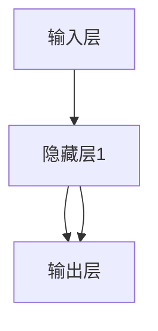

                 

# 神经网络：人工智能的基石

> 关键词：神经网络,深度学习,激活函数,损失函数,反向传播,前向传播,梯度下降,权重更新,反向传播,深度学习框架,卷积神经网络,循环神经网络,卷积操作,池化操作,循环神经元,长短时记忆网络,自编码器,强化学习,博弈论,深度学习框架

## 1. 背景介绍

### 1.1 问题由来
人工智能(AI)是计算机科学的一个重要分支，旨在构建能够自主思考、学习、决策的系统。其中，神经网络作为AI的核心技术之一，在图像识别、语音处理、自然语言处理等领域取得了巨大成功，成为推动AI技术发展的重要基石。

神经网络（Neural Network, NN）最早由生物学家和心理学家从生物神经网络得到启发，试图模拟大脑神经元的连接和相互作用，进而实现信息处理和学习。随着计算能力和数据量的不断增长，神经网络已经从简单的感知器演进到多层深度神经网络，推动了深度学习（Deep Learning, DL）的兴起，成为当前AI研究的热点。

### 1.2 问题核心关键点
神经网络作为一种计算模型，其核心思想是通过一系列简单且线性可分的节点，逐层组合成复杂的非线性函数，实现对数据的高效表示和处理。其主要特点包括：
- 参数共享：同一层中的节点共享相同的权重和偏置，降低了模型的参数量，提高了计算效率。
- 链式规则：每个节点的输出作为下一个节点的输入，形成链式传递关系。
- 反向传播：通过链式求导，计算每个节点的梯度，优化模型参数。
- 激活函数：引入非线性变换，使得网络能够学习非线性关系。
- 损失函数：用于衡量模型输出与真实标签之间的差异，指导模型优化。

深度学习框架（如TensorFlow、PyTorch等）的出现，使得神经网络的构建和训练更加简便高效。结合GPU和分布式计算等技术，神经网络已经广泛应用于图像识别、语音处理、自然语言处理、强化学习等领域，取得了诸多突破性成果。

## 2. 核心概念与联系

### 2.1 核心概念概述

神经网络是深度学习中的核心组成部分，主要由神经元和层级组成。其中，神经元（Neuron）是神经网络的基本单元，负责处理输入信号并产生输出信号；层（Layer）则由多个神经元组成，负责对输入进行逐层处理。

神经网络的训练过程，通常通过反向传播算法（Backpropagation）实现。在每个训练样本上，神经网络先进行前向传播（Forward Propagation），计算模型输出；再通过反向传播计算模型输出与真实标签的差异，并根据梯度下降（Gradient Descent）算法更新模型参数。这一过程不断迭代，直至模型收敛，训练完成。

### 2.2 核心概念联系

神经网络的学习过程可以类比于人类大脑的运作方式。前向传播类似于信息在神经元之间的单向流动，反向传播则类似于大脑通过反馈机制调整神经元之间的连接强度，以适应新的输入。通过大量的数据和算法优化，神经网络可以逐渐“学习”到数据的规律，实现对新数据的预测和生成。

图1：神经网络的基本结构



如图1所示，神经网络由输入层、隐藏层和输出层组成。其中，隐藏层通过多个神经元的非线性组合，实现对输入数据的高级表示。输出层则根据隐藏层的输出，生成最终结果。

## 3. 核心算法原理 & 具体操作步骤

### 3.1 算法原理概述

神经网络的核心算法包括前向传播（Forward Propagation）、反向传播（Backpropagation）和梯度下降（Gradient Descent）等。其中，前向传播用于计算模型输出，反向传播用于计算梯度，梯度下降用于更新模型参数。

### 3.2 算法步骤详解

#### 3.2.1 前向传播（Forward Propagation）
前向传播是神经网络的基本操作，用于计算模型在给定输入时的输出。假设输入为 $x$，模型为 $f(x, \theta)$，其中 $\theta$ 为模型参数，具体步骤如下：

1. 输入层：将输入数据 $x$ 传递给第一个隐藏层。
2. 隐藏层：对输入数据进行加权求和，并通过激活函数进行处理。
3. 输出层：对隐藏层的输出进行加权求和，并通过激活函数得到最终输出。

数学表达式为：
$$
h_1 = g(W_1x + b_1)
$$
$$
h_2 = g(W_2h_1 + b_2)
$$
$$
y = g(W_3h_2 + b_3)
$$
其中，$g$ 为激活函数，$W$ 为权重矩阵，$b$ 为偏置项。

#### 3.2.2 反向传播（Backpropagation）
反向传播是神经网络中用于计算梯度的重要算法。其核心思想是通过链式求导，计算每个节点的梯度，并更新模型参数。假设训练样本为 $(x, y)$，具体步骤如下：

1. 前向传播：根据输入 $x$ 计算模型输出 $y$。
2. 计算损失：使用损失函数（如均方误差、交叉熵等）计算模型输出与真实标签 $y$ 的差异。
3. 反向传播：通过链式求导，计算每个节点的梯度。
4. 梯度下降：使用梯度下降算法更新模型参数。

数学表达式为：
$$
\Delta L = \frac{\partial L}{\partial y}
$$
$$
\Delta h_2 = \frac{\partial L}{\partial h_2} \cdot \frac{\partial h_2}{\partial h_1} \cdot \frac{\partial h_1}{\partial x}
$$
$$
\Delta h_1 = \frac{\partial L}{\partial h_1} \cdot \frac{\partial h_1}{\partial x}
$$
$$
\Delta W_1 = \Delta h_1^T x
$$
$$
\Delta b_1 = \Delta h_1
$$
$$
\Delta W_2 = \Delta h_2^T h_1
$$
$$
\Delta b_2 = \Delta h_2
$$
$$
\Delta W_3 = \Delta y^T h_2
$$
$$
\Delta b_3 = \Delta y
$$

#### 3.2.3 梯度下降（Gradient Descent）
梯度下降算法用于根据计算出的梯度，更新模型参数。具体步骤如下：

1. 学习率：设定一个适当的学习率 $\alpha$，控制每次更新的步长。
2. 权重更新：使用梯度下降公式更新模型参数。
3. 迭代：重复上述步骤，直至模型收敛。

数学表达式为：
$$
\theta \leftarrow \theta - \alpha \nabla_{\theta}L
$$

其中，$\nabla_{\theta}L$ 为损失函数对模型参数的梯度。

### 3.3 算法优缺点

神经网络在深度学习和人工智能中具有以下优点：
- 非线性拟合：通过多层的组合，神经网络可以拟合任意复杂的非线性关系。
- 泛化能力：通过大量的训练数据，神经网络可以学习到数据的规律，具有较强的泛化能力。
- 可扩展性：神经网络可以通过增加隐藏层的深度和宽度，提升模型的表达能力。

但同时也存在以下缺点：
- 参数量大：神经网络参数量较多，训练和推理所需计算资源较大。
- 过拟合风险：在训练数据不足的情况下，神经网络容易过拟合，影响泛化能力。
- 训练复杂：神经网络训练过程复杂，需要大量的数据和计算资源，难以调试。
- 黑盒模型：神经网络的内部机制不透明，难以解释其决策过程。

## 4. 数学模型和公式 & 详细讲解 & 举例说明

### 4.1 数学模型构建

神经网络的数学模型通常包括输入层、隐藏层和输出层。假设输入层有 $n$ 个神经元，隐藏层有 $m$ 个神经元，输出层有 $k$ 个神经元，具体模型表达式如下：

$$
y = f(W^k \cdots f(W_2f(W_1x + b_1) + b_2) + b_3)
$$

其中，$W$ 为权重矩阵，$b$ 为偏置项，$f$ 为激活函数。

### 4.2 公式推导过程

以一个简单的多层感知器（Multilayer Perceptron, MLP）为例，推导其前向传播和反向传播公式。

假设输入层有 $n$ 个神经元，隐藏层有 $m$ 个神经元，输出层有 $k$ 个神经元。具体公式如下：

1. 输入层：
$$
h_1 = g(W_1x + b_1)
$$
其中，$g$ 为激活函数，$W_1$ 为权重矩阵，$b_1$ 为偏置项。

2. 隐藏层：
$$
h_2 = g(W_2h_1 + b_2)
$$
其中，$W_2$ 为权重矩阵，$b_2$ 为偏置项。

3. 输出层：
$$
y = g(W_3h_2 + b_3)
$$
其中，$W_3$ 为权重矩阵，$b_3$ 为偏置项。

### 4.3 案例分析与讲解

以图像分类为例，分析神经网络的处理过程。

假设输入为 $28 \times 28$ 的灰度图像，经过前向传播得到的结果为 $10$ 维的向量表示，使用 softmax 激活函数将结果转换为概率分布，最终预测出图像所属的类别。

具体公式为：
$$
h_1 = g(W_1x + b_1)
$$
$$
h_2 = g(W_2h_1 + b_2)
$$
$$
y = softmax(W_3h_2 + b_3)
$$

其中，$W_1$、$W_2$、$W_3$ 为权重矩阵，$b_1$、$b_2$、$b_3$ 为偏置项，$g$ 为激活函数。

## 5. 项目实践：代码实例和详细解释说明

### 5.1 开发环境搭建

在进行神经网络开发前，我们需要准备好开发环境。以下是使用Python进行TensorFlow开发的环境配置流程：

1. 安装Anaconda：从官网下载并安装Anaconda，用于创建独立的Python环境。

2. 创建并激活虚拟环境：
```bash
conda create -n tf-env python=3.8 
conda activate tf-env
```

3. 安装TensorFlow：从官网获取对应的安装命令。例如：
```bash
pip install tensorflow==2.4
```

4. 安装TensorBoard：TensorFlow配套的可视化工具，用于监测模型训练状态和可视化结果。

```bash
pip install tensorboard
```

5. 安装TensorFlow Addons：用于使用更多的TensorFlow特性和功能。

```bash
pip install tensorflow-addons
```

完成上述步骤后，即可在`tf-env`环境中开始神经网络开发。

### 5.2 源代码详细实现

下面我们以手写数字识别为例，给出使用TensorFlow对多层感知器（MLP）进行图像分类的代码实现。

首先，定义数据集和模型：

```python
import tensorflow as tf
from tensorflow.keras import layers, models

# 定义数据集
(x_train, y_train), (x_test, y_test) = tf.keras.datasets.mnist.load_data()
x_train = x_train.reshape((60000, 784)).astype('float32') / 255.0
x_test = x_test.reshape((10000, 784)).astype('float32') / 255.0
y_train = tf.keras.utils.to_categorical(y_train, 10)
y_test = tf.keras.utils.to_categorical(y_test, 10)

# 定义模型
model = models.Sequential([
    layers.Dense(512, activation='relu', input_shape=(784,)),
    layers.Dropout(0.2),
    layers.Dense(10, activation='softmax')
])
```

然后，编译模型并开始训练：

```python
# 编译模型
model.compile(optimizer='adam',
              loss='categorical_crossentropy',
              metrics=['accuracy'])

# 训练模型
model.fit(x_train, y_train, epochs=5, batch_size=32, validation_data=(x_test, y_test))
```

最后，在测试集上评估模型：

```python
# 评估模型
test_loss, test_acc = model.evaluate(x_test, y_test, verbose=2)
print('Test accuracy:', test_acc)
```

以上就是使用TensorFlow进行多层感知器图像分类的完整代码实现。可以看到，TensorFlow的Keras API使得神经网络的搭建和训练变得简洁高效。

### 5.3 代码解读与分析

让我们再详细解读一下关键代码的实现细节：

**数据集定义**：
- 使用TensorFlow自带的MNIST数据集，将28x28的图像转换为784维向量，并进行归一化处理。
- 使用`to_categorical`函数将标签转换为one-hot编码，方便模型的训练和评估。

**模型定义**：
- 定义一个包含两个密集层（Dense）的Sequential模型。
- 第一个密集层有512个神经元，使用ReLU激活函数。
- 第二个密集层有10个神经元，使用Softmax激活函数，输出概率分布。
- 在第一个密集层后添加Dropout层，以防止过拟合。

**模型编译和训练**：
- 使用Adam优化器和交叉熵损失函数编译模型。
- 使用`fit`函数训练模型，设置5个epoch和32个batch大小。
- 在每个epoch结束后，使用测试集评估模型性能。

**模型评估**：
- 使用`evaluate`函数计算模型在测试集上的损失和准确率。

通过上述代码，可以看到神经网络的构建和训练过程。TensorFlow的Keras API提供了许多预定义的层和优化器，使得开发者可以更快速地构建和训练复杂的神经网络。

## 6. 实际应用场景

### 6.1 图像识别

神经网络在图像识别领域取得了巨大成功。通过训练大量带有标签的图像数据，神经网络可以学习到复杂的特征表示，实现对新图像的准确分类。

具体应用场景包括：
- 人脸识别：使用卷积神经网络（Convolutional Neural Network, CNN）对输入的图像进行卷积操作和池化操作，提取特征，最终输出人脸标签。
- 物体检测：使用区域卷积神经网络（Region CNN, R-CNN）等方法，对输入图像进行物体检测和定位，提取物体特征，输出物体类别和位置。

### 6.2 语音识别

神经网络在语音识别领域也得到了广泛应用。通过训练大量带有标签的语音数据，神经网络可以学习到语音的声学特征，实现对新语音的准确转录。

具体应用场景包括：
- 自动语音识别（Automatic Speech Recognition, ASR）：使用循环神经网络（Recurrent Neural Network, RNN）或长短时记忆网络（Long Short-Term Memory, LSTM）对语音进行建模，提取特征，最终输出文本转录。
- 语音情感识别：使用情感分类器，对语音的情感进行分类，分析说话人的情绪状态。

### 6.3 自然语言处理

神经网络在自然语言处理（Natural Language Processing, NLP）领域也具有广泛应用。通过训练大量带有标签的文本数据，神经网络可以学习到文本的语义表示，实现对新文本的准确理解和生成。

具体应用场景包括：
- 机器翻译：使用序列到序列模型（Seq2Seq）对输入文本进行翻译，输出目标语言的文本。
- 文本分类：使用文本分类器，对输入文本进行分类，输出文本所属的类别。
- 问答系统：使用序列到序列模型或注意力机制（Attention），对输入问题进行理解和推理，输出问题的答案。

### 6.4 未来应用展望

随着神经网络技术的不断进步，未来的应用前景将更加广阔。以下是一些可能的发展方向：

1. 自监督学习：利用未标注数据进行预训练，减少对标注数据的依赖。
2. 跨模态学习：将神经网络应用于图像、语音、文本等多种模态数据的处理和融合，提升模型性能。
3. 强化学习：结合神经网络和强化学习算法，实现智能体在复杂环境中的自主学习和决策。
4. 联邦学习：将神经网络应用于分布式计算环境，实现不同节点之间的知识共享和模型更新。
5. 自适应学习：根据环境变化，动态调整神经网络的结构和参数，适应新任务的需求。

神经网络在人工智能领域的应用前景广阔，将带来更多革命性的突破。未来，随着技术的不断进步和应用场景的不断拓展，神经网络将为人类认知智能的进化带来新的动力。

## 7. 工具和资源推荐

### 7.1 学习资源推荐

为了帮助开发者系统掌握神经网络的理论基础和实践技巧，这里推荐一些优质的学习资源：

1. 《深度学习》系列博文：由深度学习领域的知名专家撰写，深入浅出地介绍了深度学习的基本概念和经典模型。

2. 斯坦福大学《深度学习》课程：由斯坦福大学教授开设的在线课程，讲解深度学习的基本原理和算法。

3. 《深度学习框架TensorFlow实战》书籍：由TensorFlow官方团队编写，介绍了TensorFlow的搭建和训练过程，以及实际应用案例。

4. PyTorch官方文档：PyTorch官方提供的文档，提供了丰富的教程和示例，是学习PyTorch的必备资料。

5. Kaggle竞赛：Kaggle是一个数据科学竞赛平台，提供了大量的数据集和挑战任务，帮助开发者在实际应用中提升技能。

通过对这些资源的学习实践，相信你一定能够快速掌握神经网络的理论基础和实践技巧，并用于解决实际的NLP问题。

### 7.2 开发工具推荐

高效的开发离不开优秀的工具支持。以下是几款用于神经网络开发和训练的常用工具：

1. TensorFlow：由Google主导开发的深度学习框架，生产部署方便，适合大规模工程应用。

2. PyTorch：由Facebook主导开发的深度学习框架，灵活易用，适合快速迭代研究。

3. Keras：一个高层次的深度学习框架，封装了TensorFlow和Theano等底层库，提供了简单易用的API，适合快速搭建和训练模型。

4. Caffe：一个高效的深度学习框架，适合图像处理和计算机视觉任务，具有较好的性能表现。

5. MXNet：一个高效的深度学习框架，支持多种编程语言和平台，适合分布式训练和部署。

6. TensorBoard：TensorFlow配套的可视化工具，用于监测模型训练状态和可视化结果。

7. Keras Tuner：一个用于超参数优化和模型搜索的库，可以自动搜索最优的超参数组合，提升模型性能。

合理利用这些工具，可以显著提升神经网络开发和训练的效率，加快创新迭代的步伐。

### 7.3 相关论文推荐

神经网络技术的发展源于学界的持续研究。以下是几篇奠基性的相关论文，推荐阅读：

1. 《深度学习》：Yoshua Bengio等撰写，介绍了深度学习的基本原理和算法，具有较高的学术价值和应用意义。

2. 《ImageNet Classification with Deep Convolutional Neural Networks》：Alex Krizhevsky等撰写，提出了卷积神经网络（CNN），开创了图像分类的新纪元。

3. 《Long Short-Term Memory》：Sung-Ryoon Seo等撰写，提出了长短时记忆网络（LSTM），解决了RNN的梯度消失问题，提升了序列建模能力。

4. 《Attention Is All You Need》：Ashish Vaswani等撰写，提出了自注意力机制（Attention），提升了序列建模的精度和效率。

5. 《Reinforcement Learning: An Introduction》：Richard S. Sutton等撰写，介绍了强化学习的基本原理和算法，具有较高的学术价值和应用意义。

这些论文代表了大神经网络技术的进展，通过学习这些前沿成果，可以帮助研究者把握学科前进方向，激发更多的创新灵感。

## 8. 总结：未来发展趋势与挑战

### 8.1 总结

本文对神经网络的基本原理和实际应用进行了全面系统的介绍。首先阐述了神经网络在人工智能中的重要地位和广泛应用，明确了神经网络的学习机制和训练过程。其次，从原理到实践，详细讲解了神经网络的构建和训练过程，给出了完整代码实例。同时，本文还探讨了神经网络在图像识别、语音识别、自然语言处理等众多领域的应用前景，展示了神经网络的巨大潜力。此外，本文精选了神经网络相关的学习资源，力求为读者提供全方位的技术指引。

通过本文的系统梳理，可以看到，神经网络作为一种计算模型，已经广泛应用于人工智能的各个领域，为实现人机协同的智能系统提供了重要支持。未来，随着技术的不断进步和应用场景的不断拓展，神经网络必将在更多领域中发挥其强大的作用，推动人工智能技术的进一步发展。

### 8.2 未来发展趋势

展望未来，神经网络的发展将呈现以下几个趋势：

1. 更加复杂的模型结构：随着计算能力的提升，神经网络的模型结构将更加复杂，能够处理更加复杂的任务。

2. 更加高效的训练方法：未来将出现更加高效的训练方法，如自监督学习、联邦学习、自适应学习等，减少对标注数据的依赖，提高模型的泛化能力。

3. 更加广泛的应用场景：神经网络将应用于更多领域，如医疗、金融、自动驾驶等，为各行各业带来变革性影响。

4. 更加鲁棒的模型性能：神经网络将更加注重模型的鲁棒性和稳定性，减少对特定数据的依赖，提升模型的泛化能力。

5. 更加智能的学习机制：未来的神经网络将更加注重学习机制的智能性，能够自主学习、自主决策，提升系统的智能水平。

### 8.3 面临的挑战

尽管神经网络在人工智能领域取得了诸多成功，但在发展过程中也面临着诸多挑战：

1. 计算资源瓶颈：大规模神经网络的训练和推理需要大量的计算资源，硬件成本较高。

2. 数据标注成本：神经网络需要大量的标注数据进行训练，标注成本较高，数据质量难以保证。

3. 模型解释性不足：神经网络的决策过程不透明，难以解释其内部机制和决策逻辑。

4. 数据隐私问题：神经网络需要大量数据进行训练，数据隐私和安全问题值得关注。

5. 模型鲁棒性不足：神经网络对数据扰动和攻击的鲁棒性较差，容易受到噪声和对抗样本的干扰。

### 8.4 研究展望

面对神经网络面临的挑战，未来的研究需要在以下几个方面寻求新的突破：

1. 更高效的计算资源：探索更高效的计算框架和算法，如分布式计算、混合精度训练等，提升训练效率，降低硬件成本。

2. 更智能的学习机制：结合人工智能、认知科学等学科的研究成果，提升神经网络的智能水平，增强自主学习能力和决策能力。

3. 更鲁棒的模型性能：研究鲁棒性更强的神经网络模型，如对抗样本鲁棒性、数据扰动鲁棒性等，提升模型的泛化能力。

4. 更智能的决策机制：结合博弈论、认知心理学等学科的研究成果，提升神经网络的决策能力和解释性，增强系统的智能水平。

5. 更智能的隐私保护：研究更智能的隐私保护技术，如联邦学习、差分隐私等，保护数据隐私和安全。

## 9. 附录：常见问题与解答

**Q1：神经网络需要多少数据才能有效训练？**

A: 神经网络的训练需要足够的数据量才能有效。通常，数据量越大，模型的泛化能力越强。在图像分类任务中，需要成千上万的图像进行训练，才能取得良好的效果。在自然语言处理任务中，需要大量的文本数据进行训练，才能学习到丰富的语言知识。但需要注意的是，数据量的增加也会带来计算资源和存储资源的需求增加。

**Q2：神经网络需要多少计算资源才能有效训练？**

A: 神经网络的训练需要大量的计算资源，包括高性能CPU、GPU和TPU等。通常，神经网络模型越大、层数越深，所需的计算资源越多。在实际应用中，可以根据任务需求和资源条件，选择合适的计算资源，进行模型训练和推理。

**Q3：神经网络的训练过程如何进行？**

A: 神经网络的训练过程通常包括以下步骤：
1. 数据预处理：对输入数据进行归一化、标准化、分词等处理，准备输入数据。
2. 模型搭建：根据任务需求，搭建合适的神经网络模型，选择合适的激活函数、损失函数和优化器。
3. 训练模型：使用训练数据对模型进行训练，通过前向传播和反向传播更新模型参数。
4. 评估模型：使用测试数据对模型进行评估，计算模型的准确率和损失函数，评估模型的性能。
5. 模型优化：根据评估结果，对模型进行优化，如调整超参数、增加训练数据等。

**Q4：神经网络在实际应用中需要注意哪些问题？**

A: 神经网络在实际应用中需要注意以下问题：
1. 过拟合问题：神经网络容易过拟合，需要在训练过程中加入正则化、Dropout等技术，避免过拟合。
2. 泛化能力问题：神经网络需要大量数据进行训练，才能取得良好的泛化能力。需要在数据预处理、模型设计、训练策略等方面进行优化。
3. 计算资源问题：神经网络的训练和推理需要大量的计算资源，需要注意硬件资源的限制。
4. 数据隐私问题：神经网络需要大量数据进行训练，需要注意数据隐私和安全问题。
5. 模型解释性问题：神经网络的决策过程不透明，需要注意模型的解释性和可解释性问题。

**Q5：神经网络的未来发展方向是什么？**

A: 神经网络的未来发展方向包括：
1. 更高效的计算资源：探索更高效的计算框架和算法，如分布式计算、混合精度训练等，提升训练效率，降低硬件成本。
2. 更智能的学习机制：结合人工智能、认知科学等学科的研究成果，提升神经网络的智能水平，增强自主学习能力和决策能力。
3. 更鲁棒的模型性能：研究鲁棒性更强的神经网络模型，如对抗样本鲁棒性、数据扰动鲁棒性等，提升模型的泛化能力。
4. 更智能的决策机制：结合博弈论、认知心理学等学科的研究成果，提升神经网络的决策能力和解释性，增强系统的智能水平。
5. 更智能的隐私保护：研究更智能的隐私保护技术，如联邦学习、差分隐私等，保护数据隐私和安全。

通过对这些问题的回答，可以看到神经网络在实际应用中需要注意的问题和未来发展的方向。只有不断地探索和优化，才能推动神经网络技术的发展，带来更多革命性的突破。

---

作者：禅与计算机程序设计艺术 / Zen and the Art of Computer Programming

