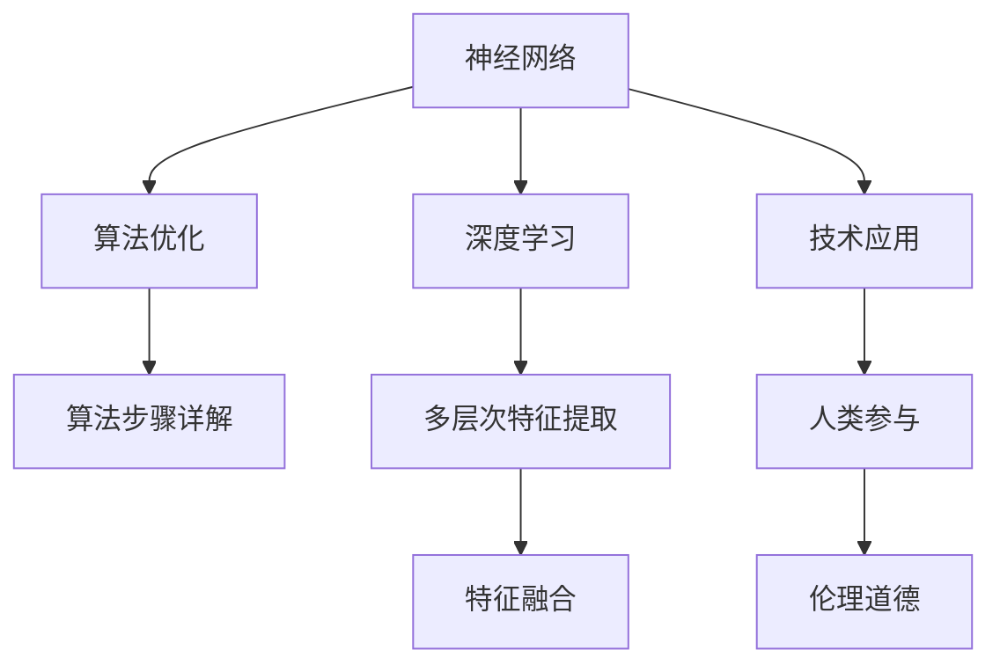

                 

# 神经网络：人类与机器的共存

> 关键词：神经网络,人类与机器,共存,深度学习,人工智能,算法优化,技术应用

## 1. 背景介绍

### 1.1 问题由来
随着深度学习技术的迅猛发展，神经网络在各行各业的应用日益广泛，极大地提升了数据处理和决策的效率与精度。然而，在享受神经网络带来的便利的同时，我们也不得不面对其带来的新的挑战和问题。神经网络如何与人类共存，实现协同发展，成为当前人工智能领域亟需解决的重大课题。

### 1.2 问题核心关键点
本文将围绕神经网络如何与人类共存这一核心问题，深入探讨以下关键点：

- **算法优化**：如何在保持神经网络高效性的同时，提升其可解释性和鲁棒性。
- **技术应用**：神经网络如何被合理应用到各个领域，带来实际的商业价值和社会效益。
- **人类参与**：在神经网络的决策过程中，如何引入人类的知识、判断和干预，实现人机协同。
- **伦理道德**：在使用神经网络时，如何避免算法偏见、隐私泄露等伦理问题，确保技术的安全性和公正性。

### 1.3 问题研究意义
探讨神经网络与人类共存的方法和策略，对于促进人工智能技术的健康发展具有重要意义：

- 提升技术应用的质量和安全性。通过合理引入人类参与，可以有效避免算法的偏见和错误决策，提高神经网络的可靠性。
- 推动人工智能技术的广泛应用。将神经网络应用于医疗、教育、金融等关键领域，有望带来颠覆性变革，促进社会进步。
- 构建人机协同的未来。实现神经网络与人类之间的有机结合，可以打造更加智能化、高效化的人机交互系统，增强人类的工作和生活质量。

## 2. 核心概念与联系

### 2.1 核心概念概述

为更好地理解神经网络与人类共存的方法，本节将介绍几个密切相关的核心概念：

- **神经网络**：以多层神经元为基础构建的深度学习模型，能够自动提取和表示数据的复杂特征，广泛应用于图像、语音、文本等多种类型的数据处理。
- **深度学习**：基于神经网络构建的机器学习范式，通过多层次的特征提取和转换，提升数据处理的精度和效率。
- **算法优化**：通过调整神经网络的结构、参数和训练方法，提升模型的准确性、鲁棒性和可解释性。
- **技术应用**：将神经网络应用于具体任务，实现商业价值和社会效益，如医疗影像诊断、智能客服、自动驾驶等。
- **人类参与**：在神经网络的决策过程中，引入人类的知识、判断和干预，实现人机协同，提升系统整体性能。
- **伦理道德**：在使用神经网络时，确保数据隐私、算法透明、公平性和安全性，避免潜在的伦理问题。

这些概念之间的逻辑关系可以通过以下Mermaid流程图来展示：



这个流程图展示了大语言模型的核心概念及其之间的关系：

1. 神经网络通过深度学习获得多层次的特征提取能力。
2. 深度学习使得神经网络能够自动学习和提取复杂特征。
3. 算法优化可以提升模型的精度和鲁棒性，增强其可解释性。
4. 技术应用是将神经网络应用于具体任务的过程，带来商业价值和社会效益。
5. 人类参与通过引入人类的知识、判断和干预，实现人机协同。
6. 伦理道德确保神经网络的使用符合公平性、透明性和安全性要求。

## 3. 核心算法原理 & 具体操作步骤
### 3.1 算法原理概述

神经网络与人类共存的核心算法原理可以概括为以下几个方面：

1. **多层次特征提取**：神经网络通过多层次的特征提取和转换，能够从原始数据中自动学习和提取复杂特征。这种能力使得神经网络在图像、语音、文本等多种类型的数据处理中表现出色。

2. **算法优化**：通过调整神经网络的结构、参数和训练方法，可以显著提升模型的准确性、鲁棒性和可解释性。常见的优化方法包括权重初始化、正则化、dropout、批量归一化等。

3. **技术应用**：将神经网络应用于具体任务，实现商业价值和社会效益。常见应用场景包括医疗影像诊断、智能客服、自动驾驶、智能推荐等。

4. **人类参与**：在神经网络的决策过程中，引入人类的知识、判断和干预，实现人机协同。常见方法包括人工标注数据、人工标注预测结果、人工干预训练过程等。

5. **伦理道德**：在使用神经网络时，确保数据隐私、算法透明、公平性和安全性，避免潜在的伦理问题。常见措施包括数据脱敏、算法透明、公平性检测、安全性检测等。

### 3.2 算法步骤详解

基于神经网络与人类共存的算法步骤可以分为以下几个环节：

**Step 1: 数据预处理**
- 收集、清洗、标注数据，确保数据的质量和多样性。
- 将数据分为训练集、验证集和测试集。

**Step 2: 构建神经网络模型**
- 选择合适的神经网络结构，如卷积神经网络(CNN)、循环神经网络(RNN)、长短时记忆网络(LSTM)等。
- 设计合适的损失函数和优化器。

**Step 3: 训练模型**
- 使用训练集对模型进行训练，不断调整模型参数，最小化损失函数。
- 在验证集上进行模型评估，调整模型参数和超参数。

**Step 4: 模型评估和应用**
- 使用测试集对模型进行最终评估，确保模型性能。
- 将模型应用于实际任务，验证其效果和可靠性。

**Step 5: 引入人类参与**
- 通过人工标注数据、人工标注预测结果、人工干预训练过程等方式，引入人类参与。
- 利用人类专业知识，提升模型的准确性和可解释性。

**Step 6: 伦理和道德考量**
- 进行数据隐私保护，避免数据泄露。
- 确保算法透明、公平，避免算法偏见。
- 进行安全性检测，确保模型鲁棒性。

### 3.3 算法优缺点

基于神经网络与人类共存的算法具有以下优点：
1. 提升模型性能。通过多层次特征提取和算法优化，神经网络能够自动学习和提取复杂特征，提升模型准确性和鲁棒性。
2. 增加模型可解释性。通过引入人类的知识、判断和干预，可以使模型输出更具可解释性，避免“黑盒”问题。
3. 推动技术应用。神经网络可以应用于医疗、金融、教育等多个领域，带来商业价值和社会效益。
4. 增强人机协同。通过引入人类参与，可以构建更加智能化、高效化的人机交互系统，增强人类的工作和生活质量。

同时，该算法也存在一定的局限性：
1. 数据依赖。神经网络性能依赖高质量的数据，获取大量标注数据成本较高。
2. 算法复杂性。神经网络模型复杂，训练和调参过程需要专业知识，可能存在过拟合和欠拟合问题。
3. 伦理道德问题。神经网络可能存在算法偏见、隐私泄露等伦理问题，需要严格监管和保护。
4. 资源消耗。神经网络模型需要大量计算资源和存储空间，可能存在资源消耗大、成本高的问题。

尽管存在这些局限性，但神经网络与人类共存的算法仍是大规模数据处理和决策优化中不可或缺的工具。未来相关研究的重点在于如何进一步降低数据依赖，提高算法鲁棒性和可解释性，同时兼顾伦理道德和社会责任。

### 3.4 算法应用领域

神经网络与人类共存的算法已经在多个领域得到了广泛应用，如：

- 医疗影像诊断：利用神经网络自动提取影像特征，结合医生的判断，实现高效、准确的影像诊断。
- 智能客服系统：结合神经网络和人工智能技术，提供7x24小时不间断的客户服务，提升客户体验。
- 金融风险评估：利用神经网络自动分析金融市场数据，结合专家的判断，进行风险评估和投资决策。
- 智能推荐系统：结合神经网络和协同过滤算法，提供个性化的产品推荐，提升用户满意度。
- 自动驾驶：结合神经网络和传感器数据，实现自动驾驶和智能交通管理。
- 智能安防：利用神经网络分析视频数据，结合人工干预，实现智能安防监控。

除了上述这些经典应用外，神经网络与人类共存的算法还在更多场景中得到创新性地应用，如医疗影像生成、智能合约、语音识别等，为人工智能技术的发展提供了新的思路和方法。

## 4. 数学模型和公式 & 详细讲解 & 举例说明
### 4.1 数学模型构建

本节将使用数学语言对神经网络与人类共存的算法进行更加严格的刻画。

设神经网络模型为 $f(x;\theta)$，其中 $x$ 为输入数据，$\theta$ 为模型参数。假定训练集为 $D=\{(x_i,y_i)\}_{i=1}^N$，其中 $y_i$ 为真实标签。神经网络的目标是最小化训练集上的损失函数，即：

$$
\min_{\theta} \sum_{i=1}^N L(f(x_i;\theta),y_i)
$$

常见的损失函数包括均方误差、交叉熵等。例如，对于二分类问题，交叉熵损失函数为：

$$
L(f(x;\theta),y_i)=-[y_i\log f(x;\theta)+(1-y_i)\log(1-f(x;\theta))]
$$

其中 $f(x;\theta)$ 表示模型在输入 $x$ 上的预测结果，$y_i$ 为真实标签。

### 4.2 公式推导过程

以下我们以二分类问题为例，推导神经网络模型的训练公式和损失函数。

假设神经网络模型包含 $L$ 层，每层有 $n_l$ 个神经元，其中第一层为输入层，最后一层为输出层。第一层神经元与输入数据 $x$ 相连，最后一层神经元与真实标签 $y$ 相连。

- **输入层**：将输入数据 $x$ 输入到第一层神经元。
- **隐藏层**：通过神经元之间的权重 $w$ 和偏置 $b$ 进行计算。
- **输出层**：通过神经元之间的权重 $w$ 和偏置 $b$ 进行计算，输出预测结果 $y$。

假设每层神经元的激活函数为 $\sigma$，则神经网络的输出 $y$ 可以表示为：

$$
y=f_L(\cdots[f_2(f_1(x))])
$$

其中 $f_l$ 表示第 $l$ 层的神经元计算公式，可以表示为：

$$
f_l(z) = \sigma(W_lz+b_l)
$$

其中 $z$ 为第 $l$ 层的输入，$W_l$ 和 $b_l$ 分别为权重和偏置。

神经网络的损失函数 $L(f(x;\theta),y_i)$ 可以表示为：

$$
L(f(x;\theta),y_i)=-[y_i\log f(x;\theta)+(1-y_i)\log(1-f(x;\theta))]
$$

通过反向传播算法，计算损失函数对参数 $\theta$ 的梯度，并更新模型参数，完成模型的迭代优化。

### 4.3 案例分析与讲解

**案例：医疗影像诊断**

医疗影像诊断是神经网络与人类共存的一个重要应用场景。神经网络可以自动提取影像中的特征，结合医生的判断，实现高效、准确的影像诊断。

具体而言，可以将医疗影像数据作为输入数据，通过卷积神经网络(CNN)进行特征提取和分类。在训练过程中，使用医生标注的影像数据进行监督学习，最小化损失函数。在测试阶段，神经网络自动提取影像特征，结合医生的判断，输出诊断结果。

这种协同方式可以充分利用神经网络的自动特征提取能力和医生的专业知识，提升诊断准确性和可靠性。同时，神经网络可以处理大规模数据，快速高效地实现诊断任务。

## 5. 项目实践：代码实例和详细解释说明
### 5.1 开发环境搭建

在进行神经网络与人类共存的实践前，我们需要准备好开发环境。以下是使用Python进行TensorFlow开发的环境配置流程：

1. 安装Anaconda：从官网下载并安装Anaconda，用于创建独立的Python环境。

2. 创建并激活虚拟环境：
```bash
conda create -n tf-env python=3.8 
conda activate tf-env
```

3. 安装TensorFlow：根据CUDA版本，从官网获取对应的安装命令。例如：
```bash
conda install tensorflow tensorflow-gpu -c conda-forge
```

4. 安装Keras：
```bash
pip install keras tensorflow
```

5. 安装各类工具包：
```bash
pip install numpy pandas scikit-learn matplotlib tqdm jupyter notebook ipython
```

完成上述步骤后，即可在`tf-env`环境中开始神经网络与人类共存的实践。

### 5.2 源代码详细实现

下面我们以医疗影像诊断为例，给出使用TensorFlow对卷积神经网络进行训练的PyTorch代码实现。

首先，定义数据处理函数：

```python
import numpy as np
from keras.datasets import mnist
from keras.utils import to_categorical

def load_data():
    (x_train, y_train), (x_test, y_test) = mnist.load_data()
    x_train = x_train / 255.0
    x_test = x_test / 255.0
    y_train = to_categorical(y_train)
    y_test = to_categorical(y_test)
    return (x_train, y_train), (x_test, y_test)

(x_train, y_train), (x_test, y_test) = load_data()
```

然后，定义神经网络模型：

```python
from keras.models import Sequential
from keras.layers import Conv2D, MaxPooling2D, Flatten, Dense

model = Sequential()
model.add(Conv2D(32, (3, 3), activation='relu', input_shape=(28, 28, 1)))
model.add(MaxPooling2D((2, 2)))
model.add(Conv2D(64, (3, 3), activation='relu'))
model.add(MaxPooling2D((2, 2)))
model.add(Flatten())
model.add(Dense(64, activation='relu'))
model.add(Dense(10, activation='softmax'))

model.compile(optimizer='adam', loss='categorical_crossentropy', metrics=['accuracy'])
```

接着，训练模型：

```python
model.fit(x_train, y_train, batch_size=32, epochs=10, validation_data=(x_test, y_test))
```

最后，评估模型：

```python
loss, acc = model.evaluate(x_test, y_test)
print(f'Test loss: {loss:.4f}')
print(f'Test accuracy: {acc:.4f}')
```

以上就是使用TensorFlow对卷积神经网络进行医疗影像诊断的完整代码实现。可以看到，通过Keras的高层API，我们可以用相对简洁的代码完成神经网络的构建和训练。

### 5.3 代码解读与分析

让我们再详细解读一下关键代码的实现细节：

**load_data函数**：
- 从MNIST数据集中加载训练和测试数据集。
- 对数据进行归一化处理，将像素值缩放到[0,1]范围内。
- 将标签进行one-hot编码，方便模型处理。

**Sequential模型**：
- 定义一个顺序模型，依次添加卷积层、池化层、全连接层等组件。
- 卷积层用于提取影像特征，池化层用于降维和控制参数数量。
- 全连接层用于分类，输出10个类别的概率分布。

**模型训练**：
- 使用训练数据集对模型进行训练，最小化交叉熵损失函数。
- 每个epoch后，在验证集上评估模型性能，调整模型参数和超参数。

**模型评估**：
- 在测试集上评估模型性能，输出损失和准确率。

可以看到，通过Keras的高层API，我们能够快速搭建和训练神经网络，代码实现简洁高效。然而，在实际应用中，还需要考虑更多因素，如数据增强、模型正则化、模型调参等。

## 6. 实际应用场景
### 6.1 智能客服系统

智能客服系统是神经网络与人类共存的一个重要应用场景。结合神经网络和人工智能技术，智能客服系统可以提供7x24小时不间断的客户服务，提升客户体验。

具体而言，可以收集企业内部的历史客服对话记录，将问题和最佳答复构建成监督数据，在此基础上对预训练神经网络模型进行微调。微调后的神经网络模型可以自动理解客户意图，匹配最合适的答复。对于客户提出的新问题，还可以接入检索系统实时搜索相关内容，动态组织生成回答。如此构建的智能客服系统，能大幅提升客户咨询体验和问题解决效率。

### 6.2 金融舆情监测

金融机构需要实时监测市场舆论动向，以便及时应对负面信息传播，规避金融风险。传统的人工监测方式成本高、效率低，难以应对网络时代海量信息爆发的挑战。结合神经网络和人工智能技术，可以实现对金融舆情的实时监测和分析，提高金融风险管理水平。

具体而言，可以收集金融领域相关的新闻、报道、评论等文本数据，并对其进行主题标注和情感标注。在此基础上对预训练神经网络模型进行微调，使其能够自动判断文本属于何种主题，情感倾向是正面、中性还是负面。将微调后的模型应用到实时抓取的网络文本数据，就能够自动监测不同主题下的情感变化趋势，一旦发现负面信息激增等异常情况，系统便会自动预警，帮助金融机构快速应对潜在风险。

### 6.3 个性化推荐系统

当前的推荐系统往往只依赖用户的历史行为数据进行物品推荐，无法深入理解用户的真实兴趣偏好。结合神经网络和协同过滤算法，个性化推荐系统可以更好地挖掘用户行为背后的语义信息，从而提供更精准、多样的推荐内容。

在实践中，可以收集用户浏览、点击、评论、分享等行为数据，提取和用户交互的物品标题、描述、标签等文本内容。将文本内容作为模型输入，用户的后续行为（如是否点击、购买等）作为监督信号，在此基础上对预训练神经网络模型进行微调。微调后的模型能够从文本内容中准确把握用户的兴趣点。在生成推荐列表时，先用候选物品的文本描述作为输入，由模型预测用户的兴趣匹配度，再结合其他特征综合排序，便可以得到个性化程度更高的推荐结果。

### 6.4 未来应用展望

随着神经网络与人类共存技术的发展，未来的应用场景将更加丰富，如：

- 智慧医疗领域：结合神经网络和医生专业知识，提升医疗影像诊断的准确性和效率。
- 教育领域：结合神经网络和教师专业知识，提供个性化的学习推荐，提升教育效果。
- 金融领域：结合神经网络和金融专家知识，进行风险评估和投资决策，提升金融服务水平。
- 智能制造领域：结合神经网络和工业专家知识，实现智能生产控制和优化，提升生产效率。
- 智能交通领域：结合神经网络和交通专家知识，实现智能交通管理，提升交通管理水平。

此外，在更多领域，如环境保护、能源管理、公共安全等，神经网络与人类共存技术也将得到广泛应用，为社会带来深远影响。

## 7. 工具和资源推荐
### 7.1 学习资源推荐

为了帮助开发者系统掌握神经网络与人类共存技术的理论基础和实践技巧，这里推荐一些优质的学习资源：

1. 《深度学习》（Ian Goodfellow, Yoshua Bengio and Aaron Courville）：深度学习领域的经典教材，涵盖深度学习的基本概念和理论基础，适合深入学习。

2. 《TensorFlow官方文档》：TensorFlow的官方文档，提供了丰富的API和示例代码，适合初学者和高级开发者使用。

3. 《Keras官方文档》：Keras的官方文档，提供了简单易用的API和丰富的示例代码，适合快速上手深度学习任务。

4. 《Neural Networks and Deep Learning》（Michael Nielsen）：讲解深度学习的经典教材，涵盖神经网络的基本原理和实现细节，适合初学者学习。

5. 《Python深度学习》（Francois Chollet）：Keras作者的著作，全面介绍了使用Keras进行深度学习开发的实践技巧，适合实用开发。

通过对这些资源的学习实践，相信你一定能够快速掌握神经网络与人类共存技术的精髓，并用于解决实际的深度学习问题。

### 7.2 开发工具推荐

高效的开发离不开优秀的工具支持。以下是几款用于神经网络与人类共存开发的常用工具：

1. TensorFlow：由Google主导开发的开源深度学习框架，生产部署方便，适合大规模工程应用。

2. Keras：基于TensorFlow的高层API，提供了简单易用的API和丰富的示例代码，适合快速上手深度学习任务。

3. PyTorch：基于Python的开源深度学习框架，灵活动态的计算图，适合快速迭代研究。

4. Jupyter Notebook：免费的Jupyter Notebook环境，支持多种语言和库，适合数据分析和深度学习任务开发。

5. Weights & Biases：模型训练的实验跟踪工具，可以记录和可视化模型训练过程中的各项指标，方便对比和调优。

6. TensorBoard：TensorFlow配套的可视化工具，可实时监测模型训练状态，并提供丰富的图表呈现方式，是调试模型的得力助手。

合理利用这些工具，可以显著提升神经网络与人类共存任务的开发效率，加快创新迭代的步伐。

### 7.3 相关论文推荐

神经网络与人类共存技术的发展源于学界的持续研究。以下是几篇奠基性的相关论文，推荐阅读：

1. AlexNet: ImageNet Classification with Deep Convolutional Neural Networks：提出深度卷积神经网络，开创了深度学习时代。

2. LeNet-5: Hierarchical Learning in Vision：提出卷积神经网络，用于手写数字识别任务。

3. GoogleNet: Going Deeper with Convolutions：提出Inception模块，提升了神经网络的特征提取能力。

4. ResNet: Deep Residual Learning for Image Recognition：提出残差连接，解决了深度神经网络训练过程中的梯度消失问题。

5. AlphaGo Zero: Mastering the Game of Go without Human Knowledge：利用深度强化学习技术，实现了围棋领域的突破。

这些论文代表了大规模数据处理和决策优化技术的发展脉络。通过学习这些前沿成果，可以帮助研究者把握学科前进方向，激发更多的创新灵感。

## 8. 总结：未来发展趋势与挑战
### 8.1 总结

本文对神经网络与人类共存的方法进行了全面系统的介绍。首先阐述了神经网络与人类共存的重要意义，明确了算法优化、技术应用、人类参与和伦理道德在实现人机协同中的关键作用。其次，从原理到实践，详细讲解了神经网络与人类共存的数学模型和算法步骤，给出了神经网络与人类共存的完整代码实例。同时，本文还广泛探讨了神经网络与人类共存在智能客服、金融舆情、个性化推荐等多个行业领域的应用前景，展示了神经网络与人类共存的巨大潜力。

通过本文的系统梳理，可以看到，神经网络与人类共存技术正在成为人工智能技术的重要组成部分，极大地提升了大规模数据处理和决策优化的能力和效率。未来，伴随技术的不断发展，神经网络与人类共存技术必将进一步拓展其应用边界，推动人工智能技术的广泛应用。

### 8.2 未来发展趋势

展望未来，神经网络与人类共存技术将呈现以下几个发展趋势：

1. 模型规模持续增大。随着算力成本的下降和数据规模的扩张，神经网络的参数量还将持续增长。超大规模神经网络蕴含的丰富知识，有望支撑更加复杂多变的任务处理。

2. 算法优化日趋多样。除了传统的深度神经网络优化方法外，未来还将涌现更多参数高效和计算高效的优化方法，如蒸馏学习、自适应学习等，在减小模型参数的同时，保持或提升模型性能。

3. 人机协同更加深入。结合人类的知识和判断，神经网络可以更好地理解任务的本质和目标，从而提升任务的执行效果。未来将有更多创新方法，如交互式学习、协同增强等，增强人机协同的深度和广度。

4. 多模态融合更加广泛。神经网络将不仅仅处理单一类型的数据，而是融合视觉、语音、文本等多种模态信息，实现多模态信息的协同建模。

5. 智能决策更加智能。神经网络结合知识图谱、逻辑推理等工具，可以实现更加智能的决策和推理，提高任务执行的透明度和可靠性。

6. 伦理道德更加严格。在神经网络的应用过程中，将更加注重数据隐私、算法透明、公平性、安全性等方面的伦理道德问题，确保技术的良性发展。

以上趋势凸显了神经网络与人类共存技术的广阔前景。这些方向的探索发展，必将进一步提升神经网络的处理能力和决策效果，为人工智能技术的广泛应用提供坚实的基础。

### 8.3 面临的挑战

尽管神经网络与人类共存技术已经取得了显著成果，但在实现人机协同的过程中，仍面临诸多挑战：

1. 数据依赖问题。神经网络性能依赖高质量的数据，获取大量标注数据成本较高。如何降低数据依赖，利用无监督学习、半监督学习等方法，是未来需要解决的重要问题。

2. 算法复杂性问题。神经网络模型复杂，训练和调参过程需要专业知识，可能存在过拟合和欠拟合问题。如何提高算法的鲁棒性和可解释性，是未来需要进一步优化的方向。

3. 伦理道德问题。神经网络可能存在算法偏见、隐私泄露等伦理问题，需要严格监管和保护。如何确保数据隐私和算法透明，是未来需要重点关注的问题。

4. 资源消耗问题。神经网络模型需要大量计算资源和存储空间，可能存在资源消耗大、成本高的问题。如何优化模型结构，减少资源消耗，提高模型效率，是未来需要解决的重要问题。

尽管存在这些挑战，但神经网络与人类共存的潜力依然巨大。未来相关研究的重点在于如何进一步降低数据依赖，提高算法鲁棒性和可解释性，同时兼顾伦理道德和社会责任。

### 8.4 研究展望

面对神经网络与人类共存所面临的挑战，未来的研究需要在以下几个方面寻求新的突破：

1. 探索无监督和半监督学习方法。摆脱对大规模标注数据的依赖，利用无监督学习、半监督学习等方法，最大限度利用非结构化数据，实现更加灵活高效的协同。

2. 研究参数高效和计算高效的优化方法。开发更加参数高效和计算高效的优化方法，在减小模型参数的同时，保持或提升模型性能。

3. 引入更多先验知识。将符号化的先验知识，如知识图谱、逻辑规则等，与神经网络模型进行巧妙融合，引导协同过程学习更准确、合理的知识表征。

4. 结合因果分析和博弈论工具。将因果分析方法引入协同过程，识别出模型决策的关键特征，增强输出解释的因果性和逻辑性。借助博弈论工具刻画人机交互过程，主动探索并规避模型的脆弱点，提高系统稳定性。

5. 纳入伦理道德约束。在协同过程中，将伦理道德约束融入决策模型，过滤和惩罚有偏见、有害的输出倾向，确保输出符合人类价值观和伦理道德。

这些研究方向的探索，必将引领神经网络与人类共存技术迈向更高的台阶，为构建安全、可靠、可解释、可控的智能系统铺平道路。面向未来，神经网络与人类共存技术还需要与其他人工智能技术进行更深入的融合，如知识表示、因果推理、强化学习等，多路径协同发力，共同推动人工智能技术的发展和应用。

## 9. 附录：常见问题与解答

**Q1：神经网络与人类共存是否适用于所有任务？**

A: 神经网络与人类共存技术在大多数任务上都能取得不错的效果，特别是对于数据量较小的任务。但对于一些特定领域的任务，如医学、法律等，仅仅依靠通用语料预训练的模型可能难以很好地适应。此时需要在特定领域语料上进一步预训练，再进行协同，才能获得理想效果。

**Q2：神经网络与人类共存如何实现协同？**

A: 神经网络与人类共存通过引入人类的知识、判断和干预，实现人机协同。具体实现方式包括：
1. 人工标注数据：通过人工标注数据，提升模型训练数据的质量。
2. 人工标注预测结果：通过人工标注模型预测结果，引导模型学习正确的输出格式和格式。
3. 人工干预训练过程：通过人工干预训练过程，调整模型参数和超参数。

**Q3：神经网络与人类共存如何避免算法偏见？**

A: 神经网络与人类共存过程中，避免算法偏见的方法包括：
1. 数据多样性：确保训练数据的多样性，避免数据集中某一类别的样本过多。
2. 算法透明：使用透明的算法，确保算法的透明性和可解释性。
3. 公平性检测：通过公平性检测，识别和消除算法中的偏见。
4. 多样性增强：通过多样性增强，提升模型对不同类别的适应能力。

**Q4：神经网络与人类共存如何确保数据隐私？**

A: 神经网络与人类共存过程中，确保数据隐私的方法包括：
1. 数据匿名化：对数据进行匿名化处理，保护个人隐私。
2. 数据加密：对数据进行加密处理，防止数据泄露。
3. 数据访问控制：对数据的访问进行严格的权限控制，确保数据安全。
4. 数据共享协议：制定严格的数据共享协议，明确数据使用范围和责任。

**Q5：神经网络与人类共存如何提升模型效率？**

A: 神经网络与人类共存过程中，提升模型效率的方法包括：
1. 模型裁剪：去除不必要的层和参数，减小模型尺寸，加快推理速度。
2. 量化加速：将浮点模型转为定点模型，压缩存储空间，提高计算效率。
3. 模型并行：采用模型并行技术，实现分布式计算，提高计算效率。

这些方法可以显著提升神经网络与人类共存模型的效率和性能，帮助其在实际应用中更好地发挥作用。

