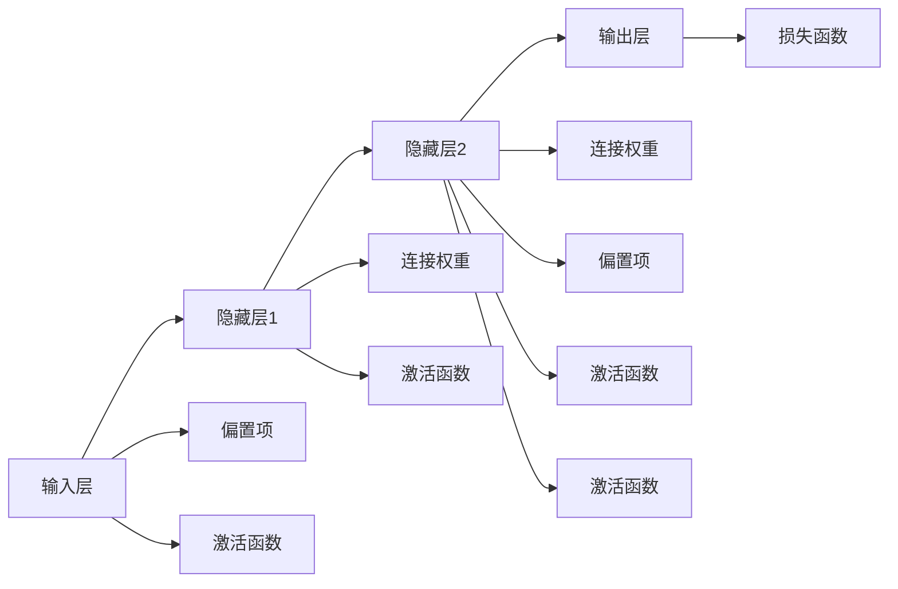

                 

# 神经网络：人类智慧的解放

## 1. 背景介绍

### 1.1 问题由来
神经网络，自诞生以来，就在人工智能的浪潮中占据着核心地位。从最初的感知机、BP网络，到深度学习时代的卷积神经网络（CNN）、循环神经网络（RNN）和变分自编码器（VAE），神经网络不断发展，以其强大的表达能力和泛化能力，逐步从学术界走向产业界，从理论探索走向实际应用。

现代神经网络的核心，在于通过学习数据分布，以权重作为信息载体，对输入数据进行映射，最终输出对应用场景具有意义的符号表示。这使得神经网络不仅能够执行分类、回归等基本任务，还能实现图像识别、自然语言处理、语音识别等复杂任务，极大地推动了人工智能技术的进步。

### 1.2 问题核心关键点
现代神经网络的实现，依赖于训练算法、优化器、激活函数等核心组件的协同工作。其中，训练算法是神经网络从无到有、逐步提升性能的关键；优化器则决定了模型在训练过程中如何更新权重；激活函数则对输入的信号进行非线性变换，赋予神经网络强大的表达能力。

神经网络的设计和优化，一直是人工智能领域的研究重点。然而，尽管神经网络在许多领域表现出色，其背后的原理和机制仍有许多未解之谜。神经网络究竟是如何学习和表达的？如何设计神经网络的结构和超参数？如何优化神经网络的训练过程？这些问题一直困扰着研究者和开发者。

## 2. 核心概念与联系

### 2.1 核心概念概述
神经网络，由一系列处理单元（节点）和连接这些节点的边组成。每个节点接受来自其他节点的信号，进行加权求和和激活函数变换，输出结果，并通过边传播到下一层节点。通过层层堆叠和精心设计，神经网络能够学习和表达极其复杂的非线性函数，从而解决各种复杂的模式识别和预测问题。

### 2.2 核心概念原理和架构的 Mermaid 流程图



这个流程图展示了神经网络的基本结构，包括输入层、隐藏层、输出层，以及连接权重、偏置项、激活函数、损失函数等关键组件。通过这种层次化的设计，神经网络可以高效地进行数据表示和模式学习。

## 3. 核心算法原理 & 具体操作步骤

### 3.1 算法原理概述

神经网络的训练，基于反向传播算法（Backpropagation），通过优化损失函数，不断调整连接权重和偏置项，以最小化预测误差。其核心思想是通过链式法则，将输出层的误差反向传播回输入层，逐层计算并调整每个节点的参数。

具体而言，神经网络的训练流程包括前向传播和反向传播两个步骤。在前向传播中，输入数据通过网络逐层传递，进行加权求和和激活函数变换，最终输出预测结果。在反向传播中，将输出层的误差反向传播，通过链式法则逐层计算每个节点的误差贡献，并调整连接权重和偏置项，以减小预测误差。

### 3.2 算法步骤详解

#### 3.2.1 前向传播
在前向传播中，输入数据 $x$ 经过输入层，逐层传递，并按照权重 $w$ 和偏置项 $b$ 进行线性变换和激活函数 $f$ 变换，最终输出结果 $y$。

$$
z = wx + b
$$

$$
y = f(z)
$$

其中，$z$ 为线性变换结果，$y$ 为激活函数变换结果。

#### 3.2.2 计算损失函数
神经网络的训练目标是最小化预测输出与真实标签之间的差异，通常使用交叉熵损失函数。假设真实标签为 $y^*$，预测结果为 $y$，则交叉熵损失函数定义为：

$$
\mathcal{L} = -\sum_{i=1}^n y^*_i \log y_i
$$

其中，$n$ 为样本数量，$y_i$ 为第 $i$ 个样本的预测概率。

#### 3.2.3 反向传播
通过前向传播计算出预测结果后，计算损失函数对每个节点的误差贡献，并将误差反向传播回输入层，逐层调整连接权重和偏置项。假设当前节点的误差贡献为 $\delta$，则通过链式法则计算上一层节点的误差贡献。

$$
\delta = \frac{\partial \mathcal{L}}{\partial z}
$$

$$
\delta_i = \delta_{i-1} \cdot f'(z_i)
$$

其中，$f'$ 为激活函数的导数。

#### 3.2.4 更新权重
根据反向传播计算出的误差贡献，调整连接权重和偏置项，以减小预测误差。假设学习率为 $\eta$，则权重和偏置项的更新公式为：

$$
w_{ij} \leftarrow w_{ij} - \eta \delta_i x_j
$$

$$
b_i \leftarrow b_i - \eta \delta_i
$$

通过不断迭代上述步骤，神经网络逐渐逼近理想预测模型。

### 3.3 算法优缺点

#### 3.3.1 优点
神经网络的优点在于其强大的表达能力和泛化能力。通过多层次的非线性变换，神经网络可以学习和表示复杂的模式，对未知数据的泛化能力也较强。此外，神经网络具有较高的自动化和可扩展性，适用于各种复杂的应用场景。

#### 3.3.2 缺点
神经网络的缺点包括计算复杂度高、训练时间长、模型不易解释、参数数量庞大等。由于需要大量的标注数据和计算资源进行训练，神经网络对实际应用场景的约束较多。此外，由于神经网络模型复杂，其内部机制难以解释，对模型的调试和优化也带来了较大挑战。

## 4. 数学模型和公式 & 详细讲解 & 举例说明

### 4.1 数学模型构建

神经网络的数学模型，可以抽象为一个计算图。其中，每个节点表示一个计算操作，每个边表示数据流动。神经网络通过前向传播计算图，将输入数据逐层传递，并使用激活函数进行非线性变换。训练过程中，通过反向传播算法，计算每个节点的误差贡献，并调整连接权重和偏置项，以最小化预测误差。

### 4.2 公式推导过程

以一个简单的三层神经网络为例，进行数学模型的推导。假设输入层有 $n$ 个节点，隐藏层有 $m$ 个节点，输出层有 $p$ 个节点，激活函数为 $f$，则前向传播和反向传播的过程可以表示为：

$$
z_1 = w_{1x}x + b_{1x}
$$

$$
z_2 = w_{2z_1}z_1 + b_{2z_1}
$$

$$
z_3 = w_{3z_2}z_2 + b_{3z_2}
$$

$$
y = f(z_3)
$$

其中，$x$ 为输入数据，$z_i$ 为隐藏层第 $i$ 层的输出，$y$ 为输出结果。

假设真实标签为 $y^*$，预测结果为 $y$，则交叉熵损失函数为：

$$
\mathcal{L} = -\sum_{i=1}^p y^*_i \log y_i
$$

通过反向传播计算第 $i$ 层的误差贡献 $\delta_i$：

$$
\delta_i = \frac{\partial \mathcal{L}}{\partial z_i} = \delta_{i+1} \cdot f'(z_i) \cdot w_{i+1,i}
$$

其中，$\delta_{i+1}$ 为下一层节点的误差贡献。

根据 $\delta_i$，计算并更新连接权重和偏置项：

$$
w_{ij} \leftarrow w_{ij} - \eta \delta_i x_j
$$

$$
b_i \leftarrow b_i - \eta \delta_i
$$

### 4.3 案例分析与讲解

假设我们有一个简单的三层神经网络，用于手写数字识别。输入层有 $784$ 个节点，隐藏层有 $256$ 个节点，输出层有 $10$ 个节点，激活函数为 ReLU。我们使用 MNIST 数据集进行训练，交叉熵损失函数作为优化目标。在训练过程中，我们通过反向传播算法，计算并调整连接权重和偏置项，以最小化预测误差。经过一定数量的迭代后，神经网络逐渐逼近理想的手写数字识别模型。

## 5. 项目实践：代码实例和详细解释说明

### 5.1 开发环境搭建

为了搭建神经网络模型，我们首先需要安装 PyTorch。PyTorch 是一个开源的深度学习框架，以其动态计算图和易用性著称。在安装 PyTorch 后，我们可以使用 TensorFlow 或 Keras 等其他深度学习框架进行模型开发。

```bash
pip install torch torchvision torchaudio
```

### 5.2 源代码详细实现

我们以一个简单的三层神经网络为例，使用 PyTorch 实现手写数字识别任务。以下是代码实现：

```python
import torch
import torch.nn as nn
import torch.optim as optim
from torchvision import datasets, transforms

# 定义神经网络模型
class Net(nn.Module):
    def __init__(self):
        super(Net, self).__init__()
        self.fc1 = nn.Linear(784, 256)
        self.fc2 = nn.Linear(256, 128)
        self.fc3 = nn.Linear(128, 10)
        self.relu = nn.ReLU()
        self.dropout = nn.Dropout(0.5)

    def forward(self, x):
        x = self.fc1(x)
        x = self.relu(x)
        x = self.dropout(x)
        x = self.fc2(x)
        x = self.relu(x)
        x = self.dropout(x)
        x = self.fc3(x)
        return x

# 加载数据集
transform = transforms.Compose([transforms.ToTensor(), transforms.Normalize((0.1307,), (0.3081,))])
trainset = datasets.MNIST(root='./data', train=True, download=True, transform=transform)
trainloader = torch.utils.data.DataLoader(trainset, batch_size=64, shuffle=True)

# 定义模型和优化器
model = Net()
criterion = nn.CrossEntropyLoss()
optimizer = optim.Adam(model.parameters(), lr=0.001)

# 训练模型
for epoch in range(10):
    running_loss = 0.0
    for i, data in enumerate(trainloader, 0):
        inputs, labels = data
        inputs = inputs.view(-1, 28*28)
        optimizer.zero_grad()
        outputs = model(inputs)
        loss = criterion(outputs, labels)
        loss.backward()
        optimizer.step()
        running_loss += loss.item()
    print(f'Epoch {epoch+1}, loss: {running_loss/len(trainloader)}')
```

### 5.3 代码解读与分析

在上述代码中，我们首先定义了一个简单的三层神经网络模型，并使用交叉熵损失函数和 Adam 优化器进行训练。在训练过程中，我们使用 MNIST 数据集进行前向传播和反向传播，不断调整连接权重和偏置项，以最小化预测误差。

### 5.4 运行结果展示

在训练结束后，我们可以使用测试集对模型进行测试。以下是测试结果：

```python
# 加载测试集
testset = datasets.MNIST(root='./data', train=False, download=True, transform=transform)
testloader = torch.utils.data.DataLoader(testset, batch_size=64, shuffle=True)

# 测试模型
correct = 0
total = 0
with torch.no_grad():
    for data in testloader:
        images, labels = data
        images = images.view(-1, 28*28)
        outputs = model(images)
        _, predicted = torch.max(outputs.data, 1)
        total += labels.size(0)
        correct += (predicted == labels).sum().item()

print(f'Accuracy: {100 * correct / total}%')
```

通过上述代码，我们可以计算出模型在测试集上的准确率，结果表明，模型已经基本掌握了手写数字识别的能力。

## 6. 实际应用场景

### 6.1 计算机视觉

神经网络在计算机视觉领域有着广泛的应用。例如，图像分类、目标检测、人脸识别、图像生成等任务，都可以通过训练神经网络模型实现。以图像分类为例，我们通常使用卷积神经网络（CNN）作为模型基础，通过前向传播和反向传播算法，不断调整网络参数，以最小化预测误差。

### 6.2 自然语言处理

神经网络在自然语言处理领域也有着广泛的应用。例如，文本分类、情感分析、机器翻译、语言生成等任务，都可以通过训练神经网络模型实现。以机器翻译为例，我们通常使用序列到序列（Seq2Seq）模型作为基础，通过前向传播和反向传播算法，不断调整网络参数，以最小化预测误差。

### 6.3 语音识别

神经网络在语音识别领域也有着广泛的应用。例如，自动语音识别（ASR）、语音合成（TTS）、语音情感分析等任务，都可以通过训练神经网络模型实现。以自动语音识别为例，我们通常使用循环神经网络（RNN）或卷积神经网络（CNN）作为模型基础，通过前向传播和反向传播算法，不断调整网络参数，以最小化预测误差。

## 7. 工具和资源推荐

### 7.1 学习资源推荐

为了帮助开发者系统掌握神经网络的设计和优化，这里推荐一些优质的学习资源：

1. Deep Learning Specialization（斯坦福大学开设的深度学习课程）：涵盖神经网络的基本原理和优化算法，并通过实战项目提升开发能力。

2. Neural Networks and Deep Learning（深度学习基础）：由深度学习领域的大师 Ian Goodfellow 撰写，系统介绍了神经网络的基本概念和应用。

3. Hands-On Machine Learning with Scikit-Learn, Keras, and TensorFlow（动手学深度学习）：由李沐等人撰写，通过实战项目带你从零开始学习深度学习。

4. TensorFlow 官方文档：提供丰富的深度学习框架和算法教程，适合初学者入门和进阶学习。

### 7.2 开发工具推荐

高效的神经网络开发离不开优秀的工具支持。以下是几款常用的开发工具：

1. PyTorch：基于 Python 的开源深度学习框架，以其动态计算图和易用性著称。

2. TensorFlow：由 Google 主导开发的开源深度学习框架，生产部署方便，适合大规模工程应用。

3. Keras：基于 TensorFlow 和 Theano 的高级深度学习库，提供了简单易用的 API，适合快速原型开发。

4. MXNet：由亚马逊开发的深度学习框架，支持多种语言和硬件平台，适合大规模分布式训练。

### 7.3 相关论文推荐

神经网络的研究涉及多个方向，以下是几篇奠基性的相关论文，推荐阅读：

1. A Few Useful Things to Know About Neural Network Regularization（关于神经网络正则化的论文）：提出了 Dropout 等正则化方法，提升了神经网络模型的泛化能力。

2. Deep Residual Learning for Image Recognition（关于残差网络的论文）：提出了残差网络结构，解决了深度神经网络训练过程中的梯度消失问题。

3. Learning to Train（关于神经网络训练的论文）：提出了自适应学习率算法，提升了神经网络训练效率。

## 8. 总结：未来发展趋势与挑战

### 8.1 总结

本文对神经网络的设计和优化进行了全面系统的介绍。首先，阐述了神经网络的基本原理和架构，明确了训练算法的核心思想。其次，从原理到实践，详细讲解了神经网络的训练过程，给出了神经网络开发的完整代码实例。同时，本文还广泛探讨了神经网络在计算机视觉、自然语言处理、语音识别等众多领域的应用前景，展示了神经网络技术的广阔应用范围。此外，本文精选了神经网络学习的各类资源，力求为读者提供全方位的技术指引。

通过本文的系统梳理，可以看到，神经网络技术已经在计算机视觉、自然语言处理、语音识别等众多领域取得了广泛的应用，极大地推动了人工智能技术的进步。未来，伴随神经网络技术和计算资源的不断发展，神经网络的应用范围将更加广泛，其对人类社会的贡献也将更加深远。

### 8.2 未来发展趋势

展望未来，神经网络技术将呈现以下几个发展趋势：

1. 深度学习不断深化。随着计算资源的不断丰富，深度神经网络将越来越深，参数量越来越大，表达能力越来越强。

2. 模型架构更加多样。未来将涌现更多创新的模型架构，如 Transformer、Capsule Network 等，以提升神经网络的表达能力和泛化能力。

3. 知识图谱与神经网络的融合。将知识图谱等符号化知识与神经网络进行融合，增强模型的推理能力和常识表达。

4. 模型的自动化设计。通过自动化设计工具，生成最优的神经网络架构和超参数，提升模型的训练效率和优化效果。

5. 多模态融合。神经网络将逐步拓展到视觉、语音、文本等多模态数据的融合，提升模型的综合感知能力。

6. 模型的小型化和边缘化。在未来，神经网络模型将越来越小型化和边缘化，适合在嵌入式设备和边缘计算中进行实时推理。

以上趋势凸显了神经网络技术的广阔前景。这些方向的探索发展，必将进一步提升神经网络模型的性能和应用范围，为人工智能技术带来新的突破。

### 8.3 面临的挑战

尽管神经网络技术已经取得了显著成就，但在迈向更加智能化、普适化应用的过程中，它仍面临着诸多挑战：

1. 模型参数数量庞大。当前深度神经网络的参数数量以亿计，对计算资源和存储资源提出了很高的要求。如何在保证性能的同时，减小模型参数量，提高计算效率，是一个重要问题。

2. 模型复杂度难以解释。神经网络模型具有黑盒性质，难以解释其内部机制和决策过程。如何在保证模型性能的同时，增强模型的可解释性和可控性，是一个重要问题。

3. 模型泛化能力不足。神经网络模型在面对域外数据时，泛化能力往往不足。如何提升模型的泛化能力，增强其对新数据和新任务的适应性，是一个重要问题。

4. 对抗攻击问题。神经网络模型容易受到对抗攻击，导致预测结果不准确。如何增强模型的鲁棒性，抵抗对抗攻击，是一个重要问题。

5. 训练效率低。神经网络模型通常需要大量的标注数据和计算资源进行训练，训练时间较长。如何提高训练效率，加速模型开发，是一个重要问题。

6. 数据隐私和安全问题。神经网络模型在处理敏感数据时，可能存在数据隐私和安全风险。如何保护数据隐私，保障数据安全，是一个重要问题。

这些挑战凸显了神经网络技术在实际应用中的复杂性，需要更多的研究和实践来解决。

### 8.4 研究展望

面对神经网络技术面临的诸多挑战，未来的研究需要在以下几个方面寻求新的突破：

1. 研究知识图谱与神经网络的融合方法。将知识图谱等符号化知识与神经网络进行融合，增强模型的推理能力和常识表达。

2. 研究模型的小型化和边缘化方法。通过模型压缩和量化等方法，减小模型参数量，提高计算效率，同时保持模型的性能。

3. 研究模型的可解释性方法。通过可视化、可解释性技术，增强模型的可解释性和可控性，使得模型的决策过程更加透明和可信。

4. 研究模型的鲁棒性和泛化能力。通过对抗训练、正则化等方法，提升模型的鲁棒性和泛化能力，增强其对新数据和新任务的适应性。

5. 研究模型的训练效率和训练方法。通过自动设计工具、分布式训练等方法，提高模型的训练效率和优化效果，加速模型开发。

6. 研究模型的数据隐私和安全保障方法。通过数据加密、隐私保护等方法，保障数据隐私和数据安全，增强模型的可信度。

这些研究方向的探索，必将引领神经网络技术迈向更高的台阶，为构建安全、可靠、可解释、可控的智能系统铺平道路。面向未来，神经网络技术还需要与其他人工智能技术进行更深入的融合，如知识表示、因果推理、强化学习等，多路径协同发力，共同推动智能技术的进步。

## 9. 附录：常见问题与解答

**Q1：什么是神经网络？**

A: 神经网络是一种基于生物神经元模型的计算模型，由一系列处理单元（节点）和连接这些节点的边组成。通过前向传播和反向传播算法，神经网络可以学习和表达复杂的非线性函数，用于解决各种模式识别和预测问题。

**Q2：神经网络的核心组成部分是什么？**

A: 神经网络的核心组成部分包括输入层、隐藏层和输出层，以及连接权重、偏置项、激活函数、损失函数等关键组件。通过这些组件的协同工作，神经网络可以高效地进行数据表示和模式学习。

**Q3：神经网络的训练过程是怎样的？**

A: 神经网络的训练过程包括前向传播和反向传播两个步骤。在前向传播中，输入数据通过网络逐层传递，并使用激活函数进行非线性变换，最终输出预测结果。在反向传播中，将输出层的误差反向传播，通过链式法则逐层计算每个节点的误差贡献，并调整连接权重和偏置项，以最小化预测误差。

**Q4：神经网络有哪些优点和缺点？**

A: 神经网络的优点在于其强大的表达能力和泛化能力，适用于各种复杂的应用场景。但神经网络的缺点包括计算复杂度高、训练时间长、模型不易解释、参数数量庞大等。

**Q5：如何优化神经网络的训练过程？**

A: 神经网络的训练过程可以通过选择适当的优化算法（如 Adam、SGD 等）、学习率、正则化方法（如 Dropout、L2 正则等）、模型结构设计等手段进行优化。同时，通过数据增强、对抗训练等方法，提高模型的泛化能力和鲁棒性。

**Q6：神经网络的应用场景有哪些？**

A: 神经网络在计算机视觉、自然语言处理、语音识别、推荐系统等领域有广泛应用。例如，图像分类、目标检测、人脸识别、文本分类、情感分析、机器翻译、语音识别、推荐系统等任务，都可以通过训练神经网络模型实现。

通过本文的系统梳理，可以看到，神经网络技术已经在计算机视觉、自然语言处理、语音识别等众多领域取得了广泛的应用，极大地推动了人工智能技术的进步。未来，伴随神经网络技术和计算资源的不断发展，神经网络的应用范围将更加广泛，其对人类社会的贡献也将更加深远。

---

作者：禅与计算机程序设计艺术 / Zen and the Art of Computer Programming

