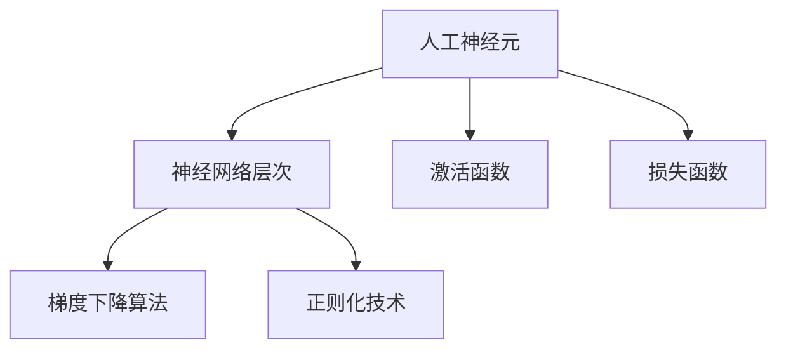

                 

# 神经网络：开启智能新纪元

在人工智能（AI）的广阔星空中，神经网络（Neural Networks）无疑是最耀眼的明星之一。自上世纪80年代以来，神经网络技术经历了从萌芽到茁壮成长的过程，现已成为智能技术领域的核心驱动力。本文将全面探讨神经网络的核心概念、原理、操作步骤与应用场景，期望为读者提供一个清晰、系统的视角，理解这一智能革命背后的关键技术。

## 1. 背景介绍

### 1.1 问题由来

神经网络技术的兴起，源于人工智能领域的长期探索和人类对智能模式的模拟。早期的人工神经元模型，通过简单的逻辑门电路，模仿生物神经元的基本工作机制。随着计算机硬件的进步和算法理论的发展，现代神经网络逐渐从模拟生物学模型，演变为高度抽象的数学框架，并应用于各类复杂问题解决中。

从最初的感知机、多层感知器（MLP），到卷积神经网络（CNN）、循环神经网络（RNN）、长短时记忆网络（LSTM），以及最新的生成对抗网络（GAN）、变分自编码器（VAE）等，神经网络技术在图像处理、自然语言处理、语音识别、推荐系统、自动驾驶等诸多领域取得了巨大成功。神经网络的核心优势在于其强大的特征提取和自主学习能力，能够自动发现并学习输入数据中的隐含结构，从而做出高效、准确且可解释性强的预测。

### 1.2 问题核心关键点

神经网络技术的核心在于其层次化、分布式和并行化的信息处理机制，使得其能够模拟生物神经元网络的复杂信息传递和处理过程。其关键点包括：

- 分布式参数存储与计算：神经元通过连接权值实现信息传递，每个神经元保存自身的输入权重，通过前向传播计算输出，并通过反向传播调整权重，实现参数优化。
- 非线性激活函数：引入非线性函数（如ReLU、Sigmoid、Tanh等）激活神经元，增强网络的表达能力，使其能够处理更加复杂的数据分布。
- 局部连接与权值共享：通过局部连接和权值共享机制，降低网络复杂度，减少参数量，加速计算。
- 训练算法：如随机梯度下降（SGD）、动量优化、Adam等，通过迭代优化模型参数，最小化损失函数，提升模型精度。
- 正则化技术：如L1正则、L2正则、Dropout等，防止模型过拟合，提升泛化能力。
- 目标函数：如交叉熵损失、均方误差损失等，用于衡量模型预测输出与真实标签的差异。

神经网络技术的这些核心点，共同构成了其强大的学习能力和问题解决能力，使其成为智能技术发展的重要基石。

## 2. 核心概念与联系

### 2.1 核心概念概述

为更好地理解神经网络的核心概念，本节将介绍几个密切相关的核心概念：

- 人工神经元：神经网络的基本构成单元，接收输入信号并经过激活函数处理，输出结果。
- 神经网络层次：神经元通过连接形成多个层次，包括输入层、隐藏层、输出层。
- 激活函数：引入非线性变换，增强神经网络的表达能力。
- 损失函数：衡量模型预测与真实标签之间差异的函数，用于指导模型优化。
- 梯度下降算法：通过反向传播计算损失函数对参数的梯度，并使用梯度信息更新参数，实现模型优化。
- 正则化技术：防止模型过拟合，提升泛化能力。

这些核心概念之间的逻辑关系可以通过以下Mermaid流程图来展示：



这个流程图展示了大语言模型的核心概念及其之间的关系：

1. 人工神经元是神经网络的基本构成单元。
2. 神经网络层次通过人工神经元连接形成多个层次，包括输入层、隐藏层、输出层。
3. 激活函数引入非线性变换，增强神经网络的表达能力。
4. 损失函数衡量模型预测与真实标签之间差异，用于指导模型优化。
5. 梯度下降算法通过反向传播计算损失函数对参数的梯度，并使用梯度信息更新参数，实现模型优化。
6. 正则化技术防止模型过拟合，提升泛化能力。

这些核心概念共同构成了神经网络技术的核心框架，使其能够在各种场景下发挥强大的信息处理和模式识别能力。通过理解这些核心概念，我们可以更好地把握神经网络的工作原理和优化方向。

## 3. 核心算法原理 & 具体操作步骤
### 3.1 算法原理概述

神经网络技术基于多层神经元的组合，通过反向传播算法优化模型参数，实现对复杂数据的有效学习和预测。其核心思想是：通过构建一个包含多个层次的非线性映射，使得神经网络能够从输入数据中自动提取和抽象出更高级别的特征，最终输出预测结果。

形式化地，设神经网络模型为 $M_{\theta}:\mathcal{X} \rightarrow \mathcal{Y}$，其中 $\theta$ 为模型参数。假设训练集为 $D=\{(x_i,y_i)\}_{i=1}^N$，其中 $x_i \in \mathcal{X}, y_i \in \mathcal{Y}$。神经网络的优化目标是最小化经验风险：

$$
\mathcal{L}(\theta) = \frac{1}{N} \sum_{i=1}^N \ell(M_{\theta}(x_i),y_i)
$$

其中 $\ell$ 为损失函数，通常采用交叉熵损失函数。

### 3.2 算法步骤详解

神经网络的训练通常遵循以下步骤：

**Step 1: 数据预处理**

- 将原始数据转换为神经网络可处理的格式。
- 对数据进行归一化处理，如标准化、最小-最大缩放等，提高模型收敛速度和稳定性。
- 对分类任务，将标签进行one-hot编码。

**Step 2: 定义模型**

- 选择适合的网络结构，包括层数、每层神经元个数、激活函数等。
- 定义损失函数，如交叉熵损失函数。
- 选择优化算法，如SGD、Adam等，设置学习率、批量大小等超参数。

**Step 3: 训练模型**

- 将训练集数据分批次输入模型，前向传播计算损失函数。
- 反向传播计算参数梯度，根据设定的优化算法和学习率更新模型参数。
- 周期性在验证集上评估模型性能，根据性能指标决定是否触发Early Stopping。
- 重复上述步骤直至满足预设的迭代轮数或Early Stopping条件。

**Step 4: 测试与部署**

- 在测试集上评估训练后的模型性能。
- 使用训练好的模型对新样本进行推理预测，集成到实际的应用系统中。
- 持续收集新的数据，定期重新训练模型，以适应数据分布的变化。

### 3.3 算法优缺点

神经网络技术在信息处理和模式识别方面具有以下优点：

- 强大的特征提取能力：神经网络能够自动学习输入数据的高级特征，无需手工提取特征。
- 自适应学习能力：通过反向传播算法，神经网络能够根据输入数据自动调整模型参数，提升模型精度。
- 并行计算特性：神经网络各层并行计算，加速了模型的训练和推理过程。
- 泛化能力强：神经网络模型能够在训练集外泛化，应对新数据和新任务。

然而，神经网络技术也存在以下局限性：

- 过拟合风险：神经网络模型参数多，容易过拟合。
- 难以解释：神经网络模型通常被视为"黑盒"系统，难以解释其内部工作机制和决策逻辑。
- 计算资源需求高：神经网络模型参数量大，训练和推理需要大量计算资源。
- 训练时间长：神经网络模型训练过程复杂，收敛速度慢，特别是大规模数据集和高维数据集。
- 鲁棒性不足：神经网络模型对噪声和异常值敏感，容易发生泛化能力下降。

尽管存在这些局限性，但神经网络技术仍然是当前智能技术领域的主流范式，其强大的学习能力和表现，使得其在图像识别、语音识别、自然语言处理等领域取得了诸多突破。未来相关研究的重点在于如何进一步降低神经网络技术的资源需求，提高模型的可解释性和泛化能力，以及如何更好地应用于实际问题中。

### 3.4 算法应用领域

神经网络技术在诸多领域得到了广泛应用，以下是几个典型案例：

- **计算机视觉**：用于图像识别、物体检测、人脸识别、场景理解等任务。通过卷积神经网络（CNN）等模型，对图像数据进行特征提取和分类。
- **自然语言处理**：用于机器翻译、情感分析、问答系统、文本分类等任务。通过循环神经网络（RNN）、长短时记忆网络（LSTM）等模型，对文本数据进行语义理解和生成。
- **语音识别**：用于语音转文本、语音情感分析等任务。通过卷积神经网络（CNN）和循环神经网络（RNN）等模型，对语音信号进行特征提取和分类。
- **推荐系统**：用于商品推荐、内容推荐等任务。通过矩阵分解和神经网络模型，对用户行为和物品特征进行预测和推荐。
- **自动驾驶**：用于目标检测、行为识别、路径规划等任务。通过卷积神经网络（CNN）和循环神经网络（RNN）等模型，对传感器数据进行分析和处理。

## 4. 数学模型和公式 & 详细讲解 & 举例说明
### 4.1 数学模型构建

假设神经网络模型为 $M_{\theta}:\mathcal{X} \rightarrow \mathcal{Y}$，其中 $\theta$ 为模型参数。假设训练集为 $D=\{(x_i,y_i)\}_{i=1}^N$，其中 $x_i \in \mathcal{X}, y_i \in \mathcal{Y}$。定义模型 $M_{\theta}$ 在输入 $x$ 上的输出为 $z_i = M_{\theta}(x_i)$，则交叉熵损失函数为：

$$
\ell(M_{\theta}(x_i),y_i) = -y_i \log z_i + (1-y_i) \log (1-z_i)
$$

经验风险为：

$$
\mathcal{L}(\theta) = \frac{1}{N} \sum_{i=1}^N \ell(M_{\theta}(x_i),y_i)
$$

神经网络的优化目标是最小化经验风险，即找到最优参数：

$$
\theta^* = \mathop{\arg\min}_{\theta} \mathcal{L}(\theta)
$$

在实践中，我们通常使用基于梯度的优化算法（如SGD、Adam等）来近似求解上述最优化问题。设 $\eta$ 为学习率，则参数的更新公式为：

$$
\theta \leftarrow \theta - \eta \nabla_{\theta}\mathcal{L}(\theta)
$$

其中 $\nabla_{\theta}\mathcal{L}(\theta)$ 为损失函数对参数 $\theta$ 的梯度，可通过反向传播算法高效计算。

### 4.2 公式推导过程

以下我们以二分类任务为例，推导交叉熵损失函数及其梯度的计算公式。

设模型 $M_{\theta}$ 在输入 $x$ 上的输出为 $\hat{y}=M_{\theta}(x) \in [0,1]$，表示样本属于正类的概率。真实标签 $y \in \{0,1\}$。则二分类交叉熵损失函数定义为：

$$
\ell(M_{\theta}(x),y) = -[y\log \hat{y} + (1-y)\log (1-\hat{y})]
$$

将其代入经验风险公式，得：

$$
\mathcal{L}(\theta) = -\frac{1}{N}\sum_{i=1}^N [y_i\log \hat{y_i} + (1-y_i)\log(1-\hat{y_i})]
$$

根据链式法则，损失函数对参数 $\theta_k$ 的梯度为：

$$
\frac{\partial \mathcal{L}(\theta)}{\partial \theta_k} = -\frac{1}{N}\sum_{i=1}^N (\frac{y_i}{\hat{y_i}}-\frac{1-y_i}{1-\hat{y_i}});
$$

其中 $\frac{\partial M_{\theta}(x_i)}{\partial \theta_k}$ 可进一步递归展开，利用自动微分技术完成计算。

在得到损失函数的梯度后，即可带入参数更新公式，完成模型的迭代优化。重复上述过程直至收敛，最终得到适应下游任务的最优模型参数 $\theta^*$。

### 4.3 案例分析与讲解

以MNIST手写数字识别为例，说明神经网络模型的训练过程。

- **数据预处理**：将MNIST数据集转换为神经网络可处理的格式，包括归一化处理和one-hot编码。
- **模型定义**：使用两个隐藏层的多层感知器（MLP）模型，每层32个神经元，激活函数为ReLU，输出层使用sigmoid函数。
- **训练模型**：使用随机梯度下降（SGD）算法，学习率为0.1，批量大小为64，迭代100个epoch。
- **测试与部署**：在测试集上评估模型性能，计算准确率，并使用训练好的模型对新样本进行推理预测。

## 5. 项目实践：代码实例和详细解释说明
### 5.1 开发环境搭建

在进行神经网络实践前，我们需要准备好开发环境。以下是使用Python进行TensorFlow开发的环境配置流程：

1. 安装Anaconda：从官网下载并安装Anaconda，用于创建独立的Python环境。

2. 创建并激活虚拟环境：
```bash
conda create -n tf-env python=3.8 
conda activate tf-env
```

3. 安装TensorFlow：根据CUDA版本，从官网获取对应的安装命令。例如：
```bash
conda install tensorflow -c conda-forge -c pypi
```

4. 安装各类工具包：
```bash
pip install numpy pandas scikit-learn matplotlib tqdm jupyter notebook ipython
```

完成上述步骤后，即可在`tf-env`环境中开始神经网络实践。

### 5.2 源代码详细实现

下面以卷积神经网络（CNN）用于图像识别为例，给出使用TensorFlow实现神经网络模型训练的代码：

```python
import tensorflow as tf
from tensorflow.keras import layers, models

# 定义CNN模型
model = models.Sequential([
    layers.Conv2D(32, (3, 3), activation='relu', input_shape=(28, 28, 1)),
    layers.MaxPooling2D((2, 2)),
    layers.Conv2D(64, (3, 3), activation='relu'),
    layers.MaxPooling2D((2, 2)),
    layers.Flatten(),
    layers.Dense(64, activation='relu'),
    layers.Dense(10, activation='softmax')
])

# 编译模型
model.compile(optimizer='adam',
              loss='categorical_crossentropy',
              metrics=['accuracy'])

# 加载数据集
(x_train, y_train), (x_test, y_test) = tf.keras.datasets.mnist.load_data()

# 数据预处理
x_train = x_train.reshape(-1, 28, 28, 1) / 255.0
x_test = x_test.reshape(-1, 28, 28, 1) / 255.0
y_train = tf.keras.utils.to_categorical(y_train)
y_test = tf.keras.utils.to_categorical(y_test)

# 训练模型
history = model.fit(x_train, y_train, epochs=10, batch_size=64, validation_data=(x_test, y_test))

# 评估模型
model.evaluate(x_test, y_test)
```

以上就是使用TensorFlow实现卷积神经网络模型的完整代码实现。可以看到，TensorFlow的Keras API使得神经网络模型的定义和训练过程变得异常简洁，极大地降低了开发难度。

### 5.3 代码解读与分析

让我们再详细解读一下关键代码的实现细节：

**定义CNN模型**：
- `Sequential`模型：使用Keras的Sequential模型定义卷积神经网络。
- `Conv2D`层：定义卷积层，包含卷积核、激活函数和输入形状。
- `MaxPooling2D`层：定义池化层，用于降采样。
- `Flatten`层：将池化层的输出展平为一维向量。
- `Dense`层：定义全连接层，包含激活函数和输出维度。

**编译模型**：
- 设置优化器为Adam，损失函数为交叉熵，评估指标为准确率。

**加载数据集**：
- 使用TensorFlow的Keras API加载MNIST数据集。

**数据预处理**：
- 将输入数据从二维图像格式转换为四维张量格式。
- 对像素值进行归一化处理。
- 对标签进行one-hot编码。

**训练模型**：
- 使用`fit`方法进行模型训练，指定训练集、验证集、epoch数和批量大小。

**评估模型**：
- 使用`evaluate`方法在测试集上评估模型性能，输出损失和准确率。

可以看到，TensorFlow的Keras API使得神经网络模型的定义和训练过程变得异常简洁，极大地降低了开发难度。开发者可以将更多精力放在数据处理、模型改进等高层逻辑上，而不必过多关注底层的实现细节。

当然，工业级的系统实现还需考虑更多因素，如模型的保存和部署、超参数的自动搜索、更灵活的模型架构等。但核心的神经网络模型训练过程基本与此类似。

## 6. 实际应用场景
### 6.1 智能安防系统

基于神经网络技术的智能安防系统，可以广泛应用于视频监控、入侵检测、人脸识别等领域。传统安防系统主要依赖人力进行监控，容易疲劳且效率低下。而使用神经网络模型进行视频分析和识别，可以实时监测异常行为，提高安全防护水平。

在技术实现上，可以收集大量历史视频数据，标注其中包含的异常行为、人脸等目标。在此基础上，对预训练模型进行微调，使其能够识别视频中的目标，并实时检测异常行为，触发警报或记录日志。此外，结合物体追踪技术，可以实现对目标的长期跟踪，提供更为精细化的安防服务。

### 6.2 自动驾驶系统

自动驾驶系统是神经网络技术在智能交通领域的重要应用之一。通过神经网络模型对摄像头、激光雷达等传感器数据进行分析和处理，自动驾驶系统能够实时感知周围环境，做出路径规划和驾驶决策。

在技术实现上，可以收集大量自动驾驶数据，标注其中包含的障碍物、车道、路标等信息。在此基础上，对预训练模型进行微调，使其能够识别和分类道路上的各种物体，并进行路径规划和驾驶决策。结合深度强化学习技术，自动驾驶系统可以实现复杂的交通场景理解和动态决策，推动自动驾驶技术的商业化应用。

### 6.3 医疗影像诊断

神经网络技术在医疗影像诊断中的应用，已取得显著成果。通过训练神经网络模型对医学影像（如CT、MRI等）进行分析和诊断，可以快速识别出疾病或病变，辅助医生进行诊断和治疗。

在技术实现上，可以收集大量医学影像数据，标注其中包含的病灶、病变等信息。在此基础上，对预训练模型进行微调，使其能够自动检测和分类医学影像中的病灶和病变，并提供详细的诊断报告。结合专家知识库和临床经验，神经网络模型可以进一步提升诊断的准确性和可靠性，为医学研究和治疗提供有力支持。

### 6.4 未来应用展望

随着神经网络技术的不断演进，其应用场景将更加广泛和深入。未来，神经网络技术有望在更多领域发挥重要作用：

- 智能医疗：神经网络模型将用于疾病预测、药物研发、个性化治疗等，提升医疗服务质量。
- 智能制造：神经网络模型将用于生产优化、质量控制、设备维护等，推动智能制造发展。
- 智能城市：神经网络模型将用于交通管理、能源调度、环境监测等，提升城市治理水平。
- 金融科技：神经网络模型将用于风险评估、欺诈检测、算法交易等，提升金融服务质量。
- 游戏娱乐：神经网络模型将用于游戏AI、虚拟现实、互动娱乐等，提供更逼真和智能的游戏体验。

## 7. 工具和资源推荐
### 7.1 学习资源推荐

为了帮助开发者系统掌握神经网络技术的理论基础和实践技巧，这里推荐一些优质的学习资源：

1. 《深度学习》书籍：由Ian Goodfellow、Yoshua Bengio、Aaron Courville三位深度学习领域大师合著，全面介绍了深度学习的基本原理和应用方法。
2. CS231n《卷积神经网络》课程：斯坦福大学开设的计算机视觉课程，详细讲解了卷积神经网络的原理和应用。
3. CS224n《自然语言处理与深度学习》课程：斯坦福大学开设的自然语言处理课程，涵盖NLP和深度学习的基础知识和前沿技术。
4. TensorFlow官方文档：TensorFlow官方提供的详细文档，包含从基础到高级的教程和示例代码，适合快速上手深度学习框架。
5. PyTorch官方文档：PyTorch官方提供的详细文档，涵盖从基础到高级的教程和示例代码，适合快速上手深度学习框架。

通过对这些资源的学习实践，相信你一定能够快速掌握神经网络技术的精髓，并用于解决实际的智能问题。

### 7.2 开发工具推荐

高效的开发离不开优秀的工具支持。以下是几款用于神经网络开发的常用工具：

1. TensorFlow：由Google主导开发的开源深度学习框架，生产部署方便，适合大规模工程应用。
2. PyTorch：由Facebook主导开发的开源深度学习框架，灵活性高，适合研究和实验。
3. Keras：基于TensorFlow和Theano的高级神经网络API，易于使用，适合初学者入门。
4. JAX：由Google开发的自动微分和加速库，支持函数式编程，适合复杂模型的开发。
5. PyTorch Lightning：基于PyTorch的高阶框架，自动进行模型封装和训练优化，适合快速迭代开发。

合理利用这些工具，可以显著提升神经网络开发和实验的效率，加快创新迭代的步伐。

### 7.3 相关论文推荐

神经网络技术的发展源于学界的持续研究。以下是几篇奠基性的相关论文，推荐阅读：

1. Deep Learning（Ian Goodfellow等）：全面介绍了深度学习的基本原理和应用方法，是深度学习领域的经典教材。
2. ImageNet Classification with Deep Convolutional Neural Networks（Alex Krizhevsky等）：提出了卷积神经网络（CNN）架构，并应用于ImageNet大规模图像识别任务。
3. Learning Phrase Representations using RNN Encoder-Decoder for Statistical Machine Translation（Ilya Sutskever等）：提出了循环神经网络（RNN）架构，并应用于机器翻译任务。
4. Attention Is All You Need（Ashish Vaswani等）：提出了Transformer架构，极大地提高了NLP任务的性能和效率。
5. AlphaGo Zero（David Silver等）：提出了深度强化学习结合神经网络模型，实现了超越人类水平的棋类游戏AI。

这些论文代表了大神经网络技术的演进脉络。通过学习这些前沿成果，可以帮助研究者把握学科前进方向，激发更多的创新灵感。

## 8. 总结：未来发展趋势与挑战
### 8.1 总结

本文对神经网络的核心概念、原理、操作步骤与应用场景进行了全面系统的介绍。首先阐述了神经网络技术的背景和核心思想，明确了其强大的学习能力和问题解决能力。其次，从原理到实践，详细讲解了神经网络的数学模型、训练过程和优化技术，给出了神经网络模型的完整代码实现。同时，本文还探讨了神经网络技术在智能安防、自动驾驶、医疗影像等领域的应用前景，展示了其广阔的应用空间。最后，本文精选了神经网络技术的各类学习资源、开发工具和相关论文，力求为读者提供全方位的技术指引。

通过本文的系统梳理，可以看到，神经网络技术正在成为智能技术发展的重要范式，其强大的学习能力和表现，使得其在图像识别、语音识别、自然语言处理等领域取得了诸多突破。未来相关研究的重点在于如何进一步降低神经网络技术的资源需求，提高模型的可解释性和泛化能力，以及如何更好地应用于实际问题中。

### 8.2 未来发展趋势

展望未来，神经网络技术将呈现以下几个发展趋势：

1. 模型规模持续增大。随着算力成本的下降和数据规模的扩张，神经网络模型的参数量还将持续增长。超大规模神经网络蕴含的丰富知识，有望支撑更加复杂多变的任务学习。
2. 训练算法优化。未来的训练算法将更加高效、可解释，能够自动调整学习率和迭代策略，提升模型训练速度和稳定性。
3. 跨模态学习。神经网络技术将拓展到跨模态数据融合，结合图像、语音、文本等多种数据源，实现多模态信息的协同建模，提升信息处理和识别能力。
4. 自监督学习。未来的神经网络将更多地依赖自监督学习，利用无标签数据进行预训练，减少对标注数据的依赖。
5. 对抗训练。未来的神经网络将结合对抗训练技术，提高模型的鲁棒性和泛化能力，抵御攻击和干扰。
6. 联邦学习。未来的神经网络将更多地采用联邦学习范式，将模型训练分散到多个设备和终端，保护数据隐私和安全。

这些趋势凸显了神经网络技术的强大潜力和广阔前景，将进一步推动智能技术的发展和应用。

### 8.3 面临的挑战

尽管神经网络技术已经取得了巨大成功，但在迈向更加智能化、普适化应用的过程中，它仍面临诸多挑战：

1. 计算资源需求高。神经网络模型参数量大，训练和推理需要大量计算资源，难以在低计算能力的设备上运行。
2. 过拟合风险。神经网络模型参数多，容易过拟合，泛化能力不足。
3. 难以解释。神经网络模型通常被视为"黑盒"系统，难以解释其内部工作机制和决策逻辑。
4. 鲁棒性不足。神经网络模型对噪声和异常值敏感，容易发生泛化能力下降。
5. 数据依赖性强。神经网络模型的训练和优化高度依赖数据质量，数据标注和数据集构建成本高昂。

尽管存在这些挑战，但神经网络技术仍然是当前智能技术领域的主流范式，其强大的学习能力和表现，使得其在图像识别、语音识别、自然语言处理等领域取得了诸多突破。未来相关研究的重点在于如何进一步降低神经网络技术的资源需求，提高模型的可解释性和泛化能力，以及如何更好地应用于实际问题中。

### 8.4 研究展望

面对神经网络技术所面临的挑战，未来的研究需要在以下几个方面寻求新的突破：

1. 探索低资源、低功耗的神经网络架构，如剪枝、量化、蒸馏等方法，提升神经网络模型的资源利用率。
2. 开发更加高效、可解释的训练算法，如自适应学习率、变分推断等方法，提升神经网络模型的训练速度和稳定性。
3. 引入更多先验知识，如知识图谱、逻辑规则等，与神经网络模型进行融合，提升模型的常识推理和泛化能力。
4. 结合因果分析和博弈论工具，增强神经网络模型的决策能力，提升模型的鲁棒性和稳定性。
5. 引入伦理道德约束，避免模型输出有害信息，确保模型的安全性。

这些研究方向将推动神经网络技术的不断进步，使其在更广泛的应用领域发挥更大的作用。

## 9. 附录：常见问题与解答

**Q1：神经网络与传统机器学习有何不同？**

A: 神经网络与传统机器学习在模型结构、训练方式和应用场景上都有显著区别：

- 模型结构：神经网络采用层次化的网络结构，通过多个神经元组合进行特征提取和模式识别，而传统机器学习通常使用线性或非线性模型。
- 训练方式：神经网络采用基于梯度的反向传播算法进行参数优化，而传统机器学习通常使用手动调参或规则化的学习算法。
- 应用场景：神经网络能够处理更加复杂、非结构化的数据，如图像、语音、文本等，而传统机器学习通常用于结构化数据的分类、回归、聚类等任务。

**Q2：神经网络中的激活函数有什么作用？**

A: 激活函数是神经网络的重要组成部分，其主要作用包括：

- 引入非线性变换：激活函数通过引入非线性变换，增强神经网络的表达能力，使其能够学习更加复杂的数据分布。
- 控制神经元输出范围：激活函数通常将神经元的输出范围限制在[0,1]或[-1,1]等范围内，增强模型的稳定性和可解释性。
- 提升模型精度：不同的激活函数在特定的任务和数据集上具有不同的表现，选择适当的激活函数能够提升模型的精度和泛化能力。

**Q3：神经网络中的正则化技术有哪些？**

A: 神经网络中的正则化技术主要用于防止过拟合，提升模型的泛化能力，主要包括：

- L1正则：对模型参数进行L1范数约束，抑制参数的大小，减少过拟合。
- L2正则：对模型参数进行L2范数约束，防止参数过大，增强模型的稳定性。
- Dropout：随机丢弃部分神经元，减少神经网络中的信息过载，提高模型的泛化能力。
- Early Stopping：在验证集上监控模型性能，当性能不再提升时停止训练，防止过拟合。

这些正则化技术需要根据具体的任务和数据特点进行灵活选择和组合。

**Q4：神经网络中的反向传播算法是什么？**

A: 反向传播算法是神经网络中用于优化模型参数的常用算法，其主要思想包括：

- 前向传播：将输入数据通过网络各层进行线性变换和非线性变换，计算出输出结果。
- 计算损失：将模型输出与真实标签进行对比，计算损失函数。
- 反向传播：通过链式法则计算损失函数对每个参数的梯度，更新模型参数，使损失函数最小化。
- 优化器：选择适当的优化器，如SGD、Adam等，更新模型参数，加速训练过程。

反向传播算法是神经网络的核心算法之一，其高效性和准确性使得神经网络成为当前智能技术领域的主流范式。

**Q5：神经网络中的数据预处理包括哪些步骤？**

A: 神经网络中的数据预处理主要包括以下步骤：

- 数据标准化：将数据进行归一化处理，如标准化、最小-最大缩放等，提高模型收敛速度和稳定性。
- 数据增强：通过旋转、平移、缩放等方式扩充数据集，防止过拟合。
- 数据编码：将数据转换为神经网络可处理的格式，如one-hot编码、独热编码等。
- 数据分割：将数据集分为训练集、验证集和测试集，便于模型训练和评估。

数据预处理是神经网络训练的重要环节，直接影响模型的性能和泛化能力。

---

作者：禅与计算机程序设计艺术 / Zen and the Art of Computer Programming

