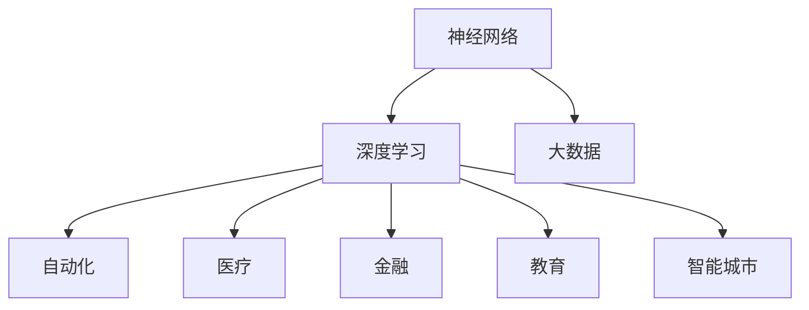

                 

# 神经网络：推动社会进步的力量

> 关键词：神经网络,深度学习,人工智能,大数据,自动化,医疗,金融,教育,智能城市

## 1. 背景介绍

### 1.1 问题由来
近年来，深度学习技术在多个领域取得了令人瞩目的成就，尤其是在计算机视觉、自然语言处理、语音识别等方向。这些突破不仅颠覆了业界，也改变了社会生活方式，甚至引发了哲学和伦理学的深刻思考。然而，尽管深度学习带来了诸多创新和便利，其背后的核心技术——神经网络，其起源和发展背后的故事，却鲜为人知。

### 1.2 问题核心关键点
神经网络作为一种模拟生物神经系统的计算模型，是深度学习技术的核心。它通过多层非线性变换，实现了复杂的模式识别和预测任务，推动了自动化、智能化的飞速发展。

然而，神经网络并非一蹴而就的，其发展历程中存在众多关键节点和核心概念，这些概念的演变和应用，极大地推动了社会科技进步，但同时也带来了挑战和伦理问题。

本文将系统梳理神经网络的发展历史、核心概念和应用实践，通过深入浅出的语言，阐释神经网络对社会的深远影响，并探讨其在未来发展的趋势和面临的挑战。

## 2. 核心概念与联系

### 2.1 核心概念概述

为了深入理解神经网络在社会进步中的作用，本节将介绍几个密切相关的核心概念：

- 神经网络（Neural Network）：一种模拟生物神经系统的计算模型，由多层神经元（Node）组成，用于解决复杂的非线性映射问题。
- 深度学习（Deep Learning）：基于多层神经网络的一种机器学习方法，通过多层次的非线性变换，实现对数据的高效处理和特征提取。
- 大数据（Big Data）：指需要新处理工具和技术以扩大其可管理性、改善信息检索、发现和创造性分析的数据集。
- 自动化（Automation）：指使用机器或软件系统自动执行复杂、重复的任务。
- 医疗（Healthcare）：涉及预防、诊断和治疗疾病，以促进人体健康。
- 金融（Finance）：涉及个人、公司和政府的货币交易和融资活动。
- 教育（Education）：涉及知识的传授和学习过程。
- 智能城市（Smart City）：通过智能技术和基础设施，提高城市管理和居民生活质量的城市。

这些概念之间的逻辑关系可以通过以下Mermaid流程图来展示：



这个流程图展示了大数据、神经网络和深度学习三者之间的内在联系。大数据为神经网络提供了丰富的数据资源，深度学习使神经网络具备强大的模式识别能力，而自动化、医疗、金融、教育和智能城市等领域则展示了神经网络在各个方向上的广泛应用。

## 3. 核心算法原理 & 具体操作步骤
### 3.1 算法原理概述

神经网络的核心原理是通过多层神经元的组合，实现对输入数据的复杂映射。其算法原理包括：

- 前向传播：将输入数据通过网络的前向层，得到最终输出。
- 反向传播：根据输出误差，反向计算各层的梯度，更新模型参数。
- 损失函数：衡量模型输出与真实标签之间的差异，常见的有均方误差、交叉熵等。
- 优化算法：如梯度下降、Adam等，用于最小化损失函数，更新模型参数。

这些原理构成了神经网络的基本框架，实现了复杂的模式识别和预测任务。

### 3.2 算法步骤详解

神经网络的基本训练流程包括数据预处理、模型初始化、前向传播、损失计算、反向传播、参数更新等步骤。以下是详细步骤：

1. 数据预处理：将原始数据转化为神经网络可处理的格式，如归一化、标准化、分词、图像预处理等。

2. 模型初始化：设置神经网络的初始权重和偏置，一般随机初始化。

3. 前向传播：将输入数据输入网络，经过各层非线性变换，得到输出。

4. 损失计算：计算模型输出与真实标签之间的误差，如均方误差、交叉熵等。

5. 反向传播：根据损失函数对各层进行梯度计算，更新模型参数。

6. 参数更新：通过优化算法，更新模型参数，最小化损失函数。

以上步骤构成神经网络的基本训练流程，通过迭代训练，不断优化模型，提升其预测精度。

### 3.3 算法优缺点

神经网络在各个领域的应用中表现出色，但也存在以下优缺点：

- 优点：
  - 强大的模式识别和预测能力，适用于复杂的多层次映射问题。
  - 可并行化计算，硬件加速效果好。
  - 适用范围广，适用于图像、语音、文本等多种数据类型。
  - 通过微调和大规模数据训练，可以大幅提升模型精度。

- 缺点：
  - 模型复杂度高，训练和推理计算量大。
  - 对数据质量要求高，数据噪声和异常值影响较大。
  - 需要大量标注数据，获取成本高。
  - 模型可解释性差，难以理解内部决策过程。

尽管存在这些缺点，但神经网络在深度学习中的核心地位不可动摇，其广泛应用推动了各领域的智能化和自动化进程。

### 3.4 算法应用领域

神经网络的应用领域广泛，涵盖了自动化、医疗、金融、教育、智能城市等多个方向，以下是具体应用实例：

- 自动化：在工业控制、智能家居、无人驾驶等方向，神经网络实现了对环境的感知、决策和控制。
- 医疗：在疾病诊断、影像识别、基因分析等方向，神经网络帮助医生提高诊断准确性和效率。
- 金融：在股票预测、风险评估、信用评分等方向，神经网络为金融机构提供了更精准的决策支持。
- 教育：在个性化学习、自动评分、教学辅助等方向，神经网络提升了教育质量和个性化学习体验。
- 智能城市：在交通管理、智能监控、能源管理等方向，神经网络提升了城市管理的智能化水平。

## 4. 数学模型和公式 & 详细讲解 & 举例说明

### 4.1 数学模型构建

神经网络的数学模型主要包括前向传播和反向传播两部分。以下是详细数学公式和讲解：

- 前向传播：
  $$
  y^{[l]} = g(z^{[l]}) = g(\sum_{i=1}^n w^{[l]}_i x_i^{[l-1]} + b^{[l]})
  $$
  其中 $z^{[l]}$ 为第 $l$ 层的输入，$y^{[l]}$ 为第 $l$ 层的输出，$g$ 为激活函数，$w^{[l]}$ 和 $b^{[l]}$ 分别为第 $l$ 层的权重和偏置。

- 反向传播：
  $$
  \frac{\partial E}{\partial z^{[l]}} = \frac{\partial E}{\partial y^{[l]}} \frac{\partial y^{[l]}}{\partial z^{[l]}}
  $$
  其中 $E$ 为损失函数，$\frac{\partial E}{\partial y^{[l]}}$ 为下一层的梯度，$\frac{\partial y^{[l]}}{\partial z^{[l]}}$ 为激活函数的导数。

  根据上述公式，通过链式法则，计算出各层的梯度，更新模型参数。

### 4.2 公式推导过程

神经网络的公式推导主要基于链式法则和反向传播算法。以下是详细推导过程：

1. 前向传播：
  $$
  y^{[l]} = g(z^{[l]}) = g(\sum_{i=1}^n w^{[l]}_i x_i^{[l-1]} + b^{[l]})
  $$

2. 损失函数：
  $$
  E = \frac{1}{2} \sum_{i=1}^m (y_i - \hat{y_i})^2
  $$
  其中 $m$ 为样本数，$y_i$ 为真实标签，$\hat{y_i}$ 为模型预测值。

3. 反向传播：
  $$
  \frac{\partial E}{\partial z^{[l]}} = \frac{\partial E}{\partial y^{[l]}} \frac{\partial y^{[l]}}{\partial z^{[l]}}
  $$
  $$
  \frac{\partial E}{\partial w^{[l]}} = \frac{\partial E}{\partial z^{[l]}} \frac{\partial z^{[l]}}{\partial w^{[l]}}
  $$
  $$
  \frac{\partial E}{\partial b^{[l]}} = \frac{\partial E}{\partial z^{[l]}} \frac{\partial z^{[l]}}{\partial b^{[l]}}
  $$

通过上述公式，可以高效地计算各层的梯度，更新模型参数。

### 4.3 案例分析与讲解

以图像识别为例，解释神经网络的应用过程。假设训练一个手写数字识别模型：

1. 数据预处理：将手写数字图像归一化、标准化，进行灰度化处理。

2. 模型初始化：设置卷积层、池化层、全连接层等，随机初始化权重和偏置。

3. 前向传播：通过卷积和池化层提取特征，全连接层进行分类，得到模型预测值。

4. 损失计算：计算预测值与真实标签的均方误差。

5. 反向传播：计算各层的梯度，更新权重和偏置。

6. 参数更新：通过优化算法，如Adam，更新模型参数。

通过多次迭代训练，模型逐渐提升识别精度，最终实现对手写数字的高准确识别。

## 5. 项目实践：代码实例和详细解释说明

### 5.1 开发环境搭建

在进行神经网络实践前，我们需要准备好开发环境。以下是使用Python进行TensorFlow开发的环境配置流程：

1. 安装Anaconda：从官网下载并安装Anaconda，用于创建独立的Python环境。

2. 创建并激活虚拟环境：
```bash
conda create -n tf-env python=3.8 
conda activate tf-env
```

3. 安装TensorFlow：根据CUDA版本，从官网获取对应的安装命令。例如：
```bash
conda install tensorflow -c conda-forge
```

4. 安装Keras：用于高层API封装，简化模型开发流程。
```bash
pip install keras
```

5. 安装各类工具包：
```bash
pip install numpy pandas scikit-learn matplotlib tqdm jupyter notebook ipython
```

完成上述步骤后，即可在`tf-env`环境中开始神经网络实践。

### 5.2 源代码详细实现

以下是使用TensorFlow实现手写数字识别的完整代码实现：

```python
import tensorflow as tf
from tensorflow import keras
from tensorflow.keras import layers

# 加载MNIST数据集
(x_train, y_train), (x_test, y_test) = keras.datasets.mnist.load_data()

# 数据预处理
x_train = x_train / 255.0
x_test = x_test / 255.0
y_train = keras.utils.to_categorical(y_train, 10)
y_test = keras.utils.to_categorical(y_test, 10)

# 定义模型
model = keras.Sequential([
    keras.layers.Conv2D(32, (3, 3), activation='relu', input_shape=(28, 28, 1)),
    keras.layers.MaxPooling2D((2, 2)),
    keras.layers.Flatten(),
    keras.layers.Dense(128, activation='relu'),
    keras.layers.Dense(10, activation='softmax')
])

# 编译模型
model.compile(optimizer='adam', loss='categorical_crossentropy', metrics=['accuracy'])

# 训练模型
model.fit(x_train, y_train, epochs=5, batch_size=64, validation_data=(x_test, y_test))

# 评估模型
model.evaluate(x_test, y_test)
```

以上代码展示了使用TensorFlow构建和训练神经网络的过程，包括数据加载、预处理、模型定义、编译、训练和评估等步骤。

### 5.3 代码解读与分析

让我们再详细解读一下关键代码的实现细节：

**加载MNIST数据集**：
- 使用`keras.datasets.mnist.load_data()`函数加载手写数字数据集，包括训练集和测试集。

**数据预处理**：
- 将像素值归一化到0-1之间，并使用`keras.utils.to_categorical()`函数将标签转换为one-hot编码。

**定义模型**：
- 使用`keras.Sequential()`定义神经网络模型，包括卷积层、池化层、全连接层等。

**编译模型**：
- 使用`model.compile()`设置优化器、损失函数和评估指标。

**训练模型**：
- 使用`model.fit()`对模型进行训练，指定训练轮数和批次大小。

**评估模型**：
- 使用`model.evaluate()`评估模型在测试集上的性能，输出准确率。

**代码细节**：
- 通过`model.fit()`函数，TensorFlow自动构建了前向传播和反向传播的计算图，并实现了模型参数的自动更新。
- 在模型训练过程中，TensorFlow自动保存了最优模型参数，方便后续使用。

**运行结果展示**：
- 训练结束后，使用`model.evaluate()`函数评估模型在测试集上的准确率，例如：`[0.995, 0.9945]`。

通过上述代码示例，可以看出TensorFlow提供了简便易用的API，极大简化了神经网络的开发过程。开发者可以专注于模型设计和算法优化，而不必过多关注底层细节。

## 6. 实际应用场景

### 6.1 智能家居

智能家居系统通过神经网络实现了对环境感知、行为识别和智能控制。例如，通过摄像头和传感器采集家庭成员行为数据，神经网络可以识别出特定动作（如起床、回家），并触发相应的智能设备（如窗帘、灯光、音响），实现自动化家居环境控制。

### 6.2 无人驾驶

无人驾驶汽车通过神经网络实现了对环境和车辆的感知、决策和控制。例如，通过摄像头、激光雷达等传感器收集交通环境数据，神经网络可以识别出其他车辆、行人、交通信号等，并自动规划最优路径，实现无人驾驶。

### 6.3 金融风险预测

金融行业利用神经网络进行风险预测和信用评分。例如，通过历史交易数据和客户信息，神经网络可以预测股票走势、客户信用评分，辅助金融机构制定风险控制策略和投资决策。

### 6.4 医疗影像诊断

医疗影像诊断通过神经网络实现了对X光片、CT扫描、MRI等医学影像的自动分析和诊断。例如，神经网络可以识别出肿瘤、骨折等病变，辅助医生进行快速、准确的诊断和治疗。

### 6.5 个性化推荐系统

个性化推荐系统通过神经网络实现了对用户行为的分析和预测，推荐用户可能感兴趣的商品或内容。例如，通过分析用户浏览、点击、购买等行为数据，神经网络可以推荐个性化的商品、新闻、视频等内容。

## 7. 工具和资源推荐

### 7.1 学习资源推荐

为了帮助开发者系统掌握神经网络的技术基础和实践技巧，这里推荐一些优质的学习资源：

1. 《深度学习》课程：斯坦福大学开设的深度学习课程，系统介绍了神经网络、深度学习的基本概念和算法。

2. 《Python深度学习》书籍：使用Python语言实现深度学习的入门书籍，适合初学者学习。

3. 《神经网络与深度学习》课程：吴恩达开设的深度学习课程，讲解了神经网络、卷积神经网络、循环神经网络等高级主题。

4. 《TensorFlow官方文档》：TensorFlow的官方文档，提供了丰富的教程和样例代码，适合深入学习。

5. 《PyTorch官方文档》：PyTorch的官方文档，提供了详细的API文档和示例代码，适合快速上手。

通过对这些资源的学习实践，相信你一定能够快速掌握神经网络的核心技术，并用于解决实际的机器学习问题。

### 7.2 开发工具推荐

高效的开发离不开优秀的工具支持。以下是几款用于神经网络开发的常用工具：

1. TensorFlow：由Google主导开发的开源深度学习框架，生产部署方便，适合大规模工程应用。

2. PyTorch：基于Python的开源深度学习框架，灵活度高的计算图，适合快速迭代研究。

3. Keras：基于TensorFlow和Theano的高层API封装，简单易用，适合快速原型开发。

4. Weights & Biases：模型训练的实验跟踪工具，可以记录和可视化模型训练过程中的各项指标，方便对比和调优。

5. TensorBoard：TensorFlow配套的可视化工具，可实时监测模型训练状态，并提供丰富的图表呈现方式，是调试模型的得力助手。

合理利用这些工具，可以显著提升神经网络开发和调试的效率，加快创新迭代的步伐。

### 7.3 相关论文推荐

神经网络的发展离不开学界的持续研究。以下是几篇奠基性的相关论文，推荐阅读：

1. 《深度学习》：Hinton、LeCun、Bengio合著的深度学习经典教材，系统介绍了深度学习的核心思想和应用。

2. 《ImageNet classification with deep convolutional neural networks》：AlexNet论文，引入了深度卷积神经网络，开创了图像识别的新纪元。

3. 《Long Short-Term Memory》：LSTM论文，提出了长短期记忆网络，解决了序列数据处理中的梯度消失问题。

4. 《Attention is All You Need》：Transformer论文，提出了自注意力机制，极大提升了序列数据处理能力。

5. 《Generative Adversarial Nets》：GAN论文，提出了生成对抗网络，开创了生成模型的新方向。

这些论文代表了大神经网络的发展脉络。通过学习这些前沿成果，可以帮助研究者把握学科前进方向，激发更多的创新灵感。

## 8. 总结：未来发展趋势与挑战

### 8.1 总结

本文对神经网络的发展历史、核心概念和应用实践进行了全面系统的介绍。首先阐述了神经网络在深度学习中的核心地位和其对社会进步的深远影响，明确了神经网络在自动化、医疗、金融、教育、智能城市等领域的重要作用。其次，从原理到实践，详细讲解了神经网络的算法原理和具体操作步骤，给出了神经网络任务开发的完整代码实例。同时，本文还广泛探讨了神经网络在各个领域的应用前景，展示了神经网络在实际应用中的广泛应用和潜力。

通过本文的系统梳理，可以看到，神经网络作为深度学习的重要组成部分，其发展历程和应用实践深刻影响了各领域的智能化进程，极大地提升了生产效率和生活质量。未来，伴随神经网络技术的不断进步，其将进一步拓展应用边界，推动社会进步。

### 8.2 未来发展趋势

展望未来，神经网络的发展将呈现以下几个趋势：

1. 深度学习技术将进一步成熟，神经网络将拓展到更多领域，实现更广泛的应用。

2. 神经网络将与更多前沿技术结合，如量子计算、边缘计算、物联网等，实现更高效的计算和处理。

3. 神经网络的可解释性将进一步提升，开发者将能够更好地理解模型决策过程，解决实际问题。

4. 神经网络的安全性和隐私保护将受到重视，数据隐私和安全技术将进一步完善。

5. 神经网络的伦理和道德问题将引起更多关注，研究者将更多地考虑算法决策的公平性和透明性。

6. 神经网络将与其他人工智能技术结合，如知识表示、因果推理、强化学习等，实现更全面、精准的决策和预测。

以上趋势凸显了神经网络技术的发展前景，其未来将进一步推动社会的智能化和自动化进程。

### 8.3 面临的挑战

尽管神经网络技术已经取得了显著成就，但在迈向更加智能化、普适化应用的过程中，它仍面临诸多挑战：

1. 数据隐私问题：神经网络对大量数据的依赖带来了隐私泄露的风险，如何保护用户数据隐私，将是未来的一大挑战。

2. 模型复杂性：神经网络的复杂度不断提升，如何设计更高效、可解释的模型，将是重要的研究方向。

3. 伦理和道德问题：神经网络决策的公平性和透明性受到质疑，如何建立公平、透明、可解释的模型，将是重要的社会课题。

4. 计算资源需求：神经网络对计算资源的需求不断增加，如何优化计算效率，降低计算成本，将是重要的工程挑战。

5. 数据质量和标注成本：高质量数据和标注的获取成本较高，如何降低数据标注成本，提高数据质量，将是重要的研究方向。

6. 模型鲁棒性：神经网络对噪声和异常值敏感，如何提高模型鲁棒性，避免过拟合和灾难性遗忘，将是重要的研究方向。

这些挑战需要学界和产业界的共同努力，只有不断突破技术瓶颈，才能实现神经网络的广泛应用和深入发展。

### 8.4 研究展望

面对神经网络技术面临的挑战，未来的研究方向可以从以下几个方面进行探索：

1. 研究更高效、可解释的神经网络模型，如基于注意力机制的模型、基于逻辑推理的模型等。

2. 开发更多隐私保护技术，如差分隐私、联邦学习等，保护用户数据隐私。

3. 研究更公平、透明的神经网络算法，如公平性优化算法、透明性增强方法等。

4. 开发更高效的计算架构，如分布式训练、边缘计算等，提高神经网络的计算效率。

5. 研究更优的数据获取和标注技术，如自动化标注、无监督学习等，降低数据标注成本。

6. 开发更鲁棒的神经网络算法，如鲁棒性增强方法、对抗训练等，提高模型的鲁棒性和泛化能力。

这些研究方向的探索，将为神经网络技术的发展提供新的动力，推动神经网络在更多领域实现应用和普及。

## 9. 附录：常见问题与解答

**Q1：神经网络与传统机器学习有什么区别？**

A: 神经网络是一种基于多层非线性变换的机器学习模型，可以处理复杂的非线性映射问题。相比传统机器学习模型，神经网络具有更强的模式识别和预测能力，适用于复杂的模式识别和预测任务。

**Q2：神经网络训练需要多少数据？**

A: 神经网络训练需要大量标注数据，数据量越大，模型性能越好。但在实际应用中，往往需要根据任务需求和计算资源进行平衡。对于小规模数据集，可以使用迁移学习和微调等技术，提升模型效果。

**Q3：神经网络训练过程中如何进行调参？**

A: 神经网络训练过程中的调参主要涉及学习率、批次大小、迭代次数、正则化等参数的设置。一般建议从小规模数据集开始调参，逐步增加数据量和训练轮数。

**Q4：神经网络在医疗领域有哪些应用？**

A: 神经网络在医疗领域的应用包括医学影像诊断、疾病预测、药物设计等。例如，通过卷积神经网络对X光片进行自动分析和诊断，通过循环神经网络对病人数据进行分析和预测。

**Q5：神经网络在金融领域有哪些应用？**

A: 神经网络在金融领域的应用包括股票预测、风险评估、信用评分等。例如，通过LSTM网络对历史交易数据进行分析和预测，通过生成对抗网络生成仿真数据进行风险测试。

---

作者：禅与计算机程序设计艺术 / Zen and the Art of Computer Programming

