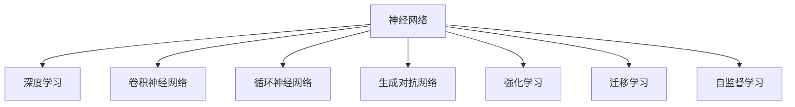

                 

# 神经网络：推动社会进步的力量

## 1. 背景介绍

### 1.1 问题由来
在人类文明进化的历程中，技术的创新一直是推动社会进步的强大动力。从蒸汽机到电力，从互联网到人工智能，每一次技术的突破都极大地改变了人类的生产生活方式，释放了巨大的社会生产潜力。如今，站在人工智能的风口浪尖，神经网络以其卓越的预测、推理和决策能力，正在成为新一轮技术变革的核心引擎。

### 1.2 问题核心关键点
神经网络的核心在于其通过大量的数据训练，学习到抽象的特征表示，并在新的数据上实现高效的预测和决策。其核心思想类似于人脑的神经元网络，通过学习输入数据之间的内在关联，实现对复杂模式的高效识别和处理。本文将聚焦于神经网络的核心原理和应用，探讨其如何塑造现代社会的未来。

### 1.3 问题研究意义
理解神经网络的工作原理和应用潜力，对于把握人工智能技术的发展方向，推动相关产业的创新，具有重要意义：

1. **产业升级**：神经网络能够显著提升传统行业的智能化水平，如制造业、农业、医疗等，通过智能化的生产管理、决策支持、个性化服务等，提升整体效率和竞争力。
2. **社会治理**：在城市管理、公共安全、环境监测等领域，神经网络能够快速处理海量数据，提供精准的决策支持，提升社会治理的智能化水平。
3. **教育公平**：通过个性化的学习推荐、智能辅导等应用，神经网络能够促进教育资源的均衡分配，助力教育公平。
4. **医疗健康**：在疾病预测、诊疗建议、药物研发等方面，神经网络能够辅助医生进行精准医疗，提升医疗服务质量。
5. **人机交互**：在语音识别、图像处理、自然语言理解等领域，神经网络能够实现更自然、更高效的人机交互，提升用户体验。

## 2. 核心概念与联系

### 2.1 核心概念概述

为更好地理解神经网络，本节将介绍几个密切相关的核心概念：

- **神经网络(Neural Network)**：一种基于生物神经网络的计算模型，通过多层神经元的连接和参数调整，实现对输入数据的映射和预测。

- **深度学习(Deep Learning)**：一种利用多层神经网络，通过反向传播算法训练模型，学习复杂非线性映射的技术。

- **卷积神经网络(CNN)**：一种专门用于图像处理和计算机视觉任务的神经网络结构，通过卷积操作提取图像的局部特征。

- **循环神经网络(RNN)**：一种专门用于序列数据处理的神经网络结构，通过循环连接处理时间序列数据。

- **生成对抗网络(GAN)**：一种由生成器和判别器组成的两层神经网络结构，通过对抗学习实现生成高质量的图像、视频等。

- **强化学习(Reinforcement Learning)**：一种利用奖励信号，通过试错学习，优化行为策略的机器学习方法。

- **迁移学习(Transfer Learning)**：一种利用预训练模型，在新的任务上进行微调，提高模型泛化性能的技术。

- **自监督学习(Self-supervised Learning)**：一种无需标注数据，通过数据的自相关性学习知识的技术，常用于预训练阶段。

这些核心概念之间的逻辑关系可以通过以下Mermaid流程图来展示：



这个流程图展示了几大神经网络模型及其主要应用方向：

1. 神经网络作为基础的计算模型，通过深度学习、卷积神经网络、循环神经网络等不同架构，处理不同类型的输入数据。
2. 生成对抗网络在图像生成、视频生成等领域展示了其强大的生成能力。
3. 强化学习通过奖励信号优化行为策略，在自动驾驶、游戏AI等领域有重要应用。
4. 迁移学习通过利用预训练模型，提高了模型的泛化性能，广泛应用于各类NLP和计算机视觉任务。
5. 自监督学习在数据标注成本高昂的情况下，通过无标注数据训练模型，提升了模型的泛化能力。

## 3. 核心算法原理 & 具体操作步骤
### 3.1 算法原理概述

神经网络的核心在于通过多层非线性变换，学习输入数据之间的复杂映射关系。其核心思想是通过反向传播算法，优化模型参数，使得模型在训练集上的预测误差最小化。

### 3.2 算法步骤详解

神经网络的训练一般包括以下几个关键步骤：

**Step 1: 数据准备**
- 收集并准备训练数据集，包含输入数据$x$和相应的标签$y$。

**Step 2: 定义模型结构**
- 根据任务需求，选择合适的神经网络架构，包括层数、每层的神经元个数、激活函数等。

**Step 3: 设置优化器**
- 选择适合的网络优化算法，如Adam、SGD等，并设置学习率、批大小等超参数。

**Step 4: 前向传播**
- 将训练数据$x$输入模型，计算每一层的输出。

**Step 5: 计算损失函数**
- 计算预测输出与真实标签$y$之间的差异，得到损失函数$\mathcal{L}$。

**Step 6: 反向传播**
- 通过反向传播算法，计算损失函数$\mathcal{L}$对各参数的梯度，更新模型参数。

**Step 7: 评估模型**
- 在验证集或测试集上评估模型的性能，如准确率、F1-score等指标。

### 3.3 算法优缺点

神经网络算法具有以下优点：
1. 强大的表示能力：能够处理非线性、高维、复杂的输入数据。
2. 高效的学习能力：通过反向传播算法，快速调整模型参数，优化预测能力。
3. 泛化性能良好：在大量数据上训练的模型，能够在新数据上表现出色。
4. 应用广泛：应用于图像处理、自然语言处理、语音识别、自动驾驶等多个领域。

同时，神经网络算法也存在一些局限性：
1. 参数量大：模型规模较大，需要大量的计算资源进行训练和推理。
2. 训练时间长：模型复杂，训练过程耗时较长。
3. 数据依赖：需要大量标注数据进行训练，数据获取成本高。
4. 可解释性不足：神经网络模型是一个黑盒系统，难以解释其内部工作机制。
5. 脆弱性：对输入数据的微小变化敏感，容易发生过拟合。

尽管存在这些局限性，神经网络算法在诸多领域仍表现出色，成为了人工智能技术的核心之一。未来相关研究的重点在于如何进一步降低计算资源消耗，提高模型的可解释性，增强模型的鲁棒性等。

### 3.4 算法应用领域

神经网络算法在各个领域都有广泛的应用，以下是几个典型的例子：

- **计算机视觉**：在图像分类、目标检测、图像生成等领域，通过卷积神经网络(CNN)处理图像数据，实现高效的视觉理解和处理。

- **自然语言处理**：在机器翻译、文本分类、情感分析等领域，通过循环神经网络(RNN)或Transformer等模型，处理文本数据，实现自然语言理解和生成。

- **语音识别**：在语音识别、语音合成等领域，通过循环神经网络(RNN)或变种模型，处理语音数据，实现高精度的语音识别和合成。

- **自动驾驶**：在自动驾驶、智能交通等领域，通过深度学习模型，处理传感器数据，实现环境感知、决策制定等功能。

- **金融风控**：在金融风险管理、信用评分等领域，通过神经网络模型，处理海量数据，实现精准的风险评估和预测。

## 4. 数学模型和公式 & 详细讲解 & 举例说明
### 4.1 数学模型构建

神经网络的数学模型构建通常包括输入层、隐藏层、输出层等多个部分。以典型的前馈神经网络为例，其数学模型可以表示为：

$$
f(x; \theta) = \sigma(\sum_{i=1}^{n} w_i x_i + b)
$$

其中，$x$为输入数据，$\theta$为模型参数，$\sigma$为激活函数，$w$为权重矩阵，$b$为偏置项。通过多层叠加，可以得到更为复杂的非线性映射关系。

### 4.2 公式推导过程

以简单的线性回归为例，推导神经网络的前向传播和反向传播过程。

**前向传播**：
$$
y = \sigma(Wx + b)
$$

其中，$x$为输入数据，$W$为权重矩阵，$b$为偏置项，$\sigma$为激活函数，$y$为模型预测输出。

**损失函数**：
$$
\mathcal{L} = \frac{1}{2m} \sum_{i=1}^m (y_i - \hat{y_i})^2
$$

其中，$\mathcal{L}$为损失函数，$y$为真实标签，$\hat{y}$为模型预测输出，$m$为样本数。

**反向传播**：
$$
\frac{\partial \mathcal{L}}{\partial W} = \frac{1}{m} (X^T (y - \hat{y}))X^T
$$

其中，$\frac{\partial \mathcal{L}}{\partial W}$为损失函数对权重矩阵的梯度，$X$为输入数据的矩阵形式，$y$为真实标签，$\hat{y}$为模型预测输出。

通过反向传播算法，可以高效计算出模型参数的梯度，用于优化模型。

### 4.3 案例分析与讲解

以图像分类任务为例，展示神经网络模型在计算机视觉中的应用。

**数据准备**：
- 收集并标注大量图像数据，包含类别标签。

**模型定义**：
- 定义卷积神经网络(CNN)模型，包括卷积层、池化层、全连接层等。

**设置超参数**：
- 设置网络架构、激活函数、学习率等超参数。

**训练模型**：
- 将图像数据输入模型，计算损失函数，进行反向传播，更新模型参数。

**评估模型**：
- 在测试集上评估模型性能，如准确率、F1-score等指标。

## 5. 项目实践：代码实例和详细解释说明
### 5.1 开发环境搭建

在进行神经网络模型训练和推理前，需要准备好开发环境。以下是使用Python进行TensorFlow开发的环境配置流程：

1. 安装Anaconda：从官网下载并安装Anaconda，用于创建独立的Python环境。

2. 创建并激活虚拟环境：
```bash
conda create -n tf-env python=3.8 
conda activate tf-env
```

3. 安装TensorFlow：从官网获取对应的安装命令，选择合适版本的TensorFlow。例如：
```bash
pip install tensorflow
```

4. 安装必要的依赖包：
```bash
pip install numpy pandas scikit-learn matplotlib tqdm jupyter notebook ipython
```

完成上述步骤后，即可在`tf-env`环境中开始神经网络模型的开发。

### 5.2 源代码详细实现

下面以手写数字识别任务为例，展示使用TensorFlow实现卷积神经网络(CNN)的代码实现。

```python
import tensorflow as tf
from tensorflow.keras import layers, models

# 定义模型架构
model = models.Sequential()
model.add(layers.Conv2D(32, (3, 3), activation='relu', input_shape=(28, 28, 1)))
model.add(layers.MaxPooling2D((2, 2)))
model.add(layers.Flatten())
model.add(layers.Dense(10, activation='softmax'))

# 编译模型
model.compile(optimizer='adam', loss='categorical_crossentropy', metrics=['accuracy'])

# 加载数据集
mnist = tf.keras.datasets.mnist
(x_train, y_train), (x_test, y_test) = mnist.load_data()

# 数据预处理
x_train, x_test = x_train / 255.0, x_test / 255.0
x_train = x_train.reshape(-1, 28, 28, 1)
x_test = x_test.reshape(-1, 28, 28, 1)

# 训练模型
model.fit(x_train, y_train, epochs=10, batch_size=32, validation_data=(x_test, y_test))

# 评估模型
model.evaluate(x_test, y_test)
```

上述代码展示了使用TensorFlow实现CNN模型的全过程，包括模型定义、编译、数据加载、训练和评估。可以看到，TensorFlow提供了高度的抽象和易用性，使得神经网络模型的开发和训练变得简单高效。

### 5.3 代码解读与分析

让我们再详细解读一下关键代码的实现细节：

**模型定义**：
- `layers.Conv2D`：定义卷积层，通过卷积操作提取图像的局部特征。
- `layers.MaxPooling2D`：定义池化层，通过降采样操作减少特征图尺寸。
- `layers.Flatten`：定义全连接层，将特征图转换为一维向量。
- `layers.Dense`：定义全连接层，进行分类输出。

**模型编译**：
- `optimizer`：选择优化算法，如Adam。
- `loss`：选择损失函数，如交叉熵损失。
- `metrics`：选择评估指标，如准确率。

**数据预处理**：
- 将输入数据归一化到0-1之间，以适应模型训练。
- 调整数据形状，适应模型的输入格式。

**模型训练**：
- `model.fit`：进行模型训练，指定训练轮数和批大小。
- `validation_data`：指定验证数据集，用于评估模型在未见过的数据上的性能。

**模型评估**：
- `model.evaluate`：评估模型在测试集上的性能，输出损失和准确率。

## 6. 实际应用场景
### 6.1 计算机视觉

计算机视觉是神经网络的重要应用领域之一，通过神经网络模型，可以实现高效的图像识别、目标检测、图像生成等任务。

- **图像分类**：通过卷积神经网络(CNN)模型，对图像进行分类，如识别动物、车辆、人物等。
- **目标检测**：通过区域卷积神经网络(R-CNN)等模型，检测图像中的特定对象，如行人、人脸等。
- **图像生成**：通过生成对抗网络(GAN)模型，生成高质量的图像，如艺术作品、风景照片等。

### 6.2 自然语言处理

自然语言处理(NLP)是神经网络在语言学领域的广泛应用，通过神经网络模型，可以实现自然语言理解、生成、推理等任务。

- **文本分类**：通过循环神经网络(RNN)或Transformer模型，对文本进行分类，如新闻分类、情感分析等。
- **机器翻译**：通过序列到序列(Seq2Seq)模型，实现语言的自动翻译。
- **情感分析**：通过神经网络模型，分析文本的情感倾向，如正面、负面、中性等。

### 6.3 语音识别

语音识别是神经网络在语音处理领域的应用，通过神经网络模型，可以实现高精度的语音识别和合成。

- **语音识别**：通过循环神经网络(RNN)模型，将语音转换为文本。
- **语音合成**：通过变分自编码器(VAE)模型，将文本转换为语音。

### 6.4 自动驾驶

自动驾驶是神经网络在交通领域的应用，通过神经网络模型，可以实现环境感知、决策制定等功能。

- **环境感知**：通过卷积神经网络(CNN)模型，处理传感器数据，如摄像头、雷达等。
- **行为决策**：通过强化学习(Reinforcement Learning)模型，优化驾驶策略，如避障、变道等。

### 6.5 金融风控

金融风控是神经网络在金融领域的应用，通过神经网络模型，可以实现风险评估、信用评分等功能。

- **信用评分**：通过神经网络模型，分析客户的历史行为数据，预测其信用风险。
- **风险评估**：通过神经网络模型，分析市场数据，预测投资风险。

## 7. 工具和资源推荐
### 7.1 学习资源推荐

为了帮助开发者系统掌握神经网络的理论基础和实践技巧，这里推荐一些优质的学习资源：

1. 《深度学习》系列书籍：由权威专家撰写，全面介绍深度学习的基本概念、算法和应用。

2. CS231n《卷积神经网络》课程：斯坦福大学开设的深度学习课程，侧重于计算机视觉领域的深度学习应用。

3. CS224n《自然语言处理与深度学习》课程：斯坦福大学开设的NLP课程，涵盖NLP的基本概念、模型和应用。

4. 《TensorFlow官方文档》：TensorFlow的官方文档，提供全面的API文档、教程和样例代码。

5. 《PyTorch官方文档》：PyTorch的官方文档，提供全面的API文档、教程和样例代码。

通过对这些资源的学习实践，相信你一定能够快速掌握神经网络的基本原理和实际应用。

### 7.2 开发工具推荐

高效的开发离不开优秀的工具支持。以下是几款用于神经网络模型开发的常用工具：

1. TensorFlow：由Google主导开发的开源深度学习框架，支持分布式计算和GPU加速，适用于大规模工程应用。

2. PyTorch：Facebook开发的开源深度学习框架，灵活易用，支持动态图和静态图，适用于快速研究与开发。

3. Keras：基于TensorFlow和Theano的高层API，简单易用，适合快速构建神经网络模型。

4. JAX：Google开发的基于JIT编译的高性能深度学习框架，支持自动微分和并行计算。

5. MXNet：由亚马逊开发的高性能深度学习框架，支持多种编程语言和硬件平台。

6. Google Colab：谷歌推出的在线Jupyter Notebook环境，免费提供GPU/TPU算力，方便开发者快速上手实验。

合理利用这些工具，可以显著提升神经网络模型的开发效率，加快创新迭代的步伐。

### 7.3 相关论文推荐

神经网络技术的快速发展离不开学界的持续研究。以下是几篇奠基性的相关论文，推荐阅读：

1. AlexNet：深度学习在图像识别领域取得突破的里程碑之作，奠定了卷积神经网络(CNN)的基础。

2. ResNet：通过残差网络结构，解决了深层网络训练困难的问题，推动了深度学习的进一步发展。

3. InceptionNet：提出多尺度卷积结构，提高了深度网络的性能和效率。

4. LSTM：提出长短期记忆网络结构，解决了传统RNN的梯度消失问题，提升了序列数据的处理能力。

5. GANs：提出生成对抗网络模型，实现了高质量的图像生成和数据增强。

6. Transformer：提出自注意力机制，改变了NLP任务的预训练和微调范式。

这些论文代表了大神经网络模型的发展脉络。通过学习这些前沿成果，可以帮助研究者把握学科前进方向，激发更多的创新灵感。

## 8. 总结：未来发展趋势与挑战

### 8.1 总结

本文对神经网络的核心原理和应用进行了全面系统的介绍。首先阐述了神经网络在推动社会进步中的重要作用，明确了其对计算机视觉、自然语言处理、语音识别、自动驾驶、金融风控等多个领域的影响。其次，从原理到实践，详细讲解了神经网络的基本概念和关键步骤，给出了神经网络模型开发的完整代码实例。同时，本文还广泛探讨了神经网络模型在实际应用中的各类挑战，展示了其巨大的应用潜力。

通过本文的系统梳理，可以看到，神经网络技术正在成为人工智能技术的核心，极大地拓展了数据处理和决策推理的边界，为各行各业带来了颠覆性的变革。未来，伴随神经网络模型的不断演进，相信其在更多领域的应用将会更加广泛，深刻影响人类的生产生活方式。

### 8.2 未来发展趋势

展望未来，神经网络技术将呈现以下几个发展趋势：

1. **模型规模继续增大**：随着算力成本的下降和数据规模的扩张，神经网络模型的参数量还将持续增长，超大模型成为可能。

2. **多模态学习兴起**：神经网络将更多地融合视觉、语音、文本等多模态数据，实现跨模态的协同学习和推理。

3. **自监督学习重要性提升**：随着数据标注成本的上升，自监督学习成为无标注数据利用的重要手段，推动神经网络模型的进一步发展。

4. **模型压缩与加速**：神经网络模型的大规模化带来的计算和存储压力，推动模型压缩和加速技术的进一步发展。

5. **可解释性增强**：可解释性是神经网络模型面临的重要挑战之一，未来将在模型设计和训练过程中，更多地考虑可解释性。

6. **自动化设计**：神经网络模型的设计过程将更多地借助自动化工具，减少人工干预，提高模型的设计效率。

以上趋势凸显了神经网络技术的广阔前景。这些方向的探索发展，必将进一步提升神经网络模型的性能和应用范围，为构建智能化的未来奠定基础。

### 8.3 面临的挑战

尽管神经网络技术已经取得了瞩目成就，但在迈向更加智能化、普适化应用的过程中，仍面临诸多挑战：

1. **计算资源消耗大**：神经网络模型的大规模化带来了计算和存储压力，需要强大的算力支持。

2. **训练时间长**：模型复杂，训练过程耗时较长，限制了模型的应用效率。

3. **数据标注成本高**：神经网络模型需要大量的标注数据进行训练，数据获取成本高昂。

4. **模型鲁棒性不足**：面对输入数据的微小变化，神经网络模型容易发生过拟合，鲁棒性不足。

5. **可解释性不足**：神经网络模型是一个黑盒系统，难以解释其内部工作机制。

6. **安全风险**：神经网络模型可能学习到有偏见、有害的信息，产生误导性、歧视性的输出。

正视这些挑战，积极应对并寻求突破，将是大神经网络技术走向成熟的必由之路。

### 8.4 未来突破

面对大神经网络技术所面临的挑战，未来的研究需要在以下几个方面寻求新的突破：

1. **模型压缩与加速**：开发更高效的模型结构和训练算法，减少计算资源消耗，提高模型训练和推理速度。

2. **自监督学习**：利用自监督学习技术，通过无标注数据训练模型，提升模型的泛化能力和鲁棒性。

3. **可解释性增强**：开发可解释性模型，通过可视化、解释工具，提升模型的可解释性和透明性。

4. **多模态学习**：融合视觉、语音、文本等多模态数据，提升模型的跨模态协同能力和推理能力。

5. **自动化设计**：开发自动化设计工具，通过自动化搜索和优化，提高模型的设计效率和性能。

6. **安全性保障**：在模型训练和部署过程中，引入安全机制，防止模型学习到有害信息，保障数据和模型的安全。

这些研究方向的探索，必将引领神经网络技术迈向更高的台阶，为构建智能化的未来奠定基础。面向未来，神经网络技术还需要与其他人工智能技术进行更深入的融合，如知识表示、因果推理、强化学习等，多路径协同发力，共同推动人工智能技术的进步。

## 9. 附录：常见问题与解答

**Q1: 神经网络模型是如何进行前向传播和反向传播的？**

A: 神经网络模型通过前向传播计算输入数据到输出的映射关系，通过反向传播计算输出与真实标签之间的误差，并根据误差更新模型参数。具体来说，前向传播使用权重矩阵和偏置项，逐层计算输出；反向传播使用链式法则，计算损失函数对各参数的梯度，并更新参数。

**Q2: 如何优化神经网络模型的训练过程？**

A: 优化神经网络模型的训练过程，可以通过以下方法：
1. 数据增强：通过数据扩充、回译等方式，增加训练数据的数量和多样性。
2. 正则化：通过L2正则、Dropout等方法，防止模型过拟合。
3. 批标准化：通过批标准化技术，加速模型训练，提高模型的泛化能力。
4. 学习率调整：通过学习率调度策略，调整学习率，优化训练过程。

**Q3: 神经网络模型有哪些常见的优化算法？**

A: 神经网络模型的优化算法包括：
1. 随机梯度下降(SGD)：通过随机抽取样本，更新模型参数。
2. Adam：结合动量、梯度平方等技术，加速模型收敛。
3. Adagrad：根据梯度大小，自适应地调整学习率。
4. RMSprop：根据梯度平方根，自适应地调整学习率。

**Q4: 神经网络模型有哪些应用场景？**

A: 神经网络模型广泛应用于计算机视觉、自然语言处理、语音识别、自动驾驶、金融风控等多个领域。例如，计算机视觉中的图像分类、目标检测、图像生成；自然语言处理中的文本分类、机器翻译、情感分析；语音识别中的语音识别、语音合成；自动驾驶中的环境感知、行为决策；金融风控中的信用评分、风险评估等。

**Q5: 神经网络模型的可解释性问题如何解决？**

A: 神经网络模型的可解释性问题可以通过以下方法解决：
1. 可视化：通过可视化技术，如梯度图、激活图等，展示模型内部工作机制。
2. 可解释性模型：开发可解释性模型，如LIME、SHAP等，提供模型输出解释。
3. 对抗训练：通过对抗样本训练，增强模型的鲁棒性，减少噪声干扰。

**Q6: 神经网络模型的训练和推理时间如何优化？**

A: 优化神经网络模型的训练和推理时间，可以通过以下方法：
1. 硬件加速：利用GPU、TPU等高性能硬件，加速模型的训练和推理。
2. 模型压缩：通过剪枝、量化等方法，减少模型参数量，提高推理速度。
3. 并行计算：通过分布式计算、多GPU并行等方法，加速模型的训练和推理。
4. 动态图优化：通过优化动态图计算图，提高模型的推理效率。

通过这些方法，可以显著提升神经网络模型的训练和推理效率，更好地应用于实际场景。

---

作者：禅与计算机程序设计艺术 / Zen and the Art of Computer Programming

