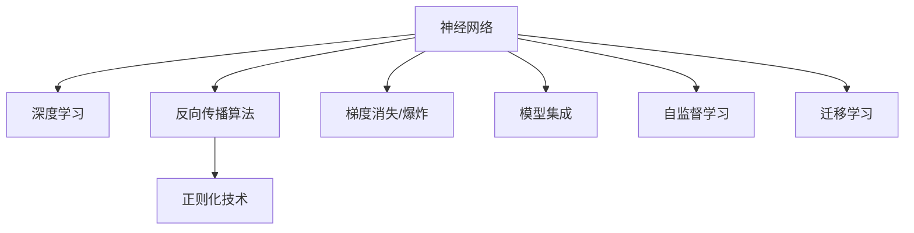

                 

# 神经网络：机器学习工具箱中的新宠

## 1. 背景介绍

### 1.1 问题由来
在机器学习领域，神经网络（Neural Networks）一直是研究的热点。自20世纪80年代以来，神经网络以其强大的模式识别和预测能力，在图像识别、语音处理、自然语言处理等领域取得了显著的成果。但相较于传统统计学习方法，神经网络在理论上仍缺乏坚实的数学基础，过度依赖数据，难以解释其内部运作机制。

进入21世纪，深度学习（Deep Learning）的兴起让神经网络重焕生机。凭借多层结构与大量数据的训练，深度神经网络在众多领域展现出了超越传统机器学习模型的性能。然而，深度学习模型的复杂性也带来了新的挑战，如过拟合、模型解释性差、训练成本高等问题，这些问题往往难以通过传统的统计学理论进行解释。

为了解决这些问题，人工智能领域的科学家们不断探索新的技术和方法，以期找到一种更加灵活、高效、可解释的机器学习模型。神经网络正逐渐成为机器学习工具箱中的新宠，受到越来越多的关注和应用。

### 1.2 问题核心关键点
神经网络之所以成为机器学习的新宠，主要基于以下几个核心关键点：

- **高效特征提取**：神经网络能够自动从数据中提取高级特征，无需手动特征工程，大大降低了数据处理的工作量。
- **泛化能力强**：深度神经网络通常具有较强的泛化能力，能够在未知数据上取得较好的预测效果。
- **可解释性强**：一些新型神经网络结构（如Attention、Capsule等）使得模型的决策过程更加透明，便于解释和调试。
- **学习能力强**：神经网络可以通过反向传播算法不断优化模型参数，逐步逼近真实函数，适用于复杂的非线性模式识别。

这些特性使得神经网络在处理大规模、复杂数据集时表现出卓越的性能，从而在机器学习中占据了重要地位。

## 2. 核心概念与联系

### 2.1 核心概念概述

为了更好地理解神经网络，本节将介绍几个关键概念及其相互联系：

- **神经网络**：由大量人工神经元通过连接构成的网络结构，能够自动从数据中提取特征，并通过训练学习函数映射。
- **深度学习**：基于神经网络的多层结构，通过增加隐藏层数量和深度，使得神经网络能够处理更加复杂的非线性问题。
- **反向传播算法**：用于计算神经网络中各层参数的梯度，以优化损失函数，提升模型性能。
- **梯度消失/爆炸**：在深层网络中，梯度在反向传播过程中可能会被放大或缩小，导致模型无法收敛或训练不稳定。
- **正则化技术**：如L1、L2正则、Dropout等，用于防止过拟合，提升模型泛化能力。
- **模型集成**：通过结合多个模型的预测结果，提升模型的性能和鲁棒性。
- **自监督学习**：利用未标注数据，通过自相关关系学习模型参数，提升模型的数据利用率。
- **迁移学习**：将在一个任务上学到的知识迁移到另一个相关任务中，减少对标注数据的依赖。

这些核心概念构成了神经网络的基本框架和运作机制，使得神经网络能够在众多领域中大放异彩。

### 2.2 核心概念原理和架构的 Mermaid 流程图(Mermaid 流程节点中不要有括号、逗号等特殊字符)



这个流程图展示了神经网络的核心概念及其相互联系：

1. 神经网络是深度学习的底层结构，能够处理复杂非线性问题。
2. 反向传播算法是神经网络优化的核心算法，用于计算梯度并更新模型参数。
3. 梯度消失/爆炸是深度网络中常见的问题，影响模型训练效果。
4. 正则化技术通过控制模型的复杂度，防止过拟合，提升泛化能力。
5. 模型集成通过结合多个模型，提升整体性能和鲁棒性。
6. 自监督学习利用未标注数据训练模型，提高数据利用率。
7. 迁移学习将一个领域学到的知识迁移到另一个领域，提升模型泛化能力。

## 3. 核心算法原理 & 具体操作步骤

### 3.1 算法原理概述

神经网络的核心在于通过反向传播算法（Backpropagation）对模型参数进行优化。其基本流程如下：

1. **前向传播**：将输入数据输入神经网络，通过各层处理得到输出结果。
2. **计算损失**：根据实际输出与真实标签计算损失函数，如均方误差（MSE）、交叉熵（CE）等。
3. **反向传播**：通过链式法则计算损失函数对各层参数的梯度。
4. **参数更新**：利用梯度下降等优化算法，根据梯度更新模型参数。
5. **重复迭代**：不断重复上述过程，直至收敛。

深度神经网络通过增加隐藏层数量和深度，可以学习更加复杂的非线性关系。但随着深度增加，梯度消失或爆炸的问题也随之增加，导致模型训练不稳定。因此，研究者们提出了许多优化方法，如Batch Normalization、ResNet、残差连接等，以改善这一问题。

### 3.2 算法步骤详解

神经网络训练的详细步骤可总结如下：

**Step 1: 准备数据集**
- 收集标注数据集 $D=\{(x_i, y_i)\}_{i=1}^N$，划分为训练集、验证集和测试集。

**Step 2: 设计神经网络结构**
- 确定神经网络的层数、每层的神经元数量、激活函数等关键参数。
- 通常使用深度卷积神经网络（CNN）、循环神经网络（RNN）、长短时记忆网络（LSTM）等结构。

**Step 3: 初始化模型参数**
- 随机初始化各层的权重和偏置项。

**Step 4: 前向传播**
- 将训练数据 $x_i$ 输入神经网络，得到预测输出 $\hat{y_i}$。

**Step 5: 计算损失**
- 根据预测输出 $\hat{y_i}$ 和真实标签 $y_i$ 计算损失函数 $\mathcal{L}$。

**Step 6: 反向传播**
- 通过链式法则计算损失函数对各层参数的梯度。
- 逐层反向传播，更新模型参数。

**Step 7: 参数更新**
- 使用优化算法（如梯度下降、Adam）更新模型参数。

**Step 8: 重复迭代**
- 在训练集上不断迭代训练，直至收敛。
- 在验证集上评估模型性能，防止过拟合。
- 在测试集上最终评估模型泛化能力。

### 3.3 算法优缺点

神经网络的优点包括：

- **高精度**：能够学习复杂非线性关系，适用于处理复杂模式识别问题。
- **自适应性强**：能够自动从数据中提取特征，无需手动特征工程。
- **泛化能力强**：通过增加层数和深度，提升模型对新数据的泛化能力。

神经网络也存在一些缺点：

- **计算量大**：模型参数数量庞大，训练和推理过程复杂。
- **易过拟合**：模型复杂度高，训练数据量小的情况下容易出现过拟合。
- **模型解释性差**：黑箱模型，难以解释其内部决策过程。
- **训练时间长**：特别是深层网络，训练时间较长，对硬件要求高。

### 3.4 算法应用领域

神经网络在众多领域中得到了广泛应用，以下是一些主要应用场景：

- **计算机视觉**：如图像分类、目标检测、图像分割等，通过卷积神经网络（CNN）实现。
- **自然语言处理**：如语言模型、机器翻译、情感分析等，通过循环神经网络（RNN）、长短时记忆网络（LSTM）等实现。
- **语音处理**：如语音识别、语音合成等，通过卷积神经网络（CNN）、递归神经网络（RNN）实现。
- **推荐系统**：如商品推荐、新闻推荐等，通过神经协同过滤、深度矩阵分解等实现。
- **游戏AI**：如自动游戏玩家、游戏策略优化等，通过神经网络实现。

## 4. 数学模型和公式 & 详细讲解 & 举例说明

### 4.1 数学模型构建

神经网络的数学模型通常由以下几部分构成：

- **输入层**：接收原始数据，将数据映射到隐空间。
- **隐藏层**：对输入数据进行特征提取和抽象，多个隐藏层构成网络深度。
- **输出层**：根据隐藏层的抽象特征，输出最终预测结果。

以最简单的全连接神经网络为例，其数学模型为：

$$
\hat{y} = f(\sum_{i=1}^{n} w_i x_i + b)
$$

其中，$x_i$ 为输入数据，$w_i$ 为权重参数，$b$ 为偏置项，$f$ 为激活函数。

### 4.2 公式推导过程

神经网络中常用的激活函数包括Sigmoid、ReLU、Tanh等。这里以ReLU为例，推导其激活函数：

$$
f(x) = \max(0,x)
$$

**前向传播**：

$$
h_1 = f(W_1x_1 + b_1)
$$

$$
h_2 = f(W_2h_1 + b_2)
$$

$$
\cdots
$$

$$
h_L = f(W_Lh_{L-1} + b_L)
$$

**损失函数**：

$$
\mathcal{L} = \frac{1}{N} \sum_{i=1}^N (y_i - \hat{y_i})^2
$$

**反向传播**：

$$
\frac{\partial \mathcal{L}}{\partial z_L} = -2(y_i - \hat{y_i})
$$

$$
\frac{\partial \mathcal{L}}{\partial h_L} = \frac{\partial \mathcal{L}}{\partial z_L} \cdot f'(z_L)
$$

$$
\frac{\partial \mathcal{L}}{\partial h_{L-1}} = \frac{\partial \mathcal{L}}{\partial z_L} \cdot W_L^T \cdot f'(z_L)
$$

$$
\cdots
$$

$$
\frac{\partial \mathcal{L}}{\partial z_1} = \frac{\partial \mathcal{L}}{\partial h_2} \cdot W_2^T \cdot f'(z_2) \cdot W_1^T \cdot f'(z_1)
$$

其中，$z_i$ 为隐藏层 $i$ 的输出，$f'(z_i)$ 为激活函数的导数。

### 4.3 案例分析与讲解

以图像分类任务为例，使用卷积神经网络（CNN）进行训练。

首先，准备图像数据集 $D=\{(x_i, y_i)\}_{i=1}^N$，其中 $x_i$ 为图像，$y_i$ 为标签。

其次，设计卷积神经网络结构，包括卷积层、池化层、全连接层等。

第三，初始化模型参数，随机生成权重和偏置项。

第四，前向传播：将输入图像 $x_i$ 输入神经网络，通过卷积层、池化层等处理得到特征图，最终通过全连接层输出预测结果 $\hat{y_i}$。

第五，计算损失：使用交叉熵损失函数计算预测结果与真实标签的差异。

第六，反向传播：通过链式法则计算损失函数对各层参数的梯度，逐层反向传播更新权重和偏置项。

第七，参数更新：使用优化算法（如SGD、Adam）更新模型参数。

第八，重复迭代：在训练集上不断迭代训练，直至收敛。

第九，评估模型性能：在验证集和测试集上评估模型泛化能力，调整模型参数。

## 5. 项目实践：代码实例和详细解释说明

### 5.1 开发环境搭建

在进行神经网络项目实践前，我们需要准备好开发环境。以下是使用Python进行TensorFlow开发的环境配置流程：

1. 安装Anaconda：从官网下载并安装Anaconda，用于创建独立的Python环境。

2. 创建并激活虚拟环境：
```bash
conda create -n tf-env python=3.8 
conda activate tf-env
```

3. 安装TensorFlow：根据CUDA版本，从官网获取对应的安装命令。例如：
```bash
conda install tensorflow tensorflow-gpu -c conda-forge
```

4. 安装NumPy、Matplotlib等工具包：
```bash
pip install numpy matplotlib
```

5. 下载并准备数据集：例如使用MNIST手写数字数据集。

```python
from tensorflow.keras.datasets import mnist
(x_train, y_train), (x_test, y_test) = mnist.load_data()
```

完成上述步骤后，即可在`tf-env`环境中开始神经网络项目实践。

### 5.2 源代码详细实现

下面我们以图像分类任务为例，给出使用TensorFlow实现卷积神经网络的代码实现。

首先，定义数据处理函数：

```python
import tensorflow as tf
from tensorflow.keras.datasets import mnist
from tensorflow.keras.preprocessing.image import ImageDataGenerator

(x_train, y_train), (x_test, y_test) = mnist.load_data()

def data_preprocess(x):
    x = x.reshape(-1, 28, 28, 1) / 255.0
    return x

train_generator = ImageDataGenerator(preprocessing_function=data_preprocess)
train_generator.fit(x_train)

test_generator = ImageDataGenerator(preprocessing_function=data_preprocess)
test_generator.fit(x_test)
```

然后，定义模型结构：

```python
from tensorflow.keras.models import Sequential
from tensorflow.keras.layers import Conv2D, MaxPooling2D, Flatten, Dense, Dropout

model = Sequential()
model.add(Conv2D(32, kernel_size=(3, 3), activation='relu', input_shape=(28, 28, 1)))
model.add(MaxPooling2D(pool_size=(2, 2)))
model.add(Dropout(0.25))
model.add(Conv2D(64, kernel_size=(3, 3), activation='relu'))
model.add(MaxPooling2D(pool_size=(2, 2)))
model.add(Dropout(0.25))
model.add(Flatten())
model.add(Dense(128, activation='relu'))
model.add(Dropout(0.5))
model.add(Dense(10, activation='softmax'))
```

接着，定义模型编译和训练函数：

```python
model.compile(loss=tf.keras.losses.SparseCategoricalCrossentropy(from_logits=True),
              optimizer=tf.keras.optimizers.Adam(learning_rate=0.001),
              metrics=['accuracy'])

def train_model(model, train_generator, epochs, batch_size):
    model.fit(train_generator, steps_per_epoch=len(train_generator),
              epochs=epochs, batch_size=batch_size, validation_data=test_generator)
```

最后，启动模型训练：

```python
epochs = 10
batch_size = 32

train_model(model, train_generator, epochs, batch_size)

test_loss, test_acc = model.evaluate(test_generator)
print('Test accuracy:', test_acc)
```

以上就是使用TensorFlow实现卷积神经网络并进行图像分类的完整代码实现。可以看到，得益于TensorFlow的强大封装，我们可以用相对简洁的代码完成神经网络模型的训练和评估。

### 5.3 代码解读与分析

让我们再详细解读一下关键代码的实现细节：

**数据预处理函数**：
- 将数据进行归一化和预处理，将像素值缩放到[0,1]区间。

**模型定义**：
- 使用Sequential模型创建卷积神经网络，包含多个卷积层、池化层、全连接层等。
- 在每一层后添加Dropout层，防止过拟合。
- 使用softmax激活函数输出分类结果。

**模型编译**：
- 选择交叉熵损失函数和Adam优化器。
- 设置学习率等超参数。

**模型训练**：
- 使用ImageDataGenerator进行数据增强，提高模型泛化能力。
- 通过fit方法在训练集上训练模型，设置训练轮数和批大小。
- 在验证集上评估模型性能，防止过拟合。

可以看到，TensorFlow提供了强大的工具支持，使得神经网络模型的实现和训练变得高效便捷。

## 6. 实际应用场景

### 6.1 智能推荐系统

智能推荐系统是神经网络在电商、新闻、音乐等领域的重要应用。通过分析用户的历史行为数据，神经网络可以预测用户的兴趣偏好，从而实现个性化的推荐。

在实践中，通常使用深度神经网络模型，如自编码器（Autoencoder）、深度矩阵分解（Deep Matrix Factorization）等，对用户行为数据进行建模。通过微调模型参数，使得模型能够适应新用户和新行为数据的输入，不断提升推荐效果。

### 6.2 自然语言处理

自然语言处理（NLP）是神经网络的重要应用领域之一。通过神经网络模型，可以实现文本分类、情感分析、机器翻译等任务。

以机器翻译为例，使用序列到序列（Seq2Seq）模型，将源语言序列转化为目标语言序列。在实践中，通常使用长短时记忆网络（LSTM）、双向LSTM等模型，通过微调优化模型参数，实现更高精度的翻译效果。

### 6.3 图像识别

图像识别是神经网络在计算机视觉领域的重要应用之一。通过卷积神经网络（CNN）模型，可以实现图像分类、目标检测、图像分割等任务。

以图像分类为例，使用卷积神经网络模型，对图像进行特征提取和分类。在实践中，通常使用ResNet、Inception等模型，通过微调优化模型参数，实现更高的识别精度。

## 7. 工具和资源推荐

### 7.1 学习资源推荐

为了帮助开发者系统掌握神经网络的理论基础和实践技巧，这里推荐一些优质的学习资源：

1. 《深度学习》课程（Coursera）：由斯坦福大学的Andrew Ng教授主讲的深度学习入门课程，涵盖了深度神经网络的基本概念和算法。
2. 《Python深度学习》书籍：Francois Chollet的深度学习框架TensorFlow和Keras的使用，讲解了神经网络在实际项目中的应用。
3. 《Deep Learning Specialization》系列课程（Coursera）：由Andrew Ng教授主讲的深度学习进阶课程，深入讲解深度神经网络的理论和实践。
4. 《Hands-On Machine Learning with Scikit-Learn, Keras, and TensorFlow》书籍：Aurélien Géron撰写的深度学习实战教程，结合Scikit-Learn、Keras和TensorFlow进行项目实践。
5. 《Deep Learning for Computer Vision》课程（Udacity）：深度学习在计算机视觉领域的应用，讲解了卷积神经网络、图像分类、目标检测等任务。

通过对这些资源的学习实践，相信你一定能够快速掌握神经网络的精髓，并用于解决实际的机器学习问题。

### 7.2 开发工具推荐

高效的开发离不开优秀的工具支持。以下是几款用于神经网络开发常用的工具：

1. TensorFlow：由Google主导开发的深度学习框架，生产部署方便，适合大规模工程应用。
2. PyTorch：由Facebook主导开发的深度学习框架，灵活易用，适合研究探索。
3. Keras：基于TensorFlow和Theano的高级深度学习框架，提供了简单易用的API接口，适合快速原型开发。
4. Scikit-Learn：Python的机器学习库，提供了丰富的算法和工具，适合入门和应用开发。
5. Jupyter Notebook：基于Web的交互式编程环境，支持Python、R等语言，方便数据处理和模型训练。
6. Matplotlib、Seaborn：数据可视化工具，支持多种图表类型，方便数据展示和分析。

合理利用这些工具，可以显著提升神经网络模型的开发效率，加快创新迭代的步伐。

### 7.3 相关论文推荐

神经网络的研究源于学界的持续探索。以下是几篇奠基性的相关论文，推荐阅读：

1. "Neural Networks and Deep Learning"（Goodfellow, Bengio, Courville）：深度学习的权威入门教材，详细讲解了深度神经网络的理论和实践。
2. "ImageNet Classification with Deep Convolutional Neural Networks"（Krizhevsky, Sutskever, Hinton）：使用卷积神经网络模型进行图像分类任务，刷新了ImageNet图像识别SOTA。
3. "Learning Phrases and Sentences from Scratch"（Dai et al.）：使用自监督学习的方式训练语言模型，无需标注数据即可学习到语言知识。
4. "Attention Is All You Need"（Vaswani et al.）：提出了Transformer结构，标志着自注意力机制在神经网络中的广泛应用。
5. "ResNet: Deep Residual Learning for Image Recognition"（He et al.）：提出残差连接，解决了深层网络梯度消失问题，推动了深度神经网络的发展。

这些论文代表了大神经网络的研究方向和重要突破，值得深入学习和理解。

## 8. 总结：未来发展趋势与挑战

### 8.1 总结

本文对神经网络在机器学习中的重要性和应用进行了全面系统的介绍。神经网络以其强大的模式识别和预测能力，在图像处理、语音识别、自然语言处理等领域取得了显著的成果。通过反向传播算法，神经网络能够自动从数据中提取特征，并通过训练学习函数映射。然而，神经网络也存在一些缺点，如计算量大、易过拟合、模型解释性差等。

通过本文的系统梳理，可以看到，神经网络在机器学习中的重要地位，其强大的模式识别和预测能力，使得其在众多领域中大放异彩。但同时，神经网络也面临一些挑战，如过拟合、模型解释性差、训练时间长等。为了解决这些问题，研究者们提出了许多优化方法，如Batch Normalization、ResNet、自监督学习等，以提升神经网络的性能和泛化能力。

### 8.2 未来发展趋势

展望未来，神经网络在机器学习中的地位将继续提升，成为重要的人工智能工具。神经网络的研究方向将涵盖以下几个方面：

1. **深度学习架构创新**：神经网络结构将不断创新，如卷积神经网络（CNN）、循环神经网络（RNN）、自注意力机制（Transformer）等，使得神经网络能够处理更加复杂和多样化的数据。
2. **模型解释性和可控性**：研究更加透明和可控的神经网络模型，如因果推理、可解释性模型等，使得神经网络能够更好地应用于需要高透明度和高安全性的领域。
3. **跨领域应用推广**：神经网络将逐渐拓展到更多的应用领域，如医疗、金融、工业等，提升各个行业的智能化水平。
4. **边缘计算和移动端部署**：神经网络将逐渐向边缘计算和移动端部署，降低计算资源和数据传输成本，使得神经网络能够更加灵活地应用于实际场景。
5. **多模态数据融合**：研究将不同模态的数据（如文本、图像、语音等）进行融合的神经网络模型，提升模型对多模态数据的处理能力。

以上趋势凸显了神经网络在机器学习中的广阔前景，其强大的性能和灵活性将为未来的智能化技术带来更多的可能性。

### 8.3 面临的挑战

尽管神经网络在机器学习中取得了显著的成就，但在迈向更加智能化、普适化应用的过程中，仍面临诸多挑战：

1. **计算资源限制**：神经网络通常需要大量的计算资源进行训练和推理，特别是在处理大规模数据集时，计算资源成本较高。如何优化计算资源，降低训练成本，是一个重要的问题。
2. **模型复杂性**：神经网络模型复杂度高，容易出现过拟合问题。如何在保持高精度的情况下，提升模型的泛化能力，是一个亟待解决的问题。
3. **模型解释性**：神经网络模型通常是一个黑箱，难以解释其内部工作机制和决策过程。如何提高模型的可解释性，增加其透明性，是另一个重要的问题。
4. **数据隐私和安全**：神经网络模型通常需要大量的数据进行训练，如何保护数据隐私和安全，防止数据泄露和滥用，是一个需要重视的问题。
5. **模型鲁棒性**：神经网络模型在面对噪声、异常值等干扰时，容易出现鲁棒性差的问题。如何提升模型的鲁棒性，是一个需要解决的问题。

### 8.4 研究展望

面对神经网络面临的挑战，未来的研究需要在以下几个方面寻求新的突破：

1. **深度学习架构创新**：研究更加高效、可控的神经网络架构，如因果推理、可解释性模型等，使得神经网络能够更好地应用于实际场景。
2. **模型解释性和可控性**：研究更加透明和可控的神经网络模型，提升模型的可解释性和可控性，增加其透明性，使得神经网络能够更好地应用于需要高透明度和高安全性的领域。
3. **跨领域应用推广**：研究跨领域数据融合的神经网络模型，提升模型对多模态数据的处理能力，拓展神经网络的应用范围。
4. **边缘计算和移动端部署**：研究将神经网络向边缘计算和移动端部署的技术，降低计算资源和数据传输成本，使得神经网络能够更加灵活地应用于实际场景。
5. **模型鲁棒性提升**：研究提升模型鲁棒性的方法，如对抗训练、正则化等，使得神经网络能够更好地应对噪声、异常值等干扰，提升其鲁棒性。

这些研究方向的探索，将引领神经网络技术迈向更高的台阶，为构建安全、可靠、可解释、可控的智能系统铺平道路。

## 9. 附录：常见问题与解答

**Q1：深度神经网络容易出现过拟合问题，有哪些方法可以缓解？**

A: 缓解深度神经网络过拟合问题的方法包括：
1. 数据增强：通过旋转、裁剪、缩放等方式扩充训练集，提升模型泛化能力。
2. 正则化技术：如L1、L2正则、Dropout等，防止模型过拟合。
3. 早停策略：在验证集上监测模型性能，当性能不再提升时停止训练。
4. 模型集成：通过结合多个模型的预测结果，提升模型的鲁棒性。
5. 网络裁剪：去除不必要的层和参数，减小模型尺寸，提高泛化能力。

这些方法可以根据具体问题和数据特点进行灵活组合，以提升模型的泛化能力。

**Q2：神经网络模型的训练速度慢，如何提升训练效率？**

A: 提升神经网络模型训练效率的方法包括：
1. 使用GPU加速训练：利用GPU的并行计算能力，提升训练速度。
2. 分布式训练：将训练任务分布到多台机器上进行，提高计算效率。
3. 数据预处理：优化数据读取和预处理过程，减少I/O开销。
4. 模型并行：将模型在多个设备上并行训练，提高计算效率。
5. 量化加速：将浮点模型转为定点模型，压缩存储空间，提高计算效率。

这些方法可以结合使用，以进一步提升神经网络模型的训练效率。

**Q3：神经网络模型的参数量大，如何优化模型结构？**

A: 优化神经网络模型结构的方法包括：
1. 网络裁剪：去除不必要的层和参数，减小模型尺寸，提高泛化能力。
2. 稀疏化存储：通过稀疏矩阵存储，压缩模型参数。
3. 网络剪枝：去除冗余的连接，减少模型参数。
4. 量化加速：将浮点模型转为定点模型，压缩存储空间，提高计算效率。
5. 可解释性模型：使用可解释性模型，减少模型参数，提高透明性。

这些方法可以根据具体问题和数据特点进行灵活组合，以优化模型结构。

**Q4：如何设计神经网络模型，才能获得更好的性能？**

A: 设计神经网络模型时，应考虑以下几个方面：
1. 选择合适的模型架构：根据具体任务选择合适的模型架构，如CNN、RNN、Transformer等。
2. 调整超参数：根据具体任务调整超参数，如学习率、批大小、迭代轮数等。
3. 数据预处理：对数据进行归一化、标准化等预处理，提高模型性能。
4. 正则化技术：使用L1、L2正则、Dropout等正则化技术，防止过拟合。
5. 模型集成：结合多个模型的预测结果，提升模型性能和鲁棒性。
6. 对抗训练：引入对抗样本，提高模型鲁棒性。

这些方法可以根据具体问题和数据特点进行灵活组合，以设计出高性能的神经网络模型。

**Q5：神经网络模型在部署时需要注意哪些问题？**

A: 将神经网络模型部署到实际应用中，需要注意以下几个问题：
1. 模型裁剪：去除不必要的层和参数，减小模型尺寸，提高推理效率。
2. 量化加速：将浮点模型转为定点模型，压缩存储空间，提高推理速度。
3. 服务化封装：将模型封装为标准化服务接口，便于集成调用。
4. 弹性伸缩：根据请求流量动态调整资源配置，平衡服务质量和成本。
5. 监控告警：实时采集系统指标，设置异常告警阈值，确保服务稳定性。
6. 安全性：采用访问鉴权、数据脱敏等措施，保障数据和模型安全。

这些方法可以确保神经网络模型在实际应用中具有良好的性能和稳定性。

---

作者：禅与计算机程序设计艺术 / Zen and the Art of Computer Programming

