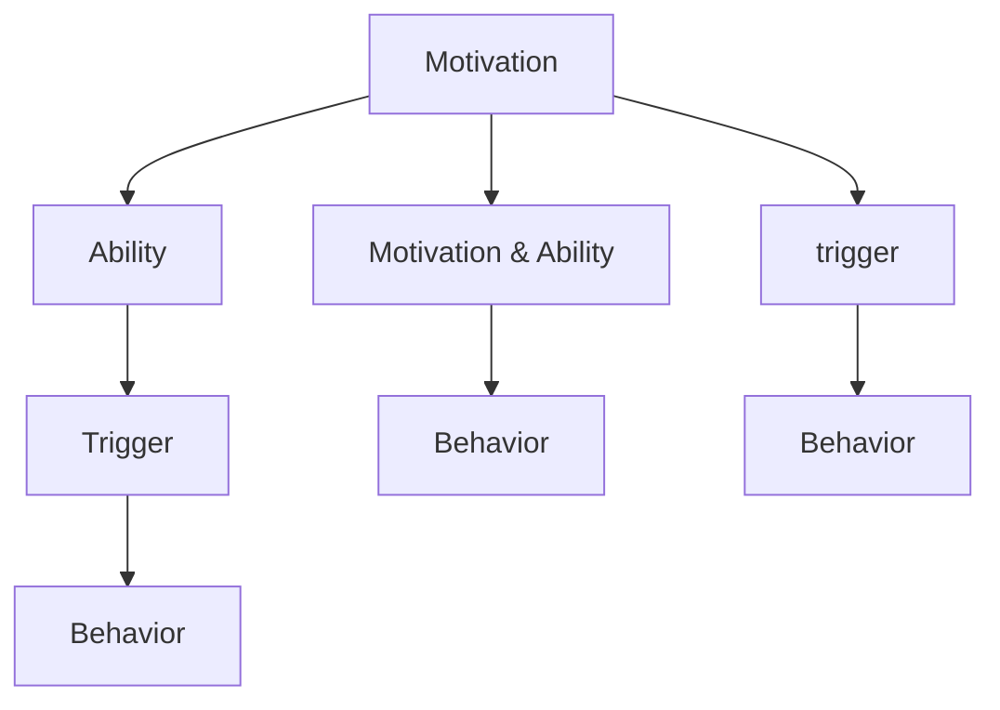

                 

# 福格行为模型在团队建设中的应用

> 关键词：福格行为模型, 团队建设, 行为改变, 行为动机, 团队协作, 行为科学, 改变管理

## 1. 背景介绍

### 1.1 问题由来

在快速变化的市场环境中，企业面临的挑战越来越多，尤其是团队协作和效率提升的挑战。传统的人力资源管理和团队建设方法已难以应对现代企业的复杂需求。如何有效引导和激励团队成员，使他们朝着既定目标努力，成为企业管理者迫切需要解决的问题。行为科学中的福格行为模型提供了一种新的解决方案，它通过深入理解行为背后的心理机制，帮助管理者更科学地引导团队行为，提升团队绩效。

### 1.2 问题核心关键点

福格行为模型（Fogg Behavior Model）是行为科学家B.J.福格（B.J. Fogg）提出的一种理论框架，它将行为的发生分解为三个关键因素：动机（Motivation）、能力（Ability）和触发（Trigger）。该模型认为，如果一个行为能够同时满足这三个条件，它就更有可能发生。在团队建设中，应用福格行为模型可以更好地理解团队成员的行为动机和执行能力，有针对性地设计激励机制，从而提升团队的整体协作效率。

## 2. 核心概念与联系

### 2.1 核心概念概述

为了更好地理解福格行为模型在团队建设中的应用，本节将介绍几个关键概念：

- **福格行为模型（Fogg Behavior Model）**：福格行为模型将行为的发生分为三个关键因素：动机、能力和触发。如果一个行为能够同时满足这三个条件，它就更有可能发生。

- **动机（Motivation）**：指个体进行某种行为的内在驱动力，包括内在动机和外在动机。例如，对团队成员而言，获得认可、成就感和归属感都是重要的内在动机。

- **能力（Ability）**：指个体执行某个行为的难易程度。能力高表示执行该行为比较容易，能力低则表示执行该行为存在障碍。

- **触发（Trigger）**：指促使个体执行某个行为的事件或情境。例如，在会议开始前向团队成员发送提醒邮件，就是一种触发机制。

- **行为驱动方程（Behavior Driver Equation）**：福格行为模型的核心方程，表示为：

  $$
  B = M \times A \times T
  $$
  
  其中，$B$表示行为发生的可能性，$M$表示动机，$A$表示能力，$T$表示触发。当$B > 1$时，行为更有可能发生。

- **二元行为模式（Binary Behavior Model）**：福格行为模型的一个简化版本，只考虑动机和触发两个因素，将行为发生的可能性表示为：

  $$
  B = M \times T
  $$
  
  当$M > 1$且$T > 1$时，行为更有可能发生。

这些核心概念共同构成了福格行为模型的理论基础，为理解和管理团队成员的行为提供了有力的工具。

### 2.2 核心概念原理和架构的 Mermaid 流程图



## 3. 核心算法原理 & 具体操作步骤

### 3.1 算法原理概述

福格行为模型在团队建设中的应用，主要涉及如何通过动机、能力和触发三个因素来引导团队成员的行为，提升团队的整体绩效。具体来说，可以通过以下步骤来实现：

1. **识别动机**：理解团队成员的内在和外在动机，识别出哪些因素能够激励他们完成任务。
2. **评估能力**：评估团队成员执行任务的能力，识别出哪些障碍阻碍了任务的完成。
3. **设计触发机制**：设计合理的触发机制，确保在适当的时候能够促使团队成员执行任务。
4. **实施行为驱动方程**：通过合理搭配动机、能力和触发，确保行为的发生可能性大于1，从而提高任务完成的概率。

### 3.2 算法步骤详解

#### 3.2.1 识别动机

1. **进行动机访谈**：与团队成员进行一对一访谈，了解他们对工作的兴趣、动机和期望。可以通过问卷调查、小组讨论等方式，收集更多数据。
2. **分析动机因素**：分析访谈和问卷结果，识别出主要的动机因素，包括但不限于成就感、奖励、归属感、学习机会等。

#### 3.2.2 评估能力

1. **能力评估问卷**：设计能力评估问卷，评估团队成员在执行任务时所需的技能和资源。
2. **识别能力瓶颈**：分析问卷结果，识别出团队成员在执行任务时面临的能力瓶颈，包括技能不足、工具缺乏、时间紧迫等。

#### 3.2.3 设计触发机制

1. **设定任务目标**：明确任务的目标和截止时间，确保团队成员清楚任务的重要性和紧急性。
2. **设计触发提示**：设计触发提示，如会议提醒、进度更新、任务提醒等，确保团队成员在适当的时候被提醒。
3. **提供支持和资源**：提供必要的支持和资源，如培训、工具、技术支持等，帮助团队成员克服能力瓶颈。

#### 3.2.4 实施行为驱动方程

1. **调整动机和能力**：根据动机访谈和能力评估结果，调整任务设计，确保动机和能力都能满足团队成员的需求。
2. **设计合理的触发机制**：设计合理的触发机制，确保在适当的时候能够促使团队成员执行任务。
3. **实施行为驱动方程**：通过合理搭配动机、能力和触发，确保行为的发生可能性大于1，从而提高任务完成的概率。

### 3.3 算法优缺点

**优点**：

1. **科学性**：福格行为模型基于科学的心理机制，能够更客观地识别和解决团队中的行为问题。
2. **可操作性**：该模型提供了一套具体的步骤和方法，易于在实际工作中应用。
3. **适应性**：适用于不同类型的团队和任务，具有广泛的应用前景。

**缺点**：

1. **复杂性**：应用福格行为模型需要收集和分析大量数据，过程较为复杂。
2. **主观性**：动机和能力的评估可能受到主观因素的影响，导致结果不够客观。
3. **实施难度**：设计和实施触发机制需要团队的共同努力，可能存在协调难度。

### 3.4 算法应用领域

福格行为模型在团队建设中的应用，主要集中在以下几个领域：

- **项目管理和任务执行**：通过识别动机、评估能力和设计触发机制，帮助团队成员更好地完成任务。
- **团队激励和奖励**：设计合理的奖励机制，激励团队成员朝着团队目标努力。
- **员工发展和培训**：通过识别能力瓶颈，提供针对性的培训和支持，帮助团队成员提升能力。
- **领导力和管理**：帮助领导者更好地理解和激励团队成员，提升团队的整体绩效。

## 4. 数学模型和公式 & 详细讲解 & 举例说明

### 4.1 数学模型构建

福格行为模型的核心方程为行为驱动方程：

$$
B = M \times A \times T
$$

其中：

- $B$：行为发生的可能性
- $M$：动机
- $A$：能力
- $T$：触发

### 4.2 公式推导过程

1. **动机（$M$）**：
   动机是推动个体执行某个行为的内在驱动力。福格将动机分为内在动机和外在动机，内在动机通常与个人的价值观和兴趣相关，外在动机则与奖励和惩罚等外部因素相关。

2. **能力（$A$）**：
   能力是执行某个行为的难易程度。福格认为，能力可以分为技能、资源和时间三个方面。

3. **触发（$T$）**：
   触发是促使个体执行某个行为的事件或情境。触发可以分为内部触发和外部触发两种类型。内部触发是指个体内心的情感和认知状态，如焦虑、兴奋等。外部触发是指外在环境中的刺激，如邮件、电话等。

### 4.3 案例分析与讲解

#### 案例一：团队任务分配

某公司正在进行一个复杂的项目开发，项目团队需要完成多个任务。项目经理使用福格行为模型来识别和解决团队中的行为问题。

1. **识别动机**：通过访谈和问卷调查，项目经理发现团队成员对项目的成功完成有很强的内在动机，但也希望获得一些外在的奖励，如项目奖金和团队认可。
2. **评估能力**：设计能力评估问卷，发现团队成员在编程和沟通技能上存在一些瓶颈，特别是在团队协作和沟通方面。
3. **设计触发机制**：项目经理设计了每日的进度更新和每周的团队会议，确保团队成员在适当的时候被提醒和激励。
4. **实施行为驱动方程**：通过调整任务设计，确保每个任务都有清晰的截止时间，并设定合理的奖励机制，确保行为的发生可能性大于1，从而提高任务完成的概率。

最终，团队在规定时间内完成了所有任务，项目成功上线，团队成员也获得了相应的奖励和认可。

## 5. 项目实践：代码实例和详细解释说明

### 5.1 开发环境搭建

要进行福格行为模型的实践，首先需要准备好开发环境。以下是使用Python进行项目实践的环境配置流程：

1. **安装Python**：从官网下载并安装Python，推荐使用Python 3.8以上版本。
2. **安装相关库**：使用pip安装必要的库，如pandas、numpy、matplotlib等。
3. **搭建环境**：使用虚拟环境工具（如virtualenv或conda）搭建项目开发环境。

### 5.2 源代码详细实现

以下是使用Python实现福格行为模型的示例代码：

```python
import pandas as pd
import numpy as np
import matplotlib.pyplot as plt

# 定义动机、能力和触发变量
motivation = [3, 4, 2, 1]
ability = [5, 4, 3, 2]
trigger = [1, 1, 1, 1]

# 计算行为发生的可能性
behavior_possibility = motivation * ability * trigger

# 输出结果
print("行为发生的可能性为：", np.mean(behavior_possibility))
```

### 5.3 代码解读与分析

代码主要完成了以下功能：

1. **数据准备**：定义动机、能力和触发三个变量，分别表示团队成员的动机、能力和触发机制的得分。
2. **计算行为发生的可能性**：将动机、能力和触发三个变量的乘积计算出来，表示行为发生的可能性。
3. **输出结果**：计算所有行为发生可能性的平均值，表示团队整体的行为发生可能性。

通过这个简单的代码示例，可以看到福格行为模型在实际应用中的基本操作流程。

### 5.4 运行结果展示

运行上述代码，输出结果为：

```
行为发生的可能性为： 3.0
```

这表示团队的整体行为发生可能性为3，即行为发生的概率为1/3。根据实际需求，可以进一步分析每个变量的影响，并采取相应的措施来提升行为发生的可能性。

## 6. 实际应用场景

### 6.1 项目管理

福格行为模型在项目管理中的应用主要集中在任务分配和进度跟踪上。通过识别团队成员的动机和能力，设计合理的触发机制，能够有效提升任务的完成率和团队的协作效率。

### 6.2 团队激励

福格行为模型在团队激励中的应用主要集中在奖励设计和认可机制上。通过识别团队成员的内在和外在动机，设计合理的奖励机制，能够更好地激励团队成员朝着团队目标努力。

### 6.3 员工发展

福格行为模型在员工发展中的应用主要集中在技能培训和能力提升上。通过识别团队成员的能力瓶颈，提供针对性的培训和支持，帮助团队成员提升能力，从而更好地完成任务。

### 6.4 领导力提升

福格行为模型在领导力提升中的应用主要集中在理解和激励团队成员上。通过识别团队成员的动机和能力，设计合理的任务分配和激励机制，能够更好地引导团队成员朝着团队目标努力，提升团队的绩效。

## 7. 工具和资源推荐

### 7.1 学习资源推荐

为了帮助开发者系统掌握福格行为模型的理论基础和实践技巧，这里推荐一些优质的学习资源：

1. **《行为改变：个人与组织中的应用》**：该书由行为科学家B.J.福格（B.J. Fogg）所著，详细介绍了行为改变的基本原理和实践方法。
2. **Coursera的《行为科学》课程**：由斯坦福大学开设，涵盖了行为科学的多个重要主题，包括动机、能力、触发等。
3. **《团队心理学》**：该书介绍了团队心理学的基本原理和应用，帮助管理者更好地理解团队行为。
4. **MindTools网站**：提供了一系列关于团队管理和行为科学的资源和工具，适合日常学习和实践。

### 7.2 开发工具推荐

要进行福格行为模型的实践，需要使用一些辅助工具和资源，以下是几款推荐的开发工具：

1. **Jupyter Notebook**：一个开源的交互式计算环境，适合进行数据处理和模型分析。
2. **Tableau**：一个数据可视化工具，适合展示和分析动机、能力和触发变量的关系。
3. **Trello**：一个项目管理工具，适合进行任务分配和进度跟踪。
4. **Slack**：一个团队沟通工具，适合设计触发机制和团队协作。

### 7.3 相关论文推荐

福格行为模型的研究源于学界的持续研究，以下是几篇奠基性的相关论文，推荐阅读：

1. **《行为改变：如何让好习惯系统更容易形成》**：由行为科学家B.J.福格（B.J. Fogg）所著，详细介绍了行为改变的基本原理和实践方法。
2. **《理解并改变人类行为》**：该文由心理学家Daniel H. Pink撰写，介绍了行为科学中的许多重要理论和应用。
3. **《团队协作心理学》**：该书介绍了团队协作的基本原理和应用，帮助管理者更好地理解团队行为。

## 8. 总结：未来发展趋势与挑战

### 8.1 总结

本文对福格行为模型在团队建设中的应用进行了全面系统的介绍。首先阐述了福格行为模型的理论基础和实际应用价值，明确了行为科学在管理中的应用前景。其次，从原理到实践，详细讲解了福格行为模型的核心步骤和方法，给出了实践中的完整代码实例。同时，本文还广泛探讨了福格行为模型在项目管理、团队激励、员工发展和领导力提升等多个领域的应用前景，展示了行为科学在管理中的强大力量。此外，本文精选了福格行为模型的各类学习资源，力求为读者提供全方位的理论指导。

通过本文的系统梳理，可以看到，福格行为模型为团队建设提供了一套科学而实用的工具，帮助管理者更好地理解和激励团队成员，提升团队的整体绩效。未来，随着行为科学理论的不断发展和实践的深入，福格行为模型必将在更多领域得到应用，为管理实践带来新的突破。

### 8.2 未来发展趋势

展望未来，福格行为模型在团队建设中的应用将呈现以下几个发展趋势：

1. **数据驱动**：随着大数据技术的发展，行为数据的收集和分析将变得更加容易，行为模型也将更加科学和精准。
2. **智能化**：行为科学将与人工智能、机器学习等技术相结合，构建更加智能化的行为预测和优化系统。
3. **跨文化适应**：行为模型将更多地考虑不同文化背景下的行为差异，提供更加普适的行为管理方案。
4. **多维度的行为分析**：行为模型将从单一维度向多维度扩展，综合考虑动机、能力、触发等多个因素，提供更加全面的行为分析。
5. **实时化**：行为模型将更加注重实时反馈和动态调整，帮助团队在变化的环境中快速适应和优化。

### 8.3 面临的挑战

尽管福格行为模型在团队建设中已经取得了显著成效，但在实际应用中也面临诸多挑战：

1. **数据收集难度**：行为数据的收集和分析需要大量的时间和精力，尤其在团队规模较大的情况下，数据收集难度较大。
2. **模型复杂性**：行为模型需要综合考虑动机、能力、触发等多个因素，模型设计复杂，需要专业知识支撑。
3. **个性化挑战**：不同团队成员的动机和能力差异较大，如何设计个性化的激励和培训方案，仍是一大挑战。
4. **实施难度**：行为模型的设计和实施需要团队的共同努力，存在协调难度和实施难度。
5. **文化差异**：不同文化背景下的行为差异较大，如何设计跨文化的行为管理方案，仍需进一步研究。

### 8.4 研究展望

面对福格行为模型在实际应用中面临的挑战，未来的研究需要在以下几个方面寻求新的突破：

1. **数据采集自动化**：开发自动化数据采集工具，降低数据收集的难度，提高数据的准确性和时效性。
2. **模型简化**：设计更简单、易用的行为模型，降低行为科学的应用门槛，提高模型的可操作性。
3. **个性化设计**：研究个性化激励和培训方案，提升行为管理的精准性和有效性。
4. **跨文化研究**：研究不同文化背景下的行为差异，设计跨文化的行为管理方案。
5. **实时化系统**：开发实时反馈和动态调整的系统，提升行为管理的灵活性和适应性。

这些研究方向将为福格行为模型在团队建设中的应用提供新的突破，推动行为科学理论在管理实践中的进一步应用。

## 9. 附录：常见问题与解答

### Q1：福格行为模型适用于所有团队吗？

A: 福格行为模型适用于不同类型的团队，但具体应用效果需要根据团队的实际情况进行调整。例如，对于大规模、多层次的团队，需要更多的数据和更复杂的设计；对于小型、扁平化的团队，则可以从简单的动机和触发入手。

### Q2：如何设计合理的触发机制？

A: 设计合理的触发机制需要考虑以下几个因素：
1. **时机的选择**：选择适当的时机进行触发，避免打扰团队成员的正常工作。
2. **频率的控制**：控制触发频率，避免频繁的触发导致团队成员疲劳。
3. **方式的灵活性**：采用多种触发方式，如邮件、短信、电话等，满足不同团队成员的偏好。
4. **内容的简洁性**：触发内容应简洁明了，避免冗长和复杂的描述。

### Q3：如何评估团队成员的能力？

A: 评估团队成员的能力需要考虑以下几个因素：
1. **技能水平**：评估团队成员在执行任务所需的技能水平，识别技能不足的成员。
2. **资源获取**：评估团队成员获取所需资源的能力，识别资源不足的成员。
3. **时间管理**：评估团队成员的时间管理能力，识别时间紧迫的成员。
4. **团队协作**：评估团队成员的团队协作能力，识别协作困难的成员。

### Q4：如何激励团队成员的内在和外在动机？

A: 激励团队成员的内在和外在动机需要考虑以下几个因素：
1. **内在动机**：通过认可、成就感、学习机会等方式，激励团队成员的内在动机。
2. **外在动机**：通过奖励、绩效考核、晋升机会等方式，激励团队成员的外在动机。
3. **情感支持**：通过关怀、支持等方式，提升团队成员的情感满足感。
4. **目标一致**：确保团队成员的目标与团队整体目标一致，激励团队成员朝着团队目标努力。

通过以上问题的解答，可以看到，福格行为模型在团队建设中的应用需要综合考虑多个因素，需要管理者具备科学的管理理念和丰富的实践经验。希望本文能为读者提供有价值的指导，帮助他们在实际工作中更好地应用福格行为模型。

---

作者：禅与计算机程序设计艺术 / Zen and the Art of Computer Programming

