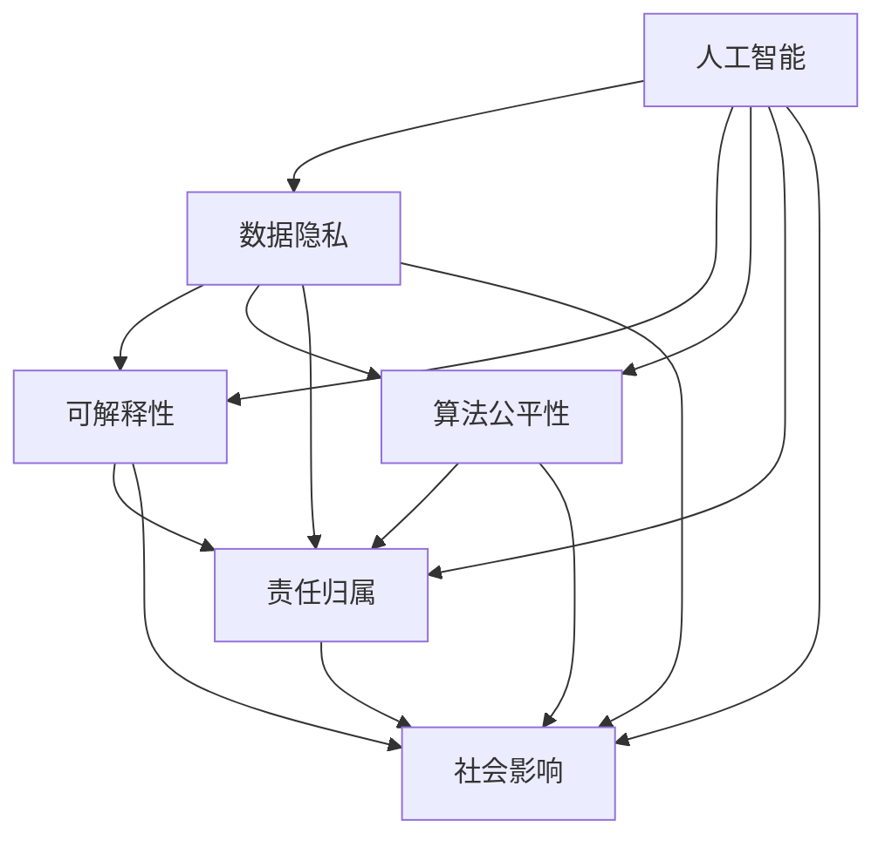

                 

# 科技与伦理的平衡点：人类计算的伦理思考

> 关键词：人工智能, 伦理, 隐私保护, 可解释性, 公平性, 责任归属, 社会影响

## 1. 背景介绍

### 1.1 问题由来

近年来，人工智能(AI)技术的飞速发展，特别是深度学习在各个领域的广泛应用，引发了全球范围内的伦理思考和讨论。AI技术的强大潜力，让我们看到了未来无数可能性的同时，也带来了诸多挑战和风险。

- **隐私保护**：如何合理使用用户数据，避免数据滥用和隐私泄露？
- **可解释性**：AI模型的决策过程复杂，如何赋予模型更高的透明度和可解释性？
- **公平性**：AI算法是否可能存在偏见，导致不公平的结果？
- **责任归属**：AI系统出现失误或错误时，谁来承担责任？
- **社会影响**：AI的广泛应用将如何影响社会结构、就业和公共政策？

本文将围绕AI技术的伦理问题展开探讨，并提出一些思考和解决方案。

### 1.2 问题核心关键点

探讨AI伦理的关键点包括：

1. **数据隐私**：如何保障用户数据的隐私安全？
2. **模型可解释性**：如何让AI决策变得透明可解释？
3. **算法公平性**：如何确保AI算法不会歧视特定群体？
4. **责任归属**：如何定义AI系统的责任边界？
5. **社会影响**：如何评估AI技术的社会效益和风险？

## 2. 核心概念与联系

### 2.1 核心概念概述

在探讨AI伦理问题时，需要明确几个核心概念及其相互联系：

- **人工智能(AI)**：以算法、模型和数据为基础，能够自主学习、推理和决策的智能系统。
- **隐私保护**：指在数据采集、存储、使用等各个环节，采取措施保护个人隐私。
- **可解释性**：指AI模型能够清晰地解释其决策过程和结果，使用户和监管者能够理解和信任模型。
- **公平性**：指AI算法在处理数据和决策时不应存在系统性偏见，应确保对所有群体的公平对待。
- **责任归属**：指在AI系统出现故障或错误时，明确责任归属，并采取相应的纠正措施。
- **社会影响**：指AI技术对社会结构、就业、公共政策等产生的广泛影响。

这些概念之间相互影响，共同构成AI伦理问题的复杂图景。

### 2.2 核心概念原理和架构的 Mermaid 流程图(Mermaid 流程节点中不要有括号、逗号等特殊字符)



该图展示了各个核心概念之间的关系。可以看出，数据隐私是AI伦理的基础，缺乏隐私保护，其他伦理问题也无法得到根本解决。可解释性、公平性和责任归属，是确保AI系统可靠性和公正性的关键因素。社会影响则是一个宏观视角，考虑了AI技术对社会的广泛影响，需要在其他伦理原则基础上进行评估。

## 3. 核心算法原理 & 具体操作步骤
### 3.1 算法原理概述

AI伦理问题的探讨，离不开对AI算法和模型的深入理解。AI模型的核心原理是利用大量数据进行训练，学习出复杂的特征表示，进而进行预测和决策。其基本流程包括：数据收集、模型训练、测试和部署。

在数据收集阶段，隐私保护是首要考虑。如何获取用户数据，保障数据安全，防止数据滥用，是数据隐私保护的关键。

在模型训练阶段，可解释性和公平性是主要挑战。如何确保模型的透明性和公正性，避免算法偏见，是模型设计的重要考量。

在测试和部署阶段，责任归属和社会影响成为焦点。如何在模型部署后监控其表现，确保模型可靠运行，评估其对社会的影响，是责任归属和社会影响的落实之处。

### 3.2 算法步骤详解

#### 数据隐私保护

数据隐私保护主要包括以下几个步骤：

1. **数据匿名化**：对用户数据进行去标识处理，使数据无法直接关联到个人。
2. **数据加密**：对敏感数据进行加密存储，防止未授权访问。
3. **差分隐私**：在数据分析过程中加入噪声，防止数据泄露。
4. **数据访问控制**：对数据访问进行严格管理，限制敏感数据的访问权限。

#### 模型可解释性

模型可解释性主要通过以下几个方法实现：

1. **可视化技术**：使用特征重要性图、决策树可视化等技术，展示模型内部决策路径。
2. **模型解释工具**：如LIME、SHAP等，通过局部近似模型的方法，解释模型的具体预测。
3. **可解释性框架**：如XAI、Model Cards等，记录模型的设计、训练和应用情况，提升透明性。

#### 算法公平性

算法公平性主要通过以下方法保障：

1. **数据平衡处理**：通过数据增强、过采样、欠采样等技术，确保不同群体的样本平衡。
2. **公平性约束**：引入公平性损失函数，如Divergence Minimization Objective，优化模型以减少偏见。
3. **多指标评估**：在模型评估时，引入公平性指标如Demographic Parity、Equalized Odds等，评估模型表现。

#### 责任归属

责任归属主要通过以下方法实现：

1. **模型审计**：对模型进行定期的性能和公平性审计，确保模型可靠运行。
2. **责任分配机制**：制定明确的责任分配规则，如发生故障时如何处理、如何追踪责任。
3. **法律框架**：建立健全的法律和监管框架，明确AI系统在法律中的地位和责任。

#### 社会影响评估

社会影响评估主要通过以下方法实现：

1. **社会影响研究**：对AI技术的应用场景进行社会影响研究，评估其潜在风险和效益。
2. **公众参与**：在模型设计和应用过程中，征求公众意见，确保模型设计符合社会价值观。
3. **政策建议**：根据社会影响评估结果，提出相应的政策建议，推动AI技术的规范发展。

### 3.3 算法优缺点

AI伦理问题探讨的算法主要优点包括：

- **系统化**：提供了系统化的伦理框架，涵盖数据隐私、可解释性、公平性、责任归属和社会影响等多个方面。
- **全面性**：考虑了AI技术从研发到部署的全流程，确保各个环节的伦理原则得以落实。
- **可操作性**：通过具体步骤和方法，提供了实际操作指导，帮助开发者和使用者更好地处理伦理问题。

其缺点主要包括：

- **复杂性**：涉及的伦理问题众多，处理起来复杂繁琐。
- **实时性**：伦理问题往往难以实时处理，需要在模型开发和应用过程中持续关注和改进。
- **资源消耗**：部分伦理保障方法需要额外的资源投入，如数据匿名化、加密等技术。

### 3.4 算法应用领域

AI伦理问题探讨的算法在多个领域都有广泛应用：

- **医疗健康**：在医疗数据隐私保护、算法公平性和责任归属等方面，确保AI技术的公正和安全。
- **金融服务**：在金融数据隐私、模型可解释性和社会影响评估等方面，确保AI系统的透明和公平。
- **智能制造**：在工业数据隐私、责任归属和社会影响评估等方面，确保AI系统的可靠运行和正面影响。
- **教育培训**：在学生数据隐私、模型可解释性和社会影响评估等方面，确保AI技术的教育公平。
- **智能城市**：在城市数据隐私、模型公平性和社会影响评估等方面，确保AI技术的城市治理效果。

## 4. 数学模型和公式 & 详细讲解 & 举例说明

### 4.1 数学模型构建

#### 数据隐私保护

数据隐私保护主要通过差分隐私(Differential Privacy)模型实现。差分隐私模型通过加入噪声，确保数据在统计分析过程中无法关联到具体个体，从而保护用户隐私。

设训练集为 $D=\{(x_i, y_i)\}_{i=1}^N$，其中 $x_i$ 为输入数据，$y_i$ 为标签，$\epsilon$ 为隐私参数。差分隐私目标是最小化模型在训练集上的损失函数，同时满足差分隐私约束：

$$
\min_{\theta} \mathcal{L}(D, \theta) + \epsilon \cdot F(D, \theta)
$$

其中 $\mathcal{L}(D, \theta)$ 为模型损失函数，$F(D, \theta)$ 为隐私损失函数，通常使用拉普拉斯噪声来实现。

#### 模型可解释性

模型可解释性主要通过特征重要性(Feature Importance)指标来评估。假设模型为 $M_{\theta}$，输入数据为 $x$，输出为 $y$。特征重要性 $w$ 表示特征对模型输出的贡献度，可通过模型特征系数 $\partial M_{\theta}(x)/\partial w$ 计算得到。

$$
w = \frac{\partial M_{\theta}(x)}{\partial w}
$$

通过特征重要性指标，可以直观展示模型内部决策路径，提升模型透明度。

#### 算法公平性

算法公平性主要通过公平性损失函数来实现。假设模型为 $M_{\theta}$，输入数据为 $x$，标签为 $y$。公平性约束可表示为：

$$
\min_{\theta} \mathcal{L}(D, \theta) + \alpha \cdot E(F(D, \theta))
$$

其中 $\alpha$ 为公平性约束的权重，$F(D, \theta)$ 为公平性损失函数，如Demographic Parity、Equalized Odds等。

#### 责任归属

责任归属主要通过模型审计和责任分配规则来实现。模型审计方法主要包括：

- **模型性能审计**：评估模型在测试集上的表现，确保模型符合业务需求。
- **模型公平性审计**：评估模型在不同群体上的表现，确保模型不存在系统性偏见。
- **模型稳定性审计**：评估模型在不同环境下的表现，确保模型鲁棒性。

责任分配规则主要通过法律框架来实现，明确规定在AI系统出现故障或错误时，责任的归属和处理方式。

#### 社会影响评估

社会影响评估主要通过社会影响研究(Social Impact Analysis)模型实现。设社会影响为 $I$，模型对社会影响的贡献为 $C$，评估结果为 $E$。社会影响评估目标是最小化模型对社会的负面影响，即：

$$
\min_{\theta} E(C)
$$

其中 $C$ 为模型的社会影响指标，如就业率、社会福利等。

### 4.2 公式推导过程

#### 差分隐私模型

差分隐私模型主要通过拉普拉斯噪声来实现隐私保护。设 $P(x|y)$ 为数据分布，$P(y|x)$ 为模型预测概率，$\epsilon$ 为隐私参数。拉普拉斯噪声的概率密度函数为：

$$
L(x) = \frac{1}{2\epsilon} \exp\left(-\frac{|x|}{\epsilon}\right)
$$

在训练过程中，加入拉普拉斯噪声，确保数据无法关联到具体个体：

$$
P(x'|y) \approx P(x|y) \ast L(x')
$$

其中 $x'$ 为加入噪声后的数据。

#### 特征重要性模型

特征重要性模型主要通过梯度提升(Gradient Boosting)方法实现。假设模型为 $M_{\theta}$，输入数据为 $x$，特征重要性为 $w$。特征重要性指标可表示为：

$$
w = \frac{\partial M_{\theta}(x)}{\partial w}
$$

通过特征重要性指标，可以直观展示模型内部决策路径，提升模型透明度。

#### 公平性损失函数

公平性损失函数主要通过统计学方法实现。假设模型为 $M_{\theta}$，输入数据为 $x$，标签为 $y$。公平性损失函数可表示为：

$$
F(D, \theta) = \sum_i \left[\frac{1}{N} \sum_j (y_j - M_{\theta}(x_j))^2 \right]
$$

其中 $N$ 为样本数量，$y_j$ 为真实标签，$M_{\theta}(x_j)$ 为模型预测结果。通过公平性损失函数，可以评估模型在不同群体上的表现，确保模型不存在系统性偏见。

### 4.3 案例分析与讲解

#### 案例一：医疗数据隐私保护

在医疗数据隐私保护中，差分隐私模型被广泛应用。医院需要收集患者数据进行疾病预测和治疗决策，但同时需要确保数据隐私不被泄露。通过差分隐私模型，医院可以在不泄露具体患者数据的情况下，进行数据统计分析，提高医疗服务质量。

#### 案例二：金融数据可解释性

在金融数据可解释性中，特征重要性模型被广泛应用。银行需要利用客户数据进行信用评分和贷款决策，但同时需要确保模型决策透明，接受监管。通过特征重要性模型，银行可以展示客户数据对贷款决策的贡献度，确保模型决策的公平性和透明性。

#### 案例三：算法公平性评估

在算法公平性评估中，公平性损失函数被广泛应用。保险公司需要利用客户数据进行风险评估和保费定价，但同时需要确保模型不歧视特定群体。通过公平性损失函数，保险公司可以评估模型在不同群体上的表现，确保模型公平性。

#### 案例四：模型责任归属

在模型责任归属中，模型审计和责任分配规则被广泛应用。自动驾驶汽车需要利用环境数据进行决策，但同时需要确保系统可靠运行，明确责任归属。通过模型审计和责任分配规则，可以确保自动驾驶汽车在发生事故时，责任归属明确，保护用户权益。

#### 案例五：社会影响评估

在社会影响评估中，社会影响研究模型被广泛应用。政府需要利用AI技术进行城市管理，但同时需要确保技术应用符合社会价值观。通过社会影响研究模型，政府可以评估AI技术对社会的影响，推动AI技术的规范发展。

## 5. 项目实践：代码实例和详细解释说明

### 5.1 开发环境搭建

在进行AI伦理问题的探讨时，需要搭建合适的开发环境。以下是使用Python进行PyTorch开发的环境配置流程：

1. 安装Anaconda：从官网下载并安装Anaconda，用于创建独立的Python环境。

2. 创建并激活虚拟环境：
```bash
conda create -n pytorch-env python=3.8 
conda activate pytorch-env
```

3. 安装PyTorch：根据CUDA版本，从官网获取对应的安装命令。例如：
```bash
conda install pytorch torchvision torchaudio cudatoolkit=11.1 -c pytorch -c conda-forge
```

4. 安装TensorBoard：
```bash
pip install tensorboard
```

5. 安装相关库：
```bash
pip install numpy pandas scikit-learn torch
```

完成上述步骤后，即可在`pytorch-env`环境中开始AI伦理问题的探讨。

### 5.2 源代码详细实现

下面我们以差分隐私保护为例，给出使用PyTorch实现差分隐私的代码实现。

```python
import torch
from torch.utils.data import Dataset
import torch.nn as nn
import torch.optim as optim
import torch.distributions as dist

# 定义数据集
class MyDataset(Dataset):
    def __init__(self, x, y):
        self.x = x
        self.y = y
        
    def __len__(self):
        return len(self.x)
    
    def __getitem__(self, index):
        return self.x[index], self.y[index]

# 定义模型
class MyModel(nn.Module):
    def __init__(self):
        super(MyModel, self).__init__()
        self.fc1 = nn.Linear(1, 1)
        self.fc2 = nn.Linear(1, 1)
        
    def forward(self, x):
        x = self.fc1(x)
        x = torch.sigmoid(x)
        x = self.fc2(x)
        return x
    
# 定义隐私参数和噪声分布
epsilon = 1
lambda_ = 2

# 定义隐私损失函数
def dp_loss(x, y):
    dp_loss = 0
    for i in range(x.size(0)):
        x_i = x[i]
        y_i = y[i]
        x_ = x_i + dist.Laplace(0, lambda_).random_sample().item()
        y_ = torch.sigmoid(x_)
        dp_loss += torch.log((y_i + 1) / (1 - y_i)) - y_ * torch.log(1 - y_i) - (1 - y_i) * torch.log(y_i)
    dp_loss /= x.size(0)
    dp_loss += epsilon * torch.log(1 + epsilon)
    return dp_loss

# 定义优化器和隐私保护训练过程
model = MyModel()
optimizer = optim.Adam(model.parameters(), lr=0.01)
n_epochs = 100

for epoch in range(n_epochs):
    for i in range(len(train_dataset)):
        x, y = train_dataset[i]
        x_ = x + dist.Laplace(0, lambda_).random_sample().item()
        y_ = torch.sigmoid(x_)
        loss = dp_loss(x_, y_)
        optimizer.zero_grad()
        loss.backward()
        optimizer.step()
```

### 5.3 代码解读与分析

让我们再详细解读一下关键代码的实现细节：

**MyDataset类**：
- `__init__`方法：初始化数据集。
- `__len__`方法：返回数据集样本数量。
- `__getitem__`方法：对单个样本进行处理，返回模型所需的输入和标签。

**MyModel类**：
- `__init__`方法：定义模型结构。
- `forward`方法：定义模型的前向传播过程。

**dp_loss函数**：
- 定义差分隐私损失函数，使用拉普拉斯噪声保护隐私。
- 通过损失函数计算模型在数据集上的隐私保护效果。

**隐私保护训练过程**：
- 在每个epoch内，对数据集进行迭代，加入噪声保护隐私。
- 使用Adam优化器更新模型参数，最小化差分隐私损失函数。
- 重复上述过程直至训练结束。

可以看到，PyTorch使得差分隐私保护的代码实现变得简洁高效。开发者可以将更多精力放在隐私保护算法的优化和实际应用上，而不必过多关注底层的实现细节。

当然，工业级的系统实现还需考虑更多因素，如数据的生成、隐私参数的选择、噪声的生成等。但核心的差分隐私保护范式基本与此类似。

## 6. 实际应用场景
### 6.1 智能医疗

在智能医疗领域，数据隐私保护尤为重要。医院需要收集大量患者数据进行疾病预测和治疗决策，但同时需要确保数据隐私不被泄露。通过差分隐私保护，医院可以在不泄露具体患者数据的情况下，进行数据统计分析，提高医疗服务质量。

### 6.2 金融服务

在金融服务领域，数据隐私和模型可解释性同样重要。银行需要利用客户数据进行信用评分和贷款决策，但同时需要确保模型决策透明，接受监管。通过特征重要性模型，银行可以展示客户数据对贷款决策的贡献度，确保模型决策的公平性和透明性。

### 6.3 智能制造

在智能制造领域，数据隐私和模型责任归属需要考虑。自动驾驶汽车需要利用环境数据进行决策，但同时需要确保系统可靠运行，明确责任归属。通过模型审计和责任分配规则，可以确保自动驾驶汽车在发生事故时，责任归属明确，保护用户权益。

### 6.4 未来应用展望

随着AI技术的不断演进，AI伦理问题的探讨将变得更加重要。未来，AI伦理问题的探讨将涵盖更多领域，如生物识别、人脸识别、自然语言处理等。这些技术在带来便利的同时，也带来了隐私、公平、责任等诸多伦理问题。如何在技术发展的同时，确保伦理原则得到尊重和落实，将是未来AI发展的关键。

## 7. 工具和资源推荐
### 7.1 学习资源推荐

为了帮助开发者系统掌握AI伦理问题的探讨方法，这里推荐一些优质的学习资源：

1. 《人工智能伦理与法律》系列书籍：深入探讨AI伦理问题，提供系统化的理论基础和案例分析。
2. 《数据隐私保护技术与实践》课程：系统讲解数据隐私保护技术，涵盖差分隐私、联邦学习等前沿方法。
3. 《模型可解释性技术》课程：详细讲解模型可解释性方法，如特征重要性、模型可视化等技术。
4. 《算法公平性研究》论文集：包含大量关于算法公平性的前沿研究，提供丰富的理论参考。
5. 《社会影响研究方法》书籍：系统讲解社会影响评估方法，涵盖定量分析和定性分析。

通过对这些资源的学习实践，相信你一定能够全面掌握AI伦理问题的探讨方法，为AI技术的应用提供伦理保障。

### 7.2 开发工具推荐

高效的开发离不开优秀的工具支持。以下是几款用于AI伦理问题探讨的常用工具：

1. PyTorch：基于Python的开源深度学习框架，灵活动态的计算图，适合快速迭代研究。
2. TensorFlow：由Google主导开发的开源深度学习框架，生产部署方便，适合大规模工程应用。
3. TensorBoard：TensorFlow配套的可视化工具，可实时监测模型训练状态，提供丰富的图表呈现方式。
4. Weights & Biases：模型训练的实验跟踪工具，可以记录和可视化模型训练过程中的各项指标，方便对比和调优。
5. XAI：模型可解释性框架，提供多种可解释性技术，帮助开发者理解模型决策过程。
6. IBM AI Fairness 360：算法公平性工具包，提供多种公平性约束和评估指标，确保模型公平性。

合理利用这些工具，可以显著提升AI伦理问题的探讨效率，加快创新迭代的步伐。

### 7.3 相关论文推荐

AI伦理问题的探讨需要依托于丰富的理论研究成果。以下是几篇奠基性的相关论文，推荐阅读：

1. 《公平性机器学习：理论与实践》：全面介绍了公平性机器学习的理论基础和应用案例，是学习算法公平性的必读之作。
2. 《隐私保护技术综述》：系统总结了隐私保护技术的发展历程和最新研究进展，提供了全面的技术参考。
3. 《可解释AI：原理、技术和应用》：深入探讨了可解释AI的技术方法，提供了丰富的实际案例。
4. 《社会影响评估方法研究综述》：系统总结了社会影响评估的方法和技术，提供了全面的理论参考。
5. 《AI伦理与法律》：深入探讨了AI伦理问题的法律和政策层面，提供了丰富的政策建议。

这些论文代表了大规模AI伦理问题的理论发展，通过学习这些前沿成果，可以帮助研究者把握学科前进方向，激发更多的创新灵感。

## 8. 总结：未来发展趋势与挑战
### 8.1 总结

本文对AI伦理问题的探讨进行了全面系统的介绍。首先阐述了AI伦理问题的重要性，明确了隐私保护、可解释性、公平性、责任归属和社会影响等多个关键点。其次，从原理到实践，详细讲解了差分隐私保护、特征重要性、公平性约束、责任分配和社会影响评估等核心算法的实现步骤，并提供了代码实例。同时，本文还广泛探讨了AI伦理问题在医疗、金融、智能制造等多个领域的实际应用场景，展示了AI伦理问题的广泛影响。此外，本文精选了伦理问题的学习资源、开发工具和相关论文，力求为读者提供全方位的技术指引。

通过本文的系统梳理，可以看到，AI伦理问题的探讨涉及多个学科的交叉，涵盖数据隐私、可解释性、公平性、责任归属和社会影响等多个方面。这些问题的解决需要从数据采集、模型设计、系统部署到最终评估的全面考虑，是AI技术从理论到实践的重要组成部分。

### 8.2 未来发展趋势

展望未来，AI伦理问题的探讨将呈现以下几个发展趋势：

1. **隐私保护技术不断演进**：随着技术的发展，差分隐私、联邦学习等隐私保护方法将不断进步，进一步保障用户数据安全。
2. **可解释性技术日趋成熟**：基于可解释性框架、模型可视化等技术，将帮助开发者更好地理解模型决策过程，提升模型透明性。
3. **算法公平性约束更加严格**：未来将出台更多法律法规，对算法公平性提出更高要求，确保模型在各个群体上公平对待。
4. **责任归属机制更加完善**：在AI系统出现故障或错误时，责任归属机制将更加明确，确保责任承担。
5. **社会影响评估更加全面**：社会影响评估将涵盖更多领域，帮助政府和社会全面评估AI技术的影响。

### 8.3 面临的挑战

尽管AI伦理问题的探讨已经取得了一些进展，但在实际应用中，仍面临诸多挑战：

1. **隐私保护难度大**：如何保护用户数据隐私，防止数据滥用和泄露，仍是主要难题。
2. **模型可解释性复杂**：如何赋予模型更高的透明度和可解释性，仍需更多技术和理论的突破。
3. **算法公平性难以保障**：如何在算法设计中消除偏见，确保公平性，仍需持续改进。
4. **责任归属问题复杂**：如何在AI系统出现故障或错误时，明确责任归属，仍需完善的法律法规和监管机制。
5. **社会影响难以评估**：如何全面评估AI技术对社会的影响，仍需更多的社会和政策研究。

### 8.4 研究展望

未来，需要在以下方面进行更多研究：

1. **隐私保护技术创新**：开发更多隐私保护技术，如零知识证明、同态加密等，进一步保障用户数据安全。
2. **可解释性技术突破**：研究更加高效和可解释性强的模型，如可解释性神经网络、自解释模型等，提升模型透明性。
3. **算法公平性约束改进**：开发更多公平性约束算法，如公平性感知生成对抗网络、公平性优化器等，确保模型公平性。
4. **责任归属机制优化**：制定更加完善和细化的法律法规和责任归属机制，明确AI系统的责任边界。
5. **社会影响评估深化**：进行更多社会影响研究，探索AI技术在各个领域的应用效果和影响，推动AI技术的规范发展。

## 9. 附录：常见问题与解答

**Q1：AI伦理问题探讨是否必要？**

A: 是的，AI伦理问题的探讨非常必要。AI技术虽然强大，但其应用过程中可能带来诸多伦理风险，如数据隐私泄露、算法偏见、模型不透明等。只有全面考虑伦理问题，才能确保AI技术在各个领域得到健康发展。

**Q2：如何在AI系统中确保隐私保护？**

A: 确保隐私保护的主要方法包括差分隐私、联邦学习等。差分隐私通过加入噪声保护隐私，联邦学习通过分布式训练保护数据隐私。同时，还需要在数据采集、存储和使用各个环节进行严格的访问控制和加密处理。

**Q3：如何提高AI模型的可解释性？**

A: 提高模型可解释性的主要方法包括特征重要性、模型可视化等。特征重要性通过展示模型特征的贡献度，提升模型透明性。模型可视化通过展示模型内部决策路径，进一步增强模型可解释性。

**Q4：如何在AI系统中确保算法公平性？**

A: 确保算法公平性的主要方法包括公平性约束、公平性评估等。公平性约束通过引入公平性损失函数，优化模型以减少偏见。公平性评估通过统计学方法，评估模型在不同群体上的表现，确保模型公平性。

**Q5：如何在AI系统中确保模型责任归属？**

A: 确保模型责任归属的关键在于制定明确的责任分配规则和建立完善的法律法规。责任分配规则需要在系统设计阶段进行明确，如发生故障或错误时的处理流程。法律法规需要在政策层面进行规定，如责任承担、法律赔偿等。

**Q6：如何全面评估AI系统的社会影响？**

A: 全面评估AI系统社会影响的主要方法包括社会影响研究、公众参与等。社会影响研究通过定量和定性分析，评估AI技术对社会的影响。公众参与通过征求公众意见，确保技术应用符合社会价值观。

---

作者：禅与计算机程序设计艺术 / Zen and the Art of Computer Programming

