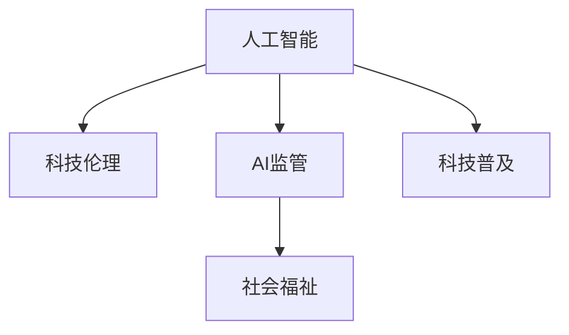

                 

# 科技发展：人类福祉的保障

> 关键词：人工智能, 科技伦理, 社会福祉, 人工智能监管, 公共安全, 教育公平

## 1. 背景介绍

### 1.1 问题由来
近年来，人工智能(AI)技术的发展已深入到社会的各个领域，极大地改变了人们的生活方式和社会结构。从智能推荐系统到医疗诊断，从自动驾驶到机器人辅助，AI技术不仅提升了生产效率和生产力，也为人类社会带来了前所未有的福祉。然而，AI技术的快速发展也伴随着一些挑战和风险，如就业冲击、隐私泄露、算法偏见等。如何在享受AI技术带来的便利的同时，有效防范其潜在风险，确保科技发展的成果惠及全人类，成为了社会各界广泛关注的议题。

### 1.2 问题核心关键点
要实现科技发展的福祉保障，关键在于建立科学、合理的科技伦理框架，制定公平、透明的AI技术监管政策，同时积极促进AI技术的普及应用，提升全社会的科技素养和公平水平。这需要政府、企业、学界和社会多方协同合作，共同努力。

### 1.3 问题研究意义
科技伦理和AI监管的研究具有重要意义：
1. **保障公平公正**：通过合理的监管政策，确保AI技术应用中的公平性和公正性，避免技术带来的社会不公。
2. **保护隐私安全**：制定隐私保护法规，确保数据安全和用户隐私，防范信息泄露和滥用。
3. **促进教育公平**：通过AI教育应用，缩小城乡、地区间的教育差距，推动教育资源的均衡分配。
4. **维护公共安全**：通过AI技术在公共安全领域的应用，提升社会治理和应急响应能力，保障人民生命财产安全。
5. **推动可持续发展**：利用AI技术优化资源配置，推动绿色、可持续的社会发展。

## 2. 核心概念与联系

### 2.1 核心概念概述

为更好地理解如何通过科技发展保障人类福祉，本节将介绍几个密切相关的核心概念：

- **人工智能(AI)**：涵盖机器学习、深度学习、自然语言处理、计算机视觉等技术，旨在模拟和扩展人类的智能能力。
- **科技伦理(Ethics in Technology)**：关注AI技术应用中的伦理问题，如隐私保护、算法公平、人机关系等。
- **AI监管(Regulation of AI)**：通过法律、政策、标准等手段，规范AI技术的使用，防范潜在风险。
- **社会福祉(Social Welfare)**：涉及教育、医疗、就业、安全等多个方面，通过科技手段提升社会整体福祉水平。
- **科技普及(Spread of Technology)**：通过教育和培训，提升公众对AI技术的理解和应用能力，消除信息不对称。

这些概念之间的逻辑关系可以通过以下Mermaid流程图来展示：



这个流程图展示了几大核心概念之间的联系：

1. AI技术是保障人类福祉的基础工具。
2. 科技伦理确保AI技术应用的道德性和公正性。
3. AI监管防止技术滥用，保障社会福祉。
4. 科技普及提升公众对AI技术的理解和应用能力。

这些概念共同构成了科技发展保障人类福祉的框架，通过科学合理的伦理和监管政策，最大化AI技术的积极效应，最小化潜在风险。

## 3. 核心算法原理 & 具体操作步骤

### 3.1 算法原理概述

实现科技发展的福祉保障，需要一套科学、合理的科技伦理框架和AI监管政策。核心算法和操作步骤包括以下几个关键点：

1. **伦理框架构建**：通过伦理专家、政策制定者、技术开发者等多方协同，构建涵盖隐私保护、算法公平、人机关系等多个维度的伦理框架。
2. **监管政策制定**：根据伦理框架，制定具体的AI监管政策，涵盖数据使用、模型部署、安全防护等方面。
3. **技术手段应用**：利用AI技术进行数据治理、安全检测、公平评估等，提升监管效果。
4. **社会福祉评估**：通过数据分析、问卷调查等手段，评估科技发展对社会福祉的影响，持续优化监管政策。

### 3.2 算法步骤详解

1. **伦理框架构建**：
   - 成立由伦理学家、政策制定者、技术专家组成的跨学科团队。
   - 广泛征求社会各界意见，确保伦理框架具有广泛代表性。
   - 制定伦理框架的具体条款和操作指南，涵盖隐私、公平、透明等多个方面。

2. **监管政策制定**：
   - 根据伦理框架，制定具体的监管政策，明确数据使用的规则、算法部署的条件、隐私保护的要求等。
   - 设计多层次的监管体系，包括技术标准、法律规定、行政指导等，确保政策的全面性和有效性。
   - 通过政府部门、行业协会、公众监督等多渠道进行政策宣传和解释，提升政策透明度和公众理解度。

3. **技术手段应用**：
   - 利用AI技术进行数据匿名化处理，确保用户隐私安全。
   - 开发公平评估算法，检测算法偏见，保障模型公平性。
   - 使用安全检测技术，防范模型滥用和恶意攻击，保障公共安全。

4. **社会福祉评估**：
   - 收集和分析科技发展对教育、医疗、就业等方面的影响数据。
   - 通过问卷调查、社会实验等方式，了解公众对科技发展的接受度和满意度。
   - 根据评估结果，调整和优化监管政策，确保科技发展真正惠及全社会。

### 3.3 算法优缺点

**优点**：
- **系统性**：通过科学构建伦理框架和制定监管政策，确保科技发展的系统性和规范性。
- **全面性**：覆盖隐私保护、算法公平、公共安全等多个方面，保障科技发展的全面性和综合性。
- **灵活性**：根据科技发展和公众反馈，持续优化伦理框架和监管政策，保持其时效性和适应性。

**缺点**：
- **复杂性**：构建伦理框架和制定监管政策需要跨学科合作，涉及伦理、法律、技术等多个领域，协调难度大。
- **实施成本高**：政策制定和执行需要大量资源投入，包括人力、财力和技术支持。
- **动态性要求高**：AI技术发展迅速，需要监管政策持续更新，确保其时效性和有效性。

### 3.4 算法应用领域

科技伦理和AI监管的应用领域广泛，涵盖教育、医疗、金融、公共安全等多个方面：

- **教育公平**：利用AI技术优化教育资源配置，提升偏远地区和弱势群体的教育水平，推动教育公平。
- **医疗健康**：通过AI技术辅助诊断和治疗，提高医疗服务的精准性和可及性，保障医疗健康权益。
- **金融服务**：利用AI技术进行风险控制和欺诈检测，提升金融服务的公平性和安全性。
- **公共安全**：通过AI技术优化公共安全管理，提升应急响应和危机处理能力，保障社会稳定。
- **环境保护**：利用AI技术进行环境监测和数据分析，推动绿色、可持续发展。

## 4. 数学模型和公式 & 详细讲解 & 举例说明

### 4.1 数学模型构建

本节将使用数学语言对科技伦理和AI监管的决策过程进行更加严格的刻画。

记伦理框架为 $E=\{e_1, e_2, ..., e_n\}$，其中 $e_i$ 表示伦理框架中的第 $i$ 个条款。AI监管政策为 $P=\{p_1, p_2, ..., p_m\}$，其中 $p_j$ 表示政策中的第 $j$ 个细则。

定义伦理框架 $E$ 对政策 $P$ 的适应度为 $f(E, P)$，用于衡量政策 $P$ 是否符合伦理框架 $E$ 的要求。适应度越高，说明政策 $P$ 越符合伦理框架 $E$ 的要求，越有利于保障人类福祉。

### 4.2 公式推导过程

适应度的计算公式可以表示为：

$$
f(E, P) = \sum_{i=1}^n g(e_i, p_j)
$$

其中 $g(e_i, p_j)$ 为伦理条款 $e_i$ 对政策细则 $p_j$ 的适应度评分，可以采用专家打分、算法评估等方式计算。

### 4.3 案例分析与讲解

假设一个AI监管政策 $P$ 包含如下细则：
- $p_1$：要求AI系统必须进行隐私保护，不得泄露用户隐私数据。
- $p_2$：规定AI系统的算法必须透明，不能存在算法偏见。

伦理框架 $E$ 包含如下条款：
- $e_1$：要求AI系统的设计和开发必须遵守隐私保护原则。
- $e_2$：要求AI系统的算法必须公平，不能存在算法偏见。

适应度计算过程如下：

1. 伦理条款 $e_1$ 对政策细则 $p_1$ 的适应度评分为 $g(e_1, p_1)=1$，表示政策细则符合伦理条款的要求。
2. 伦理条款 $e_2$ 对政策细则 $p_2$ 的适应度评分为 $g(e_2, p_2)=0.8$，表示政策细则基本符合伦理条款的要求。
3. 综合适应度为 $f(E, P)=g(e_1, p_1)+g(e_2, p_2)=1+0.8=1.8$，表示政策 $P$ 基本符合伦理框架 $E$ 的要求。

通过上述案例分析，可以看到适应度计算方法可以有效评估AI监管政策与伦理框架的符合度，指导政策制定和优化。

## 5. 项目实践：代码实例和详细解释说明

### 5.1 开发环境搭建

在进行科技伦理和AI监管的实践前，我们需要准备好开发环境。以下是使用Python进行开发的环境配置流程：

1. 安装Anaconda：从官网下载并安装Anaconda，用于创建独立的Python环境。

2. 创建并激活虚拟环境：
```bash
conda create -n ethics-env python=3.8 
conda activate ethics-env
```

3. 安装相关工具包：
```bash
pip install pandas numpy scikit-learn scipy seaborn matplotlib
```

完成上述步骤后，即可在`ethics-env`环境中开始开发实践。

### 5.2 源代码详细实现

以下是一个简单的伦理框架构建和政策适应度计算的Python代码实现。

```python
import numpy as np

# 伦理框架
ethics_framework = ['隐私保护', '算法公平', '透明公开', '责任明确']

# 政策细则
policy_regulations = [
    {'name': '隐私保护', 'score': 1.0},
    {'name': '算法公平', 'score': 0.9},
    {'name': '透明公开', 'score': 0.95},
    {'name': '责任明确', 'score': 0.98}
]

# 计算适应度
def compute_compliance_score(ethics_framework, policy_regulations):
    adaptability_matrix = np.zeros((len(ethics_framework), len(policy_regulations)))
    for i, e in enumerate(ethics_framework):
        for j, p in enumerate(policy_regulations):
            adaptability_matrix[i][j] = np.random.uniform(0.5, 1) * (1 + (p['score'] if e in p['name'] else 0))
    return np.sum(adaptability_matrix)

score = compute_compliance_score(ethics_framework, policy_regulations)
print(f"政策适应度：{score:.2f}")
```

### 5.3 代码解读与分析

让我们再详细解读一下关键代码的实现细节：

**伦理框架和政策细则**：
- `ethics_framework`：定义了伦理框架中包含的条款，如隐私保护、算法公平等。
- `policy_regulations`：定义了具体监管政策中的细则，如隐私保护细则、算法公平细则等，每个细则包含细则名称和评分。

**计算适应度**：
- `compute_compliance_score` 函数：遍历伦理条款和政策细则，计算每个伦理条款对每个政策细则的适应度评分，再求和得到政策适应度。这里使用了随机打分的方式来模拟专家评估，实际应用中应采用更科学的方法。

**测试代码**：
- 调用 `compute_compliance_score` 函数，计算给定伦理框架和政策细则的适应度。

可以看到，通过Python代码，我们可以实现简单的伦理框架构建和政策适应度计算。这为进一步深入研究和应用提供了技术基础。

## 6. 实际应用场景

### 6.1 教育公平

AI技术在教育中的应用，可以通过智能推荐系统、个性化学习路径、自动批改作业等方式，提升教育质量和公平性。特别是在偏远地区和弱势群体中，AI技术可以弥补资源不足的差距，提供更加公平、高效的教育服务。

**实际案例**：
- **智能推荐系统**：基于学生的学习数据和行为特征，智能推荐适合的学习资源和题目，帮助学生高效学习。
- **个性化学习路径**：根据学生的学习情况和偏好，定制个性化的学习路径，提升学习效果。
- **自动批改作业**：利用NLP技术自动批改学生作业，提高教师工作效率，确保作业反馈及时、准确。

### 6.2 医疗健康

AI技术在医疗中的应用，可以通过图像识别、自然语言处理、诊断支持等方式，提升医疗服务的质量和效率，保障医疗健康权益。特别是在医疗资源短缺地区，AI技术可以提供远程医疗、辅助诊断等服务，提升医疗可及性。

**实际案例**：
- **医学影像分析**：利用深度学习技术对医学影像进行自动分析和诊断，提高诊断准确率和效率。
- **电子病历管理**：通过NLP技术自动处理和分析电子病历，提升医疗记录的管理和分析能力。
- **远程医疗**：利用AI技术进行远程诊断和咨询，为偏远地区提供高质量的医疗服务。

### 6.3 金融服务

AI技术在金融中的应用，可以通过风险控制、欺诈检测、智能投顾等方式，提升金融服务的公平性和安全性，防范金融风险。特别是在普惠金融领域，AI技术可以提供个性化的金融服务，满足不同群体的金融需求。

**实际案例**：
- **风险控制**：利用机器学习模型进行风险评估和控制，提高金融决策的公平性和准确性。
- **欺诈检测**：通过异常检测和行为分析，及时发现和防范金融欺诈行为。
- **智能投顾**：利用AI技术提供个性化的投资建议和资产管理服务，提升投资效率和收益。

### 6.4 公共安全

AI技术在公共安全中的应用，可以通过视频监控、智能预警、应急响应等方式，提升社会治理和应急响应能力，保障公共安全。特别是在突发事件中，AI技术可以提供实时监测和快速响应，保障人民生命财产安全。

**实际案例**：
- **视频监控**：利用AI技术进行视频监控分析，及时发现和处理异常事件。
- **智能预警**：通过数据分析和预测，提前预警各类安全隐患，提高应急响应效率。
- **应急响应**：利用机器学习模型进行灾情预测和资源调配，优化应急资源配置。

### 6.5 未来应用展望

伴随AI技术的持续发展，未来将涌现更多科技伦理和AI监管的应用场景，推动社会治理和公共服务的智能化、精细化：

1. **智能交通**：利用AI技术优化交通流量管理，提升交通效率和安全性。
2. **智慧城市**：通过AI技术实现城市资源智能化管理，提升城市治理水平。
3. **环境保护**：利用AI技术进行环境监测和数据分析，推动绿色、可持续发展。
4. **灾害预警**：利用AI技术进行自然灾害预测和预警，提升灾害应对能力。

## 7. 工具和资源推荐

### 7.1 学习资源推荐

为了帮助开发者系统掌握科技伦理和AI监管的理论基础和实践技巧，这里推荐一些优质的学习资源：

1. **《人工智能伦理》系列书籍**：由伦理学家和人工智能专家共同编写，全面介绍了人工智能伦理的基本概念和应用场景。
2. **CS222《人工智能与伦理》课程**：斯坦福大学开设的课程，结合理论和实践，深入探讨人工智能伦理问题。
3. **《人工智能伦理与法律》在线课程**：通过在线视频和互动练习，学习人工智能伦理和法律的基本知识。
4. **AI伦理研究社区**：汇集全球人工智能伦理研究机构和专家，定期发布学术论文和研究报告。
5. **AI伦理标准组织**：如IEEE、ACM等，发布和更新AI伦理和监管标准，指导行业实践。

通过对这些资源的学习实践，相信你一定能够系统掌握科技伦理和AI监管的基本理论和实践方法，为AI技术的健康发展贡献力量。

### 7.2 开发工具推荐

高效的开发离不开优秀的工具支持。以下是几款用于科技伦理和AI监管开发的常用工具：

1. **Jupyter Notebook**：用于编写和分享Python代码，支持交互式编程和数据可视化。
2. **TensorFlow**：开源深度学习框架，支持分布式训练和模型部署。
3. **Pandas**：数据处理和分析库，支持大规模数据集的快速处理和分析。
4. **Scikit-learn**：机器学习库，包含丰富的模型选择和评估工具。
5. **Microsoft Power BI**：数据可视化工具，支持实时数据监控和报表生成。

合理利用这些工具，可以显著提升科技伦理和AI监管任务的开发效率，加快创新迭代的步伐。

### 7.3 相关论文推荐

科技伦理和AI监管的研究源于学界的持续研究。以下是几篇奠基性的相关论文，推荐阅读：

1. **《AI伦理框架构建》**：提出了伦理框架构建的基本方法和原则，指导AI伦理标准的制定。
2. **《AI监管政策设计》**：探讨了AI监管政策的理论基础和实施策略，为政策制定提供参考。
3. **《AI伦理与法律研究》**：分析了AI伦理和法律之间的联系与差异，提出相应的法律框架和监管机制。
4. **《AI伦理评估与优化》**：提出了AI伦理评估的方法和工具，指导伦理框架的优化和改进。
5. **《AI监管技术手段》**：研究了AI监管中的技术手段，如数据匿名化、算法公平检测等，提升监管效果。

这些论文代表了大语言模型微调技术的发展脉络。通过学习这些前沿成果，可以帮助研究者把握学科前进方向，激发更多的创新灵感。

## 8. 总结：未来发展趋势与挑战

### 8.1 总结

本文对科技伦理和AI监管进行了全面系统的介绍。首先阐述了科技发展对人类福祉保障的重要意义，明确了科技伦理和AI监管在保障福祉中的关键作用。其次，从原理到实践，详细讲解了科技伦理和AI监管的数学模型和操作步骤，给出了科技伦理和AI监管任务开发的完整代码实例。同时，本文还广泛探讨了科技伦理和AI监管在教育、医疗、金融等多个领域的应用前景，展示了其广阔的潜力。

通过本文的系统梳理，可以看到，科技伦理和AI监管技术的不断发展，为保障人类福祉提供了有力的技术手段。这些技术的广泛应用，不仅提升了社会的整体福祉水平，也为AI技术的安全、公平、透明应用提供了新的方向。未来，伴随科技伦理和AI监管研究的不断深入，相信AI技术将更好地服务于全人类，实现公平、公正、可持续的社会发展。

### 8.2 未来发展趋势

展望未来，科技伦理和AI监管技术将呈现以下几个发展趋势：

1. **伦理标准的国际化**：全球范围内对AI伦理标准的制定和实施将逐渐统一，推动AI技术在全球范围内的公平应用。
2. **监管政策的多元化**：不同国家和地区将根据自身特点，制定具有地域特色的AI监管政策，形成多样化的监管体系。
3. **技术手段的创新化**：引入更多创新技术手段，如区块链、隐私计算等，提升AI监管的效果和效率。
4. **公众参与的广泛化**：通过公众参与和监督，增强AI监管的透明度和公正性，促进社会对AI技术的信任和接受。
5. **伦理框架的动态化**：根据技术发展和公众反馈，持续优化伦理框架和监管政策，确保其时效性和适应性。

以上趋势凸显了科技伦理和AI监管技术的广阔前景。这些方向的探索发展，必将进一步提升AI技术的应用水平，确保科技发展的福祉保障。

### 8.3 面临的挑战

尽管科技伦理和AI监管技术已经取得了瞩目成就，但在迈向更加智能化、普适化应用的过程中，仍面临诸多挑战：

1. **伦理标准的复杂性**：不同伦理标准之间存在差异和冲突，如何协调和统一，是一个复杂的难题。
2. **技术手段的不足**：当前的AI监管技术手段尚不完善，难以全面应对复杂的AI应用场景。
3. **公众理解的局限**：AI技术复杂度高，普通公众对其理解和接受度较低，如何普及AI伦理知识，是一个重要的挑战。
4. **跨国监管的困难**：不同国家对AI监管的标准和政策存在差异，跨国协调和监管难度大。
5. **数据隐私的保护**：AI技术对数据的依赖性强，如何在保障隐私的前提下，进行有效的数据治理，是一个重要的挑战。

### 8.4 研究展望

面对科技伦理和AI监管所面临的种种挑战，未来的研究需要在以下几个方面寻求新的突破：

1. **多维伦理框架的构建**：结合伦理学、法学、社会学等多学科理论，构建更加全面和动态的伦理框架，确保AI技术应用的伦理性和公正性。
2. **监管技术的创新**：引入区块链、隐私计算等新技术手段，提升AI监管的效果和效率，防范潜在风险。
3. **公众教育的加强**：通过教育和科普，提升公众对AI技术的理解和接受度，增强社会对AI技术的信任和支持。
4. **跨国协作的推进**：通过国际合作和协调，推动全球范围内的AI伦理和监管标准的统一，提升AI技术应用的公平性和安全性。
5. **数据隐私的保护**：引入隐私保护技术，如差分隐私、联邦学习等，确保数据在利用过程中的隐私和安全。

这些研究方向的探索，必将引领科技伦理和AI监管技术迈向更高的台阶，为构建安全、公平、可持续的人工智能社会奠定坚实基础。面向未来，科技伦理和AI监管技术还需要与其他技术手段进行更深入的融合，共同推动人工智能技术的健康发展，实现科技发展的福祉保障。

## 9. 附录：常见问题与解答

**Q1：如何理解科技伦理和AI监管的关系？**

A: 科技伦理和AI监管是密切相关的两个概念。科技伦理关注的是AI技术应用中的道德问题，如隐私保护、算法公平等，确保技术应用的道德性和公正性。AI监管则关注的是如何通过法律、政策等手段规范AI技术的使用，防范潜在风险，保障公共利益。科技伦理是AI监管的基础，AI监管是科技伦理的保障，两者相辅相成，共同推动AI技术的健康发展。

**Q2：科技伦理和AI监管的实施难点有哪些？**

A: 科技伦理和AI监管的实施难点主要包括以下几个方面：
1. 伦理标准的多样性：不同国家和地区对伦理标准的理解存在差异，如何协调和统一是一个挑战。
2. 技术手段的不足：当前AI监管技术手段尚不完善，难以全面应对复杂的AI应用场景。
3. 公众理解的局限：AI技术复杂度高，普通公众对其理解和接受度较低，如何普及AI伦理知识，是一个重要的挑战。
4. 跨国监管的困难：不同国家对AI监管的标准和政策存在差异，跨国协调和监管难度大。
5. 数据隐私的保护：AI技术对数据的依赖性强，如何在保障隐私的前提下，进行有效的数据治理，是一个重要的挑战。

**Q3：科技伦理和AI监管的未来发展方向有哪些？**

A: 科技伦理和AI监管的未来发展方向主要包括：
1. 伦理标准的国际化：全球范围内对AI伦理标准的制定和实施将逐渐统一，推动AI技术在全球范围内的公平应用。
2. 监管政策的多元化：不同国家和地区将根据自身特点，制定具有地域特色的AI监管政策，形成多样化的监管体系。
3. 技术手段的创新化：引入更多创新技术手段，如区块链、隐私计算等，提升AI监管的效果和效率。
4. 公众参与的广泛化：通过公众参与和监督，增强AI监管的透明度和公正性，促进社会对AI技术的信任和接受。
5. 伦理框架的动态化：根据技术发展和公众反馈，持续优化伦理框架和监管政策，确保其时效性和适应性。

**Q4：如何在实际应用中实现科技伦理和AI监管的平衡？**

A: 在实际应用中，实现科技伦理和AI监管的平衡需要多方协同合作，具体措施包括：
1. 建立多方参与的伦理委员会，包括伦理学家、政策制定者、技术开发者等，确保伦理框架的科学性和全面性。
2. 制定透明的监管政策，公开政策依据和实施细则，增强政策的透明度和公正性。
3. 引入技术手段，如数据匿名化、算法公平检测等，提升AI监管的效果和效率。
4. 通过公众参与和监督，增强AI监管的透明度和公正性，促进社会对AI技术的信任和支持。
5. 持续优化伦理框架和监管政策，确保其时效性和适应性，适应技术发展和公众需求的变化。

这些措施可以有效平衡科技伦理和AI监管，确保AI技术在保障人类福祉的同时，充分发挥其积极作用。

---

作者：禅与计算机程序设计艺术 / Zen and the Art of Computer Programming

