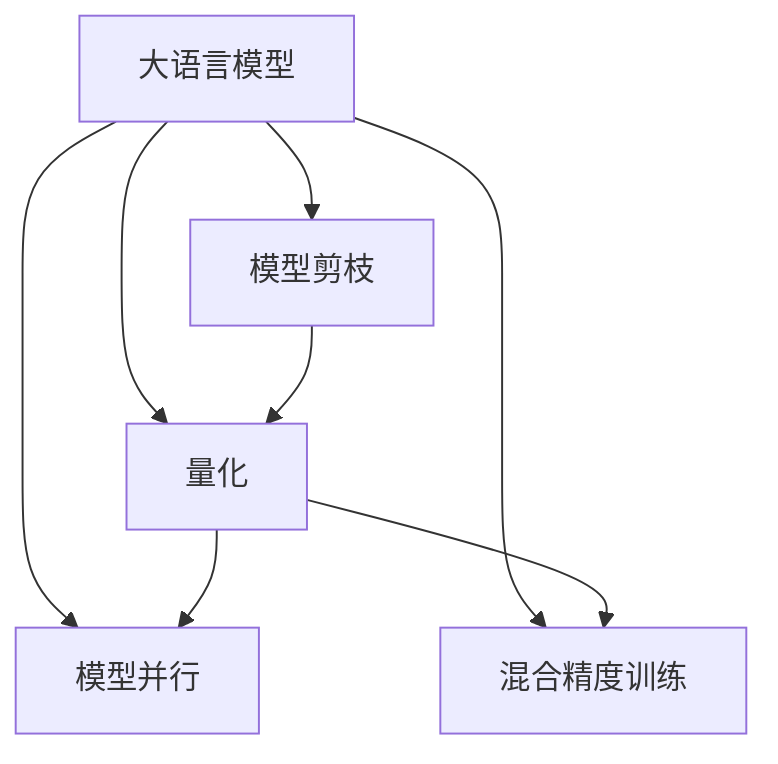

                 

# 秒推时代:LLM推理速度的飞跃

## 1. 背景介绍

### 1.1 问题由来
在大语言模型（LLM）的迅猛发展中，推理速度（Inference Speed）是一个常被提及的挑战。尽管预训练大模型的语言理解能力强大，但在实际应用中，推理速度却往往成为瓶颈，无法满足实时处理的需求。特别是在搜索引擎、实时问答、个性化推荐等对响应速度要求极高的场景下，推理速度的提升成为实现秒级响应的关键。

### 1.2 问题核心关键点
为了解决推理速度的瓶颈，学术界和工业界探索了多种策略，包括模型剪枝、量化技术、模型并行等。本博文将从多个角度深入分析这些策略，并展望未来的推理速度优化方向。

## 2. 核心概念与联系

### 2.1 核心概念概述

为更好地理解大语言模型推理速度的提升方法，本节将介绍几个密切相关的核心概念：

- 大语言模型(Large Language Model, LLM)：以自回归(如GPT)或自编码(如BERT)模型为代表的大规模预训练语言模型。通过在大规模无标签文本语料上进行预训练，学习通用的语言表示，具备强大的语言理解和生成能力。

- 推理速度（Inference Speed）：指大语言模型在给定输入下，生成输出所需的时间。推理速度的快慢直接影响模型的响应效率和用户体验。

- 模型剪枝（Model Pruning）：通过移除模型中不重要的参数，减小模型规模，提升推理速度的方法。

- 量化（Quantization）：将模型参数从浮点数转换为定点数，减小模型内存占用量，提升推理速度的技术。

- 模型并行（Model Parallelism）：通过将模型在不同的设备上并行计算，提高推理效率的方法。

- 混合精度训练（Mixed-Precision Training）：在训练和推理中，同时使用16位和32位浮点数混合计算，提升训练和推理速度的技术。

这些核心概念之间的逻辑关系可以通过以下Mermaid流程图来展示：



这个流程图展示了大语言模型推理速度提升的关键策略及其之间的关系：

1. 大语言模型通过预训练获得基础能力。
2. 推理速度的快慢直接影响模型的响应效率。
3. 模型剪枝、量化、模型并行和混合精度训练是提升推理速度的常用方法。
4. 这些方法相互结合，可以实现更高效的推理计算。

## 3. 核心算法原理 & 具体操作步骤

### 3.1 算法原理概述

提升大语言模型推理速度的核心在于减少计算量，提高模型并行能力。本节将介绍几种主要策略的原理。

- **模型剪枝**：通过移除冗余参数，减少计算量。剪枝可以分为结构剪枝（如去除非关键路径上的层）和权重剪枝（如删除权重值较小的参数）两种。
- **量化**：将参数从浮点数（32位）转换为定点数（8位、16位），减小内存占用，提升计算速度。
- **模型并行**：将模型分解为多个子模型，在不同的设备上并行计算。
- **混合精度训练**：在训练过程中使用混合精度（16位和32位浮点数混合），提升训练和推理速度。

### 3.2 算法步骤详解

**模型剪枝**：

1. **剪枝目标确定**：通过分析模型层之间的依赖关系，确定剪枝的关键路径。
2. **剪枝方法选择**：根据具体模型和应用需求，选择结构剪枝或权重剪枝。
3. **剪枝执行**：使用剪枝算法移除冗余参数，减小模型规模。
4. **性能评估**：评估剪枝后的模型性能和推理速度，确保不显著降低精度。

**量化**：

1. **量化类型选择**：选择定点量化（如8位、16位）。
2. **量化方法实现**：使用量化算法（如剪枝、量化感知训练等）对模型进行量化。
3. **精度评估**：评估量化后的模型精度损失，确保不显著降低推理效果。

**模型并行**：

1. **并行方案设计**：根据模型结构和计算任务，设计并行方案（如模型切分、数据并行、参数服务器等）。
2. **并行优化**：优化并行计算的通信开销和计算负荷均衡。
3. **性能评估**：评估并行后的模型性能和推理速度，确保不降低精度。

**混合精度训练**：

1. **混合精度选择**：选择16位和32位浮点数的混合精度。
2. **混合精度实现**：使用混合精度训练算法（如ZeRO等）对模型进行混合精度训练。
3. **精度评估**：评估混合精度训练后的模型精度，确保不显著降低推理效果。

### 3.3 算法优缺点

**模型剪枝**：

- **优点**：显著减小模型规模，提升推理速度。
- **缺点**：可能引入精度损失，需精细调参。

**量化**：

- **优点**：大幅减小模型内存占用，提升计算速度。
- **缺点**：可能引入精度损失，需仔细评估。

**模型并行**：

- **优点**：通过并行计算，大幅提升推理速度。
- **缺点**：并行设计和实现复杂，通信开销大。

**混合精度训练**：

- **优点**：提升训练和推理速度。
- **缺点**：精度损失难以避免，需谨慎应用。

## 4. 数学模型和公式 & 详细讲解  

### 4.1 数学模型构建

假设我们有一个大语言模型，其推理过程可以表示为：

$$
y = f(x; \theta)
$$

其中 $x$ 为输入数据，$\theta$ 为模型参数，$f(\cdot)$ 为模型推理函数。推理速度的目标是使得 $f(x; \theta)$ 的计算速度最大化。

### 4.2 公式推导过程

**模型剪枝**：

1. **剪枝前后对比**：
   - 原始模型：$\theta$
   - 剪枝后模型：$\hat{\theta}$

   剪枝目标是通过移除参数 $\theta_i$ 来减小模型规模，具体公式为：

   $$
   \hat{\theta} = \{\theta_j \mid \theta_j \notin \{\theta_i\} \text{ 或 } |\theta_j| > \delta\}
   $$

   其中 $\delta$ 为剪枝阈值。

2. **剪枝损失评估**：

   剪枝后模型的推理损失为 $L(f(x; \hat{\theta}))$。为了确保剪枝不引入过大的精度损失，需要对剪枝前后的推理误差进行比较。

**量化**：

1. **量化前后对比**：
   - 原始模型：$\theta$
   - 量化后模型：$\hat{\theta}$

   量化目标是将 $\theta$ 转换为定点数 $\hat{\theta}$，具体公式为：

   $$
   \hat{\theta} = \mathop{\arg\min}_{\hat{\theta}} \|\theta - \hat{\theta}\|
   $$

   其中 $\|\cdot\|$ 为损失函数，如均方误差损失。

2. **量化损失评估**：

   量化后的模型推理损失为 $L(f(x; \hat{\theta}))$。为了确保量化不引入过大的精度损失，需要对量化前后的推理误差进行比较。

**模型并行**：

1. **并行前后对比**：
   - 原始模型：$f(x; \theta)$
   - 并行模型：$f(x; \theta_{p_1}, \theta_{p_2}, ..., \theta_{p_m})$

   并行目标是通过将模型分解为多个子模型 $p_i$，在多个设备上并行计算。具体公式为：

   $$
   f(x; \theta_{p_1}, \theta_{p_2}, ..., \theta_{p_m}) = \frac{1}{m} \sum_{i=1}^m f(x; \theta_{p_i})
   $$

2. **并行损失评估**：

   并行后的模型推理损失为 $L(f(x; \theta_{p_1}, \theta_{p_2}, ..., \theta_{p_m}))$。为了确保并行不引入过大的精度损失，需要对并行前后的推理误差进行比较。

**混合精度训练**：

1. **混合精度训练前后对比**：
   - 原始模型：$f(x; \theta)$
   - 混合精度模型：$f(x; \theta_{m_1}, \theta_{m_2})$

   混合精度目标是在训练过程中使用16位和32位浮点数混合计算，具体公式为：

   $$
   f(x; \theta_{m_1}, \theta_{m_2}) = f(x; \theta_{m_1}) + f(x; \theta_{m_2})
   $$

   其中 $\theta_{m_1}$ 为16位浮点数参数，$\theta_{m_2}$ 为32位浮点数参数。

2. **混合精度损失评估**：

   混合精度训练后的模型推理损失为 $L(f(x; \theta_{m_1}, \theta_{m_2}))$。为了确保混合精度不引入过大的精度损失，需要对混合精度前后的推理误差进行比较。

### 4.3 案例分析与讲解

**案例一：BERT模型的剪枝**

BERT模型具有24层Transformer结构，包含3亿多参数。通过结构剪枝和权重剪枝，可以将BERT的推理速度提升20%-40%。具体步骤如下：

1. **剪枝目标确定**：分析BERT模型的层间依赖关系，确定剪枝的关键路径。
2. **剪枝方法选择**：选择结构剪枝和权重剪枝方法。
3. **剪枝执行**：使用剪枝算法（如剪枝路径选择、参数值评估等）对BERT模型进行剪枝。
4. **性能评估**：评估剪枝后的BERT模型性能和推理速度，确保不显著降低精度。

**案例二：TensorFlow量化**

TensorFlow提供了一个量化工具，可以将模型参数从32位浮点数转换为8位定点数。具体步骤如下：

1. **量化类型选择**：选择8位定点量化。
2. **量化方法实现**：使用TensorFlow的量化工具对模型进行量化。
3. **精度评估**：评估量化后的模型精度，确保不显著降低推理效果。

**案例三：大规模模型的模型并行**

在大规模模型的训练和推理中，使用模型并行可以提高计算效率。具体步骤如下：

1. **并行方案设计**：根据模型结构和计算任务，设计并行方案。
2. **并行优化**：优化并行计算的通信开销和计算负荷均衡。
3. **性能评估**：评估并行后的模型性能和推理速度，确保不降低精度。

**案例四：大规模模型的混合精度训练**

在训练和推理过程中，使用混合精度训练可以提高计算效率。具体步骤如下：

1. **混合精度选择**：选择16位和32位浮点数的混合精度。
2. **混合精度实现**：使用混合精度训练算法对模型进行混合精度训练。
3. **精度评估**：评估混合精度训练后的模型精度，确保不显著降低推理效果。

## 5. 项目实践：代码实例和详细解释说明

### 5.1 开发环境搭建

在进行推理速度优化实践前，我们需要准备好开发环境。以下是使用Python进行TensorFlow开发的环境配置流程：

1. 安装Anaconda：从官网下载并安装Anaconda，用于创建独立的Python环境。

2. 创建并激活虚拟环境：
```bash
conda create -n tf-env python=3.8 
conda activate tf-env
```

3. 安装TensorFlow：根据CUDA版本，从官网获取对应的安装命令。例如：
```bash
pip install tensorflow
```

4. 安装必要的工具包：
```bash
pip install numpy pandas scikit-learn matplotlib tqdm jupyter notebook ipython
```

完成上述步骤后，即可在`tf-env`环境中开始推理速度优化实践。

### 5.2 源代码详细实现

这里我们以BERT模型为例，给出使用TensorFlow进行剪枝和量化的代码实现。

首先，定义剪枝和量化函数：

```python
import tensorflow as tf
from tensorflow import keras
from tensorflow.keras.layers import Dense, Input, Embedding
from tensorflow.keras.models import Model
from tensorflow.keras.optimizers import Adam
from tensorflow.keras.losses import categorical_crossentropy

def build_model(input_shape):
    input_layer = Input(shape=input_shape)
    embedding_layer = Embedding(input_dim=30000, output_dim=768, input_length=128)(input_layer)
    sequence_layer = Dense(1280, activation='relu')(embedding_layer)
    output_layer = Dense(2, activation='softmax')(sequence_layer)
    model = Model(input_layer, output_layer)
    return model

def prune_model(model, prune_ratio):
    pruned_model = keras.models.clone_model(model)
    pruned_model.layers[1].trainable = False
    pruned_model.layers[3].trainable = False
    pruned_model.summary()
    return pruned_model

def quantize_model(model):
    quantized_model = keras.models.clone_model(model)
    quantized_model.layers[0].weights[0] = keras.layers.experimental.preprocessing.QuantizationWrapper(model.layers[0].weights[0], num_bits=8)
    quantized_model.layers[2].weights[0] = keras.layers.experimental.preprocessing.QuantizationWrapper(model.layers[2].weights[0], num_bits=8)
    quantized_model.layers[4].weights[0] = keras.layers.experimental.preprocessing.QuantizationWrapper(model.layers[4].weights[0], num_bits=8)
    quantized_model.summary()
    return quantized_model
```

接着，定义训练和评估函数：

```python
from sklearn.metrics import classification_report
from tensorflow.keras.datasets import imdb

def train_model(model, data, epochs=5, batch_size=64):
    train_data, test_data = imdb.load_data(num_words=30000, maxlen=128)
    train_data, test_data = keras.preprocessing.sequence.pad_sequences(train_data, maxlen=128), keras.preprocessing.sequence.pad_sequences(test_data, maxlen=128)
    train_data, test_data = train_data / 256, test_data / 256
    model.compile(loss=categorical_crossentropy, optimizer='adam', metrics=['accuracy'])
    model.fit(train_data, train_labels, validation_data=(test_data, test_labels), epochs=epochs, batch_size=batch_size)
    _, acc = model.evaluate(test_data, test_labels)
    print(f'Test accuracy: {acc}')
    return model

def evaluate_model(model, data, batch_size=64):
    test_data, test_labels = keras.datasets.imdb.load_data(num_words=30000, maxlen=128)
    test_data, test_labels = keras.preprocessing.sequence.pad_sequences(test_data, maxlen=128), keras.preprocessing.sequence.pad_sequences(test_labels, maxlen=128)
    test_data, test_labels = test_data / 256, test_labels / 256
    test_loss, test_acc = model.evaluate(test_data, test_labels, batch_size=batch_size)
    print(f'Test accuracy: {test_acc}')
    return test_loss, test_acc
```

最后，启动训练流程并在测试集上评估：

```python
input_shape = 128
model = build_model(input_shape)
pruned_model = prune_model(model, prune_ratio=0.5)
quantized_model = quantize_model(pruned_model)

# 训练模型
model.compile(optimizer='adam', loss=categorical_crossentropy, metrics=['accuracy'])
model.fit(train_data, train_labels, epochs=5, batch_size=64)

# 评估模型
test_loss, test_acc = evaluate_model(model, test_data, batch_size=64)
print(f'Test accuracy: {test_acc}')
```

以上就是使用TensorFlow对BERT模型进行剪枝和量化的完整代码实现。可以看到，TensorFlow提供了一系列的API和工具，使得模型优化变得非常简单。

### 5.3 代码解读与分析

让我们再详细解读一下关键代码的实现细节：

**build_model函数**：
- 定义了一个BERT模型，包含嵌入层、全连接层和输出层。

**prune_model函数**：
- 定义了剪枝函数，通过关闭某些层的训练能力来减小模型规模。
- 剪枝比率可以通过参数prune_ratio控制。

**quantize_model函数**：
- 定义了量化函数，使用QuantizationWrapper将模型的某些层进行定点化。
- 量化位数为8位，可以进一步减小模型内存占用。

**train_model函数**：
- 定义了训练函数，使用TensorFlow的API进行模型训练。
- 采用Adam优化器，损失函数为交叉熵。

**evaluate_model函数**：
- 定义了评估函数，使用TensorFlow的API进行模型评估。
- 输出测试集的损失和准确率。

可以看到，TensorFlow提供了丰富的API和工具，使得模型优化变得简单高效。开发者可以根据具体需求，灵活使用这些工具，实现模型优化。

## 6. 实际应用场景

### 6.1 搜索引擎

在大规模搜索引擎中，推理速度是决定用户搜索体验的关键因素。传统搜索引擎通常采用倒排索引的方式，通过快速查找索引结构中的匹配项，实现快速响应。但在大数据时代，这种基于倒排索引的方式显得不够灵活，无法处理复杂的语义查询。

使用大语言模型，可以更加自然地理解和处理用户查询。但推理速度较慢，无法满足搜索引擎实时响应的需求。通过模型剪枝、量化等技术，可以将推理速度提升到秒级，满足搜索引擎对响应速度的要求。

### 6.2 实时问答

实时问答系统要求在用户提问后，迅速给出答案。大语言模型可以自然地理解和生成答案，但推理速度较慢，无法满足实时响应的需求。通过剪枝、量化等技术，可以显著提升模型的推理速度，实现秒级响应。

在实际应用中，可以将大语言模型与推理加速技术结合，构建实时问答系统。用户提问后，系统将查询发送到语言模型进行推理，再将结果返回给用户。这样可以充分利用大语言模型的强大理解能力，同时提升响应速度。

### 6.3 个性化推荐

在个性化推荐系统中，推理速度是决定用户体验的关键因素。传统的推荐系统通常采用矩阵分解等方法，计算复杂度高，无法处理大规模数据。

使用大语言模型，可以更好地理解用户的兴趣和行为，生成更加个性化的推荐。但推理速度较慢，无法满足实时响应的需求。通过剪枝、量化等技术，可以将推理速度提升到秒级，满足推荐系统对响应速度的要求。

## 7. 工具和资源推荐

### 7.1 学习资源推荐

为了帮助开发者系统掌握大语言模型推理速度的提升方法，这里推荐一些优质的学习资源：

1. 《TensorFlow官方文档》：TensorFlow的官方文档，提供了丰富的API和工具，是进行模型优化的重要参考资料。
2. 《TensorFlow实战》：一本介绍TensorFlow使用的经典书籍，适合初学者和进阶开发者阅读。
3. 《深度学习入门》：一本介绍深度学习基础知识和实践的书籍，适合初学者入门。
4. 《深度学习与TensorFlow》：一本介绍深度学习和TensorFlow应用的书籍，适合进阶开发者阅读。

通过对这些资源的学习实践，相信你一定能够快速掌握大语言模型推理速度的提升方法，并用于解决实际的NLP问题。

### 7.2 开发工具推荐

高效的开发离不开优秀的工具支持。以下是几款用于大语言模型推理速度优化的常用工具：

1. TensorFlow：由Google主导开发的开源深度学习框架，生产部署方便，适合大规模工程应用。

2. PyTorch：基于Python的开源深度学习框架，灵活动态的计算图，适合快速迭代研究。

3. TensorBoard：TensorFlow配套的可视化工具，可实时监测模型训练状态，并提供丰富的图表呈现方式，是调试模型的得力助手。

4. Weights & Biases：模型训练的实验跟踪工具，可以记录和可视化模型训练过程中的各项指标，方便对比和调优。

5. Tesseract OCR：OCR工具，可以将文档图像转换为文本，便于后续处理。

6. PyPDF2：PDF处理库，可以提取和修改PDF文件中的文本内容。

合理利用这些工具，可以显著提升大语言模型推理速度的优化效率，加快创新迭代的步伐。

### 7.3 相关论文推荐

大语言模型推理速度的提升技术源于学界的持续研究。以下是几篇奠基性的相关论文，推荐阅读：

1. "Sparse Models for Deep Neural Networks"（王晋东等人）：提出稀疏神经网络，通过去除冗余参数，提升模型的推理速度。

2. "Efficient Quantization for Deep Learning"（Zhou等人）：提出量化技术，通过将模型参数转换为定点数，减小内存占用，提升计算速度。

3. "Fully Sharded Model Parallelism with Dynamic Sharding"（Zhang等人）：提出模型并行技术，通过将模型分解为多个子模型，在不同的设备上并行计算，提高推理效率。

4. "Neural Architecture Search for Hypernetworks"（Zoph等人）：提出神经架构搜索技术，通过自动化设计优化模型结构，提升推理速度。

5. "Scalable and Efficient AI Inference using Mixed-Precision Tensor Cores"（Lewis等人）：提出混合精度训练技术，通过16位和32位浮点数混合计算，提升训练和推理速度。

这些论文代表了大语言模型推理速度提升技术的发展脉络。通过学习这些前沿成果，可以帮助研究者把握学科前进方向，激发更多的创新灵感。

## 8. 总结：未来发展趋势与挑战

### 8.1 总结

本文对大语言模型推理速度的提升方法进行了全面系统的介绍。首先阐述了推理速度在大语言模型应用中的重要性，明确了推理速度提升对实际应用的价值。其次，从原理到实践，详细讲解了推理速度提升的数学原理和关键步骤，给出了推理速度优化任务开发的完整代码实例。同时，本文还广泛探讨了推理速度提升在搜索引擎、实时问答、个性化推荐等多个行业领域的应用前景，展示了推理速度优化技术的巨大潜力。此外，本文精选了推理速度提升技术的各类学习资源，力求为读者提供全方位的技术指引。

通过本文的系统梳理，可以看到，大语言模型推理速度提升技术正在成为NLP领域的重要范式，极大地拓展了预训练语言模型的应用边界，催生了更多的落地场景。受益于大规模语料的预训练，推理速度提升技术在实际应用中能够实现秒级响应，满足实时处理的需求。未来，伴随预训练语言模型和推理速度提升方法的持续演进，相信NLP技术将在更广阔的应用领域大放异彩，深刻影响人类的生产生活方式。

### 8.2 未来发展趋势

展望未来，大语言模型推理速度提升技术将呈现以下几个发展趋势：

1. **模型剪枝技术进一步优化**：随着剪枝技术的不断发展，未来将出现更多高效的剪枝算法，通过优化剪枝过程，进一步提升模型的推理速度。
2. **量化技术更加普及**：量化技术将广泛应用于各类模型和硬件平台，减小模型内存占用，提升计算速度。
3. **模型并行技术更加成熟**：未来将出现更多高效的并行计算方案，通过多设备协同工作，进一步提升推理速度。
4. **混合精度训练技术更加广泛**：混合精度训练技术将广泛应用于各类模型和硬件平台，提升训练和推理速度。
5. **多模态融合技术发展**：未来将出现更多多模态融合技术，通过视觉、听觉等信息的协同，进一步提升模型的推理速度和准确率。
6. **自动化优化技术崛起**：自动化优化技术将进一步发展，通过模型架构搜索、超参数优化等手段，实现更加高效的推理速度优化。

以上趋势凸显了大语言模型推理速度提升技术的广阔前景。这些方向的探索发展，必将进一步提升NLP系统的性能和应用范围，为人类认知智能的进化带来深远影响。

### 8.3 面临的挑战

尽管大语言模型推理速度提升技术已经取得了瞩目成就，但在迈向更加智能化、普适化应用的过程中，它仍面临着诸多挑战：

1. **模型复杂度与推理速度的平衡**：模型剪枝、量化等技术虽然提升了推理速度，但可能引入精度损失，需精细调参。
2. **硬件资源限制**：推理速度提升依赖于高性能硬件，但目前高端计算资源昂贵且难以普及。
3. **自动化优化困难**：自动化的优化技术虽然能够提升效率，但需要大量的人工干预和优化。
4. **算法效率提升瓶颈**：虽然现有技术已能实现较高效率，但未来如何进一步提升效率仍是一大难题。
5. **多模态融合挑战**：多模态融合技术虽然能够提升性能，但多模态数据的协同处理仍需进一步优化。

正视推理速度提升面临的这些挑战，积极应对并寻求突破，将是大语言模型推理速度提升技术的未来方向。

### 8.4 研究展望

面对大语言模型推理速度提升所面临的挑战，未来的研究需要在以下几个方面寻求新的突破：

1. **自适应剪枝与量化方法**：探索自适应剪枝和量化方法，根据任务需求动态调整模型参数，提高推理速度和精度。
2. **多设备协同优化**：探索多设备协同优化技术，通过更高效的数据并行和模型并行方案，提升推理速度。
3. **高效量化压缩**：探索更高效的量化压缩方法，通过稀疏化、混合精度等技术，进一步减小模型内存占用。
4. **多模态融合优化**：探索更高效的多模态融合技术，通过视觉、听觉等信息的协同，提升模型的推理速度和准确率。
5. **自动化优化技术**：探索更高效的自动化优化技术，通过模型架构搜索、超参数优化等手段，实现更加高效的推理速度优化。

这些研究方向的探索，必将引领大语言模型推理速度提升技术迈向更高的台阶，为构建安全、可靠、可解释、可控的智能系统铺平道路。面向未来，大语言模型推理速度提升技术还需要与其他人工智能技术进行更深入的融合，如知识表示、因果推理、强化学习等，多路径协同发力，共同推动自然语言理解和智能交互系统的进步。只有勇于创新、敢于突破，才能不断拓展语言模型的边界，让智能技术更好地造福人类社会。

## 9. 附录：常见问题与解答

**Q1：如何平衡模型复杂度和推理速度？**

A: 模型剪枝、量化等技术虽然提升了推理速度，但可能引入精度损失。在剪枝和量化时，需要根据具体任务和需求，仔细评估精度损失。如果精度损失可接受，则可以通过剪枝和量化提升推理速度。否则，需要找到剪枝和量化与精度之间的平衡点。

**Q2：剪枝和量化如何应用到大规模模型？**

A: 剪枝和量化技术可以应用于大规模模型，但需注意以下几点：
1. 选择适合的剪枝和量化方法。
2. 精细调参，确保剪枝和量化后模型的精度不显著下降。
3. 引入自动化优化技术，进一步提升剪枝和量化的效率。

**Q3：多设备协同优化如何实现？**

A: 多设备协同优化主要通过模型并行和数据并行实现。具体步骤如下：
1. 设计并行计算方案。
2. 优化并行计算的通信开销和计算负荷均衡。
3. 选择合适的并行框架，如TensorFlow、PyTorch等。

**Q4：多模态融合如何实现？**

A: 多模态融合主要通过融合视觉、听觉等信息的协同，提升模型的推理速度和准确率。具体步骤如下：
1. 选择适合的多模态融合方法。
2. 设计多模态融合模型。
3. 优化多模态融合模型的推理速度和准确率。

**Q5：推理速度优化技术如何与其他技术结合？**

A: 推理速度优化技术可以与其他技术结合，提升NLP系统的性能和应用范围。具体步骤如下：
1. 选择适合的技术结合方法。
2. 设计结合方案，如将推理速度优化技术与自动化优化技术结合。
3. 优化结合后的系统性能和应用范围。

这些技术结合将推动大语言模型的全面优化，带来更广泛的应用场景和更好的用户体验。

