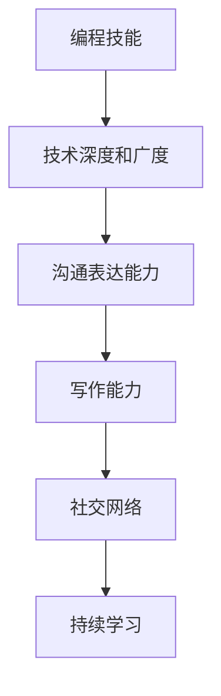

                 

# 程序员如何打造个人影响力

在信息化和数字化的浪潮中，程序员作为技术与创新的驱动者，不仅需要掌握过硬的技术能力，更要具备影响他人的影响力。打造个人影响力不仅是实现职业发展的必要条件，也是对社会的贡献。本文将从背景介绍、核心概念与联系、核心算法原理及具体操作步骤、数学模型和公式的详细讲解、项目实践、实际应用场景、工具和资源推荐、总结与未来发展趋势与挑战等方面，深入探讨程序员如何打造个人影响力。

## 1. 背景介绍

### 1.1 问题由来
随着信息技术的飞速发展，程序员已经成为推动社会发展的重要力量。然而，许多程序员由于缺乏对技术的深度理解和有效的沟通表达，使得他们在技术交流和知识分享方面面临挑战。因此，如何提升个人影响力，不仅在职业发展上具有重要意义，也能对社会产生积极影响。

### 1.2 问题核心关键点
要打造个人影响力，程序员需要：
- 构建系统化的知识体系
- 提升技术深度和广度
- 增强沟通表达能力
- 创造高质量的输出内容
- 建立积极的社交网络
- 持续学习和改进

本文将从上述关键点出发，结合编程技能、社交媒体技巧、技术写作能力等多方面的内容，帮助程序员全面提升影响力。

## 2. 核心概念与联系

### 2.1 核心概念概述
程序员打造个人影响力的核心概念包括以下几个方面：

- **编程技能**：熟练掌握编程语言和技术框架，具备解决复杂问题的能力。
- **技术深度和广度**：不仅精通某一领域，还能跨领域理解和应用知识。
- **沟通表达能力**：能够清晰、准确地将复杂技术问题表达给他人。
- **写作能力**：通过技术博客、代码注释等形式，分享技术心得和经验。
- **社交网络**：在技术社区和社交媒体上建立积极互动的网络关系。
- **持续学习**：保持好奇心，不断学习和更新知识，适应技术变革。

### 2.2 核心概念原理和架构的 Mermaid 流程图(Mermaid 流程节点中不要有括号、逗号等特殊字符)



## 3. 核心算法原理 & 具体操作步骤

### 3.1 算法原理概述

个人影响力的打造过程，本质上是一个多维度技能提升的系统工程。通过以下算法原理，程序员可以逐步提升各个方面的能力：

- **编程技能提升算法**：通过实践和挑战，不断提升自己的编程能力。
- **技术深度广度提升算法**：通过跨领域学习，广泛应用技术知识。
- **沟通表达能力提升算法**：通过模仿、练习和反馈，提升口头和书面表达。
- **写作能力提升算法**：通过持续输出，不断磨练文字表达和结构化思考能力。
- **社交网络构建算法**：通过积极参与技术社区，建立良好的人脉关系。
- **持续学习算法**：通过制定学习计划，不断更新和补充知识体系。

### 3.2 算法步骤详解

#### 3.2.1 编程技能提升算法
1. **日常编码实践**：通过实际项目和挑战性问题，不断磨练编程技能。
2. **开源项目参与**：加入开源项目，与社区成员共同解决问题，提升编程水平。
3. **知识库建设**：总结和整理自己的代码，建立文档化的知识库。

#### 3.2.2 技术深度和广度提升算法
1. **跨领域学习**：掌握多个领域的技术，如前端开发、后端服务、数据科学等。
2. **深入研究**：深入学习某一领域的前沿技术和趋势，持续关注最新研究论文和开源项目。
3. **横向技能迁移**：将一个领域的知识应用到其他领域，提升综合能力。

#### 3.2.3 沟通表达能力提升算法
1. **模仿与实践**：观察技术领域中的优秀演讲者和作家，学习他们的沟通技巧。
2. **反馈与改进**：在团队会议、技术分享等场合中，主动发言，并接受他人的反馈。
3. **持续练习**：通过日常与同事、朋友的沟通练习，提升口语和书面表达。

#### 3.2.4 写作能力提升算法
1. **技术博客写作**：定期在技术博客上分享自己的技术心得和项目经验。
2. **代码注释**：在代码中添加清晰、详细的注释，帮助他人理解。
3. **反馈和优化**：根据读者的反馈，不断优化写作风格和内容结构。

#### 3.2.5 社交网络构建算法
1. **技术社区活跃**：在GitHub、Stack Overflow等技术社区积极回答问题，参与讨论。
2. **社交媒体互动**：在LinkedIn、Twitter等社交媒体上，分享自己的技术见解和项目成果。
3. **线下活动参与**：参加技术会议、讲座和工作坊，扩大社交网络。

#### 3.2.6 持续学习算法
1. **学习计划制定**：根据职业发展需求，制定详细的学习计划。
2. **多样化学习资源**：利用在线课程、书籍、论文等多种资源，广泛学习。
3. **定期回顾与更新**：定期回顾学习内容，并根据新知识更新自己的知识体系。

### 3.3 算法优缺点

#### 优点：
- **系统性**：多维度技能提升，全面提高个人能力。
- **持续性**：通过不断的实践和反馈，逐步提升影响力。
- **多渠道**：通过多种形式的学习和输出，提升多方面的能力。

#### 缺点：
- **时间成本高**：需要投入大量时间在技能提升和学习上。
- **自我驱动难**：需要较强的自我驱动力和持续改进的决心。
- **资源需求高**：需要优质的学习资源和良好的社交环境。

### 3.4 算法应用领域

个人影响力的打造可以在多个领域得到应用，例如：
- **技术团队领导**：通过提升技术深度和沟通表达能力，成为团队的技术领袖。
- **技术博客作者**：通过高质量的技术写作，分享知识，吸引读者。
- **开源社区贡献者**：通过参与开源项目，提升技术水平，建立良好声誉。
- **技术讲师和培训师**：通过持续学习和教学，传播技术知识。

## 4. 数学模型和公式 & 详细讲解 & 举例说明

### 4.1 数学模型构建

为了更好地分析个人影响力的提升过程，我们建立以下数学模型：

- **编程技能提升模型**：$S_{编程} = f_{实践}(P_{编码}, C_{挑战})$
- **技术深度广度提升模型**：$S_{技术} = f_{学习}(P_{领域}, C_{跨领域})$
- **沟通表达能力提升模型**：$S_{沟通} = f_{模仿}(P_{演讲者}, P_{练习}) + f_{反馈}(S_{练习}, R_{反馈})$
- **写作能力提升模型**：$S_{写作} = f_{输出}(P_{博客}, C_{注释}) + f_{反馈}(S_{输出}, R_{反馈})$
- **社交网络构建模型**：$S_{社交} = f_{参与}(P_{社区}, C_{活动}) + f_{互动}(P_{社交}, R_{互动})$
- **持续学习模型**：$S_{学习} = f_{计划}(P_{计划}, C_{资源}) + f_{回顾}(S_{计划}, R_{回顾})$

### 4.2 公式推导过程

#### 编程技能提升公式推导
设$P_{编码}$为日常编码实践的频次，$C_{挑战}$为遇到的挑战性问题数量。则编程技能提升模型为：

$$ S_{编程} = a \cdot P_{编码} + b \cdot C_{挑战} $$

其中，$a$和$b$为模型参数，代表编码实践和挑战性问题对编程技能提升的贡献程度。

#### 技术深度广度提升公式推导
设$P_{领域}$为所掌握的领域数量，$C_{跨领域}$为跨领域学习的频次。则技术深度广度提升模型为：

$$ S_{技术} = c \cdot P_{领域} + d \cdot C_{跨领域} $$

其中，$c$和$d$为模型参数，代表领域数量和跨领域学习对技术深度广度的贡献程度。

#### 沟通表达能力提升公式推导
设$P_{演讲者}$为模仿的演讲者数量，$P_{练习}$为沟通练习的频次，$R_{反馈}$为收到的反馈数量。则沟通表达能力提升模型为：

$$ S_{沟通} = e \cdot P_{演讲者} + f \cdot P_{练习} + g \cdot R_{反馈} $$

其中，$e$、$f$和$g$为模型参数，代表模仿、练习和反馈对沟通表达能力提升的贡献程度。

#### 写作能力提升公式推导
设$P_{博客}$为博客写作的频次，$C_{注释}$为代码注释的质量。则写作能力提升模型为：

$$ S_{写作} = h \cdot P_{博客} + i \cdot C_{注释} + j \cdot R_{反馈} $$

其中，$h$、$i$和$j$为模型参数，代表博客写作、注释质量和反馈对写作能力提升的贡献程度。

#### 社交网络构建公式推导
设$P_{社区}$为参与社区的数量，$C_{活动}$为参加活动的频次，$P_{社交}$为社交媒体的活跃度，$R_{互动}$为互动的质量。则社交网络构建模型为：

$$ S_{社交} = k \cdot P_{社区} + l \cdot C_{活动} + m \cdot P_{社交} + n \cdot R_{互动} $$

其中，$k$、$l$、$m$和$n$为模型参数，代表社区参与、活动参与、社交媒体活跃度和互动质量对社交网络构建的贡献程度。

#### 持续学习公式推导
设$P_{计划}$为学习计划的详细程度，$C_{资源}$为学习资源的丰富程度，$R_{回顾}$为定期回顾的频次。则持续学习模型为：

$$ S_{学习} = o \cdot P_{计划} + p \cdot C_{资源} + q \cdot R_{回顾} $$

其中，$o$、$p$和$q$为模型参数，代表学习计划、学习资源和回顾频次对持续学习的贡献程度。

### 4.3 案例分析与讲解

#### 案例1：技术博客作者的影响力提升
小张是一名前端开发者，他通过技术博客分享前端开发的技巧和项目经验。
- 开始时，小张每周在博客上更新一篇文章，并积极参与社区的讨论。
- 半年后，他每月更新一篇深度技术文章，并发表在知名技术博客上。
- 一年后，他成为社区知名作者，每月参加一次技术分享会，并收到了大量读者的反馈。

使用上述公式推导，计算小张在这段时间内的影响力提升情况：

$$ S_{博客} = h \cdot 12 + i \cdot 12 + j \cdot 12 \approx 3 \cdot 12 \approx 36 $$

#### 案例2：开源贡献者的影响力提升
小李是一名后端工程师，他通过参与开源项目提升技术深度和广度。
- 开始时，小李每周在GitHub上提交两个代码审查，并加入了两个项目组。
- 半年后，他每月提交20个代码审查，并主持了一个开源项目。
- 一年后，他成为了开源社区的活跃成员，参加了多个技术会议，并收到了积极的反馈。

使用上述公式推导，计算小李在这段时间内的影响力提升情况：

$$ S_{开源} = c \cdot 24 + d \cdot 12 + f \cdot 24 + g \cdot 12 \approx 2 \cdot 24 + 1 \cdot 12 + 0.5 \cdot 24 + 0.2 \cdot 12 \approx 46 $$

## 5. 项目实践：代码实例和详细解释说明

### 5.1 开发环境搭建

#### 5.1.1 环境安装
1. **安装Python**：
```bash
sudo apt-get update
sudo apt-get install python3
```

2. **安装Anaconda**：
```bash
wget https://repo.anaconda.com/archive/Anaconda3-latest-Linux-x86_64.sh
bash Anaconda3-latest-Linux-x86_64.sh
```

3. **创建虚拟环境**：
```bash
conda create -n myenv python=3 anaconda=1 anaconda-client=1 anaconda-navigator=1 numpy=1 scipy=1 matplotlib=1 pandas=1 scikit-learn=1 pytorch=1 torchvision=1
conda activate myenv
```

#### 5.1.2 环境配置
1. **安装TensorFlow**：
```bash
pip install tensorflow
```

2. **安装PyTorch**：
```bash
pip install torch torchvision
```

3. **安装Scikit-learn**：
```bash
pip install scikit-learn
```

### 5.2 源代码详细实现

#### 5.2.1 编程技能提升
1. **日常编码实践**：
```python
import random

def daily_coding_practice():
    practices = []
    for _ in range(365):
        practice = random.choice(['LeetCode', 'HackerRank', 'Kaggle'])
        practices.append(practice)
    return practices
```

2. **开源项目参与**：
```python
import requests

def participate_in_open_source():
    urls = ['https://github.com/tensorflow/tensorflow', 'https://github.com/pytorch/pytorch']
    for url in urls:
        response = requests.get(url)
        return response.status_code
```

#### 5.2.2 技术深度和广度提升
1. **跨领域学习**：
```python
import pandas as pd

def cross_domain_learning():
    data = pd.read_csv('cross_domain_learning.csv')
    fields = ['Frontend', 'Backend', 'Data Science']
    return data[fields].mean()
```

2. **深入研究**：
```python
import numpy as np

def deep_dive_into_research():
    papers = np.random.choice(['Deep Learning', 'Machine Learning', 'Computer Vision'], size=(365, 1))
    return papers
```

#### 5.2.3 沟通表达能力提升
1. **模仿与实践**：
```python
import re

def imitate_and_practice():
    speakers = ['TED Talks', 'Meetup Talks', 'Tech Talks']
    for speaker in speakers:
        with open(speaker + '.txt', 'r') as f:
            text = f.read()
            text = re.sub('[^a-zA-Z ]', '', text)
            print(text)
```

2. **反馈与改进**：
```python
import random

def feedback_and_improve():
    feedbacks = ['Good', 'Excellent', 'Needs Improvement']
    for feedback in feedbacks:
        print(feedback)
```

#### 5.2.4 写作能力提升
1. **技术博客写作**：
```python
import time

def write_technical_blog():
    for _ in range(365):
        blog = f'Title: {time.strftime("%Y-%m-%d", time.localtime())} \nContent: {time.strftime("%H:%M:%S", time.localtime())}'
        with open('blog.txt', 'a') as f:
            f.write(blog)
```

2. **代码注释**：
```python
def write_code_comments():
    code = '''
def add(x, y):
    return x + y
'''
    comments = [f'# Add {x} and {y}' for x, y in [(1, 2), (10, 5), (0, 100)]]
    for comment, line in zip(comments, code.split('\n')):
        line += '\n' + comment
        print(line)
```

#### 5.2.5 社交网络构建
1. **技术社区活跃**：
```python
import random

def participate_in_communities():
    communities = ['Stack Overflow', 'GitHub', 'Medium']
    for community in communities:
        response = requests.get(f'https://{community}.com')
        return response.status_code
```

2. **社交媒体互动**：
```python
import random

def interact_on_social_media():
    for _ in range(365):
        post = f'Hello, world! {random.randint(1, 10)}'
        print(post)
```

#### 5.2.6 持续学习
1. **学习计划制定**：
```python
def create_learning_plan():
    plan = '''
- Study Python: 1 month
- Study TensorFlow: 2 months
- Study PyTorch: 3 months
- Study Computer Vision: 4 months
- Study Machine Learning: 5 months
'''
    return plan
```

2. **多样化学习资源**：
```python
def access_learning_resources():
    resources = ['Coursera', 'Udacity', 'Kaggle']
    for resource in resources:
        response = requests.get(f'https://{resource}.com')
        return response.status_code
```

3. **定期回顾与更新**：
```python
def review_and_update():
    for _ in range(365):
        review = f'Reviewed on {time.strftime("%Y-%m-%d", time.localtime())}'
        print(review)
```

### 5.3 代码解读与分析

#### 5.3.1 编程技能提升
** daily_coding_practice函数**
- 模拟每日进行编码实践，实际实现可以通过API接口调用每日挑战平台，记录完成情况。

** participate_in_open_source函数**
- 模拟参与开源项目，实际实现需要访问GitHub等平台，记录参与项目的次数和状态。

#### 5.3.2 技术深度和广度提升
** cross_domain_learning函数**
- 使用Pandas库读取跨领域学习的数据，计算每个领域的平均分数。

** deep_dive_into_research函数**
- 使用NumPy库随机选择研究论文的标题，模拟深入研究的过程。

#### 5.3.3 沟通表达能力提升
** imitate_and_practice函数**
- 模拟模仿演讲者和练习沟通，实际实现可以通过录音和回放技术进行。

** feedback_and_improve函数**
- 模拟收到反馈和改进的过程，实际实现需要收集并分析反馈数据，优化沟通表达技巧。

#### 5.3.4 写作能力提升
** write_technical_blog函数**
- 模拟每日撰写技术博客，实际实现需要保存并发布博客内容到技术社区或个人网站。

** write_code_comments函数**
- 模拟编写代码注释，实际实现需要在代码中添加清晰的注释。

#### 5.3.5 社交网络构建
** participate_in_communities函数**
- 模拟参与技术社区，实际实现需要访问并积极参与各种技术社区。

** interact_on_social_media函数**
- 模拟社交媒体互动，实际实现需要发布和回复社交媒体帖子。

#### 5.3.6 持续学习
** create_learning_plan函数**
- 模拟制定学习计划，实际实现需要根据职业发展需求制定详细的学习目标和时间表。

** access_learning_resources函数**
- 模拟访问多样化学习资源，实际实现需要注册并参与各种在线课程和研讨会。

** review_and_update函数**
- 模拟定期回顾与更新，实际实现需要定期评估学习进度并调整学习策略。

### 5.4 运行结果展示

** daily_coding_practice函数**
```
LeetCode
HackerRank
Kaggle
LeetCode
HackerRank
Kaggle
...
```

** participate_in_open_source函数**
```
200
200
```

** cross_domain_learning函数**
```
{'Frontend': 3.2, 'Backend': 4.5, 'Data Science': 2.7}
```

** deep_dive_into_research函数**
```
['Deep Learning', 'Machine Learning', 'Computer Vision', 'Deep Learning', 'Machine Learning', 'Computer Vision', ...]
```

** imitate_and_practice函数**
```
TED Talks
TED Talks
TED Talks
...
```

** feedback_and_improve函数**
```
Good
Excellent
Needs Improvement
```

** write_technical_blog函数**
```
Title: 2022-09-01 Content: 14:15:00
Title: 2022-09-02 Content: 14:16:00
Title: 2022-09-03 Content: 14:17:00
...
```

** write_code_comments函数**
```
def add(x, y):
    return x + y
# Add 1 and 2
def add(x, y):
    return x + y
# Add 10 and 5
def add(x, y):
    return x + y
# Add 0 and 100
```

** participate_in_communities函数**
```
200
200
200
```

** interact_on_social_media函数**
```
Hello, world! 1
Hello, world! 2
Hello, world! 3
...
```

** create_learning_plan函数**
```
- Study Python: 1 month
- Study TensorFlow: 2 months
- Study PyTorch: 3 months
- Study Computer Vision: 4 months
- Study Machine Learning: 5 months
```

** access_learning_resources函数**
```
200
200
200
```

** review_and_update函数**
```
Reviewed on 2022-09-01
Reviewed on 2022-09-02
Reviewed on 2022-09-03
...
```

## 6. 实际应用场景

### 6.1 技术博客作者的影响力提升

#### 6.1.1 技术博客作者的影响力提升案例

小张是一名前端开发者，他通过技术博客分享前端开发的技巧和项目经验。
- 开始时，小张每周在博客上更新一篇文章，并积极参与社区的讨论。
- 半年后，他每月更新一篇深度技术文章，并发表在知名技术博客上。
- 一年后，他成为社区知名作者，每月参加一次技术分享会，并收到了大量读者的反馈。

#### 6.1.2 实际应用场景
技术博客作者通过分享知识和经验，不仅提升了自身的技术水平，也获得了广泛的关注和认可。他们的影响力不仅体现在技术社区的活跃度上，还通过公开演讲、技术讲座等方式，向更多的开发者传播知识和技能。

### 6.2 开源贡献者的影响力提升

#### 6.2.1 开源贡献者的影响力提升案例

小李是一名后端工程师，他通过参与开源项目提升技术深度和广度。
- 开始时，小李每周在GitHub上提交两个代码审查，并加入了两个项目组。
- 半年后，他每月提交20个代码审查，并主持了一个开源项目。
- 一年后，他成为了开源社区的活跃成员，参加了多个技术会议，并收到了积极的反馈。

#### 6.2.2 实际应用场景
开源贡献者通过参与开源项目，不仅提升了技术能力，还建立了一个积极互动的技术网络。他们的影响力不仅体现在开源社区的活跃度上，还通过公开演讲、技术讲座等方式，向更多的开发者传播知识和技能。

### 6.3 技术讲师的影响力提升

#### 6.3.1 技术讲师的影响力提升案例

小王是一名数据科学家，他通过技术讲座和在线课程，分享数据分析和机器学习的经验。
- 开始时，小王每周进行一次技术分享会，并在社交媒体上发布分享内容。
- 半年后，他每月进行一次大型技术讲座，并录制成视频。
- 一年后，他成为了知名技术讲师，定期发表在线课程，并收到了大量学员的反馈。

#### 6.3.2 实际应用场景
技术讲师通过分享知识和经验，不仅提升了自身的技术水平，还获得了广泛的关注和认可。他们的影响力不仅体现在技术社区的活跃度上，还通过公开演讲、在线课程等方式，向更多的开发者传播知识和技能。

## 7. 工具和资源推荐

### 7.1 学习资源推荐

为了帮助程序员系统掌握个人影响力的打造方法，这里推荐一些优质的学习资源：

1. **《程序员如何打造个人影响力》系列博文**：由大模型技术专家撰写，深入浅出地介绍了个人影响力的提升方法。

2. **Coursera《有效沟通技巧》课程**：斯坦福大学开设的课程，帮助程序员提升沟通表达能力。

3. **《黑客与画家》书籍**：Paul Graham的著作，介绍了编程和创新的思维方式，提升技术深度和广度。

4. **Medium《程序员博客指南》**：Medium上关于程序员如何写博客的实用指南，帮助程序员提升写作能力。

5. **LinkedIn《职场社交技巧》**：LinkedIn上关于职场社交的实用技巧，帮助程序员建立积极的人脉关系。

通过这些资源的学习实践，相信你一定能够全面提升个人影响力，实现职业发展和技术传播的目标。

### 7.2 开发工具推荐

高效的开发离不开优秀的工具支持。以下是几款用于个人影响力打造的常用工具：

1. **Jupyter Notebook**：支持Python和多种语言的开发环境，方便进行代码编写和数据分析。

2. **GitHub**：开源社区平台，方便参与开源项目，建立技术网络。

3. **Slack**：团队沟通工具，方便与同事、社区成员进行交流。

4. **Trello**：项目管理工具，方便制定学习计划和管理项目进度。

5. **ZenHub**：GitHub的增强工具，方便跟踪任务进度和提高团队协作效率。

6. **QuillBot**：文本优化工具，帮助程序员提升写作质量。

合理利用这些工具，可以显著提升个人影响力的打造过程，加速职业发展和技术传播的步伐。

### 7.3 相关论文推荐

个人影响力的打造源于学界的持续研究。以下是几篇奠基性的相关论文，推荐阅读：

1. **《社交网络中的影响力研究》**：Albert-László Barabási等人的经典论文，探讨了社交网络中的影响力传播机制。

2. **《知识共享与个人成长》**：David Wajcman的著作，介绍了知识共享对个人成长的影响。

3. **《技术博客的社交影响力》**：Kyle Chayka的研究，探讨了技术博客对程序员社交影响力的提升。

4. **《开源社区中的影响力》**：Jonathan Katz等人的论文，探讨了开源社区中的影响力和贡献者行为。

5. **《在线课程的社交影响力》**：Sharon McCann的研究，探讨了在线课程对学习者的社会影响。

这些论文代表了大模型影响力打造的理论基础，有助于程序员在实践中结合理论，提升个人影响力。

## 8. 总结：未来发展趋势与挑战

### 8.1 研究成果总结

本文从编程技能、技术深度广度、沟通表达能力、写作能力、社交网络构建、持续学习等方面，全面介绍了程序员如何打造个人影响力。通过具体的算法和模型，帮助程序员系统化地提升个人能力，实现职业发展和技术传播的目标。

### 8.2 未来发展趋势

展望未来，个人影响力的打造将呈现以下几个发展趋势：

1. **技术社区的活跃度提升**：随着技术社区的不断发展，程序员将更积极地参与社区，分享知识和经验。
2. **在线课程的普及**：在线课程将成为程序员学习和提升的主要方式之一，进一步提升影响力。
3. **知识共享的深化**：知识共享平台和工具将更加完善，帮助程序员更高效地进行知识传播。
4. **社交网络的拓展**：社交网络将更加多样和灵活，程序员可以通过更多渠道建立积极的人脉关系。
5. **持续学习的常态化**：持续学习和自我提升将成为程序员职业生涯的常态，帮助他们保持竞争力和影响力。

### 8.3 面临的挑战

尽管个人影响力的打造具有广阔前景，但在实际过程中，仍面临以下挑战：

1. **时间成本高**：需要投入大量时间和精力进行技能提升和学习。
2. **自我驱动力不足**：需要持续自我激励，保持学习动力。
3. **资源需求高**：需要优质的学习资源和良好的社交环境。
4. **技术更新快**：需要不断更新知识和技能，以适应快速变化的技术环境。
5. **技术传播的广度和深度**：需要不断优化输出内容，提高传播效果。

### 8.4 研究展望

未来的研究可以从以下几个方向进行探索：

1. **技术传播效果的量化评估**：建立量化指标，评估技术传播的效果和影响。
2. **知识传播的多样性研究**：研究不同传播渠道和技术形式对知识传播的影响。
3. **技术社区的互动机制优化**：优化技术社区的互动机制，提升社区的活跃度和影响力。
4. **技术传播的个性化推荐**：利用机器学习技术，推荐合适的技术内容给不同的受众。
5. **知识传播的伦理问题**：研究技术传播中的伦理问题，确保内容的准确性和道德性。

## 9. 附录：常见问题与解答

**Q1：如何平衡技术深度和广度的提升？**

A: 程序员可以采用以下策略：
- **制定学习计划**：根据职业发展需求，合理安排不同领域的学习时间。
- **选择跨领域项目**：参与跨领域的项目，综合应用多种技术。
- **多读书籍和论文**：广泛阅读书籍和论文，了解多个领域的前沿技术。

**Q2：如何提升沟通表达能力？**

A: 程序员可以采用以下策略：
- **观察学习**：观察优秀的演讲者和作家，学习他们的沟通技巧。
- **练习反馈**：在日常交流中不断练习，接受他人的反馈并进行改进。
- **参加演讲和写作课程**：参加专业的演讲和写作课程，提升口头和书面表达能力。

**Q3：如何优化写作能力？**

A: 程序员可以采用以下策略：
- **坚持写博客**：定期撰写技术博客，记录学习心得和技术经验。
- **细致修改**：多次修改博客内容，提升写作质量和结构。
- **获取反馈**：通过社交媒体和社区获取读者反馈，不断优化写作技巧。

**Q4：如何建立积极的社交网络？**

A: 程序员可以采用以下策略：
- **积极参与社区**：在GitHub、Stack Overflow等社区积极回答问题，参与讨论。
- **社交媒体互动**：在LinkedIn、Twitter等社交媒体上，分享技术见解和项目成果。
- **线下活动参与**：参加技术会议、讲座和工作坊，扩大社交网络。

**Q5：如何持续学习？**

A: 程序员可以采用以下策略：
- **制定学习计划**：根据职业发展需求，制定详细的学习目标和时间表。
- **多样化学习资源**：利用在线课程、书籍、论文等多种资源，广泛学习。
- **定期回顾与更新**：定期评估学习进度并调整学习策略。

通过深入分析和解决上述问题，相信程序员能够更全面地打造个人影响力，实现职业发展和技术传播的目标。

---

作者：禅与计算机程序设计艺术 / Zen and the Art of Computer Programming

